#   C++

```c++
int __builtin_ffs(unsigned int x)
//返回x的最后一位1的是从后向前第几位，比如7368 (1110011001000) 返回4。
int __builtin_clz(unsigned int x)
//返回前导的0的个数。
int __builtin_ctz(unsigned int X)
//返回后面的0个个数，和__builtin_ctz相对。
int __builtin_popcount (unsigned int X)
//返回二进制表示中1的个数。
int __builtin_parity (unsigned int x)
//返回x的奇偶校验位，也就是x的1的个数模2的结果。
//此外，这些函数都有相应的usigned long和usigned long long版本,只需要在函数名后面加上I或I就可以了,比如__builtin_clzll
```

```C++
//reverse()对stl做翻转
//reserve()提前分配内存空间
//isdigit(c)检查字符c是否是数字
//isspace(c)检查字符c是否是空格
//to_string()数值转为string
//stoi() string转为int  stoll()转成long long类型
//next_permutation用于得到下一个排列，主要是暴力情况
//iota 递增序列填充
//nth_element(b.begin(), b.begin() + k, b.end()) b.beign()+k为第k+1个小的元素，小于b.begin()+k的fan
```

~~~c++
const double pi=atan(1)*4;

cout<<fixed<<setprecision(20);

//将浮点数p保留两位小数存入str
stringstream ss;
ss << std::setiosflags(std::ios::fixed) << std::setprecision(2) << p;
string str = ss.str();
~~~

~~~C++
//decltype的作用是获取变量的类型

//tuple是一个固定大小的不同类型值的集合
//make_tuple用于构造一个tuple、tuple_size用于获取tuple的参数个数、get获取tuple指定索引的值
tuple<TreeNode*, int, int> t;
TreeNode* r=get<0>(t);
int r=get<1>(t),c=get<2>(t);
~~~

~~~C++
string s;
cin>>s;//不会读入一行中的空格
getline(cin,s);//会读入一行中的空格
~~~

~~~C++
///2是向0取整，正数向下负数向上，>>是向下取整 
~~~

## 关键字与运算符

### 指针与引用

不存在指向空值的引⽤，但是存在指向空值的指针。

### define、typedef、inline 的区别

define： 可以⽤来防⽌头⽂件重复引⽤

typedef： 1. 有对应的数据类型，是要进⾏判断的 2. 是 在编译、运⾏的时候起作⽤ 3. 在静态存储区中分配空间，在程序运⾏过程中内存中只有⼀个拷⻉

inline是先将内联函数编译完成⽣成了函数体直接插⼊被调⽤的地⽅，减少了压栈，跳转和返回的操作。没有普通函数调⽤时的额外开销；

内联函数是⼀种特殊的函数，会进⾏类型检查；

对编译器的⼀种请求，编译器有可能拒绝这种请求；

C++中inline编译限制：

1. 不能存在任何形式的循环语句

2. 不能存在过多的条件判断语句

3. 函数体不能过于庞⼤

4. 内联函数声明必须在调⽤语句之前

### override 和 overload

override是重写（覆盖）了⼀个⽅法，以实现不同的功能，⼀般是⽤于⼦类在继承⽗类时，重写⽗类⽅法。

1.	重写⽅法的参数列表，返回值，所抛出的异常与被重写⽅法⼀致

2.	被重写的⽅法不能为private
3.	静态⽅法不能被重写为⾮静态的⽅法
4.	重写⽅法的访问修饰符⼀定要⼤于被重写⽅法的访问修饰符（public>protected>default>private）

overload是重载，这些⽅法的名称相同⽽参数形式不同。

### new 和 malloc

1、new内存分配失败时，会抛出bac_alloc异常，它不会返回NULL；malloc分配内存失败时返回NULL。

2、使⽤new操作符申请内存分配时⽆须指定内存块的⼤⼩，⽽malloc则需要显式地指出所需内存的尺⼨。   

3、operator new /operator delete可以被重载，⽽malloc/free并不允许重载。

4、new/delete会调⽤对象的构造函数/析构函数以完成对象的构造/析构。⽽malloc则不会 

5、malloc与free是C++/C语⾔的标准库函数,new/delete是C++的运算符

6、new操作符从⾃由存储区上为对象动态分配内存空间，⽽malloc函数从堆上动态分配内存。

### constexpr、const、static

constexpr 只能定义编译期常量，⽽ const 可以定义编译期常量，也可以定义运⾏期常量。

~~~C++
constexpr int *p = nullptr; //常量指针 顶层const 
const int *q = nullptr; //指向常量的指针， 底层const 
int *const q = nullptr; //顶层const
//对于const，左定值，右定向：指的是const在*的左还是右边
~~~

constexpr构造函数必须有⼀个空的函数体，即所有成员变量的初始化都放到初始化列表中。对象调⽤的成员函数必须使⽤ constexpr 修饰。

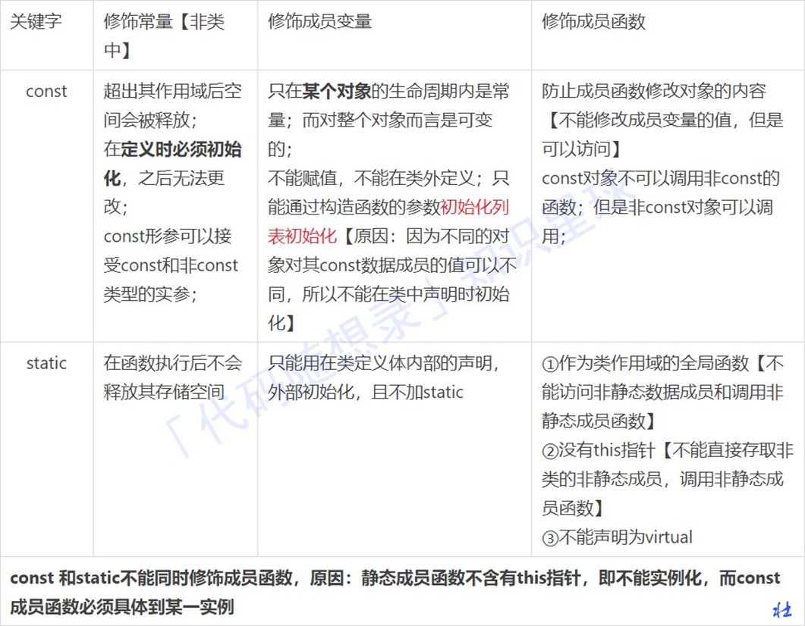

注意constexpr是比宏更为安全可靠

### Volatile

指令关键字，确保本条指令不会因编译器的优化⽽省略，且要求每次直接读值，保证对特殊地址的稳定访问

~~~C++
for(volatile int i=0; i<100000; i++); // 它会执⾏，不会被优化掉
~~~

### extern

声明外部变量【在函数或者⽂件外部定义的全局变量】

### 前置++与后置++

~~~C++
self &operator++() {
     node = (linktype)((node).next);
     return *this;
}
const self operator++(int) {
     self tmp = *this;
     ++*this;
     return tmp;
}
~~~

为了区分前后置，重载函数是以参数类型来区分，在调⽤的时候，编译器默默给int指定为⼀个0

1、为什么后置返回对象，⽽不是引⽤

因为后置为了返回旧值创建了⼀个临时对象，在函数结束的时候这个对象就会被销毁，如果返回引⽤，那么我请问 你？你的对象对象都被销毁了，你引⽤啥呢？ 

2、为什么后置前⾯也要加const 其实也可以不加，但是为了防⽌你使⽤i++++,连续两次的调⽤后置++᯿载符，为什么呢? 

原因： 它与内置类型⾏为不⼀致；你⽆法获得你所期望的结果，因为第⼀次返回的是旧值，⽽不是原对象，你调⽤两次后 置++，结果只累加了⼀次，所以我们必须⼿动禁⽌其合法化，就要在前⾯加上const。 

3、处理⽤户的⾃定义类型

最好使⽤前置++，因为他不会创建临时对象，进⽽不会带来构造和析构⽽造成的格外开销。

### std::atomic

问题：a++ 和 int a = b 在C++中是否是线程安全的？答案：不是

## 函数指针

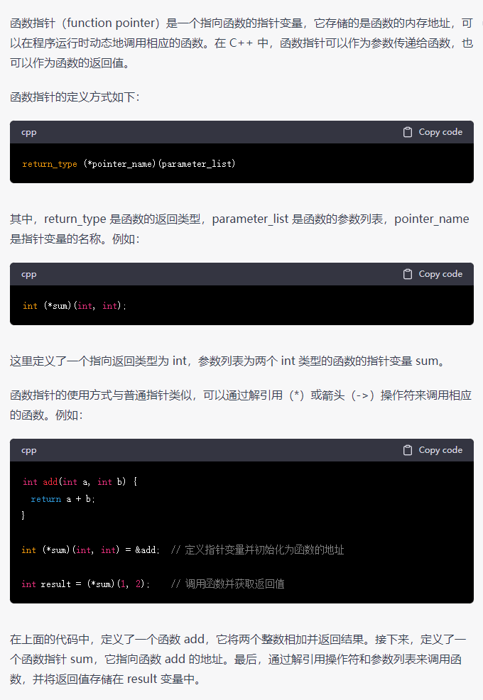

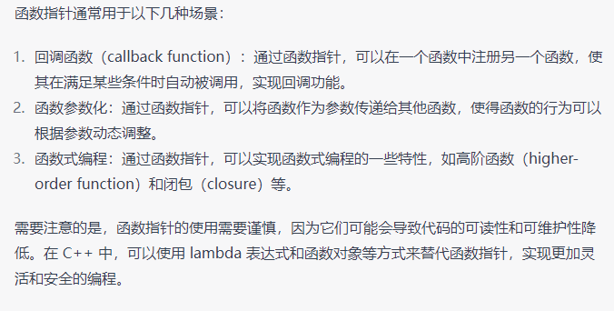


## C++三大特性

C++通过 public、protected、private 三个关键字来控制成员变量和成员函数的访问权限，它们分别表示公有的、受保护的、私有的，被称为成员访问限定符。

⽆论共有继承、私有和保护继承，私有成员不能被“派⽣类”访问，基类中的共有和保护成员能被“派⽣类”访问。

### 1. 继承

让某种类型对象获得另⼀个类型对象的属性和⽅法

常⻅的继承有三种⽅式：

1、实现继承：  指使⽤基类的属性和⽅法⽽⽆需额外编码的能⼒

2、接⼝继承：  指仅使⽤属性和⽅法的名称、但是⼦类必须提供实现的能⼒

**3、可视继承：  指⼦窗体（类）使⽤基窗体（类）的外观和实现代码的能⼒**

### 2. 封装

数据和代码捆绑在⼀起，避免外界⼲扰和不确定性访问;

把客观事物封装成抽象的类，并且类可以把⾃⼰的数据和⽅法只让可信的类或者对象操作，对不可信的进⾏信息隐 藏，例如：将公共的数据或⽅法使⽤public修饰，⽽不希望被访问的数据或⽅法采⽤private修饰。

### 3. 多态

同⼀事物表现出不同事物的能⼒，即向不同对象发送同⼀消息，不同的对象在接收时会产⽣不同的⾏为（重载实现 编译时多态，虚函数实现运⾏时多态）

实现多态有两种⽅式 

1. 覆盖（override）： 是指⼦类重新定义父类的虚函数的做法 

2. 重载（overload）： 是指允许存在多个同名函数，⽽这些函数的参数表不同（或许参数个数不同，或许参数 类型不同）

## 虚函数

当基类希望派⽣类定义适合⾃⼰的版本，就将这些函数声明成虚函数（virtual）。

1. 虚函数是动态绑定的
   也就是说，使⽤虚函数的指针和引⽤能够正确找到实际类的对应函数，⽽不是执⾏定义类的函数，这是虚函数的基本功能。

2. **多态（不同继承关系的类对象，调⽤同⼀函数产⽣不同⾏为）**

   * **调⽤函数的对象必须是指针或者引⽤**

   * **被调⽤的函数必须是虚函数（virtual），且完成了虚函数的重写（派⽣类中有⼀个跟基类的完全相同虚函数）**

3. 动态绑定绑定的是动态类型
   所对应的函数或属性依赖于对象的动态类型，发⽣在运⾏期。

4. 构造函数不能是虚函数
   在构造函数中调⽤虚函数，实际执⾏的是⽗类的对应函数，因为⾃⼰还没有构造好,  多态是被disable的。

5. 虚函数的⼯作⽅式
   依赖虚函数表⼯作的，表来保存虚函数地址，当我们⽤基类指针指向派⽣类时，虚表指针vptr指向派⽣类的虚函数表。 这个机制可以保证派⽣类中的虚函数被调⽤到。

6. **析构函数可以是虚函数，⽽且，在⼀个复杂类结构中，这往往是必须的。**

7. 将⼀个函数定义为纯虚函数。
   实际上是将这个类定义为抽象类，不能实例化对象；纯虚函数通常没有定义体，但也完全可以拥有。

8. inline, static, constructor三种函数都不能带有virtual关键字。
   （1）inline是在编译时展开，必须要有实体。
   （2）static属于class⾃⼰的类相关，必须有实体；

### 为什么需要虚继承

1. 为了解决多继承时的命名冲突和冗余数据问题 C++ 提出了虚继承，使得在派⽣类中只保留⼀份间接基类的成员。其中多继承（Multiple Inheritance）是指从多 个直接基类中产⽣派⽣类的能⼒，多继承的派⽣类继承了所有⽗类的成员。 

2. 虚继承的⽬的是让某个类做出声明，承诺愿意共享它的基类。其中，这个被共享的基类就称为虚基类（Virtual Base Class），其中A 就是⼀个虚基类。在这种机制下，不论虚基类在继承体系中出现了多少次，在派⽣类中都只包含⼀份虚基类的成员。 类 A 有⼀个成员变量a，不使⽤虚继承，那么在类 D 中直接访问 a 就会产⽣歧义。 编译器不知道它究竟来⾃ A -->B-->D 这条路径，还是来⾃ A-->C-->D 这条路径。

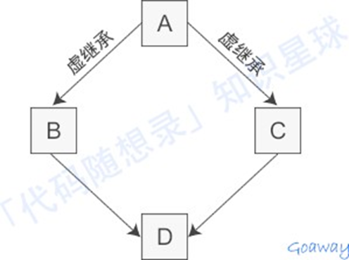

iostream 从 istream 和 ostream 直接继承⽽来，⽽ istream 和 ostream ⼜都继承⾃⼀个共同的名为 baseios 的 类，是典型的菱形继承。 此时 istream 和 ostream 必须采⽤虚继承，否则将导致 iostream 类中保留两份 baseios 类的成员。

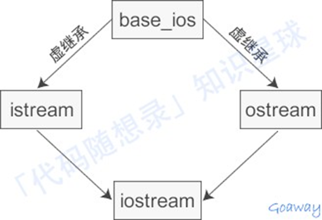

使⽤多继承经常出现⼆义性，必须十分小心；

⼀般只有在⽐较简单和不易出现⼆义性或者实在必要情况下才使⽤多继承，能⽤单⼀继承解决问题就不要⽤多继承。

## 空类

### 为何空类的大小不是0

为了确保两个不同对象的地址不同，必须如此。类的实例化是在内存中分配⼀块地址，每个实例在内存中都有独⼀⽆⼆的⼆地址。同样，空类也会实例化，所以编译器会给空类隐含的添加⼀个字节，这样空类实例化后就有独⼀⽆⼆的地址了。所以，空类的sizeof为1，⽽不是0。

~~~C++
class A{ virtual void f(){} };
class B:public A{}
~~~

此时，类A和类B都不是空类，其sizeof都是4，因为它们都具有虚函数表的地址。

~~~C++
class A{};
class B:public virtual A{};
~~~

此时，A是空类，其⼤⼩为1；B不是空类，其⼤⼩为4。因为含有指向虚基类的指针

多重继承的空类的⼤⼩也是1。

~~~C++
class Father1{}; 
class Father2{}; 
class Child:Father1, Father2{};
~~~

**何时共享虚函数地址表**

~~~C++
class X{}; //sizeof(X):1
class Y : public virtual X {}; //sizeof(Y):4 
class Z : public virtual X {}; //sizeof(Z):4 
class A : public virtual Y {}; //sizeof(A):8 
class B : public Y, public Z{}; //sizeof(B):8
class C : public virtual Y, public virtual Z {}; //sizeof(C):12 
class D : public virtual C{}; //sizeof(D):16
~~~

## 抽象类与接口的实现

接⼝描述了类的⾏为和功能，⽽不需要完成类的特定实现；C++接⼝是使⽤抽象类来实现的

1. 类中⾄少有⼀个函数被声明为纯虚函数，则这个类就是抽象类。纯虚函数是通过在声明中使⽤ "= 0" 来指定的。

2. 设计抽象类（通常称为 ABC）的⽬的，是为了给其他类提供⼀个可以继承的适当的基类。抽象类不能被⽤于实例化对象，它只能作为接⼝使⽤。

抽象基类定义了一组公共的接口，用于规范一类相关的对象或操作的行为。派生类可以继承抽象基类，并实现其中的纯虚函数，以定义自己的具体行为。由于派生类必须实现抽象基类中的纯虚函数，因此它们可以保证具有相同的接口，从而实现代码的复用和可扩展性。

除了纯虚函数外，抽象基类还可以包含实现函数、静态函数、静态变量等。但是，抽象基类不能被实例化，因此它们不能被直接用作对象的类型。相反，抽象基类通常被用作接口的类型，即通过指针或引用来访问对象的行为。

~~~C++
class Shape 
{
public:
	// 提供接⼝框架的纯虚函数 
	virtual int getArea() = 0;
	void setWidth(int w) 
	{
		width = w;
	}
	void setHeight(int h)
	{
		height = h;
	}
protected:
	int width; int height;
};
// 派⽣类
class Rectangle : public Shape
{
public:
	int getArea()
	{
		return (width * height);
	}
};

class Triangle : public Shape
{
public:
	int getArea()
	{
		return (width * height) / 2;
	}
};

// 主函数
Rectangle Rect;
Triangle Tri;

Rect.setWidth(5);
Rect.setHeight(7);
Rect.getArea(); //35

Tri.setWidth(5); 
Tri.setHeight(7);
Tri.getArea(); //17
~~~

## 友元函数

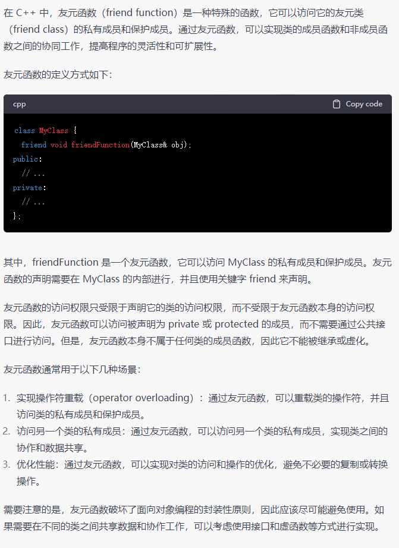

## 智能指针

### shared_ptr

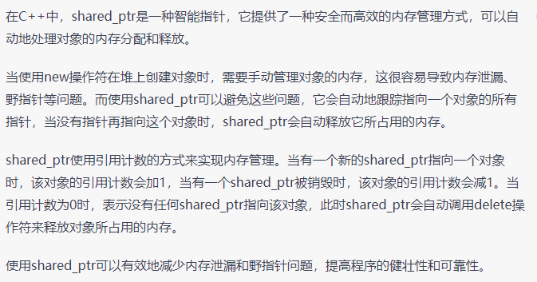

**1. shared_ptr的实现机制是在拷⻉构造时使⽤同⼀份引⽤计数**

（1）  ⼀个模板指针T* ptr

指向实际的对象

（2）  ⼀个引⽤次数

必须new出来的，不然会多个shared_ptr⾥⾯会有不同的引⽤次数⽽导致多次delete

（3）  重载operator*和operator->使得能像指针⼀样使⽤shared_ptr

（4）  重载copy constructor

使其引⽤次数加⼀（拷⻉构造函数)

（5）  重载operator=（赋值运算符）

如果原来的shared_ptr已经有对象，则让其引⽤次数减⼀并判断引⽤是否为零(是否调⽤delete)，然后将新的对象引⽤次数加⼀

（6）  重载析构函数

使引⽤次数减⼀并判断引⽤是否为零; (是否调⽤delete)

**2. 线程安全问题**

（1）  同⼀个shared_ptr被多个线程“读”是安全的;

（2）  同⼀个shared_ptr被多个线程“写”是不安全的;

证明：在多个线程中同时对⼀个shared_ptr循环执⾏两遍swap。 shared_ptr的swap函数的作⽤就是和另外⼀个 shared_ptr交换引⽤对象和引⽤计数，是写操作。执⾏两遍swap之后, shared_ptr引⽤的对象的值应该不变）

（3）  共享引⽤计数的不同的shared_ptr被多个线程“写”是安全的。

### unique_ptr

1. unique_pt“唯一”拥有其所指对象，同⼀时刻只能有⼀个unique_ptr指向给定对象，离开作⽤域时，若其指向对象，则将其所指对象销毁（默认delete）。

2. 定义unique_ptr时需要将其绑定到⼀个new返回的指针上。
3. unique_ptr不⽀持普通的拷⻉和赋值（因为拥有指向的对象）。但是可以拷⻉和赋值⼀个将要被销毁的unique_ptr；可以通过release或者reset将指针所有权从⼀个（⾮const）unique_ptr转移到另⼀个unique。

### weak_ptr

1. weak_ptr是为了配合shared_ptr⽽引⼊的⼀种智能指针
   它的最⼤作⽤在于协助shared_ptr⼯作，像旁观者那样观测资源的使⽤情况，但weak_ptr没有共享资源，它的构造不会引起指针引⽤计数的增加。
2. 和shared_ptr指向相同内存
   shared_ptr析构之后内存释放，在使⽤之前使⽤函数lock()检查weak_ptr是否为空指针。

## C++强制类型转换

关键字：static_cast、dynamic_cast、reinterpret_cast和 const_cast

### static_cast

没有运⾏时类型检查来保证转换的安全性
进⾏上⾏转换（把派⽣类的指针或引⽤转换成基类表示）是安全的
进⾏下⾏转换（把基类的指针或引⽤转换为派⽣类表示），由于没有动态类型检查，所以是不安全的。
使⽤：

1.	⽤于基本数据类型之间的转换，如把int转换成char。
2.	把任何类型的表达式转换成void类型。

### dynamic_cast

在进⾏下⾏转换时，dynamic_cast具有类型检查（信息在虚函数中）的功能，⽐static_cast更安全。转换后必须是类的指针、引⽤或者void*，基类要有虚函数，可以交叉转换。
dynamic本身只能⽤于存在虚函数的⽗⼦关系的强制类型转换；对于指针，转换失败则返回nullptr，对于引⽤，转换失败会抛出异常。

### reinterpret_cast

可以将整型转换为指针，也可以把指针转换为数组；可以在指针和引⽤⾥进⾏肆⽆忌惮的转换，平台移植性⽐价差。

### const_cast

常量指针转换为⾮常量指针，并且仍然指向原来的对象。常量引⽤被转换为⾮常量引⽤，并且仍然指向原来的对象。去掉类型的const或volatile属性。

## 内存泄漏

1、 什么是内存泄露?

内存泄漏(memory leak)是指由于疏忽或错误造成了程序未能释放掉不再使⽤的内存的情况。内存泄漏并非指内存在物理上的消失，⽽是应⽤程序分配某段内存后，由于设计错误，失去了对该段内存的控制，因⽽造成了内存的浪费。可以使⽤Valgrind, mtrace进⾏内存泄漏检查。

2、内存泄漏的分类

（1）堆内存泄漏 （Heap leak）

对内存指的是程序运⾏中根据需要分配通过malloc,realloc  new等从堆中分配的⼀块内存，再是完成后必须通过调
⽤对应的 free或者 delete 删掉。如果程序的设计的错误导致这部分内存没有被释放，那么此后这块内存将不会被使⽤，就会产⽣ Heap Leak.

（2）系统资源泄露（Resource Leak）

主要指程序使⽤系统分配的资源⽐如 Bitmap,handle ,SOCKET 等没有使⽤相应的函数释放掉，导致系统资源的浪费，严重可导致系统效能降低，系统运⾏不稳定。

（3）未将基类的析构函数定义为虚函数

当基类指针指向⼦类对象时，如果基类的析构函数不是 virtual，那么⼦类的析构函数将不会被调⽤，⼦类的资源没有正确释放，因此造成内存泄露。

3、什么操作会导致内存泄露?

指针指向改变，未释放动态分配内存。

4、如何防⽌内存泄露?

将内存的分配封装在类中，构造函数分配内存，析构函数释放内存；使⽤智能指针

5、智能指针有了解哪些?

智能指针是为了解决动态分配内存导致内存泄露和多次释放同⼀内存所提出的，C11标准中放在< memory>头⽂件。包括:共享指针，独占指针，弱指针

6、构造函数，析构函数要设为虚函数吗，为什么？

（1）析构函数

析构函数需要。当派⽣类对象中有内存需要回收时，如果析构函数不是虚函数，不会触发动态绑定，只会调⽤基类析构函数，导致派⽣类资源⽆法释放，造成内存泄漏。

（2）构造函数

构造函数不需要，没有意义。虚函数调⽤是在部分信息下完成⼯作的机制，允许我们只知道接⼝⽽不知道对象的确切类型。 要创建⼀个对象，你需要知道对象的完整信息。 特别是，你需要知道你想要创建的确切类型。 因此，构造函数不应该被定义为虚函数

## 进程的地址空间分布 

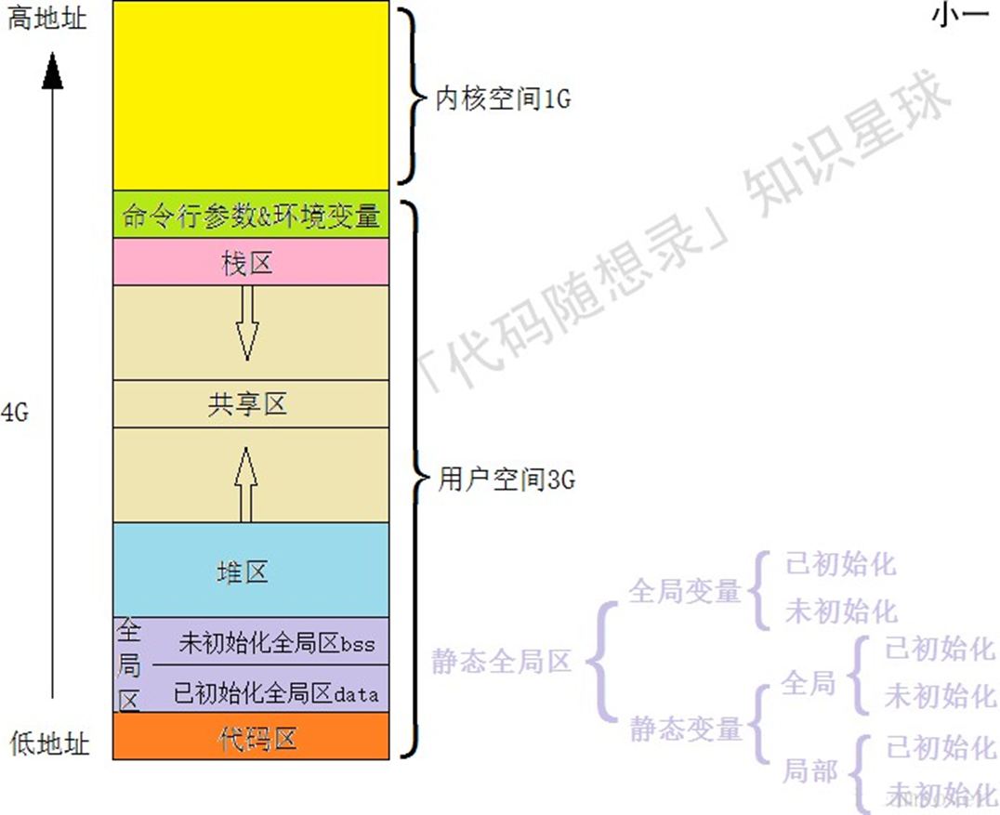

如上图，从⾼地址到低地址，⼀个程序由命令⾏参数和环境变量、栈、⽂件映射区、堆、BSS段、数据段、代码段组成。

（1）  命令⾏参数和环境变量

命令⾏参数是指从命令⾏执⾏程序的时候，给程序的参数。

（2）  栈区

存储局部变量、函数参数值。栈从⾼地址向低地址增⻓。是⼀块连续的空间。

（3）  ⽂件映射区位于堆和栈之间。

（4）  堆区

动态申请内存⽤。堆从低地址向⾼地址增⻓。

（5）  BSS 段

存放程序中未初始化的 全局变量和静态变量 的⼀块内存区域。

（6）  数据段

存放程序中已初始化的 全局变量和静态变量 的⼀块内存区域。

（7）  代码段

存放程序执⾏代码的⼀块内存区域。只读，代码段的头部还会包含⼀些只读的常数变量。

7、说⼀说C与C++的内存分配⽅式

（1）从静态存储区域分配

内存在程序编译的时候就已经分配好，这块内存在程序的整个运⾏期间都存在，如全局变量，static变量。

（2）在栈上创建

在执⾏函数时，函数内局部变量的存储单元都可以在栈上创建，函数执⾏结束时这些存储单元⾃动被释放。栈内存分配运算内置于处理器的指令集中，效率很⾼，但是分配的内存容量有限。

（3）从堆上分配(动态内存分配)

程序在运⾏的时候⽤malloc或new申请任意多少的内存，程序员负责在何时⽤free或delete释放内存。动态内存的⽣存期⾃⼰决定，使⽤⾮常灵活。

8、new、delete、malloc、free关系

如果是带有⾃定义析构函数的类类型，⽤ new [] 来创建类对象数组，⽽⽤ delete来释放会发⽣什么？

~~~C++
class A {};
A* pAa = new A[3]; 
delete pAa;
~~~


那么 delete pAa; 做了两件事：
1.	调⽤⼀次 pAa 指向的对象的析构函数
2.	调⽤ operator delete(pAa);释放内存

显然，这⾥只对数组的第⼀个类对象调⽤了析构函数，后⾯的两个对象均没调⽤析构函数，如果类对象中申请了⼤量的内存需要在析构函数中释放，⽽你却在销毁数组对象时少调⽤了析构函数，这会造成内存泄漏。

**第二点中直接释放pAa指向的内存空间，这是一个不确定的行为，不同的底层实现会导致程序释放不同的类对象数量**

## 计算机中的乱序执行

1、⼀定会按正常顺序执⾏的情况

1）对同⼀块内存进⾏访问，此时访问的顺序不会被编译器修改

2）新定义的变量的值依赖于之前定义的变量，此时两个变量定义的顺序不会被编译器修改

2、其他情况计算机会进⾏乱序执⾏

单线程的情况下允许，但是多线程情况下就会产⽣问题

3、C++中的库中提供了六种内存模型，⽤于在多线程的情况下防⽌编译器的乱序执⾏

（1）	memory_order_relaxed最放松的
（2）	memory_order_consume
当客户使⽤，搭配release使⽤，被release进⾏赋值的变量y，获取的时候如果写成consume，那么所有与y有关的变量的赋值⼀定会被按顺序进⾏
（3）	memory_order_acquire
⽤于获取资源
（4）	memory_order_release
⼀般⽤于⽣产者，当给⼀个变量y进⾏赋值的时候，只有⾃⼰将这个变量释放了，别⼈才可以去读，读的时候如果使⽤acquire来读，编译器会保证在y之前被赋值的变量的赋值都在y之前被执⾏，相当于设置了内存屏障
（5）	memory_order_acq_rel（acquire/release）
（6）	memory_order_seq_cst（squentially  consistent）
好处：不需要编译器设置内存屏障，morden  c++开始就会有底层汇编的能⼒

## 副作用

1、⽆副作⽤编程

存在⼀个函数，传⼀个参数x进去，⾥⾯进⾏⼀系列的运算，返回⼀个y。中间的所有过程都是在栈中进⾏修改
2、有副作⽤编程

⽐如在⼀个函数运⾏的过程中对全局变量进⾏了修改或在屏幕上输出了⼀些东⻄。此函数还有可能是类的成员⽅法，在此⽅法中如果对成员变量进⾏了修改，类的状态就会发⽣改变

3、在多线程情况下的有副作⽤编程

在线程1运⾏的时候对成员变量进⾏了修改，此时如果再继续运⾏线程2，此时线程2拥有的就不是这个类的初始状态，运⾏出来的结果会收到线程1的影响
解决办法：将成员⽅法设为const，此时就可以放⼼进⾏调⽤

## 信号量

1、binary_semaphore

定义：

可以当事件来⽤，只有有信号和⽆信号两种状态，⼀次只能被⼀个线程所持有。

使⽤步骤：
（1）	初始创建信号量，并且⼀开始将其置位成⽆信号状态std::binary_semaphore sem(0)

（2）	线程使⽤acquire()⽅法等待被唤醒

（3）	主线程中使⽤release()⽅法，将信号量变成有信号状态

2、counting_semaphore

定义：

⼀次可以被很多线程所持有，线程的数量由⾃⼰指定

使⽤步骤：

（1）	创建信号量

指定⼀次可以进⼊的线程的最⼤数量，并在最开始将其置位成⽆信号状态：std::biinary_semaphore<8>  sem(0);

（2）	主线程中创建10个线程
并且这些线程全部调⽤acquire()⽅法等待被唤醒。但是主线程使⽤release(6)⽅法就只能随机启⽤6个线程。

## future库

⽤于任务链（即任务A的执⾏必须依赖于任务B的返回值）

1、例⼦：⽣产者消费者问题

（1）	⼦线程作为消费者
参数是⼀个future，⽤这个future等待⼀个int型的产品：std::future& fut
（2）	⼦线程中使⽤get()⽅法等待⼀个未来的future，返回⼀个result
（3）	主线程作为⽣产者,做出⼀个承诺：std::promise prom
（4）	⽤此承诺中的get_future()⽅法获取⼀个future
（5）	主线程中将⼦线程创建出来,并将刚刚获取到的future作为参数传⼊
（6）	主线程做⼀些列的⽣产⼯作,最后⽣产完后使⽤承诺中的set_value()⽅法，参数为刚刚⽣产出的产品
（7）	此时产品就会被传到⼦线程中,⼦线程就可以使⽤此产品做⼀系列动作
（8）	最后使⽤join()⽅法等待⼦线程停⽌,但是join只适⽤于等待没有返回值的线程的情况

2、如果线程有返回值

（1）	使⽤async⽅法可以进⾏异步执⾏
参数⼀：  可以选择是⻢上执⾏还是等⼀会执⾏（即当消费者线程调⽤get()⽅法时才开始执⾏）
参数⼆：  执⾏的内容（可以放⼀个函数对象或lambda表达式）
（2）	⽣产者使⽤async⽅法做⽣产⼯作并返回⼀个future
（3）	消费者使⽤future中的get（）⽅法可以获取产品

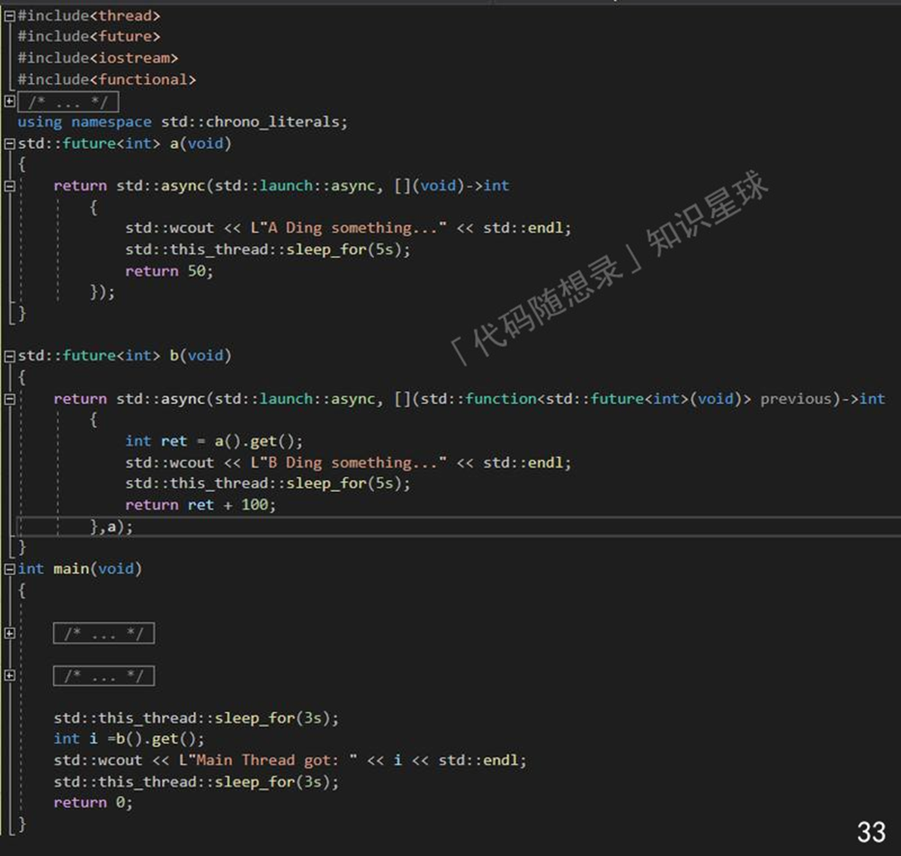

## 运算符重载

重载运算符函数，本质还是函数调⽤，所以重载后：

（1）以调⽤运算符的⽅式调⽤，data1+data2
（2）调⽤函数的⽅式，operator+(data1, data2)，这就要注意运算符函数的名字是“operator运算符”

不建议重载：
逗号、取地址，本身就对类类型有特殊定义；逻辑与、逻辑或，有短路求值属性；逗号、逻辑与、或，定义了求值顺序。

运算符重载应该是作为类的成员函数or⾮成员函数。

注意：

重载运算符，**它本身是⼏元就有⼏个参数**，对于⼆元的，第⼀个参数对应左侧运算对象，第⼆个参数对应右侧运算对象。⽽类的成员函数的第⼀个参数隐式绑定了this指针，所以重载运算符如果是类的成员函数，左侧运算对象就相当于固定了是this。

**⼀些规则：**

（1）  算术和关系运算符建议⾮成员

因为这些运算符是对称性的，形参都是常量引⽤

（2）  赋值运算符必须成员。复合赋值运算符建议成员

（3）  下标运算符必须成员

返回访问元素的引⽤，建议两版本（常量、⾮常量）

（4）  递增递减运算符，建议成员

因其会改变对象状态，后置与前置的区分——接受⼀个额外的不被使⽤的int类型形参，前置返回变后的对象引⽤，后置返回对象的原值（⾮引⽤）；解引⽤（*）建议成员，因其与给定类型关系密切，箭头（->）必须成员。

## C++ STL

### STL实现原理及其实现

STL提供了六⼤组件，彼此之间可以组合套⽤，这六⼤组件分别是:容器、算法、迭代器、仿函数、适配器（配接器）、空间配置器。

### STL六⼤组件的交互关系

1.	容器通过空间配置器取得数据存储空间
2.	算法通过迭代器存储容器中的内容
3.	仿函数可以协助算法完成不同的策略的变化
4.	适配器可以修饰仿函数。

#### 容器

各种数据结构，如vector、list、deque、set、map等，⽤来存放数据，从实现⻆度来看，STL容器是⼀种class template。

#### 算法

各种常⽤的算法，如sort、find、copy、for_each。从实现的⻆度来看，STL算法是⼀种function  tempalte.

#### 迭代器

扮演了容器与算法之间的胶合剂，共有五种类型，从实现⻆度来看，迭代器是⼀种将operator* , operator-> , operator++,operator–等指针相关操作予以重载的class template.。
所有STL容器都附带有⾃⼰专属的迭代器，只有容器的设计者才知道如何遍历⾃⼰的元素。原⽣指针(native pointer)也是⼀种迭代器。

#### 仿函数

⾏为类似函数，可作为算法的某种策略。从实现⻆度来看，仿函数是⼀种重载了operator()的class 或者class template

#### 适配器

⼀种⽤来修饰容器或者仿函数或迭代器接⼝的东⻄。

STL提供的queue 和 stack，虽然看似容器，但其实只能算是⼀种容器配接器，因为它们的底部完全借助deque，所有操作都由底层的deque供应。

#### 空间配置器

负责空间的配置与管理。从实现⻆度看，配置器是⼀个实现了动态空间配置、空间管理、空间释放的class  tempalte.

⼀般的分配器的std:alloctor都含有两个函数allocate与deallocte，这两个函数分别调⽤operator new()与 delete()，这两个函数的底层⼜分别是malloc()and free();

但是每次malloc会带来格外开销（因为每次malloc⼀个元素都要带有附加信息）

容器之间的实现关系以及分类：

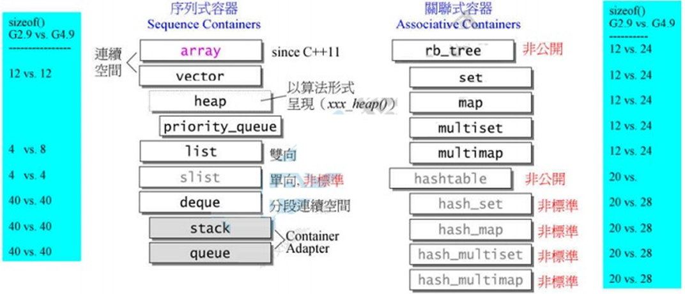

### STL的优点

STL  具有⾼可重⽤性，⾼性能，⾼移植性，跨平台的优点。

1、⾼可重⽤性：

STL 中⼏乎所有的代码都采⽤了模板类和模版函数的⽅式实现，这相⽐于传统的由函数和类组成的库来说提供了更好的代码重⽤机会。
2、⾼性能：

如 map 可以⾼效地从⼗万条记录⾥⾯查找出指定的记录，因为 map 是采⽤红⿊树的变体实现的。

3、⾼移植性：

如在项⽬ A 上⽤ STL 编写的模块，可以直接移植到项⽬ B 上。

STL 的⼀个重要特性是将数据和操作分离

数据由容器类别加以管理，操作则由可定制的算法定义。迭代器在两者之间充当“粘合剂”,以使算法可以和容器交互运作。

### pair容器

保存两个数据成员，⽤来⽣成特定类型的模板。

使⽤：

数据成员是public，两个成员分别是first和second

其中map的元素是pair，pair<const key_type，mapped_type>

可以⽤来遍历关联容器

~~~C++
map<string,int> p;
p.insert({word, 1});
p.insert(pair<string, int>(word, 1));
~~~

insert对不包含᯿复关键字的容器，插⼊成功返回pair<迭代器，bool>迭代器指向给定关键字元素，bool指出插⼊是否成功。

### vector容器实现与扩充

#### 底层实现

Vector在堆中分配了⼀段连续的内存空间来存放元素 

三个迭代器：

（1）	first ： 指向的是vector中对象的起始字节位置
（2）	last ： 指向当前最后⼀个元素的末尾字节
（3）	end  ： 指向整个vector容器所占⽤内存空间的末尾字节

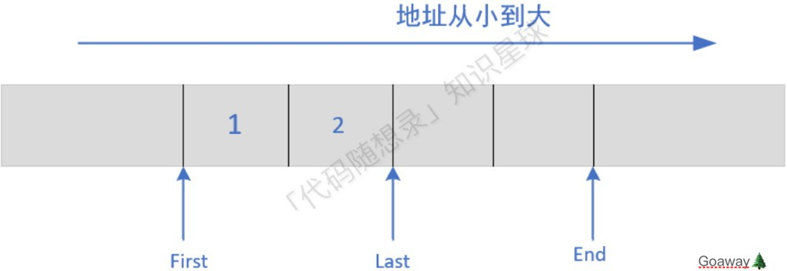

#### 扩容过程

如果集合已满，在新增数据的时候，就要分配⼀块更⼤的内存，将原来的数据复制过来，释放之前的内存，在插⼊新增的元素，所以对vector的任何操作，⼀旦引起空间重新配置，指向原vector的所有迭代器就都失效了。

size() 和 capacity()

（1）	堆中分配内存，元素连续存放，内存空间只会增⻓不会减少

vector有两个函数，⼀个是capacity()，在不分配新内存下最多可以保存的元素个数，另⼀个size()，返回当前已经存储数据的个数

（2）	对于vector来说，capacity是永远⼤于等于size的

capacity和size相等时，vector就会扩容，capacity变⼤（翻倍）

#### 对于vector扩容⽅式的选择，新增的容量选择多少才适宜呢？

1、固定扩容机制：

每次扩容的时候在原 capacity 的基础上加上固定的容量，⽐如初始 capacity 为100，扩容⼀次为 capacity + 20，再扩容仍然为 capacity + 20;

缺点：

考虑⼀种极端的情况，vector每次添加的元素数量刚好等于每次扩容固定增加的容量 + 1，就会造成⼀种情况，每添加⼀次元素就需要扩容⼀次，⽽扩容的时间花费⼗分⾼昂。所以固定扩容可能会⾯临多次扩容的情况，时间复杂度较⾼;

优点：

固定扩容⽅式空间利⽤率⽐较⾼。

2、加倍扩容机制：

每次扩容的时候原 capacity 翻倍，⽐如初始capcity = 100, 扩容⼀次变为 200, 再扩容变为 400;

优点：

⼀次扩容 capacity 翻倍的⽅式使得正常情况下添加元素需要扩容的次数⼤⼤减少（预留空间较多），时间复杂度较低;

缺点：

因为每次扩容空间翻倍，⽽很多空间没有利⽤上，空间利⽤率不如固定扩容。在实际应⽤中，⼀般采⽤空间换时间的策略。

3、resize()和reserve()

resize()：改变当前容器内含有元素的数量(size())，⽽不是容器的容量

1.	当resize(len)中len>v.capacity()，则数组中的size和capacity均设置为len;

2. 当resize(len)中len<=v.capacity()，则数组中的size设置为len，⽽capacity不变;

reserve()：改变当前容器的最⼤容量（capacity）

1.	如果reserve(len)的值 > 当前的capacity()，那么会重新分配⼀块能存len个对象的空间，然后把之前的对象通过copy construtor复制过来，销毁之前的内存;
2.	当reserve(len)中len<=当前的capacity()，则数组中的capacity不变，size不变，即不对容器做任何改变。

#### 其他

vector迭代器：由于vector维护的是⼀个线性区间，所以普通指针具备作为vector迭代器的所有条件，就不需要重载operator+，operator*之类的东⻄

vector的数据结构：线性空间。为了降低配置空间的成本，我们必须让其容量⼤于其⼤⼩。

vector的构造以及内存管理：当我们使⽤push_back插⼊元素在尾端的时候，我们⾸先检查是否还有备⽤空间也就是说end是否等于end_of_storage，如果有直接插⼊，如果没有就扩充空间

### list-链表

#### list设计

每个元素都是放在⼀块内存中，他的内存空间可以是不连续的，通过指针来进⾏数据的访问。

在哪⾥添加删除元素性能都很⾼，不需要移动内存，当然也不需要对每个元素都进⾏构造与析构了，所以常⽤来做随机插⼊和删除操作容器。

list属于双向链表，其结点与list本身是分开设计的。

list是⼀个环状的双向链表，同时它也满⾜STL对于“前闭后开”的原则，即在链表尾端可以加上空⽩节点。

#### list的迭代器的设计

迭代器是泛化的指针所以⾥⾯重载了->，--，++，*（），等运算符，同时迭代器是算法与容器之间的桥梁，算法需要了解容器的⽅⽅⾯⾯，于是就诞⽣了5种关联类型，(这5种类型是必备的，可能还需要其他类型)我们知道算法传⼊的是迭代器或者指针，算法根据传⼊的迭代器或指针推断出算法所想要了解的容器⾥的5种关联类型的相关信息。由于光传⼊指针，算法推断不出来其想要的信息，所以我们需要⼀个中间商（萃取器）也就是我们所说的 iterator traits类，对于⼀般的迭代器，它直接提供迭代器⾥的关联类型值，⽽对于指针和常量指针，它采⽤的类模板偏特化，从⽽提供其所需要的关联类型的值。

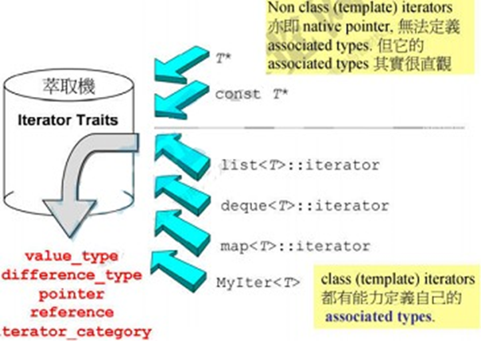

### deque-双端数组

⽀持快速随机访问，由于deque需要处理内部跳转，因此速度上没有vector快。

1、deque概述：

deque是⼀个双端开⼝的连续线性空间，其内部为分段连续的空间组成，随时可以增加⼀段新的空间并链接

注意:

由于deque的迭代器⽐vector要复杂，这影响了各个运算层⾯，所以除⾮必要尽量使⽤vector；为了提⾼效率，在对deque进⾏排序操作的时候，我们可以先把deque复制到vector中再进⾏排序最后在复制回deque。

2、deque中控器：

deque是由⼀段⼀段的定量连续空间构成。⼀旦有必要在其头端或者尾端增加新的空间，便配置⼀段定量连续空间，串接在整个deque的头端或者尾端

好处：

避免“vector的重新配置，复制，释放”的轮回，维护连整体连续的假象，并提供随机访问的接⼝；

坏处：

其迭代器变得很复杂

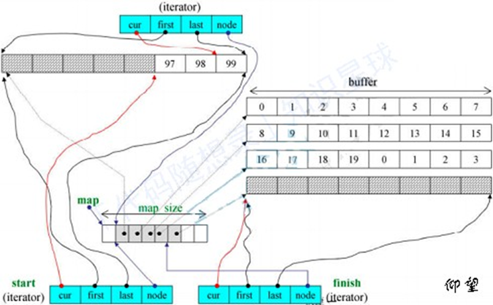

### stack and queue

概述：栈与队列被称之为duque的配接器，其底层是以deque为底部架构。通过deque执⾏具体操作

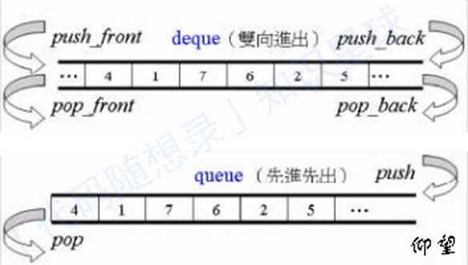

### heap and priority_queue

heap（堆）：

建⽴在完全⼆叉树上，分为两种，⼤根堆，⼩根堆,其在STL中做priority_queue的助⼿，即，以任何顺序将元素推⼊容器中，然后取出时⼀定是从优先权最⾼的元素开始取，完全⼆叉树具有这样的性质，适合做priority_queue的底层

priority_queue:

优先队列，也是配接器。其内的元素不是按照被推⼊的顺序排列，⽽是⾃动取元素的权值排列，确省情况下利⽤⼀个max-heap完成，后者是以vector—表现的完全⼆叉树。

### map && set

共同点：

都是C++的关联容器,只是通过它提供的接⼝对⾥⾯的元素进⾏访问，底层都是采⽤红⿊树实现。

不同点：

set：⽤来判断某⼀个元素是不是在⼀个组⾥⾯。                             

map：映射，相当于字典，把⼀个值映射成另⼀个值，可以创建字典。

优点：

查找某⼀个数的时间为O(logn)；遍历时采⽤iterator，效果不错。

缺点：

每次插⼊值的时候，都需要调整红⿊树，效率有⼀定影响。

### map与unordered_map

map中元素是⼀些key-value对，关键字起索引作⽤，值表示和索引相关的数据。

底层实现：

map底层是基于红⿊树实现的，因此map内部元素排列是有序的。

⽽unordered_map底层则是基于哈希表实现的，因此其元素的排列顺序是杂乱⽆序的。

map：

优点：

有序性，这是map结构最⼤的优点，其元素的有序性在很多应⽤中都会简化很多的操作。map的查找、删除、增加等⼀系列操作时间复杂度稳定，都为O(log n)。

缺点：
查找、删除、增加等操作平均时间复杂度较慢，与n相关。

unordered_map：优点：

查找、删除、添加的速度快，时间复杂度为常数级O(1）。

缺点：

因为unordered_map内部基于哈希表，以（key,value）对的形式存储，因此空间占⽤率⾼。unordered_map的查找、删除、添加的时间复杂度不稳定，平均为O(1)，取决于哈希函数。极端情况下可能为  O(n)。

## Effective STL

**1. 慎重选择容器类型**

\1.  需要在容器任意位置插⼊元素，就选择序列容器（vector string deque list ）

\2.  不关⼼容器中的元素是否是排序的，哈希容器可⾏

\3.  你选择的容器是c++标准的⼀部分，就排除了哈希容器，slist(单链表)和rope（“重型”的string）

\4.  随机访问迭代器：vector，deque,string .rope, 双向迭代器：避免使⽤slist与哈希容器的⼀个实现

\5.  当发⽣元素的插⼊和删除，避免移动原来容器的元素移动很重要，那么避免使⽤连续内存的容器

\6.  需要兼容c，就vector

\7.  元素的查找速度为关键：哈希容器，排序的vector，标准关联容器（按速度顺序）

\8.  介意引⽤计数，就要避免string与rope

\9.  回滚能⼒（错了能改）：就要基于节点的容器。if 对多个元素的插⼊操作需要事务语义就list ;使⽤连续内存的容器也可以获得事务语义

\10.  基于节点的容器不会使迭代器、指针、引⽤变为⽆效

\11.  在string上使⽤swap会使迭代器、指针、或引⽤变为⽆效

\12.  如果序列容器的迭代器是随机访问，只要没有删除操作发⽣，且插⼊操作只在末尾，则指向数据的引⽤和指针不会失效-deque

**2. 不要试图编写独⽴于容器类型的代码**

试图编写对序列容器和关联容器都适⽤的代码

**3. 确保容器中的对象拷⻉正确⽽⾼效**

\1.  存⼊容器的是你的对象的拷⻉

\2.  剥离问题：向基类对象的容器添加派⽣类对象会导致，派⽣类对象所特有的信息被抹去。智能指针是个解决问题的好办法。

**4.** 调⽤empty⽽不是检查size()是否为0

理由很简单

empty()对所有的标准容器都是常数时间操作，⽽size()对于list耗费的是线性时间。

**5.** **区间成员函数优先于与之对应的单元素成员函数**

好处：效率⾼易于理解，更能表达你的意图

区间创建、删除、赋值（assign）、插⼊可以⽤到区间成员函数

**6. 当⼼c++编译器的烦⼈的分析机制—尽可能的解释为函数声明**

我是我们刚开始学习类的时候容易犯下的错误，我们想声明⼀个Weight函数，向进⾏默认初始化，编译器却给我什么了⼀个函数声明。

该函数不带任何参数，并返回⼀个Weight

解决⽅法1：给函数参数加上括号

~~~c++
list <int>data(（istreamiterator<int>(datafile)）,istreamiterator<int>());
~~~

解决⽅法2：避免是使⽤匿名的istream_iterator迭代器对象，⽽是给这些迭代器⼀个名称(更好⼀点)

~~~C++
ifstream datafile("ints.dat"); 
istream_iterator<int> dateBegin(datafile); 
istream_iterator<int> dataEnd; 
list<int>data(dataBegin,dateEnd);
~~~

**7.** 容器包含指针

如果在容器中包含了通过new操作创建的对象的指针，切记在容器对象调⽤析构函数之前将指针delete掉

解决⽅法：

最简单的⽅法⽤智能指针代替指针容器，这⾥的智能指针通常是被引⽤计数的指针

~~~C++
void dosomething() {
    typedef boost::shardptr <Weight> SPW; //令SPW=shardptr<Weight> vector <SPW> vwp;
    for (int i = 0; i < SOMEMAGICNUMBER; ++i) {
        vwp.push_back(SPW(new Weight))//这⾥不会发⽣内存泄露，即使前⾯抛出异常。
        ...
    }
}
~~~

**8.** 切勿创建包含auto_ptr的容器

⽆论是被拷⻉还是被复制，源对象都将失去对其资源的所有权。

⽽STL容器⼜是需要元素具有拷⻉可赋值的属性的。

**9.** 当年你复制⼀个auto_ptr时

当年你复制⼀个auto_ptr时，它所指对象的所有权被移交到复制的对象，⽽他⾃身被置为NULL

**10.**  慎重选择删除元素的⽅法

10.1  要删除容器中有特定值的所有对象

如果容器时vector、string或duque, 则使⽤erase-remove

如果是list 则使⽤list::remove

如果容器是⼀个关联容器，则使⽤它的erase成员函数

10.2  要在循环内部做某些（除了删除对象的操作之外）操作

如果容器是⼀个**标准序列容器**，则写⼀个循环来遍历容器中的元素，记住每次调⽤erase时，要⽤它的返回值更新迭代器

如果是**关联容器**，写⼀个循环来遍历容器中的元素，记住当把迭代器传给erase时，要对他进⾏后缀递增

~~~C++
for(specalcontainer<int>::iterator i=c.begin();i!=c.end()) { 
    if(badvalue(*i)){
        logFile<<"..."<<*i<<endl;
        i=c.erase(i);//对于vector，string，deque删除的⼀个元素不仅会导致这个元素的迭代器失效，同时会导致所有 的迭代器失效，所以必须更新迭代器。
    } else {
        ++i;
    }
}
~~~

**11. 了解分配⼦的约定与概念**

分配⼦最初是作为内存模型的抽象，后来为了有利于开发作为对象形式的内存管理器，STL内存分配⼦负责分配和释放内存.

1、⾸先分配⼦能够为它所定义的内存模型中的指针和引⽤提供类型定义

分别为`allocator<T>::pointer`与`allocator::reference`,⽤户定义的分配⼦也应该提供这些类型定义，创建这种具有引⽤⾏为特点的对象是使⽤代理对象的⼀个例⼦，⽽代理对象会导致很多问题。

2、库实现者可以忽略类型定义⽽直接使⽤指针和引⽤

允许每个库实现者假定每个分配⼦的指针类型等同于 T* ，引⽤为 T&
3、STL实现者可以假定所有属于同⼀类型的分配⼦都是等价的

4、⼤多数标准容器从来没有单独使⽤过对应的分配⼦

例如list,当我们添加⼀个节点的时候我们并不是需要T的内存，⽽是要包含T的listNode的内存。

所以说list从未需要allocator做任何内存分配，该list的分配⼦不能够提供list所需的分配内存的功能。

所以它会利⽤分配⼦提供的⼀个模板，根据list中T来决定listNode的分配⼦类型为：Allocator::rebind::other这样就得到listNode 的分配⼦，就可以为list分配内存new与allocator在分配内存的时候，他们的接⼝不同。

~~~C++
void operator new(sizet bytes);
pointer allocator<T>::allocator(sizetype numberjects);
// pointer是个类型定义总是T
// 两者都带参数说名要分配多少内存，但是new 是指明⼀定的字节
// ⽽allocator ，它指明的内存中要容纳多少个T对象
// new返回的是⼀个void，⽽allocator<T>::allocate返回的是⼀个T
// 但是返回的指针并未指向T对象
// 因为T为被构造
// STL会期望allocator<T>::allocate的调⽤者最终在返回的内存中创建⼀个或者多个T对象
~~~

**12. 编写⾃定义分配⼦需要什么**
你的分配⼦是个模板，T代表为它分配对象的类型。

提供模板类型定义，分别为allocator::pointer与allocator::reference。

通常，分配⼦不应该有⾮静态对象。

new返回的是⼀个void ，⽽allocator::allocate返回的是⼀个T ，但是返回的指针并未指向T对象，因为T为被构造，STL会期望allocator::allocate的调⽤者最终在返回的内存中创建⼀个或者多个T对象。

⼀定要提供rebind模板。

**13. 理解分配⼦的⽤法**

把STL容器中的内容放在共享内存中把STL容器中的内容放到不同的堆中。

**14.**   切勿对STL容器的线程安全性有不切实际的依赖

STL⾃身对多线程的⽀持⾮常有限

在需要修改STL容器或这调⽤STL算法时需要⾃⼰加锁。  为了实现异常安全，最好不要⼿动加锁解锁，多使⽤RAII（用于管理对象的生命周期和资源分配）。

**15.**  当你在动态分配数组的时候，请使⽤vector和string

**16.**  使⽤reserve来避免不必要的重新分配

STL容器会⾃动增⻓以便容纳下其中的数据，只要没有超出他们的限制 vector与string 的增⻓实现过程：

分配⼀块⼤⼩为旧内存两倍的新内存，把容器中所有的元素复制到新内存中，析构旧内存的对象，释放旧内存。

reserve函数能够把你重新分配内存的次数减到最⼩，从⽽避免重新分配和指针、迭代器、引⽤失效带来的开销，所以应该尽早的使⽤reserve，最好是容器在被刚刚构造出来的时候就使⽤

4个易混函数(只有vector与string提供所有的这4个函数)

\1.  size()：告诉你容器中有多少个元素

\2.  capacity()：告诉你该容器利⽤已分配的内存能够容纳多少个元素，这是容器能够容纳元素的总数

\3.  resize(Container::size_type n)：强迫容器改变到包含n个元素的状态，如果size返回的数<n，则容器尾部的元素就会被析构，如果>n，则默认构造新的元素添加到容器的末尾，如果n要⽐当前的容器容量⼤，那么就会在添加元素之前，重新分配内存

\4.  reserve(Container::size_type n),强迫容器改变容量变为⾄少n，前提是不⽐当前的容量⼩，这会导致重新分配。

**有两种⽅式避免不必要的内存分配**

\1.  你提前已经知道要⽤多少的元素，你此时就可以使⽤reserve。

\2.  先预留⾜够⼤的空间，然后在去除多余的容量（如何去除，参照使⽤swap技巧）

**17.   string实现的多样性**

\1.  string 的值可能会被引⽤计数

\2.  string对象的⼤⼩可能是char*的⼤⼩的1~7倍

\3.  创建⼀个新的字符串可能会发⽣0，1，2次的动态分配内存

\4.  string也可能共享其容量，⼤⼩信息

\5.  string可能⽀持针对单个对象的分配⼦

\6.  不同的实现对字符内存的最⼩分配单位有不同的策略

**18.  了解如何把vector和string数据传给旧的API**

~~~c++
if(!v.empty())
	do something(&v[0],v.size()); or dosomething(v.c_str());
~~~

如何⽤来⾄C API的元素初始化⼀个vector

~~~C++
sizet fillArray(doublepArray,size_t arraySize); 
vector<double>vd(maxnumbers); 
vd.resize(fillArray(&v[0],vd.size()));
sizet fillString(charpArray,size_t arraySize); 
vector< char >vc(maxnumbers);
size_t charWritten=fillString(&v[0],vd.size(0));
string s(vc.begin(),v.end()+charWrittrn);
~~~

**19.** 使⽤“swap技巧”删去多余的容量

~~~C++
vector<C> cs.swap(cs); 
string s;
string(s).swap(s);
~~~

swap还可以删去⼀个容器

~~~C++
vector<C>().swap(cs); 
string s; 
string().swap(s);
~~~

**20. **swap的时候发⽣了什么

在swap的时候，不仅两个容器的元素被交换了，他们的迭代器，指针和引⽤依然有效（string除外），只是他们的元素已经在另⼀个容器⾥⾯。

**21.** 避免使⽤vector< bool >时,⽤deque< bool >和bitset代替它

对于vector来说：

第⼀，它不是⼀个STL容器。

第⼆，它并不容纳bool。除此以外，就没有什么要反对的了。

**22.** 理解等价与相等

相等基于operator==，⼀旦x==y则返回真，则x与y相等

等价关系是在已经排好序的的区间中对象值的相对顺序，每⼀个值都不在另⼀个值的前⾯。

!=（x < y)&&!=(y < x)。每个标注关联容器的⽐较函数是⽤户⾃定义的判别式，每个标准关联容器都是通过key_comp 成员函数使排序判别式可被外部使⽤

**23.  熟悉非标准散列容器**

\1.  hashmap

\2.  hashset

\3.  hashmultimap

\4.  hashmultiset

**24.**  为包含指针的关联容器指定⽐较类型，⽽不是⽐较函数，最好是准备⼀个模板

~~~C++
struct Dfl {
    template<typename ptrtype>
    bool operator()(ptrtype pT1, ptrtype pT2) const { 
        return pT1 < pT2;
    }
}
~~~

**25.**  切勿直接修改set或multiset中的键

set/multiset 的值不是const，map的键是const。如何修改元素：

**26.**  考虑⽤排序的vector替代关联容器

当程序使⽤数据结构的⽅式是：设置阶段、查找阶段、重组阶段,使⽤排序的vector容器可能⽐使⽤关联容器的效率要更好⼀点(当在使⽤数据结构的时候，查找操作不与删除添加操作混在⼀起的时候在考虑vector)

**好处：**

消耗更少的内存，运⾏的更快⼀些

当你使⽤vector来模仿map<const k,v>时，存储在vector中的是pair<k,v>，⽽不是pair<const k,v>；需要⾃⼰写3个⾃定义⽐较函数（⽤于排序的⽐较函数，⽤于查找的⽐较函数）

~~~C++
typedef pair<string, int> Data; 
class Datacompare {
public:
	bool operator()(const Data &lhs, const Data &rhs) const { 
        return keyless(lhs.first, rhs.first);
    }//⽤于排序的⽐较函数
    bool operator()(const Data &lhs, const Data::first_type &k) const {
 		return keyless(lhs.first, k)
 	}//⽤于查找的⽐较函数
 	bool operator()(const Data::first_type &k, const Data &rhs) const {
 		return keyless(k, rhs.first)
 	}//⽤于查找的⽐较函数
private:
 	bool keyless(const Data::firsttype &k1, const Data::firsttype &k2) const {
 		return k1 < k2;
 	}//为了保证operator（）的⼀致性
}
~~~

**27. **更新⼀个已有的映射表元素

如果要更新⼀个已有的映射表元素，则应该选择operator[]，如果是添加元素，那么最好还是选择insert。

这是因为operator[]会先搜索map中是否已经存在要更新的键值对，如果存在，则会返回该键所对应的值，并将其更新为新的值。如果不存在，则会创建一个新的键值对，并将其插入到map中。

**28.** Iterator

iterator优先于constiterator, reserveiterator, constreserveiterator

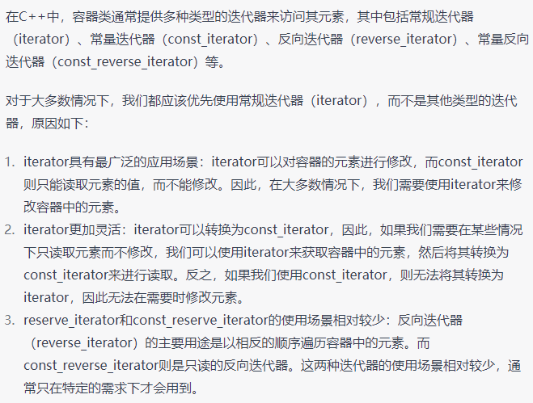

**29.** 使⽤distance和advance将容器的const_iterator转换为iterator

~~~C++
typedef deque<int> IntDeque; 
typedef IntDeque::iterator Iter;
typedef IntDeque::const_iterator ConstIter; 
IntDeque d;
ConstIter ci;
...
Iter i(d.begin());
advance(i, distance<ConstIter>(i, ci));//使用advance函数将其向前移动了一个距离，该距离等于i和ci之间的距离。
~~~

**30.** 正确理解由reserve_iterator的base()成员函数所产⽣的iterator的⽤法

reverse_iterator的base()函数可以将其转换为一个普通的迭代器，该迭代器指向原来reverse_iterator所指向的元素的下一个位置。

\1.  对于插⼊操作，ri和ri.base()是等价的

\2.  对于删除操作，ri和ri.base()不是等价的

\3.  v.erase((++ri).base());

**31. istreambuf_iterator**

对于逐个字符的输⼊请考虑使⽤istreambuf_iterator

\1. `ifstream inputFile("sdsdsa.txt");`

\2. `string filedate((istreambufiterator<char>(inputFile),istreambufiterator<char>());`

**32.  如果所使⽤的算法需要指定⼀个⽬标空间**

如果所使⽤的算法需要指定⼀个⽬标空间，确保⽬标区间⾜够⼤或确保它会随着算法的运⾏⽽增⼤。

要在算法执⾏过程中中增⼤⽬标区间，请使⽤插⼊型迭代器：backinserter,frontinserter,ostream_iterator

ostream_iterator可以将元素输出到一个流中，用法如下：

~~~C++
vector<int> v = {1, 2, 3};
ostream_iterator<int> out(cout, " ");

copy(v.begin(), v.end(), out);
~~~

插入型迭代器的优点是，它们可以自动扩展目标区间的大小，从而避免了手动调整目标容器大小的麻烦。此外，插入型迭代器还可以在容器头部和尾部插入元素，使得容器的操作更加灵活。

**33.**  了解各种与排序相关的选择

\1.  如果需要对vector string，deque，或者数组中的元素进⾏⼀次完全排序，那么可以使⽤sort和stable_sort

\2.  如果有⼀个vector，string，deque或者数组，并且只需要对等价性最前⾯的n个元素进⾏排序，那就是可以使⽤partial_sort

\3.  如果有⼀个vector，string，deque或者数组，并且只需要找到第n个位置上的元素，或者，并且只需要找到等价性最前⾯的n个元素，并不需要排序，那么nth_element就⾏

\4.  如果需要将⼀个标准序列容器中的元素按照是否满⾜某个特定区间区分开，那么就选择partition、stable_partition

\5.  如果你的数据在list中，那么你可以选择内置的sort和stablesort算法。同时如果你需要获得partitionsort或nth_element算法的效果可采⽤⼀些间接的方法

\6.  对于排序算法的选择应该基于功能⽽选择，⽽不是基于性能

**34.**  如果要删除元素，需要在remove后⾯使⽤erase

`remove`算法接受两个迭代器作为参数，这两个迭代器定义了容器的范围，以及一个指定移除条件的谓词函数。该算法将容器中所有满足指定条件的元素移到容器的末尾，然后返回一个指向新逻辑结尾的迭代器，而不改变容器的大小。

`remove` 和 `remove_if` 的主要区别在于删除条件的不同。`remove` 删除的条件是元素等于指定值，而 `remove_if` 的删除条件由谓词函数决定。

**35.** 对包含指针的容器使⽤remove这⼀类算法要⼩⼼

原因：由于remove是将那些要被删除的指针被那些不需要被删除的指针覆盖了，所以没有指针指向那些被删除指针所指向的内存和资源，所有资源就泄露了

做法：使⽤智能指针或者在使⽤remove-erase之前⼿动删除指针并把他们置为空

**36. 了解那些算法要求使⽤排序的区间作为参数**

~~~C++
template<typename InputIterator
typename OutputIterator
typename predicate>
OutputIterator copy_if(InputIterator begin, InputIterator end, OutputIterator destbegin, predicate p) {
     while (begin != end) {
     	if (p(*begin))
     		destbegin++ = begin;
     	++begin;
     }
     return destbegin;
}
~~~

**37.** 使⽤accumulate或者for_each进⾏区间统计

\1. accumulate (innerproducet、adjacentdifference、partial_sum)位于< numeric >中 

\2. for_each(区间，函数对象) 

\3. accumulate（begin,end,初始值）；accumulate（初始值，统计函数)

`for_each` 是一个算法函数，它用于遍历容器中的所有元素，并对每个元素执行指定的操作。

~~~C++
std::vector<int> myVec{1, 2, 3, 4, 5};

std::for_each(myVec.begin(), myVec.end(), [](int i) {
    std::cout << i << " ";
});
~~~

**38. 遵循按值传递的原则来设计函数子类** 

如果做能够允许函数对象可以很⼤、或者保留多态，⼜可以与STL所采⽤的按值传递函数指针的习惯保持⼀致：将 数据和虚函数从函数⼦类中分离出来，放到⼀个新的类中；然后在函数⼦类中包含⼀个指针，指向这⼀个⼼类的对象

~~~c++
template<typename T>
class Bs : public:unary_function<T, void> {
private:
 	Weight w;
 	int x;
...
	virtual ~Bs();
	virtual void operator()(const T &val) const;
	friend class B<T>
}
template<typename T>
class B : public:unary_function<T, void> {
private:
 	BS <T> *p;
public:
 	virtual void operator()(const T &val) const {
 		p->
 		operator()(val);
 	}
}
~~~

**41.** 确保判别式是“纯函数”

对于⽤作判别式的函数对象，使⽤时它会被拷⻉存起来，然后再使⽤这个拷⻉。这⼀特性要求判别式函数必须是纯函数。

**42.** 使你的函数⼦类可配接

为什么：1.（可配接的函数对象能够与其他STL组件默契的协同⼯作）2.能够让你的函数⼦类拥有必要的类型定义。

为什么：4个标准的函数配接器（not1,not2,bind1st,bind2nd)要求这些类型定义

为什么not1等需要这些定义：能够辅助他们完成⼀些功能

如何使函数可配接：让函数⼦重特定的基类继承：unaryfuntion与binaryfunction

注意： `unaryfuntion<operator所带参数类型，返回类型>` ` binaryfunction<operator 1, operator 2,返回类型>`

**43.** 理解ptrfun && memfun && memfunref

在函数和函数对象被调⽤的时候，总是使⽤⾮成员函数形式发f(),⽽当你使⽤成员函数的形式时x.f(),p->f();

这将通不过编译，所有使⽤上⾯的那些东⻄，就能调整成员函数，使其能够以成员函数的形式调⽤函数和函数对象。

每次将成员函数传给STL组件的时候，就要使⽤他们。

**44.** 确保less< T >与operator<的语义相同

⼀般情况下我们使⽤less< T >都是默认通过operator<来排序。

如果你想要实现不同的⽐较，最好是重新写⼀个类，⽽不是修改特化修改less

**45.** 算法的调⽤优先于⼿写的循环

\1. 效率⾼

\2. ⾃⼰⼿写的循环更容易出错

\3. 算法代码⽐我们⾃⼰写的更简单明了，利于维护

**46.** 容器的成员函数优先于同名函数

\1. 成员函数往往速度快。

\2. 成员函数通常与容器结合地更紧密，这是算法所不能⽐的。

**47.** 正确区分以下关键字

count、find、binarysearch、lowerbound、upperbound、equalrange 

~~~c++
std::vector<int> myVec{1, 2, 3, 4, 5};

if (std::binary_search(myVec.begin(), myVec.end(), 3)) {
    std::cout << "Found" << std::endl;
} else {
    std::cout << "Not found" << std::endl;
}
~~~

~~~c++
std::vector<int> myVec{1, 2, 2, 3, 3, 3, 4, 5};

auto range = std::equal_range(myVec.begin(), myVec.end(), 3);

for (auto it = range.first; it != range.second; ++it) {
    std::cout << *it << " ";
}
~~~

**48.** 使⽤函数对象作为STL算法的参数

## Effective C++

**条款16：成对使⽤new和delete。**

new创建，delete删除。 new[]创建，[]delete删除

**条款30：了解inline的⾥⾥外外**

\1. inline函数，对函数的每⼀个调⽤都⽤函数本体替代，调⽤不承受额外开销，编译器对其执⾏语境相关最优化。增加⽬标码⼤⼩，额外的换⻚⾏为，降低缓存击中率，效率损失。

\2. 对虚函数进⾏inline⽆意义，虚函数是运⾏时确定，inline是在编译期替换。

\3. 编译器⼀般不对“通过函数指针进⾏调⽤”提供inline，是否inline取决于调⽤的⽅式。

**条款34：区分接⼝继承和实现继承**

public继承由函数接⼝继承+函数实现继承组成。

纯虚函数两个特性：①它们必须被任何继承了它们的具象class重新声明②在抽象class中通常没有定义。声明⼀个纯虚函数的⽬的是为了让派⽣类只继承函数接⼝。

声明⾮纯虚函数的⽬的是让派⽣类继承函数的接⼝和缺省实现。

必须⽀持⼀个虚函数，如果不想重新写⼀个（override），可以使⽤基类提供的缺省版本。

声明⾮虚函数的⽬的是令派⽣类继承函数接⼝和⼀份强制性实现

任何派⽣类都不应该尝试修改次函数，non-virtual函数代表不变性>特异性，不应该在派⽣类被重新定义。

**条款39：明智⽽审慎的使⽤private继承**

如果派⽣类需要访问基类保护的成员，或需要重新定义继承来的虚函数，采⽤private继承。

**条款40：明智⽽审慎的使⽤多重继承**

多继承中实现派⽣类中只有⼀份数据，虚继承。虚继承会增加⼤⼩，速度，初始化等成本。

最好不要使⽤虚继承或者虚基类中不放置数据。

## 泛型编程

### C++模板全特化和偏特化

模板分为类模板与函数模板，特化分为特例化（全特化）和部分特例化（偏特化）。

对模板特例化是因为对特定类型，可以利⽤某些特定知识来提⾼效率，⽽不是使⽤通⽤模板。

**对函数模板：**

\1. 模板和特例化版本应该声明在同⼀头⽂件，所有同名模板的声明应放在前⾯，接着是特例化版本。

\2. ⼀个模板被称为全特化的条件：1.必须有⼀个主模板类  2.模板类型被全部明确化。

模板函数：

~~~C++
template<typename T1, typename T2>
void fun(T1 a, T2 b)
{
 	cout<<"模板函数"<<endl;
}
template<>
void fun<int, char>(int a, char b)
{
 	cout<<"全特化"<<endl;
}
~~~

函数模板，只有全特化，偏特化的功能可以通过函数的重载完成。

**对类模板：**

~~~c++
template<typename T1, typename T2>
class Test
{
public:
	Test(T1 i, T2 j) :a(i), b(j) {
		cout << "模板类" << endl;
	}
private: 
    T1 a;
	T2 b;
};


template<>
class Test<int, char>
{
public:
	Test(int i, char j) :a(i), b(j) { 
        cout << "全特化" << endl; 
    } 
private:
	int a; char b;
};


template <typename T2> 
class Test<char, T2>
{
public:
	Test(char i, T2 j) :a(i), b(j) { 
        cout << "偏特化" << endl; 
    } 
private:
	char a; T2 b;
}
~~~

对主版本模板类、全特化类、偏特化类的调⽤优先级从⾼到低进⾏排序是：全特化类>偏特化类>主版本模板类。

## C++11新特性	

### 类型推导

#### auto

auto可以让编译器在编译期就推导出变量的类型

（1）auto的使⽤必须⻢上初始化，否则⽆法推导出类型
（2）auto在⼀⾏定义多个变量时，各个变量的推导不能产⽣⼆义性，否则编译失败
（3）auto不能⽤作函数参数
（4）在类中auto不能⽤作⾮静态成员变量
（5）auto不能定义数组，可以定义指针
（6）auto⽆法推导出模板参数
（7）在不声明为引⽤或指针时，auto会忽略等号右边的引⽤类型和cv限定
（8）在声明为引⽤或者指针时，auto会保留等号右边的引⽤和cv属性

#### decltype

decltype则⽤于推导表达式类型，这⾥只⽤于编译器分析表达式的类型，表达式实际不会进⾏运算

decltype不会像auto⼀样忽略引⽤和cv属性，decltype会保留表达式的引⽤和cv属性对于decltype(exp)有：

1.	exp是表达式，decltype(exp)和exp类型相同
2.	exp是函数调⽤，decltype(exp)和函数返回值类型相同
3.	其它情况，若exp是左值，decltype(exp)是exp类型的左值引⽤

auto和decltype的配合使⽤:

~~~c++
template<typename T, typename U>
auto add(T t, U u) -> decltype(t + u) { 
    return t + u;
}
~~~

## 右值引用

左值右值：

左值：  可以放在等号左边，可以取地址并有名字。
右值： 不可以放在 i 等号左边，不能取地址，没有名字。

字符串字⾯值"abcd"也是左值，不是右值
++i、--i是左值，i++、i--是右值 

1、将亡值

将亡值是指C++11新增的和右值引⽤相关的表达式。

将亡值可以理解为即将要销毁的值，通过“盗取”其它变量内存空间⽅式获取的值，在确保其它变量不再被使⽤或者即将被销毁时，可以避免内存空间的释放和分配，延⻓变量值的⽣命周期，常⽤来完成移动构造或者移动赋值的特殊任务

2、左值引⽤

左值引⽤就是对左值进⾏引⽤的类型，是对象的⼀个别名
并不拥有所绑定对象的堆存，所以必须⽴即初始化。 对于左值引⽤，等号右边的值必须可以取地址，如果不能取地址，则会编译失败，或者可以使⽤const引⽤形式

3、右值引⽤

表达式等号右边的值需要是右值，可以使⽤std::move函数强制把左值转换为右值。

4、移动语义

可以理解为转移所有权，对于移动语义，类似于转让或者资源窃取的意思，对于那块资源，转为⾃⼰所拥有，别⼈不再拥有也不会再使⽤。
通过移动构造函数使⽤移动语义，也就是std::move；移动语义仅针对于那些实现了移动构造函数的类的对象，对于那种基本类型int、float等没有任何优化作⽤，还是会拷⻉，因为它们实现没有对应的移动构造函数。移动后，原对象的值应该被置为默认值，以避免在析构时释放已经被移动的资源。

浅拷⻉：

a和b的指针指向了同⼀块内存，就是浅拷⻉，只是数据的简单赋值；

深拷⻉：

深拷⻉就是再拷⻉对象时，如果被拷⻉对象内部还有指针引⽤指向其它资源，⾃⼰需要重新开辟⼀块新内存存储资源

5、完美转发

写⼀个接受任意实参的函数模板，并转发到其它函数，⽬标函数会收到与转发函数完全相同的实参，通过std::forward()实现

## nullptr

nullptr是⽤来代替NULL，⼀般C++会把NULL、0视为同⼀种东⻄，这取决去编译器如何定义NULL，有的定义为  ((void*)0)，有的定义为0
C++不允许直接将void隐式转换到其他类型，在进⾏C++重载时会发⽣混乱
例如：

如果NULL被定义为 ((void*)0)，那么当编译char *ch = NULL时，NULL被定义为 0

当foo(NULL)时，此时NULL为0，会去调⽤foo(int )，从⽽发⽣混乱为解决这个问题，从⽽需要使⽤NULL时，⽤nullptr代替：

C++11引⼊nullptr关键字来区分空指针和0。nullptr 的类型为 nullptr_t，能够转换为任何指针或成员指针的类型，也可以进⾏相等或不等的⽐较。

## 列表初始化

C++定义了⼏种初始化⽅式，例如对⼀个int变量 x初始化为0：

~~~c++
int x = 0; // method1
int x = {0}; // method2
int x{0}; // method3
int x(0); // method4
~~~

采⽤花括号来进⾏初始化称为列表初始化，⽆论是初始化对象还是为对象赋新值。 ⽤于对内置类型变量时，如果使⽤列表初始化，且初始值存在丢失信息⻛险时，编译器会报错。

~~~c++
long double d = 3.1415926536;
int a = {d}; //存在丢失信息⻛险，转换未执⾏。
int a = d; //确实丢失信息，转换执⾏。
~~~

## lambda表达式

lambda表达式表示⼀个可调⽤的代码单元，没有命名的内联函数，不需要函数名因为我们直接（⼀次性的）⽤它，不需要其他地⽅调⽤它。

### 变量捕获才是成就lambda卓越的秘⽅

\1.  [] 不捕获任何变量,这种情况下lambda表达式内部不能访问外部的变量

\2.  [&] 以引⽤⽅式捕获所有变量（保证lambda执⾏时变量存在）

\3.  [=] ⽤值的⽅式捕获所有变量（创建时拷⻉，修改对lambda内对象⽆影响)

\4.  [=, &foo] 以引⽤捕获变量foo, 但其余变量都靠值捕获

\5.  [&, foo] 以值捕获foo, 但其余变量都靠引⽤捕获

\6.  [bar] 以值⽅式捕获bar; 不捕获其它变量

\7.  [this] 捕获所在类的this指针

## 并发

### std::thread

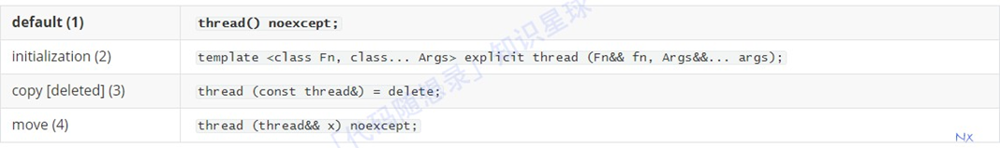

1、默认构造函数，创建⼀个空的 thread 执⾏对象。

2、初始化构造函数，创建⼀个 thread对象，该 thread对象可被 joinable，新产⽣的线程会调⽤ fn 函数，该函数的参数由 args 给出。

3、拷⻉构造函数(被禁⽤)，意味着 thread 不可被拷⻉构造。

4、move 构造函数，move 构造函数，调⽤成功之后 x 不代表任何 thread 执⾏对象。

**注意：** 可被 joinable 的 thread 对象必须在他们销毁之前被主线程 join 或者将其设置为 detached. std::thread在使⽤上容易出错，即std::thread对象在线程函数运⾏期间必须是有效的。什么意思呢？

~~~c++
#include <iostream>
#include <thread>
void threadproc() {
 	while(true) {
 		std::cout << "I am New Thread!" << std::endl;
 	}
}
void func() {
 	std::thread t(threadproc);
}
int main() {
 	func();
 	while(true) {} //让主线程不要退出
 	return 0;
}
~~~

以上代码再main函数中调⽤了func函数，在func函数中创建了⼀个线程，乍⼀看好像没有什么问题，但在实际运⾏是会崩溃。

崩溃的原因是，在func函数调⽤结束后，func中局部变量t（线程对象）被销毁，⽽此时线程函数仍在运⾏。所以在使⽤std::thread类时，必须保证线程函数运⾏期间其线程对象有效。

std::thread对象提供了⼀个detach⽅法，通过这个⽅法可以让线程对象与线程函数脱离关系，这样即使线程对象被销毁，也不影响线程函数的运⾏。
只需要在func函数中调⽤detach⽅法即可，代码如下：

~~~c++
// 其他代码保持不变
void func() {
	std::thread t(threadproc); t.detach();
}
~~~

### lock_guard

lock_guard是⼀个互斥量包装程序，它提供了⼀种⽅便的RAII（Resource acquisition is initialization ）⻛格的机制来在作⽤域块的持续时间内拥有⼀个互斥量。

创建lockguard对象时，它将尝试获取提供给它的互斥锁的所有权。当控制流离开lockguard对象的作⽤域时，

lock_guard析构并释放互斥量。

它的特点如下：

创建即加锁，作⽤域结束⾃动析构并解锁，⽆需⼿⼯解锁

不能中途解锁，必须等作⽤域结束才解锁

不能复制

### unique_lock

unique_lock是⼀个通⽤的互斥量锁定包装器，它允许延迟锁定，限时深度锁定，递归锁定，锁定所有权的转移以及与条件变量⼀起使⽤。
简单地讲，uniquelock 是 lockguard 的升级加强版，它具有 lock_guard 的所有功能，同时⼜具有其他很多⽅法，使⽤起来更强灵活⽅便，能够应对更复杂的锁定需要。

特点如下：

\1. 创建时可以不锁定（通过指定第⼆个参数为std::defer_lock），⽽在需要时再锁定

\2. 可以随时加锁解锁

\3. 作⽤域规则同 lock_grard，析构时⾃动释放锁

\4. 不可复制，可移动

\5. 条件变量需要该类型的锁作为参数（此时必须使⽤unique_lock）

## 补充

