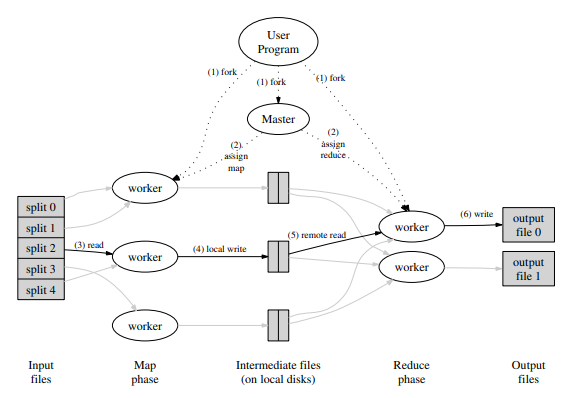
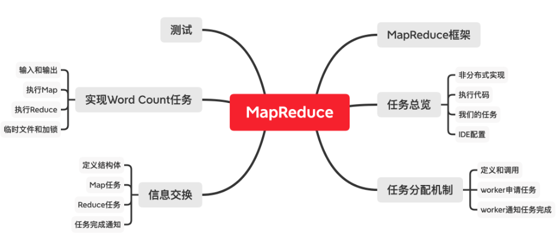

# Lecture 01 - Introduction

## 1.1 分布式系统的驱动力和挑战、分布式系统的抽象

分布式系统的核心是通过网络来协调，共同完成一致任务的一些计算机。分布式计算之所以如此重要的原因是，许多重要的基础设施都是在它之上建立的，它本质上需要多台物理隔离的计算机。

在选择使用分布式系统解决问题前，你应该要充分尝试别的思路，因为分布式系统会让问题解决变得复杂。

人们使用大量的相互协作的计算机驱动力是：

1. 人们需要获得**更高的计算性能**。大量的计算机意味着大量的并行运算，大量CPU、大量内存、以及大量磁盘在并行的运行。
2. **提供容错**（tolerate faults）。比如两台计算机运行完全相同的任务，其中一台发生故障，可以切换到另一台。
3. **一些问题天然在空间上是分布的**。例如银行转账，我们假设银行A在纽约有一台服务器，银行B在伦敦有一台服务器，这就需要一种两者之间协调的方法。所以，有一些天然的原因导致系统是物理分布的。
4. 构建分布式系统来达成一些**安全**的目标。比如有一些代码并不被信任，但是你又需要和它进行交互，这些代码不会立即表现的恶意或者出现bug，所以把系统分成多个的计算机，这样可以限制出错域。

这些分布式系统的问题（挑战）在于：

1. 系统中存在很多部分，这些部分又在并发执行，就会遇到**并发编程和各种复杂交互所带来的问题**，以及时间依赖的问题（比如同步，异步）。这让分布式系统变得很难。
2. 分布式系统有多个组成部分，再加上计算机网络，就会遇到一些意想不到的故障。如果你只有一台计算机，那么它通常要么是工作，要么是故障或者没电，总的来说，要么是在工作，要么是没有工作。而由多台计算机组成的分布式系统，可能会有一部分组件在工作，而另一部分组件停止运行，或者这些计算机都在正常运行，但是网络中断了或者不稳定。所以，**局部错误**也是分布式系统很难的原因。
3. 人们设计分布式系统的根本原因通常是为了获得更高的性能，比如说一千台计算机或者一千个磁盘臂达到的性能。但是实际上一千台机器到底有多少性能是一个棘手的问题，这里有很多难点。所以**通常需要倍加小心地设计才能让系统实际达到你期望的性能**。

## 1.3  分布式系统的抽象和实现工具

基础架构的类型主要是**存储，通信（网络）和计算。**

对于存储和计算，我们希望通过设计抽象的接口，将分布式特性隐藏在整个系统内。

人们在构建分布系统时，使用了很多的工具，例如：

1. RPC（Remote Procedure Call）。**RPC的目标就是掩盖我们正在不可靠网络上通信的事实**。
2. **线程**。这是一种编程技术，使得我们可以利用多核心计算机。更重要的是，线程提供了一种结构化的并发操作方式，这样，从程序员角度来说可以简化并发操作。
3. 因为我们会经常用到线程，**我们需要在实现的层面上，花费一定的时间来考虑并发控制，比如锁**。

## 1.4 可扩展性

**两台计算机构成的系统如果有两倍性能或者吞吐，就是可扩展性**。

这是一个很强大的特性。如果你构建了一个系统，并且只要增加计算机的数量，系统就能相应提高性能或者吞吐量，这将会是一个巨大的成果，因为计算机只需要花钱就可以买到。

当人们使用一整个机房的计算机来构建大型网站的时候，为了获取对应的性能，必须要时刻考虑可扩展性。你需要仔细设计系统，才能获得与计算机数量匹配的性能。当你只有1-2个用户时，一台计算机就可以运行web服务器和数据，或者一台计算机运行web服务器，一台计算机运行数据库。但是有可能你的网站一夜之间就火了起来，你发现可能有一亿人要登录你的网站。所以，为了提升性能，你要做的第一件事情就是购买更多的web服务器，然后把不同用户分到不同服务器上。这样，一部分用户可以去访问第一台web服务器，另一部分去访问第二台web服务器。所有的用户最终都需要看到相同的数据，所以所有的web服务器都与后端数据库通信。这样，很长一段时间你都可以通过添加web服务器来并行的提高web服务器的代码效率。

但是这种可扩展性并不是无限的。很可能在某个时间点你有了10台，20台，甚至100台web服务器，它们都在和同一个数据库通信。现在，数据库突然成为了瓶颈，并且增加更多的web服务器都无济于事了。**所以很少有可以通过无限增加计算机来获取完整的可扩展性的场景**。这时，你几乎是必然要做一些重构工作。但是只有一个数据库时，很难重构它。而虽然**可以将一个数据库拆分成多个数据库（进而提升性能）**，但是这需要大量的工作。

## 1.5 可用性

如果你只使用一台计算机构建你的系统，那么你的系统大概率是可靠的。然而如果你通过数千台计算机构建你的系统，那么即使每台计算机可以稳定运行一年，对于1000台计算机也意味着平均每天会有3台计算机故障。**大型分布式系统中有一个大问题，那就是一些很罕见的问题会被放大**。

因为错误总会发生，必须要在设计时就考虑，系统能够屏蔽错误，或者说能够在出错时继续运行。同时，因为我们需要为第三方应用开发人员提供方便的抽象接口。

**可用性即某些系统经过精心的设计，这样在特定的错误类型下，系统仍然能够正常运行，仍然可以像没有出现错误一样，为你提供完整的服务。**

除了可用性之外，另一种容错特性是**自我可恢复性**（recoverability）。这里的意思是，**如果出现了问题，服务会停止工作，不再响应请求，之后有人来修复，并且在修复之后系统仍然可以正常运行，就像没有出现过问题一样。这是一个比可用性更弱的需求**，因为在出现故障到故障组件被修复期间，系统将会完全停止工作。但是修复之后，系统又可以完全正确的重新运行，所以可恢复性是一个重要的需求。

对于一个可恢复的系统，通常需要做一些操作，例如将最新的数据存放在磁盘中，这样在供电恢复之后（假设故障就是断电），才能将这些数据取回来。甚至说对于一个具备可用性的系统，为了让系统在实际中具备应用意义，也需要具备可恢复性。因为可用的系统仅仅是在一定的故障范围内才可用，如果故障太多，可用系统也会停止工作，停止一切响应。但是当足够的故障被修复之后，系统还是需要能继续工作。所以，一个好的可用的系统，某种程度上应该也是可恢复的。当出现太多故障时，系统会停止响应，但是修复之后依然能正确运行。这是我们期望看到的。

为了实现这些特性，有很多工具。其中最重要的有两个：

1. 一个是非易失存储（non-volatile storage，类似于硬盘）
2. 对于容错的另一个重要工具是复制（replication），不过，任何一个多副本系统中，都会有一个关键的问题，比如说，我们有两台服务器，它们本来应该是有着相同的系统状态，现在的关键问题在于，这两个副本总是会意外的偏离同步的状态，而不再互为副本。

## 1.6 一致性

假设我们在构建一个分布式存储系统，只支持两种操作，其中一个是put操作会将一个value存入一个key；另一个是get操作会取出key对应的value。

一致性就是用来定义操作行为的概念。直观上来说，put就是更新这个表单，get就是从表单中获取当前表单中存储的数据。但是在一个分布式系统中，由于复制或者缓存，数据可能存在于多个副本当中，于是就有了多个不同版本的key-value对。假设服务器有两个副本，那么他们都有一个key-value表单，两个表单中key 1对应的值都是20。

实际上，对于一致性有很多不同的定义。有一些非常直观，比如说get请求可以得到最近一次完成的put请求写入的值。这种一般也被称为**强一致**（Strong Consistency）。但是，事实上，构建一个弱一致的系统也是非常有用的。**弱一致是指，不保证get请求可以得到最近一次完成的put请求写入的值**。

**人们对于弱一致感兴趣的原因是，虽然强一致可以确保get获取的是最新的数据，但是实现这一点的代价非常高。几乎可以确定的是，分布式系统的各个组件需要做大量的通信，才能实现强一致性。如果你有多个副本，那么不管get还是put都需要询问每一个副本。**所以，为了尽可能的避免通信，人们常常会使用弱一致系统，你只需要更新最近的数据副本，并且只需要从最近的副本获取数据。

##  论文阅读：*MapReduce*

### 1.MapReduce

MapReduce 是一个在多台机器上并行计算大规模数据的软件架构。主要通过两个操作来实现：Map 和 Reduce。

**MapReduce的工作流：**

1. 将输入文件分成 M 个小文件（每个文件的大小大概 16M-64M），**在集群中启动 MapReduce 实例，其中一个 Master 和多个 Worker**；
2. 由 Master 分配任务，将 `Map` 任务分配给可用的 Worker；
3. `Map` Worker 读取文件，执行用户自定义的 map 函数，输出 key/value 对，**缓存在内存中**；
4. 内存中的 (key, value) 对通过 `partitioning function()` 例如 `hash(key) mod R` 分为 R 个 regions，然后写入磁盘。完成之后，把这些文件的地址回传给 Master，然后 Master 把这些位置传给 `Reduce` Worker；
5. `Reduce` Worker 收到数据存储位置信息后，使用 RPC 从 `Map` Worker 所在的磁盘读取这些数据，根据 key 进行排序，并将同一 key 的所有数据分组聚合在一起；
6. `Reduce` Worker 将分组后的值传给用户自定义的 reduce 函数，输出追加到所属分区的输出文件中；
7. 当所有的 Map 任务和 Reduce 任务都完成后，Master 向用户程序返回结果；

**实例**

1. 词频统计)：这里 `Map` 函数可以将每个单词统计输出 `<word, count>`，然后 `Reduce` 函数同一单词的所有计数相加，得到：`<word, total count>`
2. 分布式 Grep（一种强大的文本搜索工具，它能使用特定模式匹配（包括正则表达式）搜索文本，并默认输出匹配行）：`Map` 函数输出匹配某个模式的一行，`Reduce` 函数输出所有中间数据
3. 分布式排序：`Map` 函数从每个记录提取 key，输出 `(key,record)` 对。`Reduce` 函数不改变任何的值，直接输出。后面我们会介绍**顺序保证**。

### 2.容错性

1. Worker 故障：Master 周期性的 ping 每个 Worker，如果指定时间内没回应就是挂了。将这个 Worker 标记为失效，分配给这个失效 Worker 的任务将被重新分配给其他 Worker，如果Master将Reduce任务分配给Worker，Worker完成Reduce任务后，即使该Worker节点失效了，Reduce任务也不用重新分配了，因为结果已经放在global file system上了；
2. Master 故障：中止整个 MapReduce 运算，重新执行。**一般很少出现 Master 故障**。

### 3.性能

#### **网络带宽匮乏**

在撰写该 paper 时，网络带宽是一个相当匮乏的资源。Master 在调度 Map 任务时会考虑输入文件的位置信息，尽量将一个 Map 任务调度在包含相关输入数据拷贝的机器上执行；如果找不到，Master 将尝试在保存输入数据拷贝的附近的机器上执行 Map 任务。

需要注意的是，新的讲座视频提到，**随着后来 Google 的基础设施的扩展和升级，他们对这种存储位置优化的依赖程度降低了**。

#### **“落伍者(Stragglers)”**

影响 MapReduce 执行时间的另一个因素是“落伍者”：一台机器花了很长的时间才完成最后几个 Map 或 Reduce 任务(*例如：有台机器硬盘出了问题*)，导致总的 MapReduce 执行时间超过预期。

通过备用任务(backup tasks)来处理：当 MapReduce 操作快完成的时候，Master 调度备用任务进程来执行剩下的、处于处理中的任务。无论是最初的进程还是备用任务进程任务完成了任务，都将该任务标记为已完成。

### 4.其它有趣的特性

#### **Combiner函数**

在某些情况下，Map 函数产生的中间 key 值的重复数据会占很大的比重（例如词频统计，将产生成千上万的 `<the, 1>` 记录）。用户可以自定义一个可选的 `Combiner` 函数，`Combiner` 函数首先在本地将这些记录进行一次合并，然后将合并的结果再通过网络发送出去。

**Combiner 函数的代码通常和 Reduce 函数的代码相同，启动这个功能的好处是可以减少通过网络发送到 Reduce 函数的数据量。** 

**并不是所有的job都适用combiner**，只有操作满足结合律的才可设置combiner。combine操作类似于：opt(opt(1, 2, 3), opt(4, 5, 6))。如果opt为求和、求最大值的话，可以使用，但是如果是求中值的话，不适用。

#### 跳过损坏的记录

用户程序中的 bug 导致 `Map` 或者 `Reduce` 函数在处理某些记录的时候crash。通常会修复 bug 再执行 MapReduce，但是找出 bug 并修复它往往不是一件容易的事情（bug 有可能在第三方库）。

与其因为少数坏记录而导致整个执行失败，不如有一个机制可以让损坏的记录被跳过。这在某些情况下是可以接受的，例如在对一个大型数据集进行统计分析时。

Worker 可以记录处理的最后一条记录的序号发送给 Master，当 Master 看到在处理某条记录失败不止一次时，标记这条记录需要被跳过，下次执行时跳过这条记录。

#### **顺序保证**

确保在给定的 `Reduce` 分区中，中间 key/value 对是按照 key 值升序处理的。这样的顺序保证对输出的每个文件都是有序的，这样在 Reduce Worker 在读取时非常方便，例如可以对不同的文件使用归并排序。

但 paper 没说这个顺序保证在哪做的，看起来是在 Map Worker 中最后进行一次排序。

## Lab 1: MapReduce

### 任务总览和说明

`lab1`要求我么能实现一个和MapReduce论文类似的机制，也就是单词个数`Word Count`。用于测试的文件在`src/main`目录下，以`pg-*.txt`形式命名。每个`pg-*.txt`文件都是一本电子书，非常长。我们的任务是统计出所有电子书中出现过的单词，以及它们的出现次数。

`mrsequential.go`实现的是**非分布式**的`Word Count`。这个文件的输出将作为之后测试的**标准**，分布式版本应给出和这个输出完全相同的输出。

### 我们的任务

测试时，启动一个`master`和多个`worker`，也就是运行一次`mrmaster.go`、运行多次`mrworker.go`。

`master`进程启动一个`rpc`服务器，每个`worker`进程通过`rpc`机制向`Master`要任务。任务可能包括`map`和`reduce`过程，具体如何给`worker`分配取决于`master`。

每个单词和它出现的次数以`key-value`**键值对**形式出现。`map`进程将每个出现的单词机械地分离出来，并给每一次出现标记为1次。很多单词在电子书中重复出现，也就产生了很多相同键值对，**此时产生的键值对的值都是1**。

已经分离出的单词以键值对形式分配给特定`reduce`进程，`reduce`进程个数远小于单词个数，每个`reduce`进程都处理一定量单词。相同的单词应由相同的`reduce`进程处理。最终，每个`reduce`进程都有一个输出，合并这些输出，就是`Word Count`结果。

测试流程要求，输出的文件个数和参数`nReduce`相同，即每个输出文件对应一个`reduce`任务，格式和`mrsequential`的输出格式相同，命名为`mr-out*`。我们的代码应保留这些文件，不做进一步合并，测试脚本将进行这一合并。合并之后的最终完整输出，必须和`mrsequential`的输出完全相同。

### 具体实现
