# Lecture 01 - Introduction

分布式系统需要有：

1. 可扩展性
2. 可用性
3. 一致性

基础架构的类型主要是**存储，通信（网络）和计算。**

构建分布系统时需要用到的工具：

1. RPC（Remote Procedure Call）。**RPC的目标就是掩盖我们正在不可靠网络上通信的事实**。
2. **线程**。这是一种编程技术，使得我们可以利用多核心计算机。更重要的是，线程提供了一种结构化的并发操作方式，这样，从程序员角度来说可以简化并发操作。
3. 因为我们会经常用到线程，**我们需要在实现的层面上，花费一定的时间来考虑并发控制，比如锁**。

##  论文阅读：*MapReduce*

### MapReduce

MapReduce 是一个在多台机器上并行计算大规模数据的软件架构。主要通过两个操作来实现：Map 和 Reduce。

**MapReduce的工作流：**

1. 将输入文件分成 M 个小文件（每个文件的大小大概 16M-64M），**在集群中启动 MapReduce 实例，其中一个 Master 和多个 Worker**；
2. 由 Master 分配任务，将 `Map` 任务分配给可用的 Worker；
3. `Map` Worker 读取文件，执行用户自定义的 map 函数，输出 key/value 对，**缓存在内存中**；
4. 内存中的 (key, value) 对通过 `partitioning function()` 例如 `hash(key) mod R` 分为 R 个 regions，然后写入磁盘。完成之后，把这些文件的地址回传给 Master，然后 Master 把这些位置传给 `Reduce` Worker；
5. `Reduce` Worker 收到数据存储位置信息后，使用 RPC 从 `Map` Worker 所在的磁盘读取这些数据，根据 key 进行排序，并将同一 key 的所有数据分组聚合在一起；
6. `Reduce` Worker 将分组后的值传给用户自定义的 reduce 函数，输出追加到所属分区的输出文件中；
7. 当所有的 Map 任务和 Reduce 任务都完成后，Master 向用户程序返回结果；

### 容错性

1. Worker 故障：Master 周期性的 ping 每个 Worker，如果指定时间内没回应就是挂了。将这个 Worker 标记为失效，分配给这个失效 Worker 的任务将被重新分配给其他 Worker，如果Master将Reduce任务分配给Worker，Worker完成Reduce任务后，即使该Worker节点失效了，Reduce任务也不用重新分配了，因为结果已经放在global file system上了；
2. Master 故障：中止整个 MapReduce 运算，重新执行。**一般很少出现 Master 故障**。

### 性能

#### **网络带宽匮乏**

在撰写该 paper 时，网络带宽是一个相当匮乏的资源。Master 在调度 Map 任务时会考虑输入文件的位置信息，尽量将一个 Map 任务调度在包含相关输入数据拷贝的机器上执行；如果找不到，Master 将尝试在保存输入数据拷贝的附近的机器上执行 Map 任务。

需要注意的是，新的讲座视频提到，**随着后来 Google 的基础设施的扩展和升级，他们对这种存储位置优化的依赖程度降低了**。

#### **“落伍者(Stragglers)”**

影响 MapReduce 执行时间的另一个因素是“落伍者”：一台机器花了很长的时间才完成最后几个 Map 或 Reduce 任务(*例如：有台机器硬盘出了问题*)，导致总的 MapReduce 执行时间超过预期。

通过备用任务(backup tasks)来处理：当 MapReduce 操作快完成的时候，Master 调度备用任务进程来执行剩下的、处于处理中的任务。无论是最初的进程还是备用任务进程任务完成了任务，都将该任务标记为已完成。

### 其它有趣的特性

#### **Combiner函数**

在某些情况下，Map 函数产生的中间 key 值的重复数据会占很大的比重（例如词频统计，将产生成千上万的 `<the, 1>` 记录）。用户可以自定义一个可选的 `Combiner` 函数，`Combiner` 函数首先在本地将这些记录进行一次合并，然后将合并的结果再通过网络发送出去。

**Combiner 函数的代码通常和 Reduce 函数的代码相同，启动这个功能的好处是可以减少通过网络发送到 Reduce 函数的数据量。** 

**并不是所有的job都适用combiner**，只有操作满足结合律的才可设置combiner。combine操作类似于：opt(opt(1, 2, 3), opt(4, 5, 6))。如果opt为求和、求最大值的话，可以使用，但是如果是求中值的话，不适用。

#### 跳过损坏的记录

用户程序中的 bug 导致 `Map` 或者 `Reduce` 函数在处理某些记录的时候crash。通常会修复 bug 再执行 MapReduce，但是找出 bug 并修复它往往不是一件容易的事情（bug 有可能在第三方库）。

与其因为少数坏记录而导致整个执行失败，不如有一个机制可以让损坏的记录被跳过。这在某些情况下是可以接受的，例如在对一个大型数据集进行统计分析时。

Worker 可以记录处理的最后一条记录的序号发送给 Master，当 Master 看到在处理某条记录失败不止一次时，标记这条记录需要被跳过，下次执行时跳过这条记录。

#### **顺序保证**

确保在给定的 `Reduce` 分区中，中间 key/value 对是按照 key 值升序处理的。这样的顺序保证对输出的每个文件都是有序的，这样在 Reduce Worker 在读取时非常方便，例如可以对不同的文件使用归并排序。

但 paper 没说这个顺序保证在哪做的，看起来是在 Map Worker 中最后进行一次排序。

# Lecture 03 - GFS

`GFS - The Google File System`，主要内容是大型存储。

## 3.1 GFS Master节点

**GFS中Master是Active-Standby模式，所以只有一个Master节点在工作**（以及上百个客户端）。Master节点保存了文件名和存储位置的对应关系。除此之外，还有大量的Chunk服务器，可能会有数百个，每一个Chunk服务器上都有1-2块磁盘。

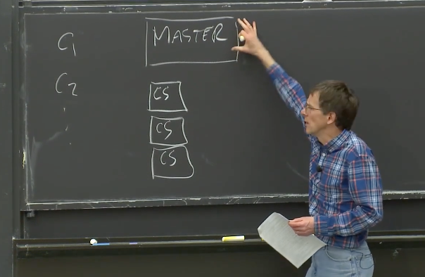

在这里，**Master节点用来管理文件和Chunk的信息，而Chunk服务器用来存储实际的数据**，Master节点知道每一个文件对应的所有的Chunk的ID。

我们需要知道Master节点内保存的数据内容，这里我们关心的主要是两个表单：

第一个是**文件名到Chunk ID或者Chunk Handle数组的对应**。这个表单告诉你，文件对应了哪些Chunk。

第二个表单记录了**Chunk ID到Chunk数据的对应关系**。这里的数据又包括了：

1. 每个Chunk存储在哪些服务器上，所以这部分是Chunk服务器的列表
2. 每个Chunk当前的版本号，所以Master节点必须记住每个Chunk对应的版本号。

**所有对于Chunk的写操作都必须在主Chunk（Primary Chunk）上顺序处理，主Chunk是Chunk的多个副本之一**。Master节点必须记住哪个Chunk服务器持有主Chunk。并且，**主Chunk只能在特定的租约时间内担任主Chunk**，所以，**Master节点要记住主Chunk的租约过期时间**。

**以上数据都存储在内存中**，为了能让Master重启而不丢失数据，**Master节点会同时将数据存储在磁盘上**。Master节点读数据只会从内存读，但是写数据的时候，**Master会在磁盘上存储log，每次有数据变更时，Master会在磁盘的log中追加一条记录，并生成CheckPoint（类似于备份点）**。

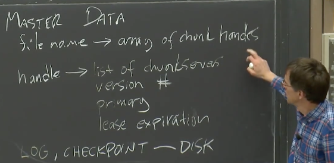

有些数据需要存在磁盘上，而有些不用。它们分别是：

1. Chunk Handle的数组（第一个表单）要保存在磁盘上，标记成NV（non-volatile, 非易失）。
2. Chunk服务器列表不用保存到磁盘上。因为Master节点重启之后可以与所有的Chunk服务器通信，并查询每个Chunk服务器存储了哪些Chunk，这里标记成V（volatile），
3. 版本号标记成NV。
4. 主Chunk的ID。Master节点重启之后会忘记谁是主Chunk，它只需要等待60秒租约到期，这个时候，Master节点可以安全指定一个新的主Chunk。这里标记成V。
5. 租约过期时间标记成V。

当需要新增一个Chunk或者由于指定了新的主Chunk而导致版本号更新了，Master节点需要向磁盘中的Log追加一条记录。每次有这样的更新，都需要写磁盘。

**这里在磁盘中维护log而不是数据库的原因是，数据库本质上来说是某种B树（b-tree）或者hash table，相比之下，追加log会非常的高效，因为你可以将最近的多个log记录一次性的写入磁盘**。因为这些数据都是向同一个地址追加，这样只需要等待磁盘的磁碟旋转一次。而对于B树来说，每一份数据都需要在磁盘中随机找个位置写入。所以使用Log可以使得磁盘写入更快一些。

当Master节点故障重启，并重建它的状态，你不会想要从log的最开始重建状态，因为log的最开始可能是几年之前，**所以Master节点会在磁盘中创建一些checkpoint点，这可能要花费几秒甚至一分钟。这样Master节点重启时，会从log中的最近一个checkpoint开始恢复，再逐条执行从Checkpoint开始的log，最后恢复自己的状态。**

## 3.2 GFS读文件

1. 应用程序想读取某个特定文件的某个特定的偏移位置上的某段特定长度的数据，比如说第1000到第2000个字节的数据。所以，应用程序将文件名，长度和起始位置发送给Master节点。
2. Master节点将Chunk Handle（也就是ID，记为H）和服务器列表发送给客户端。
3. 现在客户端可以从这些Chunk服务器中挑选一个来读取数据。**客户端会选择一个网络上最近的服务器**（Google的数据中心中，IP地址是连续的，所以可以从IP地址的差异判断网络位置的远近），并将读请求发送到那个服务器。因为客户端每次可能只读取1MB或者64KB数据，所以，客户端可能会连续多次读取同一个Chunk的不同位置。所以，**客户端会缓存Chunk和服务器的对应关系**，这样，当再次读取相同Chunk数据时，就不用一次次的去向Master请求相同的信息。

4. 接下来，客户端会与选出的Chunk服务器通信，将Chunk Handle和偏移量发送给那个Chunk服务器。Chunk服务器在本地的硬盘上将每个Chunk存储成独立的Linux文件，并通过普通的Linux文件系统管理。并且可以推测，Chunk文件会按照Handle（也就是ID）命名。所以，Chunk服务器需要做的就是根据文件名找到对应的Chunk文件，之后从文件中读取对应的数据段，并将数据返回给客户端。

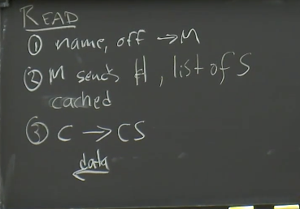

## 3.3 GFS写文件

写文件时应用程序会告诉库函数说，我想对这个文件名的文件在这个数据段写入当前存在buffer中的数据。这里只讨论对文件名对应的文件**追加数据**，这里需要知道文件最后一个Chunk的位置。

**对于读文件来说，可以从任何最新的Chunk副本读取数据，但是对于写文件来说，必须要通过Chunk的主副本（Primary Chunk）来写入**。

1. 找出新的Chunk副本。Master节点需要能够在Chunk的多个副本中识别出，哪些副本是新的，哪些是旧的。每个Chunk可能同时有多个副本，最新的副本是指，**副本中保存的版本号与Master中记录的Chunk的版本号一致**。Chunk副本中的版本号是由Master节点下发的。如果Master节点重启，并且与Chunk服务器交互，同时一个Chunk服务器重启，并上报了一个比Master记住的版本更高的版本。Master会认为它在分配新的Primary服务器时出现了错误，并且会**使用这个更高的版本号来作为Chunk的最新版本号**。
2. Master等所有存储了最新Chunk版本的服务器集合完成，然后挑选一个作为Primary，其他的作为Secondary。

3. Master增加版本号，并将版本号写入磁盘。

4. Master节点会向Primary和Secondary副本对应的服务器发送消息并告诉它们，谁是Primary，谁是Secondary，Chunk的新版本是什么。

5. 现在有了一个Primary，它可以接收来自客户端的写请求，并将写请求应用在多个Chunk服务器中。之所以要管理Chunk的版本号，是因为这样Master可以**将实际更新Chunk的能力转移给Primary服务器**。并且在将版本号更新到Primary和Secondary服务器之后，如果Master节点故障重启，还是可以在相同的Primary和Secondary服务器上继续更新Chunk。

6. Master节点通知Primary和Secondary服务器，你们可以修改这个Chunk。它还给Primary一个租约。这种机制可以确保我们不会同时有两个Primary。

7. 客户端会将要追加的数据发送给Primary和Secondary服务器，这些服务器会将数据写入到一个临时位置。所以最开始，这些数据不会追加到文件中。当**所有的服务器都返回确认消息**说，**已经有了要追加的数据，客户端会向Primary服务器发送一条消息**说，你和所有的Secondary服务器都有了要追加的数据，现在我想将这个数据追加到这个文件中。Primary服务器或许会从大量客户端收到大量的并发请求，Primary服务器会以某种顺序，一次只执行一个请求。对于每个客户端的追加数据请求（也就是写请求），Primary会查看当前文件结尾的Chunk，并确保Chunk中有足够的剩余空间，然后将客户端要追加的数据写入Chunk的末尾。并且，Primary会通知所有的Secondary服务器也将客户端要追加的数据写入在它们自己存储的Chunk末尾。

8. 对于Secondary服务器来说，它们可能执行成功，也可能会执行失败，比如说磁盘空间不足，比如说故障了，比如说Primary发出的消息网络丢包了。如果Secondary实际真的将数据写入到了本地磁盘存储的Chunk中，**它会回复“yes”给Primary**。如果所有的Secondary服务器都成功将数据写入，**Primary会向客户端返回写入成功**。如果至少一个Secondary服务器没有回复Primary或者磁盘故障了，**Primary会向客户端返回写入失败**。
9. 如果客户端从Primary得到写入失败，那么客户端应该重新发起整个追加过程。

> 学生提问：写文件失败之后Primary和Secondary服务器上的状态如何恢复？
>
> Robert教授：如果某些副本没有成功执行，Primary会回复客户端说执行失败。之后客户端会认为数据没有追加成功。但是实际上，部分副本还是成功将数据追加了。所以现在，一个Chunk的部分副本成功完成了数据追加，而另一部分没有成功，这种状态是可接受的，没有什么需要恢复，这就是GFS的工作方式。
>
> 学生提问：写文件失败之后，读Chunk数据会有什么不同？
>
> Robert教授：如果写文件失败之后，一个客户端读取相同的Chunk，客户端可能可以读到追加的数据，也可能读不到，取决于客户端读的是Chunk的哪个副本
>
> 学生提问：如果是对一个新的文件进行追加，那这个新的文件没有副本，会怎样？
>
> Robert教授：Master会从客户端收到一个请求说，我想向这个文件追加数据。我猜，Master节点会发现，该文件没有关联的Chunk。Master节点或许会通过随机数生成器创造一个新的Chunk ID。之后，Master节点通过查看自己的Chunk表单发现，自己其实也没有Chunk ID对应的任何信息。之后，Master节点会创建一条新的Chunk记录说，我要创建一个新的版本号为1，再随机选择一个Primary和一组Secondary并告诉它们，你们将对这个空的Chunk负责，请开始工作。论文里说，每个Chunk默认会有三个副本，所以，通常来说是一个Primary和两个Secondary。

## 3.4 GFS的一致性

当客户端发送了一个追加数据的请求，要将数据A追加到文件末尾，所有的三个副本都成功的将数据追加到了Chunk，所以Chunk中的第一个记录是A。

假设第二个客户端加入进来，想要追加数据B，但是由于网络问题发送给某个副本的消息丢失了。所以，追加数据B的消息只被两个副本收到。

之后，第三个客户端想要追加数据C，并且第三个客户端记得下图中左边第一个副本是Primary。**Primary选择了偏移量**，并将偏移量告诉Secondary。三个副本都将数据C写在这个位置。

对于数据B来说，客户端会收到写入失败的回复，客户端会重发写入数据B的请求。现在三个副本都在线，并且都有最新的版本号。

或许最坏的情况是，一些客户端写文件时，因为其中一个Secondary未能成功执行数据追加操作，客户端从Primary收到写入失败的回复。在客户端重新发送写文件请求之前，客户端就故障了。所以，你有可能进入这种情形：数据D出现在某些副本中，而其他副本则完全没有。

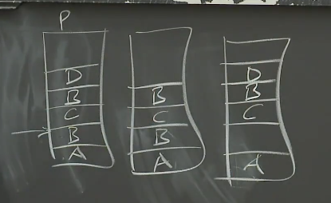

在GFS的这种工作方式下，如果Primary返回写入成功，那么一切都还好，如果Primary返回写入失败，就不是那么好了。Primary返回写入失败会导致不同的副本有完全不同的数据。

如果你想要将GFS升级成强一致系统：

你可能需要让Primary来探测重复的请求，尝试确保B不会在文件中出现两次。

1. 对于Secondary来说，如果Primay要求Secondary执行一个操作，**Secondary必须要执行而不是只返回一个错误给Primary**。如果Secondary有一些永久性故障，你需要有一种机制将Secondary从系统中移除，这样Primary可以与剩下的Secondary继续工作。
2. 当Primary要求Secondary追加数据时，直到Primary确信所有的Secondary都能执行数据追加之前，Secondary必须小心不要将数据暴露给读请求。所以对于写请求，你或许需要多个阶段。在第一个阶段，Primary向Secondary发请求，要求其执行某个操作，并等待Secondary回复说能否完成该操作，这时Secondary并不实际执行操作。在第二个阶段，如果所有Secondary都回复说可以执行该操作，这时Primary才会说，好的，所有Secondary执行刚刚你们回复可以执行的那个操作。这是现实世界中很多强一致系统的工作方式，这被称为**两阶段提交**（Two-phase commit）。
3. 当Primary崩溃时，可能有一组操作由Primary发送给Secondary，Primary在确认所有的Secondary收到了请求之前就崩溃了。当一个Primary崩溃了，一个Secondary会接任成为新的Primary，但是这时，新Primary和剩下的Secondary会在最后几个操作有分歧，因为部分副本并没有收到前一个Primary崩溃前发出的请求。所以，**新的Primary上任时，需要显式的与Secondary进行同步**，以确保操作历史的结尾是相同的。
4. 时不时的，Secondary之间可能会有差异，或者客户端从Master节点获取的是稍微过时的Secondary。系统要么需要将所有的读请求都发送给Primary，因为只有Primary知道哪些操作实际发生了，要么对于Secondary需要一个租约系统，就像Primary一样，这样就知道Secondary在哪些时间可以合法的响应客户端。

为了实现强一致，以上就是我认为的需要在系统中修复的东西，它们增加了系统的复杂度，增加了系统内部组件的交互。

最后，让我花一分钟来介绍GFS在它生涯的前5-10年在Google的出色表现，总的来说，它取得了巨大的成功，许多许多Google的应用都使用了它，许多Google的基础架构，例如BigTable和MapReduce是构建在GFS之上，所以GFS在Google内部广泛被应用。它最严重的局限可能在于，它只有一个Master节点，会带来以下问题：

1. Master节点必须为每个文件，每个Chunk维护表单，随着GFS的应用越来越多，这意味着涉及的文件也越来越多，最终Master会耗尽内存来存储文件表单。你可以增加内存，但是单台计算机的内存也是有上限的。所以，这是人们遇到的最早的问题。
2. 单个Master节点要承载数千个客户端的请求，而Master节点的CPU每秒只能处理数百个请求，尤其Master还需要将部分数据写入磁盘，很快，客户端数量超过了单个Master的能力。
3. 应用程序发现很难处理GFS奇怪的语义（本节最开始介绍的GFS的副本数据的同步，或者可以说不同步）。
4. 从我们读到的GFS论文中，Master节点的故障切换不是自动的。GFS需要人工干预来处理已经永久故障的Master节点，并更换新的服务器，这可能需要几十分钟甚至更长的而时间来处理。对于某些应用程序来说，这个时间太长了。

## 论文阅读：*The Google File System*

### GFS的目标

主要设计目标：

1. 大型：大容量，需要存放大量的数据集；
2. 性能：自动分片(Auto-Sharding)；
3. 全局：不只是为一个应用而定制，适用于各种不同的应用；
4. 容错：自动容错，不希望每次服务器出了故障，都要手动去修复；

还有一些其他的特性，比如：

1. GFS 只能在一个数据中心运行，理论上可以跨机房，但更复杂；
2. 面向内部的，不开放销售；
3. 面向顺序读写大文件的工作负载(例如前面提到的 MapReduce)；

### 架构

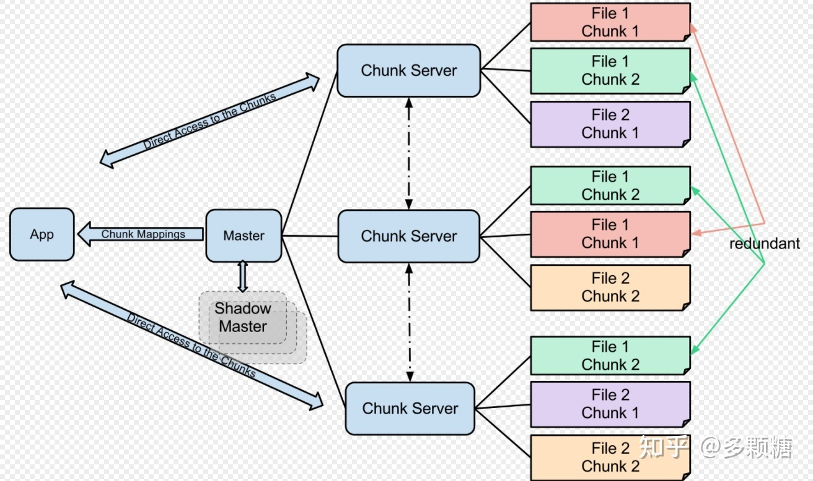

GFS集群包括：一个master和多个chunkserver，并且若干个client会与之交互

主要架构特性：

1. **chunk**：存储在 GFS 中的文件分为多个 chunk，chunk 大小为 64M，每个 chunk 在创建时 master 会分配一个不可变、全局唯一的 64 位标识符(`chunk handle`)；**默认情况下，一个 chunk 有 3 个副本，分别在不同的 chunkserver 上**。
2. **master**：维护文件系统的 **metadata**，它知道文件被分割为哪些 chunk、以及这些 chunk 的存储位置；它还负责 chunk 的迁移、重新平衡(rebalancing)和垃圾回收；此外，master 通过HeartBeat与 chunkserver 通信，向其传递指令，并收集状态。
3. **client**：首先向 master 询问文件 metadata，然后根据 metadata 中的位置信息去对应的 chunkserver 获取数据；
4. **chunkserver**：存储 chunk，**client 和 chunkserver 不会缓存 chunk 数据，防止数据出现不一致**；

### master节点

为了简化设计，GFS 只有一个 master 进行全局管理。master 在内存中存储 3 种 metadata，如下。**标记 nv(non-volatile, 非易失) 的数据需要在写入的同时存到磁盘**，标记 v 的数据 master 会在启动后查询 chunkserver 集群：

1. namespace(即：目录层次结构)和文件名；(nv)

2. 文件名 -> `array of chunk handles` 的映射；(nv)

3. `chunk handles` -> 版本号(nv)、list of chunkservers(v)、primary(v)、租约(v)

### 快照（snapshot）

GFS 通过 snapshot 来创建一个文件或者目录树的备份，它可以用于备份文件或者创建 checkpoint（用于恢复）。GFS 使用写时复制（copy-on-write)来写快照。

当 master 收到 snapshot 操作请求后：

1. 暂停所有写操作
2. master 将操作记录写入磁盘
3. master 将源文件和目录树的 metadata 进行复制，新创建的快照文件指向与源文件相同的 chunk

### 容错性

1. **快恢复**：master 和 chunkserver 都设计成在几秒钟内恢复状态和重启；
2. **chunk 副本**：如前面提到的，chunk 复制到多台机器上；
3. **master 副本**：master 也会被复制来保证可用性，称为 shadow-master；

### 数据完整性 checksum

每一个 chunkserver 都是用 `checksum` 来检查存储数据的完整性。

每个 chunk 以 64kb 的块进行划分 ，每一个块对应一个 32 位的 `checksum`，存到 chunkserver 的内存中，通过记录用户数据来持久化存储 `checksum`。对于读操作，在返回给 client 之前，chunkserver 会校验要读取块的 `checksum`。

为什么是 64Kb 呢？可能是 64Mb/64Kb 好计算吧。

### 关于论文的部分问题

#### chunk 大小为什么是 64 MB？

1. 较大的 chunk 减少了 client 与 master 的通信次数；
2. client 能够对一个块进行多次操作，这样可以通过与 chunkserver 保持较长时间的 TCP 连接来减少网络负载；
3. 减少了 metadata 的大小；

带来的问题：chunk 越大，可能部分文件只有 1 个 chunk，对该文件的频繁读写可能会造成热点问题。

#### 为什么是 3 个副本？

选择这个数字是为了最大限度地降低一个块坏的概率。

#### 引用计数

引用计数用来实现 copy-on-write 生成快照。当 GFS 创建一个快照时，它并不立即复制 chunk，而是增加 GFS 中 chunk 的引用计数，表示这个 chunk 被快照引用了，等到客户端修改这个 chunk 时，才需要在 chunkserver 中拷贝 chunk 的数据生成新的 chunk，后续的修改操作落到新生成的 chunk 上。

# Lecture 04 - VMware ET

## 4.1 复制方法：状态转移和复制状态机

**状态转移**背后的思想是，Primary将自己完整状态，比如说内存中的内容，拷贝并发送给Backup。Backup会保存收到的最近一次状态，所以Backup会有所有的数据。

**复制状态机**不会在不同的副本之间发送状态，而是将发送给Primary的外部事件发送给Backup。。

VMware FT论文讨论的都是复制状态机，并且只涉及了单核CPU（面对多核和并行计算，状态转移更加健壮）。

GFS也有复制，但是它绝对没有在Primary和Backup之间复制内存中的每一个bit，它复制的更多是应用程序级别的Chunk。**VMware FT的独特之处在于，它复制底层的寄存器和内存**。所以，它的缺点是，它没有那么的高效，优点是，你可以将任何现有的软件，甚至你不需要有这些软件的源代码，你也不需要理解这些软件是如何运行的，在某些限制条件下，你就可以将这些软件运行在VMware FT的这套复制方案上。VMware FT就是那个可以让任何软件都具备容错性的魔法棒。

## 4.2 VMware FT 工作原理

VMware FT需要两个物理服务器还有一些客户端。

所以，基本的工作流程是：

1. 假设Primary和Backup互为副本。某些我们服务的客户端，向Primary发送了一个请求，这个请求以网络数据包的形式发出。
2. Primary和Backup都会收到网络数据包
5. 当然，虚机内的服务会回复客户端的请求。在Primary虚机里面，服务会生成一个回复报文，并通过VMM在虚机内模拟的虚拟网卡发出。之后VMM可以看到这个报文，它会实际的将这个报文发送给客户端。
6. 另一方面，由于Backup虚机运行了相同顺序的指令，它也会生成一个回复报文给客户端，并将这个报文通过它的VMM模拟出来的虚拟网卡发出。但是它的VMM知道这是Backup虚机，会丢弃这里的回复报文（Primary会等到Backup已经有了最新的数据，才会将回复返回给客户端。**这几乎是所有的复制方案中对于性能产生伤害的地方**）。因此Primary和Backup都看见了相同的输入，但是只有Primary虚机实际生成了回复报文给客户端。

这里有一个术语，VMware FT论文中将Primary到Backup之间同步的数据流的通道称之为Log Channel。虽然都运行在一个网络上，但是这些从Primary发往Backup的事件被称为Log Channel上的Log Event/Entry。

当Primary因为故障停止运行时，FT（Fault-Tolerance）就开始工作了。每个Primary的定时器中断都会生成一条Log条目并发送给Backup，这些定时器中断每秒大概会有100次。当Backup不再从Primary收到消息，VMware FT论文的描述是，Backup虚机会上线（Go Alive）。Backup的VMM会在网络中做一些处理（猜测是发GARP），让后续的客户端请求发往Backup虚机，而不是Primary虚机。到此为止，Backup虚机接管了服务。

## 4.3 重复输出

当Primary回复报文已经从VMM发往客户端了，客户端收到了回复，但是Primary虚机崩溃了。而在Backup侧，客户端请求还堆积在Backup对应的VMM的Log等待缓冲区），也就是说客户端请求还没有真正发送到Backup虚机中。这时Backup接管服务，Backup首先需要消费所有在等待缓冲区中的Log，以保持与Primay在相同的状态，这样客户端就可能收到相同的回复。

好消息是，客户端通过TCP与服务进行交互，也就是说客户端请求和回复都通过TCP Channel收发。当Backup接管服务时，因为它的状态与Primary相同，所以它知道TCP连接的状态和TCP传输的序列号。当Backup生成回复报文时，**这个报文的TCP序列号与之前Primary生成报文的TCP序列号是一样的，这样客户端的TCP栈会发现这是一个重复的报文，它会在TCP层面丢弃这个重复的报文，用户层的软件永远也看不到这里的重复**。

这里可以认为是异常的场景，并且被意外的解决了。但是事实上，**对于任何有主从切换的复制系统，基本上不可能将系统设计成不产生重复输出**。

## 4.4 Test - and - Set服务

Primary和Backup都在运行，**但是它们之间的网络出现了问题**，同时它们各自又能够与一些客户端通信。这时，它们都会以为对方挂了，自己需要上线并接管服务。

这时VMware FT需要通过网络支持Test-and-Set服务。为了能够上线，Primary和Backup或许会同时发送一个Test-and-Set请求到Test-and-Set服务器。由Test-and-Set决定了两个副本中哪一个应该上线。

Test-and-Set服务本质上来说，这是一种简化了的锁服务。

# Lecture 06 - Raft1

## 6.1 过半票决

当网络出现故障，将网络分割成两半，网络的两边独自运行，且不能访问对方，这通常被称为**网络分区**。

在构建能自动恢复，同时又避免脑裂的多副本系统时，关键点在于**过半票决**（Majority Vote）。服务器的数量要是**奇数**。这样**在任何时候为了完成任何操作，你必须凑够过半的服务器来批准相应的操作**。这里过半是指**所有服务器数量的一半**。

新的Leader必然知道旧Leader使用的任期号（term number）以及旧Leader提交的操作，因为新Leader的过半服务器必然与旧Leader的过半服务器有重叠。这是Raft能正确运行的一个重要因素。

## 6.2 Raft初探

Raft会以库（Library）的形式存在于服务中。如果你有一个基于Raft的多副本服务，那么每个服务的副本将会由两部分组成：应用程序代码和Raft库。应用程序代码接收RPC或者其他客户端请求；不同节点的Raft库之间相互合作，来维护多副本之间的操作同步。从软件的角度来看一个Raft节点，节点上层是应用程序代码，应用程序通常都有状态。同时Raft本身也会保持状态，Raft的状态中，最重要的就是Raft记录操作的日志。

客户端就是一些外部程序代码，它们想要使用服务，会将请求发送给当前Raft集群中的Leader节点对应的应用程序。这里的请求就是应用程序级别的请求。

假设客户端将请求发送给Raft的Leader节点，在服务端程序的内部，应用程序只会将来自客户端的请求对应的操作向下发送到Raft层，并且告知Raft层，请把这个操作提交到多副本的日志（Log）中，并在完成时通知我。

之后，Raft节点之间相互交互，直到过半的Raft节点将这个新的操作加入到它们的日志中，也就是说这个操作被过半的Raft节点复制了。

当且仅当Raft的Leader节点知道了过半节点的副本都有了这个操作的拷贝之后。Raft的Leader节点中的Raft层，会向上发送一个通知到应用程序，也就是Key-Value数据库。

## 6.3 Log同步时序

接下来我将画一个时序图来描述Raft内部的消息是如何工作的。

1. 假设客户端将请求发送给服务器1，这里的客户端请求就是一个简单的请求，例如一个Put请求。
2. 之后，服务器1的Raft层会发送一个添加日志（AppendEntries）的RPC到其他两个副本（S2，S3）。现在服务器1会一直等待其他副本节点的响应，一直等到过半节点的响应返回。这里的过半节点包括Leader自己。所以在一个只有3个副本节点的系统中，Leader只需要等待一个其他副本节点。
3. 当Leader收到了过半服务器的正确响应，Leader会执行（来自客户端的）请求，得到结果，并将结果返回给客户端。
4. 与此同时，服务器3可能也会将它的响应返回给Leader，尽管这个响应是有用的，**但是这里不需要等待这个响应**。这一点对于理解Raft论文中的图2是有用的。
5. 现在Leader知道过半服务器已经添加了Log，可以执行客户端请求，并返回给客户端。但是服务器2还不知道这一点，服务器2只知道：我从Leader那收到了这个请求，但是我不知道这个请求是不是已经被Leader提交（committed）了，这取决于我的响应是否被Leader收到。服务器2只知道，它的响应提交给了网络，或许Leader没有收到这个响应，也就不会决定commit这个请求。所以这里还有一个阶段。一旦Leader发现请求被commit之后，它需要将这个消息通知给其他的副本。
6. 在Raft中，没有明确的committed消息。相应的，committed消息被夹带在下一个AppendEntries消息中，由Leader下一次的AppendEntries对应的RPC发出。

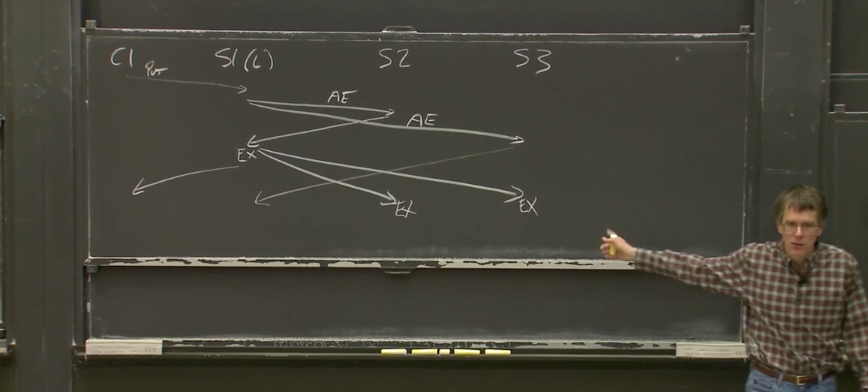

## 6.4 日志

1. **Log是Leader用来对操作排序的一种手段**。Log与其他很多事物，共同构成了Leader对接收到的客户端操作分配顺序的机制。
2. **Logy是用来存放临时操作的地方**。Follower收到了这些临时的操作，但是还不确定这些操作是否被commit了，**这些操作可能会被丢弃**。
3. **如果一些Follower由于网络原因或者其他原因短时间离线了或者丢了一些消息，Leader需要能够向Follower重传丢失的Log消息**。
4. **它可以帮助重启的服务器恢复状态**。

> 学生提问：假设Leader每秒可以执行1000条操作，Follower只能每秒执行100条操作，并且这个状态一直持续下去，会怎样？
>
> Robert（教授）：我认为，在一个实际的系统中，你需要一个额外的消息，这个额外的消息可以夹带在其他消息中，也不必是实时的，但是你或许需要一些通信来（让Follower）告诉Leader，Follower目前执行到了哪一步。这样Leader就能知道自己在操作执行上领先太多。
>

## 6.5 应用层接口

在Raft集群中，每一个副本上，这两层之间主要有两个接口。

1. key-value层用来转发客户端请求的接口，称之为Start函数。这个函数只接收一个参数，就是客户端请求。

2. Raft层会通知key-value层刚刚在Start函数中传给我的请求已经commit了。Raft层通知的，不一定是最近一次Start函数传入的请求。这个向上的接口以go channel中的一条消息的形式存在。这里有个叫做applyCh的channel，通过它你可以发送ApplyMsg消息。

key-value层需要知道从applyCh中读取的消息对应之前调用的哪个Start函数。在ApplyMsg中，将会包含请求（command）和对应的Log位置（index）。

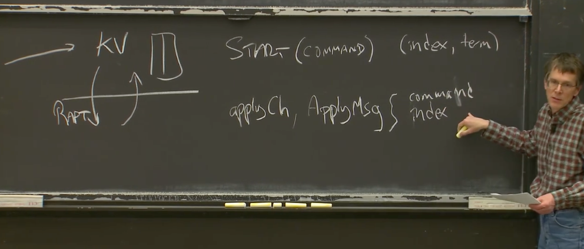

## 6.6 Leader选举

通常情况下，如果服务器不出现故障，**有一个Leader的存在，会使得整个系统更加高效**。对于一个无Leader的系统，通常需要一轮消息来确认一个临时的Leader，之后第二轮消息才能确认请求。所以，**使用一个Leader可以提升系统性能至2倍**。同时，有一个Leader可以更好的理解Raft系统是如何工作的。

Raft生命周期中可能会有不同的Leader，它使用任期号（term number）来区分不同的Leader。Followers（非Leader副本节点）不需要知道Leader的ID，它们只需要知道当前的任期号。每个Raft节点都有一个选举定时器（Election Timer），**如果在这个定时器时间耗尽之前，当前节点没有收到任何当前Leader的消息，这个节点会认为Leader已经下线，并开始一次选举（并不是Leader没有故障，就不会有选举）**。

开始一次选举的意思是，当前服务器会增加任期号（term number），因为它想成为一个新的Leader。之后，当前服务器会发出请求投票（RequestVote）RPC，这个消息会发送到另外的N-1个节点（Leader的候选人总是会在选举时投票给自己）。

当一个服务器赢得了一次选举，这个服务器会收到过半的认可投票，这个服务器会直接知道自己是新的Leader，然后通过HeartBeat通知其他服务器。Raft规定，**除非是当前任期的Leader，没人可以发出AppendEntries消息。其他服务器通过接收特定任期号的AppendEntries来知道，选举成功了**。

## 6.7 选举定时器

**任何一条AppendEntries消息都会重置所有Raft节点的选举定时器**。所以只要所有环节都在正常工作，不断重复的HeartBeat会阻止任何新的选举发生。

如果一次选举选出了0个Leader，这次选举就失败了，接下来它们的选举定时器会重新计时，因为选举定时器只会在收到了AppendEntries消息时重置，但是由于没有Leader，所有也就没有AppendEntries消息。所有的选举定时器重新开始计时，如果我们不够幸运的话，所有的定时器又会在同一时间到期，所有节点又会投票给自己，又没有人获得了过半投票，这个状态可能会一直持续下去。

Raft不能完全避免分割选票（Split Vote），但是可以通过为选举定时器随机选择超时时间来尽可能避免这一情况。

一个明显的要求是，**选举定时器的超时时间需要至少大于Leader的HeartBeat间隔**。**实际上由于网络可能丢包，这里你或许希望将下限设置为多个HeartBeat间隔**。

那超时时间的上限呢？

首先，这里的**最大超时时间影响了系统能多快从故障中恢复**。因为从旧的Leader故障开始，到新的选举开始这段时间，整个系统是瘫痪了。尽管还有一些其他服务器在运行，但是因为没有Leader，客户端请求会被丢弃。如果故障很频繁，那么我们或许就该关心恢复时间有多长。

另一个需要考虑的点是，不同节点的选举定时器的超时时间差（S2和S3之间）必须要足够长，使得第一个开始选举的节点能够完成一轮选举。这里至少需要大于发送一条RPC所需要的往返（Round-Trip）时间。或许需要10毫秒来发送一条RPC，并从其他所有服务器获得响应。如果这样的话，我们需要设置超时时间的上限到足够大，从而使得两个随机数之间的时间差极有可能大于10毫秒。

**在Lab2中，如果你的代码不能在几秒内从一个Leader故障的场景中恢复的话，测试代码会报错。所以这种场景下，你们需要调小选举定时器超时时间的上限。这样的话，你才可能在几秒内完成一次Leader选举。这并不是一个很严格的限制。**

**每一次一个节点重置自己的选举定时器时，都需要重新选择一个随机的超时时间。**

## 6.8 可能的异常情况

一个旧Leader在各种奇怪的场景下故障之后，为了恢复系统的一致性，一个新任的Leader如何能整理在不同副本上可能已经不一致的Log？

这种情况是可能发生的（这里写的值是Log条目对应的任期号，而不是Log记录的客户端请求）。假设S3是任期3的Leader，它收到了一个客户端请求，之后发送给其他服务器。其他服务器收到了相应的AppendEntries消息，并添加Log到本地，这是槽位1的情况。之后，S3从客户端收到了第二个请求，它还是需要将这个请求发送给其他服务器。但是这里有三种情况：

1. 发送给S1的消息丢了
2. S1当时已经关机了
3. S3在向S2发送完AppendEntries之后，在向S1发送AppendEntries之前故障了

现在，只有S2和S3有槽位2的Log。

如果现任Leader S3故障了，首先我们需要新的选举，之后某个节点会被选为新的Leader。接下来会发生两件事情：

1. 新的Leader需要认识到，槽位2的请求可能已经commit了，从而不能丢弃。
2. 新的Leader需要确保S1在槽位2记录与其他节点完全一样的请求。

这种场景是可能发生的。我们假设S2在槽位12时，是任期4的新Leader，它收到了来自客户端的请求，将这个请求加到了自己的Log中，然后就故障了。

因为Leader故障了，我们需要一次新的选举。我们来看哪个服务器可以被选为新的Leader。这里S3可能被选上，因为它只需要从过半服务器获得认可投票，而在这个场景下，过半服务器就是S1和S3。所以S3可能被选为任期5的新Leader，之后收到了来自客户端的请求，将这个请求加到自己的Log中，然后故障了。之后就到了例子中的场景了。

因为可能发生，Raft必须能够处理这种场景。我们知道在槽位10的Log，3个副本都有记录，它**可能**已经commit了，所以我们不能丢弃它。类似的在槽位11的Log，因为它被过半服务器记录了，它也可能commit了，所以我们也不能丢弃它。在槽位12记录的两个Log（分别是任期4和任期5），都没有被commit，所以Raft可以丢弃它们。这**里没有要求必须都丢弃它们，但是至少需要丢弃一个Log，因为最终你还是要保持多个副本之间的Log一致。**

# Lecture 07 - Raft2

## 7.1 日志恢复

假设S3在任期6被选为Leader。在某个时刻，新Leader S3会发送任期6的第一个AppendEntries RPC，来传输任期6的第一个Log。

这里的AppendEntries消息实际上有两条，因为要发给两个Followers。它们包含了客户端发送给Leader的请求。**这里的AppendEntries RPC还包含了prevLogIndex字段和prevLogTerm字段**。所以Leader在发送AppendEntries消息时，会附带前一个槽位的信息。在我们的场景中，prevLogIndex是前一个槽位的位置，也就是12；prevLogTerm是S3上前一个槽位的任期号，也就是5。

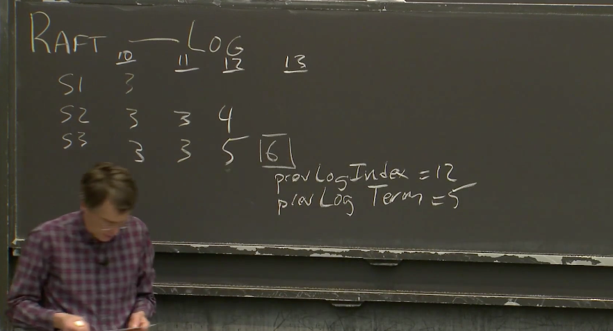

**Followers在写入Log之前，会检查本地的前一个Log条目，是否与Leader发来的有关前一条Log的信息匹配。**

所以对于S2 它显然是不匹配的。S2 在槽位12已经有一个条目，但是它来自任期4，而不是任期5。所以S2将拒绝这个AppendEntries，并返回False给Leader。S1在槽位12还没有任何Log，所以S1也将拒绝Leader的这个AppendEntries。所以Leader看到了两个拒绝。

**Leader为每个Follower维护了nextIndex**。所以它有一个S2的nextIndex，还有一个S1的nextIndex。这意味着Leader对于其他两个服务器的nextIndex都是13。这种情况发生在Leader刚刚当选，因为Raft论文规定了，nextIndex的初始值是从新任Leader的最后一条日志开始。

**为了响应Followers返回的拒绝，Leader会减小对应的nextIndex**。所以它现在减小了两个Followers的nextIndex。这一次，Leader发送的AppendEntries消息中，prevLogIndex等于11，prevLogTerm等于3。**同时，这次Leader发送的AppendEntries消息包含了prevLogIndex之后的所有条目**，也就是S3上槽位12和槽位13的Log。

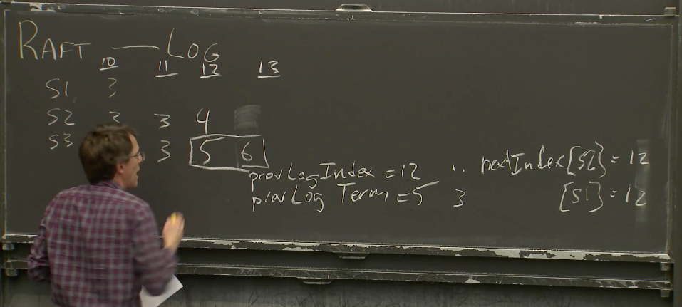

对于S2来说，这次收到的AppendEntries消息中，prevLogIndex等于11，prevLogTerm等于3，与自己本地的Log匹配，所以，S2会接受这个消息。Raft论文中的图2规定，如果接受一个AppendEntries消息，那么需要首先删除本地相应的Log（如果有的话），再用AppendEntries中的内容替代本地Log。这个时候，S2的Log与S3保持了一致。

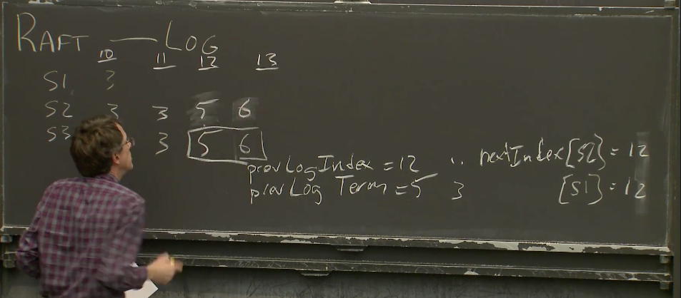

但是，S1仍然有问题，因为它的槽位11是空的，所以它不能匹配这次的AppendEntries。它将再次返回False。而Leader会将S1对应的nextIndex变为11，并在AppendEntries消息中带上从槽位11开始之后的Log（也就是槽位11，12，13对应的Log）。并且带上相应的prevLogIndex（10）和prevLogTerm（3）。

这次的请求可以被S1接受，并得到肯定的返回。现在它们都有了一致的Log。

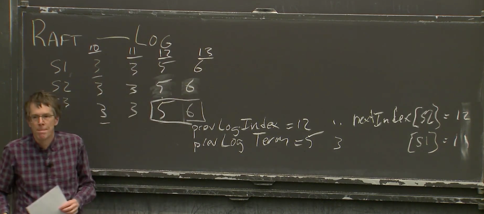

**而Leader在收到了Followers对于AppendEntries的肯定的返回之后，它会增加相应的nextIndex到14。** 

## 7.2 选举约束

为了保证系统的正确性，并非任意节点都可以成为Leader。不是说第一个选举定时器超时了并触发选举的节点就一定是Leader。

为什么不选择拥有最长Log记录的节点作为Leader？

这个场景可能出现吗？让我们回退一些时间，在这个时间点S1赢得了选举，现在它的任期号是6。它收到了一个客户端请求，在发出AppendEntries之前，它先将请求存放在自己的Log中，然后它就故障了，所以它没能发出任何AppendEntries消息。之后它很快就故障重启了，因为它是之前的Leader，所以会有一场新的选举。这次，它又被选为Leader。然后它收到了一个任期7的客户端请求，将这个请求加在本地Log之后，它又故障了。

S1故障之后，我们又有了一次新的选举，这时S1已经关机了，不能再参加选举，这次S2被选为Leader。如果S2当选，而S1还在关机状态，S2会使用什么任期号呢？

明显我们的答案是8。尽管没有写在黑板上，但是S1在任期6，7能当选，它必然拥有了过半节点的投票，过半服务器至少包含了S2，S3中的一个节点。当某个节点为候选人投票时，**节点应该将候选人的任期号记录在持久化存储中**。因此，当S1故障了，它们中至少一个知道当前的任期是8。**这里，只有知道了任期8的节点才有可能当选，如果只有一个节点知道，那么这个节点会赢得选举，因为它拥有更高的任期号**。所以我们现在有了这么一个场景。

Raft有一个稍微复杂的选举限制（Election Restriction）。这个限制要求，在处理别节点发来的RequestVote RPC时，需要做一些检查才能投出赞成票。节点只能向满足下面条件之一的候选人投出赞成票：

1. 候选人最后一条Log条目的任期号**大于**本地最后一条Log条目的任期号；
2. 候选人最后一条Log条目的任期号**等于**本地最后一条Log条目的任期号，且候选人的Log记录长度**大于等于**本地Log记录的长度

如果S2或者S3成为了候选人，它们中的另一个都会投出赞成票，因为它们最后的任期号一样，并且它们的Log长度大于等于彼此（满足限制2）。所以S2或者S3中的任意一个都会为另一个投票。S1会为它们投票吗？会的，因为S2或者S3最后一个Log条目对应的任期号更大（满足限制1）。

## 7.3 快速恢复

在日志恢复机制中，如果Log有冲突，Leader每次会回退一条Log条目。但在现实的场景中，可能一个Follower关机了很长时间，错过了大量的AppendEntries消息（比如1000条Log条目）。Leader重启之后，需要每次通过一条RPC来回退一条Log条目来遍历1000条Follower错过的Log记录。或者在一些不正常的场景中，假设我们有5个服务器，有1个Leader，这个Leader和另一个Follower困在一个网络分区。但是这个Leader并不知道它已经不再是Leader了。它还是会向它唯一的Follower发送AppendEntries，因为这里没有过半服务器，所以没有一条Log会commit。在另一个有多数服务器的网络分区中，系统选出了新的Leader并继续运行。旧的Leader和它的Follower可能会记录无限多的旧的任期的未commit的Log。当旧的Leader和它的Follower重新加入到集群中时，这些Log需要被删除并覆盖。**你会在Lab2的测试用例中发现这个场景**。

所以，为了能够更快的恢复日志，Raft让Follower返回足够的信息给Leader，这样**Leader可以以任期（Term）为单位来回退**，而不用每次只回退一条Log条目。所以现在，如果Leader和Follower的Log不匹配，Leader只需要对每个不同的任期发送一条AppendEntries。

场景1：S1没有任期6的任何Log，因此我们需要回退一整个任期的Log。

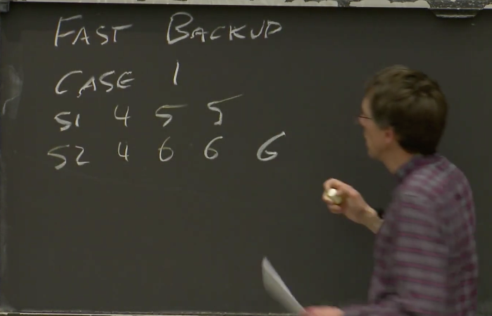

场景2：S1收到了任期4的旧Leader的多条Log，但是作为新Leader，S2只收到了一条任期4的Log。所以这里，我们需要覆盖S1中有关旧Leader的一些Log。

场景3：S1与S2的Log不冲突，但是S1缺失了部分S2中的Log。

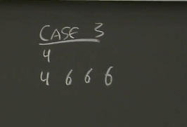

可以让Follower在回复Leader的AppendEntries消息中，携带3个额外的信息，来加速日志的恢复。这里的回复是指，Follower因为Log信息不匹配，拒绝了Leader的AppendEntries之后的回复。这里的三个信息是指：

1. XTerm：这个是Follower中与Leader冲突的Log对应的任期号。在之前（7.1）有介绍Leader会在prevLogTerm中带上本地Log记录中，前一条Log的任期号。如果Follower在对应位置的任期号不匹配，它会拒绝Leader的AppendEntries消息，并将自己的任期号放在XTerm中。如果Follower在对应位置没有Log，那么这里会返回 -1。
2. XIndex：这个是Follower中，对应任期号为XTerm的第一条Log条目的槽位号。
3. XLen：如果Follower在对应位置没有Log，那么XTerm会返回-1，XLen表示空白的Log槽位数。

我们再来看这些信息是如何在上面3个场景中，帮助Leader快速回退到适当的Log条目位置。

场景1。Follower（S1）会返回XTerm=5，XIndex=2。如果Leader完全没有XTerm的任何Log，那么它应该回退到XIndex对应的位置（这样，Leader发出的下一条AppendEntries就可以一次覆盖S1中所有XTerm对应的Log）。

场景2。Follower（S1）会返回XTerm=4，XIndex=1。Leader（S2）发现自己其实有任期4的日志，它会将自己本地记录的S1的nextIndex设置到本地在XTerm位置的Log条目后面，也就是槽位2。下一次Leader发出下一条AppendEntries时，就可以一次覆盖S1中槽位2和槽位3对应的Log。

场景3。Follower（S1）会返回XTerm=-1，XLen=2。这表示S1中日志太短了，以至于在冲突的位置没有Log条目，Leader应该回退到Follower最后一条Log条目的下一条，也就是槽位2，并从这开始发送AppendEntries消息。槽位2可以从XLen中的数值计算得到。

## 7.4 持久化

持久化和非持久化的区别只在服务器重启时重要。

如果一个服务器故障了，那简单直接的方法就是将它从集群中摘除。我们需要具备从集群中摘除服务器，替换一个全新的空的服务器，并让该新服务器在集群内工作的能力。如果服务器是磁盘故障了，你也不能指望能从该服务器的磁盘中获得任何有用的信息。

在Raft论文中，有且仅有三个数据是需要持久化存储的。它们分别是**Log、currentTerm、votedFor**。

**Log（所有的Log条目）需要被持久化存储的原因是，这是唯一记录了应用程序状态的地方**。

**currentTerm和votedFor都是用来确保每个任期只有最多一个Leader**。VotedFor防止一台服务器故障之后给两个服务器投票。

**这些数据需要在每次你修改它们的时候存储起来。安全的做法是每次你添加一个Log条目，更新currentTerm或者更新votedFor**。然而直到服务器与外界通信时，才有可能持久化存储数据，那么你可以通过一些批量操作来提升性能。例如，只在服务器回复一个RPC或者发送一个RPC时，服务器才进行持久化存储。

对于批量执行操作，如果有大量的客户端请求，或许你应该同时接收它们，但是先不返回。等大量的请求累积之后，一次性持久化存储（比如)100个Log，之后再发送AppendEntries。如果Leader收到了一个客户端请求，在发送AppendEntries RPC给Followers之前，必须要先持久化存储在本地。因为Leader必须要commit那个请求，并且不能忘记这个请求（Follwos同理）。

所以，重启之后，应用程序可以通过重复执行每一条Log来完全从头构建自己的状态。这是一种简单且优雅的方法，但是很明显会很慢。这将会引出我们的下一个话题：Log compaction和Snapshot。

## 7.5 日志快照

Log压缩和快照（Log compaction and snapshots）在Lab3b中出现的较多。在Raft中，Log压缩和快照解决的问题是：对于一个长期运行的系统，Log会持续增长。最后可能会有数百万条Log，从而需要大量的内存来存储。如果持久化存储在磁盘上，最终会消耗磁盘的大量空间。如果一个服务器重启了，它需要通过重新从头开始执行这数百万条Log来重建自己的状态。当故障重启之后，遍历并执行整个Log的内容可能要花费几个小时来完成。

**快照背后的思想是，要求应用程序将其状态的拷贝作为一种特殊的Log条目存储下来**。对于大多数的应用程序来说，应用程序的状态远小于Log的大小。如果存储Log，可能尺寸会非常大，相应的，如果存储key-value表单，这可能比Log尺寸小得多。这就是快照的背后原理。

所以，**当Raft认为它的Log将会过于庞大，例如大于1MB，10MB或者任意的限制，Raft会要求应用程序在Log的特定位置，对其状态做一个快照**。Raft会从Log中选取一个与快照对应的**点**，然后要求应用程序在那个点的位置做一个快照。如果我们有一个点的快照，那么我们可以安全的将那个点之前的Log丢弃。

**我们还需要为快照标注Log的槽位号**。这样，Log槽位号之后的所有Log，那么快照对应槽位号之前的这部分Log可以被丢弃，我们将不再需要这部分Log。

**当Follower刚刚恢复，如果它的Log短于Leader通过 AppendEntries RPC发给它的内容，那么它首先会强制Leader回退自己的Log。在某个点，Leader将不能再回退，因为它已经到了自己Log的起点。这时，Leader会将自己的快照发给Follower，之后立即通过AppendEntries将后面的Log发给Follower。**

## 7.6 线性一致

通常来说，线性一致等价于强一致。一个服务是线性一致的，那么它表现的就像只有一个服务器，并且服务器没有故障，这个服务器每次执行一个客户端请求，并且没什么奇怪的是事情发生。

**如果执行历史整体可以按照一个顺序排列，且排列顺序与客户端请求的实际时间相符合，那么它是线性一致的。当一个客户端发出一个请求，得到一个响应，之后另一个客户端发出了一个请求，也得到了响应，那么这两个请求之间是有顺序的，因为一个在另一个完成之后才开始。一个线性一致的执行历史中的操作是非并发的，也就是时间上不重合的客户端请求与实际执行时间匹配。并且，每一个读操作都看到的是最近一次写入的值。**

线性一致这个概念里面的操作，是从一个点开始，到另一个点结束。所以，这里前一个点对应了客户端发送请求，后一个点对应了收到回复的时间。

这样的执行历史是线性一致的吗？

**要达到线性一致，我们需要为这里的4个操作生成一个线性一致的顺序**。所以我们现在要确定顺序，对于这个顺序，有两个限制条件：

1. 如果一个操作在另一个操作开始前就结束了，那么这个操作必须在执行历史中出现在另一个操作前面。
2. 执行历史中，读操作，必须在相应的key的写操作之后。

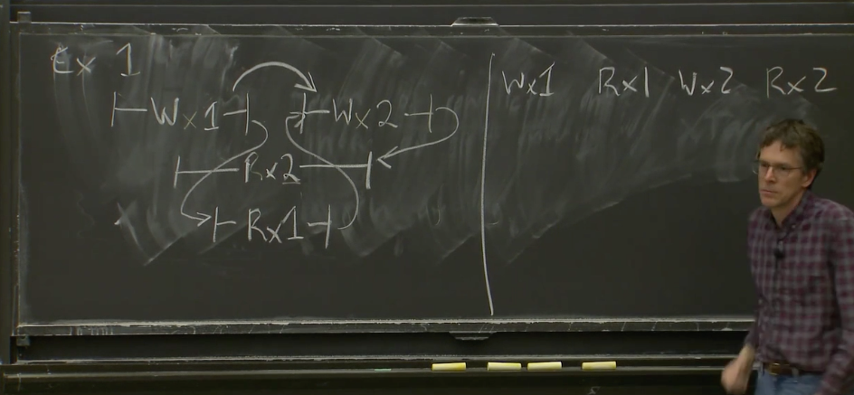

所以这里有个顺序且符合前面两个限制条件，所以执行历史是线性一致的。

这里的执行历史不是线性一致的。

所以，这里的问题是，这个请求历史记录是线性一致的吗？我们要么需要构造一个序列（证明线性一致），要么需要构造一个带环的图（证明非线性一致）。

线性一致的一个条件是，**对于整个请求历史记录，只存在一个序列，不允许不同的客户端看见不同的序列，或者说不允许一个存储在系统中的数据有不同的演进过程。**所以这里不应该有的证据就是C2现在观察到的读请求。

这里的请求历史记录可能出现的原因是，我们正在构建多副本的系统，所以或许有多个服务器都有X的拷贝，如果它们还没有获取到commit消息，多个服务器在不同的时间会有X的不同的值。

所以这个例子的教训是，对于系统执行写请求，只能有一个顺序，所有客户端读到的数据的顺序，必须与系统执行写请求的顺序一致。

还有一个小的例子。现在我们有两个客户端，其中一个提交了一个写X为3的请求，之后是一个写X为4的请求。同时，我们还有另一个客户端，在这个时间点，客户端发出了一个读X的请求，但是客户端没有收到回复。

在大多数系统的客户端内部实现机制中，客户端将会重发请求，或许发给一个不同的Leader，或许发送给同一个Leader。之后，终于收到了一个回复。这将是Lab3的一个场景。

服务器处理重复请求的合理方式是，**服务器会根据请求的唯一号或者其他的客户端信息来保存一个表**。服务器不想用执行相同的请求两次，所以，服务器记住了最初的回复，并且在客户端重发请求的时候将这个回复返回给客户端。

你可能会说，客户端在这里发送的（重传）请求，这在写X为4的请求之后，所以你这里应该返回4，而不是3。

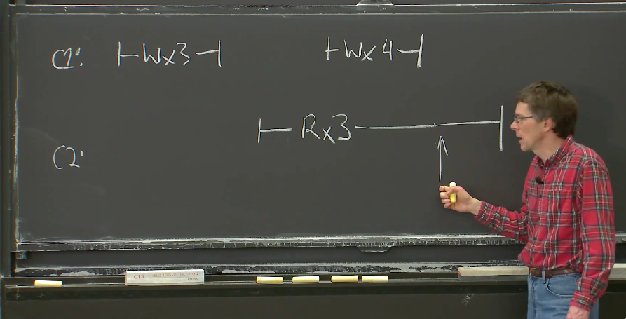

对于这个读请求，返回3或者4都是合法的。

# Lecture 08 - Zookeeper

## 8.1 Zookeeper

我们选择Zookeeper这篇论文的部分原因是，Zookeeper是一个现实世界成功的系统，是一个很多人使用的开源服务，并且集成到了很多现实世界的软件中，所以它肯定有一些现实意义和成功。自然而然，Zookeeper的设计应该是一个合理的设计。

相比Raft来说，Raft实际上就是一个库。你可以在一些更大的多副本系统中使用Raft库。但是Raft不是一个你可以直接交互的独立的服务，**你必须要设计你自己的应用程序来与Raft库交互**。所以这里有一个有趣的问题：是否有一些有用的，独立的，通用的系统可以帮助人们构建分布式系统？（类似于Zookeeper这类软件可以被认为是一个通用的协调服务（General-Purpose Coordination Service））

下面有个两个问题：

1. 对于一个通用的服务，API应该是怎样？
2. 如果我们有了n倍数量的服务器，是否可以为我们带来n倍的性能？

第二个问题是关于性能的问题，接下来把Zookeeper看成一个类似于Raft的多副本系统。Zookeeper实际上运行在Zab之上，从我们的角度来看，Zab几乎与Raft是一样的。

并不是当你加入更多的服务器时，服务就会变得更快。这绝对是正确的，当我们加入更多的服务器时，Leader几乎可以确定是一个瓶颈，因为Leader需要处理每一个请求，它需要将每个请求的拷贝发送给每一个其他服务器。**当你添加更多的服务器时，你只是为现在的瓶颈（Leader节点）添加了更多的工作负载**。所以，在这里，随着服务器数量的增加，性能反而会降低。

所以这里有点让人失望，服务器的硬件并不能帮助提升性能。

或许最简单的可以用来利用这些服务器的方法，就是构建一个系统，让所有的写请求通过Leader下发。在现实世界中，大量的负载是读请求，也就是说，读请求（比写请求）多得多。所以，或许我们可以将写请求发给Leader，但是将读请求发给某一个副本，随便任意一个副本。

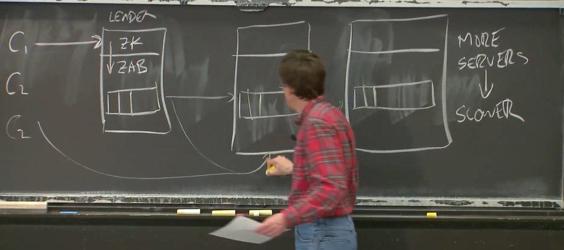

所以，现在的问题是，如果我们直接将客户端的请求发送给副本，我们能得到预期的结果吗？

功能上来说，副本拥有可以响应来自客户端读请求的所有数据。这里的问题是，**没有理由可以相信，除了Leader以外的任何一个副本的数据是最新**（up to date）的。尽管在性能上很有吸引力，我们不能将读请求发送给副本，并且你也不应该在Lab3这么做，线性一致阻止了我们使用副本来服务客户端。

实际上，Zookeeper并不要求返回最新的写入数据。Zookeeper的方式是，放弃线性一致性。它对于这里问题的解决方法是，不提供线性一致的读。所以，因此，Zookeeper也不用为读请求提供最新的数据。它有自己有关一致性的定义，而这个定义不是线性一致的，因此允许为读请求返回旧的数据。

## 8.2 一致保证

Zookeeper的确有一些一致性的保证， 首先，**写请求是线性一致的**。

Zookeeper只考虑写，不考虑读。这里的意思是，**尽管客户端可以并发的发送写请求，然后Zookeeper表现的就像以某种顺序，一次只执行一个写请求，并且也符合写请求的实际时间**。所以，这里不包括读请求，单独看写请求是线性一致的。

Zookeeper的另一个保证是，**任何一个客户端的请求，都会按照客户端指定的顺序来执行，论文里称之为FIFO（First In First Out）客户端序列**。

为了让Leader可以实际的按照客户端确定的顺序执行写请求，客户端实际上会对它的写请求打上序号，而Zookeeper Leader节点会遵从这个顺序。

对于读请求，我们应该这么考虑FIFO客户端序列，客户端会以某种顺序读某个数据，每个读请求都可以在Log一个特定的点观察到对应的状态。第二个读请求不允许看到之前的状态，第二个读请求至少要看到第一个读请求的状态。这是一个极其重要的事实，我们会用它来实现正确的Zookeeper应用程序。

这里特别有意思的是，如果一个客户端正在与一个副本交互，客户端发送了一些读请求给这个副本，之后这个副本故障了，客户端需要将读请求发送给另一个副本。这时，尽管客户端切换到了一个新的副本，FIFO客户端序列仍然有效。所以这意味着，如果你知道在故障前，客户端在一个副本执行了一个读请求并看到了对应于Log中这个点的状态，

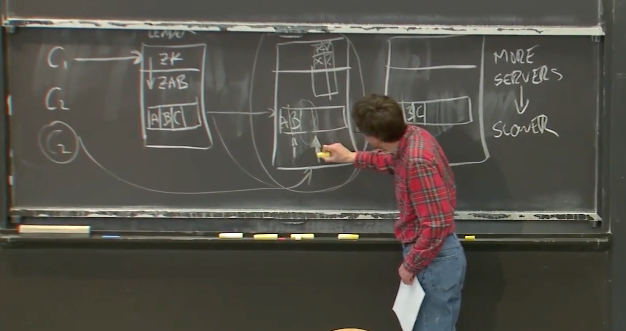

当客户端切换到了一个新的副本并且发起了另一个读请求，假设之前的读请求在这里执行，

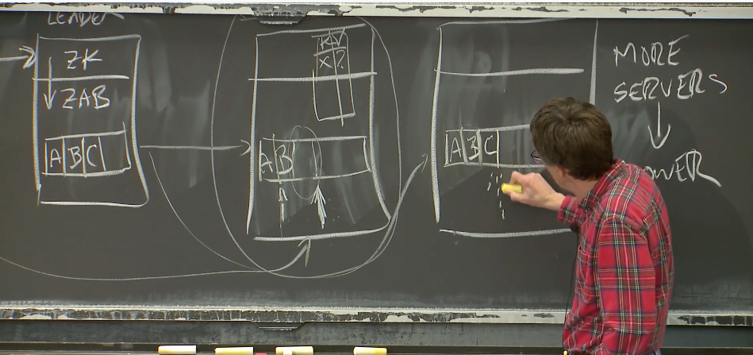

那么尽管客户端切换到了一个新的副本，**客户端的在新的副本的读请求，必须在Log这个点或者之后的点执行**。

这里工作的原理是，每个Log条目都会被Leader打上zxid的标签，这些标签就是Log对应的条目号。任何时候一个副本回复一个客户端的读请求，首先这个读请求是在Log的某个特定点执行的，其次回复里面会带上zxid，对应的就是Log中执行点的前一条Log条目号。客户端会记住最高的zxid，当客户端发出一个请求到一个相同或者不同的副本时，它会在它的请求中带上这个最高的zxid。这样，其他的副本就知道，应该至少在Log中这个点或者之后执行这个读请求。这里有个有趣的场景，如果第二个副本并没有最新的Log，当它从客户端收到一个请求，客户端说，上一次我的读请求在其他副本Log的这个位置执行，那么在获取到对应这个位置的Log之前，这个副本不能响应客户端请求。

## 8.3 同步操作

总的来说，Zookeeper的一致性保证没有线性一致那么好，但是为什么Zookeeper不是一个坏的编程模型？

其中一个原因是，有一个弥补（非严格线性一致）的方法。

Zookeeper有一个操作类型是sync，它本质上就是一个写请求。假设我知道你最近写了一些数据，并且我想读出你写入的数据，所以现在的场景是，我想读出Zookeeper中最新的数据。这个时候，我可以发送一个sync请求，它的效果相当于一个写请求，

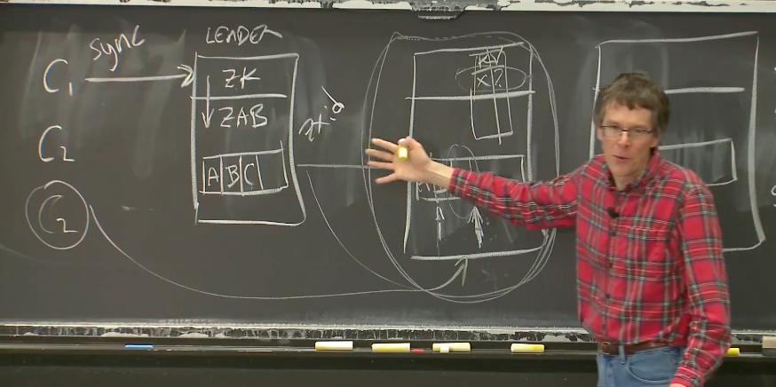

所以它最终会出现在所有副本的Log中，尽管我只关心与我交互的副本，因为我需要从那个副本读出数据。接下来，在发送读请求时，客户端告诉副本，在看到我上一次sync请求之前，不要返回我的读请求。

如果这里把sync看成是一个写请求，这里实际上符合了FIFO客户端请求序列，因为读请求必须至少要看到同一个客户端前一个写请求对应的状态。所以，如果我发送了一个sync请求之后，又发送了一个读请求。Zookeeper必须要向我返回至少是我发送的sync请求对应的状态。

不管怎么样，如果我需要读最新的数据，我需要发送一个sync请求，之后再发送读请求。这个读请求可以保证看到sync对应的状态，所以可以合理的认为是最新的。**但是同时也要认识到，这是一个代价很高的操作，因为我们现在将一个廉价的读操作转换成了一个耗费Leader时间的sync操作。所以，如果不是必须的，那还是不要这么做**。

## 8.4 就绪文件

关于论文中有关Ready file的一些设计（*这里的file对应的就是论文里的znode，Zookeeper以文件目录的形式管理数据，所以每一个数据点也可以认为是一个file*）。

我们假设有另外一个分布式系统，这个分布式有一个Master节点，而Master节点在Zookeeper中维护了一个配置，这个配置对应了一些file（也就是znode）。通过这个配置，描述了有关分布式系统的一些信息，例如所有worker的IP地址，或者当前谁是Master。所以，现在Master在更新这个配置，同时，或许有大量的客户端需要读取相应的配置，并且需要发现配置的每一次变化。所以，现在的问题是，尽管配置被分割成了多个file，我们还能有原子效果的更新吗？

为什么要有原子效果的更新呢？因为只有这样，其他的客户端才能读出完整更新的配置，而不是读出更新了一半的配置。这是人们使用Zookeeper管理配置文件时的一个经典场景。

假设Master做了一系列写请求来更新配置，那么我们的分布式系统中的Master会以这种顺序执行写请求。首先我们假设有一些Ready file，就是以Ready为名字的file。**如果Ready file存在，那么允许读这个配置。如果Ready file不存在，那么说明配置正在更新过程中，我们不应该读取配置**。所以，如果Master要更新配置，那么第一件事情是删除Ready file。之后它会更新各个保存了配置的Zookeeper file（也就是znode），这里或许有很多的file。当所有组成配置的file都更新完成之后，Master会再次创建Ready file。目前为止，这里的语句都很直观，这里只有写请求，没有读请求，而Zookeeper中写请求可以确保以线性顺序执行。

为了确保这里的执行顺序，Master以某种方式为这些请求打上了tag，表明了对于这些写请求期望的执行顺序。之后Zookeeper Leader需要按照这个顺序将这些写请求加到多副本的Log中。

接下来，所有的副本会履行自己的职责，按照这里的顺序一条条执行请求。它们也会删除（自己的）Ready file，之后执行这两个写请求，最后再次创建（自己的）Ready file。

对于读请求，需要更多的思考。假设我们有一些worker节点需要读取当前的配置。我们可以假设Worker节点首先会检查Ready file是否存在。如果不存在，那么Worker节点会过一会再重试。所以，我们假设Ready file存在，并且是经历过一次重新创建。

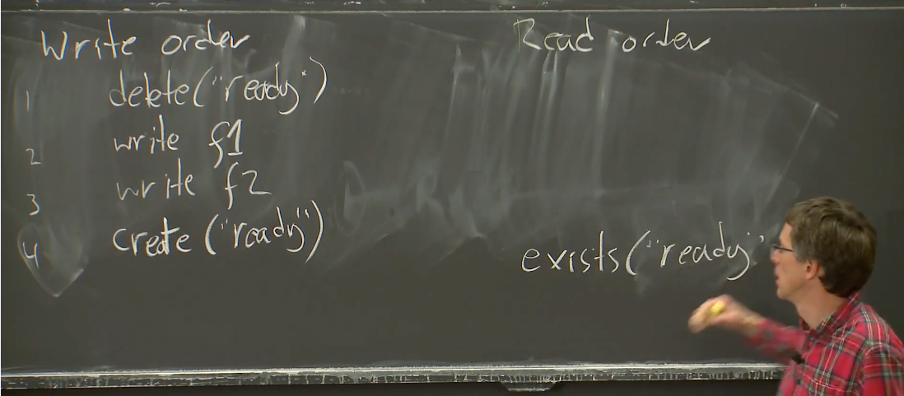

这里的意思是，左边的都是发送给Leader的写请求，右边是一个发送给某一个与客户端交互的副本的读请求。之后，如果文件存在，那么客户端会接下来读f1和f2。

这里，有关FIFO客户端序列中有意思的地方是，如果判断Ready file的确存在，那么也是从与客户端交互的那个副本得出的判断。所以，这里通过读请求发现Ready file存在，可以**说明那个副本看到了Ready file的重新创建这个请求**（由Leader同步过来的）。

同时，因为后续的读请求永远不会在更早的log条目号执行，必须在更晚的Log条目号执行，所以，**对于与客户端交互的副本来说，如果它的log中包含了这条创建Ready file的log，那么意味着接下来客户端的读请求只会在log中更后面的位置执行**（下图中横线位置）。

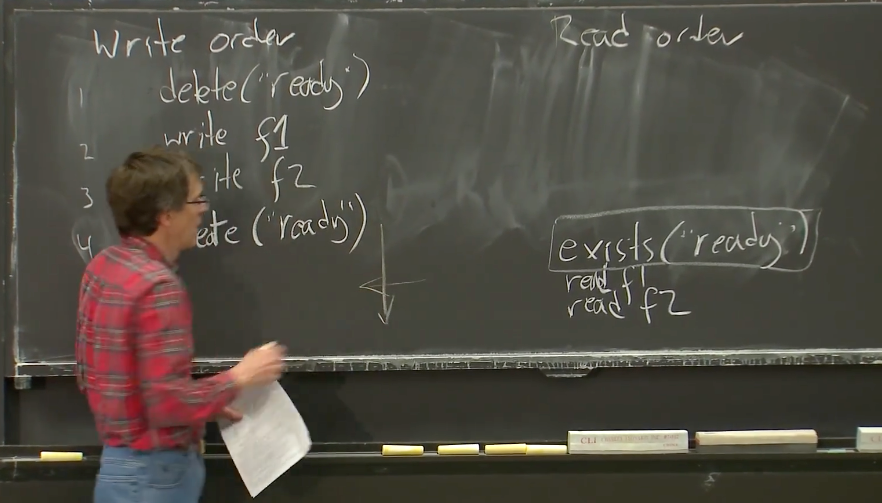

所以，**如果客户端看见了Ready file，那么副本接下来执行的读请求，会在Ready file重新创建的位置之后执行。这意味着，Zookeeper可以保证这些读请求看到之前对于配置的全部更新**。所以，**尽管Zookeeper不是完全的线性一致，但是由于写请求是线性一致的，并且读请求是随着时间在Log中单调向前的，我们还是可以得到合理的结果**。

我们假设Master在完成配置更新之后创建了Ready file。之后Master又要更新配置，那么最开始，它要删除Ready file，之后再执行一些写请求。

这里可能有的问题是，需要读取配置的客户端，首先会在这个点，通过调用exist来判断Ready file是否存在。

在这个时间点，Ready file肯定是存在的。之后，随着时间的推移，客户端读取了组成配置的第一个file，但是，之后在读取第二个file时，Master可能正在更新配置。

所以，我们现在开始面对一个严重的挑战，而一个仔细设计的针对分布式系统中机器间的协调服务的API（就是说Zookeeper），或许可以帮助我们解决这个挑战。对于Lab3来说，你将会构建一个put/get系统，那样一个系统，也会遇到同样的问题，没有任何现有的工具可以解决这个问题。

Zookeeper的API实际上设计的非常巧妙，它可以处理这里的问题。之前说过，客户端会发送exists请求来查询，Ready file是否存在。**但是实际上，客户端不仅会查询Ready file是否存在，还会建立一个针对这个Ready file的watch。**

这意味着如果Ready file有任何变更，**例如，被删除了，或者它之前不存在然后被创建了，副本会给客户端发送一个通知**。

**客户端在这里只与某个副本交互，所以这里的操作都是由副本完成。当Ready file有变化时，副本会确保，合适的时机返回对于Ready file变化的通知**。在这个场景中，这些写请求在实际时间中，出现在读f1和读f2之间。

而**Zookeeper可以保证，如果客户端向某个副本watch了某个Ready file，之后又发送了一些读请求，当这个副本执行了一些会触发watch通知的请求，那么Zookeeper可以确保副本将watch对应的通知，先发给客户端，再处理触发watch通知请求（也就是删除Ready file的请求）**，在Log中位置之后才执行的读请求

这里再来看看Log。FIFO客户端序列要求，每个客户端请求都存在于Log中的某个位置，所以，最后log的相对位置如下图所示：

我们之前已经设置好了watch，Zookeeper可以保证如果某个人删除了Ready file，相应的通知，会在任何后续的读请求之前，发送到客户端。客户端会先收到有关Ready file删除的通知，之后才收到其他在Log中位于删除Ready file之后的读请求的响应。这里意味着，**删除Ready file会产生一个通知，而这个通知可以确保在读f2的请求响应之前发送给客户端。**

这意味着，客户端在完成读所有的配置之前，如果对配置有了新的更改，Zookeeper可以保证客户端在收到删除Ready file的通知之前，看到的都是配置更新前的数据（也就是，**客户端读取配置读了一半，如果收到了Ready file删除的通知，就可以放弃这次读，再重试读了**）。

> 学生提问：谁出发了这里的watch？
>
> Robert教授：假设这个客户端与这个副本在交互，它发送了一个exist请求，exist请求是个只读请求。相应的副本在一个table上生成一个watch的表单，表明哪些客户端watch了哪些file。

> 并且，watch是基于一个特定的zxid建立的，如果客户端在一个副本log的某个位置执行了读请求，并且返回了相对于这个位置的状态，那么watch也是相对于这个位置来进行。如果收到了一个删除Ready file的请求，副本会查看watch表单，并且发现针对这个Ready file有一个watch。watch表单或许是以file名的hash作为key，这样方便查找。
>
> 学生提问：这个副本必须要有一个watch表单，如果副本故障了，客户端需要连接到另外一个副本，那新连接的副本中的watch表单如何生成呢？
>
> Robert教授：答案是，如果你的副本故障了，那么切换到的新的副本不会有watch表单。但是客户端在相应的位置会收到通知说，你正在交互的副本故障了，之后客户端就知道，应该重置所有数据，并与新的副本建立连接（包括watch）。

## 8.5 Zookeeper API

Zookeeper的API设计使得它可以成为一个通用的服务，从而分担一个分布式系统所需要的大量工作。那么为什么Zookeeper的API是一个好的设计？具体来看，因为它实现了一个值得去了解的概念：mini-transaction。

我们回忆一下Zookeeper的特点：

1. Zookeeper基于（类似于）Raft框架，所以我们可以认为它是容错的，它在发生网络分区的时候，也能有正确的行为。
2. 当我们在分析各种Zookeeper的应用时，我们也需要记住Zookeeper有一些性能增强，使得读请求可以在任何副本被处理，因此，可能会返回旧数据。
3. 另一方面，Zookeeper可以确保一次只处理一个写请求，并且所有的副本都能看到一致的写请求顺序。这样，所有副本的状态才能保证是一致的（写请求会改变状态，一致的写请求顺序可以保证状态一致）。
4. 由一个客户端发出的所有读写请求会按照客户端发出的顺序执行。
5. 一个特定客户端的连续请求，后来的请求总是能看到相比较于前一个请求相同或者更晚的状态。

在深入探讨Zookeeper的API长什么样和为什么它是有用的之前，我们可以考虑一下，Zookeeper的目标是解决什么问题，或者期望用来解决什么问题？

对于我来说，使用Zookeeper的一个主要原因是，它可以是一个VMware FT所需要的Test-and-Set服务的实现。Test-and-Set服务在发生主备切换时是必须存在的，但是在VMware FT论文中对它的描述却又像个谜一样，论文里没有介绍：这个服务究竟是什么，它是容错的吗，它能容忍网络分区吗？**Zookeeper实际的为我们提供工具来写一个容错的，完全满足VMware FT要求的Test-and-Set服务，并且可以在网络分区时，仍然有正确的行为**。这是Zookeeper的核心功能之一。

1. 使用Zookeeper还可以做很多其他有用的事情。
2. 人们可以用它来发布其他服务器使用的配置信息。例如，向某些Worker节点发布当前Master的IP地址。
3. 选举Master。当一个旧的Master节点故障时，哪怕说出现了网络分区，我们需要让所有的节点都认可同一个新的Master节点。
4. 如果新选举的Master需要将其状态保持到最新，比如说GFS的Master需要存储对于一个特定的Chunk的Primary节点在哪，现在GFS的Master节点可以将其存储在Zookeeper中，并且知道Zookeeper不会丢失这个信息。当旧的Master崩溃了，一个新的Master被选出来替代旧的Master，这个新的Master可以直接从Zookeeper中读出旧Master的状态。
5. 其他还有，对于一个类似于MapReduce的系统，Worker节点可以通过在Zookeeper中创建小文件来注册自己。
6. 同样还是类似于MapReduce这样的系统，你可以设想Master节点通过向Zookeeper写入具体的工作，之后Worker节点从Zookeeper中一个一个的取出工作，执行，完成之后再删除工作。

以上就是Zookeeper可以用来完成的工作。

> 学生提问：Zookeeper应该如何应用在这些场景中？
>
> Robert教授：通常来说，如果你有一个大的数据中心，并且在数据中心内运行各种东西，比如说Web服务器，存储系统，MapReduce等等。你或许会想要再运行一个包含了5个或者7个副本的Zookeeper集群，因为它可以用在很多场景下。之后，你可以部署各种各样的服务，并且在设计中，让这些服务存储一些关键的状态到你的全局的Zookeeper集群中。

Zookeeper的API某种程度上来说像是一个文件系统。它有一个层级化的目录结构，有一个根目录（root），之后每个应用程序有自己的子目录。比如说应用程序1将自己的文件保存在APP1目录下，应用程序2将自己的文件保存在APP2目录下，这些目录又可以包含文件和其他的目录。

这么设计的一个原因刚刚也说过，Zookeeper被设计成要被许多可能完全不相关的服务共享使用。所以我们需要一个命名系统来区分不同服务的信息，这样这些信息才不会弄混。对于每个使用Zookeeper的服务，围绕着文件，有很多很方便的方法来使用Zookeeper。

所以，Zookeeper的API看起来像是一个文件系统，但是又不是一个实际的文件系统。这里只是在内部，以这种路径名的形式命名各种对象。假设应用程序2下面有X，Y，Z这些文件。当你通过RPC向Zookeeper请求数据时，你可以直接指定/APP2/X。这就是一种层级化的命名方式。

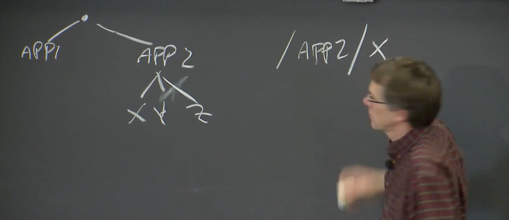

这里的文件和目录都被称为znodes。Zookeeper中包含了3种类型的znode，了解他们对于解决问题会有帮助。1.

1. Regular znodes。这种znode一旦创建，就永久存在，除非你删除了它。
2. Ephemeral znodes。如果Zookeeper认为创建它的客户端挂了，它会删除这种类型的znodes。这种类型的znodes与客户端会话绑定在一起，所以客户端需要时不时的发送心跳给Zookeeper，告诉Zookeeper自己还活着，这样Zookeeper才不会删除客户端对应的ephemeral znodes。
3. Sequential znodes。它的意思是，当你想要以特定的名字创建一个文件，Zookeeper实际上创建的文件名是你指定的文件名再加上一个数字。当有多个客户端同时创建Sequential文件时，Zookeeper会确保这里的数字不重合，同时也会确保这里的数字总是递增的。

Zookeeper以RPC的方式暴露以下API。

1. `CREATE(PATH，DATA，FLAG)`。入参分别是文件的全路径名PATH，数据DATA，和表明znode类型的FLAG。这里有意思的是，CREATE的语义是排他的。也就是说，如果我向Zookeeper请求创建一个文件，如果我得到了yes的返回，那么说明这个文件之前不存在，我是第一个创建这个文件的客户端；如果我得到了no或者一个错误的返回，那么说明这个文件之前已经存在了。所以，客户端知道文件的创建是排他的。在后面有关锁的例子中，我们会看到，如果有多个客户端同时创建同一个文件，实际成功创建文件（获得了锁）的那个客户端是可以通过CREATE的返回知道的。
2. `DELETE(PATH，VERSION)`。入参分别是文件的全路径名PATH，和版本号VERSION。有一件事情我之前没有提到，每一个znode都有一个表示当前版本号的version，当znode有更新时，version也会随之增加。对于delete和一些其他的update操作，你可以增加一个version参数，表明当且仅当znode的当前版本号与传入的version相同，才执行操作。当存在多个客户端同时要做相同的操作时，这里的参数version会非常有帮助（并发操作不会被覆盖）。所以，对于delete，你可以传入一个version表明，只有当znode版本匹配时才删除。
3. `EXIST(PATH，WATCH)`。入参分别是文件的全路径名PATH，和一个有趣的额外参数WATCH。通过指定watch，你可以监听对应文件的变化。不论文件是否存在，你都可以设置watch为true，这样Zookeeper可以确保如果文件有任何变更，例如创建，删除，修改，都会通知到客户端。此外，判断文件是否存在和watch文件的变化，在Zookeeper内是原子操作。所以，当调用exist并传入watch为true时，不可能在Zookeeper实际判断文件是否存在，和建立watch通道之间，插入任何的创建文件的操作，这对于正确性来说非常重要。
4. `GETDATA(PATH，WATCH)`。入参分别是文件的全路径名PATH，和WATCH标志位。这里的watch监听的是文件的内容的变化。
5. `SETDATA(PATH，DATA，VERSION)`。入参分别是文件的全路径名PATH，数据DATA，和版本号VERSION。如果你传入了version，那么Zookeeper当且仅当文件的版本号与传入的version一致时，才会更新文件。
6. `LIST(PATH)`。入参是目录的路径名，返回的是路径下的所有文件。

## 8.6 使用Zookeeper实现计数器

第一个很简单的例子是计数器，假设我们在Zookeeper中有一个文件，我们想要在那个文件存储一个统计数字，例如，统计客户端的请求次数，当收到了一个来自客户端的请求时，我们需要增加存储的数字。

现在关键问题是，多个客户端会同时并发发送请求导致存储的数字增加。所以，第一个要解决的问题是，除了管理数据以外（类似于简单的SET和GET），我们是不是真的需要一个特殊的接口来支持多个客户端的并发。

比如说，在Lab3中，你们会构建一个key-value数据库，它只支持两个操作，一个是PUT(K，V)，另一个是GET(K)。对于所有我们想要通过Zookeeper来实现的操作，我们可以使用Lab3中的key-value数据库来完成吗？或许我们真的可以使用只有两个操作接口的Lab3来完成这里的计数器功能。你可以这样实现，首先通过GET读出当前的计数值，之后通过PUT写入X + 1。

为什么这是一个错误的答案？是的，这里不是原子操作，这是问题的根源。

如果有两个客户端想要同时增加计数器的值，它们首先都会先通过GET读出旧的计数器值，比如说10。之后，它们都会对10加1得到11，并调用PUT将11写入。但是，Zookeeper自身也有问题，在Zookeeper的世界中，GET可能得到的是旧数据。

所以，如何通过Zookeeper实现一个计数器呢？首先需要将这里的代码放在一个循环里面，因为代码不一定能在第一次执行的时候成功。我们对于循环加上`while true`，之后我们调用GETDATA来获取当前计数器的值，代码是`X，V = GETDATA(“f”)`，我们并不关心文件名是什么，所以这里直接传入一个“f”。

现在，我们获得了一个数值X，和一个版本号V，可能不是最新的，也可能是新的。之后，我们对于`SETDATA("f", X + 1, V)`加一个IF判断。如果返回true，表明它的确写入了数据，那么我们会从循环中跳出 `break`，如果返回false，那我们会回到循环的最开始，重新执行。

~~~
WHILE TRUE:
    X, V = GETDATA("F")
    IF SETDATA("f", X + 1, V):
        BREAK
~~~

在代码的第2行，我们从某个副本读到了一个数据X和一个版本号V，或许是旧的或许是最新的。而第3行的SETDATA会在Zookeeper Leader节点执行，因为所有的写操作都要在Leader执行。**第3行的意思是，只有当实际真实的版本号等于V的时候，才更新数据**。

> 学生提问：Zookeeper的数据都存在内存吗？
>
> Robert教授：是的。如果数据小于内存容量那就没问题，如果数据大于内存容量，那就是个灾难。所以当你在使用Zookeeper时，你必须时刻记住Zookeeper对于100MB的数据很友好，但是对于100GB的数据或许就很糟糕了。这就是为什么人们用Zookeeper来存储配置，而不是大型网站的真实数据。
>
> 学生提问：对于高负载的场景该如何处理呢？
>
> Robert教授：我们可以在SETDATA失败之后等待一会。我会这么做，首先，等待（sleep）是必须的，其次，等待的时间每次需要加倍再加上一些随机。这里实际上跟Raft的Leader Election里的Exceptional back-off是类似的。这是一种适应未知数量并发客户端请求的合理策略。
>

这个例子，其实就是大家常说的mini-transaction。这里之所以是事务的，是因为一旦我们操作成功了，我们对计数器达成了***读-更改-写\***的原子操作。对于我们在Lab3中实现的数据库来说，它的读写操作不是原子的。而我们上面那段代码，一旦完成了，就是原子的。因为一旦完成了，我们的读，更改，写操作就不受其他任何客户端的干扰。

之所以称之为mini-transaction，是因为这里并不是一个完整的数据库事务（transaction）。一个真正的数据库可以使用完整的通用的事务，你可以指定事务的开始，然后执行任意的数据读写，之后结束事务。数据库可以聪明的将所有的操作作为一个原子事务提交。一个真实的事务可能会非常复杂，而Zookeeper支持这种非常简单的事务，使得我们可以对于一份数据实现原子操作。这对于计数器或者其他的一些简单功能足够了。所以，这里的事务并不通用，但是的确也提供了原子性，所以它被称为mini-transaction。

通过计数器这个例子里的策略可以实现很多功能，比如VMware FT所需要的Test-and-Set服务就可以以非常相似的方式来实现。如果旧的数据是0，一个虚机尝试将其设置成1，设置的时候会带上旧数据的版本号，如果没有其他的虚机介入也想写这个数据，我们就可以成功的将数据设置成1，因为Zookeeper里数据的版本号没有改变。如果某个客户端在我们读取数据之后更改了数据，那么Leader会通知我们说数据写入失败了，所以我们可以用这种方式来实现Test-and-Set服务。

## 8.7 使用Zookeeper实现非扩展锁

这一部分我想讨论的例子是非扩展锁。我讨论它的原因并不是因为我强烈的认为这种锁是有用的，而是因为它在Zookeeper论文中出现了。

对于锁来说，常见的操作是Aquire Lock，获得锁。获得锁可以用下面的伪代码实现：

~~~
WHILE TRUE:
    IF CREATE("f", data, ephemeral=TRUE): RETURN
    IF EXIST("f", watch=TRUE):
        WAIT
~~~

总的来说，先是通过CREATE创建锁文件，或许可以直接成功。如果失败了，我们需要等待持有锁的客户端释放锁。通过Zookeeper的watch机制，我们会在锁文件删除的时候得到一个watch通知。收到通知之后，我们回到最开始，尝试重新创建锁文件，如果运气足够好，那么这次是能创建成功的。

当有多个客户端同时请求锁时，Zookeeper一次只执行一个请求。

如果我的客户端调用CREATE返回了FALSE，那么我接下来需要调用EXIST，如果锁在代码的第2行和第3行之间释放了会怎样呢？这就是为什么在代码的第3行，EXIST前面要加一个IF，因为锁文件有可能在调用EXIST之前就释放了。如果在代码的第3行，锁文件不存在，那么EXIST返回FALSE，代码又回到循环的最开始，重新尝试获得锁。

这里的锁设计并不是一个好的设计，因为它和前一个计数器的例子都受羊群效应（Herd Effect）的影响。所谓的羊群效应，对于计数器的例子来说，就是当有1000个客户端同时需要增加计数器时，我们的复杂度是 O(n2) ，这是处理完1000个客户端的请求所需要的总时间。对于这一节的锁来说，也存在羊群效应，如果有1000个客户端同时要获得锁文件，为1000个客户端分发锁所需要的时间也是 O(n2) 。因为每一次锁文件的释放，所有剩下的客户端都会收到WATCH的通知，并且回到循环的开始，再次尝试创建锁文件。所以**CREATE对应的RPC总数与1000的平方成正比**。

## 8.8 使用Zookeeper实现可扩展锁

在Zookeeper论文的结尾，讨论了如何使用Zookeeper解决非扩展锁的问题。有意思的是，因为Zookeeper的API足够灵活，可以用来设计另一个更复杂的锁，从而避免羊群效应。从而使得，即使有1000个客户端在等待锁释放，当锁释放时，另一个客户端获得锁的复杂度是O(1)而不是O(n) 。在这个设计中，我们不再使用一个单独的锁文件，而是创建Sequential文件（详见9.1）。

~~~
CREATE("f", data, sequential=TRUE, ephemeral=TRUE)
WHILE TRUE:
    LIST("f*")
    IF NO LOWER #FILE: RETURN
    IF EXIST(NEXT LOWER #FILE, watch=TRUE):
        WAIT
~~~

在代码的第1行调用CREATE，并指定sequential=TRUE，我们创建了一个Sequential文件，如果这是以“f”开头的第27个Sequential文件，这里实际会创建类似以“f27”为名字的文件。这里有两点需要注意，第一是通过CREATE，我们获得了一个全局唯一序列号（比如27），第二Zookeeper生成的序号必然是递增的。

代码第3行，通过LIST列出了所有以“f”开头的文件，也就是所有的Sequential文件。

代码第4行，如果现存的Sequential文件的序列号都不小于我们在代码第1行得到的序列号，那么表明我们在并发竞争中赢了，我们获得了锁。所以当我们的Sequential文件对应的序列号在所有序列号中最小时，我们获得了锁，直接RETURN。序列号代表了不同客户端创建Sequential文件的顺序。在这种锁方案中，会使用这个顺序来向客户端分发锁。当存在更低序列号的Sequential文件时，我们要做的是等待拥有更低序列号的客户端释放锁。

所以，在代码的第5行，我们调用EXIST，并设置WATCH，等待比自己序列号更小的下一个锁文件删除。如果等到了，我们回到循环的最开始。但是这次，我们不会再创建锁文件，代码从LIST开始执行。这是获得锁的过程，释放就是删除创建的锁文件。

在一个分布式系统中，你可以这样使用Zookeeper实现的锁。每一个获得锁的客户端，需要做好准备清理之前锁持有者因为故障残留的数据。所以，当你获得锁时，你查看数据，你需要确认之前的客户端是否故障了，如果是的话，你该怎么修复数据。如果总是以确定的顺序来执行操作，**假设前一个客户端崩溃了，你或许可以探测出前一个客户端是在操作序列中哪一步崩溃的**。

另外一个对于这些锁的合理的场景是：Soft Lock。**Soft Lock用来保护一些不太重要的数据**。举个例子，当你在运行MapReduce Job时，你可以用这样的锁来确保一个Task同时只被一个Work节点执行。

另一个值得考虑的问题是，我们可以用这里的代码来实现选举Master。

# Lecture 09 - More Replication, CRAQ

## 9.1 链复制（Chain Replication）

这一部分来讨论另一个论文**CRAQ**（Chain Replication with Apportioned Queries）。我们选择CRAQ论文有两个原因：第一个是它通过复制实现了容错；第二是**它通过以链复制API请求这种有趣的方式，提供了与Raft相比不一样的属性**。

CRAQ是对于一个叫链式复制（Chain Replication）的旧方案的改进。CRAQ采用的方式与Zookeeper非常相似，它通过将读请求分发到任意副本去执行，来提升读请求的吞吐量，所以副本的数量与读请求性能成正比。CRAQ有意思的地方在于，与Zookeeper不一样，**它在任意副本上执行读请求的前提下，还可以保证线性一致性**（Linearizability）。

首先讨论旧的Chain Replication系统。Chain Replication有多个副本，你想确保它们都看到相同顺序的写请求（这样副本的状态才能保持一致），这与Raft的思想是一致的，但是它却采用了与Raft不同的拓扑结构。

在Chain Replication中，有一些服务器按照链排列。第一个服务器称为HEAD，最后一个被称为TAIL。

当客户端想要发送一个**写请求**，写请求总是发送给HEAD。

HEAD根据写请求更新本地数据，我们假设现在是一个支持PUT/GET的key-value数据库。所有的服务器本地数据都从A开始。

当HEAD收到了写请求，将本地数据更新成了B，之后会再将写请求通过链向下一个服务器传递。

下一个服务器执行完写请求之后，再将写请求向下一个服务器传递，以此类推，所有的服务器都可以看到写请求。

当写请求到达TAIL时，TAIL将回复发送给客户端，表明写请求已经完成了。这是处理写请求的过程。

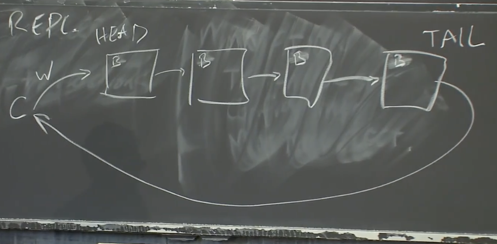

对于**读请求**，如果一个客户端想要读数据，它将读请求发往TAIL，

TAIL直接根据自己的当前状态来回复读请求。所以，如果当前状态是B，那么TAIL直接返回B。读请求处理的非常的简单。

这里只是Chain Replication，并不是CRAQ。**Chain Replication本身是线性一致的**，在没有故障时，从一致性的角度来说，整个系统就像只有TAIL一台服务器一样，TAIL可以看到所有的写请求，也可以看到所有的读请求，它一次只处理一个请求，读请求可以看到最新写入的数据。如果没有出现故障的话，一致性是这么得到保证的，非常的简单。

从一个全局角度来看，**除非写请求到达了TAIL，否则一个写请求是不会commit，也不会向客户端回复确认，也不能将数据通过读请求暴露出来**。

## 9.2 链复制的故障恢复（Fail Recover）

在Chain Replication中，出现故障后，你可以看到的状态是相对有限的。因为写请求的传播模式非常有规律，我们不会陷入到类似于Raft论文中描述的复杂场景。并且在出现故障之后，也不会出现不同的副本之间各种各样不同步的场景。

在Chain Replication中，因为写请求总是依次在链中处理，写请求要么可以达到TAIL并commit，要么只到达了链中的某一个服务器。

总的来看，Chain Replication的故障恢复也相对的更简单。

如果**HEAD出现故障**，作为最接近的服务器，下一个节点可以接手成为新的HEAD，并不需要做任何其他的操作。对于还在处理中的请求，可以分为两种情况：

1. 对于任何已经发送到了第二个节点的写请求，不会因为HEAD故障而停止转发，它会持续转发直到commit。
2. 对于只送到了HEAD，并且在HEAD将其转发前HEAD就故障了的写请求，我们不必做任何事情。或许客户端会重发这个写请求，但是这并不是我们需要担心的问题。

如果**TAIL出现故障**，处理流程也非常相似，**TAIL的前一个节点可以接手成为新的TAIL**。所有TAIL知道的信息，TAIL的前一个节点必然都知道，因为TAIL的所有信息都是其前一个节点告知的。

**中间节点出现故障**会稍微复杂一点，但是基本上来说，需要做的就是**将故障节点从链中移除**。或许有一些写请求被故障节点接收了，但是还没有被故障节点之后的节点接收，所以，**当我们将其从链中移除时，故障节点的前一个节点或许需要重发最近的一些写请求给它的新后继节点**。这是恢复中间节点流程的简单版本。

Chain Replication与Raft进行对比，有以下差别：

1. 从性能上看，对于Raft，如果我们有一个Leader和一些Follower。Leader需要直接将数据发送给所有的Follower。所以，当客户端发送了一个写请求给Leader，Leader需要自己将这个请求发送给所有的Follower。然而在Chain Replication中，HEAD只需要将写请求发送到一个其他节点。**数据在网络中发送的代价较高，所以Raft Leader的负担会比Chain Replication中HEAD的负担更高**。当客户端请求变多时，Raft Leader会到达一个瓶颈，而不能在单位时间内处理更多的请求。**而同等条件以下，Chain Replication的HEAD可以在单位时间处理更多的请求，瓶颈会来的更晚一些**。
2. Raft中读请求同样也需要在Raft Leader中处理，所以Raft Leader可以看到所有的请求。而在Chain Replication中，每一个节点都可以看到写请求，但是只有TAIL可以看到读请求。所以负载在一定程度上，在HEAD和TAIL之间分担了，而不是集中在单个Leader节点。
3. 前面分析的故障恢复，Chain Replication也比Raft更加简单。这也是使用Chain Replication的一个主要动力。

> 学生提问：假设第二个节点不能与HEAD进行通信，第二个节点能不能直接接管成为新的HEAD，并通知客户端将请求发给自己，而不是之前的HEAD？
>
> Robert教授：假设HEAD和第二个节点之间的网络出问题了，
>

> HEAD还在正常运行，同时HEAD认为第二个节点挂了。然而第二个节点实际上还活着，它认为HEAD挂了。所以现在他们都会认为，另一个服务器挂了，我应该接管服务并处理写请求。因为从HEAD看来，其他服务器都失联了，HEAD会认为自己现在是唯一的副本，那么它接下来既会是HEAD，又会是TAIL。第二个节点会有类似的判断，会认为自己是新的HEAD。所以现在有了脑裂的两组数据，最终，这两组数据会变得完全不一样。

## 9.3 链复制的配置管理器（Configuration Manager）

**Chain Replication并不能抵御网络分区，也不能抵御脑裂**，但这意味它不能单独使用。Chain Replication是一个有用的方案，但是它不是一个完整的复制方案。总是会有一个外部的权威（External Authority）来决定谁是活的，谁挂了，并确保所有参与者都认可由哪些节点组成一条链，这样在链的组成上就不会有分歧。这个外部的权威通常称为Configuration Manager。

Configuration Manager的工作就是监测节点存活性，一旦Configuration Manager认为一个节点挂了，它会生成并送出一个新的配置，在这个新的配置中，描述了链的新的定义，包含了链中所有的节点，HEAD和TAIL。Configuration Manager认为挂了的节点，或许真的挂了也或许没有，但是我们并不关心。因为所有节点都会遵从新的配置内容，所以现在不存在分歧了。

如何使得一个服务是容错的，不否认自己，同时当有网络分区时不会出现脑裂呢？答案是，Configuration Manager通常会基于Raft或者Paxos。在CRAQ的场景下，它会基于Zookeeper。而Zookeeper本身又是基于类似Raft的方案。

所以，你的数据中心内的设置通常是，你有一个基于Raft或者Paxos的Configuration Manager，它是容错的，也不会受脑裂的影响。之后，通过一系列的配置更新通知，Configuration Manager将数据中心内的服务器分成多个链。

Configuration Manager通告给所有参与者整个链的信息，所以所有的客户端都知道HEAD在哪，TAIL在哪，所有的服务器也知道自己在链中的前一个节点和后一个节点是什么。现在，单个服务器对于其他服务器状态的判断，完全不重要。假如第二个节点真的挂了，在收到新的配置之前，HEAD需要不停的尝试重发请求。节点自己不允许决定谁是活着的，谁挂了。

这种架构极其常见，这是正确使用Chain Replication和CRAQ的方式。**在这种架构下，像Chain Replication一样的系统不用担心网络分区和脑裂，进而可以使用类似于Chain Replication的方案来构建非常高速且有效的复制系统**。比如在上图中，我们可以对数据分片（Sharding），每一个分片都是一个链。其中的每一个链都可以构建成极其高效的结构来存储你的数据，进而可以同时处理大量的读写请求。同时，我们也不用太担心网络分区的问题，因为它被一个可靠的，非脑裂的Configuration Manager所管理。

> 学生提问：如果Configuration Manger认为两个服务器都活着，但是两个服务器之间的网络实际中断了会怎样？
>
> Robert教授：对于没有网络故障的环境，总是可以假设计算机可以通过网络互通。对于出现网络故障的环境，可能是某人踢到了网线，一些路由器被错误配置了或者任何疯狂的事情都可能发生。所以，因为错误的配置你可能陷入到这样一个情况中，Chain  Replication中的部分节点可以与Configuration Manager通信，并且Configuration Manager认为它们是活着的，但是它们彼此之间不能互相通信。

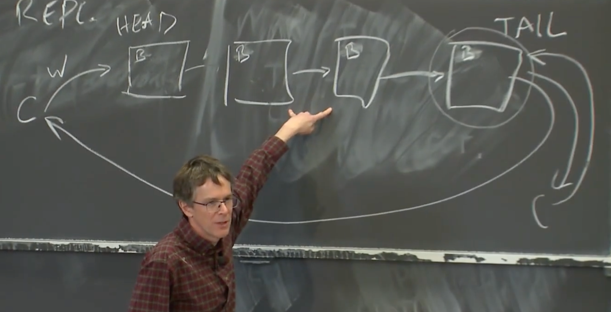

> 这是这种架构所不能处理的情况。如果你希望你的系统能抵御这样的故障。你的Configuration Manager需要更加小心的设计，它需要选出不仅是它能通信的服务器，同时这些服务器之间也能相互通信。在实际中，任意两个节点都有可能网络不通。

# Lecture 10 - Cloud Replicated DB, Aurora

## 10.1 Aurora背景历史

**Aurora是一个高性能，高可靠的数据库**。Aurora本身作为云基础设施一个组成部分而存在，同时又构建在Amazon自己的基础设施之上。

1. 这是最近的来自于Amazon的一种非常成功的云服务，有很多Amazon的用户在使用它。Aurora以自己的方式展示了一个聪明设计所取得的巨大成果。从论文可以看出，在处理事务的速度上，Aurora宣称比其他数据库快35倍。
2. 这篇论文同时也探索了在使用容错的，通用（General-Purpose）存储前提下，性能可以提升的极限。Amazon首先使用的是自己的通用存储，但是后来发现性能不好，然后就构建了完全是应用定制（Application-Specific）的存储，并且几乎是抛弃了通用存储。
3. 论文中还有很多在云基础设施世界中重要的细节。

因为这是Amazon认为它的云产品用户应该在Amazon基础设施之上构建的数据库，所以在讨论Aurora之前，我想花一点时间来回顾一下历史，究竟是什么导致了Aurora的产生？

最早的时候，Amazon提供的云产品是EC2 ( Elastic Cloud 2 )，它可以帮助用户在Amazon的机房里和Amazon的硬件上创建类似网站的应用。Amazon有装满了服务器的数据中心，并且会在每一个服务器上都运行VMM（Virtual Machine Monitor）。它会向它的用户出租虚拟机，而它的用户通常会租用多个虚拟机用来运行Web服务、数据库和任何其他需要运行的服务。所以，在一个服务器上，有一个VMM，还有一些EC2实例，其中每一个实例都出租给不同的云客户。每个EC2实例都会运行一个标准的操作系统，比如说Linux，在操作系统之上，运行的是应用程序，例如Web服务、数据库。这种方式相对来说成本较低，也比较容易配置，所以是一个成功的服务模式。

这里有一个对我们来说极其重要的细节。因为每一个服务器都有一块本地的硬盘，在最早的时候，如果你租用一个EC2实例，每一个EC2实例会从服务器的本地硬盘中分到一小片硬盘空间。所以，最早的时候EC2用的都是本地盘，每个EC2实例会分到本地盘的一小部分。但是从EC2实例的操作系统看起来就是一个硬盘，一个模拟的硬盘。

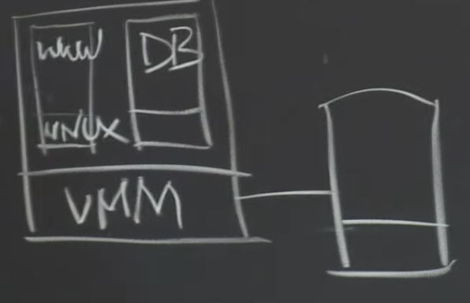

EC2对于无状态的Web服务器来说是完美的。客户端通过自己的Web浏览器连接到一些运行了Web服务的EC2实例上。如果突然新增了大量客户，你可以立刻向Amazon租用更多的EC2实例，并在上面启动Web服务。这样你就可以很简单的对你的Web服务进行扩容。

另一类人们主要运行在EC2实例的服务是数据库。通常来说一个网站包含了一些无状态的Web服务，任何时候这些Web服务需要一些持久化存储的数据时，它们会与一个后端数据库交互。

所以，现在的场景是，在Amazon基础设施之外有一些客户端浏览器（C1，C2，C3）。之后是一些EC2实例，上面运行了Web服务，这里你可以根据网站的规模想起多少实例就起多少。这些EC2实例在Amazon基础设施内。之后，还有一个EC2实例运行了数据库。Web服务所在的EC2实例会与数据库所在的EC2实例交互，完成数据库中记录的读写。

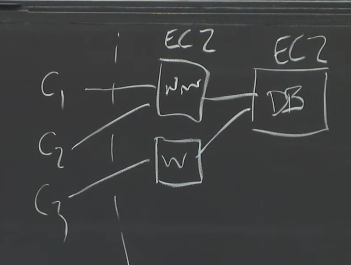

不幸的是，**对于数据库来说，EC2就不像对于Web服务那样完美了，最直接的原因就是存储**。对于运行了数据库的EC2实例，获取存储的最简单方法就是使用EC2实例所在服务器的本地硬盘。如果服务器宕机了，那么它本地硬盘也会无法访问。当Web服务所在的服务器宕机了，是完全没有问题的，因为Web服务本身没有状态，你只需要在一个新的EC2实例上启动一个新的Web服务就行。但是如果数据库所在的服务器宕机了，并且数据存储在服务器的本地硬盘中，那么就会有大问题，因为数据丢失了。

Amazon本身有实现了块存储的服务，叫做S3。你**可以定期的对数据库做快照，并将快照存储在S3上，并基于快照来实现故障恢复，但是这种定期的快照意味着你可能会损失两次快照之间的数据**。

于是就有了EBS。EBS全称是Elastic Block Store。**从EC2实例来看，EBS就是一个硬盘**，你可以像一个普通的硬盘一样去格式化它，就像一个类似于ext3格式的文件系统或者任何其他你喜欢的Linux文件系统。但是在实现上，**EBS底层是一对互为副本的存储服务器**。随着EBS的推出，你可以租用一个EBS volume。一个EBS volume看起来就像是一个普通的硬盘一样，但却是由一对互为副本EBS服务器实现，每个EBS服务器本地有一个硬盘。所以，现在你运行了一个数据库，相应的EC2实例将一个EBS volume挂载成自己的硬盘。当数据库执行写磁盘操作时，数据会通过网络送到EBS服务器。

这两个EBS服务器会使用Chain Replication进行复制。

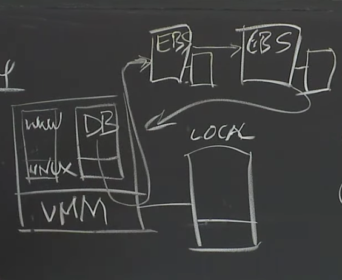

所以现在，运行在EC2实例上的数据库有了可用性。因为现在有了一个存储系统可以在服务器宕机之后，仍然能持有数据。如果数据库所在的服务器挂了，你可以启动另一个EC2实例，并为其挂载同一个EBS volume，再启动数据库。新的数据库可以看到所有前一个数据库留下来的数据，就像你把硬盘从一个机器拔下来，再插入到另一个机器一样。所以EBS非常适合需要长期保存数据的场景，比如说数据库。

但是EBS不是用来共享的服务。任何时候，只有一个EC2实例，一个虚机可以挂载一个EBS volume。所以，**尽管所有人的EBS volume都存储在一个大的服务器池子里，每个EBS volume只能被一个EC2实例所使用**。

尽管EBS是一次很大的进步，但是它仍然有自己的问题。

1. 如果在EBS上运行了一个数据库，会产生大量的网络流量。在论文中有暗示，除了网络的限制之外，还有CPU和存储空间的限制。在Aurora论文中，花费了大量的精力来降低数据库产生的网络负载。
2. EBS的容错性不是很好。出于性能的考虑，Amazon总是将EBS volume的两个副本存放在同一个数据中心。如果一个副本故障了，那没问题，因为可以切换到另一个副本，但是如果整个数据中心挂了，那就没辙了。

在Amazon的术语中，一个AZ就是一个数据中心。Amazon通常这样管理它们的数据中心，在一个城市范围内有多个独立的数据中心。大概2-3个相近的数据中心，通过冗余的高速网络连接在一起，我们之后会看一下为什么这是重要的。但是对于EBS来说，为了降低使用Chain Replication的代价，Amazon 将EBS的两个副本放在一个AZ中。

## 10.2 故障可恢复事务

Aurora使用的是与MySQL类似的机制实现，但是又以一种有趣的方式实现了加速，所以我们需要知道一个典型的数据库是如何设计实现的，这样我们才能知道Aurora是如何实现加速的。

这一部分是数据库教程，但是实际上主要关注的是，如何实现一个故障可恢复事务（Crash Recoverable Transaction）。

首先，什么是事务？**事务是指将多个操作打包成原子操作，并确保多个操作顺序执行**。假设我们运行一个银行系统，我们想在不同的银行账户之间转账。你可以这样看待一个事务，首先需要定义想要原子打包的多个操作的开始；之后是操作的内容，现在我们想要从账户Y转10块钱到账户X，那么账户X需要增加10块，账户Y需要减少10块；最后表明事务结束。

**我们希望数据库顺序执行这两个操作，并且不允许其他任何人看到执行的中间状态。同时，考虑到故障，如果在执行的任何时候出现故障，我们需要确保故障恢复之后，要么所有操作都已经执行完成，要么一个操作也没有执行。**这是我们想要从事务中获得的效果。**除此之外，数据库的用户期望数据库可以通知事务的状态，也就是事务是否真的完成并提交了。如果一个事务提交了，用户期望事务的效果是可以持久保存的，即使数据库故障重启了，数据也还能保存。**

通常来说，事务是通过对涉及到的每一份数据加锁来实现。所以你可以认为，在整个事务的过程中，都对X，Y加了锁。并且只有当事务结束、提交并且持久化存储之后，锁才会被释放。所以，数据库实际上在事务的过程中，是通过对数据加锁来确保其他人不能访问。

对于一个简单的数据库模型，数据库运行在单个服务器上，并且使用本地硬盘。

在硬盘上存储了数据的记录，或许是以B-Tree方式构建的索引。所以有一些data page用来存放数据库的数据，其中一个存放了X的记录，另一个存放了Y的记录。每一个data page通常会存储大量的记录，而X和Y的记录是page中的一些bit位。

在硬盘中，除了有数据之外，还有一个预写式日志（Write-Ahead Log，简称为WAL）。预写式日志对于系统的容错性至关重要。

在服务器内部，有数据库软件，通常数据库会对最近从磁盘读取的page有缓存。

当你在执行一个事务内的各个操作时，例如执行 X=X+10 的操作时，数据库会从硬盘中读取持有X的记录，给数据加10。**但是在事务提交之前，数据的修改还只在本地的缓存中，并没有写入到硬盘**。我们现在还不想向硬盘写入数据，因为这样可能会暴露一个不完整的事务。

为了让数据库在故障恢复之后，还能够提供同样的数据，在允许数据库软件修改硬盘中真实的data page之前，数据库软件需要先在WAL中添加Log条目来描述事务。所以在提交事务之前，数据库需要先在WAL中写入完整的Log条目，来描述所有有关数据库的修改，并且这些Log是写入磁盘的。

让我们假设，X的初始值是500，Y的初始值是750。

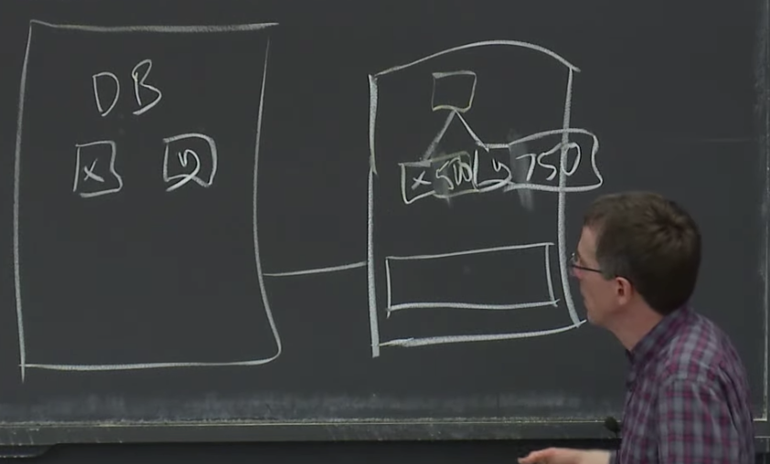

在提交并写入硬盘的data page之前，数据库通常需要写入至少3条Log记录：

1. 第一条表明，作为事务的一部分，我要修改X，它的旧数据是500，我要将它改成510。
2. 第二条表明，我要修改Y，它的旧数据是750，我要将它改成740。
3. 第三条记录是一个Commit日志，表明事务的结束。

通常来说，前两条Log记录会打上事务的ID作为标签，这样在故障恢复的时候，可以根据第三条commit日志找到对应的Log记录，进而知道哪些操作是已提交事务的，哪些是未完成事务的。

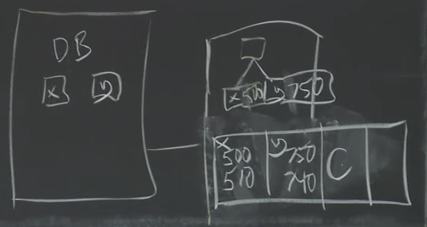

> 学生提问：为什么在WAL的log中，需要带上旧的数据值？
>
> Robert教授：在这个简单的数据库中，在WAL中只记录新的数据就可以了。如果出现故障，只需要重新应用所有新的数据即可。但是大部分真实的数据库同时也会在WAL中存储旧的数值，这样对于一个非常长的事务，只要WAL保持更新，在事务结束之前，数据库可以提前将更新了的page写入硬盘，比如说将Y写入新的数据740。之后如果在事务提交之前故障了，恢复的软件可以发现，事务并没有完成，所以需要撤回之前的操作，这时，这些旧的数据，例如Y的750，需要被用来撤回之前写入到data page中的操作。对于Aurora来说，实际上也使用了undo/redo日志，用来撤回未完成事务的操作。

如果数据库成功的将事务对应的操作和commit日志写入到磁盘中，数据库可以回复给客户端说，事务已经提交了。而这时，客户端也可以确认事务是永久可见的。

接下来有两种情况。

1. 如果数据库没有崩溃，那么在它的cache中，X，Y对应的数值分别是510和740。最终数据库会将cache中的数值写入到磁盘对应的位置。所以数据库写磁盘是一个lazy操作，它会对更新进行累积，每一次写磁盘可能包含了很多个更新操作。这种累积更新可以提升操作的速度。

2. 如果数据库在将cache中的数值写入到磁盘之前就崩溃了，这样磁盘中的page仍然是旧的数值。当数据库重启时，恢复软件会扫描WAL日志，发现对应事务的Log，并发现事务的commit记录，那么恢复软件会将新的数值写入到磁盘中。这被称为redo，它会重新执行事务中的写操作。

这就是事务型数据库的工作原理的简单描述，同时这也是一个极度精简的MySQL数据库工作方式的介绍，MySQL基本以这种方式实现了故障可恢复事务。而Aurora就是基于这个开源软件MYSQL构建的。

## 10.3 关系型数据库

在MySQL基础上，结合Amazon自己的基础设施，Amazon为其云用户开发了改进版的数据库RDS（Relational Database Service）。RDS是第一次尝试将数据库在多个AZ之间做复制，这样就算整个数据中心挂了，你还是可以从另一个AZ重新获得数据而不丢失任何写操作。

对于RDS来说，有且仅有一个EC2实例作为数据库。这个数据库将它的data page和WAL Log存储在EBS，而不是对应服务器的本地硬盘。当数据库执行了写Log或者写page操作时，这些写请求实际上通过网络发送到了EBS服务器。所有这些服务器都在一个AZ中。

每一次数据库软件执行一个写操作，Amazon会自动的，对数据库无感知的，将写操作拷贝发送到另一个数据中心的AZ中。

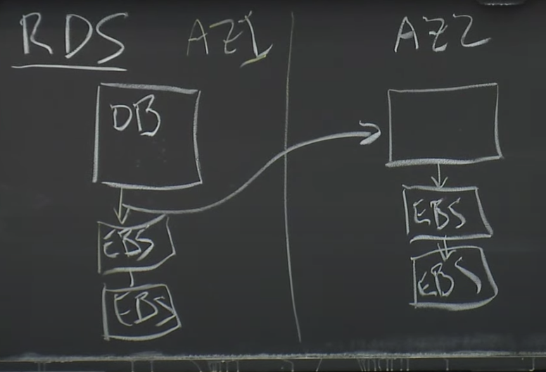

在RDS的架构中，每一次写操作，例如数据库追加日志或者写磁盘的page，数据除了发送给AZ1的两个EBS副本之外，还需要通过网络发送到位于AZ2的副数据库。副数据库接下来会将数据再发送给AZ2的两个独立的EBS副本。之后，AZ2的副数据库会将写入成功的回复返回给AZ1的主数据库，主数据库看到这个回复之后，才会认为写操作完成了。

RDS的写操作代价极高，因为需要写大量的数据。

## 10.4 Aurora初探

这一部分开始介绍Aurora。整体上来看，我们还是有一个数据库服务器，但是这里运行的是Amazon的Aurora，这里只是一个实例，它运行在某个AZ中。

在Aurora的架构中，有两件有意思的事情：

第一件事**在替代EBS的位置，有6个数据的副本，位于3个AZ，每个AZ有2个副本。所以现在有了超级容错性，并且每个写请求都需要以某种方式发送给这6个副本**。

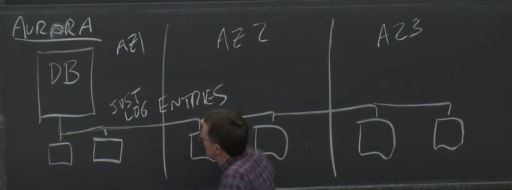

现在有了更多的副本，为什么Aurora不是更慢了？**这里通过网络传递的数据只有Log条目**，这才是Aurora成功的关键。从之前的简单数据库模型可以看出，每一条Log条目只有几十个字节那么多，也就是存一下旧的数值，新的数值，所以Log条目非常小。然而，当一个数据库要写本地磁盘时，它更新的是data page，这里的数据是巨大的，虽然在论文里没有说，但是我认为至少是8k字节那么多。所以，对于每一次事务，需要通过网络发送多个8k字节的page数据。而Aurora只是向更多的副本发送了少量的Log条目。

当这里的后果是，这里的存储系统不再是通用（General-Purpose）存储，这是一个可以理解MySQL Log条目的存储系统。EBS是一个非常通用的存储系统，它模拟了磁盘，只需要支持读写数据块。**EBS不理解除了数据块以外的其他任何事物。而这里的存储系统理解使用它的数据库的Log**。所以这里，**Aurora将通用的存储去掉了，取而代之的是一个应用定制的（Application-Specific）存储系统。**

另一件重要的事情是，Aurora并不需要6个副本都确认了写入才能继续执行操作。相应的，**只要Quorum形成了，也就是任意4个副本确认写入了，数据库就可以继续执行操作**。

## 10.5 Aurora存储服务器的容错目标

从之前的描述可以看出，Aurora的Quorum系统管理了6个副本的容错系统。所以值得思考的是，Aurora的容错目标是什么？

1. 对于写操作，当只有一个AZ彻底挂了之后，写操作不受影响。
2. 对于读操作，当一个AZ和一个其他AZ的服务器挂了之后，读操作不受影响。这里的原因是，AZ的下线时间可能很长，比如说数据中心被水淹了。人们可能需要几天甚至几周的时间来修复洪水造成的故障，在AZ下线的这段时间，我们只能依赖其他AZ的服务器。所以当一个AZ彻底下线了之后，对于读操作，Aurora还能容忍一个额外服务器的故障，并且仍然可以返回正确的数据。至于为什么会定这样的目标，我们必须理所当然的认为Amazon知道他们自己的业务，并且认为这是实现容错的最佳目标。
3. Aurora期望能够容忍暂时的慢副本。如果你向EBS读写数据，你并不能得到稳定的性能，有时可能会有一些卡顿，或许网络中一部分已经过载了，或许某些服务器在执行软件升级，任何类似的原因会导致暂时的慢副本。所以Aurora期望能够在出现短暂的慢副本时，仍然能够继续执行操作。
4. 如果一个副本挂了，在另一个副本挂之前，是争分夺秒的。统计数据或许没有你期望的那么好，因为通常来说服务器故障不是独立的。事实上，一个服务器挂了，通常意味着有很大的可能另一个服务器也会挂，因为它们有相同的硬件，或许从同一个公司购买，来自于同一个生产线。如果其中一个有缺陷，非常有可能会在另一个服务器中也会有相同的缺陷。所以，当出现一个故障时，人们总是非常紧张，因为第二个故障可能很快就会发生。对于Aurora的Quorum系统，有点类似于Raft，你只能从局部故障中恢复。所以这里需要快速生成新的副本（Fast Re-replication）。也就是说如果一个服务器看起来永久故障了，我们期望能够尽可能快的根据剩下的副本，生成一个新的副本。

## 10.6 Quorum复制机制

Aurora使用的是一种经典quorum思想的变种。**Quorum系统背后的思想是通过复制构建容错的存储系统，并确保即使有一些副本故障了，读请求还是能看到最近的写请求的数据**。通常来说，Quorum系统就是简单的读写系统，支持Put/Get操作。它们通常不直接支持更多更高级的操作。

假设有N个副本。为了能够执行写请求，必须要确保写操作被W个副本确认，W小于N。所以你需要将写请求发送到这W个副本。如果要执行读请求，那么至少需要从R个副本得到所读取的信息。这里的W对应的数字称为Write Quorum，R对应的数字称为Read Quorum。这是一个典型的Quorum配置。

这里的关键点在于，W、R、N之间的关联。Quorum系统要求，任意你要发送写请求的W个服务器，必须与任意接收读请求的R个服务器有重叠。这意味着，R加上W必须大于N（ 至少满足R + W = N + 1 ），这样任意W个服务器至少与任意R个服务器有一个重合。

这是Quorum系统的要求，Read Quorum必须至少与Write Quorum有一个服务器是重合的。所以任何读请求可以从至少一个看见了之前写请求的服务器得到回复。

客户端读请求可能会得到R个不同的结果，现在的问题是，客户端如何知道从R个服务器得到的R个结果中，哪一个是正确的呢？在Quorum系统中使用的是版本号（Version）。所以，每一次执行写请求，你需要将新的数值与一个增加的版本号绑定。之后，客户端发送读请求，从Read Quorum得到了一些回复，客户端可以直接使用其中的最高版本号的数值。

如果你不能与Quorum数量的服务器通信，不管是Read Quorum还是Write Quorum，那么你只能不停的重试了。这是Quorum系统的规则，你只能不停的重试，直到服务器重新上线，或者重新联网。

相比Chain Replication，这里的优势是可以轻易的剔除暂时故障、失联或者慢的服务器。实际上，这里是这样工作的，当你执行写请求时，你会将新的数值和对应的版本号给所有N个服务器，**但是只会等待W个服务器确认**。类似的，对于读请求，你可以将读请求发送给所有的服务器，但是只等待R个服务器返回结果。因为你只需要等待R个服务器，这意味着在最快的R个服务器返回了之后，你就可以不用再等待慢服务器或者故障服务器超时。

除此之外，Quorum系统可以调整读写的性能。通过调整Read Quorum和Write Quorum，可以使得系统更好的支持读请求或者写请求。对于N=3，如果你想要提升读请求的性能，在一个3个服务器的Quorum系统中，你可以设置R为1，W为3，这样读请求会快得多，因为它只需要等待一个服务器的结果，但是代价是写请求执行的比较慢。如果你想要提升写请求的性能，可以设置R为3，W为1，这意味着可能只有1个服务器有最新的数值，但是因为客户端会咨询3个服务器，3个服务器其中一个肯定包含了最新的数值。

当R为3，W为1时，读请求不再是容错的，因为对于读请求，所有的服务器都必须在线才能执行成功。所以在实际场景中，你不会想要这么配置，你或许会与Aurora一样，使用更多的服务器，将N变大，然后再权衡Read Quorum和Write Quorum。

## 10.7 Aurora读写存储服务器

Aurora中的写请求并不是像一个经典的Quorum系统一样直接更新数据。对于Aurora来说，它的写请求从来不会覆盖任何数据，它的写请求只会在当前Log中追加条目（Append Entries）。所以，Aurora使用Quorum只是在数据库执行事务并发出新的Log记录时，确保Log记录至少出现在4个存储服务器上，之后才能提交事务。

实际上，在一个故障恢复过程中，事务只能在之前所有的事务恢复了之后才能被恢复。所以，在Aurora确认一个事务之前，它必须等待Write Quorum确认之前所有已提交的事务，之后再确认当前的事务，最后才能回复给客户端。

这里的存储服务器接收Log条目，这是它们看到的写请求。它们并没有从数据库服务器获得到新的data page，它们得到的只是用来描述data page更新的Log条目。但是存储服务器内存最终存储的还是数据库服务器磁盘中的page。在存储服务器的内存中，会有自身磁盘中page的cache，例如page1（P1），page2（P2），这些page其实就是数据库服务器对应磁盘的page。

**当一个新的写请求到达时，这个写请求只是一个Log条目，Log条目中的内容需要应用到相关的page中。但是我们不必立即执行这个更新，可以等到数据库服务器或者恢复软件想要查看那个page时才执行**。对于每一个存储服务器存储的page，如果它最近被一个Log条目修改过，那么存储服务器会在内存中缓存一个旧版本的page和一系列来自于数据库服务器有关修改这个page的Log条目。

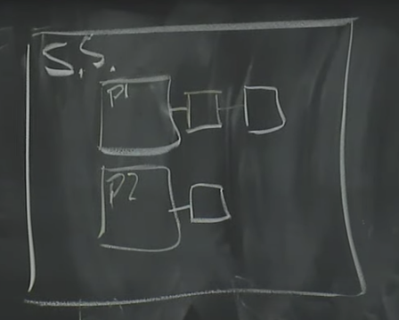

如果之后数据库服务器将自身缓存的page删除了，过了一会又需要为一个新的事务读取这个page，它会发出一个读请求。请求发送到存储服务器，会要求存储服务器返回当前最新的page数据。在这个时候，存储服务器才会将Log条目中的新数据更新到page，并将page写入到自己的磁盘中，之后再将更新了的page返回给数据库服务器。同时，存储服务器在自身cache中会删除page对应的Log列表，并更新cache中的page，虽然实际上可能会复杂的多。

如刚刚提到的，数据库服务器有时需要读取page。所以，可能你已经发现了，数据库服务器写入的是Log条目，但是读取的是page。这也是与Quorum系统不一样的地方。Quorum系统通常读写的数据都是相同的。除此之外，在一个普通的操作中，数据库服务器可以避免触发Quorum Read。数据库服务器会记录每一个存储服务器接收了多少Log。所以，首先，Log条目都有类似12345这样的编号，**当数据库服务器发送一条新的Log条目给所有的存储服务器，存储服务器接收到它们会返回说，我收到了第79号和之前所有的Log。数据库服务器会记录每个存储服务器收到的最高连续的Log条目号**。这样的话，当一个数据库服务器需要执行读操作，它只会挑选拥有最新Log的存储服务器，然后只向那个服务器发送读取page的请求。所以，数据库服务器执行了Quorum Write，但是却没有执行Quorum Read。

但是，数据库服务器有时也会使用Quorum Read。假设数据库服务器运行在某个EC2实例，如果相应的硬件故障了，数据库服务器也会随之崩溃。在Amazon的基础设施有一些监控系统可以检测到Aurora数据库服务器崩溃，之后Amazon会自动的启动一个EC2实例，在这个实例上启动数据库软件，并告诉新启动的数据库：你的数据存放在那6个存储服务器中，请清除存储在这些副本中的任何未完成的事务，之后再继续工作。这时，Aurora会使用Quorum的逻辑来执行读请求。因为之前数据库服务器故障的时候，它极有可能处于执行某些事务的中间过程。可能它还在执行某些其他事务的过程中，这些事务也有一部分Log条目存放在Quorum系统中，但是因为数据库服务器在执行这些事务的过程中崩溃了，这些事务永远也不可能完成。对于这些未完成的事务，我们可能会有这样一种场景，第一个副本有第101个Log条目，第二个副本有第102个Log条目，第三个副本有第104个Log条目，但是没有一个副本持有第103个Log条目。

所以故障之后，新的数据库服务器需要恢复，它会执行Quorum Read，找到第一个缺失的Log序号，在上面的例子中是103，并说，好吧，我们现在缺失了一个Log条目，我们不能执行这条Log之后的所有Log，因为我们缺失了一个Log对应的更新。

所以，这种场景下，数据库服务器执行了Quorum Read，从可以连接到的存储服务器中发现103是第一个缺失的Log条目。这时，数据库服务器会给所有的存储服务器发送消息说：**请丢弃103及之后的所有Log条目**。103及之后的Log条目必然不会包含已提交的事务，因为我们知道只有当一个事务的所有Log条目存在于Write Quorum时，这个事务才会被commit，所以对于已经commit的事务我们肯定可以看到相应的Log。这里我们只会丢弃未commit事务对应的Log条目。

某种程度上，我们将Log在102位置做了切割，102及之前的Log会保留。**但是这些会保留的Log中，可能也包含了未commit事务的Log，数据库服务器需要识别这些Log。这是可行的，可以通过Log条目中的事务ID和事务的commit Log条目来判断哪些Log属于已经commit的事务，哪些属于未commit的事务**。数据库服务器可以发现这些未完成的事务对应Log，并发送undo操作来撤回所有未commit事务做出的变更。这就是为什么Aurora在Log中同时也会记录旧的数值的原因。因为只有这样，数据库服务器在故障恢复的过程中，才可以回退之前只提交了一部分，但是没commit的事务。

## 10.8 数据分片

这一部分讨论Aurora如何处理大型数据库。目前为止，我们已经知道Aurora将自己的数据分布在6个副本上，每一个副本都是一个计算机，上面挂了1-2块磁盘。但是如果只是这样的话，我们不能拥有一个数据大小大于单个机器磁盘空间的数据库。因为虽然我们有6台机器，但是并没有为我们提供6倍的存储空间，每个机器存储的都是相同的数据。

为了能支持超过10TB数据的大型数据库。Amazon的做法是将数据库的数据，分割存储到多组存储服务器上，每一组都是6个副本，分割出来的每一份数据是10GB。所以，如果一个数据库需要20GB的数据，那么这个数据库会使用2个PG（Protection Group）。

这里有一件有意思的事情，你可以将磁盘中的data page分割到多个独立的PG中，比如说奇数号的page存在PG1，偶数号的page存在PG2。如果可以根据data page做sharding，那是极好的。

如果有多个Protection Group，该如何分割Log呢？当Aurora需要发送一个Log条目时，它会查看Log所修改的数据，并找到存储了这个数据的Protection Group，并把Log条目只发送给这个Protection Group对应的6个存储服务器。这意味着，**每个Protection Group只存储了部分data page和所有与这些data page关联的Log条目**。所以每个Protection Group存储了所有data page的一个子集，以及这些data page相关的Log条目。

如果其中一个存储服务器挂了，我们期望尽可能快的用一个新的副本替代它。因为如果4个副本挂了，我们将不再拥有Read Quorum，我们也因此不能创建一个新的副本。**所以我们想要在一个副本挂了以后，尽可能快的生成一个新的副**本。表面上看，每个存储服务器存放了某个数据库的某个某个Protection Group对应的10GB数据，但实际上每个存储服务器可能有1-2块几TB的磁盘，上面存储了属于数百个Aurora实例的10GB数据块。所以在存储服务器上，可能总共会有10TB的数据，当它故障时，它带走的不仅是一个数据库的10GB数据，同时也带走了其他数百个数据库的10GB数据。所以生成的新副本，不是仅仅要恢复一个数据库的10GB数据，而是要恢复存储在原来服务器上的整个10TB的数据。我们来做一个算术，如果网卡是10Gb/S，通过网络传输10TB的数据需要8000秒。这个时间太长了，我们不想只是坐在那里等着传输。

Aurora实际使用的策略是，对于一个特定的存储服务器，它存储了许多Protection Group对应的10GB的数据块。对于Protection Group A，它的其他副本是5个服务器。

或许这个存储服务器还为Protection Group B保存了数据，但是B的其他副本存在于与A没有交集的其他5个服务器中。

类似的，对于所有的Protection Group对应的数据块，都会有类似的副本。这种模式下，如果一个存储服务器挂了，假设上面有100个数据块，现在的替换策略是：找到100个不同的存储服务器，其中的每一个会被分配一个数据块，也就是说这100个存储服务器，每一个都会加入到一个新的Protection Group中。所以相当于，每一个存储服务器只需要负责恢复10GB的数据。所以在创建新副本的时候，我们有了100个存储服务器。

对于每一个数据块，我们会从Protection Group中挑选一个副本，作为数据拷贝的源。这样，对于100个数据块，相当于有了100个数据拷贝的源。之后，就可以并行的通过网络将100个数据块从100个源拷贝到100个目的。

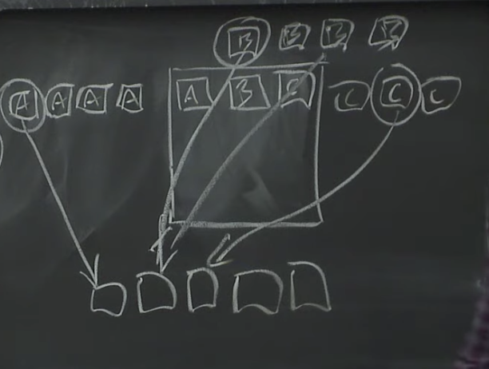

假设有足够多的服务器，这里的服务器大概率不会有重合，同时假设我们有足够的带宽，现在我们可以以100的并发，并行的拷贝1TB的数据，这只需要10秒左右。如果只在两个服务器之间拷贝，正常拷贝1TB数据需要1000秒左右。

这就是Aurora使用的副本恢复策略，它意味着，如果一个服务器挂了，它可以并行的，快速的在数百台服务器上恢复。如果大量的服务器挂了，可能不能正常工作，但是如果只有一个服务器挂了，Aurora可以非常快的重新生成副本。

## 10.9 只读服务器

Aurora不仅有主数据库实例，同时多个数据库的副本。对于Aurora的许多客户来说，相比读写查询，他们会有多得多的只读请求。你可以设想一个Web服务器，如果你只是查看Web页面，那么后台的Web服务器需要读取大量的数据才能生成页面所需的内容，或许需要从数据库读取数百个条目。但是在浏览Web网页时，写请求就要少的多，或许一些统计数据要更新，或许需要更新历史记录，所以读写请求的比例可能是100：1。

对于写请求，可以只发送给一个数据库，因为对于后端的存储服务器来说，只能支持一个写入者。背后的原因是，Log需要按照数字编号，如果只在一个数据库处理写请求，非常容易对Log进行编号，但是如果有多个数据库以非协同的方式处理写请求，那么为Log编号将会非常非常难。

但是对于读请求，可以发送给多个数据库。Aurora的确有多个只读数据库，这些数据库可以从后端存储服务器读取数据。所以，除了主数据库用来处理写请求，同时也有一组**只读数据库**。如果有大量的读请求，读请求可以分担到这些只读数据库上。

当客户端向只读数据库发送读请求，只读数据库需要弄清楚它需要哪些data page来处理这个读请求，之后直接从存储服务器读取这些data page，并不需要主数据库的介入。所以只读数据库向存储服务器直接发送读取page的请求，之后它会缓存读取到的page，这样对于将来的一些读请求，可以直接根据缓存中的数据返回。

当然，只读数据库也需要更新自身的缓存，所以，Aurora的主数据库也会将它的Log的拷贝发送给每一个只读数据库。主数据库会向这些只读数据库发送所有的Log条目，只读数据库用这些Log来更新它们缓存的page数据，进而获得数据库中最新的事务处理结果。

这的确意味着只读数据库会落后主数据库一点，但是对于大部分的只读请求来说，这没问题。但是：

1. 我们不想要这个只读数据库看到未commit的事务。所以，**在主数据库发给只读数据库的Log流中，主数据库需要指出，哪些事务commit了**，而只读数据库需要小心的不要应用未commit的事务到自己的缓存中，它们需要等到事务commit了再应用对应的Log。

2. 数据库背后的B-Tree结构非常复杂，可能会定期触发rebalance。而rebalance是一个非常复杂的操作，对应了大量修改树中的节点的操作，这些操作需要有原子性。因为当B-Tree在rebalance的过程中，中间状态的数据是不正确的，只有在rebalance结束了才可以从B-Tree读取数据。但是只读数据库直接从存储服务器读取数据库的page，它可能会看到在rebalance过程中的B-Tree。这时看到的数据是非法的，会导致只读数据库崩溃或者行为异常。

论文中讨论了微事务（Mini-Transaction）和VDL/VCL。**数据库服务器可以通知存储服务器说，这部分复杂的Log序列只能以原子性向只读数据库展示，也就是要么全展示，要么不展示**。这就是微事务（Mini-Transaction）和VDL。所以当一个只读数据库需要向存储服务器查看一个data page时，存储服务器会小心的，要么展示微事务之前的状态，要么展示微事务之后的状态，但是绝不会展示中间状态。

总结：

1. 大家都应该知道事务型数据库是如何工作的，并且知道事务型数据库与后端存储之间交互带来的影响。这里涉及了性能，故障修复，以及运行一个数据库的复杂度，这些问题在系统设计中会反复出现。
2. Quorum思想。通过读写Quorum的重合，可以确保总是能看见最新的数据，但是又具备容错性。这种思想在Raft中也有体现，Raft可以认为是一种强Quorum的实现（读写操作都要过半服务器认可）。
3. 数据库和存储系统基本是一起开发出来的，数据库和存储系统以一种有趣的方式集成在了一起。通常我们设计系统时，需要有好的隔离解耦来区分上层服务和底层的基础架构。所以通常来说，存储系统是非常通用的，并不会为某个特定的应用程序定制。因为一个通用的设计可以被大量服务使用。但是在Aurora面临的问题中，性能问题是非常严重的，它不得不通过模糊服务和底层基础架构的边界来获得35倍的性能提升，这是个巨大的成功。

最后一件有意思的事情是，论文中的一些有关云基础架构中什么更重要的隐含信息。例如：

1. 需要担心整个AZ会出现故障；
2. 需要担心短暂的慢副本，这是经常会出现的问题；
3. 网络是主要的瓶颈，毕竟Aurora通过网络发送的是极短的数据，但是相应的，存储服务器需要做更多的工作（应用Log），因为有6个副本，所以有6个CPU在复制执行这些redo Log条目，明显，从Amazon看来，网络容量相比CPU要重要的多。

# Lecture 11 - Cache Consistency

## 11.1 Frangipani初探

Frangipani论文里面有大量缓存一致性的介绍（Cache Coherence）。**缓存一致性是指，如果我缓存了一些数据，之后你修改了实际数据但是并没有考虑我缓存中的数据，必须有一些额外的工作的存在，这样我的缓存才能与实际数据保持一致**。论文还介绍了**分布式事务**（Distributed Transaction），这对于向文件系统的数据结构执行复杂更新来说是必须的。因为文件本质上是分割散落在大量的服务器上，能够从这些服务器实现**分布式故障恢复**（Distributed Crash Recovery）也是至关重要的。

从整体架构上来说，Frangipani就是一个网络文件系统（NFS，Network File System）。它的目标是与已有的应用程序一起工作，比如说一个运行在工作站上的普通UNIX程序。从一个全局视图来看，它包含了大量的用户（U1，U2，U3）。

每个用户坐在一个工作站前面，三个用户对应的工作站（Workstation）分别是WS1，WS2，WS3。

每一个工作站运行了一个Frangipani服务。当这些普通的应用程序执行文件系统调用时，在系统内核中，有一个Frangipani模块，它实现了文件系统。

文件系统的数据结构，例如文件内容、inode、目录、目录的文件列表、inode和块的空闲状态，**所有这些数据都存在一个叫做Petal的共享虚拟磁盘服务中。Petal运行在一些不同的服务器上，有可能是机房里面的一些服务器，但是不会是人们桌子上的工作站**。Petal会复制数据，所以你可以认为Petal服务器成对的出现，这样就算一个故障了，我们还是能取回我们的数据。当Frangipani需要读写文件时，它会向正确的Petal服务器发送RPC，并说，我需要这个块，请读取这个块，并将数据返回给我。在大部分时候，Petal表现的就像是一个磁盘，你可以把它看做是共享的磁盘，所有的Frangipani都会与之交互。

从我们的角度来看，大部分的讨论都会假设Petal就是一个被所有Frangipani使用的，基于网络的共享磁盘。你可以通过一个块号或者磁盘上的一个地址来读写数据，就像一个普通的硬盘一样。

论文作者期望使用Frangipani的目的，是驱动设计的一个重要因素。

1. 作者想通过Frangipani来支持他们自己的一些活动，作者们是一个研究所的成员，假设研究所有50个人，他们习惯于**使用共享的基础设施**，例如分时间段使用同一批服务器，工作站。他们还**期望通过网络文件系统在相互协作的研究员之间共享文件**。
2. 除此之外，如果我坐在任意一个工作站前面，**我都能获取到所有的文件，包括了我的home目录，我环境中所需要的一切文件**。

3. 至于性能，在他们的环境中也非常重要。实际上，大部分时候，人们使用工作站时，他们基本上只会读写自己的文件。所以，尽管数据的真实拷贝是在共享的磁盘中，但是如果在本地能有一些缓存，那将是极好的。

4. 除了最基本的缓存之外，Frangipani还支持Write-Back缓存。这意味着，我的修改只会在本地的缓存中。而这些修改要过一会才会写回到Petal。这对于性能来说有巨大的帮助。

5. 在这样的架构下，一个非常重要的后果是，**文件系统的逻辑需要存在于每个工作站上。为了让所有的工作站能够只通过操作内存就完成类似创建文件的事情，这意味着所有对于文件系统的逻辑和设计必须存在于工作站内部**。

在Frangipani的设计中，Petal作为共享存储系统存在，它不知道文件系统，文件，目录，它只是一个很直观简单的存储系统，所有的复杂的逻辑都在工作站中的Frangipani模块中。所以这是一个非常去中心化的设计，这种设计有好的影响。因为主要的复杂度，主要的CPU运算在每个工作站上，这意味着，随着你向系统增加更多的工作站，增加更多的用户，你自动的获得了更多的CPU算力来运行这些新的用户的文件系统操作。

当然，在某个时间点，瓶颈会在Petal。因为这是一个中心化的存储系统，这时，你需要增加更多的存储服务器。

## 11.2 Frangipani的挑战

Frangipani的挑战主要来自于两方面，一个是**缓存**，另一个是这种**去中心化的架构带来的大量的逻辑存在于客户端之中进而引起的问题**。

第一个挑战是，假设工作站W1创建了一个文件 ***/A***。最初，这个文件只会在本地缓存中创建。首先，Frangipani需要从Petal获得 ***/*** 目录下的内容，之后当创建文件时，工作站只是修改缓存的拷贝，并不会将修改立即返回给Petal。

这里有个直接的问题，假设工作站W2上的用户想要获取 ***/*** 目录下的文件列表，我们希望这个用户可以看到新创建的文件。

另一个问题是，因为所有的文件和目录都是共享的，非常容易会有两个工作站在同一个时间修改同一个目录。假设用户U1在他的工作站W1上想要创建文件***/A***，这是一个在 ***/*** 目录下的新文件，同时，用户U2在他的工作站W2上想要创建文件 ***/B*** 。

所以这里的问题是，当他们同时操作时，A和B最后都要创建成功，我们不想只创建一个文件，因为第二个文件的创建有可能会覆盖并取代第一个文件。这里我们称之为原子性（Atomicity）。每一个操作就像在一个时间点发生，而不是一个时间段发生。

最后一个问题是，假设我的工作站修改了大量的内容，由于Write-Back缓存，可能会在本地的缓存中堆积了大量的修改。如果我的工作站崩溃了，但是这时这些修改只有部分同步到了Petal，还有部分仍然只存在于本地。那么，我希望我的工作站的崩溃不会影响其他使用同一个共享系统的工作站。哪怕说这些工作站正在查看我的目录，我的文件，它们应该看到一些合理的现象。它们可以漏掉我最后几个操作，但是它们应该看到一个一致的文件系统，而不是一个损坏了的文件系统数据。

## 11.3 Frangipanid的锁服务

Frangipani的第一个挑战是缓存一致性。在这里我们想要的是**线性一致性和缓存**带来的好处。对于线性一致性来说，当我查看文件系统中任何内容时，我总是能看到最新的数据。对于缓存来说，我们想要缓存带来的性能提升。某种程度上，我们想要同时拥有这两种特性的优点。

Frangipani的缓存一致性核心是由锁保证的。除了Frangipani服务器（也就是工作站），Petal存储服务器，在Frangipani系统中还有第三类服务器，**锁服务器**。尽管你可以通过分片将锁分布到多个服务器上，但是我接下来会假设只有一个锁服务器。逻辑上，锁服务器是独立的服务器，但是实际上我认为它与Petal服务器运行在一起。**在锁服务器里面，有一个表单locks**。我们假设每一个锁以文件名来命名，所以对于每一个文件，我们都有一个锁，而这个锁，可能会被某个工作站所持有。

在这个例子中，我们假设锁是排他锁（Exclusive Lock），尽管实际上Frangipani中的锁更加复杂可以支持两种模式：要么允许一个写入者持有锁，要么允许多个读取者持有锁。假设文件X最近被工作站WS1使用了，所以WS1对于文件X持有锁。同时文件Y最近被工作站WS2使用，所以WS2对于文件Y持有锁。锁服务器会记住每个文件的锁被谁所持有。当然一个文件的锁也有可能不被任何人持有。

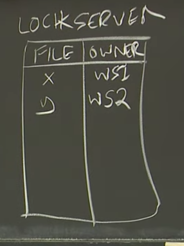

**在每个工作站，会记录跟踪它所持有的锁，和锁对应的文件内容**。所以在每个工作站中，Frangipani模块也会有一个lock表单，表单会记录文件名、对应的锁的状态和文件的缓存内容。这里的文件内容可能是大量的数据块，也可能是目录的列表。

当一个Frangipani服务器决定要读取文件，比如读取目录 /、读取文件A、查看一个inode，首先，它会向一个锁服务器请求文件对应的锁，之后才会向Petal服务器请求文件或者目录的数据。收到数据之后，工作站会记住，本地有一个文件X的拷贝，对应的锁的状态，和相应的文件内容。

每一个工作站的锁至少有两种模式。工作站可以读或者写相应的文件或者目录的最新数据，可以在创建，删除，重命名文件的过程中，如果这样的话，我们认为锁在Busy状态。

**在工作站完成了一些操作之后，比如创建文件，或者读取文件，它会随着相应的系统调用（例如rename，write，create，read）释放锁**。只要系统调用结束了，工作站会在内部释放锁，现在工作站不再使用那个文件。但是从锁服务器的角度来看，**工作站仍然持有锁。工作站内部会标明**，这是锁时Idle状态，它不再使用这个锁。所以这个锁仍然被这个工作站持有，但是工作站并不再使用它。这在稍后的介绍中比较重要。

这里Frangipani应用了很多的规则，这些规则使得Frangipani以一种提供缓存一致性的方式来使用锁，并确保没有工作站会使用缓存中的旧数据。

1. 工作站不允许持有缓存的数据，除非同时也持有了与数据相关的锁。
2. 如果你在释放锁之前，修改了锁保护的数据，那你必须将修改了的数据写回到Petal，只有在Petal确认收到了数据，你才可以释放锁，也就是将锁归还给锁服务器。最后再从工作站的lock表单中删除关文件的锁的记录和缓存的数据。

## 11.4 缓存一致性

工作站和锁服务器之间的缓存一致协议协议包含了4种不同的消息。本质上你可以认为它们就是一些单向的网络消息。

1. 首先是**Request**消息，从工作站发给锁服务器。

2. 如果从锁服务器的lock表单中发现锁已经被其他人持有了，那锁服务器不能立即交出锁。但是一旦锁被释放了，锁服务器会回复一个Grant消息给工作站。这里的Request和Grant是异步的。

3. 如果一个工作站在使用锁，并在执行读写操作，那么它会将锁标记为Busy。但是通常来说，当工作站使用完锁之后，不会向锁服务器释放锁。只是说现在锁的状态会变成Idle而不是Busy。如果工作站能持有所有最近用过的文件的锁并不主动归还的话，会有非常大的优势。所以这里的工作方式是，如果锁服务器收到了一个加锁的请求，它查看自己的lock表单可以发现，这个锁现在正被工作站WS1所持有，锁服务器会发送一个**Revoke**消息给当前持有锁的工作站WS1。并说，现在别人要使用这个文件，请释放锁吧。
4. 当一个工作站收到了一个Revoke请求，如果锁时在Idle状态，并且缓存的数据脏了，工作站会首先将修改过的缓存写回到Petal存储服务器中。所以，对于一个Revoke请求的响应是，工作站会向锁服务器发送一条**Release**消息。如果工作站收到Revoke消息时，它还在使用锁，比如说正在删除或者重命名文件的过程中，直到工作站使用完了锁为止，或者说直到它完成了相应的文件系统操作，它都不会放弃锁。完成了操作之后，工作站中的锁的状态才会从Busy变成Idle，之后工作站才能注意到Revoke请求，在向Petal写完数据之后最终释放锁。

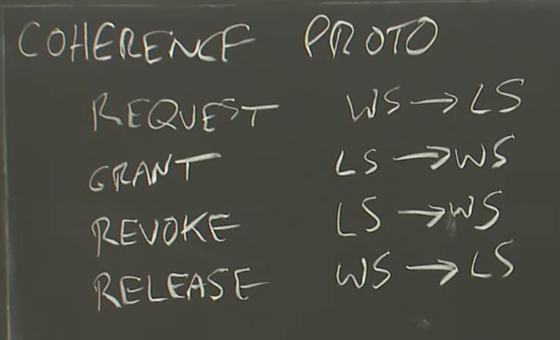

这里面没有考虑一个事实，那就是锁可以是为写入提供的排他锁（Exclusive Lock），也可以是为只读提供的共享锁（Shared Lock）。 

在这个缓存一致性的协议中，有许多可以优化的地方。

1. 每个工作站用完了锁之后，不是立即向锁服务器释放锁，而是将锁的状态标记为Idle就是一种优化。

2. 另一个主要的优化是，Frangipani有共享的读锁（Shared Read Lock）和排他的写锁（Exclusive Write Lock）。如果有大量的工作站需要读取文件，但是没有人会修改这个文件，它们都可以同时持有对这个文件的读锁。如果某个工作站需要修改这个已经被大量工作站缓存的文件时，那么它首先需要Revoke所有工作站的读锁，这样所有的工作站都会放弃自己对于该文件的缓存，只有在那时，这个工作站才可以修改文件。因为没有人持有了这个文件的缓存，所以就算文件被修改了，也没有人会读到旧的数据。

> 学生提问：如果没有其他工作站读取文件，那缓存中的数据就永远不写入后端存储了吗？
>
> Robert教授：实际上，为了阻止这种情况，不管怎么样，工作站每隔30秒会将所有修改了的缓存写回到Petal中。

## 11.5 原子性

为了实现原子性，为了让多步骤的操作，Frangipani在内部实现了一个数据库风格的事务系统，并且是以锁为核心。

简单来说，Frangipani是这样实现分布式事务的：在我完全完成操作之前，Frangipani确保其他的工作站看不到我的修改。首先我的工作站需要获取所有我需要读写数据的锁，在完成操作之前，我的工作站不会释放任何一个锁。并且为了遵循一致性规则（11.3），将所有修改了的数据写回到Petal之后，我的工作站才会释放所有的锁。

因为我们有了锁服务器和缓存一致性协议，我们只需要确保我们在整个操作的过程中持有所有的锁，我们就可以无成本的获得这里的不可分割原子事务。

所以为了让操作具备原子性，Frangipani持有了所有的锁。对于锁来说，这里有一件有意思的事情，Frangipani使用锁实现了两个几乎相反的目标。对于缓存一致性，Frangipani使用锁来确保写操作的结果对于任何读操作都是立即可见的，所以对于缓存一致性，这里使用锁来确保写操作可以被看见。但是对于原子性来说，锁确保了人们在操作完成之前看不到任何写操作，因为在所有的写操作完成之前，工作站持有所有的锁。

## 11.6 Frangipani Log

我们需要能正确应对这种场景：一个工作站持有锁，并且在一个复杂操作的过程中崩溃了。比如说一个工作站在创建文件，或者删除文件时，它首先获取了大量了锁，然后会更新大量的数据，在其向Petal回写数据的过程中，一部分数据写入到了Petal，还有一部分还没写入，这时工作站崩溃了，并且锁也没有释放（因为数据回写还没有完成）。这是故障恢复需要考虑的有趣的场景。

当持有的工作站崩溃时，我们绝对需要释放锁，这样其他的工作站才能使用这个系统，使用相同的文件和目录。但同时，我们也需要处理这种场景：崩溃了的工作站只写入了与操作相关的部分数据，而不是全部的数据。

Frangipani与其他的系统一样，需要通过预写式日志（Write-Ahead Log，WAL）实现故障可恢复的事务（Crash Recoverable Transaction）。Aurora也使用过WAL。

当一个工作站需要完成涉及到多个数据的复杂操作时，在工作站向Petal写入任何数据之前，工作站会在Petal中自己的Log列表中追加一个Log条目，这个Log条目会描述整个的需要完成的操作。只有当这个描述了完整操作的Log条目安全的存在于Petal之后，工作站才会开始向Petal发送数据。所以如果工作站可以向Petal写入哪怕是一个数据，那么描述了整个操作、整个更新的Log条目必然已经存在于Petal中。

这是一种非常标准的行为，它就是WAL的行为。但是Frangipani在实现WAL时，有一些不同的地方。

1. 在大部分的事务系统中，只有一个Log，系统中的所有事务都存在于这个Log中。但是Frangipani对于每个工作站都保存了一份独立的Log。

2. 每个工作站的独立的Log，存放在公共的共享存储中

我们需要大概知道Log条目的内容是什么，但是Frangipani的论文对于Log条目的格式没有非常清晰的描述，论文说了每个工作站的Log存在于Petal已知的块中，并且，**每个工作站以一种环形的方式使用它在Petal上的Log空间**。Log从存储的起始位置开始写，当到达结尾时，工作站会回到最开始，并且重用最开始的Log空间。所以工作站需要能够清除它的Log，这样就可以确保，在空间被重复利用之前，空间上的Log条目不再被需要。

每个Log条目都包含了**Log序列号**，这个序列号是个自增的数字，每个工作站按照12345为自己的Log编号，如果工作站崩溃了，Frangipani会探测工作站Log的结尾，Frangipani会扫描位于Petal的Log直到Log序列号不再增加，这个时候Frangipani可以确定最后一个Log必然是拥有最高序列号的Log。 

除此之外，每个Log条目还有一个用来描述一个特定操作中所涉及到的所有数据修改的数组。数组中的每一个元素会有一个**Petal中的块号**（Block Number），**一个版本号和写入的数据**。类似的数组元素会有多个，这样就可以用来描述涉及到修改多份文件系统数据的操作。

这里有一件事情需要注意，**Log只包含了对于元数据的修改**，比如说文件系统中的目录、inode、bitmap的分配。**Log本身不会包含需要写入文件的数据，所以它并不包含用户的数据，它只包含了故障之后可以用来恢复文件系统结构的必要信息**。例如，我在一个目录中创建了一个文件F，那会生成一个新的Log条目，里面的数组包含了两个修改的描述，一个描述了如何初始化新文件的inode，另一个描述了在目录中添加的新文件的名字。（这里比较疑惑的是，如果Log只包含了元数据的修改，那么在故障恢复的时候，文件的内容都丢失了，也就是对于创建一个新文件的故障恢复只能得到一个空文件，这不太合理。）

当然，Log是由多个Log条目组成，

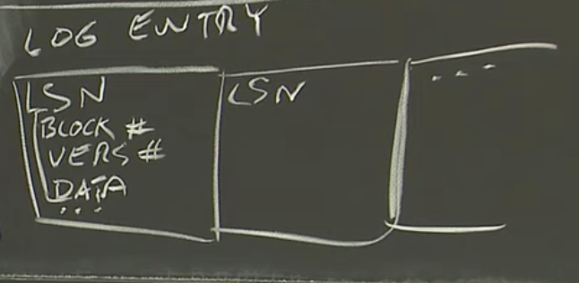

为了能够让操作尽快的完成，最初的时候，Frangipani工作站的Log只会存在工作站的内存中，并尽可能晚的写到Petal中。这是因为，向Petal写任何数据，包括Log，都需要花费较长的时间，所以我们要尽可能避免向Petal写入Log条目，就像我们要尽可能避免向Petal写入缓存数据一样。

所以，当工作站从锁服务器收到了一个Revoke消息，要自己释放某个锁，它需要执行好几个步骤。

1. 工作站需要将内存中还没有写入到Petal的Log条目写入到Petal中。
2. 再将被Revoke的Lock所保护的数据写入到Petal。
3. 向锁服务器发送Release消息。

在第二步我们向Petal写入数据的时候，如果我们在中途故障退出了，我们需要确认其他组件有足够的信息能完成我们未完成修改。先写入Log将会使我们能够达成这个目标。这些Log记录是对将要做的修改的完整记录。

当然，只有当故障发生时，事情才变得有意思。

> 学生提问：Revoke的时候会将所有的Log都写入到Petal吗？
>
> Robert教授：对于Log，你绝对是正确的，Frangipani工作站会将完整的Log写入Petal。所以，如果我们收到了一个针对特定文件Z的Revoke消息，工作站会将整个Log都写入Petal。但是因为工作站现在需要放弃对于Z的锁，它还需要向Petal写入Z相关的数据块。所以我们需要写入完整的Log，和我们需要释放的锁对应的文件内容，之后我们就可以释放锁。
>
> 或许写入完整的Log显得没那么必要，在这里可以稍作优化。如果Revoke要撤回的锁对应的文件Z只涉及第一个Log，并且工作站中的其他Log并没有修改文件Z，那么可以只向Petal写入一个Log，剩下的Log之后再写入，这样可以节省一些时间。

## 11.7 Frangipani故障恢复

当工作站需要重命名文件或者创建一个文件时，首先它会获得所有需要修改数据的锁，之后修改自身的缓存来体现改动。但是后来工作站在向Petal写入数据的过程中故障了。可能会有这几种场景：

1. 要么工作站正在向Petal写入Log，所以这个时候工作站必然还没有向Petal写入任何文件或者目录。
2. 要么工作站正在向Petal写入修改的文件，所以这个时候工作站必然已经写入了完整的Log。

当持有锁的工作站崩溃了之后，发生的第一件事情是锁服务器向工作站发送一个Revoke消息，但是锁服务器得不到任何响应，之后才会触发故障恢复Frangipani出于一些原因对锁使用了租约，当租约到期了，锁服务器会认定工作站已经崩溃了，之后它会初始化恢复过程。实际上，锁服务器会通知另一个还活着的工作站说：看，工作站1看起来崩溃了，请读取它的Log，重新执行它最近的操作并确保这些操作完成了，在你完成之后通知我。在收到这里的通知之后，锁服务器才会释放锁。这就是为什么日志存放在Petal是至关重要的，因为一个其他的工作站可能会要读取这个工作站在Petal中的日志。

发生故障的场景究竟有哪些呢？

1. 工作站WS1在向Petal写入任何信息之前就故障了。这意味着，当其他工作站WS2执行恢复，查看崩溃了的工作站的Log时，发现里面没有任何信息，自然也就不会做任何操作。之后WS2会释放WS1所持有的锁。
2. 工作站WS1向Petal写了部分Log条目。这样的话，执行恢复的工作站WS2会从Log的最开始向后扫描，直到Log的序列号不再增加，因为这必然是Log结束的位置。工作站WS2会检查Log条目的更新内容，并向Petal执行Log条目中的更新内容。当WS2执行完WS1存放在Petal中的Log，它会通知锁服务器，之后锁服务器会释放WS1持有的锁。这样的过程会使得Petal更新至故障工作站WS1在故障前的执行的部分操作。同时，**除非在Petal中找到了完整的Log条目，否则执行恢复的工作站WS2是不会执行这条Log条目的**。
3. 工作站WS1在写入Log之后，并且在写入块数据的过程中崩溃了。WS2会以相同的方式重新执行Log。尽管部分修改已经写入了Petal，WS2会重新执行修改。

下面的这个场景会更加复杂一些。假设我们有一个工作站WS1，它执行了删除文件（d/f）的操作。之后，有另一个工作站WS2，在删除文件之后，以相同的名字创建了文件，当然这是一个不同的文件。所以之后，工作站WS2创建了同名的文件（d/f）。在创建完成之后，工作站WS1崩溃了，我们需要基于WS1的Log执行恢复，这时，可能有第三个工作站WS3来执行恢复的过程。

这里的时序表明，WS1删除了一个文件，WS2创建了一个文件，WS3做了恢复操作。有可能删除操作仍然在WS1的Log中，当WS1崩溃后，WWS3删除的会是WS2稍后创建的一个完全不同的文件。

这样的结果是完全错误的，所以我们不能只是不经思考的重新执行WS1的Log，WS1的Log在我们执行的时候可能已经过时了，其他的一些工作站可能已经以其他的方式修改了相同的数据，所以我们不能盲目的重新执行Log条目。

Frangipani是这样解决这个问题的，通过对每一份存储在Petal文件系统数据增加一个**版本号**，同时将版本号与Log中描述的更新关联起来。在Petal中，每一个元数据，每一个inode，每一个目录下的内容，都有一个版本号，当工作站需要修改Petal中的元数据时，它会向从Petal中读取元数据，并查看当前的版本号，之后在创建Log条目来描述更新时，它会在Log条目中对应的版本号填入元数据已有的版本号加1。所以在恢复的过程中，WS3会选择性的根据版本号执行Log，只有Log中的版本号高于Petal中存储的数据的版本时，Log才会被执行。

这里有个比较烦人的问题就是，WS3在执行恢复，但是其他的工作站还在频繁的读取文件系统，持有了一些锁并且在向Petal写数据。WS3在执行恢复的过程中，WS2是完全不知道的。WS2可能还持有目录 d的锁，而WS3在扫描故障工作站WS1的Log时，需要读写目录d，但是目录d的锁还被WS2所持有。我们该如何解决这里的问题？

但是幸运的是，执行恢复的工作站可以直接从Petal读取数据而不用关心锁。这里的原因是，执行恢复的工作站想要重新执行Log条目，并且有可能修改与目录d关联的数据，它就是需要读取Petal中目前存放的目录数据。接下来只有两种可能，要么故障了的工作站WS1释放了锁，要么没有。如果没有的话，那么没有其他人不可以拥有目录的锁，执行恢复的工作站可以放心的读取目录数据，没有问题。如果锁被释放了，那么Petal中存储的数据版本号会足够高，表明在工作站故障之前，Log条目已经应用到了Petal。所以这里不需要关心锁的问题。

# Lecture 12 - Distributed Transaction

## 12.1 分布式事务初探

分布式事务主要有两部分组成。第一个是**并发控制**（Concurrency Control）第二个是**原子提交**（Atomic Commit）。

数据库通常对于正确性有一个概念称为ACID。分别代表：

1. Atomic，原子性。
2. Consistent，一致性。
3. Isolated，隔离性。它表明事务不能看到彼此之间的中间状态，只能看到完成的事务结果。
4. Durable，持久化的。这意味着，在数据库中的修改是持久化的，它们不会因为一些错误而被擦除。

通常来说，隔离性（Isolated）意味着可序列化（Serializable）。可序列化是指，并行的执行一些事物得到的结果，与按照某种串行的顺序来执行这些事务，可以得到相同的结果。实际的执行过程或许会有大量的并行处理，但是这里要求得到的结果与按照某种顺序一次一个事务的串行执行结果是一样的。

可序列化是一个应用广泛且实用的定义，背后的原因是，它**定义了事务执行过程的正确性**。它是一个对于程序员来说是非常简单的编程模型，作为程序员你可以写非常复杂的事务而不用担心系统同时在运行什么，或许有许多其他的事务想要在相同的时间读写相同的数据，或许会发生错误，这些你都不需要关心。可序列化特性确保你可以安全的写你的事务，就像没有其他事情发生一样。因为系统最终的结果必须表现的就像，你的事务在这种一次一个的顺序中是独占运行的。

可序列化的另一方面优势是，**只要事务不使用相同的数据，它可以允许真正的并行执行事务**。在一个分片的系统中，不同的数据在不同的机器上，你可以获得真正的并行速度提升，因为可能一个事务只会在第一个机器的第一个分片上执行，而另一个事务并行的在第二个机器上执行。

有一个场景我们需要能够应付，事务可能会因为这样或那样的原因在执行的过程中失败或者决定失败，通常这被称为Abort。对于大部分的事务系统，我们需要能够处理，例如当一个事务尝试访问一个不存在的记录，或者除以0，又或者是，某些事务的实现中使用了锁，一些事务触发了死锁，而解除死锁的唯一方式就是干掉一个或者多个参与死锁的事务，类似这样的场景。所以在事务执行的过程中，如果事务突然决定不能继续执行，这时事务可能已经修改了部分数据库记录，我们需要能够回退这些事务，并撤回任何已经做了的修改。

## 12.2 并发控制

在并发控制中，主要有两种策略。

1. **悲观并发控制**（Pessimistic Concurrency Control）。这里通常涉及到锁，在悲观系统中，如果有锁冲突，比如其他事务持有了锁，就会造成延时等待。所以这里需要为正确性而牺牲性能。
2. **乐观并发控制**（Optimistic Concurrency Control）。这里你不用担心其他的事务是否正在读写你要使用的数据，你直接继续执行你的读写操作，通常来说这些执行会在一些临时区域，只有在事务最后的时候，你再检查是不是有一些其他的事务干扰了你。如果没有这样的其他事务，那么你的事务就完成了，并且你也不需要承受锁带来的性能损耗，**因为操作锁的代价一般都比较高**；但是如果有一些其他的事务在同一时间修改了你关心的数据，并造成了冲突，那么你必须要Abort当前事务，并重试。

悲观并发控制涉及到的基本上就是锁机制。这里的锁是两阶段锁（Two-Phase Locking），这是一种最常见的锁。

对于两阶段锁来说：

1. 在使用任何数据之前，在执行任何数据的读写之前，先获取锁。
2. 事务必须持有任何已经获得的锁，直到事务提交或者Abort，你不允许在事务的中间过程释放锁。你必须要持有所有的锁，并不断的累积你持有的锁，直到你的事务完成了。

为什么两阶段锁能起作用呢？它基本上迫使事务串行执行，可以避免这两种违反可序列化特性的场景。

对于这些规则，还有一些需要知道的事情。首先是，这里非常容易产生死锁。例如我们有两个事务，T1读取记录X，之后再读取记录Y，T2读取记录Y，之后再读取记录X。如果它们同时运行，这里就是个死锁。

每个事务都获取了第一个读取数据的锁，直到事务结束了，它们都不会释放这个锁。所以接下来，它们都会等待另一个事务持有的锁，除非数据库足够聪明，这里会永远死锁。实际上，事务有各种各样的策略，包括了判断循环，超时来判断它们是不是陷入到这样一个场景中。如果是的话，数据库会Abort其中一个事务，撤回它所有的操作，并表现的像这个事务从来没有发生一样。

所以这就是使用两阶段锁的并发控制。这是一个完全标准的数据库行为，在一个单主机的数据库中是这样，在一个分布式数据库也是这样，不过会更加的有趣。

## 12.3 两阶段提交

如何构建分布式事务（Distributed Transaction）。同时在分布式事务之外，我们也要确保出现错误时，数据库仍然具有可序列化和某种程度的All-or-Nothing原子性。

一个场景是，我们或许有两个服务器，服务器S1保存了X的记录，服务器S2保存了Y的记录，它们的初始值都是10。

接下来我们要运行之前的两个事务。事务T1同时修改了X和Y，相应的我们需要向数据库发送消息说对X加1，对Y减1。但是如果我们不够小心，我们很容易就会陷入到这个场景中：我们告诉服务器S1去对X加1，

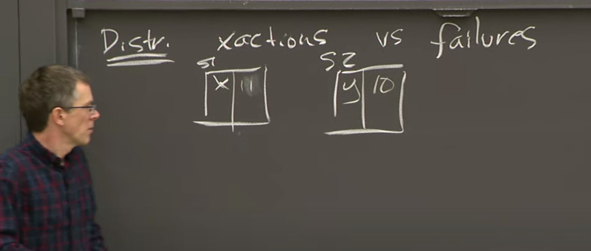

但是，之后出现了一些故障，或许持有Y记录的服务器S2故障了，使得我们没有办法完成更新的第二步。所以，这是一个问题：某个局部的故障会导致事务被分割成两半。如果我们不够小心，我们会导致一个事务中只有一半指令会生效。

甚至服务器没有崩溃都可能触发这里的场景。如果X完成了在事务中的工作，并且在服务器S2上，收到了对Y减1的请求，但是服务器S2发现Y记录并不存在。或者存在，但是账户余额等于0。这时，不能对Y减1。

不管怎样，服务器2不能完成它在事务中应该做的那部分工作。但是服务器1又完成了它在事务中的那部分工作。所以这也是一种需要处理的问题。

这里我们违反的规则是，在故障时没有保证原子性。很多时候的解决方案是**原子提交协议**（Atomic Commit Protocols）。通常来说，原子提交协议的风格是：假设你有一批计算机，每一台都执行一个大任务的不同部分，原子提交协议将会帮助计算机来决定，它是否能够执行它对应的工作，它是否执行了对应的工作，又或者，某些事情出错了，所有计算机都要同意，没有一个会执行自己的任务。

这里的挑战是，如何应对各种各样的故障，机器故障，消息缺失。同时，还要考虑性能。原子提交协议的其中一种是两阶段提交（Two-Phase Commit）。

两阶段提交不仅被分布式数据库所使用，同时也被各种看起来不像是传统数据库的分布式系统所使用。通常情况下，我们需要执行的任务会以某种方式分包在多个服务器上，每个服务器需要完成任务的不同部分。假设有一个计算机会用来管理事务，它被称为**事务协调者**（Transaction Coordinator）。事务协调者有很多种方法用来管理事务，我们这里就假设它是一个实际运行事务的计算机。在一个计算机上，事务协调者以某种形式运行事务的代码，例如Put/Get/Add，它向持有了不同数据的其他计算机发送消息，其他计算机再执行事务的不同部分。

所以，在我们的配置中，我们有一个计算机作为事务协调者（TC），然后还有服务器S1，S2，分别持有X，Y的记录。

事务协调者会向服务器S1发消息说，请对X加1，向服务器S2发消息说，请对Y减1。

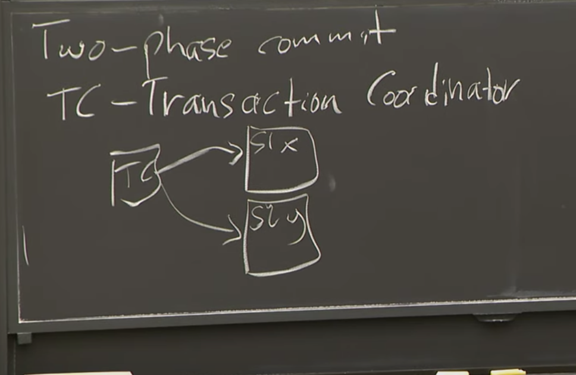

之后会有更多消息来确认，要么两个服务器都执行了操作，要么两个服务器都没有执行操作。这就是两阶段提交的实现框架。

有些事情你需要记住，在一个完整的系统中，或许会有很多不同的并发运行事务，也会有许多个事务协调者在执行它们各自的事务。在这个架构里的各个组成部分，都需要知道消息对应的是哪个事务。它们都会记录状态。每个持有数据的服务器会维护一个锁的表单，用来记录锁被哪个事务所持有。所以对于事务，需要有**事务ID**（Transaction ID），简称为TID。

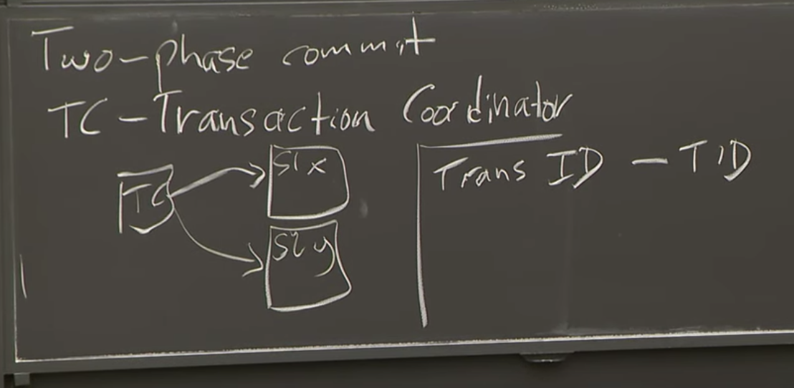

虽然不是很确定，这里假设系统中的每一个消息都被打上唯一的事务ID作为标记。这里的ID在事务开始的时候，由事务协调器来分配。这样事务协调器会发出消息说：这个消息是事务95的。同时事务协调器会在本地记录事务95的状态，对**事务的参与者**（例如服务器S1，S2）打上事务ID的标记。

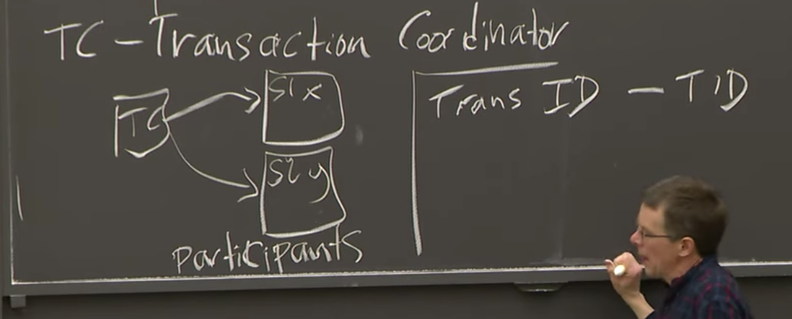

当事务协调者发出Prepare消息时，如果所有的参与者都回复Yes，那么事务可以commit。如果任何一个参与者回复了No，表明自己不能完成这个事务，或许是因为错误，或许有不一致性，或许丢失了记录，那么事务协调者不会发送commit消息，它会发送一轮Abort消息给所有的参与者说，请撤回这个事务。

在事务Commit之后，会发生两件事情。首先，事务协调者会向客户端发送代表了事务输出的内容，表明事务结束了，事务没有被Abort并且被持久化保存起来了。另一个有意思的事情是，为了遵守前面的锁规则（两阶段锁），事务参与者会释放锁（这里不论Commit还是Abort都会释放锁）。

## 12.4 故障恢复

第一个我想考虑的错误是故障重启。我的意思是类似于断电，服务器会突然中断执行，当电力恢复之后，作为事务处理系统的一部分，服务器会运行一些恢复软件。这里实际上有两个场景需要考虑。

第一个场景是B也可能在回复了Yes给事务协调者的Prepare消息之后崩溃的，这时B只需要单方面Abort。

第二个场景是，B也可能在回复了Yes给事务协调者的Prepare消息之后崩溃的。

现在B承诺可以commit，因为它回复了Yes。接下来极有可能发生的事情是，事务协调者从所有的参与者获得了Yes的回复，并将Commit消息发送给了A，所以A实际上会执行事务分包给它的那一部分，持久化存储结果，并释放锁。这样的话，为了确保All-or-Nothing原子性，我们需要确保B在故障恢复之后，仍然能完成事务分包给它的那一部分。在B故障的时候，不知道事务是否能Commit，因为它还没有收到Commit消息。但是B还是需要做好Commit的准备。这意味着，**在故障重启的时候，B不能丢失对于事务的状态记录**。

在B回复Prepare之前，它必须确保记住当前事务的中间状态，记住所有要做的修改，记住事务持有的所有的锁，这些信息必须在磁盘上持久化存储。通常来说，这些信息以Log的形式在磁盘上存储。**所以在B回复Yes给Prepare消息之前，它首先要将相应的Log写入磁盘，并在Log中记录所有有关提交事务必须的信息。这包括了所有由Put创建的新的数值，和锁的完整列表。之后，B才会回复Yes。**

之后，如果B在发送完Yes之后崩溃了，当它重启恢复时，通过查看自己的Log，它可以发现自己正在一个事务的中间，并且对一个事务的Prepare消息回复了Yes。Log里有Commit需要做的所有的修改，和事务持有的所有的锁，B就知道如何完成它在事务中的那部分工作。

最后一个可能崩溃的地方是，B可能在收到Commit之后崩溃了。

B有可能在处理完Commit之后就崩溃了。但是这样的话，B就完成了修改，并将数据持久化存储在磁盘上了。这样的话，故障重启就不需要做任何事情，因为事务已经完成了。

**因为没有收到ACK，事务协调者会再次发送Commit消**息。当B重启之后，收到了Commit消息时，它可能已经将Log中的修改写入到自己的持久化存储中、释放了锁、并删除了有关事务的Log。所以我们需要关心，如果B收到了同一个Commit消息两次，该怎么办？这里B可以记住事务的信息，但是这会消耗内存，所以实际上B会完全忘记已经在磁盘上持久化存储的事务的信息。**对于一个它不知道事务的Commit消息，B会简单的ACK这条消息**。这一点在后面的一些介绍中非常重要。

如果事务协调者故障呢？

同样的，这里的关键点在于，如果事务的任何一个参与者可能已经提交了，或者事务协调者可能已经回复给客户端了，那么我们不能忽略事务。比如，如果事务协调者已经向A发送了Commit消息，但是还没来得及向B发送Commit消息就崩溃了，那么事务协调者必须在重启的时候准备好向B重发Commit消息，以确保两个参与者都知道事务已经提交了。所以，事务协调者在哪个时间点崩溃了非常重要。

**如果事务协调者在崩溃前没有发送Commit消息，它可以直接Abort事务**。因为参与者可以在自己的Log中看到事务，但是又从来没有收到Commit消息，事务的参与者会向事务协调者查询事务，事务协调者会发现自己不认识这个事务，它必然是之前崩溃的时候Abort的事务。所以这就是事务协调者在Commit之前就崩溃了的场景。

如果事务协调者在发送完一个或者多个Commit消息之后崩溃，那么就不允许它忘记相关的事务。它必须先将事务的信息写入到自己的Log，并存放在例如磁盘的持久化存储中，这样计算故障重启了，信息还会存在。

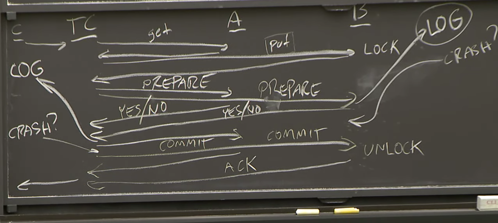

所以，**事务协调者在收到所有对于Prepare消息的Yes/No投票后，会将结果和事务ID写入存在磁盘中的Log，之后才会开始发送Commit消息**。之后，可能在发送完第一个Commit消息就崩溃了，也可能发送了所有的Commit消息才崩溃，不管在哪，当事务协调者故障重启时，恢复软件查看Log可以发现哪些事务执行了一半，哪些事务已经Commit了，哪些事务已经Abort了。作为恢复流程的一部分，对于执行了一半的事务，事务协调者会向所有的参与者重发Commit消息或者Abort消息，以防在崩溃前没有向参与者发送这些消息。这就是为什么参与者需要准备好接收重复的Commit消息的一个原因。

这些就是主要的服务器崩溃场景。我们还需要担心如果消息在网络传输的时候丢失了怎么办？或许你发送了一个消息，但是消息永远也没有送达。或许你发送了一个消息，并且在等待回复，或许回复发出来了，但是之后被丢包了。这里的任何一个消息都有可能丢包，我们必须想清楚在这样的场景下该怎么办？

举个例子，事务协调者发送了Prepare消息，但是并没有收到所有的Yes/No消息，事务协调者这时该怎么做呢？

在事务协调者没有收到Yes/No回复一段时间之后，它可以单方面的Abort事务。因为它知道它没有得到完整的Yes/No消息，当然它也不可能发送Commit消息，所以没有一个参与者会Commit事务，所以总是可以Abort事务。事务的协调者在等待完整的Yes/No消息时，如果因为消息丢包或者某个参与者崩溃了，而超时了，它可以直接决定Abort这个事务，并发送一轮Abort消息。

之后，如果一个崩溃了的参与者重启了，向事务协调者发消息说，我并没有收到来自你的有关事务95的消息，事务协调者会发现自己并不知道到事务95的存在，因为它在之前就Abort了这个事务并删除了有关这个事务的记录。这时，事务协调者会告诉参与者说，你也应该Abort这个事务。

类似的，如果参与者等待Prepare消息超时了，那意味着它必然还没有回复Yes消息，进而意味着事务协调者必然还没有发送Commit消息。所以如果一个参与者在这个位置因为等待Prepare消息而超时，

那么它也可以决定Abort事务。在之后的时间里，如果事务协调者上线了，再次发送Prepare消息，**B会说我不知道有关事务的任何事情并回复No**。这也没问题，因为这个事务在这个时间也不可能在任何地方Commit了。所以，如果网络某个地方出现了问题，或者事务协调器挂了一会，事务参与者仍然在等待Prepare消息，总是可以允许事务参与者Abort事务，并释放锁，这样其他事务才可以继续。这在一个负载高的系统中可能会非常重要。

但是，假设B收到了Prepare消息，并回复了Yes。大概在下图的位置中，

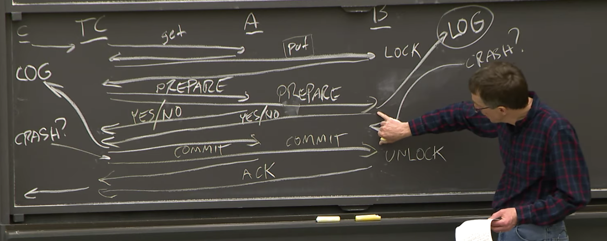

这个时候参与者没有收到Commit消息，它接下来怎么也等不到Commit消息。这段时间里，B一直持有事务涉及到数据的锁，这意味着，其他事务可能也在等待这些锁的释放。但是它能并不能单方面的决定Abort事务，在回复Yes给Prepare消息之后，并在收到Commit消息之前这个时间区间内，参与者会等待Commit消息。**如果等待Commit消息超时了，参与者不允许Abort事务，它必须无限的等待Commit消息，这里通常称为Block**。

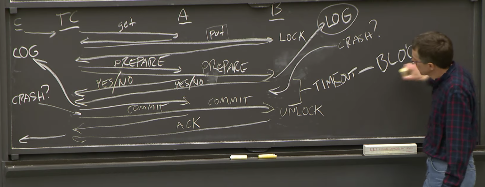

这里的原因是，因为B对Prepare消息回复了Yes，这意味着事务协调者可能收到了来自于所有参与者的Yes，并且可能已经向部分参与者发送Commit消息。这意味着A可能已经看到了Commit消息，Commit事务，持久化存储事务的结果并释放锁。所以在上面的区间里，B不能单方面的决定Abort事务，它必须无限等待事务协调者的Commit消息。如果事务协调者故障了，最终会有人来修复它，它在恢复过程中会读取Log，并重发Commit消息。

这里的Block行为是两阶段提交里非常重要的一个特性，并且它不是一个好的属性。因为它意味着，在特定的故障中，你会很容易的陷入到一个需要等待很长时间的场景中，在等待过程中，你会一直持有锁，并阻塞其他的事务。所以，**人们总是尝试在两阶段提交中，将这个区间尽可能快的完成，这样可能造成Block的时间窗口也会尽可能的小**。所以人们尽量会确保协议中这部分尽可能轻量化，甚至对于一些变种的协议，对于一些特定的场景都不用等待。

事务参与者知道所有的参与者知道了事务已经Commit或者Abort，所有参与者必然也完成了它们在事务中相应的工作，并且永远也不会需要知道事务相关的信息。所以当事务协调者得到了所有的ACK，它可以擦除所有有关事务的记忆。

类似的，当一个参与者收到了Commit或者Abort消息，完成了它们在事务中的相应工作，持久化存储事务结果并释放锁，那么在它发送完ACK之后，参与者也可以完全忘记相关的事务。

当然事务协调者或许不能收到ACK，这时它会假设丢包了并重发Commit消息。这时，如果一个参与者收到了一个Commit消息，但是它并不知道对应的事务，因为它在之前回复ACK之后就忘记了这个事务，那么参与者会再次回复一个ACK。因为如果参与者收到了一个自己不知道的事务的Commit消息，那么必然是因为它之前已经完成对这个事务的Commit或者Abort，然后选择忘记这个事务了。

## 12.5 总结

两阶段提交在大量的将数据分割在多个服务器上的分片数据库或者存储系统中都有使用。**如果你需要在事务中支持多条数据，并且你将数据分片在多台服务器之上，那么你必须支持两阶段提交**。

然而，两阶段提交有着极差的名声。其中一个原因是，因为有多轮消息的存在，它非常的慢，**各个组成部分之间着大量的交互，并且有大量的写磁盘操作**。

这里我持续的在介绍性能，但是它的确非常重要，因为在一个繁忙的事务处理系统中，存在大量的事务，许多事务都会等待相同的数据，我们希望不要在一个长时间内持有锁。但是两阶段提交迫使我们在各个阶段都做等待。

进一步的问题是，如果任何地方出错了，消息丢了，某台机器崩溃了，如果你不够幸运进入到Block区间，参与者需要在持有锁的状态下等待一段长时间。

因此，你只会在一个小的环境中看到两阶段提交，比如说在一个组织的一个机房里面。你不会在不同的银行之间转账看到它，你或许可以在银行内部的系统中看见两阶段提交，但是你永远也不会在物理分隔的不同组织之间看见两阶段提交，因为它可能会陷入到Block区间中。你不会想将你的数据库的命运寄托在其他的数据库不在错误的时间崩溃，从而使得你的数据库被迫在很长一段时间持有锁。

因为两阶段提交很慢，有很多很多的研究都是关于如何让它变得更快，比如以各种方式放松这里的规则进而使得它变得更快，又比如对于一些特定的场景做一些定制化从而避免一些消息，我们在这门课中会看到很多这种定制。

两阶段提交的架构中，本质上是有一个Leader（事务协调者），将消息发送给Follower（事务参与者），Leader只能在收到了足够多Follower的回复之后才能继续执行。这与Raft非常像，但是，这里协议的属性与Raft又非常的不一样。这两个协议解决的是完全不同的问题。

**使用Raft可以通过将数据复制到多个参与者得到高可用。Raft的意义在于，即使部分参与的服务器故障了或者不可达，系统仍然能工作**。Raft能做到这一点是因为所有的服务器都在做相同的事情，所以我们不需要所有的服务器都参与，我们只需要过半服务器参与。然而**在两阶段提交中，所有的参与者都在做不同的事情**。所有的参与者都必须完成自己那部分工作，这样事务才能结束。

然而，**是有可能结合这两种协议的**。两阶段提交对于故障来说是非常脆弱的，在故障时它可以有正确的结果，但是不具备可用性。所以，这里的问题是，是否可以构建一个合并的系统，同时具备Raft的高可用性，但同时又有两阶段提交的能力将事务分包给不同的参与者。这里的结构实际上是，通过Raft或者Paxos或者其他协议，来复制两阶段提交协议里的每一个组成部分。

所以，我们会有三个不同的集群，事务协调器会是一个复制的服务，包含了三个服务器，我们在这3个服务器上运行Raft，

其中一个服务器会被选为Leader，它们会有复制的状态，它们有Log来帮助它们复制，我们只需要等待过半服务器响应就可以执行事务协调器的指令。事务协调器还是会执行两阶段提交里面的各个步骤，并将这些步骤记录在自己的Raft集群的Log中。

每个事务参与者也同样是一个Raft集群。

最终，消息会在这些集群之间传递。

不得不承认，这里很复杂，但是它展示了你可以结合两种思想来同时获得高可用和原子提交。在Lab4，我们会构建一个类似的系统，实际上就是个分片的数据库，每个分片以这种形式进行复制，同时还有一个配置管理器，来允许将分片的数据从一个Raft集群移到另一个Raft集群。

# Lecture 13 - Spanner

Spanner提供了基于广泛数据的分布式事务，即使数据可能分片在多个服务器上，服务器位于不同的数据中心，在地球上的不同地方，你可以运行事务，它们有ACID语义以及失败的原子性，并且提供了可串行化。

读写事务时相当昂贵的，但Spanner非常努力让只读事务变得非常便宜。读写事务由两阶段提交+两阶段锁实现，这个协议的参与者都是Paxos组，只读事务可以在任何数据中心执行。

## 13.1 高层组织架构

基本想法是数据中心复制这些分片，这些位于不同数据中心的复制将组成一个Paxos组，即每个分片有一个Paxos组

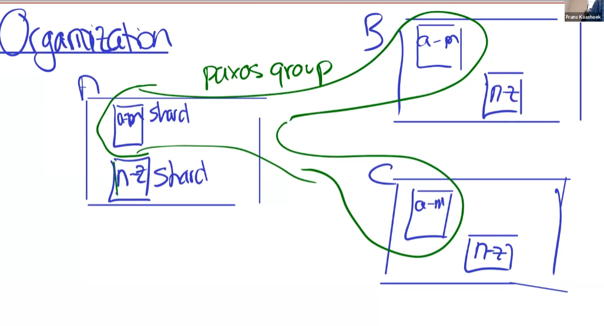

获得多个分片的原因是为了获得并行性。

Paxos实际上给我们提供了额外的好处，从a到b或从b到c可能成本非常昂贵，Paxos或者Raft运行我们**在只有多数的情况下继续**，速度太慢的机器可能不会对性能产生太大影响。

我们的目标是让Spanner客服端只访问最近的服务器。

遇到的挑战：

1. 只读服务器不需要与其他服务器通信，但是我们要确保看到最新的写入。之前的zookeeper并没有真正直接面对挑战，只是用了弱一致性，但在这个设计中，它仍能保持线性一致性。
2. Spanner想要支持跨分片的事务
3. 只读和读写事务都要串行化

## 13.2 读写事务

读写事务使用两阶段锁和两阶段提交。

客户端在某种程度上负责运行事务，使用事务manager，事务库，运行在客户端机器上。这里的客户端不是用户Web浏览器或Gmail，而是数据中心的Gmail服务器，这就是Spanner客户端

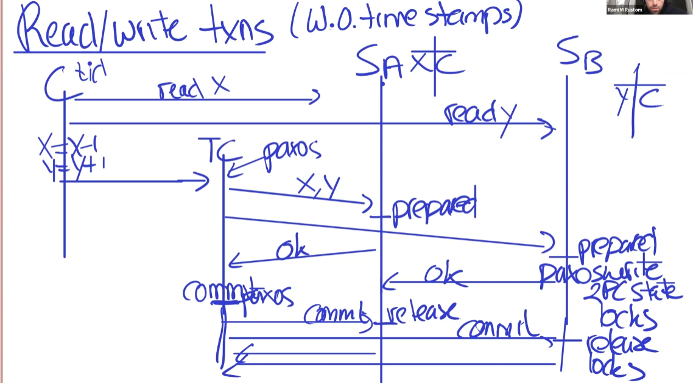

这里没有画出来的是，当我们说分片A，分片A是Paxos组的一个，所以SA是一个复制服务器，包含多个结点。在执行只读事务时，我们要访问那些节点的领导者 。锁表不是复制的，它存储在Paxos组的领导处，如果领导停机，事务必须重新开始。

> Q：每个分片是否都复制了锁表
>
> A：它不是复制锁表，他是复制准备好后持有的锁。

## 13.3 只读事务

这里实现高性能的方式是：

1. 只读本地分片
2. 没有锁
3. 没有两阶段提交

这里的挑战是如何仍然获得正确性，这里的正确性是可串行化和外部一致性（这里和线性一致性的区别是外部一致性是针对事务的，线性一致性是针对事务的，线性一致针对单纯的读写）

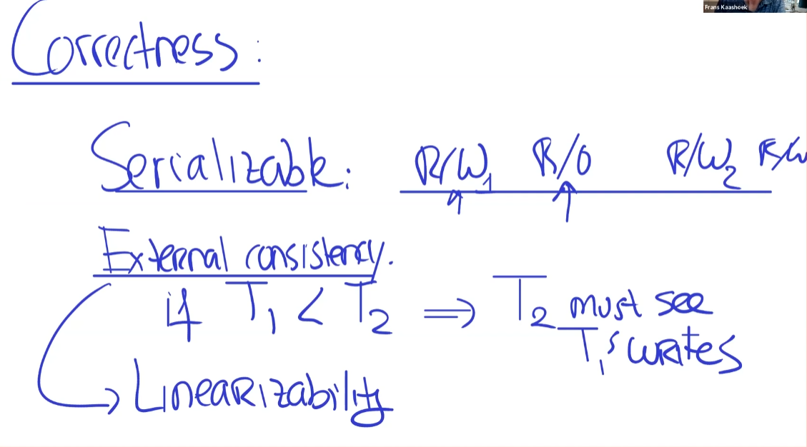

如何获得正确性：

这里有个坏的方案：总是读取最新提交的值，下面这种情况是不对的。

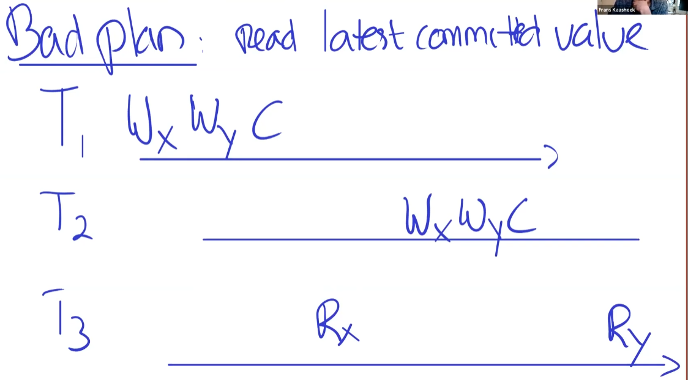

Spanner采用的方案是**快照隔离**。快照隔离中，我们**为事务分配一个时间戳**，有两个不同的点，对于读写事务在开始提交的时候，对于只读事务是在事务开始的时候。然后我们将按时间戳顺序执行所有事务，replica保存多个键的值以及它们的时间戳

那么我们如何保证不读到旧的数据？

如果Replica在时间戳10没有看到写入的x，Spanner的解决方案成为safe time。Paxos或Raft也按时间戳顺序发送所有写入，所以可以考虑总顺序是一个计数，时间戳的全局顺序足够对所有写入进行排序。对于读取还有另外一条规则，在读取时间戳15的x之前，replica必须等待时间戳大于15的写入。因此读取可能必须稍微延迟一点，直到下一次写入（还要等待已准备好但未提交的事务）。

## 13.4 时钟

不同服务器的时钟必须准确，不同的参与者必须就时间戳顺序达成一致，这对只读事务非常重要。

如果一个replica或服务器时间错误会发生什么？

1. 如果时间戳太大了会怎么样？会等待太久
2. 如果时间戳太小？这将会打破外部一致性

还有个问题，因为总是协调者为读写事务分配时间戳，所以，即使读取发生在本地，机器也可以落后

那么我们如何保持时钟同步呢？每个数据中心可能有少量或一个原子钟，这样，时间服务器常规地同时间master同步它们地本地时间。但是有微量误差（可能），为了解决这个问题，我们不使用真实的时间戳，而是使用时间间隔`[earliest,lastest]`，所以每个从当前时间返回的值，包含最早和最晚的，这样可以保证真实时间在这个时间间隔内。现在我们需要调整我们的协议

1. **开始规则**是`now.lastest`（当前时间）,这意味着，时间戳肯定在真实时间之后，对于只读事务，他被分配到事务的开始处，对于读写交易，他被分配到提交开始处，所以这一部分没有改变。
2. 提交等待规则：我们会在事务中推迟，如果事务在提交时获得某个时间戳，然后我们到达提交的末尾，延迟提交直到时间戳早于now.earliest

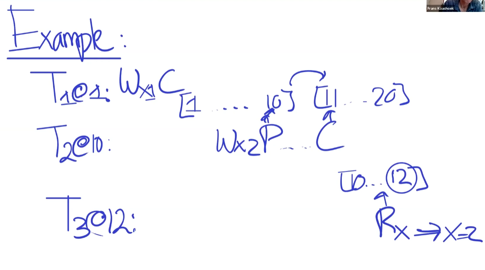

## 13.5 总结

所以读写事务是全局有序

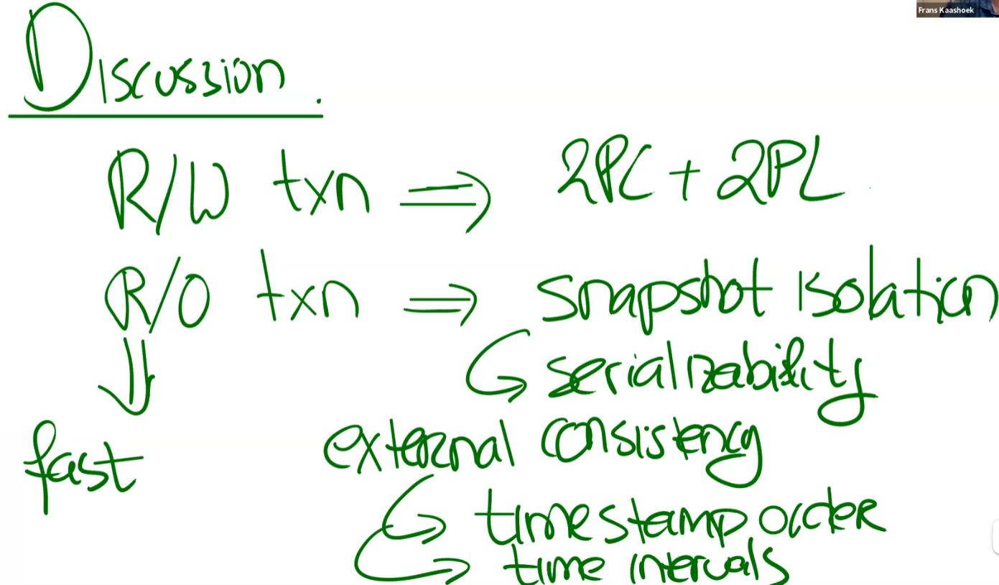

# Lecture 14 - Optimistic Concurrency Control(FaRM)

FaRM是为了获得获得高性能的事务，它和Spanner是完全不同的系统。Spanner试图在全球范围内进行同步复制，而**FaRM一切都是在一个数据中心运行**，它同样是**可串行化**的，且有和Spanner类似的**外部一致性**。FaRm使用**非易失性DRAM**，这是为了避免不得不写入稳定存储设备的瓶颈，这样消除了存储访问成本，所以现在只用解决CPU瓶颈和网络瓶颈。要实现这一点需要使用**内核旁路**的技术，这避免了操作系统和网卡交互，然后他们使用具有**DRMA特殊功能的网卡**，允许网卡从远程服务器读取内存，而不必中断远程服务器。为了实现上述设计于是采用乐观并发控制。

## 14.1 FaRM的设置

FaRM采用主备方案，因为用配置管理器跟踪区域编号到主机和备机的映射。CM与Zookeeper类似。

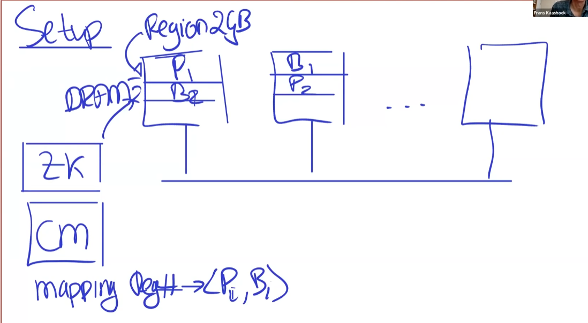

为防止数据中心出现断电，DRAM位于UPS上，每台机器都有一个不间断的电源。这样在断电后的一小段时间里，FaRM将数据存储在SSD中，包括所有区域，所有事务状态，所有事务日志。

区域中有一些对象，所以可以把区域想象成一个字节数组，对象有唯一的标识符oid（区域编号和区域内的地址），称为版本号


## 14.2 内核旁路

它所做的是对网卡的队列排序，这些队列直接**映射或进入**应用程序的地址空间，这样不需要涉及到操作系统。一种接受包的方式是在FaRm应用程序中设计一个专门读取接受队列的线程。


## 14.3 RDMA(remote direct memory access)

允许网卡直接读取内存


它们还使用RDMA进行写入，真正实现RPC。除了日志列表外，有一些消息队列用这一方法实现RPC。客户端发送方制作写RDMA包，将数据，消息写入远程消息队列，在接收方也有对应的轮询消息队列，然后通过写RDMA回应。

## 14.4 事务使用RDMA

FaRM允许实现两阶段提交和事务，同时不使用或者减少服务器端的参与。这里使用的高级策略是乐观并发控制，在去读取时是不需要锁的事务部分（因为需要锁意味着可能终端服务器）。

当读取FaRM中的一个对象时，同时要读取对象的版本号，在提交时，我们要做一个验证步骤，检查事务开始时写入的对象是否已经修i改了（检查冲突），如果版本号不同则事务终止，过段时间再重新尝试。

写入的协议总是遵循非常类似的俩阶段提交协议。


图中实线是写入RDMA，虚线是one-side RDMA。这里有个很酷的点，如果事务只做读取，可以只使用单边RDMA执行，不需要任何锁或者读取锁。在只读事务中，没有锁步骤，这也是为什么锁步骤和验证步骤是两件不同的事情

## 14.5 严格的串行化


## 14.6 容错

这里面临的关键挑战是，在通知应用程序后，会发生崩溃，因为我们已经通知应用程序事务已提交，所以我们不能丢失事务已完成的所有写入。在锁阶段之后，两个Primary P1 P2具有锁记录描述了更新，在备份步骤B1 B2有提交记录，然后在事务协调者向应用程序报告之前它必须是成功的，所以我们有足够的信息来恢复操作。

# Lecture 15 - Big Data - Spark

Spark是Hadoop得继任者，Hadoop是mapreduce的开源版本，非常擅长迭代程序。它和FaRM一样，都是针对内存计算的。

## 15.1 编程模型 - 基于RDD


其中第一行执行的是懒惰计算。Actions是导致计算发生的操作，所以所有懒惰的构建计算都发生在你运行Action的时间点。Transformations是把一个RDD变成另一个RDD（RDD是由函数式转换创建的），每个RDD都是只读或者不可变的，只能从现有的RDD生成新的RDD。

在mapreduce中运行计算结束，如果想对数据重新做一些事情，你必须要从文件系统重新读取，而persist方法使Spark可以避免必须要从磁盘重新读取数据。

## 15.2 执行


当所有阶段都完成，所有区间都产生了time，然后它就会运行count操作做加法，从每个分区获取信息，这种是**宽依赖**（因为action或transformation有依赖多个分区）。而**窄依赖**是只依赖父分区。

## 15.3 容错


如果一个worker崩溃，丢失了内存，也就丢失了分区，后面的计算部分可能依赖于这个分区，所以我们需要需要重新计算这个分区，这和mapreduce是类似的。这是窄依赖的情况。


宽依赖的情况非常棘手。一个worker失败可能导致许多分区重新计算。所以可以使用检查点或持久化RDD的稳定存储。

## 15.4 PageRank

这是一个对网页赋予权重或重要性的算法。下图是Spark中如何计算PageRank


这些links文件在所有迭代之间是共享的。

下图是PageRank的谱系图。


这里可以指定分区RDD，使用hash分区。这意味着links和ranks文件，这两个RDD以相同的方式分区，按键或者hash键分区，ranks和links的键都是U1, U2, U3，客户端为了优化，U1会在一台机器上，所以即使join是宽依赖，在这里也可以像窄依赖一样执行。

links做了持久化，同时每十次迭代就是一个检查点。这种情况下，最后的collect是唯一的宽依赖

# Lecture 16 - Cache Consistency - Memcache

memcache是一篇经验 论文。

1. 它们利用现成组件构建的系统，有令人印象深刻的性能
2. 在性能和一致性之间有一种持续的紧张关系，它们并不追求强一致性
3. 论文中有一些警示故事，添加一致性度量并不容易

## 16.1 网站的演化


当用户数量较多时，就需要买一些机器来运行前端应用程序代码。


当网站人数进一步增多就需要将服务器分片。


跨分片事务有很多风险，那么也许读取可能不重要，我们可以从数据库中卸载读取，数据库只进行写操作，那么就可以扩展，添加缓存。

在论文中整个缓存集群被称为memcache。当用户的信息想要读取的不在缓存中，它可以从存储系统中获取数据，然后把数据安装到缓存中。写数据会直接发送到存储服务器。这种带缓存层的设计非常适合重读的工作负载。

两个挑战：

1. 如何保证数据库和缓存的一致性
2. 如何避免数据库超载。如果任何缓存出现故障，负载将从前端转移到数据库。

## 16.2 一致性

事实上这里并不追求线性一致性，他们追求的是按顺序写入，写入是以某种一致的整体顺序来应用的。而在读取方面，如果读取落后也没关系。但同时也非常希望客户端观察自身的写入。


我们还需要将数据库保存在缓存中，以某种方式实现缓存一致性。Fackbook的方案是缓存失效方案。


注意这里客户端为了读取自身的写入，他会将修改写入缓存。

客户端防止数据进缓存的设计是**旁路缓存**，这给前端或应用程序增加了负担，但是它可以预处理。

**squeal**用于实现多个数据中心的异步更新。


## 16.3 Fackbook的优化

这篇论文有个两个数据中心


热键在一个服务器中，分片并没有提高性能，所以下一步是单个数据中心内复制，这就是集群的概念。


对于不受欢迎的键，他们有一个额外的区域池来保存，所以他们不会在时间上跨所有集群复制。

## 16.4 保护数据库


Gutter池就是一些很小的memcache集群，它们的使用时间很短，系统在重新配置和修复自身时使用。第一个命中Gutter池的会失败或未命中，去select数据库将结果放入Gutter池，后面的请求或获取将从Gutter池中得到答复。

Gutter池不执行删除，并且失效也不会被发送到Gutter池（这样会给Gutter池带来很大的压力）。删除消息需要两个池，原始的memcache池和Gutter池。

## 16.5 竞争


# Lecture 17 - Fork Consistency - SUNDR

## 17.1 论文背景 

去中心化系统是指没有单一的权威机构来控制系统。另外，该系统设计更具挑战性的是，当我们设计Raft或其他系统时，协议中每个参与者都遵守规则，但在Sundr就不一样，参与者可以编造新的消息，发送无序的消息欺骗其他参与者。（拜占庭式）

Sundr设置为网络文件系统。sundr中文件服务器非常简单，类似Pedal，几乎就像一个块设备，有一个中央位置，块都存储在那里，但客户端真正实现了文件系统。


重点是所谓的完整性属性，完整性只是确保系统结构是正确的，能检查到数据非法修改。


这里最简单设计是使用公钥，但是攻击者可以发送旧版本的auth文件，然后发送新版本的bank。或者也可以声明文件不存在，C也没办法检查。


## 17.2 Sundr的想法

sundr解决的就是将所有文件系统捆绑，然后做出某种决定，文件系统的最新版本是什么，这样情况下C才不会被骗。这里它的大想法是对操作的日志签名。

首先最重要的是，记录中的签名不仅覆盖当前记录，也涵盖了之前的记录。因为当客户端接收到B的日志条目时，也不会丢失A的日志条目。


为了保护客户端不会被服务器回滚，所以服务器总是检查最后一个条目。

## 17.3 为什么获取要在日志中？


这样会导致虽然C读取auth和对AB的修改是同时进行的


## 17.4 Fork一致性

对于这种情况，S无法合并这两个日志，因为这些条目保护前面的所有条目，这时签名不能通过。 


1. 带外通信。如果AB可以互相通信，至少其中一个应该时另一个的前缀，如果不这样，那么就分叉了。
2. 引入时间戳机器。每隔几秒钟将时间戳机器就会更新一次文件，客户端读取该文件，每隔几秒钟就会有一次新的更新。

## 17.5 快照，版本向量

sundr并不是字面上创建快照，文件系统按用户进行分片，每个用户都有自己的世界试图快照，确保不同的快照和不同用户是一致的。


每个版本向量都有一个i-handle，然后对于系统中每个用户，版本向量具有修改次数的计数器。完成后会有个签名。


如果C得到了vsa版本，但是A不包括bank的修改。为了检测S不会丢弃更改，跟日志所使用的方式一样。

# Lecture 18 - Peer to Peer - Bitcoin

它在一个完全开放的系统中解决了这个问题，人们可以随意加入和离开这个系统，其中有一些可能是恶意的拜占庭参与者，并在事务发生顺序上达成共识。

## 18.1 遇到的挑战


现在挑战是双倍花费的问题


从一开始在日志中包含所有交易，包括顺序。


## 18.2 共识协议


想一想更加去中心化的设计，用计算机网络取代服务器。

## 18.3 比特币的设计

基本上规则是一个节点需要完成大量的工作才能扩展日志。工作量证明的想法是核心，这样很难冒充胜利者。


这将限制你每秒钟执行交易的数量。这样可以以块为单位对组进行交易，工作量证明以块为基础，我们创建了很多区块，这就是区块链。


当获胜者到达下一个区块，做工作量证明的一方是矿工。矿工必须计算这个新数据块的哈希，为了包含n个前导零，所以矿工对nonce进行随即猜测，计算哈希并检查前导零的个数，前导零越大，那么这个块是会被接受的。

注意这里有块大小的限制，区块大小不能大于协议规定的某个预定义常量

## 18.4 Forks


当一个节点在这种情况下结束，它什么都不做，像往常一样，继续保留fork，等待那个fork扩展，节点将切换到最长的fork。

 

论文做了一些计算，可以确定的是，攻击者的计算能力较弱，弱于所有的好人。

## 18.5 矿工激励

有一些比特币保留在池中，区块中的交易是对矿工的激励，随着区块的增多，激励会减半。为了挖一个区块，每一个交易都需要支付一点费用，矿工收取区块所有的费用，并用这些费用奖励矿工。

# Lab 1: MapReduce

`lab1`要求我们能实现一个和`MapReduce`论文类似的机制，也就是单词个数`Word Count`。用于测试的文件在`src/main`目录下，以`pg-*.txt`形式命名。每个`pg-*.txt`文件都是一本电子书，非常长。我们的任务是统计出所有电子书中出现过的单词，以及它们的出现次数。

`mrsequential.go`实现的是**非分布式**的`Word Count`。这个文件的输出将作为之后测试的**标准**，分布式版本应给出和这个输出完全相同的输出。

测试时，启动一个`master`和多个`worker`，也就是运行一次`mrmaster.go`、运行多次`mrworker.go`。

`master`进程启动一个`rpc`服务器，每个`worker`进程通过`rpc`机制向`Master`要任务。任务可能包括`map`和`reduce`过程，具体如何给`worker`分配取决于`master`。

每个单词和它出现的次数以`key-value`**键值对**形式出现。`map`进程将每个出现的单词机械地分离出来，并给每一次出现标记为1次。很多单词在电子书中重复出现，也就产生了很多相同键值对，**此时产生的键值对的值都是1**。

已经分离出的单词以键值对形式分配给特定`reduce`进程，`reduce`进程个数远小于单词个数，每个`reduce`进程都处理一定量单词。相同的单词应由相同的`reduce`进程处理。最终，每个`reduce`进程都有一个输出，合并这些输出，就是`Word Count`结果。


测试流程要求，**输出的文件个数和参数`nReduce`相同**，即每个输出文件对应一个`reduce`任务，格式和`mrsequential`的输出格式相同，命名为`mr-out*`。我们的代码应保留这些文件，不做进一步合并，测试脚本将进行这一合并。合并之后的最终完整输出，必须和`mrsequential`的输出完全相同。
