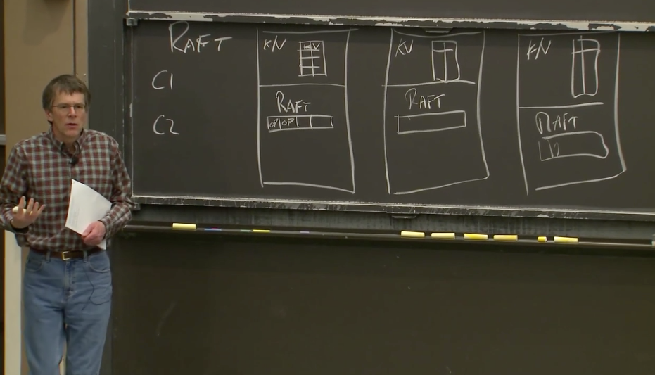

# Lecture 01 - Introduction

## 1.1 分布式系统的驱动力和挑战、分布式系统的抽象

分布式系统的核心是通过网络来协调，共同完成一致任务的一些计算机。分布式计算之所以如此重要的原因是，许多重要的基础设施都是在它之上建立的，它本质上需要多台物理隔离的计算机。

在选择使用分布式系统解决问题前，你应该要充分尝试别的思路，因为分布式系统会让问题解决变得复杂。

人们使用大量的相互协作的计算机驱动力是：

1. 人们需要获得**更高的计算性能**。大量的计算机意味着大量的并行运算，大量CPU、大量内存、以及大量磁盘在并行的运行。
2. **提供容错**（tolerate faults）。比如两台计算机运行完全相同的任务，其中一台发生故障，可以切换到另一台。
3. **一些问题天然在空间上是分布的**。例如银行转账，我们假设银行A在纽约有一台服务器，银行B在伦敦有一台服务器，这就需要一种两者之间协调的方法。所以，有一些天然的原因导致系统是物理分布的。
4. 构建分布式系统来达成一些**安全**的目标。比如有一些代码并不被信任，但是你又需要和它进行交互，这些代码不会立即表现的恶意或者出现bug，所以把系统分成多个的计算机，这样可以限制出错域。

这些分布式系统的问题（挑战）在于：

1. 系统中存在很多部分，这些部分又在并发执行，就会遇到**并发编程和各种复杂交互所带来的问题**，以及时间依赖的问题（比如同步，异步）。这让分布式系统变得很难。
2. 分布式系统有多个组成部分，再加上计算机网络，就会遇到一些意想不到的故障。如果你只有一台计算机，那么它通常要么是工作，要么是故障或者没电，总的来说，要么是在工作，要么是没有工作。而由多台计算机组成的分布式系统，可能会有一部分组件在工作，而另一部分组件停止运行，或者这些计算机都在正常运行，但是网络中断了或者不稳定。所以，**局部错误**也是分布式系统很难的原因。
3. 人们设计分布式系统的根本原因通常是为了获得更高的性能，比如说一千台计算机或者一千个磁盘臂达到的性能。但是实际上一千台机器到底有多少性能是一个棘手的问题，这里有很多难点。所以**通常需要倍加小心地设计才能让系统实际达到你期望的性能**。

## 1.3  分布式系统的抽象和实现工具

基础架构的类型主要是**存储，通信（网络）和计算。**

对于存储和计算，我们希望通过设计抽象的接口，将分布式特性隐藏在整个系统内。

人们在构建分布系统时，使用了很多的工具，例如：

1. RPC（Remote Procedure Call）。**RPC的目标就是掩盖我们正在不可靠网络上通信的事实**。
2. **线程**。这是一种编程技术，使得我们可以利用多核心计算机。更重要的是，线程提供了一种结构化的并发操作方式，这样，从程序员角度来说可以简化并发操作。
3. 因为我们会经常用到线程，**我们需要在实现的层面上，花费一定的时间来考虑并发控制，比如锁**。

## 1.4 可扩展性

**两台计算机构成的系统如果有两倍性能或者吞吐，就是可扩展性**。

这是一个很强大的特性。如果你构建了一个系统，并且只要增加计算机的数量，系统就能相应提高性能或者吞吐量，这将会是一个巨大的成果，因为计算机只需要花钱就可以买到。

当人们使用一整个机房的计算机来构建大型网站的时候，为了获取对应的性能，必须要时刻考虑可扩展性。你需要仔细设计系统，才能获得与计算机数量匹配的性能。当你只有1-2个用户时，一台计算机就可以运行web服务器和数据，或者一台计算机运行web服务器，一台计算机运行数据库。但是有可能你的网站一夜之间就火了起来，你发现可能有一亿人要登录你的网站。所以，为了提升性能，你要做的第一件事情就是购买更多的web服务器，然后把不同用户分到不同服务器上。这样，一部分用户可以去访问第一台web服务器，另一部分去访问第二台web服务器。所有的用户最终都需要看到相同的数据，所以所有的web服务器都与后端数据库通信。这样，很长一段时间你都可以通过添加web服务器来并行的提高web服务器的代码效率。

但是这种可扩展性并不是无限的。很可能在某个时间点你有了10台，20台，甚至100台web服务器，它们都在和同一个数据库通信。现在，数据库突然成为了瓶颈，并且增加更多的web服务器都无济于事了。**所以很少有可以通过无限增加计算机来获取完整的可扩展性的场景**。这时，你几乎是必然要做一些重构工作。但是只有一个数据库时，很难重构它。而虽然**可以将一个数据库拆分成多个数据库（进而提升性能）**，但是这需要大量的工作。

## 1.5 可用性

如果你只使用一台计算机构建你的系统，那么你的系统大概率是可靠的。然而如果你通过数千台计算机构建你的系统，那么即使每台计算机可以稳定运行一年，对于1000台计算机也意味着平均每天会有3台计算机故障。**大型分布式系统中有一个大问题，那就是一些很罕见的问题会被放大**。

因为错误总会发生，必须要在设计时就考虑，系统能够屏蔽错误，或者说能够在出错时继续运行。同时，因为我们需要为第三方应用开发人员提供方便的抽象接口。

**可用性即某些系统经过精心的设计，这样在特定的错误类型下，系统仍然能够正常运行，仍然可以像没有出现错误一样，为你提供完整的服务。**

除了可用性之外，另一种容错特性是**自我可恢复性**（recoverability）。这里的意思是，**如果出现了问题，服务会停止工作，不再响应请求，之后有人来修复，并且在修复之后系统仍然可以正常运行，就像没有出现过问题一样。这是一个比可用性更弱的需求**，因为在出现故障到故障组件被修复期间，系统将会完全停止工作。但是修复之后，系统又可以完全正确的重新运行，所以可恢复性是一个重要的需求。

对于一个可恢复的系统，通常需要做一些操作，例如将最新的数据存放在磁盘中，这样在供电恢复之后（假设故障就是断电），才能将这些数据取回来。甚至说对于一个具备可用性的系统，为了让系统在实际中具备应用意义，也需要具备可恢复性。因为可用的系统仅仅是在一定的故障范围内才可用，如果故障太多，可用系统也会停止工作，停止一切响应。但是当足够的故障被修复之后，系统还是需要能继续工作。所以，一个好的可用的系统，某种程度上应该也是可恢复的。当出现太多故障时，系统会停止响应，但是修复之后依然能正确运行。这是我们期望看到的。

为了实现这些特性，有很多工具。其中最重要的有两个：

1. 一个是非易失存储（non-volatile storage，类似于硬盘）
2. 对于容错的另一个重要工具是复制（replication），不过，任何一个多副本系统中，都会有一个关键的问题，比如说，我们有两台服务器，它们本来应该是有着相同的系统状态，现在的关键问题在于，这两个副本总是会意外的偏离同步的状态，而不再互为副本。

## 1.6 一致性

假设我们在构建一个分布式存储系统，只支持两种操作，其中一个是put操作会将一个value存入一个key；另一个是get操作会取出key对应的value。

一致性就是用来定义操作行为的概念。直观上来说，put就是更新这个表单，get就是从表单中获取当前表单中存储的数据。但是在一个分布式系统中，由于复制或者缓存，数据可能存在于多个副本当中，于是就有了多个不同版本的key-value对。假设服务器有两个副本，那么他们都有一个key-value表单，两个表单中key 1对应的值都是20。

实际上，对于一致性有很多不同的定义。有一些非常直观，比如说get请求可以得到最近一次完成的put请求写入的值。这种一般也被称为**强一致**（Strong Consistency）。但是，事实上，构建一个弱一致的系统也是非常有用的。**弱一致是指，不保证get请求可以得到最近一次完成的put请求写入的值**。

**人们对于弱一致感兴趣的原因是，虽然强一致可以确保get获取的是最新的数据，但是实现这一点的代价非常高。几乎可以确定的是，分布式系统的各个组件需要做大量的通信，才能实现强一致性。如果你有多个副本，那么不管get还是put都需要询问每一个副本。**所以，为了尽可能的避免通信，人们常常会使用弱一致系统，你只需要更新最近的数据副本，并且只需要从最近的副本获取数据。

##  论文阅读：*MapReduce*

### MapReduce

MapReduce 是一个在多台机器上并行计算大规模数据的软件架构。主要通过两个操作来实现：Map 和 Reduce。

**MapReduce的工作流：**

1. 将输入文件分成 M 个小文件（每个文件的大小大概 16M-64M），**在集群中启动 MapReduce 实例，其中一个 Master 和多个 Worker**；
2. 由 Master 分配任务，将 `Map` 任务分配给可用的 Worker；
3. `Map` Worker 读取文件，执行用户自定义的 map 函数，输出 key/value 对，**缓存在内存中**；
4. 内存中的 (key, value) 对通过 `partitioning function()` 例如 `hash(key) mod R` 分为 R 个 regions，然后写入磁盘。完成之后，把这些文件的地址回传给 Master，然后 Master 把这些位置传给 `Reduce` Worker；
5. `Reduce` Worker 收到数据存储位置信息后，使用 RPC 从 `Map` Worker 所在的磁盘读取这些数据，根据 key 进行排序，并将同一 key 的所有数据分组聚合在一起；
6. `Reduce` Worker 将分组后的值传给用户自定义的 reduce 函数，输出追加到所属分区的输出文件中；
7. 当所有的 Map 任务和 Reduce 任务都完成后，Master 向用户程序返回结果；

**实例**

1. 词频统计)：这里 `Map` 函数可以将每个单词统计输出 `<word, count>`，然后 `Reduce` 函数同一单词的所有计数相加，得到：`<word, total count>`
2. 分布式 Grep（一种强大的文本搜索工具，它能使用特定模式匹配（包括正则表达式）搜索文本，并默认输出匹配行）：`Map` 函数输出匹配某个模式的一行，`Reduce` 函数输出所有中间数据
3. 分布式排序：`Map` 函数从每个记录提取 key，输出 `(key,record)` 对。`Reduce` 函数不改变任何的值，直接输出。后面我们会介绍**顺序保证**。

### 容错性

1. Worker 故障：Master 周期性的 ping 每个 Worker，如果指定时间内没回应就是挂了。将这个 Worker 标记为失效，分配给这个失效 Worker 的任务将被重新分配给其他 Worker，如果Master将Reduce任务分配给Worker，Worker完成Reduce任务后，即使该Worker节点失效了，Reduce任务也不用重新分配了，因为结果已经放在global file system上了；
2. Master 故障：中止整个 MapReduce 运算，重新执行。**一般很少出现 Master 故障**。

### 性能

#### **网络带宽匮乏**

在撰写该 paper 时，网络带宽是一个相当匮乏的资源。Master 在调度 Map 任务时会考虑输入文件的位置信息，尽量将一个 Map 任务调度在包含相关输入数据拷贝的机器上执行；如果找不到，Master 将尝试在保存输入数据拷贝的附近的机器上执行 Map 任务。

需要注意的是，新的讲座视频提到，**随着后来 Google 的基础设施的扩展和升级，他们对这种存储位置优化的依赖程度降低了**。

#### **“落伍者(Stragglers)”**

影响 MapReduce 执行时间的另一个因素是“落伍者”：一台机器花了很长的时间才完成最后几个 Map 或 Reduce 任务(*例如：有台机器硬盘出了问题*)，导致总的 MapReduce 执行时间超过预期。

通过备用任务(backup tasks)来处理：当 MapReduce 操作快完成的时候，Master 调度备用任务进程来执行剩下的、处于处理中的任务。无论是最初的进程还是备用任务进程任务完成了任务，都将该任务标记为已完成。

### 其它有趣的特性

#### **Combiner函数**

在某些情况下，Map 函数产生的中间 key 值的重复数据会占很大的比重（例如词频统计，将产生成千上万的 `<the, 1>` 记录）。用户可以自定义一个可选的 `Combiner` 函数，`Combiner` 函数首先在本地将这些记录进行一次合并，然后将合并的结果再通过网络发送出去。

**Combiner 函数的代码通常和 Reduce 函数的代码相同，启动这个功能的好处是可以减少通过网络发送到 Reduce 函数的数据量。** 

**并不是所有的job都适用combiner**，只有操作满足结合律的才可设置combiner。combine操作类似于：opt(opt(1, 2, 3), opt(4, 5, 6))。如果opt为求和、求最大值的话，可以使用，但是如果是求中值的话，不适用。

#### 跳过损坏的记录

用户程序中的 bug 导致 `Map` 或者 `Reduce` 函数在处理某些记录的时候crash。通常会修复 bug 再执行 MapReduce，但是找出 bug 并修复它往往不是一件容易的事情（bug 有可能在第三方库）。

与其因为少数坏记录而导致整个执行失败，不如有一个机制可以让损坏的记录被跳过。这在某些情况下是可以接受的，例如在对一个大型数据集进行统计分析时。

Worker 可以记录处理的最后一条记录的序号发送给 Master，当 Master 看到在处理某条记录失败不止一次时，标记这条记录需要被跳过，下次执行时跳过这条记录。

#### **顺序保证**

确保在给定的 `Reduce` 分区中，中间 key/value 对是按照 key 值升序处理的。这样的顺序保证对输出的每个文件都是有序的，这样在 Reduce Worker 在读取时非常方便，例如可以对不同的文件使用归并排序。

但 paper 没说这个顺序保证在哪做的，看起来是在 Map Worker 中最后进行一次排序。

## Lab 1: MapReduce

### 任务总览和说明

`lab1`要求我们能实现一个和`MapReduce`论文类似的机制，也就是单词个数`Word Count`。用于测试的文件在`src/main`目录下，以`pg-*.txt`形式命名。每个`pg-*.txt`文件都是一本电子书，非常长。我们的任务是统计出所有电子书中出现过的单词，以及它们的出现次数。

`mrsequential.go`实现的是**非分布式**的`Word Count`。这个文件的输出将作为之后测试的**标准**，分布式版本应给出和这个输出完全相同的输出。

### 我们的任务

测试时，启动一个`master`和多个`worker`，也就是运行一次`mrmaster.go`、运行多次`mrworker.go`。

`master`进程启动一个`rpc`服务器，每个`worker`进程通过`rpc`机制向`Master`要任务。任务可能包括`map`和`reduce`过程，具体如何给`worker`分配取决于`master`。

每个单词和它出现的次数以`key-value`**键值对**形式出现。`map`进程将每个出现的单词机械地分离出来，并给每一次出现标记为1次。很多单词在电子书中重复出现，也就产生了很多相同键值对，**此时产生的键值对的值都是1**。

已经分离出的单词以键值对形式分配给特定`reduce`进程，`reduce`进程个数远小于单词个数，每个`reduce`进程都处理一定量单词。相同的单词应由相同的`reduce`进程处理。最终，每个`reduce`进程都有一个输出，合并这些输出，就是`Word Count`结果。

测试流程要求，输出的文件个数和参数`nReduce`相同，即每个输出文件对应一个`reduce`任务，格式和`mrsequential`的输出格式相同，命名为`mr-out*`。我们的代码应保留这些文件，不做进一步合并，测试脚本将进行这一合并。合并之后的最终完整输出，必须和`mrsequential`的输出完全相同。

# Lecture 03 - GFS

`GFS - The Google File System`，主要内容是大型存储。

## 3.1 GFS Master节点

假设我们有上百个客户端和一个Master节点。尽管实际中可以拿多台机器作为Master节点，但是**GFS中Master是Active-Standby模式，所以只有一个Master节点在工作**。Master节点保存了文件名和存储位置的对应关系。除此之外，还有大量的Chunk服务器，可能会有数百个，每一个Chunk服务器上都有1-2块磁盘。

在这里，**Master节点用来管理文件和Chunk的信息，而Chunk服务器用来存储实际的数据**。这是GFS设计中比较好的一面，它将这两类数据的管理问题几乎完全隔离开了，这样这两个问题可以使用独立设计来解决。Master节点知道每一个文件对应的所有的Chunk的ID，当我想读取这个文件中的任意一个部分时，我需要向Master节点查询对应的Chunk在哪个服务器上，之后我可以直接从Chunk服务器读取对应的Chunk数据。

更进一步，我们看一下GFS的一致性以及GFS是如何处理故障。为了了解这些，我们需要知道Master节点内保存的数据内容，这里我们关心的主要是两个表单：

第一个是**文件名到Chunk ID或者Chunk Handle数组的对应**。这个表单告诉你，文件对应了哪些Chunk。但是只有Chunk ID是做不了太多事情的，所以有了第二个表单。

第二个表单记录了**Chunk ID到Chunk数据的对应关系**。这里的数据又包括了：

1. 每个Chunk存储在哪些服务器上，所以这部分是Chunk服务器的列表
2. 每个Chunk当前的版本号，所以Master节点必须记住每个Chunk对应的版本号。

**所有对于Chunk的写操作都必须在主Chunk（Primary Chunk）上顺序处理，主Chunk是Chunk的多个副本之一**。Master节点必须记住哪个Chunk服务器持有主Chunk。并且，**主Chunk只能在特定的租约时间内担任主Chunk**，所以，**Master节点要记住主Chunk的租约过期时间**。

**以上数据都存储在内存中**，如果Master故障了，这些数据就都丢失了。为了能让Master重启而不丢失数据，**Master节点会同时将数据存储在磁盘上**。所以Master节点读数据只会从内存读，但是写数据的时候，**至少有一部分数据会接入到磁盘中**。更具体来说，**Master会在磁盘上存储log，每次有数据变更时，Master会在磁盘的log中追加一条记录，并生成CheckPoint（类似于备份点）**。

有些数据需要存在磁盘上，而有些不用。它们分别是：

1. Chunk Handle的数组（第一个表单）要保存在磁盘上，标记成NV（non-volatile, 非易失），这个标记表示对应的数据会写入到磁盘上。
2. Chunk服务器列表不用保存到磁盘上。因为Master节点重启之后可以与所有的Chunk服务器通信，并查询每个Chunk服务器存储了哪些Chunk，所以我认为它不用写入磁盘。所以这里标记成V（volatile），
3. 版本号要不要写入磁盘取决于GFS是如何工作的，我认为它需要写入磁盘。我们之后在讨论系统是如何工作的时候再详细讨论这个问题。这里先标记成NV。
4. 主Chunk的ID，几乎可以确定不用写入磁盘，因为Master节点重启之后会忘记谁是主Chunk，它只需要等待60秒租约到期，那么它知道对于这个Chunk来说没有主Chunk，这个时候，Master节点可以安全指定一个新的主Chunk。所以这里标记成V。
5. 类似的，租约过期时间也不用写入磁盘，所以这里标记成V。

任何时候，如果文件扩展到达了一个新的64MB，需要新增一个Chunk或者由于指定了新的主Chunk而导致版本号更新了，Master节点需要向磁盘中的Log追加一条记录说，我刚刚向这个文件添加了一个新的Chunk或者我刚刚修改了Chunk的版本号。所以每次有这样的更新，都需要写磁盘。GFS论文并没有讨论这么多细节，但是因为写磁盘的速度是有限的，写磁盘会导致Master节点的更新速度也是有限的，所以要尽可能少的写入数据到磁盘。

**这里在磁盘中维护log而不是数据库的原因是，数据库本质上来说是某种B树（b-tree）或者hash table，相比之下，追加log会非常的高效，因为你可以将最近的多个log记录一次性的写入磁盘**。因为这些数据都是向同一个地址追加，这样只需要等待磁盘的磁碟旋转一次。而对于B树来说，每一份数据都需要在磁盘中随机找个位置写入。所以使用Log可以使得磁盘写入更快一些。

当Master节点故障重启，并重建它的状态，你不会想要从log的最开始重建状态，因为log的最开始可能是几年之前，**所以Master节点会在磁盘中创建一些checkpoint点，这可能要花费几秒甚至一分钟。这样Master节点重启时，会从log中的最近一个checkpoint开始恢复，再逐条执行从Checkpoint开始的log，最后恢复自己的状态。**

## 3.2 GFS读文件

1. 应用程序想读取某个特定文件的某个特定的偏移位置上的某段特定长度的数据，比如说第1000到第2000个字节的数据。所以，应用程序将文件名，长度和起始位置发送给Master节点。
2. Master节点将Chunk Handle（也就是ID，记为H）和服务器列表发送给客户端。
3. 现在客户端可以从这些Chunk服务器中挑选一个来读取数据。**客户端会选择一个网络上最近的服务器**（Google的数据中心中，IP地址是连续的，所以可以从IP地址的差异判断网络位置的远近），并将读请求发送到那个服务器。因为客户端每次可能只读取1MB或者64KB数据，所以，客户端可能会连续多次读取同一个Chunk的不同位置。所以，**客户端会缓存Chunk和服务器的对应关系**，这样，当再次读取相同Chunk数据时，就不用一次次的去向Master请求相同的信息。

4. 接下来，客户端会与选出的Chunk服务器通信，将Chunk Handle和偏移量发送给那个Chunk服务器。Chunk服务器会在本地的硬盘上，将每个Chunk存储成独立的Linux文件，并通过普通的Linux文件系统管理。并且可以推测，Chunk文件会按照Handle（也就是ID）命名。所以，Chunk服务器需要做的就是根据文件名找到对应的Chunk文件，之后从文件中读取对应的数据段，并将数据返回给客户端。

> 学生提问：如果读取的数据超过了一个Chunk怎么办？
>
> Robert教授：我不知道详细的细节。我的印象是，如果应用程序想要读取超过64MB的数据，或者就是2个字节，但是却跨越了Chunk的边界，应用程序会通过一个库来向GFS发送RPC，而这个库会注意到这次读请求会跨越Chunk边界，因此会将一个读请求拆分成两个读请求再发送到Master节点。所以，这里可能是向Master节点发送两次读请求，得到了两个结果，之后再向两个不同的Chunk服务器读取数据。
>

## 3.3 GFS写文件

从应用程序的角度来看，写文件和读文件的接口是非常类似的，它们都是调用GFS的库。写文件是，应用程序会告诉库函数说，我想对这个文件名的文件在这个数据段写入当前存在buffer中的数据。这里只讨论对于写文件，客户端会向Master节点发送请求说：我想向这个文件名对应的文件**追加数据**，请告诉我文件中最后一个Chunk的位置。

当有多个客户端同时写同一个文件时，一个客户端并不能知道文件究竟有多长。因为如果只有一个客户端在写文件，客户端自己可以记录文件长度，而多个客户端时，一个客户端没法知道其他客户端写了多少。这个时候，客户端可以向Master节点查询哪个Chunk服务器保存了文件的最后一个Chunk。

**对于读文件来说，可以从任何最新的Chunk副本读取数据，但是对于写文件来说，必须要通过Chunk的主副本（Primary Chunk）来写入**。对于某个特定的Chunk来说，在某一个时间点，Master不一定指定了Chunk的主副本。所以，写文件的时候，需要考虑Chunk的主副本不存在的情况。

1. 找出新的Chunk副本。这是因为服务器可能宕机或者没有收到任何的更新，所以Master节点需要能够在Chunk的多个副本中识别出，哪些副本是新的，哪些是旧的。每个Chunk可能同时有多个副本，最新的副本是指，**副本中保存的版本号与Master中记录的Chunk的版本号一致**。Chunk副本中的版本号是由Master节点下发的。如果Master节点重启，并且与Chunk服务器交互，同时一个Chunk服务器重启，并上报了一个比Master记住的版本更高的版本。Master会认为它在分配新的Primary服务器时出现了错误，并且会使用这个更高的版本号来作为Chunk的最新版本号。
2. Master等所有存储了最新Chunk版本的服务器集合完成，然后挑选一个作为Primary，其他的作为Secondary。

3. Master增加版本号，并将版本号写入磁盘，这样就算故障了也不会丢失这个数据。

4. Master节点会向Primary和Secondary副本对应的服务器发送消息并告诉它们，谁是Primary，谁是Secondary，Chunk的新版本是什么。Primary和Secondary服务器都会将版本号存储在本地的磁盘中。这样，当它们因为电源故障或者其他原因重启时，它们可以向Master报告本地保存的Chunk的实际版本号。

5. 现在有了一个Primary，它可以接收来自客户端的写请求，并将写请求应用在多个Chunk服务器中。之所以要管理Chunk的版本号，是因为这样Master可以将实际更新Chunk的能力转移给Primary服务器。并且在将版本号更新到Primary和Secondary服务器之后，如果Master节点故障重启，还是可以在相同的Primary和Secondary服务器上继续更新Chunk。

6. Master节点通知Primary和Secondary服务器，你们可以修改这个Chunk。它还给Primary一个租约，这个租约告诉Primary说，在接下来的60秒中，你将是Primary，60秒之后你必须停止成为Primary。这种机制可以确保我们不会同时有两个Primary。

7. 现在Master节点告诉客户端谁是Primary，谁是Secondary，GFS提出了一种聪明的方法来实现写请求的执行序列。客户端会将要追加的数据发送给Primary和Secondary服务器，这些服务器会将数据写入到一个临时位置。所以最开始，这些数据不会追加到文件中。当所有的服务器都返回确认消息说，已经有了要追加的数据，客户端会向Primary服务器发送一条消息说，你和所有的Secondary服务器都有了要追加的数据，现在我想将这个数据追加到这个文件中。Primary服务器或许会从大量客户端收到大量的并发请求，Primary服务器会以某种顺序，一次只执行一个请求。对于每个客户端的追加数据请求（也就是写请求），Primary会查看当前文件结尾的Chunk，并确保Chunk中有足够的剩余空间，然后将客户端要追加的数据写入Chunk的末尾。并且，Primary会通知所有的Secondary服务器也将客户端要追加的数据写入在它们自己存储的Chunk末尾。这样，包括Primary在内的所有副本，都会收到通知将数据追加在Chunk的末尾。

8. 对于Secondary服务器来说，它们可能执行成功，也可能会执行失败，比如说磁盘空间不足，比如说故障了，比如说Primary发出的消息网络丢包了。如果Secondary实际真的将数据写入到了本地磁盘存储的Chunk中，它会回复“yes”给Primary。如果所有的Secondary服务器都成功将数据写入，并将“yes”回复给了Primary，并且Primary也收到了这些回复。Primary会向客户端返回写入成功。如果至少一个Secondary服务器没有回复Primary，或者回复了，但是内容却是：抱歉，一些不好的事情发生了，比如说磁盘空间不够，或者磁盘故障了，Primary会向客户端返回写入失败。
9. GFS论文说，如果客户端从Primary得到写入失败，那么客户端应该重新发起整个追加过程。客户端首先会重新与Master交互，找到文件末尾的Chunk；之后，客户端需要重新发起对于Primary和Secondary的数据追加操作。

> 学生提问：写文件失败之后Primary和Secondary服务器上的状态如何恢复？
>
> Robert教授：如果某些副本没有成功执行，Primary会回复客户端说执行失败。之后客户端会认为数据没有追加成功。但是实际上，部分副本还是成功将数据追加了。所以现在，一个Chunk的部分副本成功完成了数据追加，而另一部分没有成功，这种状态是可接受的，没有什么需要恢复，这就是GFS的工作方式。
>
> 学生提问：写文件失败之后，读Chunk数据会有什么不同？
>
> Robert教授：如果写文件失败之后，一个客户端读取相同的Chunk，客户端可能可以读到追加的数据，也可能读不到，取决于客户端读的是Chunk的哪个副本。
>
> 学生提问：客户端将数据拷贝给多个副本会不会造成瓶颈？
>
> Robert教授：这是一个好问题。考虑到底层网络，写入文件数据的具体传输路径可能会非常重要。客户端只会将数据发送给离它最近的副本，之后那个副本会将数据转发到另一个副本，以此类推形成一条链，直到所有的副本都有了数据。这样一条数据传输链可以在数据中心内减少跨交换机传输。
>
> 学生提问：如果是对一个新的文件进行追加，那这个新的文件没有副本，会怎样？
>
> Robert教授：Master会从客户端收到一个请求说，我想向这个文件追加数据。我猜，Master节点会发现，该文件没有关联的Chunk。Master节点或许会通过随机数生成器创造一个新的Chunk ID。之后，Master节点通过查看自己的Chunk表单发现，自己其实也没有Chunk ID对应的任何信息。之后，Master节点会创建一条新的Chunk记录说，我要创建一个新的版本号为1，再随机选择一个Primary和一组Secondary并告诉它们，你们将对这个空的Chunk负责，请开始工作。论文里说，每个Chunk默认会有三个副本，所以，通常来说是一个Primary和两个Secondary。

## 3.4 GFS的一致性

当我们追加数据时，面对Chunk的三个副本，当客户端发送了一个追加数据的请求，要将数据A追加到文件末尾，所有的三个副本，包括一个Primary和两个Secondary，都成功的将数据追加到了Chunk，所以Chunk中的第一个记录是A。

假设第二个客户端加入进来，想要追加数据B，但是由于网络问题发送给某个副本的消息丢失了。所以，追加数据B的消息只被两个副本收到，一个是Primary，一个是Secondary。这两个副本都在文件中追加了数据B，所以，现在我们有两个副本有数据B，另一个没有。

之后，第三个客户端想要追加数据C，并且第三个客户端记得下图中左边第一个副本是Primary。Primary选择了偏移量，并将偏移量告诉Secondary，将数据C写在Chunk的这个位置。三个副本都将数据C写在这个位置。

对于数据B来说，客户端会收到写入失败的回复，客户端会重发写入数据B的请求。所以，第二个客户端会再次请求追加数据B，或许这次数据没有在网络中丢包，并且所有的三个副本都成功追加了数据B。现在三个副本都在线，并且都有最新的版本号。

之后，如果一个客户端读文件，读到的内容取决于读取的是Chunk的哪个副本。客户端总共可以看到三条数据，但是取决于不同的副本，读取数据的顺序是不一样的。如果读取的是第一个副本，那么客户端可以读到A、B、C，然后是一个重复的B。如果读取的是第三个副本，那么客户端可以读到A，一个空白数据，然后是C、B。所以，如果读取前两个副本，B和C的顺序是先B后C，如果读的是第三个副本，B和C的顺序是先C后B。所以，不同的读请求可能得到不同的结果。

或许最坏的情况是，一些客户端写文件时，因为其中一个Secondary未能成功执行数据追加操作，客户端从Primary收到写入失败的回复。在客户端重新发送写文件请求之前，客户端就故障了。所以，你有可能进入这种情形：数据D出现在某些副本中，而其他副本则完全没有。

在GFS的这种工作方式下，如果Primary返回写入成功，那么一切都还好，如果Primary返回写入失败，就不是那么好了。Primary返回写入失败会导致不同的副本有完全不同的数据。

> 学生提问：为什么GFS要设计成多个副本不一致？
>
> Robert教授：我不明白GFS设计者为什么要这么做。GFS可以设计成多个副本是完全精确同步的，你们在lab2和lab3会设计一个系统，其中的副本是同步的。并且你们也会知道，为了保持同步，你们要使用各种各样的技术。如果你们想要让副本保持同步，其中一条规则就是你们不能允许这种只更新部分服务器的不完整操作。这意味着，你必须要有某种机制，即使客户端挂了，系统仍然会完成请求。如果这样的话，GFS中的Primary就必须确保每一个副本都得到每一条消息。
>

如果你想要将GFS升级成强一致系统，我可以为你列举一些你需要考虑的事情：

你可能需要让Primary来探测重复的请求，尝试确保B不会在文件中出现两次。

1. 对于Secondary来说，如果Primay要求Secondary执行一个操作，Secondary必须要执行而不是只返回一个错误给Primary。如果Secondary有一些永久性故障，例如磁盘被错误的拔出了，你需要有一种机制将Secondary从系统中移除，这样Primary可以与剩下的Secondary继续工作。
2. 当Primary要求Secondary追加数据时，直到Primary确信所有的Secondary都能执行数据追加之前，Secondary必须小心不要将数据暴露给读请求。所以对于写请求，你或许需要多个阶段。在第一个阶段，Primary向Secondary发请求，要求其执行某个操作，并等待Secondary回复说能否完成该操作，这时Secondary并不实际执行操作。在第二个阶段，如果所有Secondary都回复说可以执行该操作，这时Primary才会说，好的，所有Secondary执行刚刚你们回复可以执行的那个操作。这是现实世界中很多强一致系统的工作方式，这被称为**两阶段提交**（Two-phase commit）。
3. 当Primary崩溃时，可能有一组操作由Primary发送给Secondary，Primary在确认所有的Secondary收到了请求之前就崩溃了。当一个Primary崩溃了，一个Secondary会接任成为新的Primary，但是这时，新Primary和剩下的Secondary会在最后几个操作有分歧，因为部分副本并没有收到前一个Primary崩溃前发出的请求。所以，新的Primary上任时，需要显式的与Secondary进行同步，以确保操作历史的结尾是相同的。
4. 时不时的，Secondary之间可能会有差异，或者客户端从Master节点获取的是稍微过时的Secondary。系统要么需要将所有的读请求都发送给Primary，因为只有Primary知道哪些操作实际发生了，要么对于Secondary需要一个租约系统，就像Primary一样，这样就知道Secondary在哪些时间可以合法的响应客户端。

为了实现强一致，以上就是我认为的需要在系统中修复的东西，它们增加了系统的复杂度，增加了系统内部组件的交互。

最后，让我花一分钟来介绍GFS在它生涯的前5-10年在Google的出色表现，总的来说，它取得了巨大的成功，许多许多Google的应用都使用了它，许多Google的基础架构，例如BigTable和MapReduce是构建在GFS之上，所以GFS在Google内部广泛被应用。它最严重的局限可能在于，它只有一个Master节点，会带来以下问题：

1. Master节点必须为每个文件，每个Chunk维护表单，随着GFS的应用越来越多，这意味着涉及的文件也越来越多，最终Master会耗尽内存来存储文件表单。你可以增加内存，但是单台计算机的内存也是有上限的。所以，这是人们遇到的最早的问题。
2. 单个Master节点要承载数千个客户端的请求，而Master节点的CPU每秒只能处理数百个请求，尤其Master还需要将部分数据写入磁盘，很快，客户端数量超过了单个Master的能力。
3. 应用程序发现很难处理GFS奇怪的语义（本节最开始介绍的GFS的副本数据的同步，或者可以说不同步）。
4. 从我们读到的GFS论文中，Master节点的故障切换不是自动的。GFS需要人工干预来处理已经永久故障的Master节点，并更换新的服务器，这可能需要几十分钟甚至更长的而时间来处理。对于某些应用程序来说，这个时间太长了。

## 论文阅读：*The Google File System*

### 分布式存储系统的难点

**出发点是提高性能**，当单机数据量太大时，需要在多台服务器上分片(Sharding)数据；

由于多台服务器，系统可能会出现更多的故障。如果你有数千台服务器，也许每天都有机器故障，所以我们需要系统能够自动容错；

为了提高容错，需要复制(replication)数据到多台服务器上，一般 2-3 个[数据副本](https://www.zhihu.com/search?q=数据副本&search_source=Entity&hybrid_search_source=Entity&hybrid_search_extra={"sourceType"%3A"article"%2C"sourceId"%3A"354450124"})；

数据的复制会导致数据潜在的不一致；

为了提高一致性往往会导致更低的性能，**这与我们的初衷恰恰相反！**

### GFS的目标

主要设计目标：

1. 大型：大容量，需要存放大量的数据集；
2. 性能：自动分片(Auto-Sharding)；
3. 全局：不只是为一个应用而定制，适用于各种不同的应用；
4. 容错：自动容错，不希望每次服务器出了故障，都要手动去修复；

还有一些其他的特性，比如：

1. GFS 只能在一个数据中心运行，理论上可以跨机房，但更复杂；
2. 面向内部的，不开放销售；
3. 面向顺序读写大文件的工作负载(例如前面提到的 MapReduce)；

### 架构

GFS集群包括：一个master和多个chunkserver，并且若干个client会与之交互

主要架构特性：

1. **chunk**：存储在 GFS 中的文件分为多个 chunk，chunk 大小为 64M，每个 chunk 在创建时 master 会分配一个不可变、全局唯一的 64 位标识符(`chunk handle`)；**默认情况下，一个 chunk 有 3 个副本，分别在不同的 chunkserver 上**。
2. **master**：维护文件系统的 **metadata**，它知道文件被分割为哪些 chunk、以及这些 chunk 的存储位置；它还负责 chunk 的迁移、重新平衡(rebalancing)和垃圾回收；此外，master 通过HeartBeat与 chunkserver 通信，向其传递指令，并收集状态。
3. **client**：首先向 master 询问文件 metadata，然后根据 metadata 中的位置信息去对应的 chunkserver 获取数据；
4. **chunkserver**：存储 chunk，**client 和 chunkserver 不会缓存 chunk 数据，防止数据出现不一致**；

### master节点

为了简化设计，GFS 只有一个 master 进行全局管理。master 在内存中存储 3 种 metadata，如下。**标记 nv(non-volatile, 非易失) 的数据需要在写入的同时存到磁盘**，标记 v 的数据 master 会在启动后查询 chunkserver 集群：

1. namespace(即：目录层次结构)和文件名；(nv)

2. 文件名 -> `array of chunk handles` 的映射；(nv)

3. `chunk handles` -> 版本号(nv)、list of chunkservers(v)、primary(v)、租约(v)

### 读文件

1. client 将 文件名+offset 转为文件名+ `chunk index`，向 master 发起请求；
2. master 在内存中的 metadata 查询对应 chunk 所在的 `chunk handle` + `chunk locations` 并返回给 client；
3. client 将 master 返回给它的信息缓存起来，用文件名 + `chunk index` 作为 key；(**注意：client 只缓存 metadata，不缓存 chunk 数据**)
4. client 会选择网络上最近的 chunkserver 通信(Google 的数据中心中，IP 地址是连续的，所以可以从 IP 地址差异判断网络位置的远近)，并通过 `chunk handle` + `chunk locations` 来读取数据；

### 租约

如果每次写文件都请求 master，那么 master 则会成为性能瓶颈，master 找到拥有该 chunk 的 chunkserver，并给其中一个 chunkserver 授予**租约**，拥有租约的 chunkserver 称为 `Primary`，其他叫做 `Secondary`，之后：

1. master 会增加版本号，并将版本号写入磁盘，然后 master 会向 `Primary` 和`Secondary` 副本对应的服务器发送消息并告诉它们，谁是 `Primary`，谁是 `Secondary`，最新的版本号是什么；
2. 在租约有效期内，对该 chunk 的写操作都由 `Primary` 负责；
3. 租约的有效期一般为 60 秒，租约到期后 master 可以自由地授予租约；
4. master 可能会在租约到期前撤销租约(例如：重命名文件时)；
5. 在写 chunk 时，`Primary` 也可以请求延长租约有效期，直至整个写完 chunk；

### 写文件

1. client 向 master 询问 `Primary` 和 `Secondary`。如果没有 chunkserver 持有租约，master 选择一个授予租约；
2. master 返回 `Primary` 和 `Secondary` 的信息，client 缓存这些信息，只有当 `Primary` 不可达或者**租约过期**才再次联系 master；
3. client 将追加的记录发送到**每一个 chunkserver(不仅仅是** **`Primary`)**，chunkserver 先将数据写到 LRU 缓存中(不是硬盘！)；
4. 一旦 client 确认每个 chunkserver 都收到数据，client 向 `Primary` 发送写请求，`Primary` 可能会收到多个连续的写请求，会先将这些操作的顺序写入本地；
5. `Primary` 做完写请求后，将写请求和顺序转发给所有的 `Secondary`，让他们以同样的顺序写数据；
6. `Secondary` 完成后应答 `Primary`；
7. `Primary` 应答 client 成功或失败。如果出现失败，client 会重试，但在重试整个写之前，会先重复步骤 3-7；

### 一致型模型

**GFS 是宽松的一致性模型(relaxed consistency model)，可以理解是弱一致性的，它并不保证一个 chunk 的所有副本是相同的**。如果一个写失败，client 可能会重试：

1. 对于写：可能有部分副本成功，而另一部分失败，副本就会不一致。
2. 对于 `record append`：也会重试，但是不是在原来的 offset 上重试，而是在失败的记录后面重试，这样 `record append` 留下的不一致是永久的不一致，并且会让副本包含重复的数据。

`defined`：一个文件区域在经过一系列操作之后，client 可以看到数据变更写入的所有数据；

`consistent`：所有 client 不论从哪个副本中读取同一份文件，得到的结果都是相同的；

**对于 metadata**：metadata 都是由 master 来处理的，读写操作通过锁保护，可以保证一致性。

**对于文件数据**：

1. 在没有并发的情况下，写入不会互相干扰，那么则是 `defined`
2. 在并发的情况下，成功的写入是 `consistent` 但不是 `defined`
3. 顺序写和并发写 `record append` 能够保证是 `defined`，但是在 `defined` 的区域之间会夹杂着一些不一致的区域
4. **如果出现写失败，副本之间会不一致**

**如何处理这种异常情况，取决于应用程序**。

GFS 并不是强一致性的，如果这里要转变成强一致性的设计，几乎要重新设计系统，需要考虑：

1. 可能需要让 `Primary` 重复探测请求；
2. 如果 `Primary` 要求 `Secondary` 执行一个操作，`Secondary` 必须执行而不是返回一个错误
3. 在 `Primary` 确认所有的 `Secondary` 都追加成功之前，`Secondary` 不能将数据返回给读请求
4. 可能有一组操作由 `Primary` 发送给 `Secondary`，`Primary` 在确认所有的 `Secondary` 收到了请求之前就崩溃了。当 `Primary` 崩溃了，一个 `Secondary` 会接任成为新的 `Primary`

### 快照（snapshot）

GFS 通过 snapshot 来创建一个文件或者目录树的备份，它可以用于备份文件或者创建 checkpoint（用于恢复）。GFS 使用写时复制（copy-on-write)来写快照。

当 master 收到 snapshot 操作请求后：

1. 暂停所有写操作
2. master 将操作记录写入磁盘
3. master 将源文件和目录树的 metadata 进行复制，新创建的快照文件指向与源文件相同的 chunk

### 容错性

1. **快恢复**：master 和 chunkserver 都设计成在几秒钟内恢复状态和重启；
2. **chunk 副本**：如前面提到的，chunk 复制到多台机器上；
3. **master 副本**：master 也会被复制来保证可用性，称为 shadow-master；

### 数据完整性 checksum

每一个 chunkserver 都是用 `checksum` 来检查存储数据的完整性。

每个 chunk 以 64kb 的块进行划分 ，每一个块对应一个 32 位的 `checksum`，存到 chunkserver 的内存中，通过记录用户数据来持久化存储 `checksum`。对于读操作，在返回给 client 之前，chunkserver 会校验要读取块的 `checksum`。

为什么是 64Kb 呢？可能是 64Mb/64Kb 好计算吧。

### 关于论文的部分问题

#### **chunk 大小为什么是 64 MB？**

1. 较大的 chunk 减少了 client 与 master 的通信次数；
2. client 能够对一个块进行多次操作，这样可以通过与 chunkserver 保持较长时间的 TCP 连接来减少网络负载；
3. 减少了 metadata 的大小；

带来的问题：chunk 越大，可能部分文件只有 1 个 chunk，对该文件的频繁读写可能会造成热点问题。

#### **为什么是 3 个副本？**

选择这个数字是为了最大限度地降低一个块坏的概率。

#### **论文中提到了引用计数——这是什么？**

引用计数用来实现 copy-on-write 生成快照。当 GFS 创建一个快照时，它并不立即复制 chunk，而是增加 GFS 中 chunk 的引用计数，表示这个 chunk 被快照引用了，等到客户端修改这个 chunk 时，才需要在 chunkserver 中拷贝 chunk 的数据生成新的 chunk，后续的修改操作落到新生成的 chunk 上。

# Lecture 04 - VMware ET

## 4.1 复制方法：状态转移和复制状态机

**状态转移**背后的思想是，Primary将自己完整状态，比如说内存中的内容，拷贝并发送给Backup。Backup会保存收到的最近一次状态，所以Backup会有所有的数据。

**复制状态机**基于这样的事实：通常情况下，如果一台计算机没有外部影响，它只是一个接一个的执行指令，每条指令执行的是计算机中内存和寄存器上确定的函数，只有当外部事件干预时，才会发生一些预期外的事。所以，复制状态机不会在不同的副本之间发送状态，而是将发送给Primary的外部事件发送给Backup。通常来说，如果有两台计算机，如果它们从相同的状态开始，并且它们以相同的顺序，在相同的时间，看到了相同的输入，那么它们会一直互为副本，并且一直保持一致。

**所以，状态转移传输的是可能是内存，而复制状态机会将来自客户端的操作或者其他外部事件，从Primary传输到Backup。**人们倾向于使用复制状态机的原因是，通常来说，外部操作或者事件比服务的状态要小。

VMware FT论文讨论的都是复制状态机，并且只涉及了单核CPU（面对多核和并行计算，状态转移更加健壮）。

什么样的状态需要复制？VMware FT论文会复制机器的完整状态，Primary和Backup即使在最底层也是完全一样的。GFS也有复制，但是它绝对没有在Primary和Backup之间复制内存中的每一个bit，它复制的更多是应用程序级别的Chunk。VMware FT的独特之处在于，它从机器级别实现复制，因此它不关心你在机器上运行什么样的软件，它就是复制底层的寄存器和内存。所以，它的缺点是，它没有那么的高效，优点是，你可以将任何现有的软件，甚至你不需要有这些软件的源代码，你也不需要理解这些软件是如何运行的，在某些限制条件下，你就可以将这些软件运行在VMware FT的这套复制方案上。VMware FT就是那个可以让任何软件都具备容错性的魔法棒。

## 4.2 VMware FT 工作原理

首先，VMware是一个虚拟机公司，它们的业务主要是售卖虚拟机技术。虚拟机可以在同一个硬件上模拟出多个虚拟的计算机。

VMware FT需要两个物理服务器。将Primary和Backup运行在一台服务器的两个虚拟机里面毫无意义，因为容错本来就是为了能够抵御硬件故障。所以，你至少需要两个物理服务器运行VMM（虚拟机监视程序），Primary虚机在其中一个物理服务器上，Backup在另一个物理服务器上。

除此之外，在这个局域网（LAN，Local Area Network）还有一些客户端。实际上，它们不必是客户端，可以只是一些我们的多副本服务需要与之交互的其他计算机。其中一些客户端向我们的服务发送请求。

所以，基本的工作流程是：

1. 我们假设这两个副本，或者说这两个虚拟机：Primary和Backup，互为副本。某些我们服务的客户端，向Primary发送了一个请求，这个请求以网络数据包的形式发出。
2. 这个网络数据包产生一个中断，之后这个中断送到了VMM。VMM可以发现这是一个发给我们的多副本服务的一个输入，所以这里VMM会做两件事情：
3. 在虚拟机的guest操作系统中，模拟网络数据包到达的中断，以将相应的数据送给应用程序的Primary副本。除此之外，因为这是一个多副本虚拟机的输入，VMM会将网络数据包拷贝一份，并通过网络送给Backup虚机所在的VMM。
4. Backup虚机所在的VMM知道这是发送给Backup虚机的网络数据包，它也会在Backup虚机中模拟网络数据包到达的中断，以将数据发送给应用程序的Backup。所以现在，Primary和Backup都有了这个网络数据包，它们有了相同的输入，再加上许多细节，它们将会以相同的方式处理这个输入，并保持同步。
5. 当然，虚机内的服务会回复客户端的请求。在Primary虚机里面，服务会生成一个回复报文，并通过VMM在虚机内模拟的虚拟网卡发出。之后VMM可以看到这个报文，它会实际的将这个报文发送给客户端。
6. 另一方面，由于Backup虚机运行了相同顺序的指令，它也会生成一个回复报文给客户端，并将这个报文通过它的VMM模拟出来的虚拟网卡发出。但是它的VMM知道这是Backup虚机，会丢弃这里的回复报文。所以这里，Primary和Backup都看见了相同的输入，但是只有Primary虚机实际生成了回复报文给客户端。

这里有一个术语，VMware FT论文中将Primary到Backup之间同步的数据流的通道称之为Log Channel。虽然都运行在一个网络上，但是这些从Primary发往Backup的事件被称为Log Channel上的Log Event/Entry。

当Primary因为故障停止运行时，FT（Fault-Tolerance）就开始工作了。实际中，Backup每秒可以收到很多条Log，其中一个来源就是来自于Primary的定时器中断。每个Primary的定时器中断都会生成一条Log条目并发送给Backup，这些定时器中断每秒大概会有100次。所以，如果Primary虚机还在运行，Backup必然可以期望从Log Channel收到很多消息。所以当Backup不再从Primary收到消息，VMware FT论文的描述是，Backup虚机会上线（Go Alive）。Backup的VMM会在网络中做一些处理（猜测是发GARP），让后续的客户端请求发往Backup虚机，而不是Primary虚机。到此为止，Backup虚机接管了服务。

## 4.3 非确定事件

非确定性事件可以分成几类。

**客户端输入**。假设有一个来自于客户端的输入，这个输入随时可能会送达，所以它是不可预期的。我们讨论的系统专注于通过网络来进行交互，所以这里的系统输入的唯一格式就是网络数据包。一个网络数据包对于我们来说有两部分，一个是数据包中的数据，另一个是提示数据包送达了的中断。当网络数据包送达时，通常网卡的DMA（Direct Memory Access）会将网络数据包的内容拷贝到内存，之后触发一个中断。操作系统会在处理指令的过程中消费这个中断。对于Primary和Backup来说，这里的步骤必须看起来是一样的，否则它们在执行指令的时候就会出现不一致。所以，这里的问题是，中断在什么时候，具体在指令流中的哪个位置触发？对于Primary和Backup，最好要在相同的时间，相同的位置触发，否则执行过程就是不一样的，进而会导致它们的状态产生偏差。所以，我们不仅关心网络数据包的内容，还关心中断的时间。

另外，有一些指令在不同的计算机上的行为是不一样的，这一类指令称为怪异指令，比如说：

1. 随机数生成器
2. 获取当前时间的指令，在不同时间调用会得到不同的结果
3. 获取计算机的唯一ID

所有的事件都需要通过Log Channel，从Primary同步到Backup。有关日志条目的格式可能是：

1. 事件发生时的指令序号，这里的指令号是自机器启动以来指令的相对序号，而不是指令在内存中的地址。
2. 日志条目的类型，可能是普通的网络数据输入，也可能是怪异指令。
3. 最后是数据。如果是一个网络数据包，那么数据就是网络数据包的内容。如果是一个怪异指令，数据将会是这些怪异指令在Primary上执行的结果。这样Backup虚机就可以伪造指令，并提供与Primary相同的结果。

Primary和Backup两个虚机内部的guest操作系统需要在模拟的硬件里有一个定时器，能够每秒触发100次中断，这样操作系统才可以通过对这些中断进行计数来跟踪时间。因此，这里的定时器必须在Primary和Backup虚机的完全相同位置产生中断，否则这两个虚机不会以相同的顺序执行指令，进而可能会产生分歧。所以，在运行了Primary虚机的物理服务器上，有一个定时器，这个定时器会计时，生成定时器中断并发送给VMM。在适当的时候，VMM会停止Primary虚机的指令执行，并记下当前的指令序号，**然后在指令序号的位置插入伪造的模拟定时器中断**，并恢复Primary虚机的运行。之后，VMM将指令序号和定时器中断再发送给Backup虚机。虽然Backup虚机的VMM也可以从自己的物理定时器接收中断，但是它并没有将这些物理定时器中断传递给Backup虚机的guest操作系统，而是直接忽略它们。当来自于Primary虚机的Log条目到达时，Backup虚机的VMM配合特殊的CPU特性支持，会使得物理服务器在相同的指令序号处产生一个定时器中断，之后VMM获取到这个中断，并伪造一个假的定时器中断，并将其送入Backup虚机的guest操作系统，并且这个定时器中断会出现在与Primary相同的指令序号位置。

> 学生提问：如果Backup领先了Primary会怎么样？
>
> Robert教授： VMware FT是这么做的。它会维护一个来自于Primary的Log条目的等待缓冲区，如果缓冲区为空，Backup是不允许执行指令的。如果缓冲区不为空，那么它可以根据Log的信息知道Primary对应的指令序号，并且会强制Backup虚机最多执行指令到这个位置。

## 4.4 输出控制

在这个系统中，唯一的输出就是对于客户端请求的响应。客户端通过网络数据包将数据送入，服务器的回复也会以网络数据包的形式送出。Primary和Backup虚机都会生成回复报文，之后通过模拟的网卡送出，但是只有Primary虚机才会真正的将回复送出，而Backup虚机只是将回复简单的丢弃掉。

真实情况会复杂一些。假设我们正在跑一个简单的数据库服务器，这个服务器支持一个计数器自增操作，工作模式是这样，客户端发送了一个自增的请求，服务器端对计数器加1，并返回新的数值。假设最开始一切正常，在Primary和Backup中的计数器都存了10。

现在，局域网的一个客户端发送了一个自增的请求给Primary，

这个请求在Primary虚机的软件中执行，Primary会发现，现在的数据是10，我要将它变成11，并回复客户端说，现在的数值是11。

这个请求也会发送给Backup虚机，并将它的数值从10改到11。Backup也会产生一个回复，但是这个回复会被丢弃，这是我们期望发生的。

但是，你需要考虑，如果在一个不恰当的时间，出现了故障会怎样？在这个例子中，假设Primary确实生成了回复给客户端，但是之后立马崩溃了。更糟糕的是，现在网络不可靠，Primary发送给Backup的Log条目在Primary崩溃时也丢包了。那么现在的状态是，客户端收到了回复说现在的数据是11，但是Backup虚机因为没有看到客户端请求，所以它保存的数据还是10。

现在，因为察觉到Primary崩溃了，Backup接管服务。这时，客户端再次发送一个自增的请求，这个请求发送到了原来的Backup虚机，它会将自身的数值从10增加到11，并产生第二个数据是11的回复给客户端。如果客户端比较前后两次的回复，会发现一个明显不可能的场景（两次自增的结果都是11）。

论文里的解决方法就是**控制输出**（Output Rule）。直到Backup虚机确认收到了相应的Log条目，Primary虚机不允许生成任何输出。让我们回到Primary崩溃前，并且计数器的内容还是10，Primary上的正确的流程是这样的：

1. 客户端输入到达Primary。
2. Primary的VMM将输入的拷贝发送给Backup虚机的VMM。所以有关输入的Log条目在Primary虚机生成输出之前，就发往了Backup。之后，这条Log条目通过网络发往Backup，但是过程中有可能丢失。
3. Primary的VMM将输入发送给Primary虚机，Primary虚机生成了输出。现在Primary虚机的里的数据已经变成了11，生成的输出也包含了11。但是VMM不会无条件转发这个输出给客户端。
4. Primary的VMM会等到之前的Log条目都被Backup虚机确认收到了才将输出转发给客户端。所以，包含了客户端输入的Log条目，会从Primary的VMM送到Backup的VMM，Backup的VMM不用等到Backup虚机实际执行这个输入，就会发送一个表明收到了这条Log的ACK报文给Primary的VMM。当Primary的VMM收到了这个ACK，才会将Primary虚机生成的输出转发到网络中。

如果在上面的步骤2中，Log条目通过网络发送给Backup虚机时丢失了，然后Primary虚机崩溃了。因为Log条目丢失了， 所以Backup节点也不会发送ACK消息。所以，如果Log条目的丢失与Primary的崩溃同一时间发生，那么Primary必然在VMM将回复转发到网络之前就崩溃了，所以客户端也就不会收到任何回复，所以客户端就不会观察到任何异常。这就是输出控制（Output rule）。

所以，Primary会等到Backup已经有了最新的数据，才会将回复返回给客户端。**这几乎是所有的复制方案中对于性能产生伤害的地方**。这里的同步等待使得Primary不能超前Backup太多，因为如果Primary超前了并且又故障了，对应的就是Backup的状态落后于客户端的状态。

所以如果条件允许，人们会更喜欢使用在更高层级做复制的系统（GFS）。这样的复制系统可以理解操作的含义，这样的话Primary虚机就不必在每个网络数据包暂停同步一下，而是可以在一个更高层级的操作层面暂停来做同步，甚至可以对一些只读操作不做暂停。但是这就需要一些特殊的应用程序层面的复制机制。

## 4.5 重复输出

还有一种可能的情况是，回复报文已经从VMM发往客户端了，所以客户端收到了回复，但是这时Primary虚机崩溃了。而在Backup侧，客户端请求还堆积在Backup对应的VMM的Log等待缓冲区），也就是说客户端请求还没有真正发送到Backup虚机中。当Primary崩溃之后，Backup接管服务，Backup首先需要消费所有在等待缓冲区中的Log，以保持与Primay在相同的状态，这样Backup才能以与Primary相同的状态接管服务。假设最后一条Log条目对应来自客户端的请求，那么Backup会在处理完客户端请求对应的中断之后，再上线接管服务。这意味着，Backup会将自己的计数器增加到11（原来是10，处理完客户端的自增请求变成11），并生成一个输出报文。因为这时，Backup已经上线接管服务，它生成的输出报文会被它的VMM发往客户端。这样客户端会收到两个内容是11的回复。如果这里的情况真的发生了，那么明显这也是一个异常行为，因为不可能在运行在单个服务器的服务上发生这种行为。

好消息是，客户端通过TCP与服务进行交互，也就是说客户端请求和回复都通过TCP Channel收发。当Backup接管服务时，因为它的状态与Primary相同，所以它知道TCP连接的状态和TCP传输的序列号。当Backup生成回复报文时，**这个报文的TCP序列号与之前Primary生成报文的TCP序列号是一样的，这样客户端的TCP栈会发现这是一个重复的报文，它会在TCP层面丢弃这个重复的报文，用户层的软件永远也看不到这里的重复**。

这里可以认为是异常的场景，并且被意外的解决了。但是事实上，**对于任何有主从切换的复制系统，基本上不可能将系统设计成不产生重复输出**。

## 4.6 Test - and - Set服务

最后还有一个细节。我一直都假设Primary出现的是fail-stop故障，但是这不是所有的情况。一个非常常见的场景就是，Primary和Backup都在运行，**但是它们之间的网络出现了问题**，同时它们各自又能够与一些客户端通信。这时，它们都会以为对方挂了，自己需要上线并接管服务。所以现在，我们对于同一个服务，有两个机器是在线的。因为现在它们都不向彼此发送Log条目，它们自然就出现了分歧。它们或许会因为接收了不同的客户端请求，而变得不一样。

如果我们同时让Primary和Backup都在线，那么我们现在就有了**脑裂**（Split Brain）。这篇论文解决这个问题的方法是，向一个外部的第三方权威机构求证，来决定Primary还是Backup允许上线。

Test-and-Set服务不运行在Primary和Backup的物理服务器上，VMware FT需要通过网络支持Test-and-Set服务。为了能够上线，Primary和Backup或许会同时发送一个Test-and-Set请求到Test-and-Set服务器。Test-and-Set服务就是一个仲裁官，决定了两个副本中哪一个应该上线。

# Lecture 06 - Raft1

## 6.1 脑裂

在之前几个具备容错特性（fault-tolerant）的系统中它们有一个共同的特点。

1. MapReduce复制了计算，但是复制这个动作，或者说整个MapReduce被一个单主节点控制。
2. GFS以主备（primary-backup）的方式复制数据。它会实际的复制文件内容。但是它也依赖一个单主节点，来确定每一份数据的主拷贝的位置。
3. VMware FT，它在一个Primary虚机和一个Backup虚机之间复制计算相关的指令。但是，当其中一个虚机出现故障时，为了能够正确的恢复。需要一个Test-and-Set服务来确认，Primary虚机和Backup虚机只有一个能接管计算任务。

这三个例子中，它们都是一个多副本系统（replication system），它们存在一个共性：需要决定谁是Primary。使用一个单节点的好处是，它不可能否认自己，它的决策就是整体的决策。但是使用单节点的缺点是，它本身又是一个单点故障（Single Point of Failure）。

现在，我们来假设我们有一个网络，这个网络里面有两个服务器（S1，S2），这两个服务器都是我们Test-and-Set服务的拷贝。这个网络里面还有两个客户端（C1，C2），它们需要通过Test-and-Set服务确定主节点是谁。在这个例子中，这两个客户端本身就是VMware FT中的Primary和Backup虚拟机。

如果这是一个Test-and-Set服务，那么你知道这两个服务器中的数据记录将从0开始。任意一个客户端发送Test-and-Set指令，这个指令会将服务器中的状态设置成1。所以在这个图里面，两个服务器都应该设置成1，然后将旧的值0，返回给客户端。本质上来说，这是一种简化了的锁服务。

当C1可以访问S1但是不能访问S2，系统该如何响应？

一种情况是，我们必然不想让C1只与S1通信，这样会导致S2的数据不一致。所以客户端必须总是与两个服务器交互，而不是只与其中一个服务器交互。但是这是一个错误的想法，因为现在我们有两个服务器，并且两个服务器都必须一致在线，这里的难度比单个服务器更大。

另一个明显的答案是，如果一个客户端连接了两个服务器，为了达到一定的容错性，客户端只与其中一个服务器交互也应该可以正常工作。但是这样就不可避免的出现了这种情况：假设这根线缆中断了，将网络分为两个部分。

C1发送Test-and-Set请求给S1，S1将自己的状态设置为1，并返回之前的状态0给C1。这就意味着，C1会认为自己持有锁。如果这是一个VMware FT，C1对应的虚拟机会认为自己可以成为主节点。

但是同时，S2里面的状态仍然是0。所以如果现在C2也发送了一个Test-and-Set请求，本来应该发送给两个服务器，但是现在从C2看来，S1不能访问，根据之前定义的规则，那就发送给S2吧。同样的C2也会认为自己持有了锁。那么这两个VMware 虚机都会认为自己成为了主虚拟机而不需要与另一个虚拟机协商，所以这是一个错误的场景。

当时的人们在构建多副本系统时，需要排除脑裂的可能。这里有两种技术：

第一种是**构建一个不可能出现故障的网络**。

另一种就是**人工解决问题**，不要引入任何自动完成的操作。

## 6.2 过半票决

尽管存在脑裂的可能，但是随着技术的发展，人们发现哪怕网络可能出现故障，实际上是可以正确的实现能够**自动完成故障切换**的系统。当网络出现故障，将网络分割成两半，网络的两边独自运行，且不能访问对方，这通常被称为**网络分区**。

在构建能自动恢复，同时又避免脑裂的多副本系统时，关键点在于**过半票决**（Majority Vote）。这是用来构建Raft的一个基本概念。过半票决系统的第一步在于，服务器的数量要是奇数，而不是偶数。

这样**在任何时候为了完成任何操作，你必须凑够过半的服务器来批准相应的操作**。这里有一点需要明确，我们是在说所有服务器数量的一半，而不是当前开机服务器数量的一半。

对于任意两组过半服务器，至少有一个服务器是重叠的。相比其他特性，Raft更依赖这个特性来避免脑裂。例如，当一个Raft Leader竞选成功，那么这个Leader必然凑够了过半服务器的选票，而这组过半服务器中，必然与旧Leader的过半服务器有重叠。所以，新的Leader必然知道旧Leader使用的任期号（term number），因为新Leader的过半服务器必然与旧Leader的过半服务器有重叠，而旧Leader的过半服务器中的每一个必然都知道旧Leader的任期号。类似的，任何旧Leader提交的操作，必然存在于过半的Raft服务器中，而任何新Leader的过半服务器中，必然有至少一个服务器包含了旧Leader的所有操作。这是Raft能正确运行的一个重要因素。

## 6.3 Raft初探

Raft会以库（Library）的形式存在于服务中。如果你有一个基于Raft的多副本服务，那么每个服务的副本将会由两部分组成：应用程序代码和Raft库。应用程序代码接收RPC或者其他客户端请求；不同节点的Raft库之间相互合作，来维护多副本之间的操作同步。

从软件的角度来看一个Raft节点，节点上层是应用程序代码，应用程序通常都有状态，Raft层会帮助应用程序将其状态拷贝到其他副本节点。对于一个Key-Value数据库而言，对应的状态就是Key-Value Table。应用程序往下，就是Raft层。所以，Key-Value数据库需要对Raft层进行函数调用，来传递自己的状态和Raft反馈的信息。同时Raft本身也会保持状态，Raft的状态中，最重要的就是Raft记录操作的日志。

对于一个拥有三个副本的系统来说，很明显我们会有三个服务器，这三个服务器有完全一样的结构（上面是应用程序层，下面是Raft层）。除此之外，还有一些客户端，假设我们有了客户端1（C1），客户端2（C2）等等。

客户端就是一些外部程序代码，它们想要使用服务，会将请求发送给当前Raft集群中的Leader节点对应的应用程序。这里的请求就是应用程序级别的请求。

假设客户端将请求发送给Raft的Leader节点，在服务端程序的内部，应用程序只会将来自客户端的请求对应的操作向下发送到Raft层，并且告知Raft层，请把这个操作提交到多副本的日志（Log）中，并在完成时通知我。

之后，Raft节点之间相互交互，直到过半的Raft节点将这个新的操作加入到它们的日志中，也就是说这个操作被过半的Raft节点复制了。

当且仅当Raft的Leader节点知道了过半节点的副本都有了这个操作的拷贝之后。Raft的Leader节点中的Raft层，会向上发送一个通知到应用程序，也就是Key-Value数据库。

## 6.4 Log同步时序

接下来我将画一个时序图来描述Raft内部的消息是如何工作的。假设我们有一个客户端，服务器1是当前Raft集群的Leader。同时，我们还有服务器2，服务器3。这张图的纵坐标是时间，越往下时间越长。

1. 假设客户端将请求发送给服务器1，这里的客户端请求就是一个简单的请求，例如一个Put请求。
2. 之后，服务器1的Raft层会发送一个添加日志（AppendEntries）的RPC到其他两个副本（S2，S3）。现在服务器1会一直等待其他副本节点的响应，一直等到过半节点的响应返回。这里的过半节点包括Leader自己。所以在一个只有3个副本节点的系统中，Leader只需要等待一个其他副本节点。
3. 当Leader收到了过半服务器的正确响应，Leader会执行（来自客户端的）请求，得到结果，并将结果返回给客户端。
4. 与此同时，服务器3可能也会将它的响应返回给Leader，尽管这个响应是有用的，但是这里不需要等待这个响应。这一点对于理解Raft论文中的图2是有用的。
5. 现在Leader知道过半服务器已经添加了Log，可以执行客户端请求，并返回给客户端。但是服务器2还不知道这一点，服务器2只知道：我从Leader那收到了这个请求，但是我不知道这个请求是不是已经被Leader提交（committed）了，这取决于我的响应是否被Leader收到。服务器2只知道，它的响应提交给了网络，或许Leader没有收到这个响应，也就不会决定commit这个请求。所以这里还有一个阶段。一旦Leader发现请求被commit之后，它需要将这个消息通知给其他的副本。所以这里有一个额外的消息。
6. 这条消息的具体内容依赖于整个系统的状态。至少在Raft中，没有明确的committed消息。相应的，committed消息被夹带在下一个AppendEntries消息中，由Leader下一次的AppendEntries对应的RPC发出。任何情况下，当有了committed消息时，这条消息会填在AppendEntries的RPC中。下一次Leader需要发送HeartBeat，或者是收到了一个新的客户端请求，要将这个请求同步给其他副本时，Leader会将新的更大的commit号随着AppendEntries消息发出，当其他副本收到了这个消息，就知道之前的commit号已经被Leader提交，其他副本接下来也会执行相应的请求，更新本地的状态。

## 6.5 日志

Raft系统之所以对Log关注这么多的一个原因是，**Log是Leader用来对操作排序的一种手段**。对于复制状态机来说，所有副本不仅要执行相同的操作，还需要用相同的顺序执行这些操作。而Log与其他很多事物，共同构成了Leader对接收到的客户端操作分配顺序的机制。比如说，我有10个客户端同时向Leader发出请求，Leader必须对这些请求确定一个顺序，并确保所有其他的副本都遵从这个顺序。实际上，Log是一些按照数字编号的槽位（类似一个数组），槽位的数字表示了Leader选择的顺序。

Log的另一个用途是，在一个（非Leader，也就是Follower）副本收到了操作，但是还没有执行操作时。该副本需要将这个操作存放在某处，直到收到了Leader发送的新的commit号才执行。所以，对于Raft的Follower来说，**Log是用来存放临时操作的地方**。Follower收到了这些临时的操作，但是还不确定这些操作是否被commit了，**这些操作可能会被丢弃**。

Log的另一个用途是用在Leader节点，Leader需要在它的Log中记录操作，**如果一些Follower由于网络原因或者其他原因短时间离线了或者丢了一些消息，Leader需要能够向Follower重传丢失的Log消息**。所以，Leader也需要一个地方来存放客户端请求的拷贝。即使对那些已经commit的请求，为了能够向丢失了相应操作的副本重传，也需要存储在Leader的Log中。

所有节点都需要保存Log还有一个原因，**就是它可以帮助重启的服务器恢复状态**。

> 学生提问：假设Leader每秒可以执行1000条操作，Follower只能每秒执行100条操作，并且这个状态一直持续下去，会怎样？
>
> Robert（教授）：这里有一点需要注意，Follower在实际执行操作前会确认操作。所以，它们会确认，并将操作堆积在Log中。而Log又是无限的，所以Follower或许可以每秒确认1000个操作。如果Follower一直这么做，它会生成无限大的Log，因为Follower的执行最终将无限落后于Log的堆积。 所以，当Follower堆积了10亿（不是具体的数字，指很多很多）Log未执行，最终这里会耗尽内存。之后Follower调用内存分配器为Log申请新的内存时，内存申请会失败。Raft并没有流控机制来处理这种情况。
>
> 所以我认为，在一个实际的系统中，你需要一个额外的消息，这个额外的消息可以夹带在其他消息中，也不必是实时的，但是你或许需要一些通信来（让Follower）告诉Leader，Follower目前执行到了哪一步。这样Leader就能知道自己在操作执行上领先太多。所以是的，我认为在一个生产环境中，如果你想使用系统的极限性能，你还是需要一条额外的消息来调节Leader的速度。

## 6.6 应用层接口

在Raft集群中，每一个副本上，这两层之间主要有两个接口。

第一个接口是key-value层用来转发客户端请求的接口。如果客户端发送一个请求给key-value层，key-value层会将这个请求转发给Raft层，并说：请将这个请求存放在Log中的某处。这个接口实际上是个函数调用，称之为Start函数。这个函数只接收一个参数，就是客户端请求。key-value层说：我接到了这个请求，请把它存在Log中，并在committed之后告诉我。

另一个接口是，随着时间的推移，Raft层会通知key-value层：哈，你刚刚在Start函数中传给我的请求已经commit了。Raft层通知的，不一定是最近一次Start函数传入的请求。这个向上的接口以go channel中的一条消息的形式存在。Raft层会发出这个消息，key-value层要读取这个消息。所以这里有个叫做applyCh的channel，通过它你可以发送ApplyMsg消息。

当然，key-value层需要知道从applyCh中读取的消息，对应之前调用的哪个Start函数，所以Start函数的返回需要有足够的信息给key-value层，这样才能完成对应。Start函数的返回值包括，这个请求将会存放在Log中的位置（index）。这个请求不一定能commit成功，但是如果commit成功的话，会存放在这个Log位置。同时，它还会返回当前的任期号（term number）和一些其它我们现在还不太关心的内容。在ApplyMsg中，将会包含请求（command）和对应的Log位置（index）。

所有的副本都会收到这个ApplyMsg消息，它们都知道自己应该执行这个请求，弄清楚这个请求的具体含义，并将它应用在本地的状态中。所有的副本节点还会拿到Log的位置信息（index），但是这个位置信息只在Leader有用，因为Leader需要知道ApplyMsg中的请求究竟对应哪个客户端请求（进而响应客户端请求）。

对于Log来说有一件有意思的事情：不同副本的Log或许不完全一样。有很多场合都会不一样，至少不同副本节点的Log的末尾，会短暂的不同。不过对于Raft来说，Raft会最终强制不同副本的Log保持一致。或许会有短暂的不一致，但是长期来看，所有副本的Log会被Leader修改，直到Leader确认它们都是一致的。

## 6.7 Leader选举

为什么Raft系统会有个Leader，为什么我们需要一个Leader？

实际上你可以不用Leader就构建一个类似的系统，仅仅通过一组服务器来共同认可Log的顺序，进而构建一个一致系统。

有很多原因导致了Raft系统有一个Leader，其中一个最主要的是：通常情况下，如果服务器不出现故障，**有一个Leader的存在，会使得整个系统更加高效**。因为有了一个大家都知道的指定的Leader，对于一个请求，你可以只通过一轮消息就获得过半服务器的认可。对于一个无Leader的系统，通常需要一轮消息来确认一个临时的Leader，之后第二轮消息才能确认请求。所以，**使用一个Leader可以提升系统性能至2倍**。同时，有一个Leader可以更好的理解Raft系统是如何工作的。

Raft生命周期中可能会有不同的Leader，它使用任期号（term number）来区分不同的Leader。Followers（非Leader副本节点）不需要知道Leader的ID，它们只需要知道当前的任期号。每一个任期最多有一个Leader，这是一个很关键的特性。

每个Raft节点都有一个选举定时器（Election Timer），如果在这个定时器时间耗尽之前，当前节点没有收到任何当前Leader的消息，这个节点会认为Leader已经下线，并开始一次选举。

开始一次选举的意思是，当前服务器会增加任期号（term number），因为它想成为一个新的Leader。之后，当前服务器会发出请求投票（RequestVote）RPC，这个消息会发给所有的Raft节点。其实只需要发送到N-1个节点，因为Raft规定了，Leader的候选人总是会在选举时投票给自己。

这里需要注意的一点是，**并不是Leader没有故障，就不会有选举**。但是如果Leader的确出现了故障，那么一定会有新的选举。这个选举的前提是其他服务器还在运行，因为选举需要其他服务器的选举定时器超时了才会触发。另一方面，如果Leader没有故障，我们仍然有可能会有一次新的选举。尽管Leader还在健康运行，我们可能会有某个选举定时器超时了，进而开启一次新的选举。

假设网线故障了，旧的Leader在一个网络分区中，这个网络分区中有一些客户端和少数（未过半）的服务器。在网络的另一个分区中，有着过半的服务器，这些服务器选出了一个新的Leader。如果旧Leader在一个网络分区中，并且这个网络分区没有过半的服务器。那么下次客户端发送请求时，这个在少数分区的Leader，它会发出AppendEntries消息。但是因为它在少数分区，凑不齐过半服务器，所以它永远不会commit这个客户端请求，也不会告诉客户端它已经执行了这个请求。

> 学生提问：有没有可能出现极端的情况，导致单向的网络出现故障，进而使得Raft系统不能工作？
>
> Robert教授：我认为是有可能的。例如，如果当前Leader的网络单边出现故障，Leader可以发出HeartBeat，但是又不能收到任何客户端请求。它发出的HeartBeat被送达了，因为它的出方向网络是正常的，那么它的HeartBeat会抑制其他服务器开始一次新的选举。但是它的入方向网络是故障的，这会阻止它接收或者执行任何客户端请求。这个场景是Raft并没有考虑的众多极端的网络故障场景之一。
>
> 我认为这个问题是可修复的。我们可以通过一个双向的HeartBeat来解决这里的问题。在这个双向的HeartBeat中，Leader发出HeartBeat，但是这时Followers需要以某种形式响应这个HeartBeat。如果Leader一段时间没有收到自己发出HeartBeat的响应，Leader会决定卸任，这样我认为可以解决这个特定的问题和一些其他的问题。
>
> 你是对的，网络中可能发生非常奇怪的事情，而Raft协议没有考虑到这些场景。

所以，我们这里有Leader选举，我们需要确保每个任期最多只有一个Leader。Raft是如何做到这一点的呢？

为了能够当选，Raft要求一个候选人从过半服务器中获得认可投票。每个Raft节点，只会在一个任期内投出一个认可选票。这意味着，在任意一个任期内，每一个节点只会对一个候选人投一次票。这样，就不可能有两个候选人同时获得过半的选票，因为每个节点只会投票一次。所以这里是过半原则导致了最多只能有一个胜出的候选人，这样我们在每个任期会有最多一个选举出的候选人。

当一个服务器赢得了一次选举，这个服务器会收到过半的认可投票，这个服务器会直接知道自己是新的Leader，然后通过HeartBeat通知其他服务器。Raft规定，除非是当前任期的Leader，没人可以发出AppendEntries消息。所以，其他服务器通过接收特定任期号的AppendEntries来知道，选举成功了。

## 6.8 选举定时器

**任何一条AppendEntries消息都会重置所有Raft节点的选举定时器**。所以只要所有环节都在正常工作，不断重复的HeartBeat会阻止任何新的选举发生。当然，如果网络故障或者发生了丢包，不可避免的还是会有新的选举。

如果一次选举选出了0个Leader，这次选举就失败了，这时什么事也不会发生。

一个导致选举失败的更有趣的场景是，当所有环节都在正常工作，没有故障，没有丢包，但是候选人们几乎是同时参加竞选，它们分割了选票（Split Vote）。假设我们有一个3节点的多副本系统，3个节点的选举定时器几乎同超时，进而期触发选举。3个节点中的每个节点都只能收到一张投票（来自于自己）。没有一个节点获得了过半投票，所以也就没有人能被选上。接下来它们的选举定时器会重新计时，因为选举定时器只会在收到了AppendEntries消息时重置，但是由于没有Leader，所有也就没有AppendEntries消息。所有的选举定时器重新开始计时，如果我们不够幸运的话，所有的定时器又会在同一时间到期，所有节点又会投票给自己，又没有人获得了过半投票，这个状态可能会一直持续下去。

Raft不能完全避免分割选票（Split Vote），但是可以通过为选举定时器随机选择超时时间来尽可能避免这一情况。

一个明显的要求是，**选举定时器的超时时间需要至少大于Leader的HeartBeat间隔**。**实际上由于网络可能丢包，这里你或许希望将下限设置为多个HeartBeat间隔**。

那超时时间的上限呢？

首先，这里的**最大超时时间影响了系统能多快从故障中恢复**。因为从旧的Leader故障开始，到新的选举开始这段时间，整个系统是瘫痪了。尽管还有一些其他服务器在运行，但是因为没有Leader，客户端请求会被丢弃。如果故障很频繁，那么我们或许就该关心恢复时间有多长。

另一个需要考虑的点是，不同节点的选举定时器的超时时间差（S2和S3之间）必须要足够长，使得第一个开始选举的节点能够完成一轮选举。这里至少需要大于发送一条RPC所需要的往返（Round-Trip）时间。

或许需要10毫秒来发送一条RPC，并从其他所有服务器获得响应。如果这样的话，我们需要设置超时时间的上限到足够大，从而使得两个随机数之间的时间差极有可能大于10毫秒。

**在Lab2中，如果你的代码不能在几秒内从一个Leader故障的场景中恢复的话，测试代码会报错。所以这种场景下，你们需要调小选举定时器超时时间的上限。这样的话，你才可能在几秒内完成一次Leader选举。这并不是一个很严格的限制。**

**每一次一个节点重置自己的选举定时器时，都需要重新选择一个随机的超时时间。**

## 6.9 可能的异常情况

一个旧Leader在各种奇怪的场景下故障之后，为了恢复系统的一致性，一个新任的Leader如何能整理在不同副本上可能已经不一致的Log？

这个话题只在Leader故障之后才有意义。例如，旧的Leader在发送消息的过程中故障了，或者新Leader在刚刚当选之后，还没来得及做任何操作就故障了。

这里有个例子，假设我们有3个服务器（S1，S2，S3），我将写出每个服务器的Log，每一列对齐之后就是Log的一个槽位。我这里写的值是Log条目对应的任期号，而不是Log记录的客户端请求。所有节点在任期3的时候记录了一个请求在槽位1，S2和S3在任期3的时候记录了一个请求在槽位2。在槽位2，S1没有任何记录。 

这种情况是可能发生的。假设S3是任期3的Leader，它收到了一个客户端请求，之后发送给其他服务器。其他服务器收到了相应的AppendEntries消息，并添加Log到本地，这是槽位1的情况。之后，S3从客户端收到了第二个请求，它还是需要将这个请求发送给其他服务器。但是这里有三种情况：

1. 发送给S1的消息丢了
2. S1当时已经关机了
3. S3在向S2发送完AppendEntries之后，在向S1发送AppendEntries之前故障了

现在，只有S2和S3有槽位2的Log。

如果现任Leader S3故障了，首先我们需要新的选举，之后某个节点会被选为新的Leader。接下来会发生两件事情：

1. 新的Leader需要认识到，槽位2的请求可能已经commit了，从而不能丢弃。
2. 新的Leader需要确保S1在槽位2记录与其他节点完全一样的请求。

这里还有另外一个例子需要考虑。还是3个服务器，这里有槽位10、11、12、13。槽位10和槽位11类似于前一个例子。在槽位12，S2有一个任期4的请求，而S3有一个任期5的请求。这种场景可能发生吗？

这种场景是可能发生的。我们假设S2在槽位12时，是任期4的新Leader，它收到了来自客户端的请求，将这个请求加到了自己的Log中，然后就故障了。

因为Leader故障了，我们需要一次新的选举。我们来看哪个服务器可以被选为新的Leader。这里S3可能被选上，因为它只需要从过半服务器获得认可投票，而在这个场景下，过半服务器就是S1和S3。所以S3可能被选为任期5的新Leader，之后收到了来自客户端的请求，将这个请求加到自己的Log中，然后故障了。之后就到了例子中的场景了。

因为可能发生，Raft必须能够处理这种场景。我们知道在槽位10的Log，3个副本都有记录，它**可能**已经commit了，所以我们不能丢弃它。类似的在槽位11的Log，因为它被过半服务器记录了，它也可能commit了，所以我们也不能丢弃它。在槽位12记录的两个Log（分别是任期4和任期5），都没有被commit，所以Raft可以丢弃它们。这**里没有要求必须都丢弃它们，但是至少需要丢弃一个Log，因为最终你还是要保持多个副本之间的Log一致。**

# Lecture 07 - Raft2

## 7.1 日志恢复

假设S3在任期6被选为Leader。在某个时刻，新Leader S3会发送任期6的第一个AppendEntries RPC，来传输任期6的第一个Log。

这里的AppendEntries消息实际上有两条，因为要发给两个Followers。它们包含了客户端发送给Leader的请求。我们现在想将这个请求复制到所有的Followers上。**这里的AppendEntries RPC还包含了prevLogIndex字段和prevLogTerm字段**。所以Leader在发送AppendEntries消息时，会附带前一个槽位的信息。在我们的场景中，prevLogIndex是前一个槽位的位置，也就是12；prevLogTerm是S3上前一个槽位的任期号，也就是5。

Followers在收到AppendEntries消息时，可以知道它们收到了一个带有若干Log条目的消息，并且是从槽位13开始。**Followers在写入Log之前，会检查本地的前一个Log条目，是否与Leader发来的有关前一条Log的信息匹配。**

所以对于S2 它显然是不匹配的。S2 在槽位12已经有一个条目，但是它来自任期4，而不是任期5。所以S2将拒绝这个AppendEntries，并返回False给Leader。S1在槽位12还没有任何Log，所以S1也将拒绝Leader的这个AppendEntries。所以Leader看到了两个拒绝。

**Leader为每个Follower维护了nextIndex**。所以它有一个S2的nextIndex，还有一个S1的nextIndex。这意味着Leader对于其他两个服务器的nextIndex都是13。这种情况发生在Leader刚刚当选，因为Raft论文规定了，nextIndex的初始值是从新任Leader的最后一条日志开始。

**为了响应Followers返回的拒绝，Leader会减小对应的nextIndex**。所以它现在减小了两个Followers的nextIndex。这一次，Leader发送的AppendEntries消息中，prevLogIndex等于11，prevLogTerm等于3。**同时，这次Leader发送的AppendEntries消息包含了prevLogIndex之后的所有条目**，也就是S3上槽位12和槽位13的Log。

对于S2来说，这次收到的AppendEntries消息中，prevLogIndex等于11，prevLogTerm等于3，与自己本地的Log匹配，所以，S2会接受这个消息。Raft论文中的图2规定，如果接受一个AppendEntries消息，那么需要首先删除本地相应的Log（如果有的话），再用AppendEntries中的内容替代本地Log。所以，S2会这么做：它会删除本地槽位12的记录，再添加AppendEntries中的Log条目。这个时候，S2的Log与S3保持了一致。

但是，S1仍然有问题，因为它的槽位11是空的，所以它不能匹配这次的AppendEntries。它将再次返回False。而Leader会将S1对应的nextIndex变为11，并在AppendEntries消息中带上从槽位11开始之后的Log（也就是槽位11，12，13对应的Log）。并且带上相应的prevLogIndex（10）和prevLogTerm（3）。

这次的请求可以被S1接受，并得到肯定的返回。现在它们都有了一致的Log。

而Leader在收到了Followers对于AppendEntries的肯定的返回之后，**它会增加相应的nextIndex到14**。 

**在这里，Leader使用了一种备份机制来探测Followers的Log中，第一个与Leader的Log相同的位置。在获得位置之后，Leader会给Follower发送从这个位置开始的，剩余的全部Log。经过这个过程，所有节点的Log都可以和Leader保持一致。**

## 7.2 选举约束

为了保证系统的正确性，并非任意节点都可以成为Leader。不是说第一个选举定时器超时了并触发选举的节点，就一定是Leader。Raft对于谁可以成为Leader，谁不能成为Leader是有一些限制的。

下面证明并非任意节点都可以成为Leader。在这个反例中，Raft会选择拥有最长Log记录的节点作为Leader，这个规则或许适用于其他系统，实际上在一些其他设计的系统中的确使用了这样的规则，但是在Raft中，这条规则不适用。所以，我们这里需要研究的问题是：为什么不选择拥有最长Log记录的节点作为Leader？

很容易可以展示为什么这是一个错误的观点。我们还是假设我们有3个服务器，现在服务器1（S1）有任期5，6，7的Log，服务器2和服务器3（S2和S3）有任期5，8的Log。

这个场景可能出现吗？让我们回退一些时间，在这个时间点S1赢得了选举，现在它的任期号是6。它收到了一个客户端请求，在发出AppendEntries之前，它先将请求存放在自己的Log中，然后它就故障了，所以它没能发出任何AppendEntries消息。

之后它很快就故障重启了，因为它是之前的Leader，所以会有一场新的选举。这次，它又被选为Leader。然后它收到了一个任期7的客户端请求，将这个请求加在本地Log之后，它又故障了。

S1故障之后，我们又有了一次新的选举，这时S1已经关机了，不能再参加选举，这次S2被选为Leader。如果S2当选，而S1还在关机状态，S2会使用什么任期号呢？

明显我们的答案是8。尽管没有写在黑板上，但是S1在任期6，7能当选，它必然拥有了过半节点的投票，过半服务器至少包含了S2，S3中的一个节点。当某个节点为候选人投票时，节点应该将候选人的任期号记录在持久化存储中。因此，当S1故障了，它们中至少一个知道当前的任期是8。**这里，只有知道了任期8的节点才有可能当选，如果只有一个节点知道，那么这个节点会赢得选举，因为它拥有更高的任期号**。所以我们现在有了这么一个场景。

现在我们回到对于这个场景的最初的问题，假设S1重新上线了，并且我们又有了一次新的选举，这时候可以选择拥有最长Log记录的节点作为Leader可以吗？明显，答案是不可以的。最短Log记录的节点也不行。

Raft有一个稍微复杂的选举限制（Election Restriction）。这个限制要求，在处理别节点发来的RequestVote RPC时，需要做一些检查才能投出赞成票。节点只能向满足下面条件之一的候选人投出赞成票：

1. 候选人最后一条Log条目的任期号**大于**本地最后一条Log条目的任期号；
2. 候选人最后一条Log条目的任期号**等于**本地最后一条Log条目的任期号，且候选人的Log记录长度**大于等于**本地Log记录的长度

如果S2或者S3成为了候选人，它们中的另一个都会投出赞成票，因为它们最后的任期号一样，并且它们的Log长度大于等于彼此（满足限制2）。所以S2或者S3中的任意一个都会为另一个投票。S1会为它们投票吗？会的，因为S2或者S3最后一个Log条目对应的任期号更大（满足限制1）。

## 7.3 快速恢复

在日志恢复机制中，如果Log有冲突，Leader每次会回退一条Log条目。 这在许多场景下都没有问题。但是在某些现实的场景中，至少在Lab2的测试用例中，每次只回退一条Log条目会花费很长很长的时间。所以，现实的场景中，可能一个Follower关机了很长时间，错过了大量的AppendEntries消息（比如1000条Log条目）。Leader重启之后，需要每次通过一条RPC来回退一条Log条目来遍历1000条Follower错过的Log记录。在一些不正常的场景中，假设我们有5个服务器，有1个Leader，这个Leader和另一个Follower困在一个网络分区。但是这个Leader并不知道它已经不再是Leader了。它还是会向它唯一的Follower发送AppendEntries，因为这里没有过半服务器，所以没有一条Log会commit。在另一个有多数服务器的网络分区中，系统选出了新的Leader并继续运行。旧的Leader和它的Follower可能会记录无限多的旧的任期的未commit的Log。当旧的Leader和它的Follower重新加入到集群中时，这些Log需要被删除并覆盖。你会在Lab2的测试用例中发现这个场景。

所以，为了能够更快的恢复日志，Raft让Follower返回足够的信息给Leader，这样Leader可以以任期（Term）为单位来回退，而不用每次只回退一条Log条目。所以现在，如果Leader和Follower的Log不匹配，Leader只需要对每个不同的任期发送一条AppendEntries。

我将可能出现的场景分成3类，为了简化，这里只画出一个Leader（S2）和一个Follower（S1），S2将要发送一条任期号为6的AppendEntries消息给Follower。

场景1：S1没有任期6的任何Log，因此我们需要回退一整个任期的Log。

场景2：S1收到了任期4的旧Leader的多条Log，但是作为新Leader，S2只收到了一条任期4的Log。所以这里，我们需要覆盖S1中有关旧Leader的一些Log。

场景3：S1与S2的Log不冲突，但是S1缺失了部分S2中的Log。

可以让Follower在回复Leader的AppendEntries消息中，携带3个额外的信息，来加速日志的恢复。这里的回复是指，Follower因为Log信息不匹配，拒绝了Leader的AppendEntries之后的回复。这里的三个信息是指：

1. XTerm：这个是Follower中与Leader冲突的Log对应的任期号。在之前（7.1）有介绍Leader会在prevLogTerm中带上本地Log记录中，前一条Log的任期号。如果Follower在对应位置的任期号不匹配，它会拒绝Leader的AppendEntries消息，并将自己的任期号放在XTerm中。如果Follower在对应位置没有Log，那么这里会返回 -1。
2. XIndex：这个是Follower中，对应任期号为XTerm的第一条Log条目的槽位号。
3. XLen：如果Follower在对应位置没有Log，那么XTerm会返回-1，XLen表示空白的Log槽位数。

我们再来看这些信息是如何在上面3个场景中，帮助Leader快速回退到适当的Log条目位置。

场景1。Follower（S1）会返回XTerm=5，XIndex=2。如果Leader完全没有XTerm的任何Log，那么它应该回退到XIndex对应的位置（这样，Leader发出的下一条AppendEntries就可以一次覆盖S1中所有XTerm对应的Log）。

场景2。Follower（S1）会返回XTerm=4，XIndex=1。Leader（S2）发现自己其实有任期4的日志，它会将自己本地记录的S1的nextIndex设置到本地在XTerm位置的Log条目后面，也就是槽位2。下一次Leader发出下一条AppendEntries时，就可以一次覆盖S1中槽位2和槽位3对应的Log。

场景3。Follower（S1）会返回XTerm=-1，XLen=2。这表示S1中日志太短了，以至于在冲突的位置没有Log条目，Leader应该回退到Follower最后一条Log条目的下一条，也就是槽位2，并从这开始发送AppendEntries消息。槽位2可以从XLen中的数值计算得到。

## 7.4 持久化

从Raft论文中可以看到，有些数据被标记为持久化的（Persistent），有些信息被标记为非持久化的（Volatile）。持久化和非持久化的区别只在服务器重启时重要。当你更改了被标记为持久化的某个数据，服务器应该将更新写入到磁盘，或者其它的持久化存储中。持久化的存储可以确保当服务器重启时，服务器可以找到相应的数据，并将其加载到内存中。这样可以使得服务器在故障并重启后，继续重启之前的状态。

你或许会认为，如果一个服务器故障了，那简单直接的方法就是将它从集群中摘除。我们需要具备从集群中摘除服务器，替换一个全新的空的服务器，并让该新服务器在集群内工作的能力。如果服务器是磁盘故障了，你也不能指望能从该服务器的磁盘中获得任何有用的信息。所以我们的确需要能够用全新的空的服务器替代现有服务器的能力。但是这样不足以应付所有有问题的场景。

实际上，一个常见的故障是断电。断电的时候，整个集群都同时停止运行，这种场景下，我们希望我们的服务是容错的， 我们需要能够得到之前状态的拷贝。

在Raft论文中，有且仅有三个数据是需要持久化存储的。它们分别是**Log、currentTerm、votedFor**。Log是所有的Log条目。当某个服务器刚刚重启，在它加入到Raft集群之前，它必须要检查并确保这些数据有效的存储在它的磁盘上。服务器必须要有某种方式来发现，自己的确有一些持久化存储的状态，而不是一些无意义的数据。

**Log需要被持久化存储的原因是，这是唯一记录了应用程序状态的地方**。假如我们运行了一个数据库或者为VMware FT运行了一个Test-and-Set服务，根据Raft论文，实际的数据库或者实际的test-set值，并不会被持久化存储，只有Raft的Log被存储了。

**currentTerm和votedFor都是用来确保每个任期只有最多一个Leader**。在一个故障的场景中，如果一个服务器收到了一个RequestVote请求，并且为服务器1投票了，之后它故障。如果它没有存储它为哪个服务器投过票，当它故障重启之后，收到了来自服务器2的同一个任期的另一个RequestVote请求，那么它还是会投票给服务器2，因为它发现自己的votedFor是空的，因此它认为自己还没投过票。现在这个服务器，在同一个任期内同时为服务器1和服务器2投了票。因为服务器1和服务器2都会为自己投票，它们都会认为自己有过半选票（3票中的2票），那它们都会成为Leader。现在同一个任期里面有了两个Leader。这就是为什么votedFor必须被持久化存储。

**currentTerm的情况要更微妙一些，如果（重启之后）我们不知道任期号是什么，很难确保一个任期内只有一个Leader。** 

在这里例子中，S1关机了，S2和S3会尝试选举一个新的Leader。它们需要证据证明，正确的任期号是8，而不是6。如果仅仅是S2和S3为彼此投票，它们不知道当前的任期号，它们只能查看自己的Log，它们或许会认为下一个任期是6（因为Log里的上一个任期是5）。如果它们这么做了，那么它们会从任期6开始添加Log。但是接下来，就会有问题了，因为我们有了两个不同的任期6（另一个在S1中）。这就是为什么currentTerm需要被持久化存储的原因，因为它需要用来保存已经被使用过的任期号。

**这些数据需要在每次你修改它们的时候存储起来。所以可以确定的是，安全的做法是每次你添加一个Log条目，更新currentTerm或者更新votedFor**。在一个真实的Raft服务器上，这意味着将数据写入磁盘，所以你需要一些文件来记录这些数据。如果你发现，直到服务器与外界通信时，才有可能持久化存储数据，那么你可以通过一些批量操作来提升性能。例如，只在服务器回复一个RPC或者发送一个RPC时，服务器才进行持久化存储，这样可以节省一些持久化存储的操作。之所以这很重要是因为，向磁盘写数据是一个代价很高的操作。

对于批量执行操作，如果有大量的客户端请求，或许你应该同时接收它们，但是先不返回。等大量的请求累积之后，一次性持久化存储（比如)100个Log，之后再发送AppendEntries。如果Leader收到了一个客户端请求，在发送AppendEntries RPC给Followers之前，必须要先持久化存储在本地。因为Leader必须要commit那个请求，并且不能忘记这个请求。实际上，在回复AppendEntries 消息之前，Followers也需要持久化存储这些Log条目到本地，因为它们最终也要commit这个请求，它们不能因为重启而忘记这个请求。

为什么服务器重启时，commitIndex、lastApplied、nextIndex、matchIndex，可以被丢弃？例如，lastApplied表示当前服务器执行到哪一步，如果我们丢弃了它的话，我们需要重复执行Log条目两次（重启前执行过一次，重启后又要再执行一次），这是正确的吗？为什么可以安全的丢弃lastApplied？

这里综合考虑了Raft的简单性和安全性。之所以这些数据是非持久化存储的，是因为**Leader可以通过检查自己的Log和发送给Followers的AppendEntries的结果，来发现哪些内容已经commit了**。如果因为断电，所有节点都重启了。Leader并不知道哪些内容被commit了，哪些内容被执行了。但是当它发出AppendEntries，并从Followers搜集回信息。它会发现，Followers中有哪些Log与Leader的Log匹配，因此也就可以发现，在重启前，有哪些被commit了。

根据Raft论文，应用程序状态会随着重启而消失，所以当Leader重启时，Leader会从第一条Log开始，执行每一条Log条目，并提交给应用程序。所以，重启之后，应用程序可以通过重复执行每一条Log来完全从头构建自己的状态。这是一种简单且优雅的方法，但是很明显会很慢。这将会引出我们的下一个话题：Log compaction和Snapshot。

## 7.5 日志快照

Log压缩和快照（Log compaction and snapshots）在Lab3b中出现的较多。在Raft中，Log压缩和快照解决的问题是：对于一个长期运行的系统，例如运行了几周，几个月甚至几年，如果我们按照Raft论文的规则，那么Log会持续增长。最后可能会有数百万条Log，从而需要大量的内存来存储。如果持久化存储在磁盘上，最终会消耗磁盘的大量空间。如果一个服务器重启了，它需要通过重新从头开始执行这数百万条Log来重建自己的状态。当故障重启之后，遍历并执行整个Log的内容可能要花费几个小时来完成。这在某种程度上来说是浪费，因为在重启之前，服务器已经有了一定的应用程序状态。

为了应对这种场景，Raft有了快照（Snapshots）的概念。**快照背后的思想是，要求应用程序将其状态的拷贝作为一种特殊的Log条目存储下来**。我们之前几乎都忽略了应用程序，假设我们基于Raft构建一个key-value数据库，Log将会包含一系列的Put/Get或者Read/Write请求。假设一条Log包含了一个Put请求，客户端想要将X设置成1，另一条Log想要将X设置成2，下一条将Y设置成7。

如果Raft一直执行没有故障，Raft之上的将会是应用程序，在这里，应用程序将会是key-value数据库。它将会维护一个表单，当Raft一个接一个的上传命令时，应用程序会更新它的表单。

对于大多数的应用程序来说，应用程序的状态远小于Log的大小。在这里，如果存储Log，可能尺寸会非常大，相应的，如果存储key-value表单，这可能比Log尺寸小得多。这就是快照的背后原理。

所以，**当Raft认为它的Log将会过于庞大，例如大于1MB，10MB或者任意的限制，Raft会要求应用程序在Log的特定位置，对其状态做一个快照**。Raft会从Log中选取一个与快照对应的**点**，然后要求应用程序在那个点的位置做一个快照。这里极其重要，因为我们接下来将会丢弃所有那个点之前的Log记录。如果我们有一个点的快照，那么我们可以安全的将那个点之前的Log丢弃。（在key-value数据库的例子中）快照本质上就是key-value表单。

**我们还需要为快照标注Log的槽位号**。这样，Log槽位号之后的所有Log，那么快照对应槽位号之前的这部分Log可以被丢弃，我们将不再需要这部分Log

现在重启会发生什么呢？重启的时候，必须让Raft有方法知道磁盘中最近的快照和Log的组合，并将快照传递给应用程序。所以应用程序不仅需要有能力能生成一个快照，它还需要能够吸纳一个之前创建的快照，并通过它稳定的重建自己的内存。Raft并不理解快照中有什么，只有应用程序知道，因为快照里面都是应用程序相关的信息。

不幸的是，这里丢弃了快照之前的Log，引入了大量的复杂性。**如果有的Follower的Log较短，在Leader的快照之前就结束，那么除非有一种新的机制，否则那个Follower永远也不可能恢复完整的Log**。因为，如果一个Follower只有前两个槽位的Log，Leader不再有槽位3的Log可以通过AppendEntries RPC发给Follower，Follower的Log也就不可能补齐至Leader的Log。

Raft选择的方法是，Leader可以丢弃Follower需要的Log。所以，我们需要某种机制让AppendEntries能处理某些Follower Log的结尾到Leader Log开始之间丢失的这一段Log。解决方法是（一个新的消息类型）InstallSnapshot RPC。

**当Follower刚刚恢复，如果它的Log短于Leader通过 AppendEntries RPC发给它的内容，那么它首先会强制Leader回退自己的Log。在某个点，Leader将不能再回退，因为它已经到了自己Log的起点。这时，Leader会将自己的快照发给Follower，之后立即通过AppendEntries将后面的Log发给Follower。**

## 7.6 线性一致

我们对于正确的定义就是线性一致（Linearizability）或者说强一致（Strong consistency）。通常来说，线性一致等价于强一致。一个服务是线性一致的，那么它表现的就像只有一个服务器，并且服务器没有故障，这个服务器每次执行一个客户端请求，并且没什么奇怪的是事情发生。

一个系统的执行历史是一系列的客户端请求，或许这是来自多个客户端的多个请求。**如果执行历史整体可以按照一个顺序排列，且排列顺序与客户端请求的实际时间相符合，那么它是线性一致的。当一个客户端发出一个请求，得到一个响应，之后另一个客户端发出了一个请求，也得到了响应，那么这两个请求之间是有顺序的，因为一个在另一个完成之后才开始。一个线性一致的执行历史中的操作是非并发的，也就是时间上不重合的客户端请求与实际执行时间匹配。并且，每一个读操作都看到的是最近一次写入的值。**

执行历史是对于客户端请求的记录。

线性一致这个概念里面的操作，是从一个点开始，到另一个点结束。所以，这里前一个点对应了客户端发送请求，后一个点对应了收到回复的时间。我们假设，在某个特定的时间，客户端发送了请求，将X设置为1。

过了一会，在第二条竖线处，客户端收到了一个回复。客户端在第一条竖线发送请求，在第二条竖线收到回复。

又过了一会，这个客户端或者其他客户端再发送一个请求，要将X设置为2，并收到了相应的回复。

同时，某个客户端发送了一个读X的请求，得到了2。在第一条竖线发送读请求，在这个点，也就是第二条竖线，收到了值是2的响应。

同时，还有一个读X的请求，得到值是1的响应。

如果我们观察到了这样的输入输出（执行历史），那么这样的执行历史是线性一致的吗？

**要达到线性一致，我们需要为这里的4个操作生成一个线性一致的顺序**。所以我们现在要确定顺序，对于这个顺序，有两个限制条件：

1. 如果一个操作在另一个操作开始前就结束了，那么这个操作必须在执行历史中出现在另一个操作前面。
2. 执行历史中，读操作，必须在相应的key的写操作之后。

或许还有一些其他的限制，但是不管怎样，我们将这些箭头展平成一个线性一致顺序来看看真实的执行历史，我们可以发现总的执行历史是线性一致的。首先是将X写1，之后是读X得到1，之后将X写2，之后读X得到2。（这里可以这么理解，左边是一个多副本系统的输入输出，因为分布式程序或者程序的执行，产生了这样的时序，但是在一个线性一致的系统中，实际是按照右边的顺序执行的操作。左边是实际时钟，右边是逻辑时钟。）

所以这里有个顺序且符合前面两个限制条件，所以执行历史是线性一致的。

让我再写一个不是线性一致的例子。我们假设有一个将X写1的请求，另一个将X写2的请求，还有一些读操作。 

在我们生成的顺序中，第一个写操作必须在第二个写操作之前。第二个写操作，写的值是2，所以必须在返回2的读操作之前。返回2的读操作，在返回1的读操作开始之前结束。**返回1的读操作必须在设置1的写操作之后，并且更重要的是，必须要在设置2的写操作之前。因为我们不能将X写了2之后再读出1来**。

因为这里的限制条件有个循环，所以没有一个线性一致的顺序能够满足前面的限制条件，因此这里的执行历史不是线性一致的。
