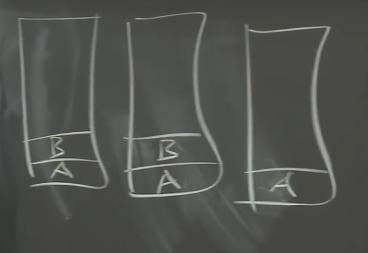

# Lecture 01 - Introduction

## 1.1 分布式系统的驱动力和挑战、分布式系统的抽象

分布式系统的核心是通过网络来协调，共同完成一致任务的一些计算机。分布式计算之所以如此重要的原因是，许多重要的基础设施都是在它之上建立的，它本质上需要多台物理隔离的计算机。

在选择使用分布式系统解决问题前，你应该要充分尝试别的思路，因为分布式系统会让问题解决变得复杂。

人们使用大量的相互协作的计算机驱动力是：

1. 人们需要获得**更高的计算性能**。大量的计算机意味着大量的并行运算，大量CPU、大量内存、以及大量磁盘在并行的运行。
2. **提供容错**（tolerate faults）。比如两台计算机运行完全相同的任务，其中一台发生故障，可以切换到另一台。
3. **一些问题天然在空间上是分布的**。例如银行转账，我们假设银行A在纽约有一台服务器，银行B在伦敦有一台服务器，这就需要一种两者之间协调的方法。所以，有一些天然的原因导致系统是物理分布的。
4. 构建分布式系统来达成一些**安全**的目标。比如有一些代码并不被信任，但是你又需要和它进行交互，这些代码不会立即表现的恶意或者出现bug，所以把系统分成多个的计算机，这样可以限制出错域。

这些分布式系统的问题（挑战）在于：

1. 系统中存在很多部分，这些部分又在并发执行，就会遇到**并发编程和各种复杂交互所带来的问题**，以及时间依赖的问题（比如同步，异步）。这让分布式系统变得很难。
2. 分布式系统有多个组成部分，再加上计算机网络，就会遇到一些意想不到的故障。如果你只有一台计算机，那么它通常要么是工作，要么是故障或者没电，总的来说，要么是在工作，要么是没有工作。而由多台计算机组成的分布式系统，可能会有一部分组件在工作，而另一部分组件停止运行，或者这些计算机都在正常运行，但是网络中断了或者不稳定。所以，**局部错误**也是分布式系统很难的原因。
3. 人们设计分布式系统的根本原因通常是为了获得更高的性能，比如说一千台计算机或者一千个磁盘臂达到的性能。但是实际上一千台机器到底有多少性能是一个棘手的问题，这里有很多难点。所以**通常需要倍加小心地设计才能让系统实际达到你期望的性能**。

## 1.3  分布式系统的抽象和实现工具

基础架构的类型主要是**存储，通信（网络）和计算。**

对于存储和计算，我们希望通过设计抽象的接口，将分布式特性隐藏在整个系统内。

人们在构建分布系统时，使用了很多的工具，例如：

1. RPC（Remote Procedure Call）。**RPC的目标就是掩盖我们正在不可靠网络上通信的事实**。
2. **线程**。这是一种编程技术，使得我们可以利用多核心计算机。更重要的是，线程提供了一种结构化的并发操作方式，这样，从程序员角度来说可以简化并发操作。
3. 因为我们会经常用到线程，**我们需要在实现的层面上，花费一定的时间来考虑并发控制，比如锁**。

## 1.4 可扩展性

**两台计算机构成的系统如果有两倍性能或者吞吐，就是可扩展性**。

这是一个很强大的特性。如果你构建了一个系统，并且只要增加计算机的数量，系统就能相应提高性能或者吞吐量，这将会是一个巨大的成果，因为计算机只需要花钱就可以买到。

当人们使用一整个机房的计算机来构建大型网站的时候，为了获取对应的性能，必须要时刻考虑可扩展性。你需要仔细设计系统，才能获得与计算机数量匹配的性能。当你只有1-2个用户时，一台计算机就可以运行web服务器和数据，或者一台计算机运行web服务器，一台计算机运行数据库。但是有可能你的网站一夜之间就火了起来，你发现可能有一亿人要登录你的网站。所以，为了提升性能，你要做的第一件事情就是购买更多的web服务器，然后把不同用户分到不同服务器上。这样，一部分用户可以去访问第一台web服务器，另一部分去访问第二台web服务器。所有的用户最终都需要看到相同的数据，所以所有的web服务器都与后端数据库通信。这样，很长一段时间你都可以通过添加web服务器来并行的提高web服务器的代码效率。

但是这种可扩展性并不是无限的。很可能在某个时间点你有了10台，20台，甚至100台web服务器，它们都在和同一个数据库通信。现在，数据库突然成为了瓶颈，并且增加更多的web服务器都无济于事了。**所以很少有可以通过无限增加计算机来获取完整的可扩展性的场景**。这时，你几乎是必然要做一些重构工作。但是只有一个数据库时，很难重构它。而虽然**可以将一个数据库拆分成多个数据库（进而提升性能）**，但是这需要大量的工作。

## 1.5 可用性

如果你只使用一台计算机构建你的系统，那么你的系统大概率是可靠的。然而如果你通过数千台计算机构建你的系统，那么即使每台计算机可以稳定运行一年，对于1000台计算机也意味着平均每天会有3台计算机故障。**大型分布式系统中有一个大问题，那就是一些很罕见的问题会被放大**。

因为错误总会发生，必须要在设计时就考虑，系统能够屏蔽错误，或者说能够在出错时继续运行。同时，因为我们需要为第三方应用开发人员提供方便的抽象接口。

**可用性即某些系统经过精心的设计，这样在特定的错误类型下，系统仍然能够正常运行，仍然可以像没有出现错误一样，为你提供完整的服务。**

除了可用性之外，另一种容错特性是**自我可恢复性**（recoverability）。这里的意思是，**如果出现了问题，服务会停止工作，不再响应请求，之后有人来修复，并且在修复之后系统仍然可以正常运行，就像没有出现过问题一样。这是一个比可用性更弱的需求**，因为在出现故障到故障组件被修复期间，系统将会完全停止工作。但是修复之后，系统又可以完全正确的重新运行，所以可恢复性是一个重要的需求。

对于一个可恢复的系统，通常需要做一些操作，例如将最新的数据存放在磁盘中，这样在供电恢复之后（假设故障就是断电），才能将这些数据取回来。甚至说对于一个具备可用性的系统，为了让系统在实际中具备应用意义，也需要具备可恢复性。因为可用的系统仅仅是在一定的故障范围内才可用，如果故障太多，可用系统也会停止工作，停止一切响应。但是当足够的故障被修复之后，系统还是需要能继续工作。所以，一个好的可用的系统，某种程度上应该也是可恢复的。当出现太多故障时，系统会停止响应，但是修复之后依然能正确运行。这是我们期望看到的。

为了实现这些特性，有很多工具。其中最重要的有两个：

1. 一个是非易失存储（non-volatile storage，类似于硬盘）
2. 对于容错的另一个重要工具是复制（replication），不过，任何一个多副本系统中，都会有一个关键的问题，比如说，我们有两台服务器，它们本来应该是有着相同的系统状态，现在的关键问题在于，这两个副本总是会意外的偏离同步的状态，而不再互为副本。

## 1.6 一致性

假设我们在构建一个分布式存储系统，只支持两种操作，其中一个是put操作会将一个value存入一个key；另一个是get操作会取出key对应的value。

一致性就是用来定义操作行为的概念。直观上来说，put就是更新这个表单，get就是从表单中获取当前表单中存储的数据。但是在一个分布式系统中，由于复制或者缓存，数据可能存在于多个副本当中，于是就有了多个不同版本的key-value对。假设服务器有两个副本，那么他们都有一个key-value表单，两个表单中key 1对应的值都是20。

实际上，对于一致性有很多不同的定义。有一些非常直观，比如说get请求可以得到最近一次完成的put请求写入的值。这种一般也被称为**强一致**（Strong Consistency）。但是，事实上，构建一个弱一致的系统也是非常有用的。**弱一致是指，不保证get请求可以得到最近一次完成的put请求写入的值**。

**人们对于弱一致感兴趣的原因是，虽然强一致可以确保get获取的是最新的数据，但是实现这一点的代价非常高。几乎可以确定的是，分布式系统的各个组件需要做大量的通信，才能实现强一致性。如果你有多个副本，那么不管get还是put都需要询问每一个副本。**所以，为了尽可能的避免通信，人们常常会使用弱一致系统，你只需要更新最近的数据副本，并且只需要从最近的副本获取数据。

##  论文阅读：*MapReduce*

### 1.MapReduce

MapReduce 是一个在多台机器上并行计算大规模数据的软件架构。主要通过两个操作来实现：Map 和 Reduce。

**MapReduce的工作流：**

1. 将输入文件分成 M 个小文件（每个文件的大小大概 16M-64M），**在集群中启动 MapReduce 实例，其中一个 Master 和多个 Worker**；
2. 由 Master 分配任务，将 `Map` 任务分配给可用的 Worker；
3. `Map` Worker 读取文件，执行用户自定义的 map 函数，输出 key/value 对，**缓存在内存中**；
4. 内存中的 (key, value) 对通过 `partitioning function()` 例如 `hash(key) mod R` 分为 R 个 regions，然后写入磁盘。完成之后，把这些文件的地址回传给 Master，然后 Master 把这些位置传给 `Reduce` Worker；
5. `Reduce` Worker 收到数据存储位置信息后，使用 RPC 从 `Map` Worker 所在的磁盘读取这些数据，根据 key 进行排序，并将同一 key 的所有数据分组聚合在一起；
6. `Reduce` Worker 将分组后的值传给用户自定义的 reduce 函数，输出追加到所属分区的输出文件中；
7. 当所有的 Map 任务和 Reduce 任务都完成后，Master 向用户程序返回结果；

**实例**

1. 词频统计)：这里 `Map` 函数可以将每个单词统计输出 `<word, count>`，然后 `Reduce` 函数同一单词的所有计数相加，得到：`<word, total count>`
2. 分布式 Grep（一种强大的文本搜索工具，它能使用特定模式匹配（包括正则表达式）搜索文本，并默认输出匹配行）：`Map` 函数输出匹配某个模式的一行，`Reduce` 函数输出所有中间数据
3. 分布式排序：`Map` 函数从每个记录提取 key，输出 `(key,record)` 对。`Reduce` 函数不改变任何的值，直接输出。后面我们会介绍**顺序保证**。

### 2.容错性

1. Worker 故障：Master 周期性的 ping 每个 Worker，如果指定时间内没回应就是挂了。将这个 Worker 标记为失效，分配给这个失效 Worker 的任务将被重新分配给其他 Worker，如果Master将Reduce任务分配给Worker，Worker完成Reduce任务后，即使该Worker节点失效了，Reduce任务也不用重新分配了，因为结果已经放在global file system上了；
2. Master 故障：中止整个 MapReduce 运算，重新执行。**一般很少出现 Master 故障**。

### 3.性能

#### **网络带宽匮乏**

在撰写该 paper 时，网络带宽是一个相当匮乏的资源。Master 在调度 Map 任务时会考虑输入文件的位置信息，尽量将一个 Map 任务调度在包含相关输入数据拷贝的机器上执行；如果找不到，Master 将尝试在保存输入数据拷贝的附近的机器上执行 Map 任务。

需要注意的是，新的讲座视频提到，**随着后来 Google 的基础设施的扩展和升级，他们对这种存储位置优化的依赖程度降低了**。

#### **“落伍者(Stragglers)”**

影响 MapReduce 执行时间的另一个因素是“落伍者”：一台机器花了很长的时间才完成最后几个 Map 或 Reduce 任务(*例如：有台机器硬盘出了问题*)，导致总的 MapReduce 执行时间超过预期。

通过备用任务(backup tasks)来处理：当 MapReduce 操作快完成的时候，Master 调度备用任务进程来执行剩下的、处于处理中的任务。无论是最初的进程还是备用任务进程任务完成了任务，都将该任务标记为已完成。

### 4.其它有趣的特性

#### **Combiner函数**

在某些情况下，Map 函数产生的中间 key 值的重复数据会占很大的比重（例如词频统计，将产生成千上万的 `<the, 1>` 记录）。用户可以自定义一个可选的 `Combiner` 函数，`Combiner` 函数首先在本地将这些记录进行一次合并，然后将合并的结果再通过网络发送出去。

**Combiner 函数的代码通常和 Reduce 函数的代码相同，启动这个功能的好处是可以减少通过网络发送到 Reduce 函数的数据量。** 

**并不是所有的job都适用combiner**，只有操作满足结合律的才可设置combiner。combine操作类似于：opt(opt(1, 2, 3), opt(4, 5, 6))。如果opt为求和、求最大值的话，可以使用，但是如果是求中值的话，不适用。

#### 跳过损坏的记录

用户程序中的 bug 导致 `Map` 或者 `Reduce` 函数在处理某些记录的时候crash。通常会修复 bug 再执行 MapReduce，但是找出 bug 并修复它往往不是一件容易的事情（bug 有可能在第三方库）。

与其因为少数坏记录而导致整个执行失败，不如有一个机制可以让损坏的记录被跳过。这在某些情况下是可以接受的，例如在对一个大型数据集进行统计分析时。

Worker 可以记录处理的最后一条记录的序号发送给 Master，当 Master 看到在处理某条记录失败不止一次时，标记这条记录需要被跳过，下次执行时跳过这条记录。

#### **顺序保证**

确保在给定的 `Reduce` 分区中，中间 key/value 对是按照 key 值升序处理的。这样的顺序保证对输出的每个文件都是有序的，这样在 Reduce Worker 在读取时非常方便，例如可以对不同的文件使用归并排序。

但 paper 没说这个顺序保证在哪做的，看起来是在 Map Worker 中最后进行一次排序。

## Lab 1: MapReduce

### 任务总览和说明

`lab1`要求我们能实现一个和`MapReduce`论文类似的机制，也就是单词个数`Word Count`。用于测试的文件在`src/main`目录下，以`pg-*.txt`形式命名。每个`pg-*.txt`文件都是一本电子书，非常长。我们的任务是统计出所有电子书中出现过的单词，以及它们的出现次数。

`mrsequential.go`实现的是**非分布式**的`Word Count`。这个文件的输出将作为之后测试的**标准**，分布式版本应给出和这个输出完全相同的输出。

### 我们的任务

测试时，启动一个`master`和多个`worker`，也就是运行一次`mrmaster.go`、运行多次`mrworker.go`。

`master`进程启动一个`rpc`服务器，每个`worker`进程通过`rpc`机制向`Master`要任务。任务可能包括`map`和`reduce`过程，具体如何给`worker`分配取决于`master`。

每个单词和它出现的次数以`key-value`**键值对**形式出现。`map`进程将每个出现的单词机械地分离出来，并给每一次出现标记为1次。很多单词在电子书中重复出现，也就产生了很多相同键值对，**此时产生的键值对的值都是1**。

已经分离出的单词以键值对形式分配给特定`reduce`进程，`reduce`进程个数远小于单词个数，每个`reduce`进程都处理一定量单词。相同的单词应由相同的`reduce`进程处理。最终，每个`reduce`进程都有一个输出，合并这些输出，就是`Word Count`结果。

测试流程要求，输出的文件个数和参数`nReduce`相同，即每个输出文件对应一个`reduce`任务，格式和`mrsequential`的输出格式相同，命名为`mr-out*`。我们的代码应保留这些文件，不做进一步合并，测试脚本将进行这一合并。合并之后的最终完整输出，必须和`mrsequential`的输出完全相同。

# Lecture 03 - GFS

`GFS - The Google File System`，主要内容是大型存储。

## 3.1 分布式系统的难点

**存储是一种关键的抽象**。在分布式系统中，可能有各种各样重要的抽象可以应用在分布式系统中，但是实际上，简单的存储接口往往非常有用且极其通用。为大型分布式存储系统设计一个优秀的接口，以及如何设计存储系统的内部结构，这样系统才能良好运行。

人们设计大型分布式系统或大型存储系统出发点通常是，他们想获取巨大的性能加成，进而利用数百台计算机的资源来同时完成大量工作。因此，性能问题就成为了最初的诉求。 之后，很自然的想法就是将数据分割放到大量的服务器上，这样就可以并行的从多台服务器读取数据。我们将这种方式称之为**分片**。

如果你在成百上千台服务器进行分片，你将会看见常态的故障，每天甚至每个小时都可能会发生错误。所以，我们需要自动化的方法而不是人工介入来修复错误。我们需要一个**自动的容错系统**。

实现容错最有用的一种方法是使用**复制**，只需要维护2-3个数据的副本，当其中一个故障了，你就可以使用另一个。

如果有复制，那就有了两份数据的副本。可以确定的是，如果你不小心，它们就会**不一致**。

通过聪明的设计，你可以避免不一致的问题，并且让数据看起来也表现的符合预期。但是为了达到这样的效果，你总是需要额外的工作，需要不同服务器之间通过网络额外的交互，而这样的交互会降低性能。所以如果你想要一致性，你的代价就是**低性能**。但这明显不是我们最开始所希望的。

当然，这里并不是绝对的。你可以构建性能很高的系统，但是不可避免的，都会陷入到这里的循环来。现实中，如果你想要好的一致性，你就要付出相应的代价。如果你不想付出代价，那就要忍受一些不确定的行为。

## 3.2 错误的设计

对于具备强一致或者好的一致性的系统，你可以认为只有一台服务器，甚至这个服务器只运行单线程，它同一时间只处理来自客户端的一个请求。这很重要，因为可能会有大量的客户端并发的发送请求到服务器上。这里要求服务器从请求中挑选一个出来先执行，执行完成之后再执行下一个。

对于存储服务器来说，它上面会有一块磁盘，并且我们有一个以key-value为索引的数据表单，那么我们会修改这个表单。

为了让这里的简单服务有可预期的行为，需要定义一条规则：**一个时间只执行一条请求**。这样每个请求都可以看到之前所有请求按照顺序执行生成的数据。

例如，我们有一些客户端，客户端C1发起写请求将X设置成1。在同一时刻，客户端C2发起写请求将X设置成2。

过了一会，在C1和C2的写请求都执行完毕之后，客户端C3会发送读取X的请求，并得到了一个结果。客户端C4也会发送读取X的请求，也得到了一个结果。现在的问题是，这两个客户端看到的结果是什么？

这里有一个几乎是最糟糕的多副本设计，我们有两台服务器，每个服务器都有数据的一份完整拷贝。它们在磁盘上都存储了一个key-value表单。当然，直观上我们希望这两个表单是完全一致的，这样，一台服务器故障了，我们可以切换到另一台服务器去做读写。

两个表单完全一致意味着，每一个写请求都必须在两台服务器上执行，而读请求只需要在一台服务器上执行，否则就没有容错性了。因为如果读请求也需要从两台服务器读数据，那么一台服务器故障我们就没法提供服务了。现在问题来了，假设客户端C1和C2都想执行写请求，其中一个要写X为1，另一个写X为2。C1会将写X为1的请求发送个两个服务器，因为我们想要更新两台服务器上的数据。C2也会将写X为2的请求发送给两个服务器。

这里会出现什么错误呢？是的，**我们没有做任何事情来保障两台服务器以相同的顺序处理这2个请求**。

之后，如果另外一些客户端，假设C3从S1读数据，C4从S2读数据，我们就会面临一个可怕的场景：这两个客户端读取的数据不一样。

这里的问题可以以另一种方式暴露出来。假设我们尝试修复上面的问题，我们让客户端在S1还在线的时候，只从S1读取数据，S1不在线了再从S2读取数据。这样最开始所有的客户端读X都能得到2。但是突然，如果S1故障了，尽管没有写请求将X改成1，客户端读X得到的数据将会从2变成1。因为S1故障之后，所有的客户端都会切换到S2去读数据。这种数据的神奇变化与任何写操作都没有关联，并且也不可能在前一个例子的简单模型中发生。

当然，这里的问题是可以修复的，修复需要服务器之间更多的通信，并且复杂度也会提升。由于获取强一致会带来不可避免的复杂性的提升，有大量的方法可以在好的一致性和一些小瑕疵行为之间追求一个平衡。

## 3.3 GFS的设计目标

Google的目标是构建一个**大型的，快速的**文件系统。如果有一个**全局通用**的存储系统，那就意味着如果我存储了大量从互联网抓取的数据，你也可以通过申请权限来查看这些数据，因为我们都使用了同一个存储系统。这样，任何在Google内部的人员都可以根据名字读取这个文件系统（GFS）中可被共享的内容。

**为了获得大容量和高速的特性，每个包含了数据的文件会被GFS自动的分割并存放在多个服务器之上**，这样读写操作自然就会变得很快。因为可以从多个服务器上同时读取同一个文件，进而获得更高的聚合吞吐量。将文件分割存储还可以在存储系统中保存比单个磁盘还要大的文件。

因为我们现在在数百台服务器之上构建存储系统，我们希望有**自动的故障修复**。

还有一些特征并非是设计目标。比如**GFS被设计成只在一个数据中心运行**，所以这里并没有将副本保存在世界各地，单个GFS只存在于单个数据中心的单个机房里。理论上来说，数据的多个副本应该彼此之间隔的远一些，但是实现起来挺难的，所以GFS局限在一个数据中心内。

其次，GFS并不面向普通的用户，**这是一个Google内部使用的系统，供Google的工程师写应用程序使用**。所以Google并没有售卖GFS，它或许售卖了基于GFS的服务，但是GFS并不直接面向普通用户。

第三，GFS在各个方面对大型的顺序文件读写做了定制。在存储系统中有一个完全不同的领域，这个领域只对小份数据进行优化。例如一个银行账户系统就需要一个能够读写100字节的数据库，因为100字节就可以表示人们的银行账户。但是GFS不是这样的系统，GFS是为TB级别的文件而生。并且**GFS只会顺序处理，不支持随机访问**。某种程度上来说，它有点像批处理的风格。GFS并没有花费过多的精力来降低延迟，它的关注点在于巨大的吞吐量上，所以单次操作都涉及到MB级别的数据。

GFS论文发表在2003年的SOSP会议上，这是一个有关系统的顶级学术会议。论文提出了一个当时非常异类的观点：存储系统具有弱一致性也是可以的，它的目标是提供更好的性能。

## 3.4 GFS Master节点

假设我们有上百个客户端和一个Master节点。尽管实际中可以拿多台机器作为Master节点，但是**GFS中Master是Active-Standby模式，所以只有一个Master节点在工作**。Master节点保存了文件名和存储位置的对应关系。除此之外，还有大量的Chunk服务器，可能会有数百个，每一个Chunk服务器上都有1-2块磁盘。

在这里，**Master节点用来管理文件和Chunk的信息，而Chunk服务器用来存储实际的数据**。这是GFS设计中比较好的一面，它将这两类数据的管理问题几乎完全隔离开了，这样这两个问题可以使用独立设计来解决。Master节点知道每一个文件对应的所有的Chunk的ID，当我想读取这个文件中的任意一个部分时，我需要向Master节点查询对应的Chunk在哪个服务器上，之后我可以直接从Chunk服务器读取对应的Chunk数据。

更进一步，我们看一下GFS的一致性以及GFS是如何处理故障。为了了解这些，我们需要知道Master节点内保存的数据内容，这里我们关心的主要是两个表单：

第一个是**文件名到Chunk ID或者Chunk Handle数组的对应**。这个表单告诉你，文件对应了哪些Chunk。但是只有Chunk ID是做不了太多事情的，所以有了第二个表单。

第二个表单记录了**Chunk ID到Chunk数据的对应关系**。这里的数据又包括了：

1. 每个Chunk存储在哪些服务器上，所以这部分是Chunk服务器的列表
2. 每个Chunk当前的版本号，所以Master节点必须记住每个Chunk对应的版本号。

**所有对于Chunk的写操作都必须在主Chunk（Primary Chunk）上顺序处理，主Chunk是Chunk的多个副本之一**。Master节点必须记住哪个Chunk服务器持有主Chunk。并且，**主Chunk只能在特定的租约时间内担任主Chunk**，所以，**Master节点要记住主Chunk的租约过期时间**。

**以上数据都存储在内存中**，如果Master故障了，这些数据就都丢失了。为了能让Master重启而不丢失数据，**Master节点会同时将数据存储在磁盘上**。所以Master节点读数据只会从内存读，但是写数据的时候，**至少有一部分数据会接入到磁盘中**。更具体来说，**Master会在磁盘上存储log，每次有数据变更时，Master会在磁盘的log中追加一条记录，并生成CheckPoint（类似于备份点）**。

有些数据需要存在磁盘上，而有些不用。它们分别是：

1. Chunk Handle的数组（第一个表单）要保存在磁盘上，标记成NV（non-volatile, 非易失），这个标记表示对应的数据会写入到磁盘上。
2. Chunk服务器列表不用保存到磁盘上。因为Master节点重启之后可以与所有的Chunk服务器通信，并查询每个Chunk服务器存储了哪些Chunk，所以我认为它不用写入磁盘。所以这里标记成V（volatile），
3. 版本号要不要写入磁盘取决于GFS是如何工作的，我认为它需要写入磁盘。我们之后在讨论系统是如何工作的时候再详细讨论这个问题。这里先标记成NV。
4. 主Chunk的ID，几乎可以确定不用写入磁盘，因为Master节点重启之后会忘记谁是主Chunk，它只需要等待60秒租约到期，那么它知道对于这个Chunk来说没有主Chunk，这个时候，Master节点可以安全指定一个新的主Chunk。所以这里标记成V。
5. 类似的，租约过期时间也不用写入磁盘，所以这里标记成V。

任何时候，如果文件扩展到达了一个新的64MB，需要新增一个Chunk或者由于指定了新的主Chunk而导致版本号更新了，Master节点需要向磁盘中的Log追加一条记录说，我刚刚向这个文件添加了一个新的Chunk或者我刚刚修改了Chunk的版本号。所以每次有这样的更新，都需要写磁盘。GFS论文并没有讨论这么多细节，但是因为写磁盘的速度是有限的，写磁盘会导致Master节点的更新速度也是有限的，所以要尽可能少的写入数据到磁盘。

**这里在磁盘中维护log而不是数据库的原因是，数据库本质上来说是某种B树（b-tree）或者hash table，相比之下，追加log会非常的高效，因为你可以将最近的多个log记录一次性的写入磁盘**。因为这些数据都是向同一个地址追加，这样只需要等待磁盘的磁碟旋转一次。而对于B树来说，每一份数据都需要在磁盘中随机找个位置写入。所以使用Log可以使得磁盘写入更快一些。

当Master节点故障重启，并重建它的状态，你不会想要从log的最开始重建状态，因为log的最开始可能是几年之前，**所以Master节点会在磁盘中创建一些checkpoint点，这可能要花费几秒甚至一分钟。这样Master节点重启时，会从log中的最近一个checkpoint开始恢复，再逐条执行从Checkpoint开始的log，最后恢复自己的状态。**

## 3.5 GFS读文件

1. 应用程序想读取某个特定文件的某个特定的偏移位置上的某段特定长度的数据，比如说第1000到第2000个字节的数据。所以，应用程序将文件名，长度和起始位置发送给Master节点。
2. Master节点将Chunk Handle（也就是ID，记为H）和服务器列表发送给客户端。
3. 现在客户端可以从这些Chunk服务器中挑选一个来读取数据。**客户端会选择一个网络上最近的服务器**（Google的数据中心中，IP地址是连续的，所以可以从IP地址的差异判断网络位置的远近），并将读请求发送到那个服务器。因为客户端每次可能只读取1MB或者64KB数据，所以，客户端可能会连续多次读取同一个Chunk的不同位置。所以，**客户端会缓存Chunk和服务器的对应关系**，这样，当再次读取相同Chunk数据时，就不用一次次的去向Master请求相同的信息。

4. 接下来，客户端会与选出的Chunk服务器通信，将Chunk Handle和偏移量发送给那个Chunk服务器。Chunk服务器会在本地的硬盘上，将每个Chunk存储成独立的Linux文件，并通过普通的Linux文件系统管理。并且可以推测，Chunk文件会按照Handle（也就是ID）命名。所以，Chunk服务器需要做的就是根据文件名找到对应的Chunk文件，之后从文件中读取对应的数据段，并将数据返回给客户端。

> 学生提问：如果读取的数据超过了一个Chunk怎么办？
>
> Robert教授：我不知道详细的细节。我的印象是，如果应用程序想要读取超过64MB的数据，或者就是2个字节，但是却跨越了Chunk的边界，应用程序会通过一个库来向GFS发送RPC，而这个库会注意到这次读请求会跨越Chunk边界，因此会将一个读请求拆分成两个读请求再发送到Master节点。所以，这里可能是向Master节点发送两次读请求，得到了两个结果，之后再向两个不同的Chunk服务器读取数据。
>

## 3.6 GFS写文件

从应用程序的角度来看，写文件和读文件的接口是非常类似的，它们都是调用GFS的库。写文件是，应用程序会告诉库函数说，我想对这个文件名的文件在这个数据段写入当前存在buffer中的数据。这里只讨论对于写文件，客户端会向Master节点发送请求说：我想向这个文件名对应的文件**追加数据**，请告诉我文件中最后一个Chunk的位置。

当有多个客户端同时写同一个文件时，一个客户端并不能知道文件究竟有多长。因为如果只有一个客户端在写文件，客户端自己可以记录文件长度，而多个客户端时，一个客户端没法知道其他客户端写了多少。这个时候，客户端可以向Master节点查询哪个Chunk服务器保存了文件的最后一个Chunk。

**对于读文件来说，可以从任何最新的Chunk副本读取数据，但是对于写文件来说，必须要通过Chunk的主副本（Primary Chunk）来写入**。对于某个特定的Chunk来说，在某一个时间点，Master不一定指定了Chunk的主副本。所以，写文件的时候，需要考虑Chunk的主副本不存在的情况。

1. 找出新的Chunk副本。这是因为服务器可能宕机或者没有收到任何的更新，所以Master节点需要能够在Chunk的多个副本中识别出，哪些副本是新的，哪些是旧的。每个Chunk可能同时有多个副本，最新的副本是指，**副本中保存的版本号与Master中记录的Chunk的版本号一致**。Chunk副本中的版本号是由Master节点下发的。如果Master节点重启，并且与Chunk服务器交互，同时一个Chunk服务器重启，并上报了一个比Master记住的版本更高的版本。Master会认为它在分配新的Primary服务器时出现了错误，并且会使用这个更高的版本号来作为Chunk的最新版本号。
2. Master等所有存储了最新Chunk版本的服务器集合完成，然后挑选一个作为Primary，其他的作为Secondary。

3. Master增加版本号，并将版本号写入磁盘，这样就算故障了也不会丢失这个数据。

4. Master节点会向Primary和Secondary副本对应的服务器发送消息并告诉它们，谁是Primary，谁是Secondary，Chunk的新版本是什么。Primary和Secondary服务器都会将版本号存储在本地的磁盘中。这样，当它们因为电源故障或者其他原因重启时，它们可以向Master报告本地保存的Chunk的实际版本号。

5. 现在有了一个Primary，它可以接收来自客户端的写请求，并将写请求应用在多个Chunk服务器中。之所以要管理Chunk的版本号，是因为这样Master可以将实际更新Chunk的能力转移给Primary服务器。并且在将版本号更新到Primary和Secondary服务器之后，如果Master节点故障重启，还是可以在相同的Primary和Secondary服务器上继续更新Chunk。

6. Master节点通知Primary和Secondary服务器，你们可以修改这个Chunk。它还给Primary一个租约，这个租约告诉Primary说，在接下来的60秒中，你将是Primary，60秒之后你必须停止成为Primary。这种机制可以确保我们不会同时有两个Primary。

7. 现在Master节点告诉客户端谁是Primary，谁是Secondary，GFS提出了一种聪明的方法来实现写请求的执行序列。客户端会将要追加的数据发送给Primary和Secondary服务器，这些服务器会将数据写入到一个临时位置。所以最开始，这些数据不会追加到文件中。当所有的服务器都返回确认消息说，已经有了要追加的数据，客户端会向Primary服务器发送一条消息说，你和所有的Secondary服务器都有了要追加的数据，现在我想将这个数据追加到这个文件中。Primary服务器或许会从大量客户端收到大量的并发请求，Primary服务器会以某种顺序，一次只执行一个请求。对于每个客户端的追加数据请求（也就是写请求），Primary会查看当前文件结尾的Chunk，并确保Chunk中有足够的剩余空间，然后将客户端要追加的数据写入Chunk的末尾。并且，Primary会通知所有的Secondary服务器也将客户端要追加的数据写入在它们自己存储的Chunk末尾。这样，包括Primary在内的所有副本，都会收到通知将数据追加在Chunk的末尾。

8. 对于Secondary服务器来说，它们可能执行成功，也可能会执行失败，比如说磁盘空间不足，比如说故障了，比如说Primary发出的消息网络丢包了。如果Secondary实际真的将数据写入到了本地磁盘存储的Chunk中，它会回复“yes”给Primary。如果所有的Secondary服务器都成功将数据写入，并将“yes”回复给了Primary，并且Primary也收到了这些回复。Primary会向客户端返回写入成功。如果至少一个Secondary服务器没有回复Primary，或者回复了，但是内容却是：抱歉，一些不好的事情发生了，比如说磁盘空间不够，或者磁盘故障了，Primary会向客户端返回写入失败。
9. GFS论文说，如果客户端从Primary得到写入失败，那么客户端应该重新发起整个追加过程。客户端首先会重新与Master交互，找到文件末尾的Chunk；之后，客户端需要重新发起对于Primary和Secondary的数据追加操作。

> 学生提问：写文件失败之后Primary和Secondary服务器上的状态如何恢复？
>
> Robert教授：如果某些副本没有成功执行，Primary会回复客户端说执行失败。之后客户端会认为数据没有追加成功。但是实际上，部分副本还是成功将数据追加了。所以现在，一个Chunk的部分副本成功完成了数据追加，而另一部分没有成功，这种状态是可接受的，没有什么需要恢复，这就是GFS的工作方式。
>
> 学生提问：写文件失败之后，读Chunk数据会有什么不同？
>
> Robert教授：如果写文件失败之后，一个客户端读取相同的Chunk，客户端可能可以读到追加的数据，也可能读不到，取决于客户端读的是Chunk的哪个副本。
>
> 学生提问：客户端将数据拷贝给多个副本会不会造成瓶颈？
>
> Robert教授：这是一个好问题。考虑到底层网络，写入文件数据的具体传输路径可能会非常重要。客户端只会将数据发送给离它最近的副本，之后那个副本会将数据转发到另一个副本，以此类推形成一条链，直到所有的副本都有了数据。这样一条数据传输链可以在数据中心内减少跨交换机传输。
>
> 学生提问：如果是对一个新的文件进行追加，那这个新的文件没有副本，会怎样？
>
> Robert教授：Master会从客户端收到一个请求说，我想向这个文件追加数据。我猜，Master节点会发现，该文件没有关联的Chunk。Master节点或许会通过随机数生成器创造一个新的Chunk ID。之后，Master节点通过查看自己的Chunk表单发现，自己其实也没有Chunk ID对应的任何信息。之后，Master节点会创建一条新的Chunk记录说，我要创建一个新的版本号为1，再随机选择一个Primary和一组Secondary并告诉它们，你们将对这个空的Chunk负责，请开始工作。论文里说，每个Chunk默认会有三个副本，所以，通常来说是一个Primary和两个Secondary。

## 3.7 GFS的一致性

当我们追加数据时，面对Chunk的三个副本，当客户端发送了一个追加数据的请求，要将数据A追加到文件末尾，所有的三个副本，包括一个Primary和两个Secondary，都成功的将数据追加到了Chunk，所以Chunk中的第一个记录是A。

假设第二个客户端加入进来，想要追加数据B，但是由于网络问题发送给某个副本的消息丢失了。所以，追加数据B的消息只被两个副本收到，一个是Primary，一个是Secondary。这两个副本都在文件中追加了数据B，所以，现在我们有两个副本有数据B，另一个没有。

之后，第三个客户端想要追加数据C，并且第三个客户端记得下图中左边第一个副本是Primary。Primary选择了偏移量，并将偏移量告诉Secondary，将数据C写在Chunk的这个位置。三个副本都将数据C写在这个位置。

对于数据B来说，客户端会收到写入失败的回复，客户端会重发写入数据B的请求。所以，第二个客户端会再次请求追加数据B，或许这次数据没有在网络中丢包，并且所有的三个副本都成功追加了数据B。现在三个副本都在线，并且都有最新的版本号。

之后，如果一个客户端读文件，读到的内容取决于读取的是Chunk的哪个副本。客户端总共可以看到三条数据，但是取决于不同的副本，读取数据的顺序是不一样的。如果读取的是第一个副本，那么客户端可以读到A、B、C，然后是一个重复的B。如果读取的是第三个副本，那么客户端可以读到A，一个空白数据，然后是C、B。所以，如果读取前两个副本，B和C的顺序是先B后C，如果读的是第三个副本，B和C的顺序是先C后B。所以，不同的读请求可能得到不同的结果。

或许最坏的情况是，一些客户端写文件时，因为其中一个Secondary未能成功执行数据追加操作，客户端从Primary收到写入失败的回复。在客户端重新发送写文件请求之前，客户端就故障了。所以，你有可能进入这种情形：数据D出现在某些副本中，而其他副本则完全没有。

在GFS的这种工作方式下，如果Primary返回写入成功，那么一切都还好，如果Primary返回写入失败，就不是那么好了。Primary返回写入失败会导致不同的副本有完全不同的数据。

> 学生提问：为什么GFS要设计成多个副本不一致？
>
> Robert教授：我不明白GFS设计者为什么要这么做。GFS可以设计成多个副本是完全精确同步的，你们在lab2和lab3会设计一个系统，其中的副本是同步的。并且你们也会知道，为了保持同步，你们要使用各种各样的技术。如果你们想要让副本保持同步，其中一条规则就是你们不能允许这种只更新部分服务器的不完整操作。这意味着，你必须要有某种机制，即使客户端挂了，系统仍然会完成请求。如果这样的话，GFS中的Primary就必须确保每一个副本都得到每一条消息。
>

如果你想要将GFS升级成强一致系统，我可以为你列举一些你需要考虑的事情：

你可能需要让Primary来探测重复的请求，尝试确保B不会在文件中出现两次。

1. 对于Secondary来说，如果Primay要求Secondary执行一个操作，Secondary必须要执行而不是只返回一个错误给Primary。如果Secondary有一些永久性故障，例如磁盘被错误的拔出了，你需要有一种机制将Secondary从系统中移除，这样Primary可以与剩下的Secondary继续工作。
2. 当Primary要求Secondary追加数据时，直到Primary确信所有的Secondary都能执行数据追加之前，Secondary必须小心不要将数据暴露给读请求。所以对于写请求，你或许需要多个阶段。在第一个阶段，Primary向Secondary发请求，要求其执行某个操作，并等待Secondary回复说能否完成该操作，这时Secondary并不实际执行操作。在第二个阶段，如果所有Secondary都回复说可以执行该操作，这时Primary才会说，好的，所有Secondary执行刚刚你们回复可以执行的那个操作。这是现实世界中很多强一致系统的工作方式，这被称为**两阶段提交**（Two-phase commit）。
3. 当Primary崩溃时，可能有一组操作由Primary发送给Secondary，Primary在确认所有的Secondary收到了请求之前就崩溃了。当一个Primary崩溃了，一个Secondary会接任成为新的Primary，但是这时，新Primary和剩下的Secondary会在最后几个操作有分歧，因为部分副本并没有收到前一个Primary崩溃前发出的请求。所以，新的Primary上任时，需要显式的与Secondary进行同步，以确保操作历史的结尾是相同的。
4. 时不时的，Secondary之间可能会有差异，或者客户端从Master节点获取的是稍微过时的Secondary。系统要么需要将所有的读请求都发送给Primary，因为只有Primary知道哪些操作实际发生了，要么对于Secondary需要一个租约系统，就像Primary一样，这样就知道Secondary在哪些时间可以合法的响应客户端。

为了实现强一致，以上就是我认为的需要在系统中修复的东西，它们增加了系统的复杂度，增加了系统内部组件的交互。

最后，让我花一分钟来介绍GFS在它生涯的前5-10年在Google的出色表现，总的来说，它取得了巨大的成功，许多许多Google的应用都使用了它，许多Google的基础架构，例如BigTable和MapReduce是构建在GFS之上，所以GFS在Google内部广泛被应用。它最严重的局限可能在于，它只有一个Master节点，会带来以下问题：

1. Master节点必须为每个文件，每个Chunk维护表单，随着GFS的应用越来越多，这意味着涉及的文件也越来越多，最终Master会耗尽内存来存储文件表单。你可以增加内存，但是单台计算机的内存也是有上限的。所以，这是人们遇到的最早的问题。
2. 单个Master节点要承载数千个客户端的请求，而Master节点的CPU每秒只能处理数百个请求，尤其Master还需要将部分数据写入磁盘，很快，客户端数量超过了单个Master的能力。
3. 应用程序发现很难处理GFS奇怪的语义（本节最开始介绍的GFS的副本数据的同步，或者可以说不同步）。
4. 从我们读到的GFS论文中，Master节点的故障切换不是自动的。GFS需要人工干预来处理已经永久故障的Master节点，并更换新的服务器，这可能需要几十分钟甚至更长的而时间来处理。对于某些应用程序来说，这个时间太长了。
