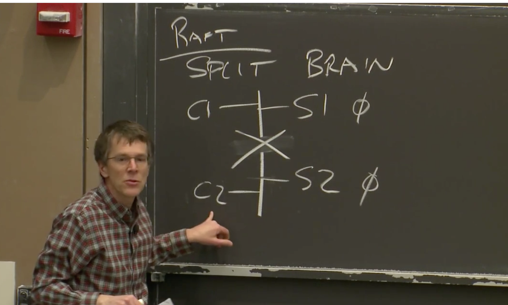
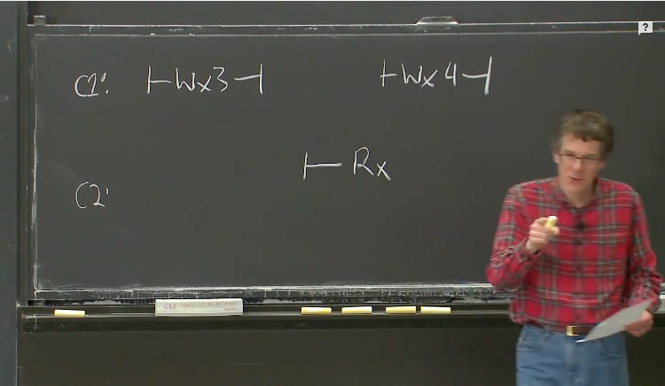

# Lecture 01 - Introduction

## 1.1 分布式系统的驱动力和挑战、分布式系统的抽象

分布式系统的核心是通过网络来协调，共同完成一致任务的一些计算机。分布式计算之所以如此重要的原因是，许多重要的基础设施都是在它之上建立的，它本质上需要多台物理隔离的计算机。

在选择使用分布式系统解决问题前，你应该要充分尝试别的思路，因为分布式系统会让问题解决变得复杂。

人们使用大量的相互协作的计算机驱动力是：

1. 人们需要获得**更高的计算性能**。大量的计算机意味着大量的并行运算，大量CPU、大量内存、以及大量磁盘在并行的运行。
2. **提供容错**（tolerate faults）。比如两台计算机运行完全相同的任务，其中一台发生故障，可以切换到另一台。
3. **一些问题天然在空间上是分布的**。例如银行转账，我们假设银行A在纽约有一台服务器，银行B在伦敦有一台服务器，这就需要一种两者之间协调的方法。所以，有一些天然的原因导致系统是物理分布的。
4. 构建分布式系统来达成一些**安全**的目标。比如有一些代码并不被信任，但是你又需要和它进行交互，这些代码不会立即表现的恶意或者出现bug，所以把系统分成多个的计算机，这样可以限制出错域。

这些分布式系统的问题（挑战）在于：

1. 系统中存在很多部分，这些部分又在并发执行，就会遇到**并发编程和各种复杂交互所带来的问题**，以及时间依赖的问题（比如同步，异步）。这让分布式系统变得很难。
2. 分布式系统有多个组成部分，再加上计算机网络，就会遇到一些意想不到的故障。如果你只有一台计算机，那么它通常要么是工作，要么是故障或者没电，总的来说，要么是在工作，要么是没有工作。而由多台计算机组成的分布式系统，可能会有一部分组件在工作，而另一部分组件停止运行，或者这些计算机都在正常运行，但是网络中断了或者不稳定。所以，**局部错误**也是分布式系统很难的原因。
3. 人们设计分布式系统的根本原因通常是为了获得更高的性能，比如说一千台计算机或者一千个磁盘臂达到的性能。但是实际上一千台机器到底有多少性能是一个棘手的问题，这里有很多难点。所以**通常需要倍加小心地设计才能让系统实际达到你期望的性能**。

## 1.3  分布式系统的抽象和实现工具

基础架构的类型主要是**存储，通信（网络）和计算。**

对于存储和计算，我们希望通过设计抽象的接口，将分布式特性隐藏在整个系统内。

人们在构建分布系统时，使用了很多的工具，例如：

1. RPC（Remote Procedure Call）。**RPC的目标就是掩盖我们正在不可靠网络上通信的事实**。
2. **线程**。这是一种编程技术，使得我们可以利用多核心计算机。更重要的是，线程提供了一种结构化的并发操作方式，这样，从程序员角度来说可以简化并发操作。
3. 因为我们会经常用到线程，**我们需要在实现的层面上，花费一定的时间来考虑并发控制，比如锁**。

## 1.4 可扩展性

**两台计算机构成的系统如果有两倍性能或者吞吐，就是可扩展性**。

这是一个很强大的特性。如果你构建了一个系统，并且只要增加计算机的数量，系统就能相应提高性能或者吞吐量，这将会是一个巨大的成果，因为计算机只需要花钱就可以买到。

当人们使用一整个机房的计算机来构建大型网站的时候，为了获取对应的性能，必须要时刻考虑可扩展性。你需要仔细设计系统，才能获得与计算机数量匹配的性能。当你只有1-2个用户时，一台计算机就可以运行web服务器和数据，或者一台计算机运行web服务器，一台计算机运行数据库。但是有可能你的网站一夜之间就火了起来，你发现可能有一亿人要登录你的网站。所以，为了提升性能，你要做的第一件事情就是购买更多的web服务器，然后把不同用户分到不同服务器上。这样，一部分用户可以去访问第一台web服务器，另一部分去访问第二台web服务器。所有的用户最终都需要看到相同的数据，所以所有的web服务器都与后端数据库通信。这样，很长一段时间你都可以通过添加web服务器来并行的提高web服务器的代码效率。

但是这种可扩展性并不是无限的。很可能在某个时间点你有了10台，20台，甚至100台web服务器，它们都在和同一个数据库通信。现在，数据库突然成为了瓶颈，并且增加更多的web服务器都无济于事了。**所以很少有可以通过无限增加计算机来获取完整的可扩展性的场景**。这时，你几乎是必然要做一些重构工作。但是只有一个数据库时，很难重构它。而虽然**可以将一个数据库拆分成多个数据库（进而提升性能）**，但是这需要大量的工作。

## 1.5 可用性

如果你只使用一台计算机构建你的系统，那么你的系统大概率是可靠的。然而如果你通过数千台计算机构建你的系统，那么即使每台计算机可以稳定运行一年，对于1000台计算机也意味着平均每天会有3台计算机故障。**大型分布式系统中有一个大问题，那就是一些很罕见的问题会被放大**。

因为错误总会发生，必须要在设计时就考虑，系统能够屏蔽错误，或者说能够在出错时继续运行。同时，因为我们需要为第三方应用开发人员提供方便的抽象接口。

**可用性即某些系统经过精心的设计，这样在特定的错误类型下，系统仍然能够正常运行，仍然可以像没有出现错误一样，为你提供完整的服务。**

除了可用性之外，另一种容错特性是**自我可恢复性**（recoverability）。这里的意思是，**如果出现了问题，服务会停止工作，不再响应请求，之后有人来修复，并且在修复之后系统仍然可以正常运行，就像没有出现过问题一样。这是一个比可用性更弱的需求**，因为在出现故障到故障组件被修复期间，系统将会完全停止工作。但是修复之后，系统又可以完全正确的重新运行，所以可恢复性是一个重要的需求。

对于一个可恢复的系统，通常需要做一些操作，例如将最新的数据存放在磁盘中，这样在供电恢复之后（假设故障就是断电），才能将这些数据取回来。甚至说对于一个具备可用性的系统，为了让系统在实际中具备应用意义，也需要具备可恢复性。因为可用的系统仅仅是在一定的故障范围内才可用，如果故障太多，可用系统也会停止工作，停止一切响应。但是当足够的故障被修复之后，系统还是需要能继续工作。所以，一个好的可用的系统，某种程度上应该也是可恢复的。当出现太多故障时，系统会停止响应，但是修复之后依然能正确运行。这是我们期望看到的。

为了实现这些特性，有很多工具。其中最重要的有两个：

1. 一个是非易失存储（non-volatile storage，类似于硬盘）
2. 对于容错的另一个重要工具是复制（replication），不过，任何一个多副本系统中，都会有一个关键的问题，比如说，我们有两台服务器，它们本来应该是有着相同的系统状态，现在的关键问题在于，这两个副本总是会意外的偏离同步的状态，而不再互为副本。

## 1.6 一致性

假设我们在构建一个分布式存储系统，只支持两种操作，其中一个是put操作会将一个value存入一个key；另一个是get操作会取出key对应的value。

一致性就是用来定义操作行为的概念。直观上来说，put就是更新这个表单，get就是从表单中获取当前表单中存储的数据。但是在一个分布式系统中，由于复制或者缓存，数据可能存在于多个副本当中，于是就有了多个不同版本的key-value对。假设服务器有两个副本，那么他们都有一个key-value表单，两个表单中key 1对应的值都是20。

实际上，对于一致性有很多不同的定义。有一些非常直观，比如说get请求可以得到最近一次完成的put请求写入的值。这种一般也被称为**强一致**（Strong Consistency）。但是，事实上，构建一个弱一致的系统也是非常有用的。**弱一致是指，不保证get请求可以得到最近一次完成的put请求写入的值**。

**人们对于弱一致感兴趣的原因是，虽然强一致可以确保get获取的是最新的数据，但是实现这一点的代价非常高。几乎可以确定的是，分布式系统的各个组件需要做大量的通信，才能实现强一致性。如果你有多个副本，那么不管get还是put都需要询问每一个副本。**所以，为了尽可能的避免通信，人们常常会使用弱一致系统，你只需要更新最近的数据副本，并且只需要从最近的副本获取数据。

##  论文阅读：*MapReduce*

### MapReduce

MapReduce 是一个在多台机器上并行计算大规模数据的软件架构。主要通过两个操作来实现：Map 和 Reduce。

**MapReduce的工作流：**

1. 将输入文件分成 M 个小文件（每个文件的大小大概 16M-64M），**在集群中启动 MapReduce 实例，其中一个 Master 和多个 Worker**；
2. 由 Master 分配任务，将 `Map` 任务分配给可用的 Worker；
3. `Map` Worker 读取文件，执行用户自定义的 map 函数，输出 key/value 对，**缓存在内存中**；
4. 内存中的 (key, value) 对通过 `partitioning function()` 例如 `hash(key) mod R` 分为 R 个 regions，然后写入磁盘。完成之后，把这些文件的地址回传给 Master，然后 Master 把这些位置传给 `Reduce` Worker；
5. `Reduce` Worker 收到数据存储位置信息后，使用 RPC 从 `Map` Worker 所在的磁盘读取这些数据，根据 key 进行排序，并将同一 key 的所有数据分组聚合在一起；
6. `Reduce` Worker 将分组后的值传给用户自定义的 reduce 函数，输出追加到所属分区的输出文件中；
7. 当所有的 Map 任务和 Reduce 任务都完成后，Master 向用户程序返回结果；

**实例**

1. 词频统计)：这里 `Map` 函数可以将每个单词统计输出 `<word, count>`，然后 `Reduce` 函数同一单词的所有计数相加，得到：`<word, total count>`
2. 分布式 Grep（一种强大的文本搜索工具，它能使用特定模式匹配（包括正则表达式）搜索文本，并默认输出匹配行）：`Map` 函数输出匹配某个模式的一行，`Reduce` 函数输出所有中间数据
3. 分布式排序：`Map` 函数从每个记录提取 key，输出 `(key,record)` 对。`Reduce` 函数不改变任何的值，直接输出。后面我们会介绍**顺序保证**。

### 容错性

1. Worker 故障：Master 周期性的 ping 每个 Worker，如果指定时间内没回应就是挂了。将这个 Worker 标记为失效，分配给这个失效 Worker 的任务将被重新分配给其他 Worker，如果Master将Reduce任务分配给Worker，Worker完成Reduce任务后，即使该Worker节点失效了，Reduce任务也不用重新分配了，因为结果已经放在global file system上了；
2. Master 故障：中止整个 MapReduce 运算，重新执行。**一般很少出现 Master 故障**。

### 性能

#### **网络带宽匮乏**

在撰写该 paper 时，网络带宽是一个相当匮乏的资源。Master 在调度 Map 任务时会考虑输入文件的位置信息，尽量将一个 Map 任务调度在包含相关输入数据拷贝的机器上执行；如果找不到，Master 将尝试在保存输入数据拷贝的附近的机器上执行 Map 任务。

需要注意的是，新的讲座视频提到，**随着后来 Google 的基础设施的扩展和升级，他们对这种存储位置优化的依赖程度降低了**。

#### **“落伍者(Stragglers)”**

影响 MapReduce 执行时间的另一个因素是“落伍者”：一台机器花了很长的时间才完成最后几个 Map 或 Reduce 任务(*例如：有台机器硬盘出了问题*)，导致总的 MapReduce 执行时间超过预期。

通过备用任务(backup tasks)来处理：当 MapReduce 操作快完成的时候，Master 调度备用任务进程来执行剩下的、处于处理中的任务。无论是最初的进程还是备用任务进程任务完成了任务，都将该任务标记为已完成。

### 其它有趣的特性

#### **Combiner函数**

在某些情况下，Map 函数产生的中间 key 值的重复数据会占很大的比重（例如词频统计，将产生成千上万的 `<the, 1>` 记录）。用户可以自定义一个可选的 `Combiner` 函数，`Combiner` 函数首先在本地将这些记录进行一次合并，然后将合并的结果再通过网络发送出去。

**Combiner 函数的代码通常和 Reduce 函数的代码相同，启动这个功能的好处是可以减少通过网络发送到 Reduce 函数的数据量。** 

**并不是所有的job都适用combiner**，只有操作满足结合律的才可设置combiner。combine操作类似于：opt(opt(1, 2, 3), opt(4, 5, 6))。如果opt为求和、求最大值的话，可以使用，但是如果是求中值的话，不适用。

#### 跳过损坏的记录

用户程序中的 bug 导致 `Map` 或者 `Reduce` 函数在处理某些记录的时候crash。通常会修复 bug 再执行 MapReduce，但是找出 bug 并修复它往往不是一件容易的事情（bug 有可能在第三方库）。

与其因为少数坏记录而导致整个执行失败，不如有一个机制可以让损坏的记录被跳过。这在某些情况下是可以接受的，例如在对一个大型数据集进行统计分析时。

Worker 可以记录处理的最后一条记录的序号发送给 Master，当 Master 看到在处理某条记录失败不止一次时，标记这条记录需要被跳过，下次执行时跳过这条记录。

#### **顺序保证**

确保在给定的 `Reduce` 分区中，中间 key/value 对是按照 key 值升序处理的。这样的顺序保证对输出的每个文件都是有序的，这样在 Reduce Worker 在读取时非常方便，例如可以对不同的文件使用归并排序。

但 paper 没说这个顺序保证在哪做的，看起来是在 Map Worker 中最后进行一次排序。

## Lab 1: MapReduce

### 任务总览和说明

`lab1`要求我们能实现一个和`MapReduce`论文类似的机制，也就是单词个数`Word Count`。用于测试的文件在`src/main`目录下，以`pg-*.txt`形式命名。每个`pg-*.txt`文件都是一本电子书，非常长。我们的任务是统计出所有电子书中出现过的单词，以及它们的出现次数。

`mrsequential.go`实现的是**非分布式**的`Word Count`。这个文件的输出将作为之后测试的**标准**，分布式版本应给出和这个输出完全相同的输出。

### 我们的任务

测试时，启动一个`master`和多个`worker`，也就是运行一次`mrmaster.go`、运行多次`mrworker.go`。

`master`进程启动一个`rpc`服务器，每个`worker`进程通过`rpc`机制向`Master`要任务。任务可能包括`map`和`reduce`过程，具体如何给`worker`分配取决于`master`。

每个单词和它出现的次数以`key-value`**键值对**形式出现。`map`进程将每个出现的单词机械地分离出来，并给每一次出现标记为1次。很多单词在电子书中重复出现，也就产生了很多相同键值对，**此时产生的键值对的值都是1**。

已经分离出的单词以键值对形式分配给特定`reduce`进程，`reduce`进程个数远小于单词个数，每个`reduce`进程都处理一定量单词。相同的单词应由相同的`reduce`进程处理。最终，每个`reduce`进程都有一个输出，合并这些输出，就是`Word Count`结果。

测试流程要求，输出的文件个数和参数`nReduce`相同，即每个输出文件对应一个`reduce`任务，格式和`mrsequential`的输出格式相同，命名为`mr-out*`。我们的代码应保留这些文件，不做进一步合并，测试脚本将进行这一合并。合并之后的最终完整输出，必须和`mrsequential`的输出完全相同。

# Lecture 03 - GFS

`GFS - The Google File System`，主要内容是大型存储。

## 3.1 GFS Master节点

假设我们有上百个客户端和一个Master节点。尽管实际中可以拿多台机器作为Master节点，但是**GFS中Master是Active-Standby模式，所以只有一个Master节点在工作**。Master节点保存了文件名和存储位置的对应关系。除此之外，还有大量的Chunk服务器，可能会有数百个，每一个Chunk服务器上都有1-2块磁盘。

在这里，**Master节点用来管理文件和Chunk的信息，而Chunk服务器用来存储实际的数据**。这是GFS设计中比较好的一面，它将这两类数据的管理问题几乎完全隔离开了，这样这两个问题可以使用独立设计来解决。Master节点知道每一个文件对应的所有的Chunk的ID，当我想读取这个文件中的任意一个部分时，我需要向Master节点查询对应的Chunk在哪个服务器上，之后我可以直接从Chunk服务器读取对应的Chunk数据。

更进一步，我们看一下GFS的一致性以及GFS是如何处理故障。为了了解这些，我们需要知道Master节点内保存的数据内容，这里我们关心的主要是两个表单：

第一个是**文件名到Chunk ID或者Chunk Handle数组的对应**。这个表单告诉你，文件对应了哪些Chunk。但是只有Chunk ID是做不了太多事情的，所以有了第二个表单。

第二个表单记录了**Chunk ID到Chunk数据的对应关系**。这里的数据又包括了：

1. 每个Chunk存储在哪些服务器上，所以这部分是Chunk服务器的列表
2. 每个Chunk当前的版本号，所以Master节点必须记住每个Chunk对应的版本号。

**所有对于Chunk的写操作都必须在主Chunk（Primary Chunk）上顺序处理，主Chunk是Chunk的多个副本之一**。Master节点必须记住哪个Chunk服务器持有主Chunk。并且，**主Chunk只能在特定的租约时间内担任主Chunk**，所以，**Master节点要记住主Chunk的租约过期时间**。

**以上数据都存储在内存中**，如果Master故障了，这些数据就都丢失了。为了能让Master重启而不丢失数据，**Master节点会同时将数据存储在磁盘上**。所以Master节点读数据只会从内存读，但是写数据的时候，**至少有一部分数据会接入到磁盘中**。更具体来说，**Master会在磁盘上存储log，每次有数据变更时，Master会在磁盘的log中追加一条记录，并生成CheckPoint（类似于备份点）**。

有些数据需要存在磁盘上，而有些不用。它们分别是：

1. Chunk Handle的数组（第一个表单）要保存在磁盘上，标记成NV（non-volatile, 非易失），这个标记表示对应的数据会写入到磁盘上。
2. Chunk服务器列表不用保存到磁盘上。因为Master节点重启之后可以与所有的Chunk服务器通信，并查询每个Chunk服务器存储了哪些Chunk，所以我认为它不用写入磁盘。所以这里标记成V（volatile），
3. 版本号要不要写入磁盘取决于GFS是如何工作的，我认为它需要写入磁盘。我们之后在讨论系统是如何工作的时候再详细讨论这个问题。这里先标记成NV。
4. 主Chunk的ID，几乎可以确定不用写入磁盘，因为Master节点重启之后会忘记谁是主Chunk，它只需要等待60秒租约到期，那么它知道对于这个Chunk来说没有主Chunk，这个时候，Master节点可以安全指定一个新的主Chunk。所以这里标记成V。
5. 类似的，租约过期时间也不用写入磁盘，所以这里标记成V。

任何时候，如果文件扩展到达了一个新的64MB，需要新增一个Chunk或者由于指定了新的主Chunk而导致版本号更新了，Master节点需要向磁盘中的Log追加一条记录说，我刚刚向这个文件添加了一个新的Chunk或者我刚刚修改了Chunk的版本号。所以每次有这样的更新，都需要写磁盘。GFS论文并没有讨论这么多细节，但是因为写磁盘的速度是有限的，写磁盘会导致Master节点的更新速度也是有限的，所以要尽可能少的写入数据到磁盘。

**这里在磁盘中维护log而不是数据库的原因是，数据库本质上来说是某种B树（b-tree）或者hash table，相比之下，追加log会非常的高效，因为你可以将最近的多个log记录一次性的写入磁盘**。因为这些数据都是向同一个地址追加，这样只需要等待磁盘的磁碟旋转一次。而对于B树来说，每一份数据都需要在磁盘中随机找个位置写入。所以使用Log可以使得磁盘写入更快一些。

当Master节点故障重启，并重建它的状态，你不会想要从log的最开始重建状态，因为log的最开始可能是几年之前，**所以Master节点会在磁盘中创建一些checkpoint点，这可能要花费几秒甚至一分钟。这样Master节点重启时，会从log中的最近一个checkpoint开始恢复，再逐条执行从Checkpoint开始的log，最后恢复自己的状态。**

## 3.2 GFS读文件

1. 应用程序想读取某个特定文件的某个特定的偏移位置上的某段特定长度的数据，比如说第1000到第2000个字节的数据。所以，应用程序将文件名，长度和起始位置发送给Master节点。
2. Master节点将Chunk Handle（也就是ID，记为H）和服务器列表发送给客户端。
3. 现在客户端可以从这些Chunk服务器中挑选一个来读取数据。**客户端会选择一个网络上最近的服务器**（Google的数据中心中，IP地址是连续的，所以可以从IP地址的差异判断网络位置的远近），并将读请求发送到那个服务器。因为客户端每次可能只读取1MB或者64KB数据，所以，客户端可能会连续多次读取同一个Chunk的不同位置。所以，**客户端会缓存Chunk和服务器的对应关系**，这样，当再次读取相同Chunk数据时，就不用一次次的去向Master请求相同的信息。

4. 接下来，客户端会与选出的Chunk服务器通信，将Chunk Handle和偏移量发送给那个Chunk服务器。Chunk服务器会在本地的硬盘上，将每个Chunk存储成独立的Linux文件，并通过普通的Linux文件系统管理。并且可以推测，Chunk文件会按照Handle（也就是ID）命名。所以，Chunk服务器需要做的就是根据文件名找到对应的Chunk文件，之后从文件中读取对应的数据段，并将数据返回给客户端。

> 学生提问：如果读取的数据超过了一个Chunk怎么办？
>
> Robert教授：我不知道详细的细节。我的印象是，如果应用程序想要读取超过64MB的数据，或者就是2个字节，但是却跨越了Chunk的边界，应用程序会通过一个库来向GFS发送RPC，而这个库会注意到这次读请求会跨越Chunk边界，因此会将一个读请求拆分成两个读请求再发送到Master节点。所以，这里可能是向Master节点发送两次读请求，得到了两个结果，之后再向两个不同的Chunk服务器读取数据。
>

## 3.3 GFS写文件

从应用程序的角度来看，写文件和读文件的接口是非常类似的，它们都是调用GFS的库。写文件是，应用程序会告诉库函数说，我想对这个文件名的文件在这个数据段写入当前存在buffer中的数据。这里只讨论对于写文件，客户端会向Master节点发送请求说：我想向这个文件名对应的文件**追加数据**，请告诉我文件中最后一个Chunk的位置。

当有多个客户端同时写同一个文件时，一个客户端并不能知道文件究竟有多长。因为如果只有一个客户端在写文件，客户端自己可以记录文件长度，而多个客户端时，一个客户端没法知道其他客户端写了多少。这个时候，客户端可以向Master节点查询哪个Chunk服务器保存了文件的最后一个Chunk。

**对于读文件来说，可以从任何最新的Chunk副本读取数据，但是对于写文件来说，必须要通过Chunk的主副本（Primary Chunk）来写入**。对于某个特定的Chunk来说，在某一个时间点，Master不一定指定了Chunk的主副本。所以，写文件的时候，需要考虑Chunk的主副本不存在的情况。

1. 找出新的Chunk副本。这是因为服务器可能宕机或者没有收到任何的更新，所以Master节点需要能够在Chunk的多个副本中识别出，哪些副本是新的，哪些是旧的。每个Chunk可能同时有多个副本，最新的副本是指，**副本中保存的版本号与Master中记录的Chunk的版本号一致**。Chunk副本中的版本号是由Master节点下发的。如果Master节点重启，并且与Chunk服务器交互，同时一个Chunk服务器重启，并上报了一个比Master记住的版本更高的版本。Master会认为它在分配新的Primary服务器时出现了错误，并且会使用这个更高的版本号来作为Chunk的最新版本号。
2. Master等所有存储了最新Chunk版本的服务器集合完成，然后挑选一个作为Primary，其他的作为Secondary。

3. Master增加版本号，并将版本号写入磁盘，这样就算故障了也不会丢失这个数据。

4. Master节点会向Primary和Secondary副本对应的服务器发送消息并告诉它们，谁是Primary，谁是Secondary，Chunk的新版本是什么。Primary和Secondary服务器都会将版本号存储在本地的磁盘中。这样，当它们因为电源故障或者其他原因重启时，它们可以向Master报告本地保存的Chunk的实际版本号。

5. 现在有了一个Primary，它可以接收来自客户端的写请求，并将写请求应用在多个Chunk服务器中。之所以要管理Chunk的版本号，是因为这样Master可以将实际更新Chunk的能力转移给Primary服务器。并且在将版本号更新到Primary和Secondary服务器之后，如果Master节点故障重启，还是可以在相同的Primary和Secondary服务器上继续更新Chunk。

6. Master节点通知Primary和Secondary服务器，你们可以修改这个Chunk。它还给Primary一个租约，这个租约告诉Primary说，在接下来的60秒中，你将是Primary，60秒之后你必须停止成为Primary。这种机制可以确保我们不会同时有两个Primary。

7. 现在Master节点告诉客户端谁是Primary，谁是Secondary，GFS提出了一种聪明的方法来实现写请求的执行序列。客户端会将要追加的数据发送给Primary和Secondary服务器，这些服务器会将数据写入到一个临时位置。所以最开始，这些数据不会追加到文件中。当所有的服务器都返回确认消息说，已经有了要追加的数据，客户端会向Primary服务器发送一条消息说，你和所有的Secondary服务器都有了要追加的数据，现在我想将这个数据追加到这个文件中。Primary服务器或许会从大量客户端收到大量的并发请求，Primary服务器会以某种顺序，一次只执行一个请求。对于每个客户端的追加数据请求（也就是写请求），Primary会查看当前文件结尾的Chunk，并确保Chunk中有足够的剩余空间，然后将客户端要追加的数据写入Chunk的末尾。并且，Primary会通知所有的Secondary服务器也将客户端要追加的数据写入在它们自己存储的Chunk末尾。这样，包括Primary在内的所有副本，都会收到通知将数据追加在Chunk的末尾。

8. 对于Secondary服务器来说，它们可能执行成功，也可能会执行失败，比如说磁盘空间不足，比如说故障了，比如说Primary发出的消息网络丢包了。如果Secondary实际真的将数据写入到了本地磁盘存储的Chunk中，它会回复“yes”给Primary。如果所有的Secondary服务器都成功将数据写入，并将“yes”回复给了Primary，并且Primary也收到了这些回复。Primary会向客户端返回写入成功。如果至少一个Secondary服务器没有回复Primary，或者回复了，但是内容却是：抱歉，一些不好的事情发生了，比如说磁盘空间不够，或者磁盘故障了，Primary会向客户端返回写入失败。
9. GFS论文说，如果客户端从Primary得到写入失败，那么客户端应该重新发起整个追加过程。客户端首先会重新与Master交互，找到文件末尾的Chunk；之后，客户端需要重新发起对于Primary和Secondary的数据追加操作。

> 学生提问：写文件失败之后Primary和Secondary服务器上的状态如何恢复？
>
> Robert教授：如果某些副本没有成功执行，Primary会回复客户端说执行失败。之后客户端会认为数据没有追加成功。但是实际上，部分副本还是成功将数据追加了。所以现在，一个Chunk的部分副本成功完成了数据追加，而另一部分没有成功，这种状态是可接受的，没有什么需要恢复，这就是GFS的工作方式。
>
> 学生提问：写文件失败之后，读Chunk数据会有什么不同？
>
> Robert教授：如果写文件失败之后，一个客户端读取相同的Chunk，客户端可能可以读到追加的数据，也可能读不到，取决于客户端读的是Chunk的哪个副本。
>
> 学生提问：客户端将数据拷贝给多个副本会不会造成瓶颈？
>
> Robert教授：这是一个好问题。考虑到底层网络，写入文件数据的具体传输路径可能会非常重要。客户端只会将数据发送给离它最近的副本，之后那个副本会将数据转发到另一个副本，以此类推形成一条链，直到所有的副本都有了数据。这样一条数据传输链可以在数据中心内减少跨交换机传输。
>
> 学生提问：如果是对一个新的文件进行追加，那这个新的文件没有副本，会怎样？
>
> Robert教授：Master会从客户端收到一个请求说，我想向这个文件追加数据。我猜，Master节点会发现，该文件没有关联的Chunk。Master节点或许会通过随机数生成器创造一个新的Chunk ID。之后，Master节点通过查看自己的Chunk表单发现，自己其实也没有Chunk ID对应的任何信息。之后，Master节点会创建一条新的Chunk记录说，我要创建一个新的版本号为1，再随机选择一个Primary和一组Secondary并告诉它们，你们将对这个空的Chunk负责，请开始工作。论文里说，每个Chunk默认会有三个副本，所以，通常来说是一个Primary和两个Secondary。

## 3.4 GFS的一致性

当我们追加数据时，面对Chunk的三个副本，当客户端发送了一个追加数据的请求，要将数据A追加到文件末尾，所有的三个副本，包括一个Primary和两个Secondary，都成功的将数据追加到了Chunk，所以Chunk中的第一个记录是A。

假设第二个客户端加入进来，想要追加数据B，但是由于网络问题发送给某个副本的消息丢失了。所以，追加数据B的消息只被两个副本收到，一个是Primary，一个是Secondary。这两个副本都在文件中追加了数据B，所以，现在我们有两个副本有数据B，另一个没有。

之后，第三个客户端想要追加数据C，并且第三个客户端记得下图中左边第一个副本是Primary。Primary选择了偏移量，并将偏移量告诉Secondary，将数据C写在Chunk的这个位置。三个副本都将数据C写在这个位置。

对于数据B来说，客户端会收到写入失败的回复，客户端会重发写入数据B的请求。所以，第二个客户端会再次请求追加数据B，或许这次数据没有在网络中丢包，并且所有的三个副本都成功追加了数据B。现在三个副本都在线，并且都有最新的版本号。

之后，如果一个客户端读文件，读到的内容取决于读取的是Chunk的哪个副本。客户端总共可以看到三条数据，但是取决于不同的副本，读取数据的顺序是不一样的。如果读取的是第一个副本，那么客户端可以读到A、B、C，然后是一个重复的B。如果读取的是第三个副本，那么客户端可以读到A，一个空白数据，然后是C、B。所以，如果读取前两个副本，B和C的顺序是先B后C，如果读的是第三个副本，B和C的顺序是先C后B。所以，不同的读请求可能得到不同的结果。

或许最坏的情况是，一些客户端写文件时，因为其中一个Secondary未能成功执行数据追加操作，客户端从Primary收到写入失败的回复。在客户端重新发送写文件请求之前，客户端就故障了。所以，你有可能进入这种情形：数据D出现在某些副本中，而其他副本则完全没有。

在GFS的这种工作方式下，如果Primary返回写入成功，那么一切都还好，如果Primary返回写入失败，就不是那么好了。Primary返回写入失败会导致不同的副本有完全不同的数据。

> 学生提问：为什么GFS要设计成多个副本不一致？
>
> Robert教授：我不明白GFS设计者为什么要这么做。GFS可以设计成多个副本是完全精确同步的，你们在lab2和lab3会设计一个系统，其中的副本是同步的。并且你们也会知道，为了保持同步，你们要使用各种各样的技术。如果你们想要让副本保持同步，其中一条规则就是你们不能允许这种只更新部分服务器的不完整操作。这意味着，你必须要有某种机制，即使客户端挂了，系统仍然会完成请求。如果这样的话，GFS中的Primary就必须确保每一个副本都得到每一条消息。
>

如果你想要将GFS升级成强一致系统，我可以为你列举一些你需要考虑的事情：

你可能需要让Primary来探测重复的请求，尝试确保B不会在文件中出现两次。

1. 对于Secondary来说，如果Primay要求Secondary执行一个操作，Secondary必须要执行而不是只返回一个错误给Primary。如果Secondary有一些永久性故障，例如磁盘被错误的拔出了，你需要有一种机制将Secondary从系统中移除，这样Primary可以与剩下的Secondary继续工作。
2. 当Primary要求Secondary追加数据时，直到Primary确信所有的Secondary都能执行数据追加之前，Secondary必须小心不要将数据暴露给读请求。所以对于写请求，你或许需要多个阶段。在第一个阶段，Primary向Secondary发请求，要求其执行某个操作，并等待Secondary回复说能否完成该操作，这时Secondary并不实际执行操作。在第二个阶段，如果所有Secondary都回复说可以执行该操作，这时Primary才会说，好的，所有Secondary执行刚刚你们回复可以执行的那个操作。这是现实世界中很多强一致系统的工作方式，这被称为**两阶段提交**（Two-phase commit）。
3. 当Primary崩溃时，可能有一组操作由Primary发送给Secondary，Primary在确认所有的Secondary收到了请求之前就崩溃了。当一个Primary崩溃了，一个Secondary会接任成为新的Primary，但是这时，新Primary和剩下的Secondary会在最后几个操作有分歧，因为部分副本并没有收到前一个Primary崩溃前发出的请求。所以，新的Primary上任时，需要显式的与Secondary进行同步，以确保操作历史的结尾是相同的。
4. 时不时的，Secondary之间可能会有差异，或者客户端从Master节点获取的是稍微过时的Secondary。系统要么需要将所有的读请求都发送给Primary，因为只有Primary知道哪些操作实际发生了，要么对于Secondary需要一个租约系统，就像Primary一样，这样就知道Secondary在哪些时间可以合法的响应客户端。

为了实现强一致，以上就是我认为的需要在系统中修复的东西，它们增加了系统的复杂度，增加了系统内部组件的交互。

最后，让我花一分钟来介绍GFS在它生涯的前5-10年在Google的出色表现，总的来说，它取得了巨大的成功，许多许多Google的应用都使用了它，许多Google的基础架构，例如BigTable和MapReduce是构建在GFS之上，所以GFS在Google内部广泛被应用。它最严重的局限可能在于，它只有一个Master节点，会带来以下问题：

1. Master节点必须为每个文件，每个Chunk维护表单，随着GFS的应用越来越多，这意味着涉及的文件也越来越多，最终Master会耗尽内存来存储文件表单。你可以增加内存，但是单台计算机的内存也是有上限的。所以，这是人们遇到的最早的问题。
2. 单个Master节点要承载数千个客户端的请求，而Master节点的CPU每秒只能处理数百个请求，尤其Master还需要将部分数据写入磁盘，很快，客户端数量超过了单个Master的能力。
3. 应用程序发现很难处理GFS奇怪的语义（本节最开始介绍的GFS的副本数据的同步，或者可以说不同步）。
4. 从我们读到的GFS论文中，Master节点的故障切换不是自动的。GFS需要人工干预来处理已经永久故障的Master节点，并更换新的服务器，这可能需要几十分钟甚至更长的而时间来处理。对于某些应用程序来说，这个时间太长了。

## 论文阅读：*The Google File System*

### 分布式存储系统的难点

**出发点是提高性能**，当单机数据量太大时，需要在多台服务器上分片(Sharding)数据；

由于多台服务器，系统可能会出现更多的故障。如果你有数千台服务器，也许每天都有机器故障，所以我们需要系统能够自动容错；

为了提高容错，需要复制(replication)数据到多台服务器上，一般 2-3 个[数据副本](https://www.zhihu.com/search?q=数据副本&search_source=Entity&hybrid_search_source=Entity&hybrid_search_extra={"sourceType"%3A"article"%2C"sourceId"%3A"354450124"})；

数据的复制会导致数据潜在的不一致；

为了提高一致性往往会导致更低的性能，**这与我们的初衷恰恰相反！**

### GFS的目标

主要设计目标：

1. 大型：大容量，需要存放大量的数据集；
2. 性能：自动分片(Auto-Sharding)；
3. 全局：不只是为一个应用而定制，适用于各种不同的应用；
4. 容错：自动容错，不希望每次服务器出了故障，都要手动去修复；

还有一些其他的特性，比如：

1. GFS 只能在一个数据中心运行，理论上可以跨机房，但更复杂；
2. 面向内部的，不开放销售；
3. 面向顺序读写大文件的工作负载(例如前面提到的 MapReduce)；

### 架构

GFS集群包括：一个master和多个chunkserver，并且若干个client会与之交互

主要架构特性：

1. **chunk**：存储在 GFS 中的文件分为多个 chunk，chunk 大小为 64M，每个 chunk 在创建时 master 会分配一个不可变、全局唯一的 64 位标识符(`chunk handle`)；**默认情况下，一个 chunk 有 3 个副本，分别在不同的 chunkserver 上**。
2. **master**：维护文件系统的 **metadata**，它知道文件被分割为哪些 chunk、以及这些 chunk 的存储位置；它还负责 chunk 的迁移、重新平衡(rebalancing)和垃圾回收；此外，master 通过HeartBeat与 chunkserver 通信，向其传递指令，并收集状态。
3. **client**：首先向 master 询问文件 metadata，然后根据 metadata 中的位置信息去对应的 chunkserver 获取数据；
4. **chunkserver**：存储 chunk，**client 和 chunkserver 不会缓存 chunk 数据，防止数据出现不一致**；

### master节点

为了简化设计，GFS 只有一个 master 进行全局管理。master 在内存中存储 3 种 metadata，如下。**标记 nv(non-volatile, 非易失) 的数据需要在写入的同时存到磁盘**，标记 v 的数据 master 会在启动后查询 chunkserver 集群：

1. namespace(即：目录层次结构)和文件名；(nv)

2. 文件名 -> `array of chunk handles` 的映射；(nv)

3. `chunk handles` -> 版本号(nv)、list of chunkservers(v)、primary(v)、租约(v)

### 读文件

1. client 将 文件名+offset 转为文件名+ `chunk index`，向 master 发起请求；
2. master 在内存中的 metadata 查询对应 chunk 所在的 `chunk handle` + `chunk locations` 并返回给 client；
3. client 将 master 返回给它的信息缓存起来，用文件名 + `chunk index` 作为 key；(**注意：client 只缓存 metadata，不缓存 chunk 数据**)
4. client 会选择网络上最近的 chunkserver 通信(Google 的数据中心中，IP 地址是连续的，所以可以从 IP 地址差异判断网络位置的远近)，并通过 `chunk handle` + `chunk locations` 来读取数据；

### 租约

如果每次写文件都请求 master，那么 master 则会成为性能瓶颈，master 找到拥有该 chunk 的 chunkserver，并给其中一个 chunkserver 授予**租约**，拥有租约的 chunkserver 称为 `Primary`，其他叫做 `Secondary`，之后：

1. master 会增加版本号，并将版本号写入磁盘，然后 master 会向 `Primary` 和`Secondary` 副本对应的服务器发送消息并告诉它们，谁是 `Primary`，谁是 `Secondary`，最新的版本号是什么；
2. 在租约有效期内，对该 chunk 的写操作都由 `Primary` 负责；
3. 租约的有效期一般为 60 秒，租约到期后 master 可以自由地授予租约；
4. master 可能会在租约到期前撤销租约(例如：重命名文件时)；
5. 在写 chunk 时，`Primary` 也可以请求延长租约有效期，直至整个写完 chunk；

### 写文件

1. client 向 master 询问 `Primary` 和 `Secondary`。如果没有 chunkserver 持有租约，master 选择一个授予租约；
2. master 返回 `Primary` 和 `Secondary` 的信息，client 缓存这些信息，只有当 `Primary` 不可达或者**租约过期**才再次联系 master；
3. client 将追加的记录发送到**每一个 chunkserver(不仅仅是** **`Primary`)**，chunkserver 先将数据写到 LRU 缓存中(不是硬盘！)；
4. 一旦 client 确认每个 chunkserver 都收到数据，client 向 `Primary` 发送写请求，`Primary` 可能会收到多个连续的写请求，会先将这些操作的顺序写入本地；
5. `Primary` 做完写请求后，将写请求和顺序转发给所有的 `Secondary`，让他们以同样的顺序写数据；
6. `Secondary` 完成后应答 `Primary`；
7. `Primary` 应答 client 成功或失败。如果出现失败，client 会重试，但在重试整个写之前，会先重复步骤 3-7；

### 一致型模型

**GFS 是宽松的一致性模型(relaxed consistency model)，可以理解是弱一致性的，它并不保证一个 chunk 的所有副本是相同的**。如果一个写失败，client 可能会重试：

1. 对于写：可能有部分副本成功，而另一部分失败，副本就会不一致。
2. 对于 `record append`：也会重试，但是不是在原来的 offset 上重试，而是在失败的记录后面重试，这样 `record append` 留下的不一致是永久的不一致，并且会让副本包含重复的数据。

`defined`：一个文件区域在经过一系列操作之后，client 可以看到数据变更写入的所有数据；

`consistent`：所有 client 不论从哪个副本中读取同一份文件，得到的结果都是相同的；

**对于 metadata**：metadata 都是由 master 来处理的，读写操作通过锁保护，可以保证一致性。

**对于文件数据**：

1. 在没有并发的情况下，写入不会互相干扰，那么则是 `defined`
2. 在并发的情况下，成功的写入是 `consistent` 但不是 `defined`
3. 顺序写和并发写 `record append` 能够保证是 `defined`，但是在 `defined` 的区域之间会夹杂着一些不一致的区域
4. **如果出现写失败，副本之间会不一致**

**如何处理这种异常情况，取决于应用程序**。

GFS 并不是强一致性的，如果这里要转变成强一致性的设计，几乎要重新设计系统，需要考虑：

1. 可能需要让 `Primary` 重复探测请求；
2. 如果 `Primary` 要求 `Secondary` 执行一个操作，`Secondary` 必须执行而不是返回一个错误
3. 在 `Primary` 确认所有的 `Secondary` 都追加成功之前，`Secondary` 不能将数据返回给读请求
4. 可能有一组操作由 `Primary` 发送给 `Secondary`，`Primary` 在确认所有的 `Secondary` 收到了请求之前就崩溃了。当 `Primary` 崩溃了，一个 `Secondary` 会接任成为新的 `Primary`

### 快照（snapshot）

GFS 通过 snapshot 来创建一个文件或者目录树的备份，它可以用于备份文件或者创建 checkpoint（用于恢复）。GFS 使用写时复制（copy-on-write)来写快照。

当 master 收到 snapshot 操作请求后：

1. 暂停所有写操作
2. master 将操作记录写入磁盘
3. master 将源文件和目录树的 metadata 进行复制，新创建的快照文件指向与源文件相同的 chunk

### 容错性

1. **快恢复**：master 和 chunkserver 都设计成在几秒钟内恢复状态和重启；
2. **chunk 副本**：如前面提到的，chunk 复制到多台机器上；
3. **master 副本**：master 也会被复制来保证可用性，称为 shadow-master；

### 数据完整性 checksum

每一个 chunkserver 都是用 `checksum` 来检查存储数据的完整性。

每个 chunk 以 64kb 的块进行划分 ，每一个块对应一个 32 位的 `checksum`，存到 chunkserver 的内存中，通过记录用户数据来持久化存储 `checksum`。对于读操作，在返回给 client 之前，chunkserver 会校验要读取块的 `checksum`。

为什么是 64Kb 呢？可能是 64Mb/64Kb 好计算吧。

### 关于论文的部分问题

#### **chunk 大小为什么是 64 MB？**

1. 较大的 chunk 减少了 client 与 master 的通信次数；
2. client 能够对一个块进行多次操作，这样可以通过与 chunkserver 保持较长时间的 TCP 连接来减少网络负载；
3. 减少了 metadata 的大小；

带来的问题：chunk 越大，可能部分文件只有 1 个 chunk，对该文件的频繁读写可能会造成热点问题。

#### **为什么是 3 个副本？**

选择这个数字是为了最大限度地降低一个块坏的概率。

#### **论文中提到了引用计数——这是什么？**

引用计数用来实现 copy-on-write 生成快照。当 GFS 创建一个快照时，它并不立即复制 chunk，而是增加 GFS 中 chunk 的引用计数，表示这个 chunk 被快照引用了，等到客户端修改这个 chunk 时，才需要在 chunkserver 中拷贝 chunk 的数据生成新的 chunk，后续的修改操作落到新生成的 chunk 上。

# Lecture 04 - VMware ET

## 4.1 复制方法：状态转移和复制状态机

**状态转移**背后的思想是，Primary将自己完整状态，比如说内存中的内容，拷贝并发送给Backup。Backup会保存收到的最近一次状态，所以Backup会有所有的数据。

**复制状态机**基于这样的事实：通常情况下，如果一台计算机没有外部影响，它只是一个接一个的执行指令，每条指令执行的是计算机中内存和寄存器上确定的函数，只有当外部事件干预时，才会发生一些预期外的事。所以，复制状态机不会在不同的副本之间发送状态，而是将发送给Primary的外部事件发送给Backup。通常来说，如果有两台计算机，如果它们从相同的状态开始，并且它们以相同的顺序，在相同的时间，看到了相同的输入，那么它们会一直互为副本，并且一直保持一致。

**所以，状态转移传输的是可能是内存，而复制状态机会将来自客户端的操作或者其他外部事件，从Primary传输到Backup。**人们倾向于使用复制状态机的原因是，通常来说，外部操作或者事件比服务的状态要小。

VMware FT论文讨论的都是复制状态机，并且只涉及了单核CPU（面对多核和并行计算，状态转移更加健壮）。

什么样的状态需要复制？VMware FT论文会复制机器的完整状态，Primary和Backup即使在最底层也是完全一样的。GFS也有复制，但是它绝对没有在Primary和Backup之间复制内存中的每一个bit，它复制的更多是应用程序级别的Chunk。VMware FT的独特之处在于，它从机器级别实现复制，因此它不关心你在机器上运行什么样的软件，它就是复制底层的寄存器和内存。所以，它的缺点是，它没有那么的高效，优点是，你可以将任何现有的软件，甚至你不需要有这些软件的源代码，你也不需要理解这些软件是如何运行的，在某些限制条件下，你就可以将这些软件运行在VMware FT的这套复制方案上。VMware FT就是那个可以让任何软件都具备容错性的魔法棒。

## 4.2 VMware FT 工作原理

首先，VMware是一个虚拟机公司，它们的业务主要是售卖虚拟机技术。虚拟机可以在同一个硬件上模拟出多个虚拟的计算机。

VMware FT需要两个物理服务器。将Primary和Backup运行在一台服务器的两个虚拟机里面毫无意义，因为容错本来就是为了能够抵御硬件故障。所以，你至少需要两个物理服务器运行VMM（虚拟机监视程序），Primary虚机在其中一个物理服务器上，Backup在另一个物理服务器上。

除此之外，在这个局域网（LAN，Local Area Network）还有一些客户端。实际上，它们不必是客户端，可以只是一些我们的多副本服务需要与之交互的其他计算机。其中一些客户端向我们的服务发送请求。

所以，基本的工作流程是：

1. 我们假设这两个副本，或者说这两个虚拟机：Primary和Backup，互为副本。某些我们服务的客户端，向Primary发送了一个请求，这个请求以网络数据包的形式发出。
2. 这个网络数据包产生一个中断，之后这个中断送到了VMM。VMM可以发现这是一个发给我们的多副本服务的一个输入，所以这里VMM会做两件事情：
3. 在虚拟机的guest操作系统中，模拟网络数据包到达的中断，以将相应的数据送给应用程序的Primary副本。除此之外，因为这是一个多副本虚拟机的输入，VMM会将网络数据包拷贝一份，并通过网络送给Backup虚机所在的VMM。
4. Backup虚机所在的VMM知道这是发送给Backup虚机的网络数据包，它也会在Backup虚机中模拟网络数据包到达的中断，以将数据发送给应用程序的Backup。所以现在，Primary和Backup都有了这个网络数据包，它们有了相同的输入，再加上许多细节，它们将会以相同的方式处理这个输入，并保持同步。
5. 当然，虚机内的服务会回复客户端的请求。在Primary虚机里面，服务会生成一个回复报文，并通过VMM在虚机内模拟的虚拟网卡发出。之后VMM可以看到这个报文，它会实际的将这个报文发送给客户端。
6. 另一方面，由于Backup虚机运行了相同顺序的指令，它也会生成一个回复报文给客户端，并将这个报文通过它的VMM模拟出来的虚拟网卡发出。但是它的VMM知道这是Backup虚机，会丢弃这里的回复报文。所以这里，Primary和Backup都看见了相同的输入，但是只有Primary虚机实际生成了回复报文给客户端。

这里有一个术语，VMware FT论文中将Primary到Backup之间同步的数据流的通道称之为Log Channel。虽然都运行在一个网络上，但是这些从Primary发往Backup的事件被称为Log Channel上的Log Event/Entry。

当Primary因为故障停止运行时，FT（Fault-Tolerance）就开始工作了。实际中，Backup每秒可以收到很多条Log，其中一个来源就是来自于Primary的定时器中断。每个Primary的定时器中断都会生成一条Log条目并发送给Backup，这些定时器中断每秒大概会有100次。所以，如果Primary虚机还在运行，Backup必然可以期望从Log Channel收到很多消息。所以当Backup不再从Primary收到消息，VMware FT论文的描述是，Backup虚机会上线（Go Alive）。Backup的VMM会在网络中做一些处理（猜测是发GARP），让后续的客户端请求发往Backup虚机，而不是Primary虚机。到此为止，Backup虚机接管了服务。

## 4.3 非确定事件

非确定性事件可以分成几类。

**客户端输入**。假设有一个来自于客户端的输入，这个输入随时可能会送达，所以它是不可预期的。我们讨论的系统专注于通过网络来进行交互，所以这里的系统输入的唯一格式就是网络数据包。一个网络数据包对于我们来说有两部分，一个是数据包中的数据，另一个是提示数据包送达了的中断。当网络数据包送达时，通常网卡的DMA（Direct Memory Access）会将网络数据包的内容拷贝到内存，之后触发一个中断。操作系统会在处理指令的过程中消费这个中断。对于Primary和Backup来说，这里的步骤必须看起来是一样的，否则它们在执行指令的时候就会出现不一致。所以，这里的问题是，中断在什么时候，具体在指令流中的哪个位置触发？对于Primary和Backup，最好要在相同的时间，相同的位置触发，否则执行过程就是不一样的，进而会导致它们的状态产生偏差。所以，我们不仅关心网络数据包的内容，还关心中断的时间。

另外，有一些指令在不同的计算机上的行为是不一样的，这一类指令称为怪异指令，比如说：

1. 随机数生成器
2. 获取当前时间的指令，在不同时间调用会得到不同的结果
3. 获取计算机的唯一ID

所有的事件都需要通过Log Channel，从Primary同步到Backup。有关日志条目的格式可能是：

1. 事件发生时的指令序号，这里的指令号是自机器启动以来指令的相对序号，而不是指令在内存中的地址。
2. 日志条目的类型，可能是普通的网络数据输入，也可能是怪异指令。
3. 最后是数据。如果是一个网络数据包，那么数据就是网络数据包的内容。如果是一个怪异指令，数据将会是这些怪异指令在Primary上执行的结果。这样Backup虚机就可以伪造指令，并提供与Primary相同的结果。

Primary和Backup两个虚机内部的guest操作系统需要在模拟的硬件里有一个定时器，能够每秒触发100次中断，这样操作系统才可以通过对这些中断进行计数来跟踪时间。因此，这里的定时器必须在Primary和Backup虚机的完全相同位置产生中断，否则这两个虚机不会以相同的顺序执行指令，进而可能会产生分歧。所以，在运行了Primary虚机的物理服务器上，有一个定时器，这个定时器会计时，生成定时器中断并发送给VMM。在适当的时候，VMM会停止Primary虚机的指令执行，并记下当前的指令序号，**然后在指令序号的位置插入伪造的模拟定时器中断**，并恢复Primary虚机的运行。之后，VMM将指令序号和定时器中断再发送给Backup虚机。虽然Backup虚机的VMM也可以从自己的物理定时器接收中断，但是它并没有将这些物理定时器中断传递给Backup虚机的guest操作系统，而是直接忽略它们。当来自于Primary虚机的Log条目到达时，Backup虚机的VMM配合特殊的CPU特性支持，会使得物理服务器在相同的指令序号处产生一个定时器中断，之后VMM获取到这个中断，并伪造一个假的定时器中断，并将其送入Backup虚机的guest操作系统，并且这个定时器中断会出现在与Primary相同的指令序号位置。

> 学生提问：如果Backup领先了Primary会怎么样？
>
> Robert教授： VMware FT是这么做的。它会维护一个来自于Primary的Log条目的等待缓冲区，如果缓冲区为空，Backup是不允许执行指令的。如果缓冲区不为空，那么它可以根据Log的信息知道Primary对应的指令序号，并且会强制Backup虚机最多执行指令到这个位置。

## 4.4 输出控制

在这个系统中，唯一的输出就是对于客户端请求的响应。客户端通过网络数据包将数据送入，服务器的回复也会以网络数据包的形式送出。Primary和Backup虚机都会生成回复报文，之后通过模拟的网卡送出，但是只有Primary虚机才会真正的将回复送出，而Backup虚机只是将回复简单的丢弃掉。

真实情况会复杂一些。假设我们正在跑一个简单的数据库服务器，这个服务器支持一个计数器自增操作，工作模式是这样，客户端发送了一个自增的请求，服务器端对计数器加1，并返回新的数值。假设最开始一切正常，在Primary和Backup中的计数器都存了10。

现在，局域网的一个客户端发送了一个自增的请求给Primary，

这个请求在Primary虚机的软件中执行，Primary会发现，现在的数据是10，我要将它变成11，并回复客户端说，现在的数值是11。

这个请求也会发送给Backup虚机，并将它的数值从10改到11。Backup也会产生一个回复，但是这个回复会被丢弃，这是我们期望发生的。

但是，你需要考虑，如果在一个不恰当的时间，出现了故障会怎样？在这个例子中，假设Primary确实生成了回复给客户端，但是之后立马崩溃了。更糟糕的是，现在网络不可靠，Primary发送给Backup的Log条目在Primary崩溃时也丢包了。那么现在的状态是，客户端收到了回复说现在的数据是11，但是Backup虚机因为没有看到客户端请求，所以它保存的数据还是10。

现在，因为察觉到Primary崩溃了，Backup接管服务。这时，客户端再次发送一个自增的请求，这个请求发送到了原来的Backup虚机，它会将自身的数值从10增加到11，并产生第二个数据是11的回复给客户端。如果客户端比较前后两次的回复，会发现一个明显不可能的场景（两次自增的结果都是11）。

论文里的解决方法就是**控制输出**（Output Rule）。直到Backup虚机确认收到了相应的Log条目，Primary虚机不允许生成任何输出。让我们回到Primary崩溃前，并且计数器的内容还是10，Primary上的正确的流程是这样的：

1. 客户端输入到达Primary。
2. Primary的VMM将输入的拷贝发送给Backup虚机的VMM。所以有关输入的Log条目在Primary虚机生成输出之前，就发往了Backup。之后，这条Log条目通过网络发往Backup，但是过程中有可能丢失。
3. Primary的VMM将输入发送给Primary虚机，Primary虚机生成了输出。现在Primary虚机的里的数据已经变成了11，生成的输出也包含了11。但是VMM不会无条件转发这个输出给客户端。
4. Primary的VMM会等到之前的Log条目都被Backup虚机确认收到了才将输出转发给客户端。所以，包含了客户端输入的Log条目，会从Primary的VMM送到Backup的VMM，Backup的VMM不用等到Backup虚机实际执行这个输入，就会发送一个表明收到了这条Log的ACK报文给Primary的VMM。当Primary的VMM收到了这个ACK，才会将Primary虚机生成的输出转发到网络中。

如果在上面的步骤2中，Log条目通过网络发送给Backup虚机时丢失了，然后Primary虚机崩溃了。因为Log条目丢失了， 所以Backup节点也不会发送ACK消息。所以，如果Log条目的丢失与Primary的崩溃同一时间发生，那么Primary必然在VMM将回复转发到网络之前就崩溃了，所以客户端也就不会收到任何回复，所以客户端就不会观察到任何异常。这就是输出控制（Output rule）。

所以，Primary会等到Backup已经有了最新的数据，才会将回复返回给客户端。**这几乎是所有的复制方案中对于性能产生伤害的地方**。这里的同步等待使得Primary不能超前Backup太多，因为如果Primary超前了并且又故障了，对应的就是Backup的状态落后于客户端的状态。

所以如果条件允许，人们会更喜欢使用在更高层级做复制的系统（GFS）。这样的复制系统可以理解操作的含义，这样的话Primary虚机就不必在每个网络数据包暂停同步一下，而是可以在一个更高层级的操作层面暂停来做同步，甚至可以对一些只读操作不做暂停。但是这就需要一些特殊的应用程序层面的复制机制。

## 4.5 重复输出

还有一种可能的情况是，回复报文已经从VMM发往客户端了，所以客户端收到了回复，但是这时Primary虚机崩溃了。而在Backup侧，客户端请求还堆积在Backup对应的VMM的Log等待缓冲区），也就是说客户端请求还没有真正发送到Backup虚机中。当Primary崩溃之后，Backup接管服务，Backup首先需要消费所有在等待缓冲区中的Log，以保持与Primay在相同的状态，这样Backup才能以与Primary相同的状态接管服务。假设最后一条Log条目对应来自客户端的请求，那么Backup会在处理完客户端请求对应的中断之后，再上线接管服务。这意味着，Backup会将自己的计数器增加到11（原来是10，处理完客户端的自增请求变成11），并生成一个输出报文。因为这时，Backup已经上线接管服务，它生成的输出报文会被它的VMM发往客户端。这样客户端会收到两个内容是11的回复。如果这里的情况真的发生了，那么明显这也是一个异常行为，因为不可能在运行在单个服务器的服务上发生这种行为。

好消息是，客户端通过TCP与服务进行交互，也就是说客户端请求和回复都通过TCP Channel收发。当Backup接管服务时，因为它的状态与Primary相同，所以它知道TCP连接的状态和TCP传输的序列号。当Backup生成回复报文时，**这个报文的TCP序列号与之前Primary生成报文的TCP序列号是一样的，这样客户端的TCP栈会发现这是一个重复的报文，它会在TCP层面丢弃这个重复的报文，用户层的软件永远也看不到这里的重复**。

这里可以认为是异常的场景，并且被意外的解决了。但是事实上，**对于任何有主从切换的复制系统，基本上不可能将系统设计成不产生重复输出**。

## 4.6 Test - and - Set服务

最后还有一个细节。我一直都假设Primary出现的是fail-stop故障，但是这不是所有的情况。一个非常常见的场景就是，Primary和Backup都在运行，**但是它们之间的网络出现了问题**，同时它们各自又能够与一些客户端通信。这时，它们都会以为对方挂了，自己需要上线并接管服务。所以现在，我们对于同一个服务，有两个机器是在线的。因为现在它们都不向彼此发送Log条目，它们自然就出现了分歧。它们或许会因为接收了不同的客户端请求，而变得不一样。

如果我们同时让Primary和Backup都在线，那么我们现在就有了**脑裂**（Split Brain）。这篇论文解决这个问题的方法是，向一个外部的第三方权威机构求证，来决定Primary还是Backup允许上线。

Test-and-Set服务不运行在Primary和Backup的物理服务器上，VMware FT需要通过网络支持Test-and-Set服务。为了能够上线，Primary和Backup或许会同时发送一个Test-and-Set请求到Test-and-Set服务器。Test-and-Set服务就是一个仲裁官，决定了两个副本中哪一个应该上线。

# Lecture 06 - Raft1

## 6.1 脑裂

在之前几个具备容错特性（fault-tolerant）的系统中它们有一个共同的特点。

1. MapReduce复制了计算，但是复制这个动作，或者说整个MapReduce被一个单主节点控制。
2. GFS以主备（primary-backup）的方式复制数据。它会实际的复制文件内容。但是它也依赖一个单主节点，来确定每一份数据的主拷贝的位置。
3. VMware FT，它在一个Primary虚机和一个Backup虚机之间复制计算相关的指令。但是，当其中一个虚机出现故障时，为了能够正确的恢复。需要一个Test-and-Set服务来确认，Primary虚机和Backup虚机只有一个能接管计算任务。

这三个例子中，它们都是一个多副本系统（replication system），它们存在一个共性：需要决定谁是Primary。使用一个单节点的好处是，它不可能否认自己，它的决策就是整体的决策。但是使用单节点的缺点是，它本身又是一个单点故障（Single Point of Failure）。

现在，我们来假设我们有一个网络，这个网络里面有两个服务器（S1，S2），这两个服务器都是我们Test-and-Set服务的拷贝。这个网络里面还有两个客户端（C1，C2），它们需要通过Test-and-Set服务确定主节点是谁。在这个例子中，这两个客户端本身就是VMware FT中的Primary和Backup虚拟机。

如果这是一个Test-and-Set服务，那么你知道这两个服务器中的数据记录将从0开始。任意一个客户端发送Test-and-Set指令，这个指令会将服务器中的状态设置成1。所以在这个图里面，两个服务器都应该设置成1，然后将旧的值0，返回给客户端。本质上来说，这是一种简化了的锁服务。

当C1可以访问S1但是不能访问S2，系统该如何响应？

一种情况是，我们必然不想让C1只与S1通信，这样会导致S2的数据不一致。所以客户端必须总是与两个服务器交互，而不是只与其中一个服务器交互。但是这是一个错误的想法，因为现在我们有两个服务器，并且两个服务器都必须一致在线，这里的难度比单个服务器更大。

另一个明显的答案是，如果一个客户端连接了两个服务器，为了达到一定的容错性，客户端只与其中一个服务器交互也应该可以正常工作。但是这样就不可避免的出现了这种情况：假设这根线缆中断了，将网络分为两个部分。

C1发送Test-and-Set请求给S1，S1将自己的状态设置为1，并返回之前的状态0给C1。这就意味着，C1会认为自己持有锁。如果这是一个VMware FT，C1对应的虚拟机会认为自己可以成为主节点。

但是同时，S2里面的状态仍然是0。所以如果现在C2也发送了一个Test-and-Set请求，本来应该发送给两个服务器，但是现在从C2看来，S1不能访问，根据之前定义的规则，那就发送给S2吧。同样的C2也会认为自己持有了锁。那么这两个VMware 虚机都会认为自己成为了主虚拟机而不需要与另一个虚拟机协商，所以这是一个错误的场景。

当时的人们在构建多副本系统时，需要排除脑裂的可能。这里有两种技术：

第一种是**构建一个不可能出现故障的网络**。

另一种就是**人工解决问题**，不要引入任何自动完成的操作。

## 6.2 过半票决

尽管存在脑裂的可能，但是随着技术的发展，人们发现哪怕网络可能出现故障，实际上是可以正确的实现能够**自动完成故障切换**的系统。当网络出现故障，将网络分割成两半，网络的两边独自运行，且不能访问对方，这通常被称为**网络分区**。

在构建能自动恢复，同时又避免脑裂的多副本系统时，关键点在于**过半票决**（Majority Vote）。这是用来构建Raft的一个基本概念。过半票决系统的第一步在于，服务器的数量要是奇数，而不是偶数。

这样**在任何时候为了完成任何操作，你必须凑够过半的服务器来批准相应的操作**。这里有一点需要明确，我们是在说所有服务器数量的一半，而不是当前开机服务器数量的一半。

对于任意两组过半服务器，至少有一个服务器是重叠的。相比其他特性，Raft更依赖这个特性来避免脑裂。例如，当一个Raft Leader竞选成功，那么这个Leader必然凑够了过半服务器的选票，而这组过半服务器中，必然与旧Leader的过半服务器有重叠。所以，新的Leader必然知道旧Leader使用的任期号（term number），因为新Leader的过半服务器必然与旧Leader的过半服务器有重叠，而旧Leader的过半服务器中的每一个必然都知道旧Leader的任期号。类似的，任何旧Leader提交的操作，必然存在于过半的Raft服务器中，而任何新Leader的过半服务器中，必然有至少一个服务器包含了旧Leader的所有操作。这是Raft能正确运行的一个重要因素。

## 6.3 Raft初探

Raft会以库（Library）的形式存在于服务中。如果你有一个基于Raft的多副本服务，那么每个服务的副本将会由两部分组成：应用程序代码和Raft库。应用程序代码接收RPC或者其他客户端请求；不同节点的Raft库之间相互合作，来维护多副本之间的操作同步。

从软件的角度来看一个Raft节点，节点上层是应用程序代码，应用程序通常都有状态，Raft层会帮助应用程序将其状态拷贝到其他副本节点。对于一个Key-Value数据库而言，对应的状态就是Key-Value Table。应用程序往下，就是Raft层。所以，Key-Value数据库需要对Raft层进行函数调用，来传递自己的状态和Raft反馈的信息。同时Raft本身也会保持状态，Raft的状态中，最重要的就是Raft记录操作的日志。

对于一个拥有三个副本的系统来说，很明显我们会有三个服务器，这三个服务器有完全一样的结构（上面是应用程序层，下面是Raft层）。除此之外，还有一些客户端，假设我们有了客户端1（C1），客户端2（C2）等等。

客户端就是一些外部程序代码，它们想要使用服务，会将请求发送给当前Raft集群中的Leader节点对应的应用程序。这里的请求就是应用程序级别的请求。

假设客户端将请求发送给Raft的Leader节点，在服务端程序的内部，应用程序只会将来自客户端的请求对应的操作向下发送到Raft层，并且告知Raft层，请把这个操作提交到多副本的日志（Log）中，并在完成时通知我。

之后，Raft节点之间相互交互，直到过半的Raft节点将这个新的操作加入到它们的日志中，也就是说这个操作被过半的Raft节点复制了。

当且仅当Raft的Leader节点知道了过半节点的副本都有了这个操作的拷贝之后。Raft的Leader节点中的Raft层，会向上发送一个通知到应用程序，也就是Key-Value数据库。

## 6.4 Log同步时序

接下来我将画一个时序图来描述Raft内部的消息是如何工作的。假设我们有一个客户端，服务器1是当前Raft集群的Leader。同时，我们还有服务器2，服务器3。这张图的纵坐标是时间，越往下时间越长。

1. 假设客户端将请求发送给服务器1，这里的客户端请求就是一个简单的请求，例如一个Put请求。
2. 之后，服务器1的Raft层会发送一个添加日志（AppendEntries）的RPC到其他两个副本（S2，S3）。现在服务器1会一直等待其他副本节点的响应，一直等到过半节点的响应返回。这里的过半节点包括Leader自己。所以在一个只有3个副本节点的系统中，Leader只需要等待一个其他副本节点。
3. 当Leader收到了过半服务器的正确响应，Leader会执行（来自客户端的）请求，得到结果，并将结果返回给客户端。
4. 与此同时，服务器3可能也会将它的响应返回给Leader，尽管这个响应是有用的，但是这里不需要等待这个响应。这一点对于理解Raft论文中的图2是有用的。
5. 现在Leader知道过半服务器已经添加了Log，可以执行客户端请求，并返回给客户端。但是服务器2还不知道这一点，服务器2只知道：我从Leader那收到了这个请求，但是我不知道这个请求是不是已经被Leader提交（committed）了，这取决于我的响应是否被Leader收到。服务器2只知道，它的响应提交给了网络，或许Leader没有收到这个响应，也就不会决定commit这个请求。所以这里还有一个阶段。一旦Leader发现请求被commit之后，它需要将这个消息通知给其他的副本。所以这里有一个额外的消息。
6. 这条消息的具体内容依赖于整个系统的状态。至少在Raft中，没有明确的committed消息。相应的，committed消息被夹带在下一个AppendEntries消息中，由Leader下一次的AppendEntries对应的RPC发出。任何情况下，当有了committed消息时，这条消息会填在AppendEntries的RPC中。下一次Leader需要发送HeartBeat，或者是收到了一个新的客户端请求，要将这个请求同步给其他副本时，Leader会将新的更大的commit号随着AppendEntries消息发出，当其他副本收到了这个消息，就知道之前的commit号已经被Leader提交，其他副本接下来也会执行相应的请求，更新本地的状态。

## 6.5 日志

Raft系统之所以对Log关注这么多的一个原因是，**Log是Leader用来对操作排序的一种手段**。对于复制状态机来说，所有副本不仅要执行相同的操作，还需要用相同的顺序执行这些操作。而Log与其他很多事物，共同构成了Leader对接收到的客户端操作分配顺序的机制。比如说，我有10个客户端同时向Leader发出请求，Leader必须对这些请求确定一个顺序，并确保所有其他的副本都遵从这个顺序。实际上，Log是一些按照数字编号的槽位（类似一个数组），槽位的数字表示了Leader选择的顺序。

Log的另一个用途是，在一个（非Leader，也就是Follower）副本收到了操作，但是还没有执行操作时。该副本需要将这个操作存放在某处，直到收到了Leader发送的新的commit号才执行。所以，对于Raft的Follower来说，**Log是用来存放临时操作的地方**。Follower收到了这些临时的操作，但是还不确定这些操作是否被commit了，**这些操作可能会被丢弃**。

Log的另一个用途是用在Leader节点，Leader需要在它的Log中记录操作，**如果一些Follower由于网络原因或者其他原因短时间离线了或者丢了一些消息，Leader需要能够向Follower重传丢失的Log消息**。所以，Leader也需要一个地方来存放客户端请求的拷贝。即使对那些已经commit的请求，为了能够向丢失了相应操作的副本重传，也需要存储在Leader的Log中。

所有节点都需要保存Log还有一个原因，**就是它可以帮助重启的服务器恢复状态**。

> 学生提问：假设Leader每秒可以执行1000条操作，Follower只能每秒执行100条操作，并且这个状态一直持续下去，会怎样？
>
> Robert（教授）：这里有一点需要注意，Follower在实际执行操作前会确认操作。所以，它们会确认，并将操作堆积在Log中。而Log又是无限的，所以Follower或许可以每秒确认1000个操作。如果Follower一直这么做，它会生成无限大的Log，因为Follower的执行最终将无限落后于Log的堆积。 所以，当Follower堆积了10亿（不是具体的数字，指很多很多）Log未执行，最终这里会耗尽内存。之后Follower调用内存分配器为Log申请新的内存时，内存申请会失败。Raft并没有流控机制来处理这种情况。
>
> 所以我认为，在一个实际的系统中，你需要一个额外的消息，这个额外的消息可以夹带在其他消息中，也不必是实时的，但是你或许需要一些通信来（让Follower）告诉Leader，Follower目前执行到了哪一步。这样Leader就能知道自己在操作执行上领先太多。所以是的，我认为在一个生产环境中，如果你想使用系统的极限性能，你还是需要一条额外的消息来调节Leader的速度。

## 6.6 应用层接口

在Raft集群中，每一个副本上，这两层之间主要有两个接口。

第一个接口是key-value层用来转发客户端请求的接口。如果客户端发送一个请求给key-value层，key-value层会将这个请求转发给Raft层，并说：请将这个请求存放在Log中的某处。这个接口实际上是个函数调用，称之为Start函数。这个函数只接收一个参数，就是客户端请求。key-value层说：我接到了这个请求，请把它存在Log中，并在committed之后告诉我。

另一个接口是，随着时间的推移，Raft层会通知key-value层：哈，你刚刚在Start函数中传给我的请求已经commit了。Raft层通知的，不一定是最近一次Start函数传入的请求。这个向上的接口以go channel中的一条消息的形式存在。Raft层会发出这个消息，key-value层要读取这个消息。所以这里有个叫做applyCh的channel，通过它你可以发送ApplyMsg消息。

当然，key-value层需要知道从applyCh中读取的消息，对应之前调用的哪个Start函数，所以Start函数的返回需要有足够的信息给key-value层，这样才能完成对应。Start函数的返回值包括，这个请求将会存放在Log中的位置（index）。这个请求不一定能commit成功，但是如果commit成功的话，会存放在这个Log位置。同时，它还会返回当前的任期号（term number）和一些其它我们现在还不太关心的内容。在ApplyMsg中，将会包含请求（command）和对应的Log位置（index）。

所有的副本都会收到这个ApplyMsg消息，它们都知道自己应该执行这个请求，弄清楚这个请求的具体含义，并将它应用在本地的状态中。所有的副本节点还会拿到Log的位置信息（index），但是这个位置信息只在Leader有用，因为Leader需要知道ApplyMsg中的请求究竟对应哪个客户端请求（进而响应客户端请求）。

对于Log来说有一件有意思的事情：不同副本的Log或许不完全一样。有很多场合都会不一样，至少不同副本节点的Log的末尾，会短暂的不同。不过对于Raft来说，Raft会最终强制不同副本的Log保持一致。或许会有短暂的不一致，但是长期来看，所有副本的Log会被Leader修改，直到Leader确认它们都是一致的。

## 6.7 Leader选举

为什么Raft系统会有个Leader，为什么我们需要一个Leader？

实际上你可以不用Leader就构建一个类似的系统，仅仅通过一组服务器来共同认可Log的顺序，进而构建一个一致系统。

有很多原因导致了Raft系统有一个Leader，其中一个最主要的是：通常情况下，如果服务器不出现故障，**有一个Leader的存在，会使得整个系统更加高效**。因为有了一个大家都知道的指定的Leader，对于一个请求，你可以只通过一轮消息就获得过半服务器的认可。对于一个无Leader的系统，通常需要一轮消息来确认一个临时的Leader，之后第二轮消息才能确认请求。所以，**使用一个Leader可以提升系统性能至2倍**。同时，有一个Leader可以更好的理解Raft系统是如何工作的。

Raft生命周期中可能会有不同的Leader，它使用任期号（term number）来区分不同的Leader。Followers（非Leader副本节点）不需要知道Leader的ID，它们只需要知道当前的任期号。每一个任期最多有一个Leader，这是一个很关键的特性。

每个Raft节点都有一个选举定时器（Election Timer），如果在这个定时器时间耗尽之前，当前节点没有收到任何当前Leader的消息，这个节点会认为Leader已经下线，并开始一次选举。

开始一次选举的意思是，当前服务器会增加任期号（term number），因为它想成为一个新的Leader。之后，当前服务器会发出请求投票（RequestVote）RPC，这个消息会发给所有的Raft节点。其实只需要发送到N-1个节点，因为Raft规定了，Leader的候选人总是会在选举时投票给自己。

这里需要注意的一点是，**并不是Leader没有故障，就不会有选举**。但是如果Leader的确出现了故障，那么一定会有新的选举。这个选举的前提是其他服务器还在运行，因为选举需要其他服务器的选举定时器超时了才会触发。另一方面，如果Leader没有故障，我们仍然有可能会有一次新的选举。尽管Leader还在健康运行，我们可能会有某个选举定时器超时了，进而开启一次新的选举。

假设网线故障了，旧的Leader在一个网络分区中，这个网络分区中有一些客户端和少数（未过半）的服务器。在网络的另一个分区中，有着过半的服务器，这些服务器选出了一个新的Leader。如果旧Leader在一个网络分区中，并且这个网络分区没有过半的服务器。那么下次客户端发送请求时，这个在少数分区的Leader，它会发出AppendEntries消息。但是因为它在少数分区，凑不齐过半服务器，所以它永远不会commit这个客户端请求，也不会告诉客户端它已经执行了这个请求。

> 学生提问：有没有可能出现极端的情况，导致单向的网络出现故障，进而使得Raft系统不能工作？
>
> Robert教授：我认为是有可能的。例如，如果当前Leader的网络单边出现故障，Leader可以发出HeartBeat，但是又不能收到任何客户端请求。它发出的HeartBeat被送达了，因为它的出方向网络是正常的，那么它的HeartBeat会抑制其他服务器开始一次新的选举。但是它的入方向网络是故障的，这会阻止它接收或者执行任何客户端请求。这个场景是Raft并没有考虑的众多极端的网络故障场景之一。
>
> 我认为这个问题是可修复的。我们可以通过一个双向的HeartBeat来解决这里的问题。在这个双向的HeartBeat中，Leader发出HeartBeat，但是这时Followers需要以某种形式响应这个HeartBeat。如果Leader一段时间没有收到自己发出HeartBeat的响应，Leader会决定卸任，这样我认为可以解决这个特定的问题和一些其他的问题。
>
> 你是对的，网络中可能发生非常奇怪的事情，而Raft协议没有考虑到这些场景。

所以，我们这里有Leader选举，我们需要确保每个任期最多只有一个Leader。Raft是如何做到这一点的呢？

为了能够当选，Raft要求一个候选人从过半服务器中获得认可投票。每个Raft节点，只会在一个任期内投出一个认可选票。这意味着，在任意一个任期内，每一个节点只会对一个候选人投一次票。这样，就不可能有两个候选人同时获得过半的选票，因为每个节点只会投票一次。所以这里是过半原则导致了最多只能有一个胜出的候选人，这样我们在每个任期会有最多一个选举出的候选人。

当一个服务器赢得了一次选举，这个服务器会收到过半的认可投票，这个服务器会直接知道自己是新的Leader，然后通过HeartBeat通知其他服务器。Raft规定，除非是当前任期的Leader，没人可以发出AppendEntries消息。所以，其他服务器通过接收特定任期号的AppendEntries来知道，选举成功了。

## 6.8 选举定时器

**任何一条AppendEntries消息都会重置所有Raft节点的选举定时器**。所以只要所有环节都在正常工作，不断重复的HeartBeat会阻止任何新的选举发生。当然，如果网络故障或者发生了丢包，不可避免的还是会有新的选举。

如果一次选举选出了0个Leader，这次选举就失败了，这时什么事也不会发生。

一个导致选举失败的更有趣的场景是，当所有环节都在正常工作，没有故障，没有丢包，但是候选人们几乎是同时参加竞选，它们分割了选票（Split Vote）。假设我们有一个3节点的多副本系统，3个节点的选举定时器几乎同超时，进而期触发选举。3个节点中的每个节点都只能收到一张投票（来自于自己）。没有一个节点获得了过半投票，所以也就没有人能被选上。接下来它们的选举定时器会重新计时，因为选举定时器只会在收到了AppendEntries消息时重置，但是由于没有Leader，所有也就没有AppendEntries消息。所有的选举定时器重新开始计时，如果我们不够幸运的话，所有的定时器又会在同一时间到期，所有节点又会投票给自己，又没有人获得了过半投票，这个状态可能会一直持续下去。

Raft不能完全避免分割选票（Split Vote），但是可以通过为选举定时器随机选择超时时间来尽可能避免这一情况。

一个明显的要求是，**选举定时器的超时时间需要至少大于Leader的HeartBeat间隔**。**实际上由于网络可能丢包，这里你或许希望将下限设置为多个HeartBeat间隔**。

那超时时间的上限呢？

首先，这里的**最大超时时间影响了系统能多快从故障中恢复**。因为从旧的Leader故障开始，到新的选举开始这段时间，整个系统是瘫痪了。尽管还有一些其他服务器在运行，但是因为没有Leader，客户端请求会被丢弃。如果故障很频繁，那么我们或许就该关心恢复时间有多长。

另一个需要考虑的点是，不同节点的选举定时器的超时时间差（S2和S3之间）必须要足够长，使得第一个开始选举的节点能够完成一轮选举。这里至少需要大于发送一条RPC所需要的往返（Round-Trip）时间。

或许需要10毫秒来发送一条RPC，并从其他所有服务器获得响应。如果这样的话，我们需要设置超时时间的上限到足够大，从而使得两个随机数之间的时间差极有可能大于10毫秒。

**在Lab2中，如果你的代码不能在几秒内从一个Leader故障的场景中恢复的话，测试代码会报错。所以这种场景下，你们需要调小选举定时器超时时间的上限。这样的话，你才可能在几秒内完成一次Leader选举。这并不是一个很严格的限制。**

**每一次一个节点重置自己的选举定时器时，都需要重新选择一个随机的超时时间。**

## 6.9 可能的异常情况

一个旧Leader在各种奇怪的场景下故障之后，为了恢复系统的一致性，一个新任的Leader如何能整理在不同副本上可能已经不一致的Log？

这个话题只在Leader故障之后才有意义。例如，旧的Leader在发送消息的过程中故障了，或者新Leader在刚刚当选之后，还没来得及做任何操作就故障了。

这里有个例子，假设我们有3个服务器（S1，S2，S3），我将写出每个服务器的Log，每一列对齐之后就是Log的一个槽位。我这里写的值是Log条目对应的任期号，而不是Log记录的客户端请求。所有节点在任期3的时候记录了一个请求在槽位1，S2和S3在任期3的时候记录了一个请求在槽位2。在槽位2，S1没有任何记录。 

这种情况是可能发生的。假设S3是任期3的Leader，它收到了一个客户端请求，之后发送给其他服务器。其他服务器收到了相应的AppendEntries消息，并添加Log到本地，这是槽位1的情况。之后，S3从客户端收到了第二个请求，它还是需要将这个请求发送给其他服务器。但是这里有三种情况：

1. 发送给S1的消息丢了
2. S1当时已经关机了
3. S3在向S2发送完AppendEntries之后，在向S1发送AppendEntries之前故障了

现在，只有S2和S3有槽位2的Log。

如果现任Leader S3故障了，首先我们需要新的选举，之后某个节点会被选为新的Leader。接下来会发生两件事情：

1. 新的Leader需要认识到，槽位2的请求可能已经commit了，从而不能丢弃。
2. 新的Leader需要确保S1在槽位2记录与其他节点完全一样的请求。

这里还有另外一个例子需要考虑。还是3个服务器，这里有槽位10、11、12、13。槽位10和槽位11类似于前一个例子。在槽位12，S2有一个任期4的请求，而S3有一个任期5的请求。这种场景可能发生吗？

这种场景是可能发生的。我们假设S2在槽位12时，是任期4的新Leader，它收到了来自客户端的请求，将这个请求加到了自己的Log中，然后就故障了。

因为Leader故障了，我们需要一次新的选举。我们来看哪个服务器可以被选为新的Leader。这里S3可能被选上，因为它只需要从过半服务器获得认可投票，而在这个场景下，过半服务器就是S1和S3。所以S3可能被选为任期5的新Leader，之后收到了来自客户端的请求，将这个请求加到自己的Log中，然后故障了。之后就到了例子中的场景了。

因为可能发生，Raft必须能够处理这种场景。我们知道在槽位10的Log，3个副本都有记录，它**可能**已经commit了，所以我们不能丢弃它。类似的在槽位11的Log，因为它被过半服务器记录了，它也可能commit了，所以我们也不能丢弃它。在槽位12记录的两个Log（分别是任期4和任期5），都没有被commit，所以Raft可以丢弃它们。这**里没有要求必须都丢弃它们，但是至少需要丢弃一个Log，因为最终你还是要保持多个副本之间的Log一致。**

# Lecture 07 - Raft2

## 7.1 日志恢复

假设S3在任期6被选为Leader。在某个时刻，新Leader S3会发送任期6的第一个AppendEntries RPC，来传输任期6的第一个Log。

这里的AppendEntries消息实际上有两条，因为要发给两个Followers。它们包含了客户端发送给Leader的请求。我们现在想将这个请求复制到所有的Followers上。**这里的AppendEntries RPC还包含了prevLogIndex字段和prevLogTerm字段**。所以Leader在发送AppendEntries消息时，会附带前一个槽位的信息。在我们的场景中，prevLogIndex是前一个槽位的位置，也就是12；prevLogTerm是S3上前一个槽位的任期号，也就是5。

Followers在收到AppendEntries消息时，可以知道它们收到了一个带有若干Log条目的消息，并且是从槽位13开始。**Followers在写入Log之前，会检查本地的前一个Log条目，是否与Leader发来的有关前一条Log的信息匹配。**

所以对于S2 它显然是不匹配的。S2 在槽位12已经有一个条目，但是它来自任期4，而不是任期5。所以S2将拒绝这个AppendEntries，并返回False给Leader。S1在槽位12还没有任何Log，所以S1也将拒绝Leader的这个AppendEntries。所以Leader看到了两个拒绝。

**Leader为每个Follower维护了nextIndex**。所以它有一个S2的nextIndex，还有一个S1的nextIndex。这意味着Leader对于其他两个服务器的nextIndex都是13。这种情况发生在Leader刚刚当选，因为Raft论文规定了，nextIndex的初始值是从新任Leader的最后一条日志开始。

**为了响应Followers返回的拒绝，Leader会减小对应的nextIndex**。所以它现在减小了两个Followers的nextIndex。这一次，Leader发送的AppendEntries消息中，prevLogIndex等于11，prevLogTerm等于3。**同时，这次Leader发送的AppendEntries消息包含了prevLogIndex之后的所有条目**，也就是S3上槽位12和槽位13的Log。

对于S2来说，这次收到的AppendEntries消息中，prevLogIndex等于11，prevLogTerm等于3，与自己本地的Log匹配，所以，S2会接受这个消息。Raft论文中的图2规定，如果接受一个AppendEntries消息，那么需要首先删除本地相应的Log（如果有的话），再用AppendEntries中的内容替代本地Log。所以，S2会这么做：它会删除本地槽位12的记录，再添加AppendEntries中的Log条目。这个时候，S2的Log与S3保持了一致。

但是，S1仍然有问题，因为它的槽位11是空的，所以它不能匹配这次的AppendEntries。它将再次返回False。而Leader会将S1对应的nextIndex变为11，并在AppendEntries消息中带上从槽位11开始之后的Log（也就是槽位11，12，13对应的Log）。并且带上相应的prevLogIndex（10）和prevLogTerm（3）。

这次的请求可以被S1接受，并得到肯定的返回。现在它们都有了一致的Log。

而Leader在收到了Followers对于AppendEntries的肯定的返回之后，**它会增加相应的nextIndex到14**。 

**在这里，Leader使用了一种备份机制来探测Followers的Log中，第一个与Leader的Log相同的位置。在获得位置之后，Leader会给Follower发送从这个位置开始的，剩余的全部Log。经过这个过程，所有节点的Log都可以和Leader保持一致。**

## 7.2 选举约束

为了保证系统的正确性，并非任意节点都可以成为Leader。不是说第一个选举定时器超时了并触发选举的节点，就一定是Leader。Raft对于谁可以成为Leader，谁不能成为Leader是有一些限制的。

下面证明并非任意节点都可以成为Leader。在这个反例中，Raft会选择拥有最长Log记录的节点作为Leader，这个规则或许适用于其他系统，实际上在一些其他设计的系统中的确使用了这样的规则，但是在Raft中，这条规则不适用。所以，我们这里需要研究的问题是：为什么不选择拥有最长Log记录的节点作为Leader？

很容易可以展示为什么这是一个错误的观点。我们还是假设我们有3个服务器，现在服务器1（S1）有任期5，6，7的Log，服务器2和服务器3（S2和S3）有任期5，8的Log。

这个场景可能出现吗？让我们回退一些时间，在这个时间点S1赢得了选举，现在它的任期号是6。它收到了一个客户端请求，在发出AppendEntries之前，它先将请求存放在自己的Log中，然后它就故障了，所以它没能发出任何AppendEntries消息。

之后它很快就故障重启了，因为它是之前的Leader，所以会有一场新的选举。这次，它又被选为Leader。然后它收到了一个任期7的客户端请求，将这个请求加在本地Log之后，它又故障了。

S1故障之后，我们又有了一次新的选举，这时S1已经关机了，不能再参加选举，这次S2被选为Leader。如果S2当选，而S1还在关机状态，S2会使用什么任期号呢？

明显我们的答案是8。尽管没有写在黑板上，但是S1在任期6，7能当选，它必然拥有了过半节点的投票，过半服务器至少包含了S2，S3中的一个节点。当某个节点为候选人投票时，节点应该将候选人的任期号记录在持久化存储中。因此，当S1故障了，它们中至少一个知道当前的任期是8。**这里，只有知道了任期8的节点才有可能当选，如果只有一个节点知道，那么这个节点会赢得选举，因为它拥有更高的任期号**。所以我们现在有了这么一个场景。

现在我们回到对于这个场景的最初的问题，假设S1重新上线了，并且我们又有了一次新的选举，这时候可以选择拥有最长Log记录的节点作为Leader可以吗？明显，答案是不可以的。最短Log记录的节点也不行。

Raft有一个稍微复杂的选举限制（Election Restriction）。这个限制要求，在处理别节点发来的RequestVote RPC时，需要做一些检查才能投出赞成票。节点只能向满足下面条件之一的候选人投出赞成票：

1. 候选人最后一条Log条目的任期号**大于**本地最后一条Log条目的任期号；
2. 候选人最后一条Log条目的任期号**等于**本地最后一条Log条目的任期号，且候选人的Log记录长度**大于等于**本地Log记录的长度

如果S2或者S3成为了候选人，它们中的另一个都会投出赞成票，因为它们最后的任期号一样，并且它们的Log长度大于等于彼此（满足限制2）。所以S2或者S3中的任意一个都会为另一个投票。S1会为它们投票吗？会的，因为S2或者S3最后一个Log条目对应的任期号更大（满足限制1）。

## 7.3 快速恢复

在日志恢复机制中，如果Log有冲突，Leader每次会回退一条Log条目。 这在许多场景下都没有问题。但是在某些现实的场景中，至少在Lab2的测试用例中，每次只回退一条Log条目会花费很长很长的时间。所以，现实的场景中，可能一个Follower关机了很长时间，错过了大量的AppendEntries消息（比如1000条Log条目）。Leader重启之后，需要每次通过一条RPC来回退一条Log条目来遍历1000条Follower错过的Log记录。在一些不正常的场景中，假设我们有5个服务器，有1个Leader，这个Leader和另一个Follower困在一个网络分区。但是这个Leader并不知道它已经不再是Leader了。它还是会向它唯一的Follower发送AppendEntries，因为这里没有过半服务器，所以没有一条Log会commit。在另一个有多数服务器的网络分区中，系统选出了新的Leader并继续运行。旧的Leader和它的Follower可能会记录无限多的旧的任期的未commit的Log。当旧的Leader和它的Follower重新加入到集群中时，这些Log需要被删除并覆盖。你会在Lab2的测试用例中发现这个场景。

所以，为了能够更快的恢复日志，Raft让Follower返回足够的信息给Leader，这样Leader可以以任期（Term）为单位来回退，而不用每次只回退一条Log条目。所以现在，如果Leader和Follower的Log不匹配，Leader只需要对每个不同的任期发送一条AppendEntries。

我将可能出现的场景分成3类，为了简化，这里只画出一个Leader（S2）和一个Follower（S1），S2将要发送一条任期号为6的AppendEntries消息给Follower。

场景1：S1没有任期6的任何Log，因此我们需要回退一整个任期的Log。

场景2：S1收到了任期4的旧Leader的多条Log，但是作为新Leader，S2只收到了一条任期4的Log。所以这里，我们需要覆盖S1中有关旧Leader的一些Log。

场景3：S1与S2的Log不冲突，但是S1缺失了部分S2中的Log。

可以让Follower在回复Leader的AppendEntries消息中，携带3个额外的信息，来加速日志的恢复。这里的回复是指，Follower因为Log信息不匹配，拒绝了Leader的AppendEntries之后的回复。这里的三个信息是指：

1. XTerm：这个是Follower中与Leader冲突的Log对应的任期号。在之前（7.1）有介绍Leader会在prevLogTerm中带上本地Log记录中，前一条Log的任期号。如果Follower在对应位置的任期号不匹配，它会拒绝Leader的AppendEntries消息，并将自己的任期号放在XTerm中。如果Follower在对应位置没有Log，那么这里会返回 -1。
2. XIndex：这个是Follower中，对应任期号为XTerm的第一条Log条目的槽位号。
3. XLen：如果Follower在对应位置没有Log，那么XTerm会返回-1，XLen表示空白的Log槽位数。

我们再来看这些信息是如何在上面3个场景中，帮助Leader快速回退到适当的Log条目位置。

场景1。Follower（S1）会返回XTerm=5，XIndex=2。如果Leader完全没有XTerm的任何Log，那么它应该回退到XIndex对应的位置（这样，Leader发出的下一条AppendEntries就可以一次覆盖S1中所有XTerm对应的Log）。

场景2。Follower（S1）会返回XTerm=4，XIndex=1。Leader（S2）发现自己其实有任期4的日志，它会将自己本地记录的S1的nextIndex设置到本地在XTerm位置的Log条目后面，也就是槽位2。下一次Leader发出下一条AppendEntries时，就可以一次覆盖S1中槽位2和槽位3对应的Log。

场景3。Follower（S1）会返回XTerm=-1，XLen=2。这表示S1中日志太短了，以至于在冲突的位置没有Log条目，Leader应该回退到Follower最后一条Log条目的下一条，也就是槽位2，并从这开始发送AppendEntries消息。槽位2可以从XLen中的数值计算得到。

## 7.4 持久化

从Raft论文中可以看到，有些数据被标记为持久化的（Persistent），有些信息被标记为非持久化的（Volatile）。持久化和非持久化的区别只在服务器重启时重要。当你更改了被标记为持久化的某个数据，服务器应该将更新写入到磁盘，或者其它的持久化存储中。持久化的存储可以确保当服务器重启时，服务器可以找到相应的数据，并将其加载到内存中。这样可以使得服务器在故障并重启后，继续重启之前的状态。

你或许会认为，如果一个服务器故障了，那简单直接的方法就是将它从集群中摘除。我们需要具备从集群中摘除服务器，替换一个全新的空的服务器，并让该新服务器在集群内工作的能力。如果服务器是磁盘故障了，你也不能指望能从该服务器的磁盘中获得任何有用的信息。所以我们的确需要能够用全新的空的服务器替代现有服务器的能力。但是这样不足以应付所有有问题的场景。

实际上，一个常见的故障是断电。断电的时候，整个集群都同时停止运行，这种场景下，我们希望我们的服务是容错的， 我们需要能够得到之前状态的拷贝。

在Raft论文中，有且仅有三个数据是需要持久化存储的。它们分别是**Log、currentTerm、votedFor**。Log是所有的Log条目。当某个服务器刚刚重启，在它加入到Raft集群之前，它必须要检查并确保这些数据有效的存储在它的磁盘上。服务器必须要有某种方式来发现，自己的确有一些持久化存储的状态，而不是一些无意义的数据。

**Log需要被持久化存储的原因是，这是唯一记录了应用程序状态的地方**。假如我们运行了一个数据库或者为VMware FT运行了一个Test-and-Set服务，根据Raft论文，实际的数据库或者实际的test-set值，并不会被持久化存储，只有Raft的Log被存储了。

**currentTerm和votedFor都是用来确保每个任期只有最多一个Leader**。在一个故障的场景中，如果一个服务器收到了一个RequestVote请求，并且为服务器1投票了，之后它故障。如果它没有存储它为哪个服务器投过票，当它故障重启之后，收到了来自服务器2的同一个任期的另一个RequestVote请求，那么它还是会投票给服务器2，因为它发现自己的votedFor是空的，因此它认为自己还没投过票。现在这个服务器，在同一个任期内同时为服务器1和服务器2投了票。因为服务器1和服务器2都会为自己投票，它们都会认为自己有过半选票（3票中的2票），那它们都会成为Leader。现在同一个任期里面有了两个Leader。这就是为什么votedFor必须被持久化存储。

**currentTerm的情况要更微妙一些，如果（重启之后）我们不知道任期号是什么，很难确保一个任期内只有一个Leader。** 

在这里例子中，S1关机了，S2和S3会尝试选举一个新的Leader。它们需要证据证明，正确的任期号是8，而不是6。如果仅仅是S2和S3为彼此投票，它们不知道当前的任期号，它们只能查看自己的Log，它们或许会认为下一个任期是6（因为Log里的上一个任期是5）。如果它们这么做了，那么它们会从任期6开始添加Log。但是接下来，就会有问题了，因为我们有了两个不同的任期6（另一个在S1中）。这就是为什么currentTerm需要被持久化存储的原因，因为它需要用来保存已经被使用过的任期号。

**这些数据需要在每次你修改它们的时候存储起来。所以可以确定的是，安全的做法是每次你添加一个Log条目，更新currentTerm或者更新votedFor**。在一个真实的Raft服务器上，这意味着将数据写入磁盘，所以你需要一些文件来记录这些数据。如果你发现，直到服务器与外界通信时，才有可能持久化存储数据，那么你可以通过一些批量操作来提升性能。例如，只在服务器回复一个RPC或者发送一个RPC时，服务器才进行持久化存储，这样可以节省一些持久化存储的操作。之所以这很重要是因为，向磁盘写数据是一个代价很高的操作。

对于批量执行操作，如果有大量的客户端请求，或许你应该同时接收它们，但是先不返回。等大量的请求累积之后，一次性持久化存储（比如)100个Log，之后再发送AppendEntries。如果Leader收到了一个客户端请求，在发送AppendEntries RPC给Followers之前，必须要先持久化存储在本地。因为Leader必须要commit那个请求，并且不能忘记这个请求。实际上，在回复AppendEntries 消息之前，Followers也需要持久化存储这些Log条目到本地，因为它们最终也要commit这个请求，它们不能因为重启而忘记这个请求。

为什么服务器重启时，commitIndex、lastApplied、nextIndex、matchIndex，可以被丢弃？例如，lastApplied表示当前服务器执行到哪一步，如果我们丢弃了它的话，我们需要重复执行Log条目两次（重启前执行过一次，重启后又要再执行一次），这是正确的吗？为什么可以安全的丢弃lastApplied？

这里综合考虑了Raft的简单性和安全性。之所以这些数据是非持久化存储的，是因为**Leader可以通过检查自己的Log和发送给Followers的AppendEntries的结果，来发现哪些内容已经commit了**。如果因为断电，所有节点都重启了。Leader并不知道哪些内容被commit了，哪些内容被执行了。但是当它发出AppendEntries，并从Followers搜集回信息。它会发现，Followers中有哪些Log与Leader的Log匹配，因此也就可以发现，在重启前，有哪些被commit了。

根据Raft论文，应用程序状态会随着重启而消失，所以当Leader重启时，Leader会从第一条Log开始，执行每一条Log条目，并提交给应用程序。所以，重启之后，应用程序可以通过重复执行每一条Log来完全从头构建自己的状态。这是一种简单且优雅的方法，但是很明显会很慢。这将会引出我们的下一个话题：Log compaction和Snapshot。

## 7.5 日志快照

Log压缩和快照（Log compaction and snapshots）在Lab3b中出现的较多。在Raft中，Log压缩和快照解决的问题是：对于一个长期运行的系统，例如运行了几周，几个月甚至几年，如果我们按照Raft论文的规则，那么Log会持续增长。最后可能会有数百万条Log，从而需要大量的内存来存储。如果持久化存储在磁盘上，最终会消耗磁盘的大量空间。如果一个服务器重启了，它需要通过重新从头开始执行这数百万条Log来重建自己的状态。当故障重启之后，遍历并执行整个Log的内容可能要花费几个小时来完成。这在某种程度上来说是浪费，因为在重启之前，服务器已经有了一定的应用程序状态。

为了应对这种场景，Raft有了快照（Snapshots）的概念。**快照背后的思想是，要求应用程序将其状态的拷贝作为一种特殊的Log条目存储下来**。我们之前几乎都忽略了应用程序，假设我们基于Raft构建一个key-value数据库，Log将会包含一系列的Put/Get或者Read/Write请求。假设一条Log包含了一个Put请求，客户端想要将X设置成1，另一条Log想要将X设置成2，下一条将Y设置成7。

如果Raft一直执行没有故障，Raft之上的将会是应用程序，在这里，应用程序将会是key-value数据库。它将会维护一个表单，当Raft一个接一个的上传命令时，应用程序会更新它的表单。

对于大多数的应用程序来说，应用程序的状态远小于Log的大小。在这里，如果存储Log，可能尺寸会非常大，相应的，如果存储key-value表单，这可能比Log尺寸小得多。这就是快照的背后原理。

所以，**当Raft认为它的Log将会过于庞大，例如大于1MB，10MB或者任意的限制，Raft会要求应用程序在Log的特定位置，对其状态做一个快照**。Raft会从Log中选取一个与快照对应的**点**，然后要求应用程序在那个点的位置做一个快照。这里极其重要，因为我们接下来将会丢弃所有那个点之前的Log记录。如果我们有一个点的快照，那么我们可以安全的将那个点之前的Log丢弃。（在key-value数据库的例子中）快照本质上就是key-value表单。

**我们还需要为快照标注Log的槽位号**。这样，Log槽位号之后的所有Log，那么快照对应槽位号之前的这部分Log可以被丢弃，我们将不再需要这部分Log

现在重启会发生什么呢？重启的时候，必须让Raft有方法知道磁盘中最近的快照和Log的组合，并将快照传递给应用程序。所以应用程序不仅需要有能力能生成一个快照，它还需要能够吸纳一个之前创建的快照，并通过它稳定的重建自己的内存。Raft并不理解快照中有什么，只有应用程序知道，因为快照里面都是应用程序相关的信息。

不幸的是，这里丢弃了快照之前的Log，引入了大量的复杂性。**如果有的Follower的Log较短，在Leader的快照之前就结束，那么除非有一种新的机制，否则那个Follower永远也不可能恢复完整的Log**。因为，如果一个Follower只有前两个槽位的Log，Leader不再有槽位3的Log可以通过AppendEntries RPC发给Follower，Follower的Log也就不可能补齐至Leader的Log。

Raft选择的方法是，Leader可以丢弃Follower需要的Log。所以，我们需要某种机制让AppendEntries能处理某些Follower Log的结尾到Leader Log开始之间丢失的这一段Log。解决方法是（一个新的消息类型）InstallSnapshot RPC。

**当Follower刚刚恢复，如果它的Log短于Leader通过 AppendEntries RPC发给它的内容，那么它首先会强制Leader回退自己的Log。在某个点，Leader将不能再回退，因为它已经到了自己Log的起点。这时，Leader会将自己的快照发给Follower，之后立即通过AppendEntries将后面的Log发给Follower。**

## 7.6 线性一致

我们对于正确的定义就是线性一致（Linearizability）或者说强一致（Strong consistency）。通常来说，线性一致等价于强一致。一个服务是线性一致的，那么它表现的就像只有一个服务器，并且服务器没有故障，这个服务器每次执行一个客户端请求，并且没什么奇怪的是事情发生。

一个系统的执行历史是一系列的客户端请求，或许这是来自多个客户端的多个请求。**如果执行历史整体可以按照一个顺序排列，且排列顺序与客户端请求的实际时间相符合，那么它是线性一致的。当一个客户端发出一个请求，得到一个响应，之后另一个客户端发出了一个请求，也得到了响应，那么这两个请求之间是有顺序的，因为一个在另一个完成之后才开始。一个线性一致的执行历史中的操作是非并发的，也就是时间上不重合的客户端请求与实际执行时间匹配。并且，每一个读操作都看到的是最近一次写入的值。**

执行历史是对于客户端请求的记录。

线性一致这个概念里面的操作，是从一个点开始，到另一个点结束。所以，这里前一个点对应了客户端发送请求，后一个点对应了收到回复的时间。我们假设，在某个特定的时间，客户端发送了请求，将X设置为1。

过了一会，在第二条竖线处，客户端收到了一个回复。客户端在第一条竖线发送请求，在第二条竖线收到回复。

又过了一会，这个客户端或者其他客户端再发送一个请求，要将X设置为2，并收到了相应的回复。

同时，某个客户端发送了一个读X的请求，得到了2。在第一条竖线发送读请求，在这个点，也就是第二条竖线，收到了值是2的响应。

同时，还有一个读X的请求，得到值是1的响应。

如果我们观察到了这样的输入输出（执行历史），那么这样的执行历史是线性一致的吗？

**要达到线性一致，我们需要为这里的4个操作生成一个线性一致的顺序**。所以我们现在要确定顺序，对于这个顺序，有两个限制条件：

1. 如果一个操作在另一个操作开始前就结束了，那么这个操作必须在执行历史中出现在另一个操作前面。
2. 执行历史中，读操作，必须在相应的key的写操作之后。

或许还有一些其他的限制，但是不管怎样，我们将这些箭头展平成一个线性一致顺序来看看真实的执行历史，我们可以发现总的执行历史是线性一致的。首先是将X写1，之后是读X得到1，之后将X写2，之后读X得到2。（这里可以这么理解，左边是一个多副本系统的输入输出，因为分布式程序或者程序的执行，产生了这样的时序，但是在一个线性一致的系统中，实际是按照右边的顺序执行的操作。左边是实际时钟，右边是逻辑时钟。）

所以这里有个顺序且符合前面两个限制条件，所以执行历史是线性一致的。

让我再写一个不是线性一致的例子。我们假设有一个将X写1的请求，另一个将X写2的请求，还有一些读操作。 

在我们生成的顺序中，第一个写操作必须在第二个写操作之前。第二个写操作，写的值是2，所以必须在返回2的读操作之前。返回2的读操作，在返回1的读操作开始之前结束。**返回1的读操作必须在设置1的写操作之后，并且更重要的是，必须要在设置2的写操作之前。因为我们不能将X写了2之后再读出1来**。

因为这里的限制条件有个循环，所以没有一个线性一致的顺序能够满足前面的限制条件，因此这里的执行历史不是线性一致的。

这里还有一个例子。首先我们有一个写X为0的请求，之后有两个并发的写请求和两个读请求。这里的请求历史记录是线性一致的。让我们假设，客户端C1发送了这里的两个读请求。客户端C1首先读X得到了2，然后读X得到了1。然后有另一个客户端C2（下图有误，第二个C1应为C2），读X得到了1，再次读X得到了2。

所以，这里的问题是，这个请求历史记录是线性一致的吗？我们要么需要构造一个序列（证明线性一致），要么需要构造一个带环的图（证明非线性一致）。

线性一致的一个条件是，**对于整个请求历史记录，只存在一个序列，不允许不同的客户端看见不同的序列，或者说不允许一个存储在系统中的数据有不同的演进过程。**所以这里不应该有的证据就是C2现在观察到的读请求。

这里的请求历史记录可能出现的原因是，我们正在构建多副本的系统，要么是一个Raft系统，要么是带有缓存的系统，所以或许有多个服务器都有X的拷贝，如果它们还没有获取到commit消息，多个服务器在不同的时间会有X的不同的值。

所以这个例子的教训是，对于系统执行写请求，只能有一个顺序，所有客户端读到的数据的顺序，必须与系统执行写请求的顺序一致。

这里还有另一个简单的请求历史记录的例子，它明显不是线性一致的。线性一致系统，或者强一致系统不可能提供旧的数据的证据。

还有一个小的例子。现在我们有两个客户端，其中一个提交了一个写X为3的请求，之后是一个写X为4的请求。同时，我们还有另一个客户端，在这个时间点，客户端发出了一个读X的请求，但是客户端没有收到回复。

在一个实际的系统实现中，可能有任何原因导致这个结果，例如：

1. Leader在某个时间故障了
2. 这个客户端发送了一个读请求，但是这个请求丢包了因此Leader没有收到这个请求
3. Leader收到了这个读请求并且执行了它，但是回复的报文被网络丢包了
4. Leader收到了请求并开始执行，在完成执行之前故障了
5. Leader执行了这个请求，但是在返回响应的时候故障了

不管是哪种原因，从客户端的角度来看，就是发送了一个请求，然后就没有回复了。在大多数系统的客户端内部实现机制中，客户端将会重发请求，或许发给一个不同的Leader，或许发送给同一个Leader。之后，终于收到了一个回复。这将是Lab3的一个场景。

服务器处理重复请求的合理方式是，**服务器会根据请求的唯一号或者其他的客户端信息来保存一个表**。服务器不想用执行相同的请求两次，所以，服务器记住了最初的回复，并且在客户端重发请求的时候将这个回复返回给客户端。

你可能会说，客户端在这里发送的（重传）请求，这在写X为4的请求之后，所以你这里应该返回4，而不是3。

对于这个读请求，返回3或者4都是合法的。取决于这个读请求实际上是在这里执行，

还是在这里执行。

所以，如果你的客户端有重传，并且你要从客户端的角度来定义线性一致，那么一个请求的区间从第一次传输开始，到最后应用程序实际收到响应为止，期间可能发生了很多次重传。

# Lecture 08 - Zookeeper

## 8.1 Zookeeper

我们选择Zookeeper这篇论文的部分原因是，Zookeeper是一个现实世界成功的系统，是一个很多人使用的开源服务，并且集成到了很多现实世界的软件中，所以它肯定有一些现实意义和成功。自然而然，Zookeeper的设计应该是一个合理的设计。

相比Raft来说，Raft实际上就是一个库。你可以在一些更大的多副本系统中使用Raft库。但是Raft不是一个你可以直接交互的独立的服务，**你必须要设计你自己的应用程序来与Raft库交互**。所以这里有一个有趣的问题：是否有一些有用的，独立的，通用的系统可以帮助人们构建分布式系统？（类似于Zookeeper这类软件可以被认为是一个通用的协调服务（General-Purpose Coordination Service））

下面有个两个问题：

1. 对于一个通用的服务，API应该是怎样？
2. 如果我们有了n倍数量的服务器，是否可以为我们带来n倍的性能？

第二个问题是关于性能的问题，接下来把Zookeeper看成一个类似于Raft的多副本系统。Zookeeper实际上运行在Zab之上，从我们的角度来看，Zab几乎与Raft是一样的。

并不是当你加入更多的服务器时，服务就会变得更快。这绝对是正确的，当我们加入更多的服务器时，Leader几乎可以确定是一个瓶颈，因为Leader需要处理每一个请求，它需要将每个请求的拷贝发送给每一个其他服务器。**当你添加更多的服务器时，你只是为现在的瓶颈（Leader节点）添加了更多的工作负载**。所以，在这里，随着服务器数量的增加，性能反而会降低。

所以这里有点让人失望，服务器的硬件并不能帮助提升性能。

或许最简单的可以用来利用这些服务器的方法，就是构建一个系统，让所有的写请求通过Leader下发。在现实世界中，大量的负载是读请求，也就是说，读请求（比写请求）多得多。所以，或许我们可以将写请求发给Leader，但是将读请求发给某一个副本，随便任意一个副本。

所以，现在的问题是，如果我们直接将客户端的请求发送给副本，我们能得到预期的结果吗？

功能上来说，副本拥有可以响应来自客户端读请求的所有数据。这里的问题是，**没有理由可以相信，除了Leader以外的任何一个副本的数据是最新**（up to date）的。尽管在性能上很有吸引力，我们不能将读请求发送给副本，并且你也不应该在Lab3这么做，线性一致阻止了我们使用副本来服务客户端。

实际上，Zookeeper并不要求返回最新的写入数据。Zookeeper的方式是，放弃线性一致性。它对于这里问题的解决方法是，不提供线性一致的读。所以，因此，Zookeeper也不用为读请求提供最新的数据。它有自己有关一致性的定义，而这个定义不是线性一致的，因此允许为读请求返回旧的数据。

## 8.2 一致保证

Zookeeper的确有一些一致性的保证， 首先，**写请求是线性一致的**。

Zookeeper只考虑写，不考虑读。这里的意思是，**尽管客户端可以并发的发送写请求，然后Zookeeper表现的就像以某种顺序，一次只执行一个写请求，并且也符合写请求的实际时间**。所以，这里不包括读请求，单独看写请求是线性一致的。

Zookeeper的另一个保证是，**任何一个客户端的请求，都会按照客户端指定的顺序来执行，论文里称之为FIFO（First In First Out）客户端序列**。

为了让Leader可以实际的按照客户端确定的顺序执行写请求，客户端实际上会对它的写请求打上序号，而Zookeeper Leader节点会遵从这个顺序。

对于读请求，我们应该这么考虑FIFO客户端序列，客户端会以某种顺序读某个数据，每个读请求都可以在Log一个特定的点观察到对应的状态。第二个读请求不允许看到之前的状态，第二个读请求至少要看到第一个读请求的状态。这是一个极其重要的事实，我们会用它来实现正确的Zookeeper应用程序。

这里特别有意思的是，如果一个客户端正在与一个副本交互，客户端发送了一些读请求给这个副本，之后这个副本故障了，客户端需要将读请求发送给另一个副本。这时，尽管客户端切换到了一个新的副本，FIFO客户端序列仍然有效。所以这意味着，如果你知道在故障前，客户端在一个副本执行了一个读请求并看到了对应于Log中这个点的状态，

当客户端切换到了一个新的副本并且发起了另一个读请求，假设之前的读请求在这里执行，

那么尽管客户端切换到了一个新的副本，**客户端的在新的副本的读请求，必须在Log这个点或者之后的点执行**。

这里工作的原理是，每个Log条目都会被Leader打上zxid的标签，这些标签就是Log对应的条目号。任何时候一个副本回复一个客户端的读请求，首先这个读请求是在Log的某个特定点执行的，其次回复里面会带上zxid，对应的就是Log中执行点的前一条Log条目号。客户端会记住最高的zxid，当客户端发出一个请求到一个相同或者不同的副本时，它会在它的请求中带上这个最高的zxid。这样，其他的副本就知道，应该至少在Log中这个点或者之后执行这个读请求。这里有个有趣的场景，如果第二个副本并没有最新的Log，当它从客户端收到一个请求，客户端说，上一次我的读请求在其他副本Log的这个位置执行，那么在获取到对应这个位置的Log之前，这个副本不能响应客户端请求。

## 8.3 同步操作

总的来说，Zookeeper的一致性保证没有线性一致那么好，但是为什么Zookeeper不是一个坏的编程模型？

其中一个原因是，有一个弥补（非严格线性一致）的方法。

Zookeeper有一个操作类型是sync，它本质上就是一个写请求。假设我知道你最近写了一些数据，并且我想读出你写入的数据，所以现在的场景是，我想读出Zookeeper中最新的数据。这个时候，我可以发送一个sync请求，它的效果相当于一个写请求，

所以它最终会出现在所有副本的Log中，尽管我只关心与我交互的副本，因为我需要从那个副本读出数据。接下来，在发送读请求时，客户端告诉副本，在看到我上一次sync请求之前，不要返回我的读请求。

如果这里把sync看成是一个写请求，这里实际上符合了FIFO客户端请求序列，因为读请求必须至少要看到同一个客户端前一个写请求对应的状态。所以，如果我发送了一个sync请求之后，又发送了一个读请求。Zookeeper必须要向我返回至少是我发送的sync请求对应的状态。

不管怎么样，如果我需要读最新的数据，我需要发送一个sync请求，之后再发送读请求。这个读请求可以保证看到sync对应的状态，所以可以合理的认为是最新的。**但是同时也要认识到，这是一个代价很高的操作，因为我们现在将一个廉价的读操作转换成了一个耗费Leader时间的sync操作。所以，如果不是必须的，那还是不要这么做**。

## 8.4 就绪文件

关于论文中有关Ready file的一些设计（*这里的file对应的就是论文里的znode，Zookeeper以文件目录的形式管理数据，所以每一个数据点也可以认为是一个file*）。

我们假设有另外一个分布式系统，这个分布式有一个Master节点，而Master节点在Zookeeper中维护了一个配置，这个配置对应了一些file（也就是znode）。通过这个配置，描述了有关分布式系统的一些信息，例如所有worker的IP地址，或者当前谁是Master。所以，现在Master在更新这个配置，同时，或许有大量的客户端需要读取相应的配置，并且需要发现配置的每一次变化。所以，现在的问题是，尽管配置被分割成了多个file，我们还能有原子效果的更新吗？

为什么要有原子效果的更新呢？因为只有这样，其他的客户端才能读出完整更新的配置，而不是读出更新了一半的配置。这是人们使用Zookeeper管理配置文件时的一个经典场景。

假设Master做了一系列写请求来更新配置，那么我们的分布式系统中的Master会以这种顺序执行写请求。首先我们假设有一些Ready file，就是以Ready为名字的file。**如果Ready file存在，那么允许读这个配置。如果Ready file不存在，那么说明配置正在更新过程中，我们不应该读取配置**。所以，如果Master要更新配置，那么第一件事情是删除Ready file。之后它会更新各个保存了配置的Zookeeper file（也就是znode），这里或许有很多的file。当所有组成配置的file都更新完成之后，Master会再次创建Ready file。目前为止，这里的语句都很直观，这里只有写请求，没有读请求，而Zookeeper中写请求可以确保以线性顺序执行。

为了确保这里的执行顺序，Master以某种方式为这些请求打上了tag，表明了对于这些写请求期望的执行顺序。之后Zookeeper Leader需要按照这个顺序将这些写请求加到多副本的Log中。

接下来，所有的副本会履行自己的职责，按照这里的顺序一条条执行请求。它们也会删除（自己的）Ready file，之后执行这两个写请求，最后再次创建（自己的）Ready file。

对于读请求，需要更多的思考。假设我们有一些worker节点需要读取当前的配置。我们可以假设Worker节点首先会检查Ready file是否存在。如果不存在，那么Worker节点会过一会再重试。所以，我们假设Ready file存在，并且是经历过一次重新创建。

这里的意思是，左边的都是发送给Leader的写请求，右边是一个发送给某一个与客户端交互的副本的读请求。之后，如果文件存在，那么客户端会接下来读f1和f2。

这里，有关FIFO客户端序列中有意思的地方是，如果判断Ready file的确存在，那么也是从与客户端交互的那个副本得出的判断。所以，这里通过读请求发现Ready file存在，可以**说明那个副本看到了Ready file的重新创建这个请求**（由Leader同步过来的）。

同时，因为后续的读请求永远不会在更早的log条目号执行，必须在更晚的Log条目号执行，所以，**对于与客户端交互的副本来说，如果它的log中包含了这条创建Ready file的log，那么意味着接下来客户端的读请求只会在log中更后面的位置执行**（下图中横线位置）。

所以，**如果客户端看见了Ready file，那么副本接下来执行的读请求，会在Ready file重新创建的位置之后执行。这意味着，Zookeeper可以保证这些读请求看到之前对于配置的全部更新**。所以，**尽管Zookeeper不是完全的线性一致，但是由于写请求是线性一致的，并且读请求是随着时间在Log中单调向前的，我们还是可以得到合理的结果**。

我们假设Master在完成配置更新之后创建了Ready file。之后Master又要更新配置，那么最开始，它要删除Ready file，之后再执行一些写请求。

这里可能有的问题是，需要读取配置的客户端，首先会在这个点，通过调用exist来判断Ready file是否存在。

在这个时间点，Ready file肯定是存在的。之后，随着时间的推移，客户端读取了组成配置的第一个file，但是，之后在读取第二个file时，Master可能正在更新配置。

所以，我们现在开始面对一个严重的挑战，而一个仔细设计的针对分布式系统中机器间的协调服务的API（就是说Zookeeper），或许可以帮助我们解决这个挑战。对于Lab3来说，你将会构建一个put/get系统，那样一个系统，也会遇到同样的问题，没有任何现有的工具可以解决这个问题。

Zookeeper的API实际上设计的非常巧妙，它可以处理这里的问题。之前说过，客户端会发送exists请求来查询，Ready file是否存在。**但是实际上，客户端不仅会查询Ready file是否存在，还会建立一个针对这个Ready file的watch。**

这意味着如果Ready file有任何变更，**例如，被删除了，或者它之前不存在然后被创建了，副本会给客户端发送一个通知**。

**客户端在这里只与某个副本交互，所以这里的操作都是由副本完成。当Ready file有变化时，副本会确保，合适的时机返回对于Ready file变化的通知**。在这个场景中，这些写请求在实际时间中，出现在读f1和读f2之间。

而**Zookeeper可以保证，如果客户端向某个副本watch了某个Ready file，之后又发送了一些读请求，当这个副本执行了一些会触发watch通知的请求，那么Zookeeper可以确保副本将watch对应的通知，先发给客户端，再处理触发watch通知请求（也就是删除Ready file的请求）**，在Log中位置之后才执行的读请求

这里再来看看Log。FIFO客户端序列要求，每个客户端请求都存在于Log中的某个位置，所以，最后log的相对位置如下图所示：

我们之前已经设置好了watch，Zookeeper可以保证如果某个人删除了Ready file，相应的通知，会在任何后续的读请求之前，发送到客户端。客户端会先收到有关Ready file删除的通知，之后才收到其他在Log中位于删除Ready file之后的读请求的响应。这里意味着，**删除Ready file会产生一个通知，而这个通知可以确保在读f2的请求响应之前发送给客户端。**

这意味着，客户端在完成读所有的配置之前，如果对配置有了新的更改，Zookeeper可以保证客户端在收到删除Ready file的通知之前，看到的都是配置更新前的数据（也就是，**客户端读取配置读了一半，如果收到了Ready file删除的通知，就可以放弃这次读，再重试读了**）。

> 学生提问：谁出发了这里的watch？
>
> Robert教授：假设这个客户端与这个副本在交互，它发送了一个exist请求，exist请求是个只读请求。相应的副本在一个table上生成一个watch的表单，表明哪些客户端watch了哪些file。

> 并且，watch是基于一个特定的zxid建立的，如果客户端在一个副本log的某个位置执行了读请求，并且返回了相对于这个位置的状态，那么watch也是相对于这个位置来进行。如果收到了一个删除Ready file的请求，副本会查看watch表单，并且发现针对这个Ready file有一个watch。watch表单或许是以file名的hash作为key，这样方便查找。
>
> 学生提问：这个副本必须要有一个watch表单，如果副本故障了，客户端需要连接到另外一个副本，那新连接的副本中的watch表单如何生成呢？
>
> Robert教授：答案是，如果你的副本故障了，那么切换到的新的副本不会有watch表单。但是客户端在相应的位置会收到通知说，你正在交互的副本故障了，之后客户端就知道，应该重置所有数据，并与新的副本建立连接（包括watch）。

## 8.5 Zookeeper API

Zookeeper的API设计使得它可以成为一个通用的服务，从而分担一个分布式系统所需要的大量工作。那么为什么Zookeeper的API是一个好的设计？具体来看，因为它实现了一个值得去了解的概念：mini-transaction。

我们回忆一下Zookeeper的特点：

1. Zookeeper基于（类似于）Raft框架，所以我们可以认为它是容错的，它在发生网络分区的时候，也能有正确的行为。
2. 当我们在分析各种Zookeeper的应用时，我们也需要记住Zookeeper有一些性能增强，使得读请求可以在任何副本被处理，因此，可能会返回旧数据。
3. 另一方面，Zookeeper可以确保一次只处理一个写请求，并且所有的副本都能看到一致的写请求顺序。这样，所有副本的状态才能保证是一致的（写请求会改变状态，一致的写请求顺序可以保证状态一致）。
4. 由一个客户端发出的所有读写请求会按照客户端发出的顺序执行。
5. 一个特定客户端的连续请求，后来的请求总是能看到相比较于前一个请求相同或者更晚的状态。

在深入探讨Zookeeper的API长什么样和为什么它是有用的之前，我们可以考虑一下，Zookeeper的目标是解决什么问题，或者期望用来解决什么问题？

对于我来说，使用Zookeeper的一个主要原因是，它可以是一个VMware FT所需要的Test-and-Set服务的实现。Test-and-Set服务在发生主备切换时是必须存在的，但是在VMware FT论文中对它的描述却又像个谜一样，论文里没有介绍：这个服务究竟是什么，它是容错的吗，它能容忍网络分区吗？**Zookeeper实际的为我们提供工具来写一个容错的，完全满足VMware FT要求的Test-and-Set服务，并且可以在网络分区时，仍然有正确的行为**。这是Zookeeper的核心功能之一。

1. 使用Zookeeper还可以做很多其他有用的事情。
2. 人们可以用它来发布其他服务器使用的配置信息。例如，向某些Worker节点发布当前Master的IP地址。
3. 选举Master。当一个旧的Master节点故障时，哪怕说出现了网络分区，我们需要让所有的节点都认可同一个新的Master节点。
4. 如果新选举的Master需要将其状态保持到最新，比如说GFS的Master需要存储对于一个特定的Chunk的Primary节点在哪，现在GFS的Master节点可以将其存储在Zookeeper中，并且知道Zookeeper不会丢失这个信息。当旧的Master崩溃了，一个新的Master被选出来替代旧的Master，这个新的Master可以直接从Zookeeper中读出旧Master的状态。
5. 其他还有，对于一个类似于MapReduce的系统，Worker节点可以通过在Zookeeper中创建小文件来注册自己。
6. 同样还是类似于MapReduce这样的系统，你可以设想Master节点通过向Zookeeper写入具体的工作，之后Worker节点从Zookeeper中一个一个的取出工作，执行，完成之后再删除工作。

以上就是Zookeeper可以用来完成的工作。

> 学生提问：Zookeeper应该如何应用在这些场景中？
>
> Robert教授：通常来说，如果你有一个大的数据中心，并且在数据中心内运行各种东西，比如说Web服务器，存储系统，MapReduce等等。你或许会想要再运行一个包含了5个或者7个副本的Zookeeper集群，因为它可以用在很多场景下。之后，你可以部署各种各样的服务，并且在设计中，让这些服务存储一些关键的状态到你的全局的Zookeeper集群中。

Zookeeper的API某种程度上来说像是一个文件系统。它有一个层级化的目录结构，有一个根目录（root），之后每个应用程序有自己的子目录。比如说应用程序1将自己的文件保存在APP1目录下，应用程序2将自己的文件保存在APP2目录下，这些目录又可以包含文件和其他的目录。

这么设计的一个原因刚刚也说过，Zookeeper被设计成要被许多可能完全不相关的服务共享使用。所以我们需要一个命名系统来区分不同服务的信息，这样这些信息才不会弄混。对于每个使用Zookeeper的服务，围绕着文件，有很多很方便的方法来使用Zookeeper。

所以，Zookeeper的API看起来像是一个文件系统，但是又不是一个实际的文件系统。这里只是在内部，以这种路径名的形式命名各种对象。假设应用程序2下面有X，Y，Z这些文件。当你通过RPC向Zookeeper请求数据时，你可以直接指定/APP2/X。这就是一种层级化的命名方式。

这里的文件和目录都被称为znodes。Zookeeper中包含了3种类型的znode，了解他们对于解决问题会有帮助。1.

1. Regular znodes。这种znode一旦创建，就永久存在，除非你删除了它。
2. Ephemeral znodes。如果Zookeeper认为创建它的客户端挂了，它会删除这种类型的znodes。这种类型的znodes与客户端会话绑定在一起，所以客户端需要时不时的发送心跳给Zookeeper，告诉Zookeeper自己还活着，这样Zookeeper才不会删除客户端对应的ephemeral znodes。
3. Sequential znodes。它的意思是，当你想要以特定的名字创建一个文件，Zookeeper实际上创建的文件名是你指定的文件名再加上一个数字。当有多个客户端同时创建Sequential文件时，Zookeeper会确保这里的数字不重合，同时也会确保这里的数字总是递增的。

Zookeeper以RPC的方式暴露以下API。

1. `CREATE(PATH，DATA，FLAG)`。入参分别是文件的全路径名PATH，数据DATA，和表明znode类型的FLAG。这里有意思的是，CREATE的语义是排他的。也就是说，如果我向Zookeeper请求创建一个文件，如果我得到了yes的返回，那么说明这个文件之前不存在，我是第一个创建这个文件的客户端；如果我得到了no或者一个错误的返回，那么说明这个文件之前已经存在了。所以，客户端知道文件的创建是排他的。在后面有关锁的例子中，我们会看到，如果有多个客户端同时创建同一个文件，实际成功创建文件（获得了锁）的那个客户端是可以通过CREATE的返回知道的。
2. `DELETE(PATH，VERSION)`。入参分别是文件的全路径名PATH，和版本号VERSION。有一件事情我之前没有提到，每一个znode都有一个表示当前版本号的version，当znode有更新时，version也会随之增加。对于delete和一些其他的update操作，你可以增加一个version参数，表明当且仅当znode的当前版本号与传入的version相同，才执行操作。当存在多个客户端同时要做相同的操作时，这里的参数version会非常有帮助（并发操作不会被覆盖）。所以，对于delete，你可以传入一个version表明，只有当znode版本匹配时才删除。
3. `EXIST(PATH，WATCH)`。入参分别是文件的全路径名PATH，和一个有趣的额外参数WATCH。通过指定watch，你可以监听对应文件的变化。不论文件是否存在，你都可以设置watch为true，这样Zookeeper可以确保如果文件有任何变更，例如创建，删除，修改，都会通知到客户端。此外，判断文件是否存在和watch文件的变化，在Zookeeper内是原子操作。所以，当调用exist并传入watch为true时，不可能在Zookeeper实际判断文件是否存在，和建立watch通道之间，插入任何的创建文件的操作，这对于正确性来说非常重要。
4. `GETDATA(PATH，WATCH)`。入参分别是文件的全路径名PATH，和WATCH标志位。这里的watch监听的是文件的内容的变化。
5. `SETDATA(PATH，DATA，VERSION)`。入参分别是文件的全路径名PATH，数据DATA，和版本号VERSION。如果你传入了version，那么Zookeeper当且仅当文件的版本号与传入的version一致时，才会更新文件。
6. `LIST(PATH)`。入参是目录的路径名，返回的是路径下的所有文件。

## 8.6 使用Zookeeper实现计数器

第一个很简单的例子是计数器，假设我们在Zookeeper中有一个文件，我们想要在那个文件存储一个统计数字，例如，统计客户端的请求次数，当收到了一个来自客户端的请求时，我们需要增加存储的数字。

现在关键问题是，多个客户端会同时并发发送请求导致存储的数字增加。所以，第一个要解决的问题是，除了管理数据以外（类似于简单的SET和GET），我们是不是真的需要一个特殊的接口来支持多个客户端的并发。

比如说，在Lab3中，你们会构建一个key-value数据库，它只支持两个操作，一个是PUT(K，V)，另一个是GET(K)。对于所有我们想要通过Zookeeper来实现的操作，我们可以使用Lab3中的key-value数据库来完成吗？或许我们真的可以使用只有两个操作接口的Lab3来完成这里的计数器功能。你可以这样实现，首先通过GET读出当前的计数值，之后通过PUT写入X + 1。

为什么这是一个错误的答案？是的，这里不是原子操作，这是问题的根源。

如果有两个客户端想要同时增加计数器的值，它们首先都会先通过GET读出旧的计数器值，比如说10。之后，它们都会对10加1得到11，并调用PUT将11写入。但是，Zookeeper自身也有问题，在Zookeeper的世界中，GET可能得到的是旧数据。

所以，如何通过Zookeeper实现一个计数器呢？首先需要将这里的代码放在一个循环里面，因为代码不一定能在第一次执行的时候成功。我们对于循环加上`while true`，之后我们调用GETDATA来获取当前计数器的值，代码是`X，V = GETDATA(“f”)`，我们并不关心文件名是什么，所以这里直接传入一个“f”。

现在，我们获得了一个数值X，和一个版本号V，可能不是最新的，也可能是新的。之后，我们对于`SETDATA("f", X + 1, V)`加一个IF判断。如果返回true，表明它的确写入了数据，那么我们会从循环中跳出 `break`，如果返回false，那我们会回到循环的最开始，重新执行。

~~~
WHILE TRUE:
    X, V = GETDATA("F")
    IF SETDATA("f", X + 1, V):
        BREAK
~~~

在代码的第2行，我们从某个副本读到了一个数据X和一个版本号V，或许是旧的或许是最新的。而第3行的SETDATA会在Zookeeper Leader节点执行，因为所有的写操作都要在Leader执行。**第3行的意思是，只有当实际真实的版本号等于V的时候，才更新数据**。

> 学生提问：Zookeeper的数据都存在内存吗？
>
> Robert教授：是的。如果数据小于内存容量那就没问题，如果数据大于内存容量，那就是个灾难。所以当你在使用Zookeeper时，你必须时刻记住Zookeeper对于100MB的数据很友好，但是对于100GB的数据或许就很糟糕了。这就是为什么人们用Zookeeper来存储配置，而不是大型网站的真实数据。
>
> 学生提问：对于高负载的场景该如何处理呢？
>
> Robert教授：我们可以在SETDATA失败之后等待一会。我会这么做，首先，等待（sleep）是必须的，其次，等待的时间每次需要加倍再加上一些随机。这里实际上跟Raft的Leader Election里的Exceptional back-off是类似的。这是一种适应未知数量并发客户端请求的合理策略。
>

这个例子，其实就是大家常说的mini-transaction。这里之所以是事务的，是因为一旦我们操作成功了，我们对计数器达成了***读-更改-写\***的原子操作。对于我们在Lab3中实现的数据库来说，它的读写操作不是原子的。而我们上面那段代码，一旦完成了，就是原子的。因为一旦完成了，我们的读，更改，写操作就不受其他任何客户端的干扰。

之所以称之为mini-transaction，是因为这里并不是一个完整的数据库事务（transaction）。一个真正的数据库可以使用完整的通用的事务，你可以指定事务的开始，然后执行任意的数据读写，之后结束事务。数据库可以聪明的将所有的操作作为一个原子事务提交。一个真实的事务可能会非常复杂，而Zookeeper支持这种非常简单的事务，使得我们可以对于一份数据实现原子操作。这对于计数器或者其他的一些简单功能足够了。所以，这里的事务并不通用，但是的确也提供了原子性，所以它被称为mini-transaction。

通过计数器这个例子里的策略可以实现很多功能，比如VMware FT所需要的Test-and-Set服务就可以以非常相似的方式来实现。如果旧的数据是0，一个虚机尝试将其设置成1，设置的时候会带上旧数据的版本号，如果没有其他的虚机介入也想写这个数据，我们就可以成功的将数据设置成1，因为Zookeeper里数据的版本号没有改变。如果某个客户端在我们读取数据之后更改了数据，那么Leader会通知我们说数据写入失败了，所以我们可以用这种方式来实现Test-and-Set服务。

## 8.7 使用Zookeeper实现非扩展锁

这一部分我想讨论的例子是非扩展锁。我讨论它的原因并不是因为我强烈的认为这种锁是有用的，而是因为它在Zookeeper论文中出现了。

对于锁来说，常见的操作是Aquire Lock，获得锁。获得锁可以用下面的伪代码实现：

~~~
WHILE TRUE:
    IF CREATE("f", data, ephemeral=TRUE): RETURN
    IF EXIST("f", watch=TRUE):
        WAIT
~~~

总的来说，先是通过CREATE创建锁文件，或许可以直接成功。如果失败了，我们需要等待持有锁的客户端释放锁。通过Zookeeper的watch机制，我们会在锁文件删除的时候得到一个watch通知。收到通知之后，我们回到最开始，尝试重新创建锁文件，如果运气足够好，那么这次是能创建成功的。

当有多个客户端同时请求锁时，Zookeeper一次只执行一个请求。

如果我的客户端调用CREATE返回了FALSE，那么我接下来需要调用EXIST，如果锁在代码的第2行和第3行之间释放了会怎样呢？这就是为什么在代码的第3行，EXIST前面要加一个IF，因为锁文件有可能在调用EXIST之前就释放了。如果在代码的第3行，锁文件不存在，那么EXIST返回FALSE，代码又回到循环的最开始，重新尝试获得锁。

这里的锁设计并不是一个好的设计，因为它和前一个计数器的例子都受羊群效应（Herd Effect）的影响。所谓的羊群效应，对于计数器的例子来说，就是当有1000个客户端同时需要增加计数器时，我们的复杂度是 O(n2) ，这是处理完1000个客户端的请求所需要的总时间。对于这一节的锁来说，也存在羊群效应，如果有1000个客户端同时要获得锁文件，为1000个客户端分发锁所需要的时间也是 O(n2) 。因为每一次锁文件的释放，所有剩下的客户端都会收到WATCH的通知，并且回到循环的开始，再次尝试创建锁文件。所以**CREATE对应的RPC总数与1000的平方成正比**。

## 8.8 使用Zookeeper实现可扩展锁

在Zookeeper论文的结尾，讨论了如何使用Zookeeper解决非扩展锁的问题。有意思的是，因为Zookeeper的API足够灵活，可以用来设计另一个更复杂的锁，从而避免羊群效应。从而使得，即使有1000个客户端在等待锁释放，当锁释放时，另一个客户端获得锁的复杂度是O(1)而不是O(n) 。在这个设计中，我们不再使用一个单独的锁文件，而是创建Sequential文件（详见9.1）。

~~~
CREATE("f", data, sequential=TRUE, ephemeral=TRUE)
WHILE TRUE:
    LIST("f*")
    IF NO LOWER #FILE: RETURN
    IF EXIST(NEXT LOWER #FILE, watch=TRUE):
        WAIT
~~~

在代码的第1行调用CREATE，并指定sequential=TRUE，我们创建了一个Sequential文件，如果这是以“f”开头的第27个Sequential文件，这里实际会创建类似以“f27”为名字的文件。这里有两点需要注意，第一是通过CREATE，我们获得了一个全局唯一序列号（比如27），第二Zookeeper生成的序号必然是递增的。

代码第3行，通过LIST列出了所有以“f”开头的文件，也就是所有的Sequential文件。

代码第4行，如果现存的Sequential文件的序列号都不小于我们在代码第1行得到的序列号，那么表明我们在并发竞争中赢了，我们获得了锁。所以当我们的Sequential文件对应的序列号在所有序列号中最小时，我们获得了锁，直接RETURN。序列号代表了不同客户端创建Sequential文件的顺序。在这种锁方案中，会使用这个顺序来向客户端分发锁。当存在更低序列号的Sequential文件时，我们要做的是等待拥有更低序列号的客户端释放锁。

所以，在代码的第5行，我们调用EXIST，并设置WATCH，等待比自己序列号更小的下一个锁文件删除。如果等到了，我们回到循环的最开始。但是这次，我们不会再创建锁文件，代码从LIST开始执行。这是获得锁的过程，释放就是删除创建的锁文件。

在一个分布式系统中，你可以这样使用Zookeeper实现的锁。每一个获得锁的客户端，需要做好准备清理之前锁持有者因为故障残留的数据。所以，当你获得锁时，你查看数据，你需要确认之前的客户端是否故障了，如果是的话，你该怎么修复数据。如果总是以确定的顺序来执行操作，**假设前一个客户端崩溃了，你或许可以探测出前一个客户端是在操作序列中哪一步崩溃的**。

另外一个对于这些锁的合理的场景是：Soft Lock。**Soft Lock用来保护一些不太重要的数据**。举个例子，当你在运行MapReduce Job时，你可以用这样的锁来确保一个Task同时只被一个Work节点执行。

另一个值得考虑的问题是，我们可以用这里的代码来实现选举Master。

# Lecture 09 - More Replication, CRAQ

## 9.1 链复制（Chain Replication）

这一部分来讨论另一个论文**CRAQ**（Chain Replication with Apportioned Queries）。我们选择CRAQ论文有两个原因：第一个是它通过复制实现了容错；第二是**它通过以链复制API请求这种有趣的方式，提供了与Raft相比不一样的属性**。

CRAQ是对于一个叫链式复制（Chain Replication）的旧方案的改进。Chain Replication实际上用的还挺多的，有许多现实世界的系统使用了它，CRAQ是对它的改进。CRAQ采用的方式与Zookeeper非常相似，它通过将读请求分发到任意副本去执行，来提升读请求的吞吐量，所以副本的数量与读请求性能成正比。CRAQ有意思的地方在于，它在任意副本上执行读请求的前提下，还可以保证线性一致性（Linearizability）。这与Zookeeper不太一样，Zookeeper为了能够从任意副本执行读请求，不得不牺牲数据的实时性，因此也就不是线性一致的。CRAQ却可以从任意副本执行读请求，同时也保留线性一致性，这一点非常有趣。

首先，我想讨论旧的Chain Replication系统。Chain Replication是这样一种方案，你有多个副本，你想确保它们都看到相同顺序的写请求（这样副本的状态才能保持一致），这与Raft的思想是一致的，但是它却采用了与Raft不同的拓扑结构。

首先，在Chain Replication中，有一些服务器按照链排列。第一个服务器称为HEAD，最后一个被称为TAIL。

当客户端想要发送一个写请求，写请求总是发送给HEAD。

HEAD根据写请求更新本地数据，我们假设现在是一个支持PUT/GET的key-value数据库。所有的服务器本地数据都从A开始。

当HEAD收到了写请求，将本地数据更新成了B，之后会再将写请求通过链向下一个服务器传递。

下一个服务器执行完写请求之后，再将写请求向下一个服务器传递，以此类推，所有的服务器都可以看到写请求。

当写请求到达TAIL时，TAIL将回复发送给客户端，表明写请求已经完成了。这是处理写请求的过程。

对于读请求，如果一个客户端想要读数据，它将读请求发往TAIL，

TAIL直接根据自己的当前状态来回复读请求。所以，如果当前状态是B，那么TAIL直接返回B。读请求处理的非常的简单。

这里只是Chain Replication，并不是CRAQ。Chain Replication本身是线性一致的，在没有故障时，从一致性的角度来说，整个系统就像只有TAIL一台服务器一样，TAIL可以看到所有的写请求，也可以看到所有的读请求，它一次只处理一个请求，读请求可以看到最新写入的数据。如果没有出现故障的话，一致性是这么得到保证的，非常的简单。

从一个全局角度来看，除非写请求到达了TAIL，否则一个写请求是不会commit，也不会向客户端回复确认，也不能将数据通过读请求暴露出来。而为了让写请求到达TAIL，它需要经过并被链上的每一个服务器处理。所以我们知道，一旦我们commit一个写请求，一旦向客户端回复确认，一旦将写请求的数据通过读请求暴露出来，那意味着链上的每一个服务器都知道了这个写请求。

## 9.2 链复制的故障恢复（Fail Recover）

在Chain Replication中，出现故障后，你可以看到的状态是相对有限的。因为写请求的传播模式非常有规律，我们不会陷入到类似于Raft论文中图7和图8描述的那种令人毛骨悚然的复杂场景中。并且在出现故障之后，也不会出现不同的副本之间各种各样不同步的场景。

在Chain Replication中，因为写请求总是依次在链中处理，写请求要么可以达到TAIL并commit，要么只到达了链中的某一个服务器，之后这个服务器出现故障，在链中排在这个服务器后面的所有其他服务器不再能看到写请求。所以，只可能有两种情况：committed的写请求会被所有服务器看到；而如果一个写请求没有commit，那就意味着在导致系统出现故障之前，写请求已经执行到链中的某个服务器，所有在链里面这个服务器之前的服务器都看到了写请求，所有在这个服务器之后的服务器都没看到写请求。

总的来看，Chain Replication的故障恢复也相对的更简单。

如果HEAD出现故障，作为最接近的服务器，下一个节点可以接手成为新的HEAD，并不需要做任何其他的操作。对于还在处理中的请求，可以分为两种情况：

- 

  对于任何已经发送到了第二个节点的写请求，不会因为HEAD故障而停止转发，它会持续转发直到commit。

- 

  如果写请求发送到HEAD，在HEAD转发这个写请求之前HEAD就故障了，那么这个写请求必然没有commit，也必然没有人知道这个写请求，我们也必然没有向发送这个写请求的客户端确认这个请求，因为写请求必然没能送到TAIL。所以，对于只送到了HEAD，并且在HEAD将其转发前HEAD就故障了的写请求，我们不必做任何事情。或许客户端会重发这个写请求，但是这并不是我们需要担心的问题。

如果TAIL出现故障，处理流程也非常相似，TAIL的前一个节点可以接手成为新的TAIL。所有TAIL知道的信息，TAIL的前一个节点必然都知道，因为TAIL的所有信息都是其前一个节点告知的。

中间节点出现故障会稍微复杂一点，但是基本上来说，需要做的就是将故障节点从链中移除。或许有一些写请求被故障节点接收了，但是还没有被故障节点之后的节点接收，所以，当我们将其从链中移除时，故障节点的前一个节点或许需要重发最近的一些写请求给它的新后继节点。这是恢复中间节点流程的简单版本。

Chain Replication与Raft进行对比，有以下差别：

- 

  从性能上看，对于Raft，如果我们有一个Leader和一些Follower。Leader需要直接将数据发送给所有的Follower。所以，当客户端发送了一个写请求给Leader，Leader需要自己将这个请求发送给所有的Follower。然而在Chain Replication中，HEAD只需要将写请求发送到一个其他节点。数据在网络中发送的代价较高，所以Raft Leader的负担会比Chain Replication中HEAD的负担更高。当客户端请求变多时，Raft Leader会到达一个瓶颈，而不能在单位时间内处理更多的请求。而同等条件以下，Chain Replication的HEAD可以在单位时间处理更多的请求，瓶颈会来的更晚一些。

- 

  另一个与Raft相比的有趣的差别是，Raft中读请求同样也需要在Raft Leader中处理，所以Raft Leader可以看到所有的请求。而在Chain Replication中，每一个节点都可以看到写请求，但是只有TAIL可以看到读请求。所以负载在一定程度上，在HEAD和TAIL之间分担了，而不是集中在单个Leader节点。

- 

  前面分析的故障恢复，Chain Replication也比Raft更加简单。这也是使用Chain Replication的一个主要动力。

> 学生提问：如果一个写请求还在传递的过程中，还没有到达TAIL，TAIL就故障了，会发生什么？
>
> Robert教授：如果这个时候TAIL故障了，TAIL的前一个节点最终会看到这个写请求，但是TAIL并没有看到。因为TAIL的故障，TAIL的前一个节点会成为新的TAIL，这个写请求实际上会完成commit，因为写请求到达了新的TAIL。所以新的TAIL可以回复给客户端，但是它极有可能不会回复，因为当它收到写请求时，它可能还不是TAIL。这样的话，客户端或许会重发写请求，但是这就太糟糕了，因为同一个写请求会在系统中处理两遍，所以我们需要能够在HEAD抑制重复请求。不过基本上我们讨论的所有系统都需要能够抑制重复的请求。
>
> 学生提问：假设第二个节点不能与HEAD进行通信，第二个节点能不能直接接管成为新的HEAD，并通知客户端将请求发给自己，而不是之前的HEAD？
>
> Robert教授：这是个非常好的问题。你认为呢？
>
> 你的方案听起来比较可行。假设HEAD和第二个节点之间的网络出问题了，

> HEAD还在正常运行，同时HEAD认为第二个节点挂了。然而第二个节点实际上还活着，它认为HEAD挂了。所以现在他们都会认为，另一个服务器挂了，我应该接管服务并处理写请求。因为从HEAD看来，其他服务器都失联了，HEAD会认为自己现在是唯一的副本，那么它接下来既会是HEAD，又会是TAIL。第二个节点会有类似的判断，会认为自己是新的HEAD。所以现在有了脑裂的两组数据，最终，这两组数据会变得完全不一样。

## 9.3 链复制的配置管理器（Configuration Manager）

所以，Chain Replication并不能抵御网络分区，也不能抵御脑裂。在实际场景中，这意味它不能单独使用。Chain Replication是一个有用的方案，但是它不是一个完整的复制方案。它在很多场景都有使用，但是会以一种特殊的方式来使用。总是会有一个外部的权威（External Authority）来决定谁是活的，谁挂了，并确保所有参与者都认可由哪些节点组成一条链，这样在链的组成上就不会有分歧。这个外部的权威通常称为Configuration Manager。

Configuration Manager的工作就是监测节点存活性，一旦Configuration Manager认为一个节点挂了，它会生成并送出一个新的配置，在这个新的配置中，描述了链的新的定义，包含了链中所有的节点，HEAD和TAIL。Configuration Manager认为挂了的节点，或许真的挂了也或许没有，但是我们并不关心。因为所有节点都会遵从新的配置内容，所以现在不存在分歧了。

现在只有一个角色（Configuration Manager）在做决定，它不可能否认自己，所以可以解决脑裂的问题。

当然，你是如何使得一个服务是容错的，不否认自己，同时当有网络分区时不会出现脑裂呢？答案是，Configuration Manager通常会基于Raft或者Paxos。在CRAQ的场景下，它会基于Zookeeper。而Zookeeper本身又是基于类似Raft的方案。

所以，你的数据中心内的设置通常是，你有一个基于Raft或者Paxos的Configuration Manager，它是容错的，也不会受脑裂的影响。之后，通过一系列的配置更新通知，Configuration Manager将数据中心内的服务器分成多个链。比如说，Configuration Manager决定链A由服务器S1，S2，S3组成，链B由服务器S4，S5，S6组成。

Configuration Manager通告给所有参与者整个链的信息，所以所有的客户端都知道HEAD在哪，TAIL在哪，所有的服务器也知道自己在链中的前一个节点和后一个节点是什么。现在，单个服务器对于其他服务器状态的判断，完全不重要。假如第二个节点真的挂了，在收到新的配置之前，HEAD需要不停的尝试重发请求。节点自己不允许决定谁是活着的，谁挂了。

这种架构极其常见，这是正确使用Chain Replication和CRAQ的方式。在这种架构下，像Chain Replication一样的系统不用担心网络分区和脑裂，进而可以使用类似于Chain Replication的方案来构建非常高速且有效的复制系统。比如在上图中，我们可以对数据分片（Sharding），每一个分片都是一个链。其中的每一个链都可以构建成极其高效的结构来存储你的数据，进而可以同时处理大量的读写请求。同时，我们也不用太担心网络分区的问题，因为它被一个可靠的，非脑裂的Configuration Manager所管理。

> 学生提问：为什么存储具体数据的时候用Chain Replication，而不是Raft？
>
> Robert教授：这是一个非常合理的问题。其实数据用什么存并不重要。因为就算我们这里用了Raft，我们还是需要一个组件在产生冲突的时候来做决策。比如说数据如何在我们数百个复制系统中进行划分。如果我需要一个大的系统，我需要对数据进行分片，需要有个组件来决定数据是如何分配到不同的分区。随着时间推移，这里的划分可能会变化，因为硬件可能会有增减，数据可能会变多等等。Configuration Manager会决定以A或者B开头的key在第一个分区，以C或者D开头的key在第二个分区。至于在每一个分区，我们该使用什么样的复制方法，Chain Replication，Paxos，还是Raft，不同的人有不同的选择，有些人会使用Paxos，比如说Spanner，我们之后也会介绍。在这里，不使用Paxos或者Raft，是因为Chain Replication更加的高效，因为它减轻了Leader的负担，这或许是一个非常关键的问题。
>
> 某些场合可能更适合用Raft或者Paxos，因为它们不用等待一个慢的副本。而当有一个慢的副本时，Chain Replication会有性能的问题，因为每一个写请求需要经过每一个副本，只要有一个副本变慢了，就会使得所有的写请求处理变慢。这个可能非常严重，比如说你有1000个服务器，因为某人正在安装软件或者其他的原因，任意时间都有几个服务器响应比较慢。每个写请求都受限于当前最慢的服务器，这个影响还是挺大的。然而对于Raft，如果有一个副本响应速度较慢，Leader只需要等待过半服务器，而不用等待所有的副本。最终，所有的副本都能追上Leader的进度。所以，Raft在抵御短暂的慢响应方面表现的更好。一些基于Paxos的系统，也比较擅长处理副本相距较远的情况。对于Raft和Paxos，你只需要过半服务器确认，所以不用等待一个远距离数据中心的副本确认你的操作。这些原因也使得人们倾向于使用类似于Raft和Paxos这样的选举系统，而不是Chain Replication。这里的选择取决于系统的负担和系统要实现的目标。
>
> 不管怎样，配合一个外部的权威机构这种架构，我不确定是不是万能的，但的确是非常的通用。
>
> 学生提问：如果Configuration Manger认为两个服务器都活着，但是两个服务器之间的网络实际中断了会怎样？
>
> Robert教授：对于没有网络故障的环境，总是可以假设计算机可以通过网络互通。对于出现网络故障的环境，可能是某人踢到了网线，一些路由器被错误配置了或者任何疯狂的事情都可能发生。所以，因为错误的配置你可能陷入到这样一个情况中，Chain  Replication中的部分节点可以与Configuration Manager通信，并且Configuration Manager认为它们是活着的，但是它们彼此之间不能互相通信。

> 这是这种架构所不能处理的情况。如果你希望你的系统能抵御这样的故障。你的Configuration Manager需要更加小心的设计，它需要选出不仅是它能通信的服务器，同时这些服务器之间也能相互通信。在实际中，任意两个节点都有可能网络不通。

# Lecture 10 - Cloud Replicated DB, Aurora

## 10.1 Aurora背景历史

今天的论文是Amazon的Aurora。Aurora是一个高性能，高可靠的数据库。Aurora本身作为云基础设施一个组成部分而存在，同时又构建在Amazon自己的基础设施之上。

我们之所以要看这篇论文，有以下几个原因：

- 

  首先这是最近的来自于Amazon的一种非常成功的云服务，有很多Amazon的用户在使用它。Aurora以自己的方式展示了一个聪明设计所取得的巨大成果。从论文的表1显示的与一些其他数据库的性能比较可以看出，在处理事务的速度上，Aurora宣称比其他数据库快35倍。这个数字非常了不起了。

- 

  这篇论文同时也探索了在使用容错的，通用（General-Purpose）存储前提下，性能可以提升的极限。Amazon首先使用的是自己的通用存储，但是后来发现性能不好，然后就构建了完全是应用定制（Application-Specific）的存储，并且几乎是抛弃了通用存储。

- 

  论文中还有很多在云基础设施世界中重要的细节。

因为这是Amazon认为它的云产品用户应该在Amazon基础设施之上构建的数据库，所以在讨论Aurora之前，我想花一点时间来回顾一下历史，究竟是什么导致了Aurora的产生？

最早的时候，Amazon提供的云产品是EC2，它可以帮助用户在Amazon的机房里和Amazon的硬件上创建类似网站的应用。EC2的全称是Elastic Cloud 2。Amazon有装满了服务器的数据中心，并且会在每一个服务器上都运行VMM（Virtual Machine Monitor）。它会向它的用户出租虚拟机，而它的用户通常会租用多个虚拟机用来运行Web服务、数据库和任何其他需要运行的服务。所以，在一个服务器上，有一个VMM，还有一些EC2实例，其中每一个实例都出租给不同的云客户。每个EC2实例都会运行一个标准的操作系统，比如说Linux，在操作系统之上，运行的是应用程序，例如Web服务、数据库。这种方式相对来说成本较低，也比较容易配置，所以是一个成功的服务模式。

这里有一个对我们来说极其重要的细节。因为每一个服务器都有一块本地的硬盘，在最早的时候，如果你租用一个EC2实例，每一个EC2实例会从服务器的本地硬盘中分到一小片硬盘空间。所以，最早的时候EC2用的都是本地盘，每个EC2实例会分到本地盘的一小部分。但是从EC2实例的操作系统看起来就是一个硬盘，一个模拟的硬盘。

EC2对于无状态的Web服务器来说是完美的。客户端通过自己的Web浏览器连接到一些运行了Web服务的EC2实例上。如果突然新增了大量客户，你可以立刻向Amazon租用更多的EC2实例，并在上面启动Web服务。这样你就可以很简单的对你的Web服务进行扩容。

另一类人们主要运行在EC2实例的服务是数据库。通常来说一个网站包含了一些无状态的Web服务，任何时候这些Web服务需要一些持久化存储的数据时，它们会与一个后端数据库交互。

所以，现在的场景是，在Amazon基础设施之外有一些客户端浏览器（C1，C2，C3）。之后是一些EC2实例，上面运行了Web服务，这里你可以根据网站的规模想起多少实例就起多少。这些EC2实例在Amazon基础设施内。之后，还有一个EC2实例运行了数据库。Web服务所在的EC2实例会与数据库所在的EC2实例交互，完成数据库中记录的读写。

不幸的是，对于数据库来说，EC2就不像对于Web服务那样完美了，最直接的原因就是存储。对于运行了数据库的EC2实例，获取存储的最简单方法就是使用EC2实例所在服务器的本地硬盘。如果服务器宕机了，那么它本地硬盘也会无法访问。当Web服务所在的服务器宕机了，是完全没有问题的，因为Web服务本身没有状态，你只需要在一个新的EC2实例上启动一个新的Web服务就行。但是如果数据库所在的服务器宕机了，并且数据存储在服务器的本地硬盘中，那么就会有大问题，因为数据丢失了。

Amazon本身有实现了块存储的服务，叫做S3。你可以定期的对数据库做快照，并将快照存储在S3上，并基于快照来实现故障恢复，但是这种定期的快照意味着你可能会损失两次快照之间的数据。

所以，为了向用户提供EC2实例所需的硬盘，并且硬盘数据不会随着服务器故障而丢失，就出现了一个与Aurora相关的服务，并且同时也是容错的且支持持久化存储的服务，这个服务就是EBS。EBS全称是Elastic Block Store。从EC2实例来看，EBS就是一个硬盘，你可以像一个普通的硬盘一样去格式化它，就像一个类似于ext3格式的文件系统或者任何其他你喜欢的Linux文件系统。但是在实现上，EBS底层是一对互为副本的存储服务器。随着EBS的推出，你可以租用一个EBS volume。一个EBS volume看起来就像是一个普通的硬盘一样，但却是由一对互为副本EBS服务器实现，每个EBS服务器本地有一个硬盘。所以，现在你运行了一个数据库，相应的EC2实例将一个EBS volume挂载成自己的硬盘。当数据库执行写磁盘操作时，数据会通过网络送到EBS服务器。

这两个EBS服务器会使用Chain Replication（9.5）进行复制。所以写请求首先会写到第一个EBS服务器，之后写到第二个EBS服务器，然后从第二个EBS服务器，EC2实例可以得到回复。当读数据的时候，因为这是一个Chain Replication，EC2实例会从第二个EBS服务器读取数据。

所以现在，运行在EC2实例上的数据库有了可用性。因为现在有了一个存储系统可以在服务器宕机之后，仍然能持有数据。如果数据库所在的服务器挂了，你可以启动另一个EC2实例，并为其挂载同一个EBS volume，再启动数据库。新的数据库可以看到所有前一个数据库留下来的数据，就像你把硬盘从一个机器拔下来，再插入到另一个机器一样。所以EBS非常适合需要长期保存数据的场景，比如说数据库。

对于我们来说，有关EBS有一件很重要的事情：这不是用来共享的服务。任何时候，只有一个EC2实例，一个虚机可以挂载一个EBS volume。所以，尽管所有人的EBS volume都存储在一个大的服务器池子里，每个EBS volume只能被一个EC2实例所使用。

尽管EBS是一次很大的进步，但是它仍然有自己的问题。它有一些细节不是那么的完美。

- 

  如果你在EBS上运行一个数据库，那么最终会有大量的数据通过网络来传递。论文的图2中，就有对在一个Network Storage System之上运行数据库所需要的大量写请求的抱怨。所以，如果在EBS上运行了一个数据库，会产生大量的网络流量。在论文中有暗示，除了网络的限制之外，还有CPU和存储空间的限制。在Aurora论文中，花费了大量的精力来降低数据库产生的网络负载，同时看起来相对来说不太关心CPU和存储空间的消耗。所以也可以理解成他们认为网络负载更加重要。

- 

  另一个问题是，EBS的容错性不是很好。出于性能的考虑，Amazon总是将EBS volume的两个副本存放在同一个数据中心。所以，如果一个副本故障了，那没问题，因为可以切换到另一个副本，但是如果整个数据中心挂了，那就没辙了。很明显，大部分客户还是希望在数据中心故障之后，数据还是能保留的。数据中心故障有很多原因，或许网络连接断了，或许数据中心着火了，或许整个建筑断电了。用户总是希望至少有选择的权利，在一整个数据中心挂了的时候，可以选择花更多的钱，来保留住数据。 但是Amazon描述的却是，EC2实例和两个EBS副本都运行在一个AZ（Availability Zone）。

在Amazon的术语中，一个AZ就是一个数据中心。Amazon通常这样管理它们的数据中心，在一个城市范围内有多个独立的数据中心。大概2-3个相近的数据中心，通过冗余的高速网络连接在一起，我们之后会看一下为什么这是重要的。但是对于EBS来说，为了降低使用Chain Replication的代价，Amazon 将EBS的两个副本放在一个AZ中。

## 10.2 故障可恢复事务

为了能更好的理解Aurora的设计，在进一步介绍它是如何工作之前，我们必须要知道典型的数据库是如何设计的。因为Aurora使用的是与MySQL类似的机制实现，但是又以一种有趣的方式实现了加速，所以我们需要知道一个典型的数据库是如何设计实现的，这样我们才能知道Aurora是如何实现加速的。

所以这一部分是数据库教程，但是实际上主要关注的是，如何实现一个故障可恢复事务（Crash Recoverable Transaction）。所以这一部分我们主要看的是事务（Transaction）和故障可恢复（Crash Recovery）。数据库还涉及到很多其他的方面，但是对于Aurora来说，这两部分最重要。

首先，什么是事务？事务是指将多个操作打包成原子操作，并确保多个操作顺序执行。假设我们运行一个银行系统，我们想在不同的银行账户之间转账。你可以这样看待一个事务，首先需要定义想要原子打包的多个操作的开始；之后是操作的内容，现在我们想要从账户Y转10块钱到账户X，那么账户X需要增加10块，账户Y需要减少10块；最后表明事务结束。

我们希望数据库顺序执行这两个操作，并且不允许其他任何人看到执行的中间状态。同时，考虑到故障，如果在执行的任何时候出现故障，我们需要确保故障恢复之后，要么所有操作都已经执行完成，要么一个操作也没有执行。这是我们想要从事务中获得的效果。除此之外，数据库的用户期望数据库可以通知事务的状态，也就是事务是否真的完成并提交了。如果一个事务提交了，用户期望事务的效果是可以持久保存的，即使数据库故障重启了，数据也还能保存。

通常来说，事务是通过对涉及到的每一份数据加锁来实现。所以你可以认为，在整个事务的过程中，都对X，Y加了锁。并且只有当事务结束、提交并且持久化存储之后，锁才会被释放。所以，数据库实际上在事务的过程中，是通过对数据加锁来确保其他人不能访问。这一点很重要，理解了这一点，论文中有一些细节才变得有意义。

所以，这里具体是怎么实现的呢？对于一个简单的数据库模型，数据库运行在单个服务器上，并且使用本地硬盘。

在硬盘上存储了数据的记录，或许是以B-Tree方式构建的索引。所以有一些data page用来存放数据库的数据，其中一个存放了X的记录，另一个存放了Y的记录。每一个data page通常会存储大量的记录，而X和Y的记录是page中的一些bit位。

在硬盘中，除了有数据之外，还有一个预写式日志（Write-Ahead Log，简称为WAL）。预写式日志对于系统的容错性至关重要。

在服务器内部，有数据库软件，通常数据库会对最近从磁盘读取的page有缓存。

当你在执行一个事务内的各个操作时，例如执行 X=X+10 的操作时，数据库会从硬盘中读取持有X的记录，给数据加10。但是在事务提交之前，数据的修改还只在本地的缓存中，并没有写入到硬盘。我们现在还不想向硬盘写入数据，因为这样可能会暴露一个不完整的事务。

为了让数据库在故障恢复之后，还能够提供同样的数据，在允许数据库软件修改硬盘中真实的data page之前，数据库软件需要先在WAL中添加Log条目来描述事务。所以在提交事务之前，数据库需要先在WAL中写入完整的Log条目，来描述所有有关数据库的修改，并且这些Log是写入磁盘的。

让我们假设，X的初始值是500，Y的初始值是750。

在提交并写入硬盘的data page之前，数据库通常需要写入至少3条Log记录：

1. 1.

   第一条表明，作为事务的一部分，我要修改X，它的旧数据是500，我要将它改成510。

2. 2.

   第二条表明，我要修改Y，它的旧数据是750，我要将它改成740。

3. 3.

   第三条记录是一个Commit日志，表明事务的结束。

通常来说，前两条Log记录会打上事务的ID作为标签，这样在故障恢复的时候，可以根据第三条commit日志找到对应的Log记录，进而知道哪些操作是已提交事务的，哪些是未完成事务的。

> 学生提问：为什么在WAL的log中，需要带上旧的数据值？
>
> Robert教授：在这个简单的数据库中，在WAL中只记录新的数据就可以了。如果出现故障，只需要重新应用所有新的数据即可。但是大部分真实的数据库同时也会在WAL中存储旧的数值，这样对于一个非常长的事务，只要WAL保持更新，在事务结束之前，数据库可以提前将更新了的page写入硬盘，比如说将Y写入新的数据740。之后如果在事务提交之前故障了，恢复的软件可以发现，事务并没有完成，所以需要撤回之前的操作，这时，这些旧的数据，例如Y的750，需要被用来撤回之前写入到data page中的操作。对于Aurora来说，实际上也使用了undo/redo日志，用来撤回未完成事务的操作。

如果数据库成功的将事务对应的操作和commit日志写入到磁盘中，数据库可以回复给客户端说，事务已经提交了。而这时，客户端也可以确认事务是永久可见的。

接下来有两种情况。

如果数据库没有崩溃，那么在它的cache中，X，Y对应的数值分别是510和740。最终数据库会将cache中的数值写入到磁盘对应的位置。所以数据库写磁盘是一个lazy操作，它会对更新进行累积，每一次写磁盘可能包含了很多个更新操作。这种累积更新可以提升操作的速度。

如果数据库在将cache中的数值写入到磁盘之前就崩溃了，这样磁盘中的page仍然是旧的数值。当数据库重启时，恢复软件会扫描WAL日志，发现对应事务的Log，并发现事务的commit记录，那么恢复软件会将新的数值写入到磁盘中。这被称为redo，它会重新执行事务中的写操作。

这就是事务型数据库的工作原理的简单描述，同时这也是一个极度精简的MySQL数据库工作方式的介绍，MySQL基本以这种方式实现了故障可恢复事务。而Aurora就是基于这个开源软件MYSQL构建的。

## 10.3 关系型数据库

在MySQL基础上，结合Amazon自己的基础设施，Amazon为其云用户开发了改进版的数据库，叫做RDS（Relational Database Service）。尽管论文不怎么讨论RDS，但是论文中的图2基本上是对RDS的描述。RDS是第一次尝试将数据库在多个AZ之间做复制，这样就算整个数据中心挂了，你还是可以从另一个AZ重新获得数据而不丢失任何写操作。

对于RDS来说，有且仅有一个EC2实例作为数据库。这个数据库将它的data page和WAL Log存储在EBS，而不是对应服务器的本地硬盘。当数据库执行了写Log或者写page操作时，这些写请求实际上通过网络发送到了EBS服务器。所有这些服务器都在一个AZ中。

每一次数据库软件执行一个写操作，Amazon会自动的，对数据库无感知的，将写操作拷贝发送到另一个数据中心的AZ中。从论文的图2来看，可以发现这是另一个EC2实例，它的工作就是执行与主数据库相同的操作。所以，AZ2的副数据库会将这些写操作拷贝AZ2对应的EBS服务器。

在RDS的架构中，也就是论文图2中，每一次写操作，例如数据库追加日志或者写磁盘的page，数据除了发送给AZ1的两个EBS副本之外，还需要通过网络发送到位于AZ2的副数据库。副数据库接下来会将数据再发送给AZ2的两个独立的EBS副本。之后，AZ2的副数据库会将写入成功的回复返回给AZ1的主数据库，主数据库看到这个回复之后，才会认为写操作完成了。

RDS这种架构提供了更好的容错性。因为现在在一个其他的AZ中，有了数据库的一份完整的实时的拷贝。这个拷贝可以看到所有最新的写请求。即使AZ1发生火灾都烧掉了，你可以在AZ2的一个新的实例中继续运行数据库，而不丢失任何数据。

> 学生提问:为什么EBS的两个副本不放在两个数据中心呢？这样就不用RDS也能保证跨数据中心的高可用了。
>
> Robert教授：我不知道怎么回答这个问题。EBS不是这样工作的，我猜是因为，对于大部分的EBS用户，如果每一个写请求都需要跨数据中心传递，这就太慢了。我不太确定具体的实现，但我认为这是他们不这么做的主要原因。RDS可以看成是EBS工作方式的一种补救，所以使用的还是未经更改的EBS工作方式。

如论文中表1所示，RDS的写操作代价极高，就如你所预期的一样高，因为需要写大量的数据。即使如之前的例子，执行类似于 x+10，y-10，这样的操作，虽然看起来就是修改两个整数，每个整数或许只有8字节或者16字节，但是对于data page的读写，极有可能会比10多个字节大得多。因为每一个page会有8k字节，或者16k字节，或者是一些由文件系统或者磁盘块决定的相对较大的数字。这意味着，哪怕是只写入这两个数字，当需要更新data page时，需要向磁盘写入多得多的数据。如果使用本地的磁盘，明显会快得多。

我猜，当他们开始通过网络来传输8k字节的page数据时，他们发现使用了太多的网络容量，所以论文中图2的架构，也就是RDS的架构很明显太慢了。

> 学生提问：为什么会慢呢？（教室今天好空）
>
> Robert教授：在这个架构中，对于数据库来说是无感知的，每一次数据库调用写操作，更新自己对应的EBS服务器，每一个写操作的拷贝穿过AZ也会写入到另一个AZ中的2个EBS服务器中，另一个AZ会返回确认说写入成功，只有这时，写操作看起来才是完成的。所以这里必须要等待4个服务器更新完成，并且等待数据在链路上传输。

如论文中表1描述的性能所担心的一样，这种Mirrored MySQL比Aurora慢得多的原因是，它通过网络传输了大量的数据。这就是性能低的原因，并且Amazon想要修复这里的问题。所以这种架构增强了容错性，因为我们在一个不同的AZ有了第二个副本拷贝，但是对于性能来说又太糟糕了。

## 10.4 Aurora初探

这一部分开始介绍Aurora。整体上来看，我们还是有一个数据库服务器，但是这里运行的是Amazon提供的定制软件。所以，我可以向Amazon租用一个Aurora服务器，但是我不在上面运行我的软件，我租用了一个服务器运行Amazon的Aurora软件。这里只是一个实例，它运行在某个AZ中。

在Aurora的架构中，有两件有意思的事情：

第一个是，在替代EBS的位置，有6个数据的副本，位于3个AZ，每个AZ有2个副本。所以现在有了超级容错性，并且每个写请求都需要以某种方式发送给这6个副本。这有些复杂，我们之后会再介绍。

现在有了更多的副本，我的天，为什么Aurora不是更慢了，之前Mirrored MySQL中才有4个副本。答案是，这里通过网络传递的数据只有Log条目，这才是Aurora成功的关键。从之前的简单数据库模型可以看出，每一条Log条目只有几十个字节那么多，也就是存一下旧的数值，新的数值，所以Log条目非常小。然而，当一个数据库要写本地磁盘时，它更新的是data page，这里的数据是巨大的，虽然在论文里没有说，但是我认为至少是8k字节那么多。所以，对于每一次事务，需要通过网络发送多个8k字节的page数据。而Aurora只是向更多的副本发送了少量的Log条目。因为Log条目的大小比8K字节小得多，所以在网络性能上这里就胜出了。这是Aurora的第一个特点，只发送Log条目。

当然，这里的后果是，这里的存储系统不再是通用（General-Purpose）存储，这是一个可以理解MySQL Log条目的存储系统。EBS是一个非常通用的存储系统，它模拟了磁盘，只需要支持读写数据块。EBS不理解除了数据块以外的其他任何事物。而这里的存储系统理解使用它的数据库的Log。所以这里，Aurora将通用的存储去掉了，取而代之的是一个应用定制的（Application-Specific）存储系统。

另一件重要的事情是，Aurora并不需要6个副本都确认了写入才能继续执行操作。相应的，只要Quorum形成了，也就是任意4个副本确认写入了，数据库就可以继续执行操作。所以，当我们想要执行写入操作时，如果有一个AZ下线了，或者AZ的网络连接太慢了，或者只是服务器响应太慢了，Aurora可以忽略最慢的两个服务器，或者已经挂掉的两个服务器，它只需要6个服务器中的任意4个确认写入，就可以继续执行。所以这里的Quorum是Aurora使用的另一个聪明的方法。通过这种方法，Aurora可以有更多的副本，更多的AZ，但是又不用付出大的性能代价，因为它永远也不用等待所有的副本，只需要等待6个服务器中最快的4个服务器即可。

所以，这节课剩下的时间，我们会用来解释Quorum和Log条目。论文的表1总结了一些结果。Mirrored MySQL将大的page数据发送给4个副本，而Aurora只是将小的Log条目发送给6个副本，Aurora获得了35倍的性能提升。论文并没有介绍性能的提升中，有多少是Quorum的功劳，有多少是只发送Log条目的功劳，但是不管怎么样，35倍的性能提升是令人尊敬的结果，同时也是对用户来说非常有价值的结果。我相信对于许多Amazon的客户来说，这是具有革新意义的。

## 10.5 Aurora存储服务器的容错目标

从之前的描述可以看出，Aurora的Quorum系统管理了6个副本的容错系统。所以值得思考的是，Aurora的容错目标是什么？

- 

  首先是对于写操作，当只有一个AZ彻底挂了之后，写操作不受影响。

- 

  其次是对于读操作，当一个AZ和一个其他AZ的服务器挂了之后，读操作不受影响。这里的原因是，AZ的下线时间可能很长，比如说数据中心被水淹了。人们可能需要几天甚至几周的时间来修复洪水造成的故障，在AZ下线的这段时间，我们只能依赖其他AZ的服务器。如果其他AZ中的一个服务器挂了，我们不想让整个系统都瘫痪。所以当一个AZ彻底下线了之后，对于读操作，Aurora还能容忍一个额外服务器的故障，并且仍然可以返回正确的数据。至于为什么会定这样的目标，我们必须理所当然的认为Amazon知道他们自己的业务，并且认为这是实现容错的最佳目标。

- 

  此外，我之前也提过，Aurora期望能够容忍暂时的慢副本。如果你向EBS读写数据，你并不能得到稳定的性能，有时可能会有一些卡顿，或许网络中一部分已经过载了，或许某些服务器在执行软件升级，任何类似的原因会导致暂时的慢副本。所以Aurora期望能够在出现短暂的慢副本时，仍然能够继续执行操作。

- 

  最后一个需求是，如果一个副本挂了，在另一个副本挂之前，是争分夺秒的。统计数据或许没有你期望的那么好，因为通常来说服务器故障不是独立的。事实上，一个服务器挂了，通常意味着有很大的可能另一个服务器也会挂，因为它们有相同的硬件，或许从同一个公司购买，来自于同一个生产线。如果其中一个有缺陷，非常有可能会在另一个服务器中也会有相同的缺陷。所以，当出现一个故障时，人们总是非常紧张，因为第二个故障可能很快就会发生。对于Aurora的Quorum系统，有点类似于Raft，你只能从局部故障中恢复。所以这里需要快速生成新的副本（Fast Re-replication）。也就是说如果一个服务器看起来永久故障了，我们期望能够尽可能快的根据剩下的副本，生成一个新的副本。

所以，以上就是论文列出的Aurora的主要容错目标。顺便说一下，这里的讨论只针对存储服务器，所以这里讨论的是存储服务器的故障特性，以及如何从故障中恢复。如果数据库服务器本身挂了， 该如何恢复是一个完全不同的话题。Aurora有一个完全不同的机制，可以发现数据库服务器挂了之后，创建一个新的实例来运行新的数据库服务器。但是这不是我们现在讨论的话题，我们会在稍后再讨论。现在只是讨论存储服务器，以及存储服务器的容错。

## 10.6 Quorum复制机制

Aurora使用了Quorum这种思想。接下来，我将描述一下经典的Quorum思想，它最早可以追溯到1970年代。Aurora使用的是一种经典quorum思想的变种。Quorum系统背后的思想是通过复制构建容错的存储系统，并确保即使有一些副本故障了，读请求还是能看到最近的写请求的数据。通常来说，Quorum系统就是简单的读写系统，支持Put/Get操作。它们通常不直接支持更多更高级的操作。你有一个对象，你可以读这个对象，也可以通过写请求覆盖这个对象的数值。

假设有N个副本。为了能够执行写请求，必须要确保写操作被W个副本确认，W小于N。所以你需要将写请求发送到这W个副本。如果要执行读请求，那么至少需要从R个副本得到所读取的信息。这里的W对应的数字称为Write Quorum，R对应的数字称为Read Quorum。这是一个典型的Quorum配置。

这里的关键点在于，W、R、N之间的关联。Quorum系统要求，任意你要发送写请求的W个服务器，必须与任意接收读请求的R个服务器有重叠。这意味着，R加上W必须大于N（ 至少满足R + W = N + 1 ），这样任意W个服务器至少与任意R个服务器有一个重合。

假设你有3个服务器，并且假设每个服务器只存了一个对象。

我们发送了一个写请求，想将我们的对象设置成23。为了能够执行写请求，我们需要至少将写请求发送到W个服务器。我们假设在这个系统中，R和W都是2，N是3。为了执行一个写请求，我们需要将新的数值23发送到至少2个服务器上。所以，或许我们的写请求发送到了S1和S3。所以，它们现在知道了我们对象的数值是23。

如果某人发起读请求，读请求会至少检查R个服务器。在这个配置中，R也是2。这里的R个服务器可能包含了并没有看到之前写请求的服务器（S2），但同时也至少还需要一个其他服务器来凑齐2个服务器。这意味着，任何读请求都至少会包含一个看到了之前写请求的服务器。

这是Quorum系统的要求，Read Quorum必须至少与Write Quorum有一个服务器是重合的。所以任何读请求可以从至少一个看见了之前写请求的服务器得到回复。

这里还有一个关键的点，客户端读请求可能会得到R个不同的结果，现在的问题是，客户端如何知道从R个服务器得到的R个结果中，哪一个是正确的呢？通过不同结果出现的次数来投票（Vote）在这是不起作用的，因为我们只能确保Read Quorum必须至少与Write Quorum有一个服务器是重合的，这意味着客户端向R个服务器发送读请求，可能只有一个服务器返回了正确的结果。对于一个有6个副本的系统，可能Read Quorum是4，那么你可能得到了4个回复，但是只有一个与之前写请求重合的服务器能将正确的结果返回，所以这里不能使用投票。在Quorum系统中使用的是版本号（Version）。所以，每一次执行写请求，你需要将新的数值与一个增加的版本号绑定。之后，客户端发送读请求，从Read Quorum得到了一些回复，客户端可以直接使用其中的最高版本号的数值。

假设刚刚的例子中，S2有一个旧的数值20。每一个服务器都有一个版本号，S1和S3是版本3，因为它们看到了相同的写请求，所以它们的版本号是相同的。同时我们假设没有看到前一个写请求的S2的版本号是2。

之后客户端从S2和S3读取数据，得到了两个不同结果，它们有着不同的版本号，客户端会挑选版本号最高的结果。

如果你不能与Quorum数量的服务器通信，不管是Read Quorum还是Write Quorum，那么你只能不停的重试了。这是Quorum系统的规则，你只能不停的重试，直到服务器重新上线，或者重新联网。

相比Chain Replication，这里的优势是可以轻易的剔除暂时故障、失联或者慢的服务器。实际上，这里是这样工作的，当你执行写请求时，你会将新的数值和对应的版本号给所有N个服务器，但是只会等待W个服务器确认。类似的，对于读请求，你可以将读请求发送给所有的服务器，但是只等待R个服务器返回结果。因为你只需要等待R个服务器，这意味着在最快的R个服务器返回了之后，你就可以不用再等待慢服务器或者故障服务器超时。这里忽略慢服务器或者挂了的服务器的机制完全是隐式的。在这里，我们不用决定哪个服务器是在线或者是离线的，只要Quorum能达到，系统就能继续工作，所以我们可以非常平滑的处理慢服务或者挂了的服务。

除此之外，Quorum系统可以调整读写的性能。通过调整Read Quorum和Write Quorum，可以使得系统更好的支持读请求或者写请求。对于前面的例子，我们可以假设Write Quorum是3，每一个写请求必须被所有的3个服务器所确认。这样的话，Read Quorum可以只是1。所以，如果你想要提升读请求的性能，在一个3个服务器的Quorum系统中，你可以设置R为1，W为3，这样读请求会快得多，因为它只需要等待一个服务器的结果，但是代价是写请求执行的比较慢。如果你想要提升写请求的性能，可以设置R为3，W为1，这意味着可能只有1个服务器有最新的数值，但是因为客户端会咨询3个服务器，3个服务器其中一个肯定包含了最新的数值。

当R为1，W为3时，写请求就不再是容错的了，同样，当R为3，W为1时，读请求不再是容错的，因为对于读请求，所有的服务器都必须在线才能执行成功。所以在实际场景中，你不会想要这么配置，你或许会与Aurora一样，使用更多的服务器，将N变大，然后再权衡Read Quorum和Write Quorum。

为了实现上一节描述的Aurora的容错目标，也就是在一个AZ完全下线时仍然能写，在一个AZ加一个其他AZ的服务器下线时仍然能读，Aurora的Quorum系统中，N=6，W=4，R=3。W等于4意味着，当一个AZ彻底下线时，剩下2个AZ中的4个服务器仍然能完成写请求。R等于3意味着，当一个AZ和一个其他AZ的服务器下线时，剩下的3个服务器仍然可以完成读请求。当3个服务器下线了，系统仍然支持读请求，仍然可以返回当前的状态，但是却不能支持写请求。所以，当3个服务器挂了，现在的Quorum系统有足够的服务器支持读请求，并据此重建更多的副本，但是在新的副本创建出来替代旧的副本之前，系统不能支持写请求。同时，如我之前解释的，Quorum系统可以剔除暂时的慢副本。

## 10.7 Aurora读写存储服务器

我之前也解释过，Aurora中的写请求并不是像一个经典的Quorum系统一样直接更新数据。对于Aurora来说，它的写请求从来不会覆盖任何数据，它的写请求只会在当前Log中追加条目（Append Entries）。所以，Aurora使用Quorum只是在数据库执行事务并发出新的Log记录时，确保Log记录至少出现在4个存储服务器上，之后才能提交事务。所以，Aurora的Write Quorum的实际意义是，每个新的Log记录必须至少追加在4个存储服务器中，之后才可以认为写请求完成了。当Aurora执行到事务的结束，并且在回复给客户端说事务已经提交之前，Aurora必须等待Write Quorum的确认，也就是4个存储服务器的确认，组成事务的每一条Log都成功写入了。

实际上，在一个故障恢复过程中，事务只能在之前所有的事务恢复了之后才能被恢复。所以，实际中，在Aurora确认一个事务之前，它必须等待Write Quorum确认之前所有已提交的事务，之后再确认当前的事务，最后才能回复给客户端。

这里的存储服务器接收Log条目，这是它们看到的写请求。它们并没有从数据库服务器获得到新的data page，它们得到的只是用来描述data page更新的Log条目。

但是存储服务器内存最终存储的还是数据库服务器磁盘中的page。在存储服务器的内存中，会有自身磁盘中page的cache，例如page1（P1），page2（P2），这些page其实就是数据库服务器对应磁盘的page。

当一个新的写请求到达时，这个写请求只是一个Log条目，Log条目中的内容需要应用到相关的page中。但是我们不必立即执行这个更新，可以等到数据库服务器或者恢复软件想要查看那个page时才执行。对于每一个存储服务器存储的page，如果它最近被一个Log条目修改过，那么存储服务器会在内存中缓存一个旧版本的page和一系列来自于数据库服务器有关修改这个page的Log条目。所以，对于一个新的Log条目，它会立即被追加到影响到的page的Log列表中。这里的Log列表从上次page更新过之后开始（相当于page是snapshot，snapshot后面再有一系列记录更新的Log）。如果没有其他事情发生，那么存储服务器会缓存旧的page和对应的一系列Log条目。

如果之后数据库服务器将自身缓存的page删除了，过了一会又需要为一个新的事务读取这个page，它会发出一个读请求。请求发送到存储服务器，会要求存储服务器返回当前最新的page数据。在这个时候，存储服务器才会将Log条目中的新数据更新到page，并将page写入到自己的磁盘中，之后再将更新了的page返回给数据库服务器。同时，存储服务器在自身cache中会删除page对应的Log列表，并更新cache中的page，虽然实际上可能会复杂的多。

如刚刚提到的，数据库服务器有时需要读取page。所以，可能你已经发现了，数据库服务器写入的是Log条目，但是读取的是page。这也是与Quorum系统不一样的地方。Quorum系统通常读写的数据都是相同的。除此之外，在一个普通的操作中，数据库服务器可以避免触发Quorum Read。数据库服务器会记录每一个存储服务器接收了多少Log。所以，首先，Log条目都有类似12345这样的编号，当数据库服务器发送一条新的Log条目给所有的存储服务器，存储服务器接收到它们会返回说，我收到了第79号和之前所有的Log。数据库服务器会记录这里的数字，或者说记录每个存储服务器收到的最高连续的Log条目号。这样的话，当一个数据库服务器需要执行读操作，它只会挑选拥有最新Log的存储服务器，然后只向那个服务器发送读取page的请求。所以，数据库服务器执行了Quorum Write，但是却没有执行Quorum Read。因为它知道哪些存储服务器有最新的数据，然后可以直接从其中一个读取数据。这样的代价小得多，因为这里只读了一个副本，而不用读取Quorum数量的副本。

但是，数据库服务器有时也会使用Quorum Read。假设数据库服务器运行在某个EC2实例，如果相应的硬件故障了，数据库服务器也会随之崩溃。在Amazon的基础设施有一些监控系统可以检测到Aurora数据库服务器崩溃，之后Amazon会自动的启动一个EC2实例，在这个实例上启动数据库软件，并告诉新启动的数据库：你的数据存放在那6个存储服务器中，请清除存储在这些副本中的任何未完成的事务，之后再继续工作。这时，Aurora会使用Quorum的逻辑来执行读请求。因为之前数据库服务器故障的时候，它极有可能处于执行某些事务的中间过程。所以当它故障了，它的状态极有可能是它完成并提交了一些事务，并且相应的Log条目存放于Quorum系统。同时，它还在执行某些其他事务的过程中，这些事务也有一部分Log条目存放在Quorum系统中，但是因为数据库服务器在执行这些事务的过程中崩溃了，这些事务永远也不可能完成。对于这些未完成的事务，我们可能会有这样一种场景，第一个副本有第101个Log条目，第二个副本有第102个Log条目，第三个副本有第104个Log条目，但是没有一个副本持有第103个Log条目。

所以故障之后，新的数据库服务器需要恢复，它会执行Quorum Read，找到第一个缺失的Log序号，在上面的例子中是103，并说，好吧，我们现在缺失了一个Log条目，我们不能执行这条Log之后的所有Log，因为我们缺失了一个Log对应的更新。

所以，这种场景下，数据库服务器执行了Quorum Read，从可以连接到的存储服务器中发现103是第一个缺失的Log条目。这时，数据库服务器会给所有的存储服务器发送消息说：请丢弃103及之后的所有Log条目。103及之后的Log条目必然不会包含已提交的事务，因为我们知道只有当一个事务的所有Log条目存在于Write Quorum时，这个事务才会被commit，所以对于已经commit的事务我们肯定可以看到相应的Log。这里我们只会丢弃未commit事务对应的Log条目。

所以，某种程度上，我们将Log在102位置做了切割，102及之前的Log会保留。但是这些会保留的Log中，可能也包含了未commit事务的Log，数据库服务器需要识别这些Log。这是可行的，可以通过Log条目中的事务ID和事务的commit Log条目来判断（10.3）哪些Log属于已经commit的事务，哪些属于未commit的事务。数据库服务器可以发现这些未完成的事务对应Log，并发送undo操作来撤回所有未commit事务做出的变更。这就是为什么Aurora在Log中同时也会记录旧的数值的原因。因为只有这样，数据库服务器在故障恢复的过程中，才可以回退之前只提交了一部分，但是没commit的事务。

## 10.8 数据分片

这一部分讨论，Aurora如何处理大型数据库。目前为止，我们已经知道Aurora将自己的数据分布在6个副本上，每一个副本都是一个计算机，上面挂了1-2块磁盘。但是如果只是这样的话，我们不能拥有一个数据大小大于单个机器磁盘空间的数据库。因为虽然我们有6台机器，但是并没有为我们提供6倍的存储空间，每个机器存储的都是相同的数据。如果我使用的是SSD，我可以将数TB的数据存放于单台机器上，但是我不能将数百TB的数据存放于单台机器上。

为了能支持超过10TB数据的大型数据库。Amazon的做法是将数据库的数据，分割存储到多组存储服务器上，每一组都是6个副本，分割出来的每一份数据是10GB。所以，如果一个数据库需要20GB的数据，那么这个数据库会使用2个PG（Protection Group），其中一半的10GB数据在一个PG中，包含了6个存储服务器作为副本，另一半的10GB数据存储在另一个PG中，这个PG可能包含了不同的6个存储服务器作为副本。

因为Amazon运行了大量的存储服务器，这些服务器一起被所有的Aurora用户所使用。两组PG可能使用相同的6个存储服务器，但是通常来说是完全不同的两组存储服务器。随着数据库变大，我们可以有更多的Protection Group。

这里有一件有意思的事情，你可以将磁盘中的data page分割到多个独立的PG中，比如说奇数号的page存在PG1，偶数号的page存在PG2。如果可以根据data page做sharding，那是极好的。

Sharding之后，Log该如何处理就不是那么直观了。如果有多个Protection Group，该如何分割Log呢？答案是，当Aurora需要发送一个Log条目时，它会查看Log所修改的数据，并找到存储了这个数据的Protection Group，并把Log条目只发送给这个Protection Group对应的6个存储服务器。这意味着，每个Protection Group只存储了部分data page和所有与这些data page关联的Log条目。所以每个Protection Group存储了所有data page的一个子集，以及这些data page相关的Log条目。

如果其中一个存储服务器挂了，我们期望尽可能快的用一个新的副本替代它。因为如果4个副本挂了，我们将不再拥有Read Quorum，我们也因此不能创建一个新的副本。所以我们想要在一个副本挂了以后，尽可能快的生成一个新的副本。表面上看，每个存储服务器存放了某个数据库的某个某个Protection Group对应的10GB数据，但实际上每个存储服务器可能有1-2块几TB的磁盘，上面存储了属于数百个Aurora实例的10GB数据块。所以在存储服务器上，可能总共会有10TB的数据，当它故障时，它带走的不仅是一个数据库的10GB数据，同时也带走了其他数百个数据库的10GB数据。所以生成的新副本，不是仅仅要恢复一个数据库的10GB数据，而是要恢复存储在原来服务器上的整个10TB的数据。我们来做一个算术，如果网卡是10Gb/S，通过网络传输10TB的数据需要8000秒。这个时间太长了，我们不想只是坐在那里等着传输。所以我们不想要有这样一种重建副本的策略：找到另一台存储服务器，通过网络拷贝上面所有的内容到新的副本中。我们需要的是一种快的多的策略。

Aurora实际使用的策略是，对于一个特定的存储服务器，它存储了许多Protection Group对应的10GB的数据块。对于Protection Group A，它的其他副本是5个服务器。

或许这个存储服务器还为Protection Group B保存了数据，但是B的其他副本存在于与A没有交集的其他5个服务器中（虽然图中只画了4个）。

类似的，对于所有的Protection Group对应的数据块，都会有类似的副本。这种模式下，如果一个存储服务器挂了，假设上面有100个数据块，现在的替换策略是：找到100个不同的存储服务器，其中的每一个会被分配一个数据块，也就是说这100个存储服务器，每一个都会加入到一个新的Protection Group中。所以相当于，每一个存储服务器只需要负责恢复10GB的数据。所以在创建新副本的时候，我们有了100个存储服务器（下图中下面那5个空白的）。

对于每一个数据块，我们会从Protection Group中挑选一个副本，作为数据拷贝的源。这样，对于100个数据块，相当于有了100个数据拷贝的源。之后，就可以并行的通过网络将100个数据块从100个源拷贝到100个目的。

假设有足够多的服务器，这里的服务器大概率不会有重合，同时假设我们有足够的带宽，现在我们可以以100的并发，并行的拷贝1TB的数据，这只需要10秒左右。如果只在两个服务器之间拷贝，正常拷贝1TB数据需要1000秒左右。

这就是Aurora使用的副本恢复策略，它意味着，如果一个服务器挂了，它可以并行的，快速的在数百台服务器上恢复。如果大量的服务器挂了，可能不能正常工作，但是如果只有一个服务器挂了，Aurora可以非常快的重新生成副本。

## 10.9 只读服务器

如果你查看论文的图3，你可以发现，Aurora不仅有主数据库实例，同时多个数据库的副本。对于Aurora的许多客户来说，相比读写查询，他们会有多得多的只读请求。你可以设想一个Web服务器，如果你只是查看Web页面，那么后台的Web服务器需要读取大量的数据才能生成页面所需的内容，或许需要从数据库读取数百个条目。但是在浏览Web网页时，写请求就要少的多，或许一些统计数据要更新，或许需要更新历史记录，所以读写请求的比例可能是100：1。所以对于Aurora来说，通常会有非常大量的只读数据库查询。

对于写请求，可以只发送给一个数据库，因为对于后端的存储服务器来说，只能支持一个写入者。背后的原因是，Log需要按照数字编号，如果只在一个数据库处理写请求，非常容易对Log进行编号，但是如果有多个数据库以非协同的方式处理写请求，那么为Log编号将会非常非常难。

但是对于读请求，可以发送给多个数据库。Aurora的确有多个只读数据库，这些数据库可以从后端存储服务器读取数据。所以，图3中描述了，除了主数据库用来处理写请求，同时也有一组只读数据库。论文中宣称可以支持最多15个只读数据库。如果有大量的读请求，读请求可以分担到这些只读数据库上。

当客户端向只读数据库发送读请求，只读数据库需要弄清楚它需要哪些data page来处理这个读请求，之后直接从存储服务器读取这些data page，并不需要主数据库的介入。所以只读数据库向存储服务器直接发送读取page的请求，之后它会缓存读取到的page，这样对于将来的一些读请求，可以直接根据缓存中的数据返回。

当然，只读数据库也需要更新自身的缓存，所以，Aurora的主数据库也会将它的Log的拷贝发送给每一个只读数据库。这就是你从论文中图3看到的蓝色矩形中间的那些横线。主数据库会向这些只读数据库发送所有的Log条目，只读数据库用这些Log来更新它们缓存的page数据，进而获得数据库中最新的事务处理结果。

这的确意味着只读数据库会落后主数据库一点，但是对于大部分的只读请求来说，这没问题。因为如果你查看一个网页，如果数据落后了20毫秒，通常来说不会是一个大问题。

这里其实有一些问题，其中一个问题是，我们不想要这个只读数据库看到未commit的事务。所以，在主数据库发给只读数据库的Log流中，主数据库需要指出，哪些事务commit了，而只读数据库需要小心的不要应用未commit的事务到自己的缓存中，它们需要等到事务commit了再应用对应的Log。

另一个问题是，数据库背后的B-Tree结构非常复杂，可能会定期触发rebalance。而rebalance是一个非常复杂的操作，对应了大量修改树中的节点的操作，这些操作需要有原子性。因为当B-Tree在rebalance的过程中，中间状态的数据是不正确的，只有在rebalance结束了才可以从B-Tree读取数据。但是只读数据库直接从存储服务器读取数据库的page，它可能会看到在rebalance过程中的B-Tree。这时看到的数据是非法的，会导致只读数据库崩溃或者行为异常。

论文中讨论了微事务（Mini-Transaction）和VDL/VCL。这部分实际讨论的就是，数据库服务器可以通知存储服务器说，这部分复杂的Log序列只能以原子性向只读数据库展示，也就是要么全展示，要么不展示。这就是微事务（Mini-Transaction）和VDL。所以当一个只读数据库需要向存储服务器查看一个data page时，存储服务器会小心的，要么展示微事务之前的状态，要么展示微事务之后的状态，但是绝不会展示中间状态。

以上就是所有技术相关的内容，我们来总结一下论文中有意思的地方，以及我们可以从论文中学到的一些东西。

- 

  一件可以学到的事情其实比较通用，并不局限于这篇论文。大家都应该知道事务型数据库是如何工作的，并且知道事务型数据库与后端存储之间交互带来的影响。这里涉及了性能，故障修复，以及运行一个数据库的复杂度，这些问题在系统设计中会反复出现。

- 

  另一个件可以学到的事情是，Quorum思想。通过读写Quorum的重合，可以确保总是能看见最新的数据，但是又具备容错性。这种思想在Raft中也有体现，Raft可以认为是一种强Quorum的实现（读写操作都要过半服务器认可）。

- 

  这个论文中另一个有趣的想法是，数据库和存储系统基本是一起开发出来的，数据库和存储系统以一种有趣的方式集成在了一起。通常我们设计系统时，需要有好的隔离解耦来区分上层服务和底层的基础架构。所以通常来说，存储系统是非常通用的，并不会为某个特定的应用程序定制。因为一个通用的设计可以被大量服务使用。但是在Aurora面临的问题中，性能问题是非常严重的，它不得不通过模糊服务和底层基础架构的边界来获得35倍的性能提升，这是个巨大的成功。

- 

  最后一件有意思的事情是，论文中的一些有关云基础架构中什么更重要的隐含信息。例如：

  - 

    需要担心整个AZ会出现故障；

  - 

    需要担心短暂的慢副本，这是经常会出现的问题；

  - 

    网络是主要的瓶颈，毕竟Aurora通过网络发送的是极短的数据，但是相应的，存储服务器需要做更多的工作（应用Log），因为有6个副本，所以有6个CPU在复制执行这些redo Log条目，明显，从Amazon看来，网络容量相比CPU要重要的多。

# Lecture 11 - Cache Consistency

## 11.1 Frangipani初探

今天讨论的论文是Frangipani，这是一篇很久之前有关分布式文件系统的论文。尽管如此，我们还要读这篇论文的原因是，它有大量有关缓存一致性，分布式事务和分布式故障恢复有关的有趣的并且优秀的设计，并且它还介绍了这几种功能之间的关联，论文里的这些内容是我们真正想要了解的。

Frangipani论文里面有大量缓存一致性的介绍（Cache Coherence）。缓存一致性是指，如果我缓存了一些数据，之后你修改了实际数据但是并没有考虑我缓存中的数据，必须有一些额外的工作的存在，这样我的缓存才能与实际数据保持一致。论文还介绍了分布式事务（Distributed Transaction），这对于向文件系统的数据结构执行复杂更新来说是必须的。因为文件本质上是分割散落在大量的服务器上，能够从这些服务器实现分布式故障恢复（Distributed Crash Recovery）也是至关重要的。

从整体架构上来说，Frangipani就是一个网络文件系统（NFS，Network File System）。它的目标是与已有的应用程序一起工作，比如说一个运行在工作站上的普通UNIX程序。它与Athena的AFS非常类似（没听过）。从一个全局视图来看，它包含了大量的用户（U1，U2，U3）。

每个用户坐在一个工作站前面，在论文那个年代，笔记本还不流行，大家使用的主要是工作站，不过工作站也就是一个带有键盘鼠标显示器和操作系统的计算机。三个用户对应的工作站（Workstation）分别是WS1，WS2，WS3。

每一个工作站运行了一个Frangipani服务。论文中大部分功能都是在Frangipani软件中实现。所以，用户坐在一个工作站前面，他可能在运行一些普通的应用程序，比如说一个普通的文本编辑（VI）或者说一个编译程序（CC）。当这些普通的应用程序执行文件系统调用时，在系统内核中，有一个Frangipani模块，它实现了文件系统。

在所有的工作站中，都有类似的结构。

文件系统的数据结构，例如文件内容、inode、目录、目录的文件列表、inode和块的空闲状态，所有这些数据都存在一个叫做Petal的共享虚拟磁盘服务中。Petal运行在一些不同的服务器上，有可能是机房里面的一些服务器，但是不会是人们桌子上的工作站。Petal会复制数据，所以你可以认为Petal服务器成对的出现，这样就算一个故障了，我们还是能取回我们的数据。当Frangipani需要读写文件时，它会向正确的Petal服务器发送RPC，并说，我需要这个块，请读取这个块，并将数据返回给我。在大部分时候，Petal表现的就像是一个磁盘，你可以把它看做是共享的磁盘，所有的Frangipani都会与之交互。

从我们的角度来看，大部分的讨论都会假设Petal就是一个被所有Frangipani使用的，基于网络的共享磁盘。你可以通过一个块号或者磁盘上的一个地址来读写数据，就像一个普通的硬盘一样。

论文作者期望使用Frangipani的目的，是驱动设计的一个重要因素。作者想通过Frangipani来支持他们自己的一些活动，作者们是一个研究所的成员，假设研究所有50个人，他们习惯于使用共享的基础设施，例如分时间段使用同一批服务器，工作站。他们还期望通过网络文件系统在相互协作的研究员之间共享文件。所以他们想要这样一个文件系统，它可以用来存放每一个研究员的home目录，同时也可以存放共享的项目文件。这意味着，如果我编辑了一个文件，我希望其他与我一起工作的人可以读到我刚刚编辑的文件。他们期望达成这样的共享的目的。

除此之外，如果我坐在任意一个工作站前面，我都能获取到所有的文件，包括了我的home目录，我环境中所需要的一切文件。所以他们需要的是一个在相对小的组织中，针对普通使用者的共享文件系统。相对小的组织的意思是，每个人在每台工作站前都被信任。本质上来说，Frangipani的设计并没有讨论安全。在一个类似Athena的系统中，是不能随意信任使用者和工作站。所以，Frangipani是针对作者自己环境的一个设计。

至于性能，在他们的环境中也非常重要。实际上，大部分时候，人们使用工作站时，他们基本上只会读写自己的文件。他们或许会读取一些共享文件，比如说项目文件，但是大部分时候，我只会读写我自己的文件，你在你的工作站上只会读写你自己的文件。用户之间频繁的分享文件反而很少见。所以，尽管数据的真实拷贝是在共享的磁盘中，但是如果在本地能有一些缓存，那将是极好的。因为这样的话，我登录之后，我使用了我的一些文件，之后它们在本地缓存了一份，这样它们接下来可以在微秒级别读出来，而不是毫秒级别的从文件服务器获取它们。

除了最基本的缓存之外，Frangipani还支持Write-Back缓存。所以，除了在每个工作站或者说每个Frangipani服务器上要持有缓存之外，我们还需要支持Write-Back缓存。这意味着，如果我想要修改某个数据，比如说我修改了一个文件，或者创建了一个文件，或者删除了一个文件，只要没有其他的工作站需要看到我的改动，Frangipani通过Write-Back缓存方式管理这些数据。这意味着，最开始的时候，我的修改只会在本地的缓存中。如果我创建了一个文件，至少在最开始，有关新创建文件的信息，比如说新创建的inode和初始化的内容，home目录文件列表的更新，文件名等等，所有的这些修改最初只会在本地缓存中存在，因此类似于创建文件的操作可以非常快的完成，因为只需要修改本地的内存中对于磁盘的缓存。而这些修改要过一会才会写回到Petal。所以最开始，我们可以为文件系统做各种各样的修改，至少对于我自己的目录，我自己的文件，这些修改完全是本地的。这对于性能来说有巨大的帮助，因为写本地内存的性能比通过RPC向一个远端服务器写要快1000倍。

在这样的架构下，一个非常重要的后果是，文件系统的逻辑需要存在于每个工作站上。为了让所有的工作站能够只通过操作内存就完成类似创建文件的事情，这意味着所有对于文件系统的逻辑和设计必须存在于工作站内部。

在Frangipani的设计中，Petal作为共享存储系统存在，它不知道文件系统，文件，目录，它只是一个很直观简单的存储系统，所有的复杂的逻辑都在工作站中的Frangipani模块中。所以这是一个非常去中心化的设计，这或许是实际需要的设计，也有可能是作者能想到的能让他们完成目标的设计。这种设计有好的影响。因为主要的复杂度，主要的CPU运算在每个工作站上，这意味着，随着你向系统增加更多的工作站，增加更多的用户，你自动的获得了更多的CPU算力来运行这些新的用户的文件系统操作。因为大部分的文件系统操作只在工作站本地发生，所以大部分CPU消耗的都是本地的，所以这个系统的天然自带扩展性。每个新工作站会接收来自一个新用户更多的负担，但是它同时也带来更多的CPU算力来运行那个用户的文件系统操作。

当然，在某个时间点，瓶颈会在Petal。因为这是一个中心化的存储系统，这时，你需要增加更多的存储服务器。

所以，我们现在有了一个系统，它在工作站里面做了大量的缓存，并且文件的修改可以在本地缓存完成。这几乎立刻引出了有关设计的几个非常严重的挑战。

Frangipani的设计基本上就是用来解决相应的挑战的，我们接下来看一下会有哪些挑战。

## 11.2 Frangipani的挑战

Frangipani的挑战主要来自于两方面，一个是缓存，另一个是这种去中心化的架构带来的大量的逻辑存在于客户端之中进而引起的问题。

第一个挑战是，假设工作站W1创建了一个文件 ***/A***。最初，这个文件只会在本地缓存中创建。首先，Frangipani需要从Petal获得 ***/*** 目录下的内容，之后当创建文件时，工作站只是修改缓存的拷贝，并不会将修改立即返回给Petal。

这里有个直接的问题，假设工作站W2上的用户想要获取 ***/*** 目录下的文件列表，我们希望这个用户可以看到新创建的文件。这是一个用户期望的行为，否则用户会感到非常困惑。比如我在大厅里喊了一嘴说我把所有有意思的信息都放到了这个新创建的文件***/A***中，你们快去看一看啊。但是当你从W2上尝试读取这个文件，却找不相应的文件。所以这里我们想要非常强的一致性，这样当有人在大厅里说自己在文件系统里面做了修改，其他人应该能看到这个修改。另一个场景是，如果我在一个工作站修改了文件，之后在另一个计算机上编译它，我期望编译器能看到我刚刚做的修改。这意味着，文件系统必须要做一些事情来确保客户端可以读到最新的写入文件。我们之前讨论过这个话题，我们称之为强一致或者线性一致，在这里我们也想要这种特性。但是在一个缓存的环境中，现在说的一致性的问题不是指存储服务器的一致性，而是指工作站上的一些修改需要被其他工作站看到。因为历史的原因，这通常被称为缓存一致性（Cache Coherence）。这是缓存系统的一个属性。它表明，如果我缓存了一个数据，并且其他人在他的缓存中修改了这个数据，那么我的缓存需要自动的应用那个修改。所以我们想要有这种缓存一致性的属性。

另一个问题是，因为所有的文件和目录都是共享的，非常容易会有两个工作站在同一个时间修改同一个目录。假设用户U1在他的工作站W1上想要创建文件***/A***，这是一个在 ***/*** 目录下的新文件，同时，用户U2在他的工作站W2上想要创建文件 ***/B*** 。

这里他们在同一个目录下创建了不同名字的两个文件A和B，但是他们都需要修改根目录，为根目录增加一个新的文件名。所以这里的问题是，当他们同时操作时，系统能识别这些修改了相同目录的操作，并得到一些有意义的结果吗？这里的有意义的结果是指，A和B最后都要创建成功，我们不想只创建一个文件，因为第二个文件的创建有可能会覆盖并取代第一个文件。这里期望的行为有很多种叫法，但是这里我们称之为原子性（Atomicity）。我们希望类似于创建文件，删除文件这样的操作表现的就像即时生效的一样，同时不会与相同时间其他工作站的操作相互干扰。每一个操作就像在一个时间点发生，而不是一个时间段发生。即使对于复杂的操作，涉及到修改很多状态，我们也希望这些操作表现的好像就是即时生效的。

最后一个问题是，假设我的工作站修改了大量的内容，由于Write-Back缓存，可能会在本地的缓存中堆积了大量的修改。如果我的工作站崩溃了，但是这时这些修改只有部分同步到了Petal，还有部分仍然只存在于本地。同时，其他的工作站还在使用文件系统。那么，我的工作站在执行操作的过程中的崩溃，最好不要损坏其他人同样会使用的文件系统。这意味着，我们需要的是单个服务器的故障恢复，我希望我的工作站的崩溃不会影响其他使用同一个共享系统的工作站。哪怕说这些工作站正在查看我的目录，我的文件，它们应该看到一些合理的现象。它们可以漏掉我最后几个操作，但是它们应该看到一个一致的文件系统，而不是一个损坏了的文件系统数据。所以这里我们希望有故障恢复。一如既往的，在分布式系统中，这增加了更多的复杂度，我们可以很容易陷入到这样一个场景，一个工作站崩溃了，但是其他的工作站还在运行。

对于所有的这些内容，所有的3个挑战，在我们接下来的讨论中，我们会关注Frangipani是如何应对这些挑战。对于Petal虚拟磁盘，它也会有许多类似的关联问题，但是它不是今天关注的重点。Petal有完全不同的，可靠的容错机制。实际上，它与我们之前讨论过的Chain-Replication非常相似。

## 11.3 Frangipanid的锁服务

Frangipani的第一个挑战是缓存一致性。在这里我们想要的是线性一致性和缓存带来的好处。对于线性一致性来说，当我查看文件系统中任何内容时，我总是能看到最新的数据。对于缓存来说，我们想要缓存带来的性能提升。某种程度上，我们想要同时拥有这两种特性的优点。

人们通常使用缓存一致性协议（Cache Coherence Protocol）来实现缓存一致性。这些协议在很多不同的场景都有使用，不只在分布式文件系统，在多核处理器每个核的缓存的同步中也有使用。只是不同场景中，使用的协议是不一样的。

Frangipani的缓存一致性核心是由锁保证的，我们之后在原子性和故障恢复中将会再次看到锁。但是现在，我们只讨论用锁来保证缓存一致，用锁来帮助工作站确定当它们缓存了数据时，它们缓存的是最新的数据。

除了Frangipani服务器（也就是工作站），Petal存储服务器，在Frangipani系统中还有第三类服务器，锁服务器。尽管你可以通过分片将锁分布到多个服务器上，但是我接下来会假设只有一个锁服务器。逻辑上，锁服务器是独立的服务器，但是实际上我认为它与Petal服务器运行在一起。在锁服务器里面，有一个表单，就叫做locks。我们假设每一个锁以文件名来命名，所以对于每一个文件，我们都有一个锁，而这个锁，可能会被某个工作站所持有。

在这个例子中，我们假设锁是排他锁（Exclusive Lock），尽管实际上Frangipani中的锁更加复杂可以支持两种模式：要么允许一个写入者持有锁，要么允许多个读取者持有锁。

假设文件X最近被工作站WS1使用了，所以WS1对于文件X持有锁。同时文件Y最近被工作站WS2使用，所以WS2对于文件Y持有锁。锁服务器会记住每个文件的锁被谁所持有。当然一个文件的锁也有可能不被任何人持有。

在每个工作站，会记录跟踪它所持有的锁，和锁对应的文件内容。所以在每个工作站中，Frangipani模块也会有一个lock表单，表单会记录文件名、对应的锁的状态和文件的缓存内容。这里的文件内容可能是大量的数据块，也可能是目录的列表。

当一个Frangipani服务器决定要读取文件，比如读取目录 /、读取文件A、查看一个inode，首先，它会向一个锁服务器请求文件对应的锁，之后才会向Petal服务器请求文件或者目录的数据。收到数据之后，工作站会记住，本地有一个文件X的拷贝，对应的锁的状态，和相应的文件内容。

每一个工作站的锁至少有两种模式。工作站可以读或者写相应的文件或者目录的最新数据，可以在创建，删除，重命名文件的过程中，如果这样的话，我们认为锁在Busy状态。

在工作站完成了一些操作之后，比如创建文件，或者读取文件，它会随着相应的系统调用（例如rename，write，create，read）释放锁。只要系统调用结束了，工作站会在内部释放锁，现在工作站不再使用那个文件。但是从锁服务器的角度来看，工作站仍然持有锁。工作站内部会标明，这是锁时Idle状态，它不再使用这个锁。所以这个锁仍然被这个工作站持有，但是工作站并不再使用它。这在稍后的介绍中比较重要。

现在这里的配置是一致的，锁服务器知道文件X和Y的锁存在，并且都被WS1所持有。工作站WS1也有同等的信息，它内部的表单知道它持有了这两个锁，并且它记住了这两个锁对应的文件或者目录。

这里Frangipani应用了很多的规则，这些规则使得Frangipani以一种提供缓存一致性的方式来使用锁，并确保没有工作站会使用缓存中的旧数据。这些规则、锁、缓存数据需要配合使用。这里的规则包括了：

- 

  工作站不允许持有缓存的数据，除非同时也持有了与数据相关的锁。所以基本上来说，不允许在没有锁保护的前提下缓存数据。从操作意义上来说，这意味着对于一个工作站来说，在它使用一个数据之前，它首先要从锁服务器获取数据的锁。只有当工作站持有锁了，工作站才会从Petal读取数据，并将数据放在缓存中。所以这里的顺序是，获得锁，之后再从Petal读取数据。所以，直到获取了锁，工作站是不能缓存数据的，要想缓存数据，工作站必须先持有锁，之后，才能从Petal读取数据。

- 

  如果你在释放锁之前，修改了锁保护的数据，那你必须将修改了的数据写回到Petal，只有在Petal确认收到了数据，你才可以释放锁，也就是将锁归还给锁服务器。所以这里的顺序是，先向Petal存储系统写数据，之后再释放锁。

最后再从工作站的lock表单中删除关文件的锁的记录和缓存的数据。

## 11.4 缓存一致性

工作站和锁服务器之间的缓存一致协议协议包含了4种不同的消息。本质上你可以认为它们就是一些单向的网络消息。

首先是Request消息，从工作站发给锁服务器。Request消息会说：hey锁服务器，我想获取这个锁。

如果从锁服务器的lock表单中发现锁已经被其他人持有了，那锁服务器不能立即交出锁。但是一旦锁被释放了，锁服务器会回复一个Grant消息给工作站。这里的Request和Grant是异步的。

如果你向锁服务器请求锁，而另一个工作站现在正持有锁，锁服务器需要持有锁的工作站先释放锁，因为一个锁不能同时被两个人持有。那我们怎么能让这个工作站获取到锁呢？

前面说过，如果一个工作站在使用锁，并在执行读写操作，那么它会将锁标记为Busy。但是通常来说，当工作站使用完锁之后，不会向锁服务器释放锁。所以，如果我创建了一个新文件，create函数返回时，这些新文件的锁仍然被我的工作站持有。只是说现在锁的状态会变成Idle而不是Busy。但是从锁服务器看来，我的工作站仍然持有锁。这里延迟将锁还给锁服务器的原因是，如果我在我的工作站上创建了文件Y。我接下来几乎肯定要将Y用于其他目的，或许我向它写一些数据，或许会从它读数据。所以，如果工作站能持有所有最近用过的文件的锁并不主动归还的话，会有非常大的优势。在一个常见的例子中，我使用了home目录下的一些文件，并且其他工作站没有人查看过这些文件。我的工作站最后会为我的文件持有数百个在Idle状态的锁。但是如果某人查看了我的文件，他需要先获取锁，而这时我就需要释放锁了。

所以这里的工作方式是，如果锁服务器收到了一个加锁的请求，它查看自己的lock表单可以发现，这个锁现在正被工作站WS1所持有，锁服务器会发送一个Revoke消息给当前持有锁的工作站WS1。并说，现在别人要使用这个文件，请释放锁吧。

当一个工作站收到了一个Revoke请求，如果锁时在Idle状态，并且缓存的数据脏了，工作站会首先将修改过的缓存写回到Petal存储服务器中，因为前面的规则要求在释放锁之前，要先将数据写入Petal。所以如果锁的状态是Idle，首先需要将修改了的缓存数据发回给Petal，只有在那个时候，工作站才会再向锁服务器发送一条消息说，好吧，我现在放弃这个锁。所以，对于一个Revoke请求的响应是，工作站会向锁服务器发送一条Release消息。

如果工作站收到Revoke消息时，它还在使用锁，比如说正在删除或者重命名文件的过程中，直到工作站使用完了锁为止，或者说直到它完成了相应的文件系统操作，它都不会放弃锁。完成了操作之后，工作站中的锁的状态才会从Busy变成Idle，之后工作站才能注意到Revoke请求，在向Petal写完数据之后最终释放锁。

所以，这就是Frangipani使用的一致性协议的一个简单版本的描述。如我之前所描述的，这里面没有考虑一个事实，那就是锁可以是为写入提供的排他锁（Exclusive Lock），也可以是为只读提供的共享锁（Shared Lock）。

就像Petal只是一个块存储服务，并不理解文件系统。锁服务器也不理解文件，目录，还有文件系统，它只是维护lock表单，表单中记录的是锁的名字和锁的持有者。Frangipani可以理解锁与某个文件相关联。实际上Frangipani在这里使用的是Unix风格的inode号来作为lock表单的key，而不是文件的名字。

接下来，我们看一下如何应用这里的缓存一致协议，并演示Petal操作和和锁服务器操作之间的关联。我会过一遍工作站修改文件系统数据，之后另一个工作站查看对应数据的流程。

所以，首先我们有了2个工作站（WS1，WS2），一个锁服务器（LS）。

按照协议，如果WS1想要读取并修改文件Z。在它从Petal读取文件之前，它需要先获取对于Z的锁，所以它向锁服务器发送Request消息（下图中ACQ Z）。

如果当前没有人持有对文件Z的锁，或者锁服务器没听过对于文件Z的锁（初始化状态），锁服务器会在lock表单中增加一条记录，并返回Grant消息给工作站说，你现在持有了对于Z文件的锁。

从这个时间点开始，工作站WS1持有了对文件Z的锁，并且被授权可以从Petal读取Z的数据。所以这个时间点，WS1会从Petal读取并缓存Z的内容。之后，WS1也可以在本地缓存中修改Z的内容。

过了一会，坐在工作站WS2前面的用户也想读取文件Z。但是一开始WS2并没有对于文件Z的锁，所以它要做的第一件事情就是向锁服务器发送Request消息，请求对于文件Z的锁。

但是，锁服务器知道不能给WS2回复Grant消息，因为WS1现在还持有锁。接下来锁服务器会向WS1发送Revoke消息。

而工作站WS1在向Petal写入修改数据之前，不允许释放锁。所以它现在会将任何修改的内容写回给Petal。

写入结束之后，WS1才可以向锁服务器发送Release消息。

锁服务器必然会有一个表单记录谁在等待文件Z的锁，一旦锁的当前持有者释放了锁，锁服务器需要通知等待者。所以当锁服务器收到了这条Release消息时，锁服务器会更新自己的表单，并最终将Grant消息发送给工作站WS2。

这个时候，WS2终于可以从Petal读取文件Z。

这就是缓存一致性协议的工作流程，它确保了，直到所有有可能私底下在缓存中修改了数据的工作站先将数据写回到Petal，其他工作站才能读取相应的文件。所以，这里的锁机制确保了读文件总是能看到最新写入文件的数据。 

在这个缓存一致性的协议中，有许多可以优化的地方。实际上，我之前已经描述过一个优化点了，

每个工作站用完了锁之后，不是立即向锁服务器释放锁，而是将锁的状态标记为Idle就是一种优化。

另一个主要的优化是，Frangipani有共享的读锁（Shared Read Lock）和排他的写锁（Exclusive Write Lock）。如果有大量的工作站需要读取文件，但是没有人会修改这个文件，它们都可以同时持有对这个文件的读锁。如果某个工作站需要修改这个已经被大量工作站缓存的文件时，那么它首先需要Revoke所有工作站的读锁，这样所有的工作站都会放弃自己对于该文件的缓存，只有在那时，这个工作站才可以修改文件。因为没有人持有了这个文件的缓存，所以就算文件被修改了，也没有人会读到旧的数据。

这就是以锁为核心的缓存一致性。

> 学生提问：如果没有其他工作站读取文件，那缓存中的数据就永远不写入后端存储了吗？
>
> Robert教授：这是一个好问题。实际上，在我刚刚描述的机制中是有风险的，如果我在我的工作站修改了一个文件，但是没有人读取它，这时，这个文件修改后的版本的唯一拷贝只存在于我的工作站的缓存或者RAM上。这些文件里面可能有一些非常珍贵的信息，如果我的工作站崩溃了，并且我们不做任何特殊的操作，数据的唯一拷贝会丢失。所以为了阻止这种情况，不管怎么样，工作站每隔30秒会将所有修改了的缓存写回到Petal中。所以，如果我的工作站突然崩溃了，我或许会丢失过去30秒的数据，但是不会丢更多，这实际上是模仿Linux或者Unix文件系统的普通工作模式。在一个分布式文件系统中，很多操作都是在模仿Unix风格的文件系统，这样使用者才不会觉得Frangipani的行为异常，因为它基本上与用户在使用的文件系统一样。

## 11.5 原子性

下一个挑战是确保原子性。当我做了一个复杂的操作，比如说创建一个文件，这里涉及到标识一个新的inode、初始化一个inode（inode是用来描述文件的一小份数据）、为文件分配空间、在目录中为新文件增加一个新的名字，这里有很多步骤，很多数据都需要更新。我们不想任何人看到任何中间的状态，我们希望其他的工作站要么发现文件不存在，要么文件完全存在，但是我们绝不希望它看到中间状态。所以我们希望多个步骤的操作具备原子性。

为了实现原子性，为了让多步骤的操作，例如创建文件，重命名文件，删除文件具备原子性，Frangipani在内部实现了一个数据库风格的事务系统，并且是以锁为核心。并且，这是一个分布式事务系统，我们之后会在这门课看到更多有关分布式事务系统的内容，它在分布式系统中是一种非常常见的需求。

简单来说，Frangipani是这样实现分布式事务的：在我完全完成操作之前，Frangipani确保其他的工作站看不到我的修改。首先我的工作站需要获取所有我需要读写数据的锁，在完成操作之前，我的工作站不会释放任何一个锁。并且为了遵循一致性规则（11.3），将所有修改了的数据写回到Petal之后，我的工作站才会释放所有的锁。比如我将文件从一个目录移到另一个目录，这涉及到修改两个目录的内容，我不想让人看到两个目录都没有文件的状态。为了实现这样的结果，Frangipani首先会获取执行操作所需要的所有数据的锁，

之后完成所有的步骤，比如完成所有数据的更新，并将更新写入到Petal，最后释放锁。

因为我们有了锁服务器和缓存一致性协议，我们只需要确保我们在整个操作的过程中持有所有的锁，我们就可以无成本的获得这里的不可分割原子事务。

所以为了让操作具备原子性，Frangipani持有了所有的锁。对于锁来说，这里有一件有意思的事情，Frangipani使用锁实现了两个几乎相反的目标。对于缓存一致性，Frangipani使用锁来确保写操作的结果对于任何读操作都是立即可见的，所以对于缓存一致性，这里使用锁来确保写操作可以被看见。但是对于原子性来说，锁确保了人们在操作完成之前看不到任何写操作，因为在所有的写操作完成之前，工作站持有所有的锁。

## 11.6 Frangipani Log

下一个有意思的事情是故障恢复。

我们需要能正确应对这种场景：一个工作站持有锁，并且在一个复杂操作的过程中崩溃了。比如说一个工作站在创建文件，或者删除文件时，它首先获取了大量了锁，然后会更新大量的数据，在其向Petal回写数据的过程中，一部分数据写入到了Petal，还有一部分还没写入，这时工作站崩溃了，并且锁也没有释放（因为数据回写还没有完成）。这是故障恢复需要考虑的有趣的场景。

对于工作站故障恢复的一些直观处理方法，但是都不太好。

其中一种处理方法是，如果发现工作站崩溃了，就释放它所有的锁。假设工作站在创建新文件，它已经在Petal里将文件名更新到相应的目录下，但是它还没有将描述了文件的inode写入到Petal，Petal中的inode可能还是一些垃圾数据，这个时候是不能释放崩溃工作站持有的锁（因为其他工作站读取这个文件可能读出错误的数据）。

另一种处理方法是，不释放崩溃了的工作站所持有的锁。这至少是正确的。如果工作站在向Petal写入数据的过程中崩溃了，因为它还没有写完所有的数据，也就意味着它不能释放所有的锁。所以，简单的不释放锁是正确的行为，因为这可以将这里的未完成的更新向文件的读取者隐藏起来，这样没人会因为看到只更新了一半的数据而感到困惑了。但是另一方面，如果任何人想要使用这些文件，那么他需要永远等待锁，因为我们没有释放这些锁。

所以，我们绝对需要释放锁，这样其他的工作站才能使用这个系统，使用相同的文件和目录。但同时，我们也需要处理这种场景：崩溃了的工作站只写入了与操作相关的部分数据，而不是全部的数据。

Frangipani与其他的系统一样，需要通过预写式日志（Write-Ahead Log，WAL，见10.2）实现故障可恢复的事务（Crash Recoverable Transaction）。我们在上节课介绍Aurora时，也使用过WAL。

当一个工作站需要完成涉及到多个数据的复杂操作时，在工作站向Petal写入任何数据之前，工作站会在Petal中自己的Log列表中追加一个Log条目，这个Log条目会描述整个的需要完成的操作。只有当这个描述了完整操作的Log条目安全的存在于Petal之后，工作站才会开始向Petal发送数据。所以如果工作站可以向Petal写入哪怕是一个数据，那么描述了整个操作、整个更新的Log条目必然已经存在于Petal中。

这是一种非常标准的行为，它就是WAL的行为。但是Frangipani在实现WAL时，有一些不同的地方。

第一个是，在大部分的事务系统中，只有一个Log，系统中的所有事务都存在于这个Log中。当有故障时，如果有多个操作会影响同一份数据，我们在这一个Log里，就会保存这份数据的所有相关的操作。所以我们知道，对于一份数据，哪一个操作是最新的。但是Frangipani不是这么保存Log的，它对于每个工作站都保存了一份独立的Log。

另一个有关Frangipani的Log系统有意思的事情是，工作站的Log存储在Petal，而不是本地磁盘中。几乎在所有使用了Log的系统中，Log与运行了事务的计算机紧紧关联在一起，并且几乎总是保存在本地磁盘中。但是出于优化系统设计的目的，Frangipani的工作站将自己的Log保存在作为共享存储的Petal中。每个工作站都拥有自己的半私有的Log，但是却存在Petal存储服务器中。这样的话，如果工作站崩溃了，它的Log可以被其他工作站从Petal中获取到。所以Log存在于Petal中。

这里其实就是，每个工作站的独立的Log，存放在公共的共享存储中，这是一种非常有意思，并且反常的设计。

我们需要大概知道Log条目的内容是什么，但是Frangipani的论文对于Log条目的格式没有非常清晰的描述，论文说了每个工作站的Log存在于Petal已知的块中，并且，每个工作站以一种环形的方式使用它在Petal上的Log空间。Log从存储的起始位置开始写，当到达结尾时，工作站会回到最开始，并且重用最开始的Log空间。所以工作站需要能够清除它的Log，这样就可以确保，在空间被重复利用之前，空间上的Log条目不再被需要。

每个Log条目都包含了Log序列号，这个序列号是个自增的数字，每个工作站按照12345为自己的Log编号，这里直接且唯一的原因在论文里也有提到，如果工作站崩溃了，Frangipani会探测工作站Log的结尾，Frangipani会扫描位于Petal的Log直到Log序列号不再增加，这个时候Frangipani可以确定最后一个Log必然是拥有最高序列号的Log。所以Log条目带有序列号是因为Frangipani需要检测Log的结尾。

除此之外，每个Log条目还有一个用来描述一个特定操作中所涉及到的所有数据修改的数组。数组中的每一个元素会有一个Petal中的块号（Block Number），一个版本号和写入的数据。类似的数组元素会有多个，这样就可以用来描述涉及到修改多份文件系统数据的操作。

这里有一件事情需要注意，Log只包含了对于元数据的修改，比如说文件系统中的目录、inode、bitmap的分配。Log本身不会包含需要写入文件的数据，所以它并不包含用户的数据，它只包含了故障之后可以用来恢复文件系统结构的必要信息。例如，我在一个目录中创建了一个文件F，那会生成一个新的Log条目，里面的数组包含了两个修改的描述，一个描述了如何初始化新文件的inode，另一个描述了在目录中添加的新文件的名字。（这里我比较疑惑，如果Log只包含了元数据的修改，那么在故障恢复的时候，文件的内容都丢失了，也就是对于创建一个新文件的故障恢复只能得到一个空文件，这不太合理。）

当然，Log是由多个Log条目组成，

为了能够让操作尽快的完成，最初的时候，Frangipani工作站的Log只会存在工作站的内存中，并尽可能晚的写到Petal中。这是因为，向Petal写任何数据，包括Log，都需要花费较长的时间，所以我们要尽可能避免向Petal写入Log条目，就像我们要尽可能避免向Petal写入缓存数据一样。

所以，这里的完整的过程是。当工作站从锁服务器收到了一个Revoke消息，要自己释放某个锁，它需要执行好几个步骤。

1. 1.

   首先，工作站需要将内存中还没有写入到Petal的Log条目写入到Petal中。

2. 2.

   之后，再将被Revoke的Lock所保护的数据写入到Petal。

3. 3.

   最后，向锁服务器发送Release消息。

这里采用这种流程的原因是，在第二步我们向Petal写入数据的时候，如果我们在中途故障退出了，我们需要确认其他组件有足够的信息能完成我们未完成修改。先写入Log将会使我们能够达成这个目标。这些Log记录是对将要做的修改的完整记录。所以我们需要先将完整的Log写入到Petal。之后工作站可以开始向Petal写入其修改了的块数据，这个过程中，可能会故障，也可能不会。如果工作站完成了向Petal写入块数据，它就能向锁服务发送Release消息。所以，如果我的工作站修改了一些文件，之后其他的工作站想要读取这些文件，上面的才是一个实际的工作流程。锁服务器要我释放锁，我的工作站会先向Petal写入Log，之后再向Petal写入脏的块数据，最后才向锁服务器发送Release消息。之后，其他的工作站才能获取锁，并读取相应的数据块。这是没有故障的时候对应的流程。

当然，只有当故障发生时，事情才变得有意思。

> 学生提问：Revoke的时候会将所有的Log都写入到Petal吗？
>
> Robert教授：对于Log，你绝对是正确的，Frangipani工作站会将完整的Log写入Petal。所以，如果我们收到了一个针对特定文件Z的Revoke消息，工作站会将整个Log都写入Petal。但是因为工作站现在需要放弃对于Z的锁，它还需要向Petal写入Z相关的数据块。所以我们需要写入完整的Log，和我们需要释放的锁对应的文件内容，之后我们就可以释放锁。
>
> 或许写入完整的Log显得没那么必要，在这里可以稍作优化。如果Revoke要撤回的锁对应的文件Z只涉及第一个Log，并且工作站中的其他Log并没有修改文件Z，那么可以只向Petal写入一个Log，剩下的Log之后再写入，这样可以节省一些时间。

## 11.7 Frangipani故障恢复

接下来，我们讨论一下，当工作站持有锁，并且故障了会发生什么。

这里的场景是，当工作站需要重命名文件或者创建一个文件时，首先它会获得所有需要修改数据的锁，之后修改自身的缓存来体现改动。但是后来工作站在向Petal写入数据的过程中故障了。工作站可能在很多个位置发生故障，但是由于前面介绍过的工作流程，Frangipani总是会先将自身的Log先写入到Petal。这意味着如果发生了故障，那么发生故障时可能会有这几种场景：

- 

  要么工作站正在向Petal写入Log，所以这个时候工作站必然还没有向Petal写入任何文件或者目录。

- 

  要么工作站正在向Petal写入修改的文件，所以这个时候工作站必然已经写入了完整的Log。

因为有了前面的工作流程，我们需要担心的故障发生时间点是有限的。

当持有锁的工作站崩溃了之后，发生的第一件事情是锁服务器向工作站发送一个Revoke消息，但是锁服务器得不到任何响应，之后才会触发故障恢复。如果没有人需要用到崩溃工作站持有的锁，那么基本上没有人会注意到工作站崩溃了。假设一个其他的工作站需要崩溃了的工作站所持有的一个锁，锁服务器会发出Revoke消息，但是锁服务器永远也不会从崩溃了的工作站收到Release消息。Frangipani出于一些原因对锁使用了租约，当租约到期了，锁服务器会认定工作站已经崩溃了，之后它会初始化恢复过程。实际上，锁服务器会通知另一个还活着的工作站说：看，工作站1看起来崩溃了，请读取它的Log，重新执行它最近的操作并确保这些操作完成了，在你完成之后通知我。在收到这里的通知之后，锁服务器才会释放锁。这就是为什么日志存放在Petal是至关重要的，因为一个其他的工作站可能会要读取这个工作站在Petal中的日志。

发生故障的场景究竟有哪些呢？

- 

  第一种场景是，工作站WS1在向Petal写入任何信息之前就故障了。这意味着，当其他工作站WS2执行恢复，查看崩溃了的工作站的Log时，发现里面没有任何信息，自然也就不会做任何操作。之后WS2会释放WS1所持有的锁。工作站WS1或许在自己的缓存中修改了各种各样的数据，但是如果它没有在自己的Log存储区写入任何信息，那么它也不可能在Petal中写入任何它修改的块数据。我们会丢失WS1的最后几个操作，但是文件系统会与WS1开始修改之前保持一致。因为很明显，工作站WS1没能走到向Petal写Log那一步，自然也不可能向Petal写入块数据。

- 

  第二种场景是，工作站WS1向Petal写了部分Log条目。这样的话，执行恢复的工作站WS2会从Log的最开始向后扫描，直到Log的序列号不再增加，因为这必然是Log结束的位置。工作站WS2会检查Log条目的更新内容，并向Petal执行Log条目中的更新内容。比如Petal中的特定块需要写入特定的数据，这里对应的其实就是工作站WS1在自己本地缓存中做的一些修改。所以执行恢复的工作站WS2会检查每个Log条目，并重新向Petal执行WS1的每一条Log。当WS2执行完WS1存放在Petal中的Log，它会通知锁服务器，之后锁服务器会释放WS1持有的锁。这样的过程会使得Petal更新至故障工作站WS1在故障前的执行的部分操作。或许不能全部恢复WS1的操作，因为故障工作站可能只向Petal写了部分Log就崩溃了。同时，除非在Petal中找到了完整的Log条目，否则执行恢复的工作站WS2是不会执行这条Log条目的，所以，这里的隐含意思是需要有类似校验和的机制，这样执行恢复的工作站就可以知道，这个Log条目是完整的，而不是只有操作的一部分数据。这一点很重要，因为在恢复时，必须要在Petal的Log存储区中找到完整的操作。所以，对于一个操作的所有步骤都需要打包在一个Log条目的数组里面，这样执行恢复的工作站就可以，要么全执行操作的所有步骤，要么不执行任何有关操作的步骤，但是永远不会只执行部分步骤。这就是当在向Petal写入Log时，发生了故障的修复过程。

- 

  另一个有趣的可能是，工作站WS1在写入Log之后，并且在写入块数据的过程中崩溃了。先不考虑一些极其重要的细节，执行恢复的工作站WS2并不知道WS1在哪个位置崩溃的，它只能看到一些Log条目，同样的，WS2会以相同的方式重新执行Log。尽管部分修改已经写入了Petal，WS2会重新执行修改。对于部分已经写入的数据，相当于在相同的位置写入相同的数据。对于部分未写入的数据，相当于更新了Petal中的这部分数据，并完成了操作。

上面的描述并没有涵盖所有的场景，下面的这个场景会更加复杂一些。如果一个工作站，完成了上面流程的步骤1，2，在释放锁的过程中崩溃了，进而导致崩溃的工作站不是最后修改特定数据的工作站。具体可以看下面这个例子，假设我们有一个工作站WS1，它执行了删除文件（d/f）的操作。

之后，有另一个工作站WS2，在删除文件之后，以相同的名字创建了文件，当然这是一个不同的文件。所以之后，工作站WS2创建了同名的文件（d/f）。

在创建完成之后，工作站WS1崩溃了，

所以，我们需要基于WS1的Log执行恢复，这时，可能有第三个工作站WS3来执行恢复的过程。

这里的时序表明，WS1删除了一个文件，WS2创建了一个文件，WS3做了恢复操作。有可能删除操作仍然在WS1的Log中，当WS1崩溃后，WS3需要读取WS1的Log，并重新执行WS1的Log中的更新。因为删除文件的Log条目仍然存在于WS1的Log中，如果不做任何额外的事情，WS3会删除这个文件（d/f）。但是实际上，WS3删除的会是WS2稍后创建的一个完全不同的文件。

这样的结果是完全错误的，因为需要被删除的是WS1指定的文件，而不是WS2创建的一个相同名字的文件。因为WS2的创建是在WS1的删除之后，所以我们不能只是不经思考的重新执行WS1的Log，WS1的Log在我们执行的时候可能已经过时了，其他的一些工作站可能已经以其他的方式修改了相同的数据，所以我们不能盲目的重新执行Log条目。

Frangipani是这样解决这个问题的，通过对每一份存储在Petal文件系统数据增加一个版本号，同时将版本号与Log中描述的更新关联起来。在Petal中，每一个元数据，每一个inode，每一个目录下的内容，都有一个版本号，当工作站需要修改Petal中的元数据时，它会向从Petal中读取元数据，并查看当前的版本号，之后在创建Log条目来描述更新时，它会在Log条目中对应的版本号填入元数据已有的版本号加1。

之后，如果工作站执行到了写数据到Petal的步骤，它也会将新的增加了的版本号写回到Petal。

所以，如果一个工作站没有故障，并且成功的将数据写回到了Petal。这样元数据的版本号会大于等于Log条目中的版本号。如果有其他的工作站之后修改了同一份元数据，版本号会更高。

所以，实际上WS3看到的WS1的删除操作对应的Log条目，会有一个特定的版本号，它表明，由这个Log条目影响的元数据对应版本号3（举例）。

WS2的修改在WS1崩溃之前，所以WS1必然已经释放了相关数据的锁。WS2获得了锁，它会读取当前的元数据可以发现当前的版本号是3，当WS2写入数据的时候，它会将版本号设置为4。

之后，当WS3执行恢复流程时，WS3会重新执行WS1的Log，它会首先检查版本号，通过查看Log条目中的版本号，并查看Petal中存储的版本号，如果Petal中存储的版本号大于等于Log条目中的版本号，那么WS3会忽略Log条目中的修改，因为很明显Petal中的数据已经被故障了的工作站所更新，甚至可能被后续的其他工作站修改了。所以在恢复的过程中，WS3会选择性的根据版本号执行Log，只有Log中的版本号高于Petal中存储的数据的版本时，Log才会被执行。

这里有个比较烦人的问题就是，WS3在执行恢复，但是其他的工作站还在频繁的读取文件系统，持有了一些锁并且在向Petal写数据。WS3在执行恢复的过程中，WS2是完全不知道的。WS2可能还持有目录 d的锁，而WS3在扫描故障工作站WS1的Log时，需要读写目录d，但是目录d的锁还被WS2所持有。我们该如何解决这里的问题？

一种不可行的方法是，让执行恢复的WS3先获取所有关联数据的锁，再重新执行Log。这种方法不可行的一个原因是，有可能故障恢复是在一个大范围电力故障之后，这样的话谁持有了什么锁的信息都丢失了，因此我们也就没有办法使用之前的缓存一致性协议，因为哪些数据加锁了，哪些数据没有加锁在断电的过程中丢失了。

但是幸运的是，执行恢复的工作站可以直接从Petal读取数据而不用关心锁。这里的原因是，执行恢复的工作站想要重新执行Log条目，并且有可能修改与目录d关联的数据，它就是需要读取Petal中目前存放的目录数据。接下来只有两种可能，要么故障了的工作站WS1释放了锁，要么没有。如果没有的话，那么没有其他人不可以拥有目录的锁，执行恢复的工作站可以放心的读取目录数据，没有问题。如果释放了锁，那么在它释放锁之前，它必然将有关目录的数据写回到了Petal。这意味着，Petal中存储的版本号，至少会和故障工作站的Log条目中的版本号一样大，因此，之后恢复软件对比Log条目的版本号和Petal中存储的版本号，它就可以发现Log条目中的版本号并没有大于存储数据的版本号，那么这条Log条目就会被忽略。所以这种情况下，执行恢复的工作站可以不持有锁直接读取块数据，但是它最终不会更新数据。因为如果锁被释放了，那么Petal中存储的数据版本号会足够高，表明在工作站故障之前，Log条目已经应用到了Petal。所以这里不需要关心锁的问题。

## 11.8 Frangipani总结

前面我介绍了这些主要的内容：

- 

  Petal是什么

- 

  缓存一致性

- 

  分布式事务

- 

  分布式故障恢复

论文还讨论了一下性能，但是过了20年之后的今天，很难理解这些性能数据。因为作者在一个与今天非常不同的硬件，非常不同的环境测试的性能。笼统来说，作者展示的性能数据表明，随着越来越多的Frangipani工作站加入到系统中，系统并没有明显变慢。即使新加入的工作站在频繁的执行文件系统操作，并不会影响现有的工作站。这样的话，系统可以提供合理的扩展性，因为它可以在不减慢现有工作站的前提下增加更多的工作站。

回过头来看，尽管Frangipani有大量有意思且值得记住的技术，但是它对于存储系统的演进并没有什么影响。部分原因是，Frangipani的目标环境是一个小的工作组，人们坐在桌子上的工作站前共享文件。这样的环境现在还存在与某些地方，但是却不是分布式存储的主要应用场景。真正的应用场景是一些大型的数据中心、大型网站、大数据运算，在这些场景中，文件系统的接口相比数据库接口来说，就不是那么有用了。比如，在大型网站的环境中，人们非常喜欢事务，但是人们在非常小的数据下才需要事务，这些小的数据也就是你会存储在数据库中的数据，而不是你会存储在文件系统中的数据。所以这里的一些技术，你可以在一些现代的系统中看到类似的设计，但是通常出现在数据库中。

另一个大的场景是为大数据运算存储大的文件，例如MapReduce。实际上GFS某种程度上看起来就像是一个文件系统，但是实际上是为了MapReduce设计的存储系统。但是不论对于GFS也好，还是大数据运算也好，Frangipani关注在工作站的本地缓存和缓存一致性，反而不是很有用。如果你读取10TB的数据，缓存基本上没什么用，并且会适得其反。所以，随着时间的推移，Frangipani在一些场合还是有用的，但是并不符合在设计新系统时候的需求。

# Lecture 12 - Distributed Transaction

## 12.1 分布式事务初探

今天讨论的内容是分布式事务。

分布式事务主要有两部分组成。第一个是并发控制（Concurrency Control）第二个是原子提交（Atomic Commit）。

之所以提及分布式事务，是因为对于拥有大量数据的人来说，他们通常会将数据进行分割或者分片到许多不同的服务器上。假设你运行了一个银行，你一半用户的账户在一个服务器，另一半用户的账户在另一个服务器，这样的话可以同时满足负载分担和存储空间的要求。对于其他的场景也有类似的分片，比如说对网站上文章的投票，或许有上亿篇文章，那么可以在一个服务器上对一半的文章进行投票，在另一个服务器对另一半进行投票。

对于一些操作，可能会要求从多个服务器上修改或者读取数据。比如说我们从一个账户到另一个账户完成银行转账，这两个账户可能在不同的服务器上。因此，为了完成转账，我们必须要读取并修改两个服务器的数据。

一种构建系统的方式，我们在后面的课程也会看到，就是尝试向应用程序的开发人员，隐藏将数据分割在多个服务器上带来的复杂度。在过去的几十年间，这都是设计数据库需要考虑的问题，所以很多现在的材料的介绍都是基于数据库。但是这种方式（隐藏数据分片在多个服务器），现在在一些与传统数据库不相关的分布式系统也在广泛应用。

人们通常将并发控制和原子提交放在一起，当做事务。有关事务，我们之前介绍过。

可以这么理解事务：程序员有一些不同的操作，或许针对数据库不同的记录，他们希望所有这些操作作为一个整体，不会因为失败而被分割，也不会被其他活动看到中间状态。事务处理系统要求程序员对这些读操作、写操作标明起始和结束，这样才能知道事务的起始和结束。事务处理系统可以保证在事务的开始和结束之间的行为是可预期的。

例如，假设我们运行了一个银行，我们想从用户Y转账到用户X，这两个账户最开始都有10块钱，这里的X，Y都是数据库的记录。

这里有两个交易，第一个是从Y转账1块钱到X，另一个是对于所有的银行账户做审计，确保总的钱数不会改变，因为毕竟在账户间转钱不会改变所有账户的总钱数。我们假设这两个交易同时发生。为了用事务来描述这里的交易，我们需要有两个事务，第一个事务称为T1，程序员会标记它的开始，我们称之为BEGIN_X，之后是对于两个账户的操作，我们会对账户X加1，对账户Y加-1。之后我们需要标记事务的结束，我们称之为END_X。

同时，我们还有一个事务，会检查所有的账户，对所有账户进行审计，确保尽管可能存在转账，但是所有账户的金额加起来总数是不变的。所以，第二个事务是审计事务，我们称为T2。我们也需要为事务标记开始和结束。这一次我们只是读数据，所以这是一个只读事务。我们需要获取所有账户的当前余额，因为现在我们只有两个账户，所以我们使用两个临时的变量，第一个是用来读取并存放账户X的余额，第二个用来读取并存放账户Y的余额，之后我们将它们都打印出来，最后是事务的结束。

这里的问题是，这两个事务的合法结果是什么？这是我们首先想要确定的事情。最初的状态是，两个账户都是10块钱，但是在同时运行完两个事务之后，最终结果可能是什么？我们需要一个概念来定义什么是正确的结果。一旦我们知道了这个概念，我们需要构建能执行这些事务的机制，在可能存在并发和失败的前提下，仍然得到正确的结果。

所以，首先，什么是正确性？数据库通常对于正确性有一个概念称为ACID。分别代表：

- 

  Atomic，原子性。它意味着，事务可能有多个步骤，比如说写多个数据记录，尽管可能存在故障，但是要么所有的写数据都完成了，要么没有写数据能完成。不应该发生类似这种情况：在一个特定的时间发生了故障，导致事务中一半的写数据完成并可见，另一半的写数据没有完成，这里要么全有，要么全没有（All or Nothing）。

- 

  Consistent，一致性。我们实际上不会担心这一条，它通常是指数据库会强制某些应用程序定义的数据不变，这不是我们今天要考虑的点。

- 

  Isolated，隔离性。这一点还比较重要。这是一个属性，它表明两个同时运行的事务，在事务结束前，能不能看到彼此的更新，能不能看到另一个事务中间的临时的更新。目标是不能。隔离在技术上的具体体现是，事务需要串行执行，我之后会再解释这一条。但是总结起来，事务不能看到彼此之间的中间状态，只能看到完成的事务结果。

- 

  Durable，持久化的。这意味着，在事务提交之后，在客户端或者程序提交事务之后，并从数据库得到了回复说，yes，我们执行了你的事务，那么这时，在数据库中的修改是持久化的，它们不会因为一些错误而被擦除。在实际中，这意味着数据需要被写入到一些非易失的存储（Non-Volatile Storage），持久化的存储，例如磁盘。

今天的课程会讨论，在考虑到错误，考虑到多个并发行为的前提下，什么才是正确的行为，并确保数据在出现故障之后，仍然存在。这里对我们来说最有意思的部分是有关隔离性或者串行的具体定义。我会首先介绍这一点，之后再介绍如何执行上面例子中的两个事务。

通常来说，隔离性（Isolated）意味着可序列化（Serializable）。它的定义是如果在同一时间并行的执行一系列的事务，那么可以生成一系列的结果。这里的结果包括两个方面：由任何事务中的修改行为产生的数据库记录的修改；和任何事务生成的输出。所以前面例子中的两个事务，T1的结果是修改数据库记录，T2的结果是打印出数据。

我们说可序列化是指，并行的执行一些事物得到的结果，与按照某种串行的顺序来执行这些事务，可以得到相同的结果。实际的执行过程或许会有大量的并行处理，但是这里要求得到的结果与按照某种顺序一次一个事务的串行执行结果是一样的。所以，如果你要检查一个并发事务执行是否是可序列化的，你查看结果，并看看是否可以找到对于同一些事务，存在一次只执行一个事务的顺序，按照这个顺序执行可以生成相同的结果。

所以，我们刚刚例子中的事务，只有两种一次一个的串行顺序，要么是T1，T2，要么是T2，T1。我们可以看一下这两种串行执行生成的结果。

我们先执行T1，再执行T2，我们得到X=11，Y=9，因为T1先执行，T2中的打印，可以看到这两个更新过后的数据，所以这里会打印字符串“11，9”。

另一种可能的顺序是，先执行T2，再执行T1，这种情况下，T2可以看到更新之前的数据，但是更新仍然会在T1中发生，所以最后的结果是X=11，Y=9。但是这一次，T2打印的是字符串“10，10”。

所以，这是两种串行执行的合法结果。如果我们同时执行这两个事务，看到了这两种结果之外的结果，那么我们运行的数据库不能提供序列化执行的能力（也就是不具备隔离性 Isolated）。所以，实际上，我们在考虑问题的时候，可以认为这是唯二可能的结果，我们最好设计我们的系统，并让系统只输出两个结果中的一个。

如果你同时提交两个事务，你不知道是T1，T2的顺序，还是T2，T1的顺序，所以你需要预期可能会有超过一个合法的结果。当你同时运行了更多的事务，结果也会更加复杂，可能会有很多不同的正确的结果，这些结果都是可序列化的，因为这里对于事务存在许多顺序，可以被用来满足序列化的要求。

现在我们对于正确性有了一个定义，我们甚至知道了可能的结果是什么。我们可以提出几个有关执行顺序的假设。

例如，假设系统实际上这么执行，开始执行T2，并执行到读X，之后执行了T1。在T1结束之后，T2再继续执行。

如果不是T2这样的事务，最后的结果可能也是合法的。但是现在，我们想知道如果按照这种方式执行，我们得到的结果是否是之前的两种结果之一。在这里，T2事务中的变量t1可以看到10，t2会看到减Y之后的结果所以是9，最后的打印将会是字符串“10，9”。这不符合之前的两种结果，所以这里描述的执行方式不是可序列化的，它不合法。

另一个有趣的问题是，如果我们一开始执行事务T1，然后在执行完第一个add时，执行了整个事务T2。

这意味着，在T2执行的点，T2可以读到X为11，Y为10，之后打印字符串“11，10”。这也不是之前的两种合法结果之一。所以对于这两个事务，这里的执行过程也不合法。

可序列化是一个应用广泛且实用的定义，背后的原因是，它定义了事务执行过程的正确性。它是一个对于程序员来说是非常简单的编程模型，作为程序员你可以写非常复杂的事务而不用担心系统同时在运行什么，或许有许多其他的事务想要在相同的时间读写相同的数据，或许会发生错误，这些你都不需要关心。可序列化特性确保你可以安全的写你的事务，就像没有其他事情发生一样。因为系统最终的结果必须表现的就像，你的事务在这种一次一个的顺序中是独占运行的。这是一个非常简单，非常好的编程模型。

可序列化的另一方面优势是，只要事务不使用相同的数据，它可以允许真正的并行执行事务。我们之前的例子之所以有问题，是因为T1和T2都读取了数据X和Y。但是如果它们使用完全没有交集的数据库记录，那么这两个事务可以完全并行的执行。在一个分片的系统中，不同的数据在不同的机器上，你可以获得真正的并行速度提升，因为可能一个事务只会在第一个机器的第一个分片上执行，而另一个事务并行的在第二个机器上执行。所以，这里有可能可以获得更高的并发性能。

在我详细介绍可序列化的事务之前，我还想提出一个小点。有一件场景我们需要能够应付，事务可能会因为这样或那样的原因在执行的过程中失败或者决定失败，通常这被称为Abort。对于大部分的事务系统，我们需要能够处理，例如当一个事务尝试访问一个不存在的记录，或者除以0，又或者是，某些事务的实现中使用了锁，一些事务触发了死锁，而解除死锁的唯一方式就是干掉一个或者多个参与死锁的事务，类似这样的场景。所以在事务执行的过程中，如果事务突然决定不能继续执行，这时事务可能已经修改了部分数据库记录，我们需要能够回退这些事务，并撤回任何已经做了的修改。

实现事务的策略，我会划分成两块，在这门课程中我都会介绍它们，先来简单的看一下这两块。

第一个大的有关实现的话题是并发控制（Concurrency Control）。这是我们用来提供可序列化的主要工具。所以并发控制就是可序列化的别名。通过与其他尝试使用相同数据的并发事务进行隔离，可以实现可序列化。

另一个有关实现的大的话题是原子提交（Atomic Commit）。它帮助我们处理类似这样的可能场景：前面例子中的事务T1在执行过程中可能已经修改了X的值，突然事务涉及的一台服务器出现错误了，我们需要能从这种场景恢复。所以，哪怕事务涉及的机器只有部分还在运行，我们需要具备能够从部分故障中恢复的能力。这里我们使用的工具就是原子提交。我们后面会介绍。

## 12.2 并发控制

第一个要介绍的是并发控制（Concurrency Control）。在并发控制中，主要有两种策略，在这门课程中我都会介绍。

第一种主要策略是悲观并发控制（Pessimistic Concurrency Control）。

这里通常涉及到锁，我们在实验中的Go语言里面已经用过锁了。实际上，数据库的事务处理系统也会使用锁。这里的想法或许你已经非常熟悉了，那就是在事务使用任何数据之前，它需要获得数据的锁。如果一些其他的事务已经在使用这里的数据，锁会被它们持有，当前事务必须等待这些事务结束，之后当前事务才能获取到锁。在悲观系统中，如果有锁冲突，比如其他事务持有了锁，就会造成延时等待。所以这里需要为正确性而牺牲性能。

第二种主要策略是乐观并发控制（Optimistic Concurrency Control）。

这里的基本思想是，你不用担心其他的事务是否正在读写你要使用的数据，你直接继续执行你的读写操作，通常来说这些执行会在一些临时区域，只有在事务最后的时候，你再检查是不是有一些其他的事务干扰了你。如果没有这样的其他事务，那么你的事务就完成了，并且你也不需要承受锁带来的性能损耗，因为操作锁的代价一般都比较高；但是如果有一些其他的事务在同一时间修改了你关心的数据，并造成了冲突，那么你必须要Abort当前事务，并重试。这就是乐观并发控制。

实际，这两种策略哪个更好取决于不同的环境。如果冲突非常频繁，你或许会想要使用悲观并发控制，因为如果冲突非常频繁的话，在乐观并发控制中你会有大量的Abort操作。如果冲突非常少，那么乐观并发控制可以更快，因为它完全避免了锁带来的性能损耗。今天我们只会介绍悲观并发控制。几周之后的论文，我们会讨论一种乐观并发控制的方法。

所以，今天讨论悲观并发控制，这里涉及到的基本上就是锁机制。这里的锁是两阶段锁（Two-Phase Locking），这是一种最常见的锁。

对于两阶段锁来说，当事务需要使用一些数据记录时，例如前面例子中的X，Y，第一个规则是在使用任何数据之前，在执行任何数据的读写之前，先获取锁。

第二个对于事务的规则是，事务必须持有任何已经获得的锁，直到事务提交或者Abort，你不允许在事务的中间过程释放锁。你必须要持有所有的锁，并不断的累积你持有的锁，直到你的事务完成了。所以，这里的规则是，持有锁直到事务结束。

所以，这就是两阶段锁的两个阶段，第一个阶段获取锁，第二个阶段是在事务结束前一直持有锁。

为什么两阶段锁能起作用呢？虽然有很多的变种，在一个典型的锁系统中，每一个数据库中的记录（每个Table中的每一行）都有一个独立的锁（虽然实际中粒度可能更大）。一个事务，例如前面例子中的T1，最开始的时候不持有任何锁，当它第一次使用X记录时，在它真正使用数据前，它需要获得对于X的锁，这里或许需要等待。当它第一次使用Y记录时，它需要获取另一个对于Y的锁，当它结束之后，它会释放这两个锁。如果我们同时运行之前例子中的两个事务，它们会同时竞争对于X的锁。任何一个事务先获取了X的锁，它会继续执行，最后结束并提交。同时，另一个没有获得X的锁，它会等待锁，在对X进行任何修改之前，它需要先获取锁。所以，如果T2先获取了锁，它会获取X，Y的数值，打印，结束事务，之后释放锁。只有在这时，事务T1才能获得对于X的锁。

如你所见的，这里基本上迫使事务串行执行，在刚刚的例子中，两阶段锁迫使执行顺序是T2，T1。所以这里显式的迫使事务的执行遵循可序列化的定义，因为实际上就是T2完成之后，再执行T1。所以我们可以获得正确的执行结果。

这里有一个问题是，为什么需要在事务结束前一直持有锁？你或许会认为，你可以只在使用数据的时候持有锁，这样也会更有效率。在刚刚的例子中，或许只在T2获取记录X的数值时持有对X的锁，或许只在T1执行对X加1操作的时候持有对于X的锁，之后立即释放锁，虽然这样违反了两阶段锁的规则，但是如果立刻释放对于数据的锁，另一个事务可以早一点执行，我们就可以有更多的并发度，进而获得更高的性能。所以，两阶段锁必然对于性能来说很糟糕，所以我们才需要确认，它对于正确性来说是必要的。

如果事务尽可能早的释放锁，会发生什么呢？假设T2读取了X，然后立刻释放了锁，那么在这个位置，T2不持有任何锁，因为它刚刚释放了对于X的锁。

因为T2不持有任何锁，这意味着T1可以完全在这个位置执行。从前面的反例我们已经知道，这样的执行是错误的（因为T2会打印“10，9”），因为它没能生成正确结果。

类似的，如果T1在执行完对X加1之后，就释放了对X的锁，这会使得整个T2有可能在这个位置执行。

我们之前也看到了，这会导致非法的结果。

如果在修改完数据之后就释放锁，还会有额外的问题。如果T1在执行完对X加1之后释放锁，它允许T2看到修改之后的X，之后T2会打印出这个结果。但是如果T1之后Abort了，或许因为银行账户Y并不存在，或许账户Y存在，但是余额为0，而我们不允许对于余额为0的账户再做减法，这样会造成透支。所以T1有可能会修改X，然后Abort。Abort的一部分工作就是要撤回对于X的修改，这样才能维持原子性。这意味着，如果T1释放了对于X的锁，事务T2会看到X的虚假数值11，这个数值最终不存在，因为T1中途Abort了，T2会看到一个永远不曾存在的数值。T2的结果最好是看起来就像是T2自己在运行，并没有T1的存在。但是这里，T2会看到X加1，然后打印出11，这与数据库的任何状态都对应不上。

所以，使用了两阶段锁可以避免这两种违反可序列化特性的场景。

对于这些规则，还有一些需要知道的事情。首先是，这里非常容易产生死锁。例如我们有两个事务，T1读取记录X，之后再读取记录Y，T2读取记录Y，之后再读取记录X。如果它们同时运行，这里就是个死锁。

每个事务都获取了第一个读取数据的锁，直到事务结束了，它们都不会释放这个锁。所以接下来，它们都会等待另一个事务持有的锁，除非数据库足够聪明，这里会永远死锁。实际上，事务有各种各样的策略，包括了判断循环，超时来判断它们是不是陷入到这样一个场景中。如果是的话，数据库会Abort其中一个事务，撤回它所有的操作，并表现的像这个事务从来没有发生一样。

所以这就是使用两阶段锁的并发控制。这是一个完全标准的数据库行为，在一个单主机的数据库中是这样，在一个分布式数据库也是这样，不过会更加的有趣。

## 12.3 两阶段提交

我们下一个话题更具体一点：在一个分布式环境中，数据被分割在多台机器上，如何构建数据库或存储系统以支持事务。所以这个话题是，如何构建分布式事务（Distributed Transaction）。具体来说，如何应付错误，甚至是由多台机器中的一台引起的部分错误。这种部分错误在分布式系统中很常见。所以，在分布式事务之外，我们也要确保出现错误时，数据库仍然具有可序列化和某种程度的All-or-Nothing原子性。

一个场景是，我们或许有两个服务器，服务器S1保存了X的记录，服务器S2保存了Y的记录，它们的初始值都是10。

接下来我们要运行之前的两个事务。事务T1同时修改了X和Y，相应的我们需要向数据库发送消息说对X加1，对Y减1。但是如果我们不够小心，我们很容易就会陷入到这个场景中：我们告诉服务器S1去对X加1，

但是，之后出现了一些故障，或许持有Y记录的服务器S2故障了，使得我们没有办法完成更新的第二步。所以，这是一个问题：某个局部的故障会导致事务被分割成两半。如果我们不够小心，我们会导致一个事务中只有一半指令会生效。

甚至服务器没有崩溃都可能触发这里的场景。如果X完成了在事务中的工作，并且在服务器S2上，收到了对Y减1的请求，但是服务器S2发现Y记录并不存在。

或者存在，但是账户余额等于0。这时，不能对Y减1。

不管怎样，服务器2不能完成它在事务中应该做的那部分工作。但是服务器1又完成了它在事务中的那部分工作。所以这也是一种需要处理的问题。

这里我们想要的特性，我之前也提到过，就是，要么系统中的每一部分都完成它们在事务中的工作，要么系统中的所有部分都不完成它们在事务中的工作。在前面，我们违反的规则是，在故障时没有保证原子性。

原子性是指，事务的每一个部分都执行，或者任何一个部分都不执行。很多时候，我们看到的解决方案是原子提交协议（Atomic Commit Protocols）。通常来说，原子提交协议的风格是：假设你有一批计算机，每一台都执行一个大任务的不同部分，原子提交协议将会帮助计算机来决定，它是否能够执行它对应的工作，它是否执行了对应的工作，又或者，某些事情出错了，所有计算机都要同意，没有一个会执行自己的任务。

这里的挑战是，如何应对各种各样的故障，机器故障，消息缺失。同时，还要考虑性能。原子提交协议在今天的阅读内容中有介绍，其中一种是两阶段提交（Two-Phase Commit）。

两阶段提交不仅被分布式数据库所使用，同时也被各种看起来不像是传统数据库的分布式系统所使用。通常情况下，我们需要执行的任务会以某种方式分包在多个服务器上，每个服务器需要完成任务的不同部分。所以，在前一个例子中，实际上是数据被分割在不同的服务器上，所以相应的任务（为X加1，为Y减1）也被分包在不同的服务器上。我们将会假设，有一个计算机会用来管理事务，它被称为事务协调者（Transaction Coordinator）。事务协调者有很多种方法用来管理事务，我们这里就假设它是一个实际运行事务的计算机。在一个计算机上，事务协调者以某种形式运行事务的代码，例如Put/Get/Add，它向持有了不同数据的其他计算机发送消息，其他计算机再执行事务的不同部分。

所以，在我们的配置中，我们有一个计算机作为事务协调者（TC），然后还有服务器S1，S2，分别持有X，Y的记录。

事务协调者会向服务器S1发消息说，请对X加1，向服务器S2发消息说，请对Y减1。

之后会有更多消息来确认，要么两个服务器都执行了操作，要么两个服务器都没有执行操作。这就是两阶段提交的实现框架。

有些事情你需要记住，在一个完整的系统中，或许会有很多不同的并发运行事务，也会有许多个事务协调者在执行它们各自的事务。在这个架构里的各个组成部分，都需要知道消息对应的是哪个事务。它们都会记录状态。每个持有数据的服务器会维护一个锁的表单，用来记录锁被哪个事务所持有。所以对于事务，需要有事务ID（Transaction ID），简称为TID。

虽然不是很确定，这里假设系统中的每一个消息都被打上唯一的事务ID作为标记。这里的ID在事务开始的时候，由事务协调器来分配。这样事务协调器会发出消息说：这个消息是事务95的。同时事务协调器会在本地记录事务95的状态，对事务的参与者（例如服务器S1，S2）打上事务ID的标记。

这就是一些相关的术语，我们有事务协调者，我们还有其他的服务器执行部分的事务，这些服务器被称为参与者（Participants）。

接下来，让我画出两阶段提交协议的一个参考执行过程。我们将Two-Phase Commit简称为2PC。参与者有：事务协调者（TC），我们假设只有两个参与者（A，B），两个参与者就是持有数据的两个不同的服务器。

事务协调者运行了整个事务，它会向A，B发送Put和Get，告诉它们读取X，Y的数值，对X加1等等。所以，在事务的最开始，TC会向参与者A发送Get请求并得到回复，之后再向参与者B发送一个Put请求并得到回复。

这里只是举个例子，如果有一个复杂的事务，可能会有一个更长的请求序列。

之后，当事务协调者到达了事务的结束并想要提交事务，这样才能：

- 

  释放所有的锁，

- 

  并使得事务的结果对于外部是可见的，

- 

  再向客户端回复。

我们假设有一个外部的客户端C，它在最最开始的时候会向TC发请求说，请运行这个事务。并且之后这个客户端会等待回复。

在开始执行事务时，TC需要确保，所有的事务参与者能够完成它们在事务中的那部分工作。更具体的，如果在事务中有任何Put请求，我们需要确保，执行Put的参与者仍然能执行Put。TC为了确保这一点，会向所有的参与者发送Prepare消息。

当A或者B收到了Prepare消息，它们就知道事务要执行但是还没执行的内容，它们会查看自身的状态并决定它们实际上能不能完成事务。或许它们需要Abort这个事务因为这个事务会引起死锁，或许它们在故障重启过程中并完全忘记了这个事务因此不能完成事务。所以，A和B会检查自己的状态并说，我有能力或者我没能力完成这个事务，它们会向TC回复Yes或者No。

事务协调者会等待来自于每一个参与者的这些Yes/No投票。如果所有的参与者都回复Yes，那么事务可以提交，不会发生错误。之后事务协调者会发出一个Commit消息，给每一个事务的参与者，

之后，事务参与者通常会回复ACK说，我们知道了要commit。

当事务协调者发出Prepare消息时，如果所有的参与者都回复Yes，那么事务可以commit。如果任何一个参与者回复了No，表明自己不能完成这个事务，或许是因为错误，或许有不一致性，或许丢失了记录，那么事务协调者不会发送commit消息，

它会发送一轮Abort消息给所有的参与者说，请撤回这个事务。

在事务Commit之后，会发生两件事情。首先，事务协调者会向客户端发送代表了事务输出的内容，表明事务结束了，事务没有被Abort并且被持久化保存起来了。另一个有意思的事情是，为了遵守前面的锁规则（两阶段锁），事务参与者会释放锁（这里不论Commit还是Abort都会释放锁）。

实际上，为了遵循两阶段锁规则，每个事务参与者在参与事务时，会对任何涉及到的数据加锁。所以我们可以想象，在每个参与者中都会有个表单，表单会记录数据当前是为哪个事务加的锁。当收到Commit或者Abort消息时，事务参与者会对数据解锁，之后其他的事务才可以使用相应的数据。这里的解锁操作会解除对于其他事务的阻塞。这实际上是可序列化机制的一部分。

目前来说，还没有问题，因为架构中的每一个成员都遵循了协议，没有错误，两个参与者只会一起Commit，如果其中一个需要Abort，那么它们两个都会Abort。所以，基于刚刚描述的协议，如果没有错误的话，我们得到了这种All-or-Noting的原子特性。

## 12.4 故障恢复

现在，我们需要在脑中设想各种可能发生的错误，并确认这里的两阶段提交协议是否仍然可以提供All-or-Noting的原子特性。如果不能的话，我们该如何调整或者扩展协议？

第一个我想考虑的错误是故障重启。我的意思是类似于断电，服务器会突然中断执行，当电力恢复之后，作为事务处理系统的一部分，服务器会运行一些恢复软件。这里实际上有两个场景需要考虑。

第一个场景是，参与者B可能在回复事务协调者的Prepare消息之前的崩溃了，

所以，B在回复Yes之前就崩溃了。从TC的角度来看，B没有回复Yes，TC也就不能Commit，因为它需要等待所有的参与者回复Yes。

如果B发现自己不可能发送Yes，比如说在发送Yes之前自己就故障了，那么B被授权可以单方面的Abort事务。因为B知道自己没有发送Yes，那么它也知道事务协调者不可能Commit事务。这里有很多种方法可以实现，其中一种方法是，因为B故障重启了，内存中的数据都会清除，所以B中所有有关事务的信息都不能活过故障，所以，故障之后B不知道任何有关事务的信息，也不知道给谁回复过Yes。之后，如果事务协调者发送了一个Prepare消息过来，因为B不知道事务，B会回复No，并要求Abort事务。

当然，B也可能在回复了Yes给事务协调者的Prepare消息之后崩溃的。B可能开心的回复给事务协调者说好的，我将会commit。但是在B收到来自事务协调者的commit消息之前崩溃了。

现在我们有了一个完全不同的场景。现在B承诺可以commit，因为它回复了Yes。接下来极有可能发生的事情是，事务协调者从所有的参与者获得了Yes的回复，并将Commit消息发送给了A，所以A实际上会执行事务分包给它的那一部分，持久化存储结果，并释放锁。这样的话，为了确保All-or-Nothing原子性，我们需要确保B在故障恢复之后，仍然能完成事务分包给它的那一部分。在B故障的时候，不知道事务是否能Commit，因为它还没有收到Commit消息。但是B还是需要做好Commit的准备。这意味着，在故障重启的时候，B不能丢失对于事务的状态记录。

在B回复Prepare之前，它必须确保记住当前事务的中间状态，记住所有要做的修改，记住事务持有的所有的锁，这些信息必须在磁盘上持久化存储。通常来说，这些信息以Log的形式在磁盘上存储。所以在B回复Yes给Prepare消息之前，它首先要将相应的Log写入磁盘，并在Log中记录所有有关提交事务必须的信息。这包括了所有由Put创建的新的数值，和锁的完整列表。之后，B才会回复Yes。

之后，如果B在发送完Yes之后崩溃了，当它重启恢复时，通过查看自己的Log，它可以发现自己正在一个事务的中间，并且对一个事务的Prepare消息回复了Yes。Log里有Commit需要做的所有的修改，和事务持有的所有的锁。之后，当B最终收到了Commit而不是Abort，通过读取Log，B就知道如何完成它在事务中的那部分工作。

所以，这里是我之前在介绍协议的时候遗漏的一点。B在这个时间点（回复Yes给TC的Prepare消息之前），必须将Log写入到自己的磁盘中。这里会使得两阶段提交稍微有点慢，因为这里要持久化存储数据。

最后一个可能崩溃的地方是，B可能在收到Commit之后崩溃了。

B有可能在处理完Commit之后就崩溃了。但是这样的话，B就完成了修改，并将数据持久化存储在磁盘上了。这样的话，故障重启就不需要做任何事情，因为事务已经完成了。

因为没有收到ACK，事务协调者会再次发送Commit消息。当B重启之后，收到了Commit消息时，它可能已经将Log中的修改写入到自己的持久化存储中、释放了锁、并删除了有关事务的Log。所以我们需要关心，如果B收到了同一个Commit消息两次，该怎么办？这里B可以记住事务的信息，但是这会消耗内存，所以实际上B会完全忘记已经在磁盘上持久化存储的事务的信息。对于一个它不知道事务的Commit消息，B会简单的ACK这条消息。这一点在后面的一些介绍中非常重要。

上面是事务的参与者在各种奇怪的时间点崩溃的场景。那对于事务协调者呢？它只是一个计算机，如果它出现故障，也会是个问题。

同样的，这里的关键点在于，如果事务的任何一个参与者可能已经提交了，或者事务协调者可能已经回复给客户端了，那么我们不能忽略事务。比如，如果事务协调者已经向A发送了Commit消息，但是还没来得及向B发送Commit消息就崩溃了，那么事务协调者必须在重启的时候准备好向B重发Commit消息，以确保两个参与者都知道事务已经提交了。所以，事务协调者在哪个时间点崩溃了非常重要。

如果事务协调者在发送Commit消息之前就崩溃了，那就无所谓了，因为没有一个参与者会Commit事务。也就是说，如果事务协调者在崩溃前没有发送Commit消息，它可以直接Abort事务。因为参与者可以在自己的Log中看到事务，但是又从来没有收到Commit消息，事务的参与者会向事务协调者查询事务，事务协调者会发现自己不认识这个事务，它必然是之前崩溃的时候Abort的事务。所以这就是事务协调者在Commit之前就崩溃了的场景。

如果事务协调者在发送完一个或者多个Commit消息之后崩溃，

那么就不允许它忘记相关的事务。这意味着，在崩溃的时间点，也就是事务协调者决定要Commit而不是Abort事务，并且在发送任何Commit消息之前，它必须先将事务的信息写入到自己的Log，并存放在例如磁盘的持久化存储中，这样计算故障重启了，信息还会存在。

所以，事务协调者在收到所有对于Prepare消息的Yes/No投票后，会将结果和事务ID写入存在磁盘中的Log，之后才会开始发送Commit消息。之后，可能在发送完第一个Commit消息就崩溃了，也可能发送了所有的Commit消息才崩溃，不管在哪，当事务协调者故障重启时，恢复软件查看Log可以发现哪些事务执行了一半，哪些事务已经Commit了，哪些事务已经Abort了。作为恢复流程的一部分，对于执行了一半的事务，事务协调者会向所有的参与者重发Commit消息或者Abort消息，以防在崩溃前没有向参与者发送这些消息。这就是为什么参与者需要准备好接收重复的Commit消息的一个原因。

这些就是主要的服务器崩溃场景。我们还需要担心如果消息在网络传输的时候丢失了怎么办？或许你发送了一个消息，但是消息永远也没有送达。或许你发送了一个消息，并且在等待回复，或许回复发出来了，但是之后被丢包了。这里的任何一个消息都有可能丢包，我们必须想清楚在这样的场景下该怎么办？

举个例子，事务协调者发送了Prepare消息，但是并没有收到所有的Yes/No消息，事务协调者这时该怎么做呢？

其中一个选择是，事务协调者重新发送一轮Prepare消息，表明自己没有收到全部的Yes/No回复。事务协调者可以持续不断的重发Prepare消息。但是如果其中一个参与者要关机很长时间，我们将会在持有锁的状态下一直等待。假设A不响应了，但是B还在运行，因为我们还没有Commit或者Abort，B仍然为事务持有了锁，这会导致其他的事务等待。所以，如果可以避免的话，我们不想永远等待。

在事务协调者没有收到Yes/No回复一段时间之后，它可以单方面的Abort事务。因为它知道它没有得到完整的Yes/No消息，当然它也不可能发送Commit消息，所以没有一个参与者会Commit事务，所以总是可以Abort事务。事务的协调者在等待完整的Yes/No消息时，如果因为消息丢包或者某个参与者崩溃了，而超时了，它可以直接决定Abort这个事务，并发送一轮Abort消息。

之后，如果一个崩溃了的参与者重启了，向事务协调者发消息说，我并没有收到来自你的有关事务95的消息，事务协调者会发现自己并不知道到事务95的存在，因为它在之前就Abort了这个事务并删除了有关这个事务的记录。这时，事务协调者会告诉参与者说，你也应该Abort这个事务。

类似的，如果参与者等待Prepare消息超时了，那意味着它必然还没有回复Yes消息，进而意味着事务协调者必然还没有发送Commit消息。所以如果一个参与者在这个位置因为等待Prepare消息而超时，

那么它也可以决定Abort事务。在之后的时间里，如果事务协调者上线了，再次发送Prepare消息，B会说我不知道有关事务的任何事情并回复No。这也没问题，因为这个事务在这个时间也不可能在任何地方Commit了。所以，如果网络某个地方出现了问题，或者事务协调器挂了一会，事务参与者仍然在等待Prepare消息，总是可以允许事务参与者Abort事务，并释放锁，这样其他事务才可以继续。这在一个负载高的系统中可能会非常重要。

但是，假设B收到了Prepare消息，并回复了Yes。大概在下图的位置中，

这个时候参与者没有收到Commit消息，它接下来怎么也等不到Commit消息。或许网络出现问题了，或许事务协调器的网络连接中断了，或者事务协调器断电了，不管什么原因，B等了很长时间都没有收到Commit消息。这段时间里，B一直持有事务涉及到数据的锁，这意味着，其他事务可能也在等待这些锁的释放。所以，这里我们应该尽早的Abort事务，并释放锁。所以这里的问题是，如果B收到了Prepare消息，并回复了Yes，在等待了10秒钟或者10分钟之后还没有收到Commit消息，它能单方面的决定Abort事务吗？

很不幸的是，这里的答案不行。

在回复Yes给Prepare消息之后，并在收到Commit消息之前这个时间区间内，参与者会等待Commit消息。如果等待Commit消息超时了，参与者不允许Abort事务，它必须无限的等待Commit消息，这里通常称为Block。

这里的原因是，因为B对Prepare消息回复了Yes，这意味着事务协调者可能收到了来自于所有参与者的Yes，并且可能已经向部分参与者发送Commit消息。这意味着A可能已经看到了Commit消息，Commit事务，持久化存储事务的结果并释放锁。所以在上面的区间里，B不能单方面的决定Abort事务，它必须无限等待事务协调者的Commit消息。如果事务协调者故障了，最终会有人来修复它，它在恢复过程中会读取Log，并重发Commit消息。

就像不能单方面的决定Abort事务一样，这里B也不能单方面的决定Commit事务。因为A可能对Prepare消息回复了No，但是B没有收到相应的Abort消息。所以，在上面的区间中，B既不能Commit，也不能Abort事务。

这里的Block行为是两阶段提交里非常重要的一个特性，并且它不是一个好的属性。因为它意味着，在特定的故障中，你会很容易的陷入到一个需要等待很长时间的场景中，在等待过程中，你会一直持有锁，并阻塞其他的事务。所以，人们总是尝试在两阶段提交中，将这个区间尽可能快的完成，这样可能造成Block的时间窗口也会尽可能的小。所以人们尽量会确保协议中这部分尽可能轻量化，甚至对于一些变种的协议，对于一些特定的场景都不用等待。

这就是基本的协议。为什么这里的两阶段提交协议能构建一个A和B要么全Commit，要么全Abort的系统？其中一个原因是，决策是在一个单一的实例，也就是事务协调者完成的。A或者B不能决定Commit还是不Commit事务，A和B之间不会交互来达成一致并完成事务的Commit，相反的只有事务协调者可以做决定。事务协调者是一个单一的实例，它会通知其他的部分这是我的决定，请执行它。但是，使用一个单一实例的事务协调者的缺点是，在某个时间点你需要Block并等待事务协调者告诉你决策是什么。

一个进一步的问题是，我们知道事务协调者必然在它的Log中记住了事务的信息，那么它在什么时候可以删除Log中有关事务的信息？这里的答案是，如果事务协调者成功的得到了所有参与者的ACK，

那么它就知道所有的参与者知道了事务已经Commit或者Abort，所有参与者必然也完成了它们在事务中相应的工作，并且永远也不会需要知道事务相关的信息。所以当事务协调者得到了所有的ACK，它可以擦除所有有关事务的记忆。

类似的，当一个参与者收到了Commit或者Abort消息，完成了它们在事务中的相应工作，持久化存储事务结果并释放锁，那么在它发送完ACK之后，参与者也可以完全忘记相关的事务。

当然事务协调者或许不能收到ACK，这时它会假设丢包了并重发Commit消息。这时，如果一个参与者收到了一个Commit消息，但是它并不知道对应的事务，因为它在之前回复ACK之后就忘记了这个事务，那么参与者会再次回复一个ACK。因为如果参与者收到了一个自己不知道的事务的Commit消息，那么必然是因为它之前已经完成对这个事务的Commit或者Abort，然后选择忘记这个事务了。

## 12.5 总结

这就是两阶段提交，它实现了原子提交。两阶段提交在大量的将数据分割在多个服务器上的分片数据库或者存储系统中都有使用。两阶段提交可以支持读写多条记录，一些更特殊的存储系统不允许你在多条记录上支持事务。对于这些不支持事务中包含多条数据的系统，你就不需要两阶段提交。但是如果你需要在事务中支持多条数据，并且你将数据分片在多台服务器之上，那么你必须支持两阶段提交。

然而，两阶段提交有着极差的名声。其中一个原因是，因为有多轮消息的存在，它非常的慢。在上面的图中，各个组成部分之间着大量的交互。另一个原因是，这里有大量的写磁盘操作，比如说B在回复Yes给Prepare消息之后不仅要向磁盘写入数据，还需要等待磁盘写入结束，如果你使用一个机械硬盘，这会花费10毫秒来完成Log数据的写入，这决定了事务的参与者能够以多快的速度处理事务。10毫秒完成Log写磁盘，那么最快就是每秒处理100个事务，这是一个非常慢的结果。同时，事务协调者也需要写磁盘，在收到所有Prepare消息的Yes回复之后，它也需要将Log写入磁盘，并等待磁盘写入结束。之后它才能发送Commit消息，这里又有了10毫秒。在这两个10毫秒内，锁都被参与者持有者，其他使用相关数据的事务都会被阻塞。

这里我持续的在介绍性能，但是它的确非常重要，因为在一个繁忙的事务处理系统中，存在大量的事务，许多事务都会等待相同的数据，我们希望不要在一个长时间内持有锁。但是两阶段提交迫使我们在各个阶段都做等待。

进一步的问题是，如果任何地方出错了，消息丢了，某台机器崩溃了，如果你不够幸运进入到Block区间，参与者需要在持有锁的状态下等待一段长时间。

因此，你只会在一个小的环境中看到两阶段提交，比如说在一个组织的一个机房里面。你不会在不同的银行之间转账看到它，你或许可以在银行内部的系统中看见两阶段提交，但是你永远也不会在物理分隔的不同组织之间看见两阶段提交，因为它可能会陷入到Block区间中。你不会想将你的数据库的命运寄托在其他的数据库不在错误的时间崩溃，从而使得你的数据库被迫在很长一段时间持有锁。

因为两阶段提交很慢，有很多很多的研究都是关于如何让它变得更快，比如以各种方式放松这里的规则进而使得它变得更快，又比如对于一些特定的场景做一些定制化从而避免一些消息，我们在这门课中会看到很多这种定制。

两阶段提交的架构中，本质上是有一个Leader（事务协调者），将消息发送给Follower（事务参与者），Leader只能在收到了足够多Follower的回复之后才能继续执行。这与Raft非常像，但是，这里协议的属性与Raft又非常的不一样。这两个协议解决的是完全不同的问题。

使用Raft可以通过将数据复制到多个参与者得到高可用。Raft的意义在于，即使部分参与的服务器故障了或者不可达，系统仍然能工作。Raft能做到这一点是因为所有的服务器都在做相同的事情，所以我们不需要所有的服务器都参与，我们只需要过半服务器参与。然而两阶段提交，参与者完全没有在做相同的事情，每个参与者都在做事务中的不同部分，比如A可能在对X加1，B可能在对Y减1。所以在两阶段提交中，所有的参与者都在做不同的事情。所有的参与者都必须完成自己那部分工作，这样事务才能结束，所以这里需要等待所有的参与者。

所以，Raft通过复制可以不用每一个参与者都在线，而两阶段提交每个参与者都做了不同的工作，并且每个参与者的工作都必须完成，所以两阶段提交对于可用性没有任何帮助。Raft完全就是可用性，而两阶段提交完全不是高可用的，系统中的任何一个部分出错了，系统都有可能等待直到这个部分修复。比如事务协调者在错误的时间崩溃了，我们需要等待它上线并读取它的Log再重发Commit消息。如果一个参与者在错误的时间崩溃了，如果我们足够幸运，我们只需要Abort事务。所以实际上，两阶段提交的可用性非常低，因为任何一个部分崩溃都有可能阻止整个系统的运行。Raft并不需要确保所有的参与者执行操作，它只需要过半服务器执行操作，或许少数的服务器完全没有执行操作也没关系。这里的原因是Raft系统中，所有的参与者都在做相同的事情，我们不必等待所有的参与者。这就是为什么Raft有更高的可用性。所以这是两个完全不同的协议。

然而，是有可能结合这两种协议的。两阶段提交对于故障来说是非常脆弱的，在故障时它可以有正确的结果，但是不具备可用性。所以，这里的问题是，是否可以构建一个合并的系统，同时具备Raft的高可用性，但同时又有两阶段提交的能力将事务分包给不同的参与者。这里的结构实际上是，通过Raft或者Paxos或者其他协议，来复制两阶段提交协议里的每一个组成部分。

所以，在前面的例子中，我们会有三个不同的集群，事务协调器会是一个复制的服务，包含了三个服务器，我们在这3个服务器上运行Raft，

其中一个服务器会被选为Leader，它们会有复制的状态，它们有Log来帮助它们复制，我们只需要等待过半服务器响应就可以执行事务协调器的指令。事务协调器还是会执行两阶段提交里面的各个步骤，并将这些步骤记录在自己的Raft集群的Log中。

每个事务参与者也同样是一个Raft集群。

最终，消息会在这些集群之间传递。

不得不承认，这里很复杂，但是它展示了你可以结合两种思想来同时获得高可用和原子提交。在Lab4，我们会构建一个类似的系统，实际上就是个分片的数据库，每个分片以这种形式进行复制，同时还有一个配置管理器，来允许将分片的数据从一个Raft集群移到另一个Raft集群。除此之外，我们还会读一篇论文叫做Spanner，它描述了Google使用的一种数据库，Spanner也使用了这里的结构来实现事务写。
