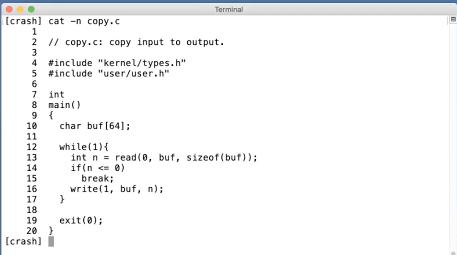
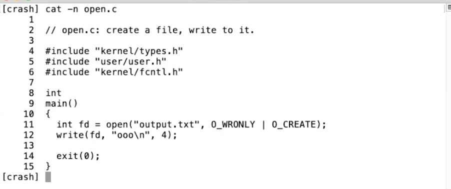
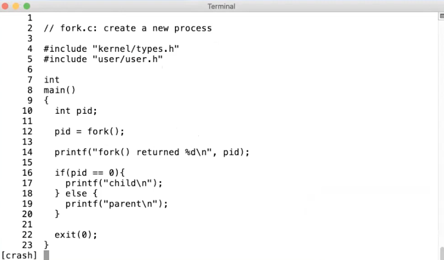
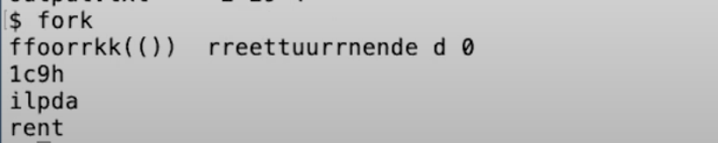
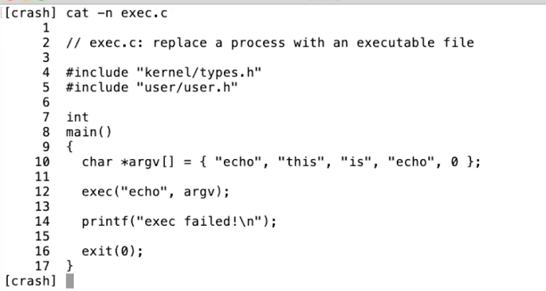
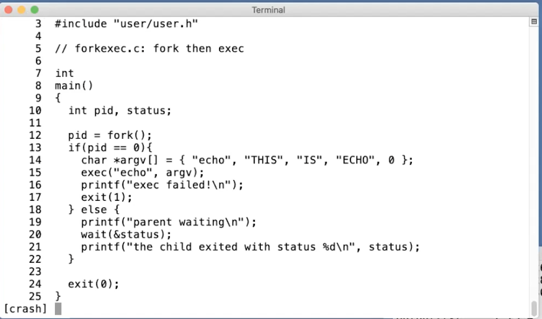
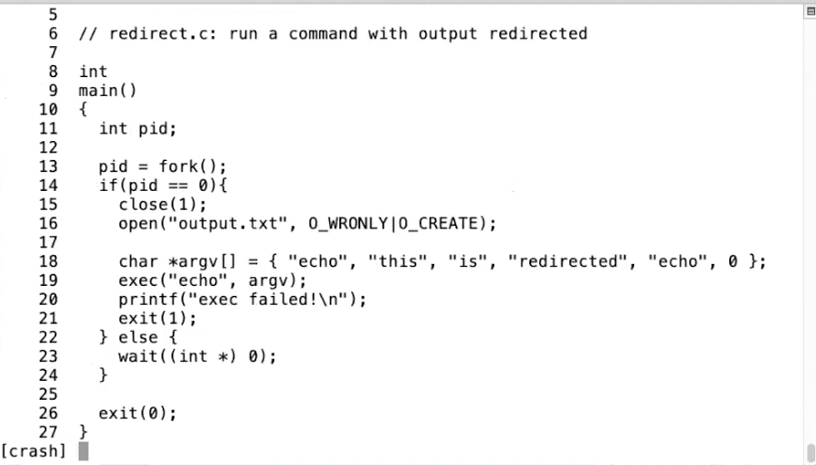
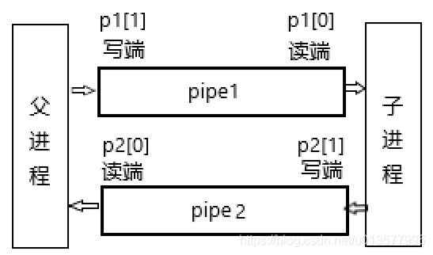

# MIT 6.S081

## Lec01 Introduction and Examples

### 1.1 课程内容简介

**课程目标**

1. 理解操作系统的设计和实现。设计是指整体的结构，实现是指具体的代码。
2. 为了深入了解具体的工作原理，通过一个小的XV6的操作系统，获得实际动手经验。通过研究现有的操作系统，并结合课程配套的实验，可以获得扩展操作系统，修改并提升操作系统的相关经验，并且能够通过操作系统接口，编写系统软件。

**操作系统的目标**

1. **抽象硬件**。
2. **在多个应用程序之间共用硬件资源**。
3. **隔离性**（Isolation），不同的活动之间不能相互干扰。
4. 不同的活动实现**共享（Sharing）**。
5. 希望在没有必要的时候不共享。**Security或者Permission System或者是Access Control System**。
6. **高性能（Performance）**。
7. **必须要支持大量不同类型的应用程序**。

### 1.2 操作系统结构

矩阵表示计算机，这个计算机有一些硬件资源，我会将它放在矩形的下面，硬件资源包括了CPU，内存，磁盘，网卡。所以硬件资源在最低一层。

#### 用户空间

在这个架构的最上层，我们会运行各种各样的应用程序，或许有一个文本编辑器（VI），或许有一个C编译器（CC），**你还可以运行作为CLI存在的Shell**，所以这些就是正在运行的所有程序。这里程序都运行在同一个空间中，这个空间通常会被称为**用户空间（Userspace）**。

#### kernel

区别于用户空间程序，有一个特殊的程序总是会在运行，它称为**Kernel**。Kernel是计算机资源的守护者。当你打开计算机时，Kernel总是第一个被启动。**Kernel程序只有一个，它维护数据来管理每一个用户空间进程。Kernel同时还维护了大量的数据结构来帮助它管理各种各样的硬件资源，以供用户空间的程序使用。**Kernel同时还有大量内置的服务，例如，**Kernel通常会有文件系统实现类似文件名，文件内容，目录的东西，并理解如何将文件存储在磁盘中。所以用户空间的程序会与Kernel中的文件系统交互，文件系统再与磁盘交互。**

在这门课程中，我们**主要关注点在Kernel、连接Kernal和用户空间程序的接口、Kernel内软件的架构**。所以，我们会关心Kernel中的服务，其中一个服务是**文件系统**，另一个就是**进程管理系统**。**每一个用户空间程序都被称为一个进程，它们有自己的内存和共享的CPU时间**。同时，**Kernel会管理内存的分配。不同的进程需要不同数量的内存，Kernel会复用内存、划分内存，并为所有的进程分配内存。**

文件系统通常有一些逻辑分区。目前而言，我们可以认为**文件系统的作用是管理文件内容并找出文件具体在磁盘中的哪个位置**。文件系统还维护了一个独立的命名空间，其中每个文件都有文件名，并且命名空间中有一个层级的目录，每个目录包含了一些文件。所有这些都被文件系统所管理。

这里还有一些安全的考虑，我们可以称之为**Access Control。当一个进程想要使用某些资源时，比如读取磁盘中的数据，使用某些内存，Kernel中的Access Control机制会决定是否允许这样的操作**。对于一个分时共享的计算机，例如Athena系统，这里可能会变得很复杂。因为在Athena系统中，每一个进程可能属于不同的用户，因此会有不同Access规则来约定哪些资源可以被访问。

在一个真实的完备的操作系统中，会有很多很多其他的服务，比如在不同进程之间通信的进程间通信服务，比如一大票与网络关联的软件（TCP/IP协议栈），比如支持声卡的软件，比如支持数百种不同磁盘，不同网卡的驱动。所以在一个完备的系统中，Kernel会包含大量的内容，数百万行代码。

#### API-kernel

我们同时也对应用程序是如何与Kernel交互，它们之间的接口长什么样感兴趣。这里通常成为Kernel的API，它决定了应用程序如何访问Kernel。通常来说，这里是通过所谓的**系统调用（System Call）**来完成。系统调用与程序中的函数调用看起来是一样的，但区别是**系统调用会实际运行到系统内核中，并执行内核中对于系统调用的实现**。现在只介绍一些系统调用在应用程序中是长什么样的。

> **Q: 系统调用跳到内核与标准的函数调用跳到另一个函数相比，区别是什么？**
>
> A: Kernel的代码总是有特殊的权限。当机器启动Kernel时，Kernel会有特殊的权限能直接访问各种各样的硬件，例如磁盘。而普通的用户程序是没有办法直接访问这些硬件的。所以，**当你执行一个普通的函数调用时，你所调用的函数并没有对于硬件的特殊权限。然而，如果你触发系统调用到内核中，内核中的具体实现会具有这些特殊的权限，这样就能修改敏感的和被保护的硬件资源，比如访问硬件磁盘。**

第一个例子是，如果应用程序需要打开一个文件，它会调用名为open的系统调用，并且把文件名作为参数传给open。假设现在要打开一个名为“out”的文件，那么会将文件名“out”作为参数传入。同时我们还希望写入数据，那么还会有一个额外的参数，在这里这个参数的值是1，表明我想要写文件。

~~~C
fd=open("out",1);
~~~

open是一个系统调用，它会跳到Kernel，Kernel可以获取到open的参数，执行一些实现了open的Kernel代码，或许会与磁盘有一些交互，最后返回一个**文件描述符对象**。上图中的fd全称就是**file descriptor**。**之后，应用程序可以使用这个文件描述符作为handle，来表示相应打开的文件。**

如果你想要向文件写入数据，相应的系统调用是write。你需要向write传递一个由open返回的文件描述符作为参数。你还需要向write传递一个指向要写入数据的指针（数据通常是char型序列），在C语言中，可以简单传递一个双引号表示的字符串（下图中的\n表示是换行）。第三个参数是你想要写入字符的数量。

~~~C
write(fd,"hello\n",6);
~~~

**第二个参数的指针，实际上是内存中的地址。所以这里实际上告诉内核，将内存中这个地址起始的6个字节数据写入到fd对应的文件中。**

另一个你可能会用到的，更有意思的系统调用是fork。**fork是一个这样的系统调用，它创建了一个与调用进程一模一样的新的进程，并返回新进程的process ID/pid**。这里实际上会复杂的多，我们后面会有更多的介绍。

~~~C
pid=fork();
~~~

### 1.3 Why Hard and Interesting

1. 内核的编程环境比较困难。
2. 你需要满足一些列矛盾的需求。
3. 你想要你的操作系统既高效又易用。高效通常意味着操作系统需要在离硬件近的low-level进行操作，而易用则要求操作系统为应用程序提供抽象的high-level可移植接口。
4. 我们想要提供一个非常强大的操作系统服务，这样操作系统才能分担运行应用程序的负担。但同时，我们也想要有简单的接口。我们不想程序员看到数量巨多，复杂且难以理解的的内核接口。
5. 是所有的操作系统需要满足的。你希望给与应用程序尽可能多的灵活性，你不会想要限制应用程序，所以你需要内核具备灵活的接口。但是另一方面，你想要安全性，就需要在某种程度上限制应用程序。
6. 操作系统提供了大量的特性和大量的服务，但是它们趋向于相互交互。
7. 操作系统需要能够满足广泛的使用场景。

### 1.5 read, write, exit系统调用

我们的**操作系统是XV6，它运行在RISC-V微处理器上**，当然不只是RISC-V微处理器，我们假设有一定数量的其他硬件存在，例如内存，磁盘和一个console接口，这样我们才能跟操作系统进行交互。但是实际上，**XV6运行在QEMU模拟器之上。**这样能在没有特定硬件的前提下，运行XV6。

这个程序里面执行了3个系统调用，分别时read，write和exit。

read接收3个参数：

1. 第一个参数是**文件描述符**，指向一个之前打开的文件。Shell会确保默认情况下，**当一个程序启动时，文件描述符0连接到console的输入，文件描述符1连接到了console的输出。**所以我可以通过这个程序看到console打印我的输入。当然，这里的程序会预期文件描述符已经被Shell打开并设置好。这里的0，1文件描述符是非常普遍的Unix风格，许多的Unix系统都会从文件描述符0读取数据，然后向文件描述符1写入数据。
2. read的第二个参数是指向某段内存的指针，程序可以通过指针对应的地址读取内存中的数据，这里的指针就是代码中的buf参数。在代码第10行，程序在栈里面申请了64字节的内存，并将指针保存在buf中，这样read可以将数据保存在这64字节中。
3. read的第三个参数是代码想读取的最大长度，sizeof(buf)表示，最多读取64字节的数据，所以这里的read最多只能从连接到文件描述符0的设备，也就是console中，读取64字节的数据。

read的返回值可能是读到的字节数。read可能从一个文件读数据，如果到达了文件的结尾没有更多的内容了，read会返回0。**如果出现了一些错误，比如文件描述符不存在，read或许会返回-1。**

这里的copy程序，或者说read，write系统调用，它们并不关心读写的数据格式，它们就是单纯的读写，而copy程序会按照8bit的字节流（**字节流就是一段连续的数据按照字节的长度读取**）处理数据，你怎么解析它们，完全是用应用程序决定的。

### 1.6 open系统调用

这个叫做open的程序，会创建一个叫做output.txt的新文件，并向它写入一些数据，最后退出。我们看不到任何输出，因为它只是向打开的文件中写入数据。

但是我们可以查看output.txt的内容

所以，代码中的第11行，执行了open系统调用，将文件名output.txt作为参数传入，**第二个参数是一些标志位，用来告诉open系统调用在内核中的实现：我们将要创建并写入一个文件。open系统调用会返回一个新分配的文件描述符**，这里的文件描述符是一个小的数字，可能是2，3，4或者其他的数字。

**文件描述符本质上对应了内核中的一个表单数据。内核维护了每个运行进程的状态，内核会为每一个运行进程保存一个表单，表单的key是文件描述符。这个表单让内核知道，每个文件描述符对应的实际内容是什么**。这里比较关键的点是，**每个进程都有自己独立的文件描述符空间，所以如果运行了两个不同的程序，对应两个不同的进程，如果它们都打开一个文件，它们或许可以得到相同数字的文件描述符，但是因为内核为每个进程都维护了一个独立的文件描述符空间，这里相同数字的文件描述符可能会对应到不同的文件。**

### 1.7 Shell

相对图形化用户接口来说，这里的**Shell通常也是人们说的命令行接口**。**Shell是一种对于Unix系统管理来说非常有用的接口， 它提供了很多工具来管理文件，编写程序，编写脚本。**通常来说，**当你输入内容时，你是在告诉Shell运行相应的程序。所以当我输入ls时，实际的意义是我要求Shell运行名为ls的程序，文件系统中会有一个文件名为ls，这个文件中包含了一些计算机指令，所以实际上，当我输入ls时，我是在要求Shell运行位于文件ls内的这些计算机指令。**

除了运行程序以外，Shell还会做一些其他的事情，比如，它允许你能**重定向IO**。比如，我输入 ls > out。这里的实际意义是，我要求Shell运行ls命令，但是将输出重定向到一个叫做out的文件中。现在我们知道out文件包含了一些数据，我们可以通过cat指令读取一个文件，并显示文件的内容。

~~~shell
ls > out
cat out
grep x
grep x < out
~~~

grep指令是将x作为参数传给grep。grep x会搜索输入中包含x的行，我可以告诉shell将输入重定向到文件out，这样我们就可以查看out中的x。

> **Q：编译器如何处理系统调用？生成的汇编语言是不是会调用一些由操作系统定义的代码段？**
>
> A：**有一个特殊的RISC-V指令，程序可以调用这个指令，并将控制权交给内核**。所以，实际上当你运行C语言并执行例如open或者write的系统调用时，**从技术上来说，open是一个C函数，但是这个函数内的指令实际上是机器指令，也就是说我们调用的open函数并不是一个C语言函数，它是由汇编语言实现，组成这个系统调用的汇编语言实际上在RISC-V中被称为ecall**。这个特殊的指令将控制权转给内核。之后内核检查进程的内存和寄存器，并确定相应的参数。

### 1.8 fork系统调用

在第12行，我们调用了fork。fork会拷贝当前进程的内存，并创建一个新的进程，这里的内存包含了进程的指令和数据。之后，我们就有了两个拥有完全一样内存的进程。fork系统调用在两个进程中都会返回，在原始的进程中，fork系统调用会返回大于0的整数，这个是新创建进程的ID。而在新创建的进程中，fork系统调用会返回0。所以即使两个进程的内存是完全一样的，我们还是可以通过fork的返回值区分旧进程和新进程。

输出看起来像是垃圾数据。这里实际发生的是，**fork系统调用之后，两个进程都在同时运行**，QEMU实际上是在模拟多核处理器，所以这两个进程实际上就是同时在运行。所以当这两个进程在输出的时候，它们会同时一个字节一个字节的输出，两个进程的输出交织在一起，所以你可以看到两个f，两个o等等。

fork创建了一个新的进程。当我们在Shell中运行东西的时候，Shell实际上会创建一个新的进程来运行你输入的每一个指令。所以，当我输入ls时，我们需要Shell通过fork创建一个进程来运行ls，这里需要某种方式来让这个新的进程来运行ls程序中的指令，加载名为ls的文件中的指令（也就是后面的exec系统调用）。

### 1.9 exec, wait系统调用

echo是一个非常简单的命令，它接收任何你传递给它的输入，并将输入写到输出。

**代码会执行exec系统调用，这个系统调用会从指定的文件中读取并加载指令，并替代当前调用进程的指令。从某种程度上来说，这样相当于丢弃了调用进程的内存，并开始执行新加载的指令。**所以第12行的系统调用exec会有这样的效果：操作系统从名为echo的文件中加载指令到当前的进程中，并替换了当前进程的内存，之后开始执行这些新加载的指令。同时，你可以传入命令行参数，exec允许你传入一个命令行参数的数组，这里就是一个C语言中的指针数组，在上面代码的第10行设置好了一个字符指针的数组，这里的字符指针本质就是一个字符串（string）。所以这里等价于运行echo命令，并带上“this is echo” 这三个参数。所以当我运行exec文件

有关exec系统调用，有一些重要的事情，

1. **exec系统调用会保留当前的文件描述符表单。所以任何在exec系统调用之前的文件描述符，例如0，1，2等。它们在新的程序中表示相同的东西。**
2. **通常来说exec系统调用不会返回，因为exec会完全替换当前进程的内存，相当于当前进程不复存在了，所以exec系统调用已经没有地方能返回了**。

所以，exec系统调用从文件中读取指令，执行这些指令，然后就没有然后了。**exec系统调用只会当出错时才会返回，因为某些错误会阻止操作系统为你运行文件中的指令，例如程序文件根本不存在，因为exec系统调用不能找到文件，exec会返回-1来表示：出错了，我找不到文件。**

实际上，当我们在Shell中运行类似于“echo a b c”的指令，或者ls，或者任何命令，我们不会想要代替Shell进程，这时，Shell会执行fork，之后fork出的子进程再调用exec系统调用，这是一个非常常见的Unix程序调用风格。对于那些想要运行程序，但是还希望能拿回控制权的场景，可以先执行fork系统调用，然后在子进程中调用exec。

**Unix提供了一个wait系统调用，如第20行所示。wait会等待之前创建的子进程退出**。当我在命令行执行一个指令时，我们一般会希望Shell等待指令执行完成。所以wait系统调用，使得父进程可以等待任何一个子进程返回。**这里wait的参数status，是一种让退出的子进程以一个整数（32bit的数据）的格式与等待的父进程通信方式**。所以在第17行，**exit的参数是1，操作系统会将1从退出的子进程传递到第20行，也就是等待的父进程处。&status，是将status对应的地址传递给内核，内核会向这个地址写入子进程向exit传入的参数。**

Unix中的风格是，**如果一个程序成功的退出了，那么exit的参数会是0，如果出现了错误，那么就会像第17行一样，会向exit传递1。所以，如果你关心子进程的状态的话，父进程可以读取wait的参数，并决定子进程是否成功的完成了。**

**注意代码并不会走到第16，17行，exec系统调用只会在出错的时候返回给调用进程。**

先调用fork，再在子进程中调用exec。这里实际上有些浪费，**fork首先拷贝了整个父进程的，但是之后exec整个将这个拷贝丢弃了，并用你要运行的文件替换了内存的内容。**某种程度上来说这里的拷贝操作浪费了，因为所有拷贝的内存都被丢弃并被exec替换。**在大型程序中这里的影响会比较明显**。

在这门课程的后面，你们会实现一些优化，比如说copy-on-write fork，这种方式会消除fork的几乎所有的明显的低效，而只拷贝执行exec所需要的内存，这里需要很多涉及到虚拟内存系统的技巧。你可以构建一个fork，对于内存实行lazy拷贝，通常来说fork之后立刻是exec，这样你就不用实际的拷贝，因为子进程实际上并没有使用大部分的内存。

> **Q：为什么父进程在子进程调用exec之前就打印了“parent waiting”？**
>
> A：这里只是巧合。父进程的输出有可能与子进程的输出交织在一起，就像我们之前在fork的例子中看到的一样，只是这里正好没有发生而已。并不是说我们一定能看到上面的输出，实际上，如果看到其他的输出也不用奇怪。我怀疑这里背后的原因是，**exec系统调用代价比较高，它需要访问文件系统，访问磁盘，分配内存，并读取磁盘中echo文件的内容到分配的内存中，分配内存又可能需要等待内存释放。所以，exec系统调用背后会有很多逻辑，很明显，处理这些逻辑的时间足够长，这样父进程可以在exec开始执行echo指令之前完成输出。**
>
> **Q：子进程可以等待父进程吗？**
>
> A：不可能让子进程等待父进程退出。
>
> **Q：如果父进程有多个子进程，wait是不是会在第一个子进程完成时就退出？这样的话，还有一些与父进程交错运行的子进程，是不是需要有多个wait来确保所有的子进程都完成？**
>
> A：是的，如果一个进程调用fork两次，如果它想要等两个子进程都退出，它需要调用wait两次。**每个wait会在一个子进程退出时立即返回。当wait返回时，你实际上没有必要知道哪个子进程退出了，但是wait返回了子进程的进程号，所以在wait返回之后，你就可以知道是哪个子进程退出了。**

### 1.10 I/O Redirect

~~~shell
echo hello > out
~~~

Shell会将echo的输出送到文件out。之后我们可以运行cat指令，并将out文件作为输入

~~~shell
cat < out
~~~

我们可以看到保存在out文件中的内容就是echo指令的输出。

**Shell之所以有这样的能力，是因为Shell首先会像第13行一样fork，然后在子进程中，Shell改变了文件描述符。文件描述符1通常是进程用来作为输出的（也就是console的输出文件符），Shell会将文件描述符1改为output文件，之后再运行你的指令。**同时，父进程的文件描述符1并没有改变。**所以这里先fork，再更改子进程的文件描述符，是Unix中的常见的用来重定向指令的输入输出的方法**。

如果我运行整个程序redirect程序，可以看到没有任何的输出。但是实际上redirect程序里面运行了echo，只是echo的输出重定向到了output.txt。如果我们查看output.txt，

我们可以看到预期的输出。**代码第15行的close(1)的意义是，我们希望文件描述符1指向一个其他的位置。也就是说，在子进程中，我们不想使用原本指向console输出的文件描述符1。**

**代码第16行的open一定会返回1，因为open会返回当前进程未使用的最小文件描述符序号。因为我们刚刚关闭了文件描述符1，而文件描述符0还对应着console的输入，所以open一定可以返回1。在代码第16行之后，文件描述符1与文件output.txt关联。**

之后我们执行exec(echo)，echo会输出到文件描述符1，也就是文件output.txt。这里有意思的地方是，**echo根本不知道发生了什么，echo也没有必要知道I/O重定向了，它只是将自己的输出写到了文件描述符1。只有Shell知道I/O重定向了。**

### lab1 Xv6 and Unix utilities

#### xv6中shell解析

shell也是一个用户进程，不过在xv6启动后就运行了。源码为user/sh.c，入口函数在145行。在shell下输入命令行，shell程序读取输入内容，通过调用fork（system call）开启一个shell的子进程，shell进程利用wait（system call），等待子进程执行完后继续执行。

~~~C
//创建子进程
//父进程中fork1()返回创建的子进程pid；子进程中fork1执行成功返回0。所以子进程才会执行runcmd()
if(fork1() == 0)
	  //在子进程中执行shell中输入的程序
      runcmd(parsecmd(buf));
//父进程等待子进程执行结束
wait(0);
~~~

#### pingpong

写一个程序，使用unix system calls在两个进程间”ping-pong“一个字节，使用一对pipe，一个pipe对应一个方向，另外一个pipe对应另外一个方向。

~~~c
#include <kernel/types.h>
#include <user/user.h>

/*
 xv6可运行
 chapter01: ping pong练习程序
*/
int main(){
    //pipe1(p1)：写端父进程，读端子进程
    //pipe2(p2)；写端子进程，读端父进程
    int p1[2],p2[2];
    //来回传输的字符数组：一个字节
    char buffer[] = {'X'};
    //传输字符数组的长度
    long length = sizeof(buffer);
    //父进程写，子进程读的pipe
    pipe(p1);
    //子进程写，父进程读的pipe
    pipe(p2);
    //子进程
    if(fork() == 0){
        //关掉不用的p1[1]、p2[0]
        close(p1[1]);
        close(p2[0]);
		//子进程从pipe1的读端，读取字符数组
		if(read(p1[0], buffer, length) != length){
			printf("a--->b read error!");
			exit(1);
		}
		//打印读取到的字符数组
		printf("%d: received ping\n", getpid());
		//子进程向pipe2的写端，写入字符数组
		if(write(p2[1], buffer, length) != length){
			printf("a<---b write error!");
			exit(1);
		}
        exit(0);
    }
    //关掉不用的p1[0]、p2[1]
    close(p1[0]);
    close(p2[1]);
	//父进程向pipe1的写端，写入字符数组
	if(write(p1[1], buffer, length) != length){
		printf("a--->b write error!");
		exit(1);
	}
	//父进程从pipe2的读端，读取字符数组
	if(read(p2[0], buffer, length) != length){
		printf("a<---b read error!");
		exit(1);
	}
	//打印读取的字符数组
	printf("%d: received pong\n", getpid());
    //等待进程子退出
    wait(0);
	exit(0);
}
~~~

~~~c
int pipe(int fds[2]);
//参数：
//fd[0] 将是管道读取端的fd（文件描述符）
//fd[1] 将是管道写入端的fd
//返回值：0表示成功，-1表示失败。
~~~

#### sleep

~~~C++
#include "kernel/types.h"
#include "user/user.h"

int main(int argn, char *argv[]){
	if(argn != 2){
		fprintf(2, "must 1 argument for sleep\n");
		exit(1);
	}
	int sleepNum = atoi(argv[1]);
	printf("(nothing happens for a little while)\n");
	sleep(sleepNum);
	exit(0);
}
~~~

~~~C
fprintf(2, "must 1 argument for sleep\n");//2是指文件流
~~~

#### primes

将2-35中的素数打印出来，要求利用管道理念。(递归实现)

~~~C
#include "kernel/types.h"
#include "user/user.h"

void func(int *input, int num){
	if(num == 1){
		printf("prime %d\n", *input);
		return;
	}
	int p[2],i;
	int prime = *input;
	int temp;
	printf("prime %d\n", prime);
	pipe(p);
    if(fork() == 0){
        for(i = 0; i < num; i++){
            temp = *(input + i);
			write(p[1], (char *)(&temp), 4);
		}
        exit(0);
    }
	close(p[1]);
	if(fork() == 0){
		int counter = 0;
		char buffer[4];
		while(read(p[0], buffer, 4) != 0){
			temp = *((int *)buffer);
			if(temp % prime != 0){
				*input = temp;
				input += 1;
				counter++;
			}
		}
		func(input - counter, counter);
		exit(0);
    }
	wait(0);
	wait(0);
}

int main(){
    int input[34];
	int i = 0;
	for(; i < 34; i++){
		input[i] = i+2;
	}
	func(input, 34);
    exit(0);
}
~~~

#### find

实现find ，即在某个路径中，找出某个文件

~~~c
#include "kernel/types.h"
#include "kernel/fcntl.h"
#include "kernel/stat.h"
#include "kernel/fs.h"
#include "user/user.h"

//将路径格式化为文件名
char* fmt_name(char *path){
  static char buf[DIRSIZ+1];
  char *p;

  //在最后一个斜杠之后查找第一个字符。
  for(p=path+strlen(path); p >= path && *p != '/'; p--);
  p++;
  memmove(buf, p, strlen(p)+1);
  return buf;
}
/*
	系统文件名与要查找的文件名，若一致，打印系统文件完整路径
*/
void eq_print(char *fileName, char *findName){
	if(strcmp(fmt_name(fileName), findName) == 0){
		printf("%s\n", fileName);
	}
}
/*
	在某路径中查找某文件
*/
void find(char *path, char *findName){
	int fd;
	struct stat st;	
	if((fd = open(path, O_RDONLY)) < 0){
		fprintf(2, "find: cannot open %s\n", path);
		return;
	}
	if(fstat(fd, &st) < 0){
		fprintf(2, "find: cannot stat %s\n", path);
		close(fd);
		return;
	}
	char buf[512], *p;	
	struct dirent de;
	switch(st.type){	
		case T_FILE://文件
			eq_print(path, findName);			
			break;
		case T_DIR://路径
			if(strlen(path) + 1 + DIRSIZ + 1 > sizeof buf){
				printf("find: path too long\n");
				break;
			}
			strcpy(buf, path);
			p = buf+strlen(buf);
			*p++ = '/';
			while(read(fd, &de, sizeof(de)) == sizeof(de)){//用于获取目录内的所有
				//printf("de.name:%s, de.inum:%d\n", de.name, de.inum);
				if(de.inum == 0 || de.inum == 1 || strcmp(de.name, ".")==0 || strcmp(de.name, "..")==0)
					continue;				
				memmove(p, de.name, strlen(de.name));
				p[strlen(de.name)] = 0;
				find(buf, findName);
			}
			break;
	}
	close(fd);	
}

int main(int argc, char *argv[]){
	if(argc < 3){
		printf("find: find <path> <fileName>\n");
		exit(0);
	}
	find(argv[1], argv[2]);
	exit(0);
}
~~~

~~~C
//struct stat这个结构体是用来描述一个linux系统中文件系统的文件属性的结构，可以通过两种方法来获取一个文件的属性
//1、通过路径：
int stat(const char *path, struct stat *struct_stat);
int lstat(const char *path,struct stat *struct_stat);
//两个函数的第一个参数都是文件的路径，第二个参数是struct stat的指针。返回值为0，表示成功执行。
//2、通过文件描述符
int fstat(int fdp, struct stat *struct_stat);　　//通过文件描述符获取文件对应的属性。fdp为文件描述符

void *memmove(void *str1, const void *str2, size_t n);//从 str2 复制 n 个字符到 str1，但是在重叠内存块这方面，memmove() 是比 memcpy() 更安全的方法。如果目标区域和源区域有重叠的话，memmove() 能够保证源串在被覆盖之前将重叠区域的字节拷贝到目标区域中，复制后源区域的内容会被更改。
~~~

#### xargs

实现类似unix xargs类似功能，比如echo hello too|xargs echo bye，要输出bye hello too，即等价于echo bye hello too，将上个命令输出的每行作为参数，拼接到xargs后面的指令后面。
echo hello too输出为hello too，将其拼接到echo bye后面，就是echo bye hello too。

~~~C
#include "kernel/types.h"
#include "user/user.h"

int main(int argc, char *argv[]){
    int i;
    int j = 0;
    int k;
    int l,m = 0;
    char block[32];
    char buf[32];
    char *p = buf;
    char *lineSplit[32];
    for(i = 1; i < argc; i++){
        lineSplit[j++] = argv[i];
    }
    while( (k = read(0, block, sizeof(block))) > 0){
        for(l = 0; l < k; l++){
            if(block[l] == '\n'){
                buf[m] = 0;
                m = 0;
                lineSplit[j++] = p;
                p = buf;
                lineSplit[j] = 0;
                j = argc - 1;
                if(fork() == 0){
                    exec(argv[1], lineSplit);
                }                
                wait(0);
            }else if(block[l] == ' ') {
                buf[m++] = 0;
                lineSplit[j++] = p;
                p = &buf[m];
            }else {
                buf[m++] = block[l];
            }
        }
    }
    exit(0);
}
~~~

## Lec03 OS Organization and System Calls (Frans)

这节课的内容是操作系统的组织结构。主要讨论4个话题：

1. **Isolation。隔离性是设计操作系统组织结构的驱动力。**
2. **Kernel和User mode**。这两种模式用来隔离操作系统内核和用户应用程序。
3. **System calls**。系统调用是你的应用程序能够转换到内核执行的基本方法，这样你的用户态应用程序才能使用内核服务。
4. 最后我们会看到**所有的这些是如何以一种简单的方式在XV6中实现**。

### 3.1 操作系统的隔离性

#### 为什么需要隔离性？

1. **不同的应用程序之间有强隔离性**，这样某个应用程序出了问题不会杀掉其他进程。
2. 应用程序和操作系统之间有强隔离性，应用程序出现问题操作系统也不会崩溃。

通常来说，如果没有操作系统，应用程序会直接与硬件交互。比如，应用程序可以直接看到CPU的多个核，看到磁盘，内存。所以现在应用程序和硬件资源之间没有一个额外的抽象层，如下图所示。

#### multiplexing和内存隔离

**使用操作系统的一个目的是为了同时运行多个应用程序，CPU会从一个应用程序切换到另一个应用程序**。我们假设硬件资源里只有一个CPU核，并且我们现在在这个CPU核上运行Shell。但是时不时的，也需要让其他的应用程序也可以运行。**现在我们没有操作系统来帮我们完成切换，所以Shell就需要时不时的释放CPU资源。**

为了不变成一个恶意程序，Shell在发现自己运行了一段时间之后，需要让别的程序也有机会能运行。这种机制有时候称为**协同调度**（Cooperative Scheduling）。但是这里的场景并没有很好的隔离性，比如说**Shell中的某个函数有一个死循环，那么Shell永远也不会释放CPU，进而其他的应用程序也不能够运行，甚至都不能运行一个第三方的程序来停止或者杀死Shell程序。**所以这种场景下，我们基本上得不到真正的multiplexing（CPU在多进程同分时复用）。而这个特性是非常有用的，**不论应用程序在执行什么操作，multiplexing（CPU在多进程同分时复用）都会迫使应用程序时不时的释放CPU，这样其他的应用程序才能运行。**

从内存的角度来说，如果应用程序直接运行在硬件资源之上，那么每个应用程序的文本，代码和数据都直接保存在物理内存中。因为两个应用程序的内存之间没有边界，如果echo程序将数据存储在属于Shell的一个内存地址中（下图中的1000），那么就echo就会覆盖Shell程序内存中的内容。

**使用操作系统的一个原因，甚至可以说是主要原因就是为了实现multiplexing和内存隔离。**

接下来我们举几个例子。

之前通过fork创建了进程。进程本身不是CPU，但是它们对应了CPU，它们使得你可以在CPU上运行计算任务，**应用程序不能直接与CPU交互，只能与进程交互。操作系统内核会完成不同进程在CPU上的切换。所以，操作系统不是直接将CPU提供给应用程序，而是向应用程序提供“进程”，进程抽象了CPU，这样操作系统才能在多个应用程序之间复用一个或者多个CPU。**

> 多个进程不能同时使用一个CPU核

我们可以认为**exec抽象了内存**。当我们在执行**exec系统调用的时候，我们会传入一个文件名，而这个文件名对应了一个应用程序的内存镜像。内存镜像里面包括了程序对应的指令，全局的数据。应用程序可以逐渐扩展自己的内存，但是应用程序并没有直接访问物理内存的权限**，例如应用程序不能直接访问物理内存的1000-2000这段地址。不能直接访问的原因是，操作系统会提供内存隔离并控制内存，操作系统会在应用程序和硬件资源之间提供一个中间层。exec是这样一种系统调用，它表明了应用程序不能直接访问物理内存。

另一个例子是files，files基本上来说抽象了磁盘。应用程序不会直接读写挂在计算机上的磁盘本身，并且在Unix中这也是不被允许的。**在Unix中，与存储系统交互的唯一方式就是通过files。Files提供了非常方便的磁盘抽象，你可以对文件命名，读写文件等等。之后，操作系统会决定如何将文件与磁盘中的块对应，确保一个磁盘块只出现在一个文件中，并且确保用户A不能操作用户B的文件。通过files的抽象，可以实现不同用户之间和同一个用户的不同进程之间的文件强隔离。**

### 3.2 操作系统的防御性

**操作系统需要确保所有的组件都能工作，所以它需要做好准备抵御来自应用程序的攻击。**如果说应用程序无意或者恶意的向系统调用传入一些错误的参数就会导致操作系统崩溃，那就太糟糕了。

应用程序不能够打破对它的隔离。应用程序非常有可能是恶意的，它或许是由攻击者写出来的，攻击者或许想要打破对应用程序的隔离，进而控制内核。**一旦有了对于内核的控制能力，你可以做任何事情，因为内核控制了所有的硬件资源。**

**所有的处理器，如果需要运行能够支持多个应用程序的操作系统，需要同时支持user/kernle mode和虚拟内存**。

### 3.3 硬件对于强隔离的支持

硬件对于强隔离的支持包括了：user/kernle mode和虚拟内存。

#### user/kernle mode

为了支持user/kernel mode，处理器会有两种操作模式，第一种是user mode，第二种是kernel mode。**当运行在kernel mode时，CPU可以运行特定权限的指令（privileged instructions）；当运行在user mode时，CPU只能运行普通权限的指令（unprivileged instructions）**。

普通权限的指令都是一些你们熟悉的指令，例如将两个寄存器相加的指令ADD、将两个寄存器相减的指令SUB、跳转指令JRC、BRANCH指令等等。

**特殊权限指令主要是一些直接操纵硬件的指令和设置保护的指令**，例如设置page table寄存器、关闭时钟中断。在处理器上有各种各样的状态。

这里是硬件支持强隔离的一个方面。

> Q：如果kernel mode允许一些指令的执行，user mode不允许一些指令的执行，那么是谁在检查当前的mode并实际运行这些指令，并且怎么知道当前是不是kernel mode？
>
> A：是的，在处理器里面有一个flag。在处理器的一个bit，当它为1的时候是user mode，当它为0时是kernel mode。当处理器在解析指令时，如果指令是特殊权限指令，并且该bit被设置为1，处理器会拒绝执行这条指令，就像在运算时不能除以0一样。

实际上**RISC-V还有第三种模式称为machine mode。在大多数场景下，我们会忽略这种模式**。

> Q：考虑到安全性，所有的用户代码都会通过内核访问硬件，但是有没有可能一个计算机的用户可以随意的操纵内核？
>
> A：并不会，至少小心的设计就不会发生这种事。或许一些程序会有额外的权限，操作系统也会认可这一点。但是这些额外的权限并不会给每一个用户，比如只有root用户有特定的权限来完成安全相关的操作。
>
> Q：那BIOS呢？BIOS会在操作系统之前运行还是之后？
>
> A：BIOS是一段计算机自带的代码，它会先启动，之后它会启动操作系统，所以BIOS需要是一段可被信任的代码，它最好是正确的，且不是恶意的。
>
> Q：之前提到，设置处理器中kernel mode的bit位的指令是一条特殊权限指令，那么一个用户程序怎么才能让内核执行任何内核指令？因为现在切换到kernel mode的指令都是一条特殊权限指令了，对于用户程序来说也没法修改那个bit位。
>
> A：你说的对，这也是我们想要看到的结果。可以这么来看这个问题，首先这里不是完全按照你说的方式工作，**在RISC-V中，如果你在用户空间（user space）尝试执行一条特殊权限指令，用户程序会通过系统调用来切换到kernel mode。当用户程序执行系统调用，会通过ECALL触发一个软中断（software interrupt），软中断会查询操作系统预先设定的中断向量表，并执行中断向量表中包含的中断处理程序。中断处理程序在内核中，这样就完成了user mode到kernel mode的切换，并执行用户程序想要执行的特殊权限指令。**

#### 虚拟内存

基本上来说，处理器包含了page table，而page table将虚拟内存地址与物理内存地址做了对应。

**每一个进程都会有自己独立的page table，这样的话，每一个进程只能访问出现在自己page table中的物理内存。操作系统会设置page table，使得每一个进程都有不重合的物理内存**，这样一个进程就不能访问其他进程的物理内存，因为其他进程的物理内存都不在它的page table中。**一个进程甚至都不能随意编造一个内存地址，然后通过这个内存地址来访问其他进程的物理内存。这样就给了我们内存的强隔离性**。

基于硬件的支持，我们可以重新画一下之前的一张图，我们先画一个矩形，ls程序位于这个矩形中；再画一个矩形，echo程序位于这个矩形中。每个矩形都有一个虚拟内存地址，从0开始到2的n次方。

这样，ls程序有了一个内存地址0，echo程序也有了一个内存地址0。但是操作系统会将两个程序的内存地址0映射到不同的物理内存地址，所以ls程序不能访问echo程序的内存，同样echo程序也不能访问ls程序的内存。

### 3.4 User/Kernel mode切换

我们可以认为user/kernel mode是分隔用户空间和内核空间的边界，用户空间运行的程序运行在user mode，内核空间的程序运行在kernel mode。操作系统位于内核空间。

你们应该将这张图记在你们的脑子中。但是基于我们已经介绍的内容，这张图有点太过严格了。**因为我们用矩形包括了一个程序的所有部分，但是这里没有描述如何从一个矩形将控制权转移到另一个矩形的，而很明显这种转换是需要的。**

**需要有一种方式能够让应用程序可以将控制权转移给内核**（Entering Kernel）。

在RISC-V中，有一个专门的指令用来实现这个功能，叫做**ECALL**。ECALL接收一个数字参数，当一个用户程序想要将程序执行的控制权转移到内核，它只需要执行ECALL指令，并传入一个数字。这里的数字参数代表了应用程序想要调用的System Call。

在XV6中存在一个唯一的系统调用接入点，每一次应用程序执行ECALL指令，应用程序都会通过这个接入点进入到内核中。举个例子，**不论是Shell还是其他的应用程序，当它在用户空间执行fork时，它并不是直接调用操作系统中对应的函数，而是调用ECALL指令，并将fork对应的数字作为参数传给ECALL。之后再通过ECALL跳转到内核。**

下图中左边是用户空间，右边是内核空间。在内核侧，有一个位于syscall.c的函数syscall，每一个从应用程序发起的系统调用都会调用到这个syscall函数，syscall函数会检查ECALL的参数，通过这个参数内核可以知道需要调用的是fork。

**用户空间和内核空间的界限是一个硬性的界限，用户不能直接调用fork，用户的应用程序执行系统调用的唯一方法就是通过这里的ECALL指令。**

> Q：当应用程序表现的恶意或者就是在一个死循环中，内核是如何夺回控制权限的？
>
> A：内核会通过硬件设置一个定时器，定时器到期之后会将控制权限从用户空间转移到内核空间，之后内核就有了控制能力并可以重新调度CPU到另一个进程中。

### 3.5 宏内核 vs 微内核(Monolithic Kernel vs Micro Kernel)

现在，我们有了一种方法，可以通过系统调用或者说ECALL指令，将控制权从应用程序转到操作系统中。之后内核负责实现具体的功能并检查参数以确保不会被一些坏的参数所欺骗。所以**内核有时候也被称为可被信任的计算空间**（Trusted Computing Base），在一些安全的术语中也被称为TCB。

基本上来说，要被称为TCB，**内核首先要是正确且没有Bug的**。假设内核中有Bug，攻击者可能会利用那个Bug，并将这个Bug转变成漏洞，这个漏洞使得攻击者可以打破操作系统的隔离性并接管内核。

一个有趣的问题是，什么程序应该运行在kernel mode？敏感的代码肯定是运行在kernel mode，因为这是Trusted Computing Base。

其中一个选项是让整个操作系统代码都运行在kernel mode。大多数的Unix操作系统实现都运行在kernel mode。比如，XV6中，所有的操作系统服务都在kernel mode中，这种形式被称为**Monolithic Kernel Design**（宏内核）

1. 首先，如果考虑Bug的话，这种方式不太好。在一个宏内核中，任何一个操作系统的Bug都有可能成为漏洞。因为我们现在在内核中运行了一个巨大的操作系统，出现Bug的可能性更大了。如果有许多行代码运行在内核中，那么出现严重Bug的可能性也变得更大。所以从安全的角度来说，在内核中有大量的代码是宏内核的缺点。
2. 另一方面，如果你去看一个操作系统，它包含了各种各样的组成部分，比如说文件系统，虚拟内存，进程管理，这些都是操作系统内实现了特定功能的子模块。宏内核的优势在于，因为这些子模块现在都位于同一个程序中，**它们可以紧密的集成在一起，这样的集成提供很好的性能。**

另一种设计被称为**Micro Kernel Design**（微内核）。在这种模式下，希望在kernel mode中运行尽可能少的代码。所以这种设计下还是有内核，**但是内核只有非常少的几个模块**，例如，内核通常会有一些IPC的实现或者是Message passing；非常少的虚拟内存的支持，可能只支持了page table；以及分时复用CPU的一些支持。

微内核的目的在于将大部分的操作系统运行在内核之外。所以，我们还是会有user mode以及user/kernel mode的边界。但是我们现在会将原来在内核中的其他部分，作为普通的用户程序来运行。比如文件系统可能就是个常规的用户空间程序。

现在，文件系统运行的就像一个普通的用户程序，就像echo，Shell一样，这些程序都运行在用户空间。可能还会有一些其他的用户应用程序，例如虚拟内存系统的一部分也会以一个普通的应用程序的形式运行在user mode。

某种程度上来说，这是一种好的设计。因为在内核中的代码的数量较小，更少的代码意味着更少的Bug。

但是这种设计也有相应的问题。假设我们需要让Shell能与文件系统交互，比如Shell调用了exec，必须有种方式可以接入到文件系统中。通常来说，这里工作的方式是，Shell会通过内核中的IPC系统发送一条消息，内核会查看这条消息并发现这是给文件系统的消息，之后内核会把消息发送给文件系统。

文件系统会完成它的工作之后会向IPC系统发送回一条消息说，这是你的exec系统调用的结果，之后IPC系统再将这条消息发送给Shell。

所以，这里是典型的通过消息来实现传统的系统调用。现在，对于任何文件系统的交互，都需要分别完成2次用户空间<->内核空间的跳转。与宏内核对比，在宏内核中如果一个应用程序需要与文件系统交互，只需要完成1次用户空间<->内核空间的跳转，所以微内核的的跳转是宏内核的两倍。**通常微内核的挑战在于性能更差**，这里有两个方面需要考虑：

1. 在user/kernel mode反复跳转带来的性能损耗。
2. 在一个类似宏内核的紧耦合系统，各个组成部分，例如文件系统和虚拟内存系统，可以很容易的共享page cache。而在微内核中，每个部分之间都很好的隔离开了，这种共享更难实现。进而导致更难在微内核中得到更高的性能。

XV6是一个宏内核设计
