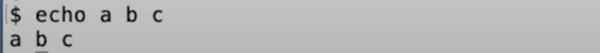
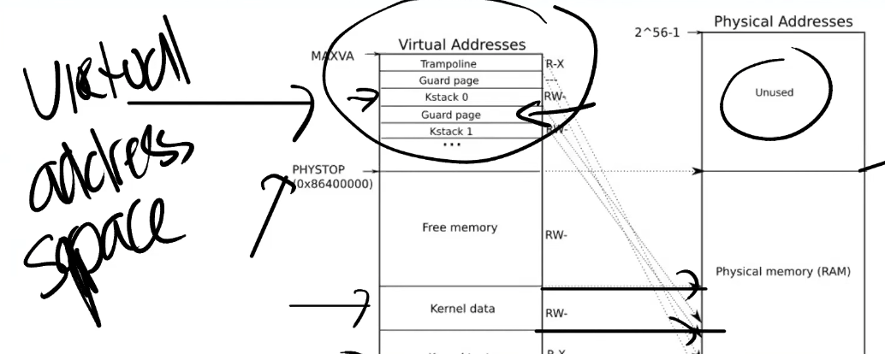

# MIT 6.S081

## Lec01 Introduction and Examples

### 1.1 课程内容简介

**课程目标**

1. 理解操作系统的设计和实现。设计是指整体的结构，实现是指具体的代码。
2. 为了深入了解具体的工作原理，通过一个小的XV6的操作系统，获得实际动手经验。通过研究现有的操作系统，并结合课程配套的实验，可以获得扩展操作系统，修改并提升操作系统的相关经验，并且能够通过操作系统接口，编写系统软件。

**操作系统的目标**

1. **抽象硬件**。
2. **在多个应用程序之间共用硬件资源**。
3. **隔离性**（Isolation），不同的活动之间不能相互干扰。
4. 不同的活动实现**共享（Sharing）**。
5. 希望在没有必要的时候不共享。**Security或者Permission System或者是Access Control System**。
6. **高性能（Performance）**。
7. **必须要支持大量不同类型的应用程序**。

### 1.2 操作系统结构

矩阵表示计算机，这个计算机有一些硬件资源，我会将它放在矩形的下面，硬件资源包括了CPU，内存，磁盘，网卡。所以硬件资源在最低一层。

#### 用户空间

在这个架构的最上层，我们会运行各种各样的应用程序，或许有一个文本编辑器（VI），或许有一个C编译器（CC），**你还可以运行作为CLI存在的Shell**，所以这些就是正在运行的所有程序。这里程序都运行在同一个空间中，这个空间通常会被称为**用户空间（Userspace）**。

#### kernel

区别于用户空间程序，有一个特殊的程序总是会在运行，它称为**Kernel**。Kernel是计算机资源的守护者。当你打开计算机时，Kernel总是第一个被启动。**Kernel程序只有一个，它维护数据来管理每一个用户空间进程。Kernel同时还维护了大量的数据结构来帮助它管理各种各样的硬件资源，以供用户空间的程序使用。**Kernel同时还有大量内置的服务，例如，**Kernel通常会有文件系统实现类似文件名，文件内容，目录的东西，并理解如何将文件存储在磁盘中。所以用户空间的程序会与Kernel中的文件系统交互，文件系统再与磁盘交互。** 

在这门课程中，我们**主要关注点在Kernel、连接Kernal和用户空间程序的接口、Kernel内软件的架构**。所以，我们会关心Kernel中的服务，其中一个服务是**文件系统**，另一个就是**进程管理系统**。**每一个用户空间程序都被称为一个进程，它们有自己的内存和共享的CPU时间**。同时，**Kernel会管理内存的分配。不同的进程需要不同数量的内存，Kernel会复用内存、划分内存，并为所有的进程分配内存。**

文件系统通常有一些逻辑分区。目前而言，我们可以认为**文件系统的作用是管理文件内容并找出文件具体在磁盘中的哪个位置**。文件系统还维护了一个独立的命名空间，其中每个文件都有文件名，并且命名空间中有一个层级的目录，每个目录包含了一些文件。所有这些都被文件系统所管理。

这里还有一些安全的考虑，我们可以称之为**Access Control。当一个进程想要使用某些资源时，比如读取磁盘中的数据，使用某些内存，Kernel中的Access Control机制会决定是否允许这样的操作**。对于一个分时共享的计算机，例如Athena系统，这里可能会变得很复杂。因为在Athena系统中，每一个进程可能属于不同的用户，因此会有不同Access规则来约定哪些资源可以被访问。

在一个真实的完备的操作系统中，会有很多很多其他的服务，比如在不同进程之间通信的进程间通信服务，比如一大票与网络关联的软件（TCP/IP协议栈），比如支持声卡的软件，比如支持数百种不同磁盘，不同网卡的驱动。所以在一个完备的系统中，Kernel会包含大量的内容，数百万行代码。

#### API-kernel

我们同时也对应用程序是如何与Kernel交互，它们之间的接口长什么样感兴趣。这里通常成为Kernel的API，它决定了应用程序如何访问Kernel。通常来说，这里是通过所谓的**系统调用（System Call）**来完成。系统调用与程序中的函数调用看起来是一样的，但区别是**系统调用会实际运行到系统内核中，并执行内核中对于系统调用的实现**。现在只介绍一些系统调用在应用程序中是长什么样的。

> **Q: 系统调用跳到内核与标准的函数调用跳到另一个函数相比，区别是什么？**
>
> A: Kernel的代码总是有特殊的权限。当机器启动Kernel时，Kernel会有特殊的权限能直接访问各种各样的硬件，例如磁盘。而普通的用户程序是没有办法直接访问这些硬件的。所以，**当你执行一个普通的函数调用时，你所调用的函数并没有对于硬件的特殊权限。然而，如果你触发系统调用到内核中，内核中的具体实现会具有这些特殊的权限，这样就能修改敏感的和被保护的硬件资源，比如访问硬件磁盘。**

第一个例子是，如果应用程序需要打开一个文件，它会调用名为open的系统调用，并且把文件名作为参数传给open。假设现在要打开一个名为“out”的文件，那么会将文件名“out”作为参数传入。同时我们还希望写入数据，那么还会有一个额外的参数，在这里这个参数的值是1，表明我想要写文件。

~~~C
fd=open("out",1);
~~~

open是一个系统调用，它会跳到Kernel，Kernel可以获取到open的参数，执行一些实现了open的Kernel代码，或许会与磁盘有一些交互，最后返回一个**文件描述符对象**。上图中的fd全称就是**file descriptor**。**之后，应用程序可以使用这个文件描述符作为handle，来表示相应打开的文件。**

如果你想要向文件写入数据，相应的系统调用是write。你需要向write传递一个由open返回的文件描述符作为参数。你还需要向write传递一个指向要写入数据的指针（数据通常是char型序列），在C语言中，可以简单传递一个双引号表示的字符串（下图中的\n表示是换行）。第三个参数是你想要写入字符的数量。

~~~C
write(fd,"hello\n",6);
~~~

**第二个参数的指针，实际上是内存中的地址。所以这里实际上告诉内核，将内存中这个地址起始的6个字节数据写入到fd对应的文件中。**

另一个你可能会用到的，更有意思的系统调用是fork。**fork是一个这样的系统调用，它创建了一个与调用进程一模一样的新的进程，并返回新进程的process ID/pid**。这里实际上会复杂的多，我们后面会有更多的介绍。

~~~C
pid=fork();
~~~

### 1.3 read, write, exit系统调用

我们的**操作系统是XV6，它运行在RISC-V微处理器上**，当然不只是RISC-V微处理器，我们假设有一定数量的其他硬件存在，例如内存，磁盘和一个console接口，这样我们才能跟操作系统进行交互。但是实际上，**XV6运行在QEMU模拟器之上。**这样能在没有特定硬件的前提下，运行XV6。

这个程序里面执行了3个系统调用，分别时read，write和exit。

read接收3个参数：

1. 第一个参数是**文件描述符**，指向一个之前打开的文件。Shell会确保默认情况下，**当一个程序启动时，文件描述符0连接到console的输入，文件描述符1连接到了console的输出。**所以我可以通过这个程序看到console打印我的输入。当然，这里的程序会预期文件描述符已经被Shell打开并设置好。这里的0，1文件描述符是非常普遍的Unix风格，许多的Unix系统都会从文件描述符0读取数据，然后向文件描述符1写入数据。
2. read的第二个参数是指向某段内存的指针，程序可以通过指针对应的地址读取内存中的数据，这里的指针就是代码中的buf参数。在代码第10行，程序在栈里面申请了64字节的内存，并将指针保存在buf中，这样read可以将数据保存在这64字节中。
3. read的第三个参数是代码想读取的最大长度，sizeof(buf)表示，最多读取64字节的数据，所以这里的read最多只能从连接到文件描述符0的设备，也就是console中，读取64字节的数据。

read的返回值可能是读到的字节数。read可能从一个文件读数据，如果到达了文件的结尾没有更多的内容了，read会返回0。**如果出现了一些错误，比如文件描述符不存在，read或许会返回-1。**

这里的copy程序，或者说read，write系统调用，它们并不关心读写的数据格式，它们就是单纯的读写，而copy程序会按照8bit的字节流（**字节流就是一段连续的数据按照字节的长度读取**）处理数据，你怎么解析它们，完全是用应用程序决定的。

**文件描述符本质上对应了内核中的一个表单数据。内核维护了每个运行进程的状态，内核会为每一个运行进程保存一个表单，表单的key是文件描述符。这个表单让内核知道，每个文件描述符对应的实际内容是什么**。这里比较关键的点是，**每个进程都有自己独立的文件描述符空间，所以如果运行了两个不同的程序，对应两个不同的进程，如果它们都打开一个文件，它们或许可以得到相同数字的文件描述符，但是因为内核为每个进程都维护了一个独立的文件描述符空间，这里相同数字的文件描述符可能会对应到不同的文件。**

### 1.4 Shell

相对图形化用户接口来说，这里的**Shell通常也是人们说的命令行接口**。**Shell是一种对于Unix系统管理来说非常有用的接口， 它提供了很多工具来管理文件，编写程序，编写脚本。**通常来说，**当你输入内容时，你是在告诉Shell运行相应的程序。所以当我输入ls时，实际的意义是我要求Shell运行名为ls的程序，文件系统中会有一个文件名为ls，这个文件中包含了一些计算机指令，所以实际上，当我输入ls时，我是在要求Shell运行位于文件ls内的这些计算机指令。**

除了运行程序以外，Shell还会做一些其他的事情，比如，它允许你能**重定向IO**。比如，我输入 ls > out。这里的实际意义是，我要求Shell运行ls命令，但是将输出重定向到一个叫做out的文件中。现在我们知道out文件包含了一些数据，我们可以通过cat指令读取一个文件，并显示文件的内容。

~~~shell
ls > out
cat out
grep x
grep x < out
~~~

grep指令是将x作为参数传给grep。grep x会搜索输入中包含x的行，我可以告诉shell将输入重定向到文件out，这样我们就可以查看out中的x。

### 1.5 fork系统调用

在第12行，我们调用了fork。fork会拷贝当前进程的内存，并创建一个新的进程，这里的内存包含了进程的指令和数据。之后，**我们就有了两个拥有完全一样内存的进程（新进程开始运行的位置也一样）**。fork系统调用在两个进程中都会返回，在原始的进程中，fork系统调用会返回大于0的整数，这个是新创建进程的ID。而在新创建的进程中，fork系统调用会返回0。所以即使两个进程的内存是完全一样的，我们还是可以通过fork的返回值区分旧进程和新进程。

输出看起来像是垃圾数据。这里实际发生的是，**fork系统调用之后，两个进程都在同时运行**，QEMU实际上是在模拟多核处理器，所以这两个进程实际上就是同时在运行。所以当这两个进程在输出的时候，它们会同时一个字节一个字节的输出，两个进程的输出交织在一起，所以你可以看到两个f，两个o等等。

fork创建了一个新的进程。当我们在Shell中运行东西的时候，Shell实际上会创建一个新的进程来运行你输入的每一个指令。所以，当我输入ls时，我们需要Shell通过fork创建一个进程来运行ls，这里需要某种方式来让这个新的进程来运行ls程序中的指令，加载名为ls的文件中的指令（也就是后面的exec系统调用）。

### 1.6 exec, wait系统调用

echo是一个非常简单的命令，它接收任何你传递给它的输入，并将输入写到输出。

**代码会执行exec系统调用，这个系统调用会从指定的文件中读取并加载指令，并替代当前调用进程的指令。从某种程度上来说，这样相当于丢弃了调用进程的内存，并开始执行新加载的指令。**所以第12行的系统调用exec会有这样的效果：操作系统从名为echo的文件中加载指令到当前的进程中，并替换了当前进程的内存，之后开始执行这些新加载的指令。同时，你可以传入命令行参数，exec允许你传入一个命令行参数的数组，这里就是一个C语言中的指针数组，在上面代码的第10行设置好了一个字符指针的数组，这里的字符指针本质就是一个字符串（string）。所以这里等价于运行echo命令，并带上“this is echo” 这三个参数。所以当我运行exec文件

有关exec系统调用，有一些重要的事情，

1. **exec系统调用会保留当前的文件描述符表单。所以任何在exec系统调用之前的文件描述符，例如0，1，2等。它们在新的程序中表示相同的东西。**
2. **通常来说exec系统调用不会返回，因为exec会完全替换当前进程的内存，相当于当前进程不复存在了，所以exec系统调用已经没有地方能返回了**。

所以，exec系统调用从文件中读取指令，执行这些指令，然后就没有然后了。**exec系统调用只会当出错时才会返回，因为某些错误会阻止操作系统为你运行文件中的指令，例如程序文件根本不存在，因为exec系统调用不能找到文件，exec会返回-1来表示：出错了，我找不到文件。**

实际上，当我们在Shell中运行类似于“echo a b c”的指令，或者ls，或者任何命令，我们不会想要代替Shell进程，这时，Shell会执行fork，之后fork出的子进程再调用exec系统调用，这是一个非常常见的Unix程序调用风格。对于那些想要运行程序，但是还希望能拿回控制权的场景，可以先执行fork系统调用，然后在子进程中调用exec。

**Unix提供了一个wait系统调用，如第20行所示。wait会等待之前创建的子进程退出**。当我在命令行执行一个指令时，我们一般会希望Shell等待指令执行完成。所以wait系统调用，使得父进程可以等待任何一个子进程返回。**这里wait的参数status，是一种让退出的子进程以一个整数（32bit的数据）的格式与等待的父进程通信方式**。所以在第17行，**exit的参数是1，操作系统会将1从退出的子进程传递到第20行，也就是等待的父进程处。&status，是将status对应的地址传递给内核，内核会向这个地址写入子进程向exit传入的参数。**

Unix中的风格是，**如果一个程序成功的退出了，那么exit的参数会是0，如果出现了错误，那么就会像第17行一样，会向exit传递1。所以，如果你关心子进程的状态的话，父进程可以读取wait的参数，并决定子进程是否成功的完成了。**

**注意代码并不会走到第16，17行，exec系统调用只会在出错的时候返回给调用进程。**

先调用fork，再在子进程中调用exec。这里实际上有些浪费，**fork首先拷贝了整个父进程的，但是之后exec整个将这个拷贝丢弃了，并用你要运行的文件替换了内存的内容。**某种程度上来说这里的拷贝操作浪费了，因为所有拷贝的内存都被丢弃并被exec替换。**在大型程序中这里的影响会比较明显**。

在这门课程的后面，你们会实现一些优化，比如说copy-on-write fork，这种方式会消除fork的几乎所有的明显的低效，而只拷贝执行exec所需要的内存，这里需要很多涉及到虚拟内存系统的技巧。你可以构建一个fork，对于内存实行lazy拷贝，通常来说fork之后立刻是exec，这样你就不用实际的拷贝，因为子进程实际上并没有使用大部分的内存。

> **Q：为什么父进程在子进程调用exec之前就打印了“parent waiting”？**
>
> A：这里只是巧合。父进程的输出有可能与子进程的输出交织在一起，就像我们之前在fork的例子中看到的一样，只是这里正好没有发生而已。并不是说我们一定能看到上面的输出，实际上，如果看到其他的输出也不用奇怪。我怀疑这里背后的原因是，**exec系统调用代价比较高，它需要访问文件系统，访问磁盘，分配内存，并读取磁盘中echo文件的内容到分配的内存中，分配内存又可能需要等待内存释放。所以，exec系统调用背后会有很多逻辑，很明显，处理这些逻辑的时间足够长，这样父进程可以在exec开始执行echo指令之前完成输出。**
>
> Q：子进程可以等待父进程吗？
>
> A：不可能让子进程等待父进程退出。
>
> **Q：如果父进程有多个子进程，wait是不是会在第一个子进程完成时就退出？这样的话，还有一些与父进程交错运行的子进程，是不是需要有多个wait来确保所有的子进程都完成？**
>
> A：是的，如果一个进程调用fork两次，如果它想要等两个子进程都退出，它需要调用wait两次。**每个wait会在一个子进程退出时立即返回。当wait返回时，你实际上没有必要知道哪个子进程退出了，但是wait返回了子进程的进程号，所以在wait返回之后，你就可以知道是哪个子进程退出了。**

### 1.7 I/O Redirect

~~~shell
echo hello > out
~~~

Shell会将echo的输出送到文件out。之后我们可以运行cat指令，并将out文件作为输入

~~~shell
cat < out
~~~

我们可以看到保存在out文件中的内容就是echo指令的输出。

**Shell之所以有这样的能力，是因为Shell首先会像第13行一样fork，然后在子进程中，Shell改变了文件描述符。文件描述符1通常是进程用来作为输出的（也就是console的输出文件符），Shell会将文件描述符1改为output文件，之后再运行你的指令。**同时，父进程的文件描述符1并没有改变。**所以这里先fork，再更改子进程的文件描述符，是Unix中的常见的用来重定向指令的输入输出的方法**。

如果我运行整个程序redirect程序，可以看到没有任何的输出。但是实际上redirect程序里面运行了echo，只是echo的输出重定向到了output.txt。如果我们查看output.txt，

我们可以看到预期的输出。**代码第15行的close(1)的意义是，我们希望文件描述符1指向一个其他的位置。也就是说，在子进程中，我们不想使用原本指向console输出的文件描述符1。**

**代码第16行的open一定会返回1，因为open会返回当前进程未使用的最小文件描述符序号。因为我们刚刚关闭了文件描述符1，而文件描述符0还对应着console的输入，所以open一定可以返回1。在代码第16行之后，文件描述符1与文件output.txt关联。**

之后我们执行exec(echo)，echo会输出到文件描述符1，也就是文件output.txt。这里有意思的地方是，**echo根本不知道发生了什么，echo也没有必要知道I/O重定向了，它只是将自己的输出写到了文件描述符1。只有Shell知道I/O重定向了。**

### lab1 Xv6 and Unix utilities

https://blog.csdn.net/u013577996/article/details/108680888

1. shell也是一个用户进程，不过在xv6启动后就运行了。源码为user/sh.c，入口函数在145行。在shell下输入命令行，shell程序读取输入内容，通过调用fork（system call）开启一个shell的子进程，shell进程利用wait（system call），等待子进程执行完后继续执行。

2. pipe将一个大小为2的int数组中的p[0],p[1]连接成一个管道，用于实现进程间通信，通常1是写端，0是读端。

3. struct stat这个结构体是用来描述一个系统文件系统中的文件属性的结构。

   fstat用于获取文件状态。

   

## Lec03 OS Organization and System Calls (Frans)

这节课的内容是操作系统的组织结构。主要讨论4个话题：

1. **Isolation。隔离性是设计操作系统组织结构的驱动力。**
2. **Kernel和User mode**。这两种模式用来隔离操作系统内核和用户应用程序。
3. **System calls**。系统调用是你的应用程序能够转换到内核执行的基本方法，这样你的用户态应用程序才能使用内核服务。
4. 最后我们会看到**所有的这些是如何以一种简单的方式在XV6中实现**。

### 3.1 操作系统的隔离性

#### 为什么需要隔离性？

1. **不同的应用程序之间有强隔离性**，这样某个应用程序出了问题不会杀掉其他进程。
2. 应用程序和操作系统之间有强隔离性，应用程序出现问题操作系统也不会崩溃。

通常来说，如果没有操作系统，应用程序会直接与硬件交互。比如，应用程序可以直接看到CPU的多个核，看到磁盘，内存。所以现在应用程序和硬件资源之间没有一个额外的抽象层，如下图所示。

#### multiplexing和内存隔离

**使用操作系统的一个目的是为了同时运行多个应用程序，CPU会从一个应用程序切换到另一个应用程序**。我们假设硬件资源里只有一个CPU核，并且我们现在在这个CPU核上运行Shell。但是时不时的，也需要让其他的应用程序也可以运行。**现在我们没有操作系统来帮我们完成切换，所以Shell就需要时不时的释放CPU资源。**

为了不变成一个恶意程序，Shell在发现自己运行了一段时间之后，需要让别的程序也有机会能运行。这种机制有时候称为**协同调度**（Cooperative Scheduling）。但是这里的场景并没有很好的隔离性，比如说**Shell中的某个函数有一个死循环，那么Shell永远也不会释放CPU，进而其他的应用程序也不能够运行，甚至都不能运行一个第三方的程序来停止或者杀死Shell程序。**所以这种场景下，我们基本上得不到真正的multiplexing（CPU在多进程同分时复用）。而这个特性是非常有用的，**不论应用程序在执行什么操作，multiplexing（CPU在多进程同分时复用）都会迫使应用程序时不时的释放CPU，这样其他的应用程序才能运行。**

从内存的角度来说，如果应用程序直接运行在硬件资源之上，那么每个应用程序的文本，代码和数据都直接保存在物理内存中。因为两个应用程序的内存之间没有边界，如果echo程序将数据存储在属于Shell的一个内存地址中（下图中的1000），那么就echo就会覆盖Shell程序内存中的内容。

**使用操作系统的一个原因，甚至可以说是主要原因就是为了实现multiplexing和内存隔离。**

接下来我们举几个例子。

之前通过fork创建了进程。进程本身不是CPU，但是它们对应了CPU，它们使得你可以在CPU上运行计算任务，**应用程序不能直接与CPU交互，只能与进程交互。操作系统内核会完成不同进程在CPU上的切换。所以，操作系统不是直接将CPU提供给应用程序，而是向应用程序提供“进程”，进程抽象了CPU，这样操作系统才能在多个应用程序之间复用一个或者多个CPU。**

> 多个进程不能同时使用一个CPU核

我们可以认为**exec抽象了内存**。当我们在执行**exec系统调用的时候，我们会传入一个文件名，而这个文件名对应了一个应用程序的内存镜像。内存镜像里面包括了程序对应的指令，全局的数据。应用程序可以逐渐扩展自己的内存，但是应用程序并没有直接访问物理内存的权限**，例如应用程序不能直接访问物理内存的1000-2000这段地址。不能直接访问的原因是，操作系统会提供内存隔离并控制内存，操作系统会在应用程序和硬件资源之间提供一个中间层。exec是这样一种系统调用，它表明了应用程序不能直接访问物理内存。

另一个例子是files，files基本上来说抽象了磁盘。应用程序不会直接读写挂在计算机上的磁盘本身，并且在Unix中这也是不被允许的。**在Unix中，与存储系统交互的唯一方式就是通过files。Files提供了非常方便的磁盘抽象，你可以对文件命名，读写文件等等。之后，操作系统会决定如何将文件与磁盘中的块对应，确保一个磁盘块只出现在一个文件中，并且确保用户A不能操作用户B的文件。通过files的抽象，可以实现不同用户之间和同一个用户的不同进程之间的文件强隔离。**

### 3.2 操作系统的防御性

**操作系统需要确保所有的组件都能工作，所以它需要做好准备抵御来自应用程序的攻击。**如果说应用程序无意或者恶意的向系统调用传入一些错误的参数就会导致操作系统崩溃，那就太糟糕了。

应用程序不能够打破对它的隔离。应用程序非常有可能是恶意的，它或许是由攻击者写出来的，攻击者或许想要打破对应用程序的隔离，进而控制内核。**一旦有了对于内核的控制能力，你可以做任何事情，因为内核控制了所有的硬件资源。**

**所有的处理器，如果需要运行能够支持多个应用程序的操作系统，需要同时支持user/kernle mode和虚拟内存**。

### 3.3 硬件对于强隔离的支持

硬件对于强隔离的支持包括了：user/kernle mode和虚拟内存。

#### user/kernle mode

为了支持user/kernel mode，处理器会有两种操作模式，第一种是user mode，第二种是kernel mode。**当运行在kernel mode时，CPU可以运行特定权限的指令（privileged instructions）；当运行在user mode时，CPU只能运行普通权限的指令（unprivileged instructions）**。

普通权限的指令都是一些你们熟悉的指令，例如将两个寄存器相加的指令ADD、将两个寄存器相减的指令SUB、跳转指令JRC、BRANCH指令等等。

**特殊权限指令主要是一些直接操纵硬件的指令和设置保护的指令**，例如设置page table寄存器、关闭时钟中断。在处理器上有各种各样的状态。

这里是硬件支持强隔离的一个方面。

> Q：如果kernel mode允许一些指令的执行，user mode不允许一些指令的执行，那么是谁在检查当前的mode并实际运行这些指令，并且怎么知道当前是不是kernel mode？
>
> A：是的，在处理器里面有一个flag。在处理器的一个bit，当它为1的时候是user mode，当它为0时是kernel mode。当处理器在解析指令时，如果指令是特殊权限指令，并且该bit被设置为1，处理器会拒绝执行这条指令，就像在运算时不能除以0一样。

实际上**RISC-V还有第三种模式称为machine mode。在大多数场景下，我们会忽略这种模式**。

> Q：考虑到安全性，所有的用户代码都会通过内核访问硬件，但是有没有可能一个计算机的用户可以随意的操纵内核？
>
> A：并不会，至少小心的设计就不会发生这种事。或许一些程序会有额外的权限，操作系统也会认可这一点。但是这些额外的权限并不会给每一个用户，比如只有root用户有特定的权限来完成安全相关的操作。
>
> Q：那BIOS呢？BIOS会在操作系统之前运行还是之后？
>
> A：BIOS是一段计算机自带的代码，它会先启动，之后它会启动操作系统，所以BIOS需要是一段可被信任的代码，它最好是正确的，且不是恶意的。
>
> Q：之前提到，设置处理器中kernel mode的bit位的指令是一条特殊权限指令，那么一个用户程序怎么才能让内核执行任何内核指令？因为现在切换到kernel mode的指令都是一条特殊权限指令了，对于用户程序来说也没法修改那个bit位。
>
> A：你说的对，这也是我们想要看到的结果。可以这么来看这个问题，首先这里不是完全按照你说的方式工作，**在RISC-V中，如果你在用户空间（user space）尝试执行一条特殊权限指令，用户程序会通过系统调用来切换到kernel mode。当用户程序执行系统调用，会通过ECALL触发一个软中断（software interrupt），软中断会查询操作系统预先设定的中断向量表，并执行中断向量表中包含的中断处理程序。中断处理程序在内核中，这样就完成了user mode到kernel mode的切换，并执行用户程序想要执行的特殊权限指令。**

#### 虚拟内存

基本上来说，处理器包含了page table，而page table将虚拟内存地址与物理内存地址做了对应。

**每一个进程都会有自己独立的page table，这样的话，每一个进程只能访问出现在自己page table中的物理内存。操作系统会设置page table，使得每一个进程都有不重合的物理内存**，这样一个进程就不能访问其他进程的物理内存，因为其他进程的物理内存都不在它的page table中。**一个进程甚至都不能随意编造一个内存地址，然后通过这个内存地址来访问其他进程的物理内存。这样就给了我们内存的强隔离性**。

基于硬件的支持，我们可以重新画一下之前的一张图，我们先画一个矩形，ls程序位于这个矩形中；再画一个矩形，echo程序位于这个矩形中。每个矩形都有一个虚拟内存地址，从0开始到2的n次方。

这样，ls程序有了一个内存地址0，echo程序也有了一个内存地址0。但是操作系统会将两个程序的内存地址0映射到不同的物理内存地址，所以ls程序不能访问echo程序的内存，同样echo程序也不能访问ls程序的内存。

### 3.4 User/Kernel mode切换

我们可以认为user/kernel mode是分隔用户空间和内核空间的边界，用户空间运行的程序运行在user mode，内核空间的程序运行在kernel mode。操作系统位于内核空间。

你们应该将这张图记在你们的脑子中。但是基于我们已经介绍的内容，这张图有点太过严格了。**因为我们用矩形包括了一个程序的所有部分，但是这里没有描述如何从一个矩形将控制权转移到另一个矩形的，而很明显这种转换是需要的。**

**需要有一种方式能够让应用程序可以将控制权转移给内核**（Entering Kernel）。

在RISC-V中，有一个专门的指令用来实现这个功能，叫做**ECALL**。ECALL接收一个数字参数，当一个用户程序想要将程序执行的控制权转移到内核，它只需要执行ECALL指令，并传入一个数字。这里的数字参数代表了应用程序想要调用的System Call。

在XV6中存在一个唯一的系统调用接入点，每一次应用程序执行ECALL指令，应用程序都会通过这个接入点进入到内核中。举个例子，**不论是Shell还是其他的应用程序，当它在用户空间执行fork时，它并不是直接调用操作系统中对应的函数，而是调用ECALL指令，并将fork对应的数字作为参数传给ECALL。之后再通过ECALL跳转到内核。**

下图中左边是用户空间，右边是内核空间。在内核侧，有一个位于syscall.c的函数syscall，每一个从应用程序发起的系统调用都会调用到这个syscall函数，syscall函数会检查ECALL的参数，通过这个参数内核可以知道需要调用的是fork。

**用户空间和内核空间的界限是一个硬性的界限，用户不能直接调用fork，用户的应用程序执行系统调用的唯一方法就是通过这里的ECALL指令。**

> Q：当应用程序表现的恶意或者就是在一个死循环中，内核是如何夺回控制权限的？
>
> A：内核会通过硬件设置一个定时器，定时器到期之后会将控制权限从用户空间转移到内核空间，之后内核就有了控制能力并可以重新调度CPU到另一个进程中。

### 3.5 宏内核 vs 微内核(Monolithic Kernel vs Micro Kernel)

现在，我们有了一种方法，可以通过系统调用或者说ECALL指令，将控制权从应用程序转到操作系统中。之后内核负责实现具体的功能并检查参数以确保不会被一些坏的参数所欺骗。所以**内核有时候也被称为可被信任的计算空间**（Trusted Computing Base），在一些安全的术语中也被称为TCB。

基本上来说，要被称为TCB，**内核首先要是正确且没有Bug的**。假设内核中有Bug，攻击者可能会利用那个Bug，并将这个Bug转变成漏洞，这个漏洞使得攻击者可以打破操作系统的隔离性并接管内核。

一个有趣的问题是，什么程序应该运行在kernel mode？敏感的代码肯定是运行在kernel mode，因为这是Trusted Computing Base。

其中一个选项是让整个操作系统代码都运行在kernel mode。大多数的Unix操作系统实现都运行在kernel mode。比如，XV6中，所有的操作系统服务都在kernel mode中，这种形式被称为**Monolithic Kernel Design**（宏内核）。

1. 首先，如果考虑Bug的话，这种方式不太好。在一个宏内核中，任何一个操作系统的Bug都有可能成为漏洞。因为我们现在在内核中运行了一个巨大的操作系统，出现Bug的可能性更大了。如果有许多行代码运行在内核中，那么出现严重Bug的可能性也变得更大。所以从安全的角度来说，在内核中有大量的代码是宏内核的缺点。
2. 另一方面，如果你去看一个操作系统，它包含了各种各样的组成部分，比如说文件系统，虚拟内存，进程管理，这些都是操作系统内实现了特定功能的子模块。宏内核的优势在于，因为这些子模块现在都位于同一个程序中，**它们可以紧密的集成在一起，这样的集成提供很好的性能。**

另一种设计被称为**Micro Kernel Design**（微内核）。在这种模式下，希望在kernel mode中运行尽可能少的代码。所以这种设计下还是有内核，**但是内核只有非常少的几个模块**，例如，内核通常会有一些IPC的实现或者是Message passing；非常少的虚拟内存的支持，可能只支持了page table；以及分时复用CPU的一些支持。

微内核的目的在于将大部分的操作系统运行在内核之外。所以，我们还是会有user mode以及user/kernel mode的边界。但是我们现在会将原来在内核中的其他部分，作为普通的用户程序来运行。比如文件系统可能就是个常规的用户空间程序。

现在，文件系统运行的就像一个普通的用户程序，就像echo，Shell一样，这些程序都运行在用户空间。可能还会有一些其他的用户应用程序，例如虚拟内存系统的一部分也会以一个普通的应用程序的形式运行在user mode。

某种程度上来说，这是一种好的设计。因为在内核中的代码的数量较小，更少的代码意味着更少的Bug。

但是这种设计也有相应的问题。假设我们需要让Shell能与文件系统交互，比如Shell调用了exec，必须有种方式可以接入到文件系统中。通常来说，这里工作的方式是，Shell会通过内核中的IPC系统发送一条消息，内核会查看这条消息并发现这是给文件系统的消息，之后内核会把消息发送给文件系统。

文件系统会完成它的工作之后会向IPC系统发送回一条消息说，这是你的exec系统调用的结果，之后IPC系统再将这条消息发送给Shell。

所以，这里是典型的通过消息来实现传统的系统调用。现在，对于任何文件系统的交互，都需要分别完成2次用户空间<->内核空间的跳转。与宏内核对比，在宏内核中如果一个应用程序需要与文件系统交互，只需要完成1次用户空间<->内核空间的跳转，所以微内核的的跳转是宏内核的两倍。**通常微内核的挑战在于性能更差**，这里有两个方面需要考虑：

1. 在user/kernel mode反复跳转带来的性能损耗。
2. 在一个类似宏内核的紧耦合系统，各个组成部分，例如文件系统和虚拟内存系统，可以很容易的共享page cache。而在微内核中，每个部分之间都很好的隔离开了，这种共享更难实现。进而导致更难在微内核中得到更高的性能。

### 3.6 编译运行Kernel

#### XV6如何工作

代码主要有三个部分组成：

**第一个是kernel。我们可以ls kernel的内容，里面包含了基本上所有的内核文件。因为XV6是一个宏内核结构，这里所有的文件会被编译成一个叫做kernel的二进制文件，然后这个二进制文件会被运行在kernle mode中。**

**第二个部分是user。这基本上是运行在user mode的程序。这也是为什么一个目录称为kernel，另一个目录称为user的原因。**

**第三部分叫做mkfs。它会创建一个空的文件镜像，我们会将这个镜像存在磁盘上，这样我们就可以直接使用一个空的文件系统。**

#### 内核如何编译

首先，Makefile（XV6目录下的文件）会读取一个C文件，例如proc.c；之后调用gcc编译器，生成一个文件叫做proc.s，这是RISC-V 汇编语言文件；之后再走到汇编解释器，生成proc.o，这是汇编语言的二进制格式。

**Makefile会为所有内核文件做相同的操作**，比如说pipe.c，会按照同样的套路，先经过gcc编译成pipe.s，再通过汇编解释器生成pipe.o。

**之后，系统加载器（Loader）会收集所有的.o文件，将它们链接在一起，并生成内核文件**。

**这里生成的内核文件就是我们将会在QEMU中运行的文件**。同时，为了你们的方便，Makefile还会创建**kernel.asm，这里包含了内核的完整汇编语言，你们可以通过查看它来定位究竟是哪个指令导致了Bug**。比如，我接下来查看kernel.asm文件，我们可以看到用汇编指令描述的内核：

这里你们可能已经注意到了，第一个指令位于地址0x80000000，对应的是一个RISC-V指令：auipc指令。

接下来，让我们不带gdb运行XV6（**make会读取Makefile文件中的指令**）。**这里会编译文件，然后调用QEMU（qemu-system-riscv64指令）。这里本质上是通过C语言来模拟仿真RISC-V处理器。**

我们来看传给QEMU的几个参数：

-kernel：这里传递的是内核文件（kernel目录下的kernel文件），这是将在QEMU中运行的程序文件。

-m：这里传递的是RISC-V虚拟机将会使用的内存数量

-smp：这里传递的是虚拟机可以使用的CPU核数

-drive：传递的是虚拟机使用的磁盘驱动，这里传入的是fs.img文件

这样，XV6系统就在QEMU中启动了。

### 3.7 QEMU

QEMU表现的就像一个真正的计算机一样。当你想到QEMU时，你不应该认为它是一个C程序，你应该把它想成是下图，一个真正的主板。

它可以启动一个XV6。当你通过QEMU来运行你的内核时，你应该认为你的内核是运行在这样一个主板之上。主板有一个开关，一个RISC-V处理器，有支持外设的空间，比如说一个接口是连接网线的，一个是PCI-E插槽，主板上还有一些内存芯片，这是一个你可以在上面编程的物理硬件，而XV6操作系统管理这样一块主板。

对于RISC-V，有完整的文档介绍，比如说下图是一个RISC-V的结构图：

这个图里面有：

1. 4个核：U54 Core 1-4
2. L2 cache：Banked L2
3. 连接DRAM的连接器：DDR Controller
4. 各种连接外部设备的方式，比如说UART0，一端连接了键盘，另一端连接了terminal。
5. 以及连接了时钟的接口：Clock Generation

我们后面会讨论更多的细节，但是这里基本上就是RISC-V处理器的所有组件，你通过它与实际的硬件交互。

**当我们说QEMU仿真了RISC-V处理器时，背后的含义是什么？直观来看，QEMU是一个大型的开源C程序，你可以下载或者git clone它。但是在内部，在QEMU的主循环中，只在做一件事情：读取4字节或者8字节的RISC-V指令。解析RISC-V指令，并找出对应的操作码（op code）。我们之前在看kernel.asm的时候，看过一些操作码的二进制版本。通过解析，或许可以知道这是一个ADD指令，或者是一个SUB指令。**

之后，在软件中执行相应的指令。

这基本上就是QEMU的全部工作了，对于每个CPU核，QEMU都会运行这么一个循环。

**为了完成这里的工作，QEMU的主循环需要维护寄存器的状态。**所以QEMU会有以C语言声明的类似于X0，X1寄存器等等。

当QEMU在执行一条指令，比如(ADD a0, 7, 1)，这里会将常量7和1相加，并将结果存储在a0寄存器中，所以在这个例子中，寄存器X0会是7。

**之后QEMU会执行下一条指令，并持续不断的执行指令。除了仿真所有的普通权限指令之外，QEMU还会仿真所有的特殊权限指令，这就是QEMU的工作原理。对于你们来说，你们只需要认为你们跑在QEMU上的代码跟跑在一个真正的RISC-V处理器上是一样的。**

### 3.8 XV6启动过程

**首先，我会启动QEMU，并打开gdb。本质上来说QEMU内部有一个gdb server，当我们启动之后，QEMU会等待gdb客户端连接。**

我会在我的计算机上再启动一个gdb客户端，这里是一个RISC-V 64位Linux的gdb，在连接上之后，我会在程序的入口处设置一个端点，因为我们知道这是QEMU会跳转到的第一个指令。

设置完断点之后，我运行程序，可以发现代码并没有停在0x8000000（0x80000000是程序的起始位置），而是停在了0x8000000a。

如果我们查看kernel的汇编文件，

我们可以看到，在地址0x8000000a读取了控制系统寄存器（Control System Register）mhartid，并将结果加载到了a1寄存器。所以QEMU会模拟执行这条指令，之后执行下一条指令。**地址0x80000000是一个被QEMU认可的地址。也就是说如果你想使用QEMU，那么第一个指令地址必须是它**。所以，我们会让内核加载器从那个位置开始加载内核。如果我们查看kernel.ld，

我们可以看到，这个文件定义了内核是如何被加载的，从这里也可以看到，内核使用的起始地址就是QEMU指定的0x80000000这个地址。这就是我们操作系统最初运行的步骤。回到gdb，我们可以看到gdb也显示了指令的二进制编码

可以看出，csrr是一个4字节的指令，而addi是一个2字节的指令。我们这里可以看到，**XV6从entry.s开始启动，这个时候没有内存分页，没有隔离性，并且运行在M-mode（machine mode）。XV6会尽可能快的跳转到kernel mode**或者说是supervisor mode。我们在main函数设置一个断点，main函数已经运行在supervisor mode了。接下来我运行程序，代码会在断点，也就是main函数的第一条指令停住。

上图中，左下是gdb的断点显示，右边是main函数的源码。接下来，我想运行在gdb的layout split模式：

从这个视图可以看出gdb要执行的下一条指令是什么，断点具体在什么位置。这里我只在一个CPU上运行QEMU（见最初的make参数），这样会使得gdb调试更加简单。因为现在只指定了一个CPU核，QEMU只会仿真一个核，我可以单步执行程序（因为在单核或者单线程场景下，单个断点就可以停止整个程序的运行）。通过在gdb中输入n，可以挑到下一条指令。这里调用了一个名为consoleinit的函数，它的工作与你想象的完全一样，也就是设置好console。一旦console设置好了，接下来可以向console打印输出（代码16、17行）。执行完16、17行之后，我们可以在QEMU看到相应的输出。

除了console之外，还有许多代码来做初始化。

kinit：设置好页表分配器（page allocator）

kvminit：设置好虚拟内存，这是下节课的内容

kvminithart：打开页表，也是下节课的内容

processinit：设置好初始进程或者说设置好进程表单

trapinit/trapinithart：设置好user/kernel mode转换代码

plicinit/plicinithart：设置好中断控制器PLIC（Platform Level Interrupt Controller），我们后面在介绍中断的时候会详细的介绍这部分，这是我们用来与磁盘和console交互方式

binit：分配buffer cache

iinit：初始化inode缓存

fileinit：初始化文件系统

virtio_disk_init：初始化磁盘

userinit：最后当所有的设置都完成了，操作系统也运行起来了，会通过userinit运行第一个进程，这里有点意思，接下来我们看一下userinit

在继续之前，这里有什么问题吗？

> Q：这里的初始化函数的调用顺序重要吗？
>
> A：重要，一些函数必须在另一些函数之后运行，某几个函数的顺序可能不重要，但是对它们又需要在其他的一些函数之后运行。

可以通过gdb的s指令，跳到userinit内部。

上图是userinit函数，右边是源码，左边是gdb视图。**userinit有点像是胶水代码/Glue code（胶水代码不实现具体的功能，只是为了适配不同的部分而存在**），它利用了XV6的特性，并启动了第一个进程。**我们总是需要有一个用户进程在运行，这样才能实现与操作系统的交互，所以这里需要一个小程序来初始化第一个用户进程。这个小程序定义在initcode中。**

这里直接是程序的二进制形式，它会链接或者在内核中直接静态定义。实际上，这段代码对应了下面的汇编程序。

这个汇编程序中，它首先将init中的地址加载到a0（la a0, init），argv中的地址加载到a1（la a1, argv），exec系统调用对应的数字加载到a7（li a7, SYS_exec），最后调用ECALL。所以这里执行了3条指令，之后在第4条指令将控制权交给了操作系统。如果我在syscall中设置一个断点，

并让程序运行起来。**userinit会创建初始进程，返回到用户空间，执行刚刚介绍的3条指令，再回到内核空间。这里是任何XV6用户会使用到的第一个系统调用**。通过在gdb中执行c，让程序运行起来，我们现在进入到了syscall函数。

我们可以查看syscall的代码，

**num = p->trapframe->a7会读取使用的系统调用对应的整数。当代码执行完这一行之后，我们可以在gdb中打印num，可以看到是7。**

如果我们查看syscall.h，可以看到7对应的是exec系统调用。

**所以，这里本质上是告诉内核，某个用户应用程序执行了ECALL指令，并且想要调用exec系统调用。**

**p->trapframe->a0 = syscall[num]**这一行是实际执行系统调用。这里可以看出，num用来索引一个数组，这个数组是一个函数指针数组，可以预期的是syscall[7]对应了exec的入口函数。我们跳到这个函数中去，可以看到，我们现在在sys_exec函数中。

sys_exec中的第一件事情是从用户空间读取参数，它会读取path，也就是要执行程序的文件名。这里首先会为参数分配空间，然后从用户空间将参数拷贝到内核空间。之后我们打印path，

可以看到传入的就是init程序。所以，综合来看，initcode完成了通过exec调用init程序。让我们来看看init程序，

init会为用户空间设置好一些东西，比如配置好console，调用fork，并在fork出的子进程中执行shell。

最终的效果就是Shell运行起来了。如果我再次运行代码，我还会陷入到syscall中的断点，并且同样也是调用exec系统调用，只是这次是通过exec运行Shell。当Shell运行起来之后，我们可以从QEMU看到Shell。

### lab2 System calls

https://blog.csdn.net/u013577996/article/details/109166463

## Lec04 Page tables

### 4.1 地址空间(Address Space)

**创造虚拟内存的一个出发点是你可以通过它实现隔离性**。如果你正确的设置了page table，并且通过代码对它进行正确的管理，那么原则上你可以实现强隔离。

我们有一些用户应用程序比如说Shell，cat以及在lab1创造的各种工具。在这些应用程序下面，我们有操作系统位于内核空间。

**我们期望的是，每个用户程序都被装进一个盒子里，这样它们就不会彼此影响了。类似的，我们也想让它们与内核操作系统相互独立，这样如果某个应用程序无意或者故意做了一些坏事，也不会影响到操作系统。**

如果我们不做任何工作，默认情况下我们是没有内存隔离性的。在RISC-V主板上，内存是由一些DRAM芯片组成。在这些DRAM芯片中保存了程序的数据和代码。例如内存中的某一个部分是内核，包括了文本，数据，栈等等；如果运行了Shell，内存中的某个部分就是Shell；如果运行了cat程序，内存中的某个部分是cat程序。这里说的都是物理内存，它的地址从0开始到某个大的地址结束。结束地址取决于我们的机器现在究竟有多少物理内存。所有程序都必须存在于物理内存中，否则处理器甚至都不能处理程序的指令。

这里的风险很明显。我们简单化一下场景，假设Shell存在于内存地址1000-2000之间。

如果cat出现了程序错误，将内存地址1000，也就是Shell的起始地址加载到寄存器a0中。之后执行*sd $7, (a0)*，这里等效于将7写入内存地址1000。

现在cat程序弄乱了Shell程序的内存镜像，所以隔离性被破坏了，这是我们不想看到的现象。所以，我们想要某种机制，能够将不同程序之间的内存隔离开来，这样类似的事情就不会发生。一种实现方式是**地址空间**（Address Spaces）。**我们给包括内核在内的所有程序专属的地址空间。所以，当我们运行cat时，它的地址空间从0到某个地址结束。当我们运行Shell时，它的地址也从0开始到某个地址结束。内核的地址空间也从0开始到某个地址结束。**

如果cat程序想要向地址1000写入数据，那么cat只会向它自己的地址1000，而不是Shell的地址1000写入数据。所以，基本上来说，每个程序都运行在自己的地址空间，并且这些地址空间彼此之间相互独立。在这种不同地址空间的概念中，cat程序甚至都不具备引用属于Shell的内存地址的能力。这是我们想要达成的终极目标，因为这种方式为我们提供了强隔离性，cat现在不能引用任何不属于自己的内存。

所以现在我们的问题是如何在一个物理内存上，创建不同的地址空间，因为归根到底，我们使用的还是一堆存放了内存信息的DRAM芯片。

kalloc保存了空余page的列表，如果这个列表为空或者耗尽了，那么kalloc会返回一个空指针，内核会妥善处理并将结果返回给用户应用程序。并告诉用户应用程序，要么是对这个应用程序没有额外的内存了，要么是整个机器都没有内存了。内核的一部分工作就是优雅的处理这些情况，这里的优雅是指向用户应用程序返回一个错误消息，而不是直接崩溃。

### 4.2 页表(Page Table)

我们如何能够实现地址空间呢？或者说如何在一个物理内存上，创建不同的地址空间？

最常见的方法，同时也是非常灵活的一种方法就是使用页表（Page Tables）。**页表是在硬件中通过处理器和内存管理单元（Memory Management Unit）实现**。**对于任何一条带有地址的指令，其中的地址应该认为是虚拟内存地址而不是物理地址**。假设寄存器a0中是地址0x1000，那么这是一个虚拟内存地址。虚拟内存地址会被转到内存管理单元（MMU，Memory Management Unit），内存管理单元会将虚拟地址翻译成物理地址。之后这个物理地址会被用来索引物理内存，并从物理内存加载，或者向物理内存存储数据。

从CPU的角度来说，一旦MMU打开了，它执行的每条指令中的地址都是虚拟内存地址。为了能够完成虚拟内存地址到物理内存地址的翻译，MMU会有一个表单，表单中，一边是虚拟内存地址，另一边是物理内存地址。这样的表单可以非常灵活。通常来说，内存地址对应关系的表单也保存在内存中。**所以CPU中需要有一些寄存器用来存放表单在物理内存中的地址**。现在，在内存的某个位置保存了地址关系表单，我们假设这个位置的物理内存地址是0x10。**那么在RISC-V上一个叫做SATP的寄存器会保存地址0x10**。

**这样，CPU就可以告诉MMU，可以从哪找到将虚拟内存地址翻译成物理内存地址的表单。**

每个应用程序都有自己独立的表单，并且这个表单定义了应用程序的地址空间。**所以当操作系统将CPU从一个应用程序切换到另一个应用程序时，同时也需要切换SATP寄存器中的内容（内核负责修改），从而指向新的进程保存在物理内存中的地址对应表单。**

如果我们以地址为粒度来管理，表单会变得非常巨大。实际上，所有的内存都会被这里的表单耗尽，所以这一点也不合理。所以，实际情况不可能是一个虚拟内存地址对应page table中的一个条目。

1. 不要为每个地址创建一条表单条目，而是为每个page创建一条表单条目，所以每一次地址翻译都是针对一个page。而RISC-V中，一个page是4KB，也就是4096Bytes。这个大小非常常见，几乎所有的处理器都使用4KB大小的page或者支持4KB大小的page。

2. 内存地址的翻译方式略微的不同了。首先对于虚拟内存地址，我们将它划分为两个部分，index和offset，index用来查找page，offset对应的是一个page中的哪个字节。当MMU在做地址翻译的时候，通过读取虚拟内存地址中的index可以知道物理内存中的page号，这个page号对应了物理内存中的4096个字节。之后虚拟内存地址中的offset指向了page中的4096个字节中的某一个，假设offset是12，那么page中的第12个字节被使用了。将offset加上page的起始地址，就可以得到物理内存地址。

有关RISC-V的一件有意思的事情是，实际上，在我们使用的RSIC-V处理器上，并不是所有的64bit都被使用了，高25bit并没有被使用。这样的结果是限制了虚拟内存地址的数量，虚拟内存地址的数量现在只有2^39个，大概是512GB。当然，如果必要的话，最新的处理器或许可以支持更大的地址空间，只需要将未使用的25bit拿出来做为虚拟内存地址的一部分即可。

在剩下的39bit中，有27bit被用来当做index，12bit被用来当做offset。offset必须是12bit，因为对应了一个page的4096个字节。

这里有什么问题吗？这些的内容还挺重要的，你们需要掌握这的内容才能做出下一个page table lab。

> Q：我想知道4096字节作为一个page，这在物理内存中是连续的吗？
>
> A：是的，在物理内存中，这是连续的4096个字节。所以物理内存是以4096为粒度使用的。
>
> Q：因为这是一个64bit的机器，为什么硬件设计人员本可以用64bit但是却用了56bit？
>
> A：选择56bit而不是64bit是因为在主板上只需要56根线。
>
> Q：我们从CPU到MMU之后到了内存，但是不同的进程之间的怎么区别？
>
> A：SATP寄存器包含了需要使用的地址转换表的内存地址。每个进程都有完全属于自己的地址转换表。

现在这个地址转换表已经可以被称为page table了。如果每个进程都有自己的page table，那么每个page table表会有多大呢？

这个page table最多会有2^27个条目（虚拟内存地址中的index长度为27），这是个非常大的数字。如果每个进程都使用这么大的page table，进程需要为page table消耗大量的内存，并且很快物理内存就会耗尽。实际中，page table是一个多级的结构。下图是一个真正的RISC-V page table结构和硬件实现。

我们之前提到的虚拟内存地址中的27bit的index，实际上是由3个9bit的数字组成（L2，L1，L0）。**前9个bit被用来索引最高级的page directory**（注：**通常page directory是用来索引page table或者其他page directory物理地址的表单**，但是在课程中，page table，page directory， page directory table区分并不明显，可以都认为是有相同结构的地址对应表单）。

一个directory是4096Bytes，就跟page的大小是一样的。**Directory中的一个条目被称为PTE**（Page Table Entry）是64bits，就像寄存器的大小一样，也就是8Bytes。所以一个Directory page有512个条目。

**所以实际上，SATP寄存器会指向最高一级的page directory的物理内存地址，之后我们用虚拟内存中index的高9bit用来索引最高一级的page directory，这样我们就能得到一个PPN，也就是物理page号。这个PPN指向了中间级的page directory。**

**当我们在使用中间级的page directory时，我们通过虚拟内存地址中的L1部分完成索引。接下来会走到最低级的page directory，我们通过虚拟内存地址中的L0部分完成索引。在最低级的page directory中，我们可以得到对应于虚拟内存地址的物理内存地址。**

从某种程度上来说，与之前一种方案还是很相似的，除了实际的索引是由3步，而不是1步完成。**这种方式的主要优点是，如果地址空间中大部分地址都没有使用，你不必为每一个index准备一个条**目。举个例子，如果你的地址空间只使用了一个page，4096Bytes。

**除此之外，你没有使用任何其他的地址。现在，你需要多少个page table entry，或者page table directory来映射这一个page？**

**在最高级，你需要一个page directory。在这个page directory中，你需要一个数字是0的PTE，指向中间级page directory。所以在中间级，你也需要一个page directory，里面也是一个数字0的PTE，指向最低级page directory。所以这里总共需要3个page directory（也就是3 * 512个条目）。**

**而在前一个方案中，虽然我们只使用了一个page，还是需要2^27个PTE。这个方案中，我们只需要3 * 512个PTE。**所需的空间大大减少了。这是实际上硬件采用这种层次化的3级page directory结构的主要原因。这里有什么问题吗？这部分还是很重要的。

如果你把44bit的PPN和10bit的Flags相加是54bit，也就是说还有10bit未被使用，这10bit被用来作为未来扩展。比如说某一天你有了一个新的RISC-V处理器，它的page table可能略有不同，或许有超过44bit的PPN。如果你看下面这张图，你可以看到，这里有10bit是作为保留字段存在的。

接下来，让我们看看PTE中的Flag，因为它也很重要。每个PTE的低10bit是一堆标志位：

1. 第一个标志位是Valid。如果Valid bit位为1，那么表明这是一条合法的PTE，你可以用它来做地址翻译。对于刚刚举得那个小例子（应用程序只用了1个page的例子），我们只使用了3个page directory，每个page directory中只有第0个PTE被使用了，所以只有第0个PTE的Valid bit位会被设置成1，其他的511个PTE的Valid bit为0。这个标志位告诉MMU，你不能使用这条PTE，因为这条PTE并不包含有用的信息。
2. 下两个标志位分别是Readable和Writable。表明你是否可以读/写这个page。
3. Executable表明你可以从这个page执行指令。
4. User表明这个page可以被运行在用户空间的进程访问。

> Q：当一个进程请求一个虚拟内存地址时，CPU会查看SATP寄存器得到对应的最高一级page table，这级page table会使用虚拟内存地址中27bit index的最高9bit来完成索引，如果索引的结果为空，MMU会自动创建一个page table吗？
>
> A：不会的，MMU会告诉操作系统或者处理器，抱歉我不能翻译这个地址，最终这会变成一个page fault。如果一个地址不能被翻译，那就不翻译。就像你在运算时除以0一样，处理器会拒绝那样做。
>

### 4.3 页表缓存

当处理器从内存加载或者存储数据时，基本上都要做3次内存查找，第一次在最高级的page directory，第二次在中间级的page directory，最后一次在最低级的page directory。所以对于一个虚拟内存地址的寻址，需要读三次内存，这里代价有点高。所以实际中，**几乎所有的处理器都会对于最近使用过的虚拟地址的翻译结果有缓存。这个缓存被称为：Translation Lookside Buffer**（通常翻译成页表缓存）。这就是Page Table Entry的缓存，也就是PTE的缓存。

当处理器第一次查找一个虚拟地址时，硬件通过3级page table得到最终的PPN，TLB会保存虚拟地址到物理地址的映射关系。这样下一次当你访问同一个虚拟地址时，处理器可以查看TLB，TLB会直接返回物理地址，而不需要通过page table得到结果。

> Q：在这个机制中，TLB发生在哪一步，是在地址翻译之前还是之后？
>
> A：整个CPU和MMU都在处理器芯片中，所以在一个RISC-V芯片中，有多个CPU核，MMU和TLB存在于每一个CPU核里面。RISC-V处理器有L1 cache，L2 Cache，有些cache是根据物理地址索引的，有些cache是根据虚拟地址索引的，由虚拟地址索引的cache位于MMU之前，由物理地址索引的cache位于MMU之后。
>
> Q：之前提到，硬件会完成3级 page table的查找，那为什么我们要在XV6中有一个walk函数来完成同样的工作？
>
> A：非常好的问题。这里有几个原因，首先XV6中的walk函数设置了最初的page table，它需要对3级page table进行编程所以它首先需要能模拟3级page table。另一个原因或许你们已经在syscall实验中遇到了，在XV6中，内核有它自己的page table，用户进程也有自己的page table，用户进程指向sys_info结构体的指针存在于用户空间的page table，但是内核需要将这个指针翻译成一个自己可以读写的物理地址。如果你查看copy_in，copy_out，你可以发现内核会通过用户进程的page table，将用户的虚拟地址翻译得到物理地址，这样内核可以读写相应的物理内存地址。这就是为什么在XV6中需要有walk函数的一些原因。

因为操作系统对于这里的地址翻译有完全的控制，它可以实现各种各样的功能。比如，当一个PTE是无效的，硬件会返回一个page fault，对于这个page fault，操作系统可以更新 page table并再次尝试指令。

### 4.4 Kernel Page Table

下图就是内核中地址的对应关系，左边是内核的虚拟地址空间，右边上半部分是物理内存或者说是DRAM，右边下半部分是I/O设备。

图中的右半部分的结构完全由硬件设计者决定。当操作系统启动时，会从地址0x80000000开始运行，这个地址其实也是由硬件设计者决定的。

中间是RISC-V处理器，我们现在知道了处理器中有4个核，每个核都有自己的MMU和TLB。处理器旁边就是DRAM芯片。

主板的设计人员决定了，在完成了虚拟到物理地址的翻译之后，如果得到的物理地址大于0x80000000会走向DRAM芯片，如果得到的物理地址低于0x80000000会走向不同的I/O设备。这是由这个主板的设计人员决定的物理结构。如果你想要查看这里的物理结构，你可以阅读主板的手册，手册中会一一介绍物理地址对应关系。

首先，地址0是保留的，地址0x10090000对应以太网，地址0x80000000对应DDR内存，处理器外的易失存储（Off-Chip Volatile Memory），也就是主板上的DRAM芯片。地址0x1000是boot ROM的物理地址，当你对主板上电，主板做的第一件事情就是运行存储在boot ROM中的代码，当boot完成之后，会跳转到地址0x80000000，操作系统需要确保那个地址有一些数据能够接着启动操作系统。

这里还有一些其他的I/O设备：

1. PLIC是中断控制器（Platform-Level Interrupt Controller）。
2. CLINT（Core Local Interruptor）也是中断的一部分。所以多个设备都能产生中断，需要中断控制器来将这些中断路由到合适的处理函数。
3. UART0（Universal Asynchronous Receiver/Transmitter）负责与Console和显示器交互。
4. VIRTIO disk，与磁盘进行交互。

地址0x02000000对应CLINT，当你向这个地址执行读写指令，你是向实现了CLINT的芯片执行读写。这里你可以认为你直接在与设备交互，而不是读写物理内存。

接下来我会切换到第一张图的左边，这就是XV6的虚拟内存地址空间。**当机器刚刚启动时，还没有可用的page，XV6操作系统会设置好内核使用的虚拟地址空间，也就是这张图左边的地址分布**。

除此之外，这里还有两件重要的事情：

第一件事情是，**有一些page在虚拟内存中的地址很靠后，比如kernel stack在虚拟内存中的地址就很靠后**。这是因为在它之下有一个未被映射的Guard page，这个Guard page对应的PTE的Valid 标志位没有设置，**这样，如果kernel stack耗尽了，它会溢出到Guard page，但是因为Guard page的PTE中Valid标志位未设置，会导致立即触发page fault，这样的结果好过内存越界之后造成的数据混乱**。立即触发一个panic（也就是page fault），你就知道kernel stack出错了。同时我们也又不想浪费物理内存给Guard page，所以Guard page不会映射到任何物理内存，它只是占据了虚拟地址空间的一段靠后的地址。

同时，**kernel stack被映射了两次，在靠后的虚拟地址映射了一次，在PHYSTOP下的Kernel data中又映射了一次，但是实际使用的时候用的是上面的部分，因为有Guard page会更加安全。**

这是众多你可以通过page table实现的有意思的事情之一。你可以向同一个物理地址映射两个虚拟地址，你可以不将一个虚拟地址映射到物理地址。可以是一对一的映射，一对多映射，多对一映射。XV6至少在1-2个地方用到类似的技巧。这的kernel stack和Guard page就是XV6基于page table使用的有趣技巧的一个例子。

第二件事情是权限。例如Kernel text page被标位R-X，意味着你可以读它，也可以在这个地址段执行指令，但是你不能向Kernel text写数据。通过设置权限我们可以尽早的发现Bug从而避免Bug。对于Kernel data需要能被写入，所以它的标志位是RW-，但是你不能在这个地址段运行指令，所以它的X标志位未被设置。（注，所以，kernel text用来存代码，代码可以读，可以运行，但是不能篡改，kernel data用来存数据，数据可以读写，但是不能通过数据伪装代码在kernel中运行）

> Q：对于不同的进程会有不同的kernel stack吗？
>
> a：答案是的。每一个用户进程都有一个对应的kernel stack
>
> Q：用户程序的虚拟内存会映射到未使用的物理地址空间吗？
>
> A：在kernel page table中，有一段Free Memory，它对应了物理内存中的一段地址。

> XV6使用这段free memory来存放用户进程的page table，text和data。如果我们运行了非常多的用户进程，某个时间点我们会耗尽这段内存，这个时候fork或者exec会返回错误。
>
> Q：但是我们不能将所有的MAXVA地址都使用吧？
>
> A：是的我们不能，这样我们会耗尽内存。大多数的进程使用的内存都远远小于虚拟地址空间。

### 4.5 kvminit函数

接下来，让我们看一看代码，我认为很多东西都会因此变得更加清晰。

首先，我们来做一个的常规操作，启动我们的XV6，这里QEMU实现了主板，同时我们打开gdb。

上一次我们看了boot的流程，我们跟到了main函数。**main函数中调用的一个函数是kvminit，这个函数会设置好kernel的地址空间**。kvminit的代码如下图所示：

我们在前一部分看了kernel的地址空间长成什么样，这里我们来看一下代码是如何将它设置好的。首先在kvminit中设置一个断点，之后运行代码到断点位置。在gdb中执行layout split，可以看到（从上面的代码也可以看出）**函数的第一步是为最高一级page directory分配物理page**（注，调用kalloc就是分配物理page）。下一行将这段内存初始化为0。

**之后，通过kvmmap函数，将每一个I/O设备映射到内核。**

我们可以查看一个文件叫做memlayout.h，它将4.5中的文档翻译成了一堆常量。在这个文件里面可以看到，UART0对应了地址0x10000000（注，4.5中的文档是真正SiFive RISC-V的文档，而下图是QEMU的地址，所以4.5中的文档地址与这里的不符）。

所以，**通过kvmmap可以将物理地址映射到相同的虚拟地址**（注，因为kvmmap的前两个参数一致）。

在page table实验中，第一个练习是实现vmprint，这个函数会打印当前的kernel page table。我们现在跳过这个函数，看一下执行完第一个kvmmap时的kernel page table。

我们来看一下这里的输出。第一行是最高一级page directory的地址，这就是存在SATP或者将会存在SATP中的地址。第二行可以看到最高一级page directory只有一条PTE序号为0，它包含了中间级page directory的物理地址。第三行可以看到中间级的page directory只有一条PTE序号为128，它指向了最低级page directory的物理地址。第四行可以看到最低级的page directory包含了PTE指向物理地址。你们可以看到最低一级 page directory中PTE的物理地址就是0x10000000，对应了UART0。

前面是物理地址，我们可以从虚拟地址的角度来验证这里符合预期。我们将地址0x10000000向右移位12bit，这样可以得到虚拟地址的高27bit（index部分）。之后我们再对这部分右移位9bit，并打印成10进制数，可以得到128，这就是中间级page directory中PTE的序号。这与之前（4.4）介绍的内容是符合的。

从标志位来看（fl部分），最低一级page directory中的PTE有读写标志位，并且Valid标志位也设置了（4.3底部有标志位的介绍）。

内核会持续的按照这种方式，调用kvmmap来设置地址空间。之后会对VIRTIO0、CLINT、PLIC、kernel text、kernel data、最后是TRAMPOLINE进行地址映射。最后我们还会调用vmprint打印完整的kernel page directory，可以看出已经设置了很多PTE。

### 4.6 kvminithart函数

之后，kvminit函数返回了，在main函数中，我们运行到了kvminithart函数。

这个函数首先设置了SATP寄存器，kernel_pagetable变量来自于kvminit第一行。所以**这里实际上是内核告诉MMU来使用刚刚设置好的page table**。当这里这条指令执行之后，下一个指令的地址会发生什么？

在这条指令之前，还不存在可用的page table，所以也就不存在地址翻译。执行完这条指令之后，程序计数器（Program Counter）增加了4。而之后的下一条指令被执行时，程序计数器会被内存中的page table翻译。

所以这条指令的执行时刻是一个非常重要的时刻。因为整个地址翻译从这条指令之后开始生效，之后的每一个使用的内存地址都可能对应到与之不同的物理内存地址。因为在这条指令之前，我们使用的都是物理内存地址，这条指令之后page table开始生效，所有的内存地址都变成了另一个含义，也就是虚拟内存地址。

这里能正常工作的原因是值得注意的。因为**前一条指令还是在物理内存中，而后一条指令已经在虚拟内存中了**。比如，下一条指令地址是0x80001110就是一个虚拟内存地址。

为什么这里能正常工作呢？因为**kernel page的映射关系中，虚拟地址到物理地址是完全相等的**。所以，在我们打开虚拟地址翻译硬件之后，地址翻译硬件会将一个虚拟地址翻译到相同的物理地址。所以实际上，我们最终还是能通过内存地址执行到正确的指令，因为经过地址翻译0x80001110还是对应0x80001110。

管理虚拟内存的一个难点是，一旦执行了类似于SATP这样的指令，你相当于将一个page table加载到了SATP寄存器，你的世界完全改变了。现在每一个地址都会被你设置好的page table所翻译。那么假设你的page table设置错误了，因为page table没有设置好，虚拟地址可能根本就翻译不了，那么内核会停止运行并panic。

### 4.7 walk函数

**这个函数会返回page table的某个PTE的指针**，而内核可以读写PTE。我来画个图，首先我们有一个page directory，这个page directory 有512个PTE。最下面是0，最上面是511。

这是个虚拟地址，它指向了这个PTE。之后内核可以通过向这个地址写数据来操纵这条PTE执行的物理page。**当page table被加载到SATP寄存器，这里的更改就会生效。**从代码看，这个函数从level2走到level1然后到level0，如果参数alloc不为0，且某一个level的page table不存在，这个函数会创建一个临时的page table，将内容初始化为0，并继续运行。**所以最后总是返回的是最低一级的page directory的PTE**。**如果参数alloc没有设置，那么在第一个PTE对应的下一级page table不存在时就会返回。**

> Q：我想知道，在SATP寄存器设置完之后，walk是不是还是按照相同的方式工作？
>
> A：是的。它还能工作的原因是，内核设置了虚拟地址等于物理地址的映射关系，这里很重要，因为很多地方能工作的原因都是因为内核设置的地址映射关系是相同的。
>
> Q：每一个进程的SATP寄存器存在哪？
>
> A：每个CPU核只有一个SATP寄存器，但是在每个proc结构体，如果你查看proc.h，里面有一个指向page table的指针，这对应了进程的根page table物理内存地址。

### lab3 Page tables

https://blog.csdn.net/u013577996/article/details/109582932
