# Problem & Contest

## leetcode

**172.阶乘后的零**

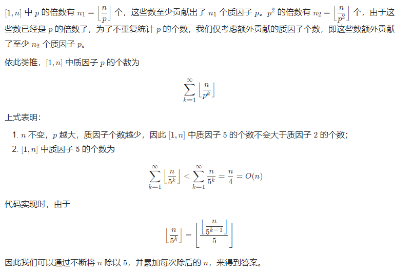

时间复杂度O(n)

**652.寻找重复的子树**

~~~C++
class Solution {
public:
    vector<TreeNode*> findDuplicateSubtrees(TreeNode* root) {
        dfs(root);
        return {repeat.begin(), repeat.end()};
    }

    int dfs(TreeNode* node) {
        if (!node) {
            return 0;
        }
        auto tri = tuple{node->val, dfs(node->left), dfs(node->right)};
        if (auto it = seen.find(tri); it != seen.end()) {
            repeat.insert(it->second.first);
            return it->second.second;
        }
        else {
            seen[tri] = {node, ++idx};
            return idx;
        }
    }

private:
    static constexpr auto tri_hash = [fn = hash<int>()](const tuple<int, int, int>& o) -> size_t {
        auto&& [x, y, z] = o;
        return (fn(x) << 24) ^ (fn(y) << 8) ^ fn(z);
    };

    unordered_map<tuple<int, int, int>, pair<TreeNode*, int>, decltype(tri_hash)> seen{0, tri_hash};
    unordered_set<TreeNode*> repeat;
    int idx = 0;
};
~~~

## Codeforces

1. 807 Div.2

   D. Mark and Lightbulbs

   对于一个字符串s，从2,3，…，n−1中选择索引i（满足si−1≠si+1），然后翻转si，返回s变化到t的最小操作数。

   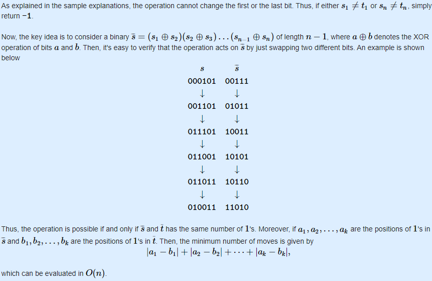

2. 805 Div.3

   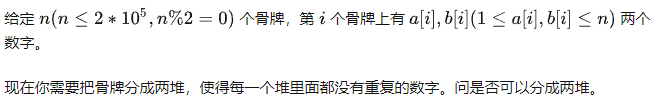

   ~~~C++
   vector<int> deg(n);
   dsu d(2 * n);
   for (int i = 0; i < n; i++) {
   	int x, y; cin >> x >> y; x--; y--;
   	deg[x]++; deg[y]++;
   	d.unite(x, y + n);
   	d.unite(x + n, y);
   }
   bool flag = true;
   for (int i = 0; i < n; i++) {
   	if (deg[i] > 2) {
   		flag = false;
   	}
   	if (d.get(i) == d.get(i + n)) {
   		flag = false;
   	}
   }
   cout << (flag ? "YES" : "NO") << endl;
   ~~~

## Google competition

1. 对于一组点，最左边为l，最右边为r，我们选取(l+r)>>1作为中心点，这样所有的点到中心点总cost最小，结果为|v0-x| + |v1-x| + ... + |vk-x|
2. 但如果我们想让这组点连续并使总cost最小，假设连续的第一个位置为x，那么结果为：|v0-x| + |v1-(x+1)| + ... + |vk-(x+k-1)|，因此我们只需要让vi-i即可转化为问题1

### kick start 2021

#### Round D

对于区间计数问题可以使用差分。

### kick start 2019

#### Round A

将一个矩阵A中某些点及离该点曼哈顿距离为lim的所有点统一映射到另一个矩阵B中（其中矩阵A大小为n*n，则映射后的矩阵B大小为4n\*4n）
点(x,y)及离该点曼哈顿距离为lim的所有点映射到矩阵B的区域为左上角点**(lnx,lny)-**>右下角点**(rnx,rny)**。

~~~C++
int lnx = max(x - lim + y, 0);
int lny = max(x - lim - y + m, 0);
int rnx = max(x + lim + y, 0);
int rny = max(x + lim - y + m, 0);
~~~

矩阵B中某个点(x,y)，还原为A中(a,b)

~~~C++
int a = (x + y - m) / 2, b = x - a;
assert((x & 1) == ((y + m) & 1))//需要满足的条件
~~~

这是通过更换坐标系，将矩阵A中的(x,y)映射为矩阵B中的(x+y,x-y+m)

#### Round F

用一些杂乱无章的点中的部分点构成一个多边形来困住某个点，则一定可以用三角形和四边形来困住。通过判断一个点是否在多边形内可以用叉乘。

#### Round H

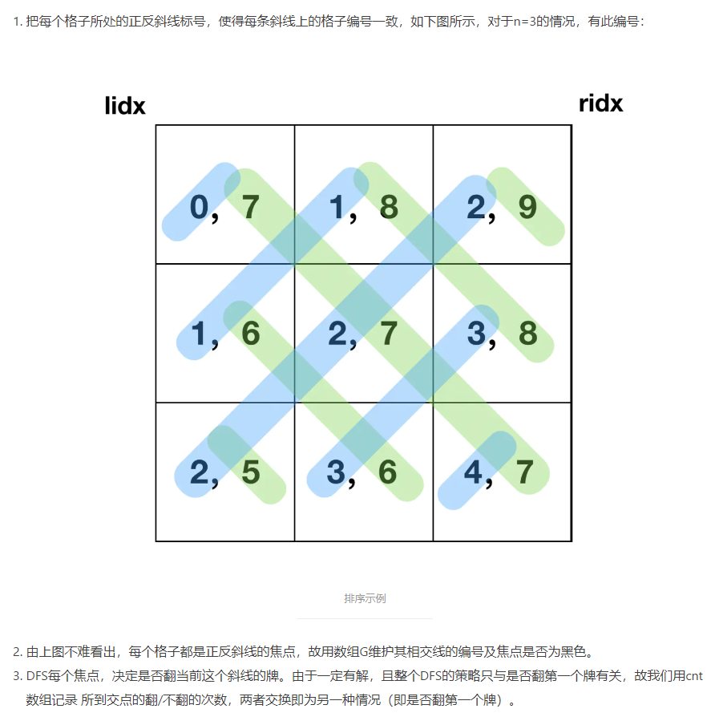

### kick start 2018

#### Round B

能被9整除的数各个位上的数字加起来是9的倍数
每十个数中一定会有一个数被9整除并且还有一个数字含有9（除了边界情况）
考虑区间1-123，可以拆分为：1-99、100-119、120-123
1-99又可以拆分为：1-9（共8个）10-19、20-29…共有1×8×9个满足条件
100-119中有2×8个满足条件
120-123中有4个满足条件
因此总计100个no nine
考虑更一般的情况，区间1-num：
则有Σnum[i] * 8 * 9^(num.size()-2-i)，当i=num.size()-1时，需要逐个判断，复杂度为O(logn)

#### Round C

1. **problem B** 

   所有的三角形都是凸多边形。

2. **Problem C**

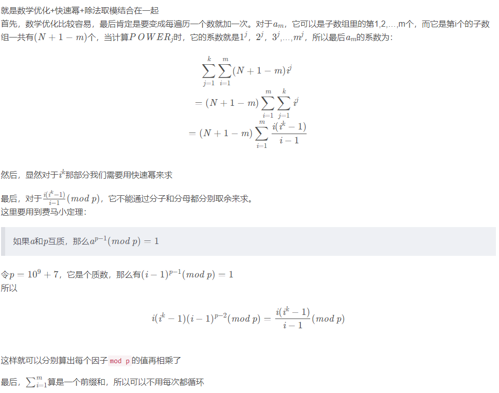

#### Round D

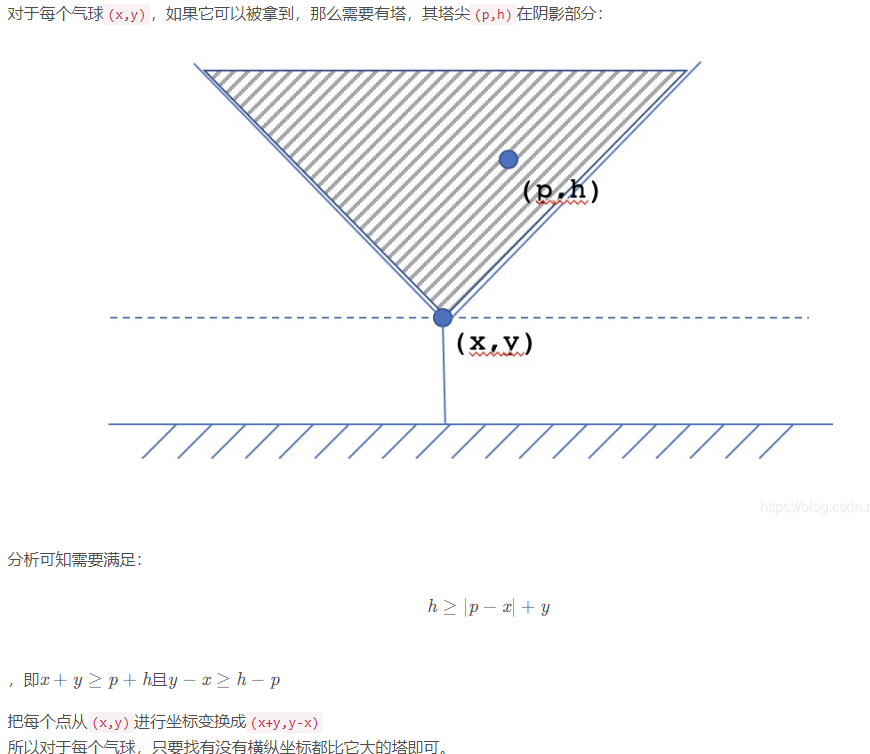

此题的核心在于坐标的变化

#### Round H

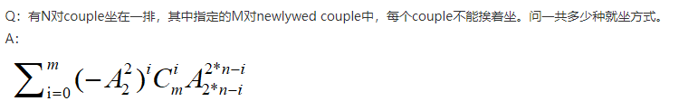

### kick start 2017

#### Round A

1. problem A

   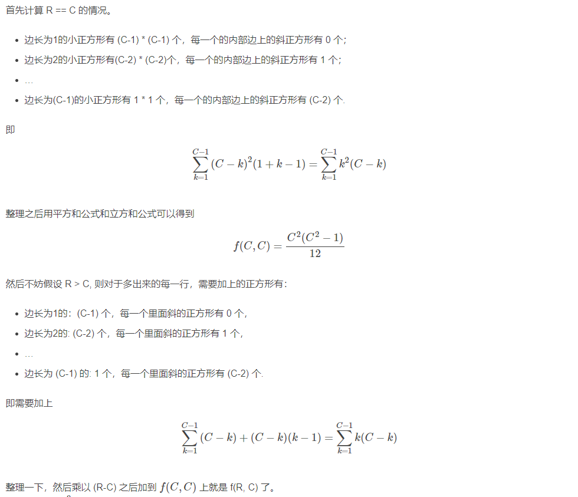

2. problem B：一个\*可以匹配0-4个字符，可以将一个\*转化为4个\*，这样就可以正常转换了。

#### Round B

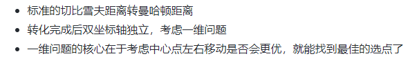

如何找到最佳的选点？某个点的权值+前面所有点的权值>=后面所有点的权值 && 某个点的权值+后面所有点的权值>=前面所有点的权值

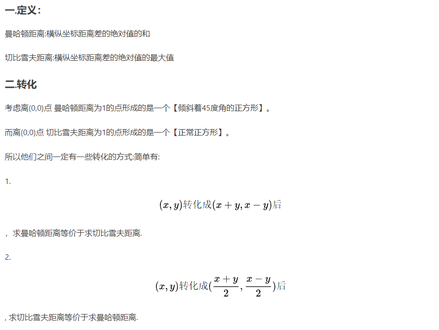

## Atcoder

### AtCoder Beginner Contest 271

**F - XOR on Grid Path**

当正常暴力搜索复杂度高的时候，可以通过双向广搜降低复杂度（从(0,0)向反对角线搜，(n-1,n-1)也向反对角线搜）

### AtCoder Beginner Contest 270

**D - Stones**

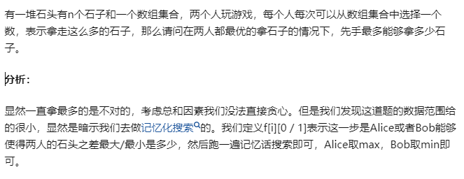

贪心反例：`10 9 8 4`

~~~C++
function<int(int, int)> dfs = [&](int u, int last) {
    if (!u) return 0;
    if (f[u][last] != -1) return f[u][last];
    if (last) {
        int res = -1e9;
        forn(i, k) {
            if (a[i] <= u) {
                res = max(res, dfs(u - a[i], 0) + a[i]);
            }
        }
        return f[u][last] = res;
    }
    else {
        int res = 1e9;
        forn(i, k) {
            if (a[i] <= u) {
                res = min(res, dfs(u - a[i], 1) - a[i]);
            }
        }
        return f[u][last] = res;
    }
};
cout << (n + dfs(n, 1)) / 2 << endl;
~~~

### AtCoder Beginner Contest 265

**E - Warp**

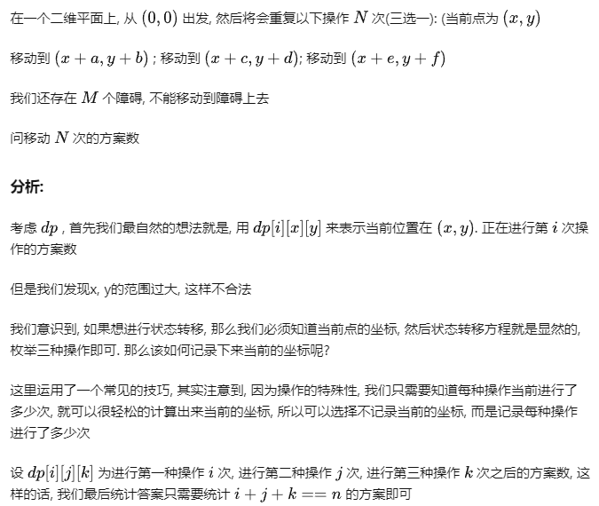

### AtCoder Beginner Contest 264

**E-Sugoroku 3**

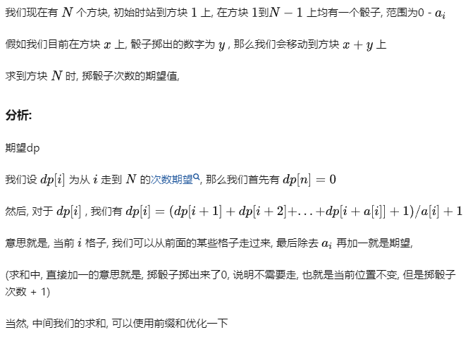

dp[i]＝（dp[i]+dp[i+1]+ dp[i+a[i]])/（a[i]+1）+1进行移项

### AtCoder Beginner Contest 262

**D - I Hate Non-integer Number**

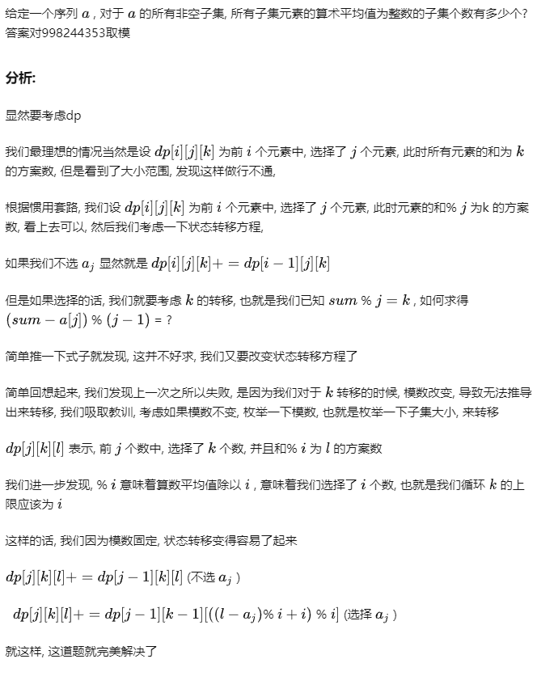

N的范围为[1,100]

**E - Red and Blue Graph**

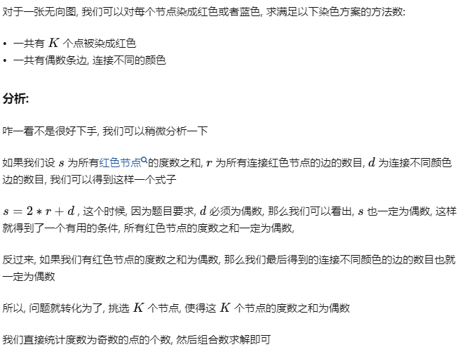

### Atcoder经典dp题

#### E - Knapsack 2

~~~C++
forn(i, n) {
	int w, v; cin >> w >> v;
	for (int j = maxn - 1; j >= v; j--) dp[j] = min(dp[j], dp[j - v] + w);
}
int ans = 0;
forn(i, maxn) if (dp[i] <= W) ans = i;
~~~

#### I - Coins

~~~C++
fort(i, 1, n + 1) {
	forn(j, i) {
		dp[i][j + 1] += dp[i - 1][j] * p[i - 1];
		dp[i][j] += dp[i - 1][j] * (1.0 - p[i - 1]);
	}
}
double ans = 0.0;
forn(i, n + 1) {
	if (i > n - i) ans += dp[n][i];
}
~~~

#### J - Sushi

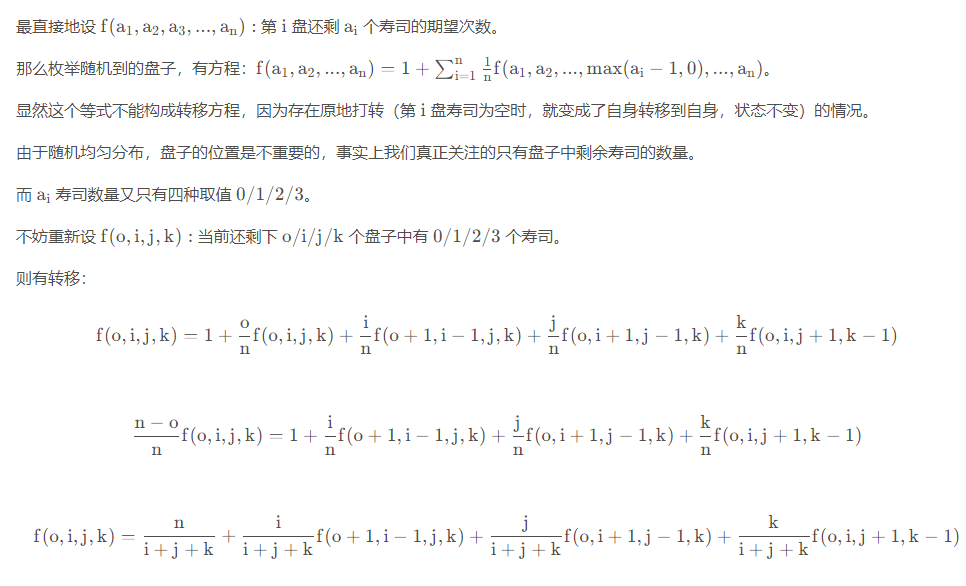

#### K - stones

设置dp[i]: 取i颗石子的胜负情况，dp[i] 为真则先手胜，否则后手胜。

重点是找到破题点：剩余的石子中可以被一次刚好拿完的记下来，由此看一看剩 k个石子时能不能赢。

~~~C++
fort(i, 1, k + 1) {
	forn(j, n) {
		if (i >= a[j] && g[i - a[j]] == 0) {
			g[i] = 1; break;
		}
	}
}
cout << (g[k] ? "First" : "Second") << endl;
~~~

#### L - Deque

~~~C++
forn(i, n) {
	cin >> a[i];
	dp[i][i] = a[i];
}
//dp[i][j]表示区间为(i,j)时，两个玩家玩得最优化时，X-Y的结果值
fort(l, 1, n) {
	for (int i = 0, j = l; j < n; i++, j++) {
		dp[i][j] = max(a[i] - dp[i + 1][j], a[j] - dp[i][j - 1]);
	}
}
cout << dp[0][n - 1] << endl;
~~~

#### O - matching(状压dp)

~~~C++
vl dp(1 << n);
forn(i, n) {
    forn(j, n) cin >> a[i][j];
}
dp[0] = 1;
forn(i, n) {
    forn(j, 1 << n) {//dp[j]为前i个男人匹配了j个女人的方案数
        if (__builtin_popcount(j) != i) continue;
        forn(xx, n) {
            if (a[i][xx] && !((j >> xx) & 1))
                dp[j + (1 << xx)] = (dp[j + (1 << xx)] + dp[j]) % mod;
        }
    }
}
cout << dp.back() << endl;
~~~

#### Q - Flowers

dp[i]为取第i朵花时的最大价值，在求要第i支花时的最大值时，要找到他前边比他矮的花的价值最大值，然后dp[i]=dp[j]+v[i]，在找dp[j]时，不能遍历。因为高度在1−n这个范围里，所以可以建立一个树状数组来存储前i个花的价值，这样就可以在`lognlogn`的时间内求出前i支花中高度在1−(w[i]−1)的价值的最大值。

~~~C++
//用树状数组修改和维护区间最大值
auto lowbit = [&](ll x) {
    return x & (-x);
};
auto update = [&](ll m, ll x) {
    while (m <= n) {
        f[m] = max(f[m], x);
        m += lowbit(m);
    }
};
auto query = [&](ll m) {
    ll res = 0;
    while (m > 0) {
        res = max(res, f[m]);
        m -= lowbit(m);
    }
    return res;
};

ll ans = 0;
forn(i, n) {
    dp[i] = a[i] + query(h[i]);
    ans = max(ans, dp[i]);
    update(h[i], dp[i]);
}
~~~

#### R - Walk

DP+矩阵快速幂

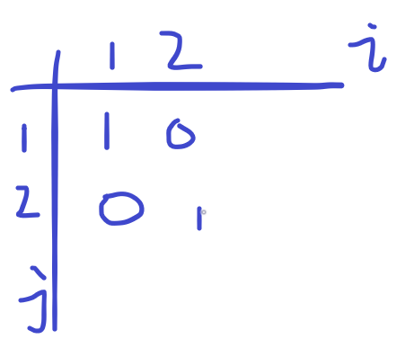

邻接矩阵A的n次幂表示走n次x到y的方案数

#### T - Permutation(插入dp)

   ~~~C++
   vvl f(n + 1, vl(n + 1)), sum(n + 1, vl(n + 1));
   //f[i][j]表示前i个数字为1-i的全排列并且第i个数字是j且满足大小关系的方案数
   //sum[i][j]表示第i个位置放1-j的方案数之和，即dp数组的前缀和
   f[1][1] = 1;
   fort(i, 1, n + 1) sum[1][i] = 1;
   fort(i, 1, n) {
       fort(j, 1, i + 2) {
           if (s[i - 1] == '<')f[i + 1][j] = (f[i + 1][j] + sum[i][j - 1]) % mod;
           else f[i + 1][j] = (f[i + 1][j] + sum[i][i] - sum[i][j - 1] + mod) % mod;
       }
       fort(j, 1, n + 1) sum[i + 1][j] = (sum[i + 1][j - 1] + f[i + 1][j]) % mod;
   }
   
   ll res = 0;
   fort(i, 1, n + 1) res = (res + f[n][i]) % mod;
   ~~~

#### U - Grouping(状压dp)

~~~c++
fort(k, 1, 1 << n) {
    forn(i, n) {
        fort(j, i + 1, n) {
            if ((k >> i & 1) && (k >> j & 1)) {
                dp[k] += a[i][j];
            }
        }
    }
    for (int j = k & (k - 1); j; j = (j - 1) & k) {
        dp[k] = max(dp[k], dp[k ^ j] + dp[j]);
    }
}
~~~

#### V - Subtree

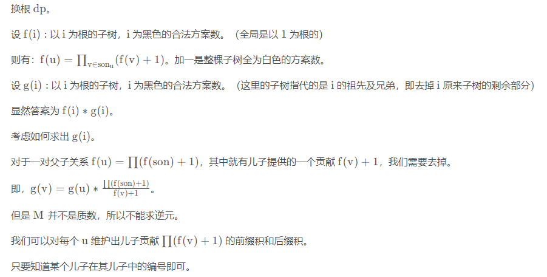

~~~C++
function<void(int, int)> dfs1 = [&](int u, int p) {
    f[u] = 1;
    for (int& v : G[u]) {
        if (v != p) {
            dfs1(v, u);
            f[u] = ((ll)f[u] * (f[v] + 1)) % m;
        }
    }
    pre[u] = vi(G[u].size(), 1);
    suf[u] = vi(G[u].size(), 1);
    fort(i, 1, G[u].size()) {
        pre[u][i] = pre[u][i - 1];
        if (G[u][i - 1] != p) {
            pre[u][i] = ((ll)pre[u][i] * (f[G[u][i - 1]] + 1)) % m;
        }
    }
    rfort(i, G[u].size() - 2, 0) {
        suf[u][i] = suf[u][i + 1];
        if (G[u][i + 1] != p) {
            suf[u][i] = ((ll)suf[u][i] * (f[G[u][i + 1]] + 1)) % m;
        }
    }
};
function<void(int, int)> dfs2 = [&](int u, int p) {
    forn(i, G[u].size()) {
        int v = G[u][i];
        if (v != p) {
            g[v] = ((((ll)pre[u][i] * suf[u][i]) % m) * g[u]) % m + 1;
            dfs2(v, u);
        }
    }
};
dfs1(0, 0);
g[0] = 1;
dfs2(0, 0);
forn(i, n) cout << ((ll)g[i] * f[i]) % m << endl;
~~~

#### W - Intervals

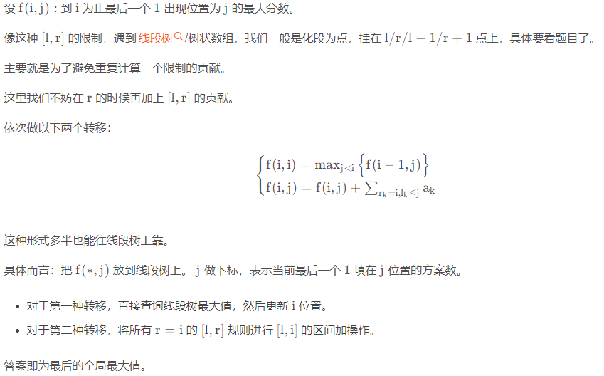

~~~C++
void pushdown(int v) {
	if (t[v].second) {
		t[v << 1].first += t[v].second;
		t[v << 1].second += t[v].second;

		t[v << 1 | 1].first += t[v].second;
		t[v << 1 | 1].second += t[v].second;

		t[v].second = 0;
	}
}
void update(int v, int l, int r, int L, int R, ll val) {
	if (R<l || L>r) return;
	if (L <= l && R >= r) {
		t[v].first += val;
		t[v].second += val;
		return;
	}
	pushdown(v);
	int mid = (l + r) >> 1;
	update(v << 1, l, mid, L, R, val);
	update(v << 1 | 1, mid + 1, r, L, R, val);
	t[v].first = max(t[v << 1].first, t[v << 1 | 1].first);
}
void solve() {
	int n, m; cin >> n >> m;
	t = vector<pll>(n << 2);
	vector<vector<pii>> g(n);
	forn(i, m) {
		int l, r, a; cin >> l >> r >> a; l--; r--;
		g[r].push_back({ l,a });
	}
	forn(i, n) {
		update(1, 0, n - 1, i, i, t[1].first);
		for (auto& [l, a] : g[i]) {
			update(1, 0, n - 1, l, i, a);
		}
	}
	cout << max(t[1].first, 0LL) << endl;
}
~~~

#### X - Tower

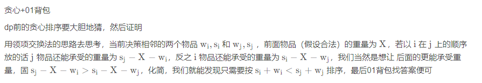

~~~C++
sort(all(p));
vl dp(maxn);
forn(i, n) {
	rfort(j, p[i].w + p[i].s, p[i].w) {
		dp[j] = max(dp[j], dp[j - p[i].w] + p[i].v);
	}
}
cout << *max_element(all(dp)) << '\n';
~~~

#### Y - Grid 2

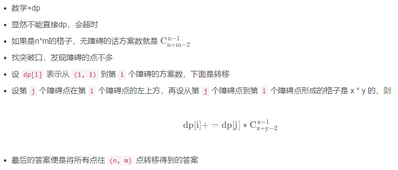

~~~C++
forn(i, n) {
	forn(j, i) {
		if (p[j].first <= p[i].first && p[j].second <= p[i].second) {
			int x = p[i].first - p[j].first + 1, y = p[i].second - p[j].second + 1;
			dp[i] = (dp[i] - dp[j] * C(x + y - 2, x - 1) % mod + mod) % mod;
		}
	}
}
ll ans = C(h + w - 2, h - 1);
forn(i, n) {
	int x = h - p[i].first + 1, y = w - p[i].second + 1;
	ans = (ans - dp[i] * C(x + y - 2, x - 1) % mod + mod) % mod;
}
~~~

#### Z - Frog 3

斜率优化的dp

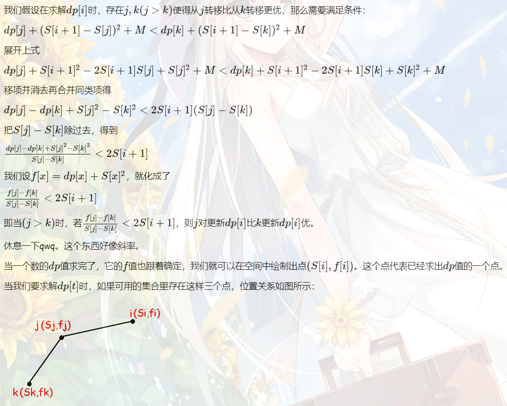

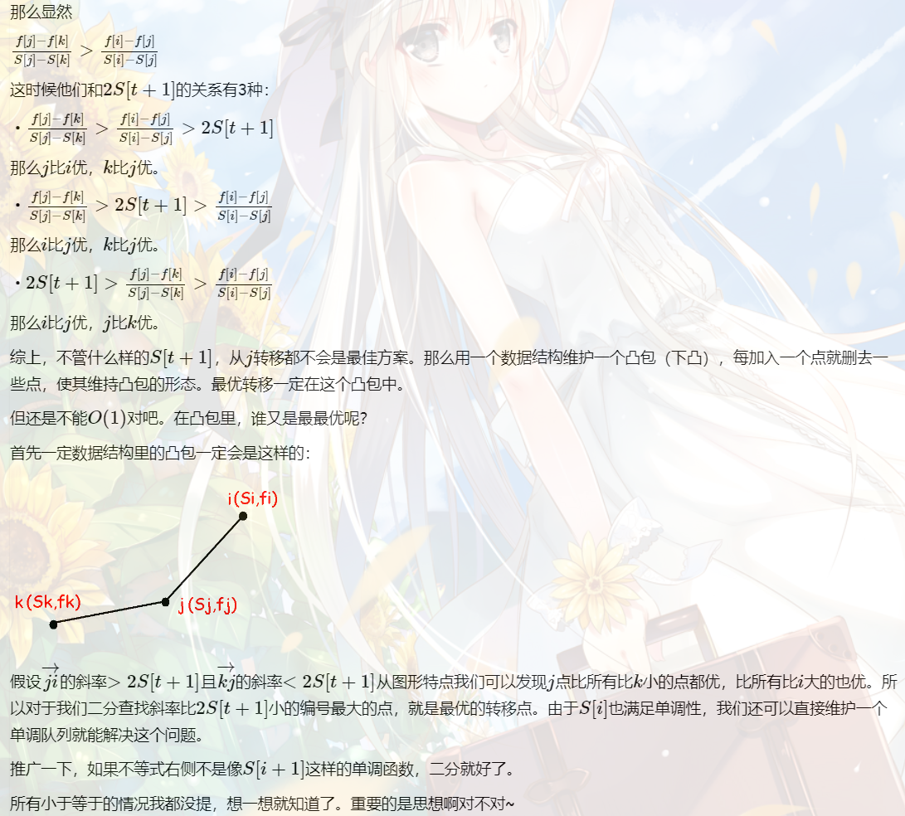

~~~C++
auto getx = [&](int i) {
	return a[i];
};
auto gety = [&](int i) {
	return dp[i] + pow2(a[i]);
};
auto push_check = [&](int j, int k, int i) {
	return gety(k) - gety(j) < 2 * a[i] * (getx(k) - getx(j));
};
auto pop_check = [&](int j, int k, int i) {
	return (gety(k) - gety(j)) * (getx(i) - getx(k)) >
		(gety(i) - gety(k)) * (getx(k) - getx(j));
};

int l = 0, r = -1;
q[++r] = 0;
fort(i, 1, n) {
	while (l < r && push_check(q[l], q[l + 1], i)) l++;
	dp[i] = dp[q[l]] + pow2(a[i] - a[q[l]]) + m;
	while (l < r && pop_check(q[r - 1], q[r], i)) --r;
	q[++r] = i;
}
cout << dp.back() << endl;
~~~

### 总结

1. 集合和二进制是一一对应的
1. 寻找最少的修改方案次数可以尝试bfs
1. 对于多个点同时为起点时，可以考虑建议一个超级源点指向这些点
1. 对于多次删边的问题如果比较难考虑的话可以逆向考虑

## 其他

设计哈希、LRU缓存、自动机。
排序方法包括：插入排序、冒泡排序、归并排序、快速排序、桶排序、基数排序。

1. 环形链表或者是环形数组都可以使用快慢指针，快慢指针要注意快指针的第一个next是否为空
4. 对于需要考虑左右的情况，可以用数组统计，.需要拼接（比如删除一个0让所有1连续）可以考虑前后缀
6. 复制图和链表需要哈希表
7. 链表中总是可以考虑插入新的节点来避免一些特殊情况。（比如一个 伪头节点dummy）
8. 有限的节点数量可以考虑状态压缩+dp
9. 如何只有小写或者大写字母可以考虑遍历
10. 问题是关于计算一些组合对象的数量。 对此，动态规划始终是答案。
11. **如果需要在一个数组中快速删除某些元素，链表是最好的解决方案。**
12. 除了括号外，如遇到相邻两个元素可以消除都可以用到栈

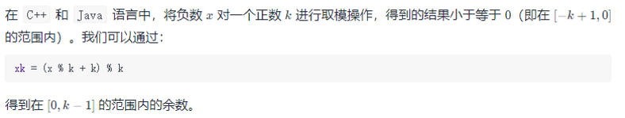

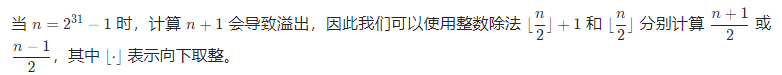

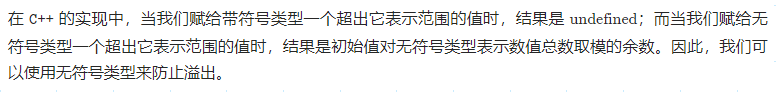

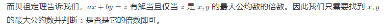

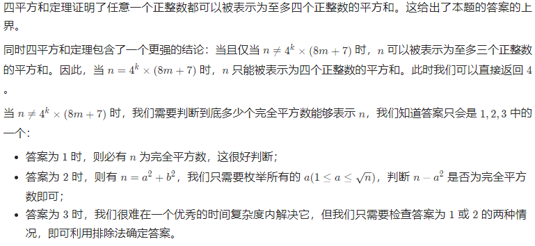

   【使....最大值尽可能小】是二分搜索题目常见的问法

记 c(x) 为 x的二进制表示中的 1 的个数，则有如下等式：
c(x|y)+c(x\&y)=c(x)+c(y)
x|y+x&y=x+y

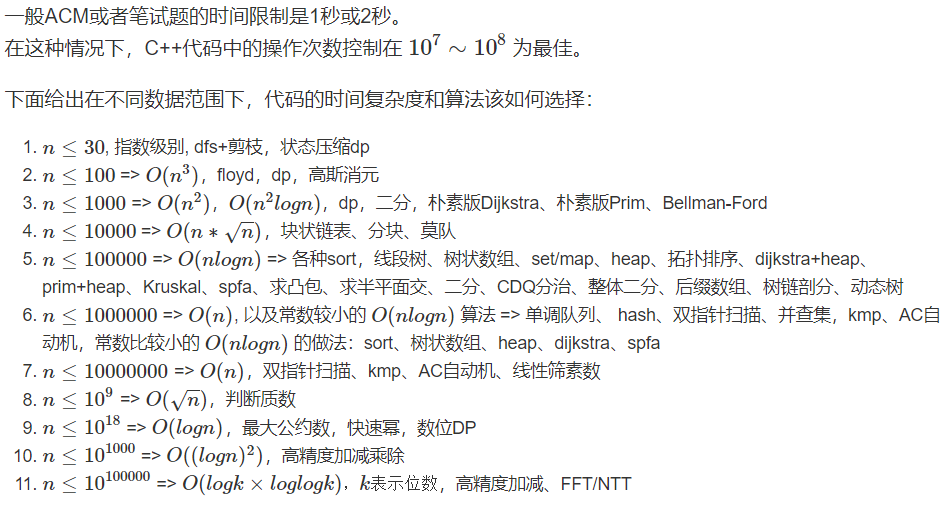

## 待做题

1. round E 2020 Toys
2. round b 2019 Diverse Subarray
3. round h 2019 Diagonal Puzzle

# 笔试题

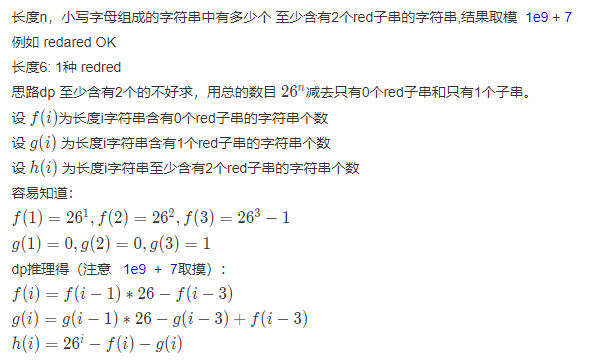

# 关于工作

## 关于简历

**根据岗位定制简历**，用数字描述，比如GPA，关键信息加粗，关键词开头，句子描述，简历字体字号，简历精简并吸引眼球，项目达成了什么效果

STAR模式（还可以用于叙述故事）

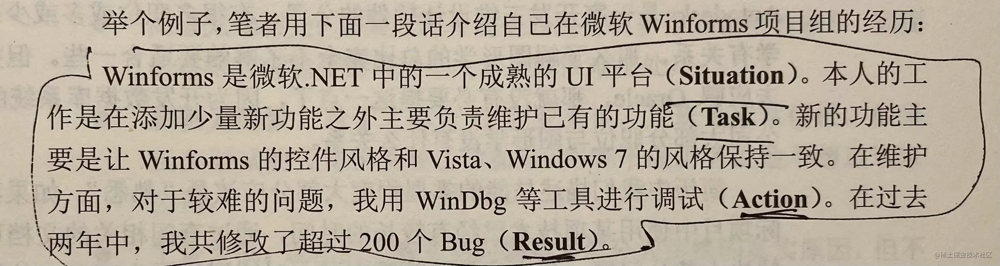

## 关于面试

1. **了解公司的企业文化，公司的历史，岗位要求硬技能、软技能，面试官的背景（领英），准备给面试官的提问。**包括但不限于工作强度，待遇，晋升机会，上升渠道，发展前景，培养模式，公司的氛围，公司会对我怎么培养，我能为公司做点什么，团队的发展，职业发展路线，面试官对岗位的预期。职业描述中已经有的信息就不要问了。
2. **中英文自我介绍**，在自我介绍中用\**工具**语言做了什么（根据岗位要求），准备一些专业基础知识，挑选几个适合岗位的案例比较重要
3. 面试时**问清题目**至关重要。许多面试官在面试的时候，会故意先抛出一个模糊的问题。实际上，他们希望面试者能够经过一些询问理解问题。在这个过程中，面试者能够展现出自己对**问题的分析能力**以及**沟通的能力**
4. 确认了题目之后，我认为合理的做法是先和面试官**确认函数签名**，也即输入是什么参数，输出是什么参数等等。
5. 和面试官**确认思路**
6. 确认边界处理
7. 使用可读性较高的变量名和函数名
8. 写代码过程中不断和面试官交流
9. 写完代码主动测试（如何白板上写代码可以用鼠标光标指示运行到了哪一步）
10. 主动给出算法的复杂度
11. 如果在某些基础问题上自己有一些实际经验，那么**可以结合自己的经验来回答**，这样会让面试官觉得这个候选人不仅基础扎实、经验丰富，而且学以致用、分析问题的能力也挺强的。

    这里举一个简单的例子，比如面试官问hash table处理冲突有哪些常用的方式，各有什么优缺点。那么可以回答常用的有线性探测和链地址两种。如果自己有相应的经验，那么就可以结合经验谈谈优缺点，例如线性探测在实际使用的时候常常需要空间开得比较大，hash table的装载因子需要维持一个一直比较小的状态（比如25%-50%这样），否则的话性能就会很差，因为查询和插入都会频繁地进行长距离的线性探测。而拉链法对空间的利用效率就会比较高。在提供足够的空间的时候，按经验线性探测会比拉链法快很多，比如之前做了个项目，在满足空间条件的时候线性探测会快7倍左右（这是在结合经验谈），原因是线性探测比链接法对cache更友好（这是基础知识）。

 

**面试问题分析：**
1.说话紧张
2.项目也应该很清晰的讲出，算法题讲述的时候条理不清晰，比如对于一道题一开始就跟面试官清晰的讲述出思路，代码也要写的有条理，最后应该主动分析下时空复杂度。
3.leader面回答的不够好，比如学过什么课程，怎么学习一门新技术什么的都回答的不够好（看官方文档，需要什么都可以去去官方文档里面搜）。

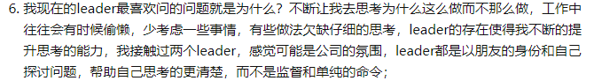

写代码的时候可以加点轻量的注释，写完后可以主动要求测试

**面试技巧：**
1.学会展现自己的优点，也要说出自己的弱点（但也要说自己做了那些事来改善自己的弱点）
2.要表现自己的热情
3.专注于这个工作需要的能力
4.会说故事（STAR method：Situation Task Action Result）

## 面经

**freewheel**

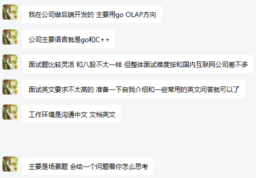

大部分看对计算机基础知识的理解能力 **计组、操作系统、计算机网络、数据库。**还有语言类的问题，比如C++的STL和Java容器JVM。

freewheel的英文仅限于普通的交流，面试官不说，就还是拿中文回答，问一些日常，比如**英文自我介绍，介绍一下最喜欢的课程，介绍家乡**

学姐被面的场景题时如何设计一个数据库同步器，语言速成。12月Java基础，1、2月陆续刷一些leetcode简单题，3、4、5月学一些JavaWeb Spring数据库，7月背八股（有点晚了，错过了提前批，提前批是七月份）。项目就是用SpringBoot自己做了个烂大街的秒杀项目

项目简单介绍之后是聊天，为什么投他们公司，手上有什么offer，职业规划等等