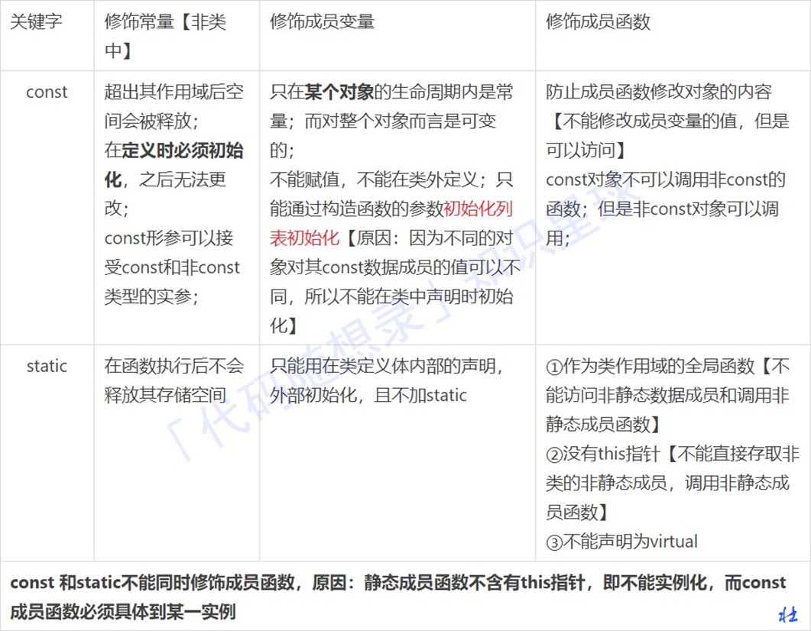
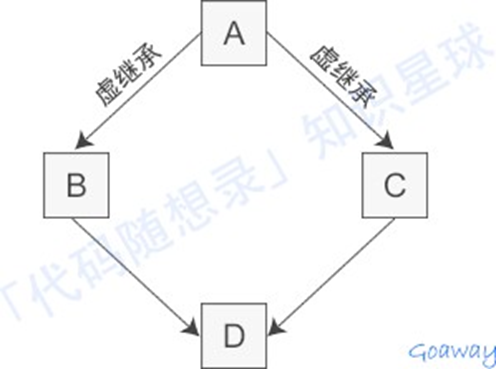
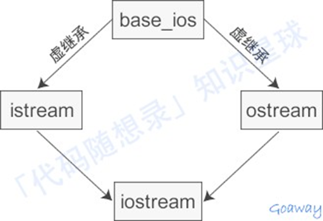
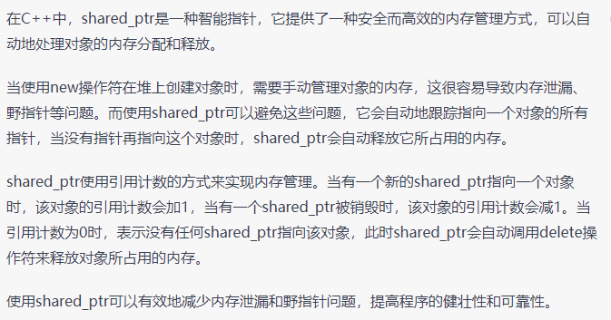
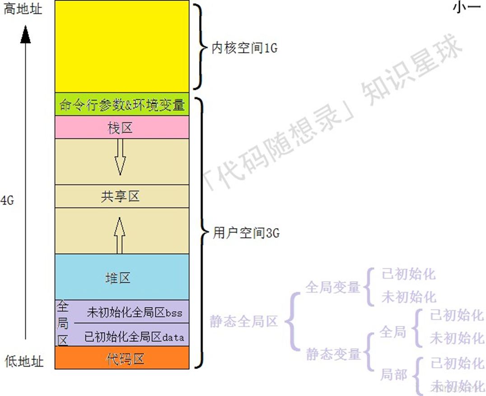
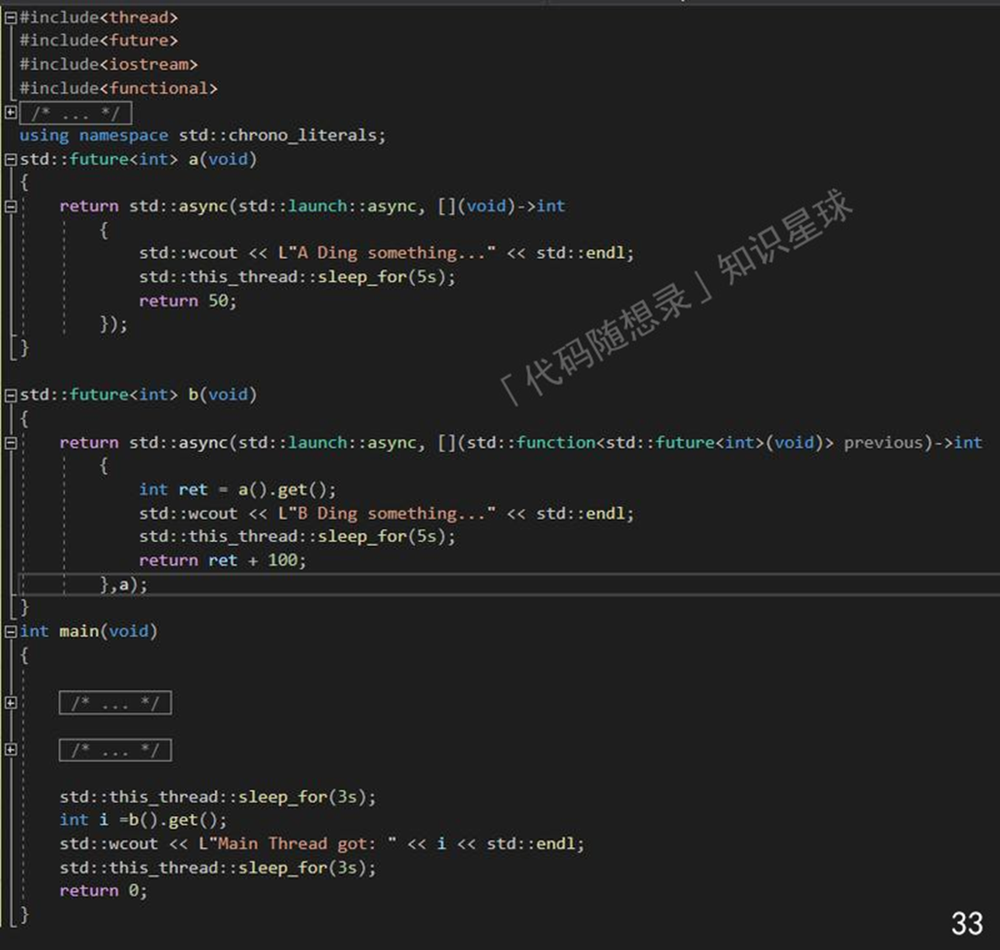

#   C++

```c++
int __builtin_ffs(unsigned int x)
//返回x的最后一位1的是从后向前第几位，比如7368 (1110011001000) 返回4。
int __builtin_clz(unsigned int x)
//返回前导的0的个数。
int __builtin_ctz(unsigned int X)
//返回后面的0个个数，和__builtin_ctz相对。
int __builtin_popcount (unsigned int X)
//返回二进制表示中1的个数。
int __builtin_parity (unsigned int x)
//返回x的奇偶校验位，也就是x的1的个数模2的结果。
//此外，这些函数都有相应的usigned long和usigned long long版本,只需要在函数名后面加上I或I就可以了,比如__builtin_clzll
```

```C++
//reverse()对stl做翻转
//reserve()提前分配内存空间
//isdigit(c)检查字符c是否是数字
//isspace(c)检查字符c是否是空格
//to_string()数值转为string
//stoi() string转为int  stoll()转成long long类型
//static_cast<double>
//next_permutation用于得到下一个排列，主要是暴力情况
//iota 递增序列填充
//nth_element(b.begin(), b.begin() + k, b.end()) b.beign()+k为第k+1个小的元素，小于b.begin()+k的fan
```

~~~c++
const double pi=atan(1)*4;

cout<<fixed<<setprecision(20);

//将浮点数p保留两位小数存入str
stringstream ss;
ss << std::setiosflags(std::ios::fixed) << std::setprecision(2) << p;
string str = ss.str();
~~~

~~~C++
//decltype的作用是获取变量的类型

//tuple是一个固定大小的不同类型值的集合
//make_tuple用于构造一个tuple、tuple_size用于获取tuple的参数个数、get获取tuple指定索引的值
tuple<TreeNode*, int, int> t;
TreeNode* r=get<0>(t);
int r=get<1>(t),c=get<2>(t);

~~~

~~~C++
string s;
cin>>s;//不会读入一行中的空格
getline(cin,s);//会读入一行中的空格
~~~

~~~C++
///2是向0取整，正数向下负数向上，>>是向下取整 
~~~

## 关键字与运算符

### 指针与引用

不存在指向空值的引⽤，但是存在指向空值的指针。

### define、typedef、inline 的区别

define： 可以⽤来防⽌头⽂件重复引⽤

typedef： 1. 有对应的数据类型，是要进⾏判断的 2. 是在编译、运⾏的时候起作⽤ 3. 在静态存储区中分配空间，在程序运⾏过程中内存中只有⼀个拷⻉

inline是先将内联函数编译完成⽣成了函数体直接插⼊被调⽤的地⽅，减少了压栈，跳转和返回的操作。没有普通函数调⽤时的额外开销；

内联函数是⼀种特殊的函数，会进⾏类型检查；

对编译器的⼀种请求，编译器有可能拒绝这种请求；

C++中inline编译限制：

1. 不能存在任何形式的循环语句

2. 不能存在过多的条件判断语句

3. 函数体不能过于庞⼤

4. 内联函数声明必须在调⽤语句之前

### override 和 overload

override是重写（覆盖）了⼀个⽅法，以实现不同的功能，⼀般是⽤于⼦类在继承⽗类时，重写⽗类⽅法。

1.	重写⽅法的参数列表，返回值，所抛出的异常与被重写⽅法⼀致

2.	被重写的⽅法不能为private
3.	静态⽅法不能被重写为⾮静态的⽅法
4.	重写⽅法的访问修饰符⼀定要⼤于被重写⽅法的访问修饰符（public>protected>default>private）

overload是重载，这些⽅法的名称相同⽽参数形式不同。

### new 和 malloc

1、new内存分配失败时，会抛出bac_alloc异常，它不会返回NULL；malloc分配内存失败时返回NULL。

2、使⽤new操作符申请内存分配时⽆须指定内存块的⼤⼩，⽽malloc则需要显式地指出所需内存的尺⼨。   

3、operator new /operator delete可以被重载，⽽malloc/free并不允许重载。

4、new/delete会调⽤对象的构造函数/析构函数以完成对象的构造/析构。⽽malloc则不会 

5、malloc与free是C++/C语⾔的标准库函数,new/delete是C++的运算符

6、new操作符从⾃由存储区上为对象动态分配内存空间，⽽malloc函数从堆上动态分配内存。

### constexpr、const、static

constexpr 只能定义编译期常量，⽽ const 可以定义编译期常量，也可以定义运⾏期常量。

~~~C++
constexpr int *p = nullptr; //常量指针 顶层const 
const int *q = nullptr; //指向常量的指针， 底层const 
int *const q = nullptr; //顶层const
//对于const，左定值，右定向：指的是const在*的左还是右边
~~~

constexpr构造函数必须有⼀个空的函数体，即所有成员变量的初始化都放到初始化列表中。对象调⽤的成员函数必须使⽤ constexpr 修饰。



注意constexpr是比宏更为安全可靠

### Volatile

指令关键字，确保本条指令不会因编译器的优化⽽省略，且要求每次直接读值，保证对特殊地址的稳定访问

~~~C++
for(volatile int i=0; i<100000; i++); // 它会执⾏，不会被优化掉
~~~

### extern

声明外部变量【在函数或者⽂件外部定义的全局变量】

### static

作⽤：实现多个对象之间的数据共享 （）+ **隐藏**，并且使⽤静态成员还不会破坏隐藏原则；默认初始化为0

### 前置++与后置++

~~~C++
self &operator++() {
     node = (linktype)((node).next);
     return *this;
}
const self operator++(int) {
     self tmp = *this;
     ++*this;
     return tmp;
}
~~~

为了区分前后置，᯿载函数是以参数类型来区分，在调⽤的时候，编译器默默给int指定为⼀个0

1、为什么后置返回对象，⽽不是引⽤

因为后置为了返回旧值创建了⼀个临时对象，在函数结束的时候这个对象就会被销毁，如果返回引⽤，那么我请问 你？你的对象对象都被销毁了，你引⽤啥呢？ 

2、为什么后置前⾯也要加const 其实也可以不加，但是为了防⽌你使⽤i++++,连续两次的调⽤后置++᯿载符，为什么呢? 

原因： 它与内置类型⾏为不⼀致；你⽆法获得你所期望的结果，因为第⼀次返回的是旧值，⽽不是原对象，你调⽤两次后 置++，结果只累加了⼀次，所以我们必须⼿动禁⽌其合法化，就要在前⾯加上const。 

3、处理⽤户的⾃定义类型

最好使⽤前置++，因为他不会创建临时对象，进⽽不会带来构造和析构⽽造成的格外开销。

### std::atomic

问题：a++ 和 int a = b 在C++中是否是线程安全的？答案：不是

## C++三大特性

C++通过 public、protected、private 三个关键字来控制成员变量和成员函数的访问权限，它们分别表示公有的、受保护的、私有的，被称为成员访问限定符。

⽆论共有继承、私有和保护继承，私有成员不能被“派⽣类”访问，基类中的共有和保护成员能被“派⽣类”访问。

### 1. 继承

让某种类型对象获得另⼀个类型对象的属性和⽅法

常⻅的继承有三种⽅式：

1、实现继承：  指使⽤基类的属性和⽅法⽽⽆需额外编码的能⼒

2、接⼝继承：  指仅使⽤属性和⽅法的名称、但是⼦类必须提供实现的能⼒

**3、可视继承：  指⼦窗体（类）使⽤基窗体（类）的外观和实现代码的能⼒**

### 2. 封装

数据和代码捆绑在⼀起，避免外界⼲扰和不确定性访问;

把客观事物封装成抽象的类，并且类可以把⾃⼰的数据和⽅法只让可信的类或者对象操作，对不可信的进⾏信息隐 藏，例如：将公共的数据或⽅法使⽤public修饰，⽽不希望被访问的数据或⽅法采⽤private修饰。

### 3. 多态

同⼀事物表现出不同事物的能⼒，即向不同对象发送同⼀消息，不同的对象在接收时会产⽣不同的⾏为（重载实现 编译时多态，虚函数实现运⾏时多态）

实现多态有两种⽅式 

1. 覆盖（override）： 是指⼦类重新定义父类的虚函数的做法 

2. 重载（overload）： 是指允许存在多个同名函数，⽽这些函数的参数表不同（或许参数个数不同，或许参数 类型不同）

## 虚函数

当基类希望派⽣类定义适合⾃⼰的版本，就将这些函数声明成虚函数（virtual）。

1. 虚函数是动态绑定的
   也就是说，使⽤虚函数的指针和引⽤能够正确找到实际类的对应函数，⽽不是执⾏定义类的函数，这是虚函数的基本功能。

2. **多态（不同继承关系的类对象，调⽤同⼀函数产⽣不同⾏为）**

   * **调⽤函数的对象必须是指针或者引⽤**

   * **被调⽤的函数必须是虚函数（virtual），且完成了虚函数的重写（派⽣类中有⼀个跟基类的完全相同虚函数）**

3. 动态绑定绑定的是动态类型
   所对应的函数或属性依赖于对象的动态类型，发⽣在运⾏期。

4. 构造函数不能是虚函数
   在构造函数中调⽤虚函数，实际执⾏的是⽗类的对应函数，因为⾃⼰还没有构造好,  多态是被disable的。

5. 虚函数的⼯作⽅式
   依赖虚函数表⼯作的，表来保存虚函数地址，当我们⽤基类指针指向派⽣类时，虚表指针vptr指向派⽣类的虚函数表。 这个机制可以保证派⽣类中的虚函数被调⽤到。

6. **析构函数可以是虚函数，⽽且，在⼀个复杂类结构中，这往往是必须的。**

7. 将⼀个函数定义为纯虚函数。
   实际上是将这个类定义为抽象类，不能实例化对象；纯虚函数通常没有定义体，但也完全可以拥有。

8. inline, static, constructor三种函数都不能带有virtual关键字。
   （1）inline是在编译时展开，必须要有实体。
   （2）static属于class⾃⼰的类相关，必须有实体；

### 为什么需要虚继承

1. 为了解决多继承时的命名冲突和冗余数据问题 C++ 提出了虚继承，使得在派⽣类中只保留⼀份间接基类的成员。其中多继承（Multiple Inheritance）是指从多 个直接基类中产⽣派⽣类的能⼒，多继承的派⽣类继承了所有⽗类的成员。 

2. 虚继承的⽬的是让某个类做出声明，承诺愿意共享它的基类。其中，这个被共享的基类就称为虚基类（Virtual Base Class），其中A 就是⼀个虚基类。在这种机制下，不论虚基类在继承体系中出现了多少次，在派⽣类中都只包含⼀份虚基类的成员。 类 A 有⼀个成员变量a，不使⽤虚继承，那么在类 D 中直接访问 a 就会产⽣歧义。 编译器不知道它究竟来⾃ A -->B-->D 这条路径，还是来⾃ A-->C-->D 这条路径。



iostream 从 istream 和 ostream 直接继承⽽来，⽽ istream 和 ostream ⼜都继承⾃⼀个共同的名为 baseios 的 类，是典型的菱形继承。 此时 istream 和 ostream 必须采⽤虚继承，否则将导致 iostream 类中保留两份 baseios 类的成员。



使⽤多继承经常出现⼆义性，必须十分小心；

⼀般只有在⽐较简单和不易出现⼆义性或者实在必要情况下才使⽤多继承，能⽤单⼀继承解决问题就不要⽤多继承。

## 空类

### 为何空类的大小不是0

为了确保两个不同对象的地址不同，必须如此。类的实例化是在内存中分配⼀块地址，每个实例在内存中都有独⼀⽆⼆的⼆地址。同样，空类也会实例化，所以编译器会给空类隐含的添加⼀个字节，这样空类实例化后就有独⼀⽆⼆的地址了。所以，空类的sizeof为1，⽽不是0。

~~~C++
class A{ virtual void f(){} };
class B:public A{}
~~~

此时，类A和类B都不是空类，其sizeof都是4，因为它们都具有虚函数表的地址。

~~~C++
class A{};
class B:public virtual A{};
~~~

此时，A是空类，其⼤⼩为1；B不是空类，其⼤⼩为4。因为含有指向虚基类的指针

多重继承的空类的⼤⼩也是1。

~~~C++
class Father1{}; 
class Father2{}; 
class Child:Father1, Father2{};
~~~

**何时共享虚函数地址表**

~~~C++
class X{}; //sizeof(X):1
class Y : public virtual X {}; //sizeof(Y):4 
class Z : public virtual X {}; //sizeof(Z):4 
class A : public virtual Y {}; //sizeof(A):8 
class B : public Y, public Z{}; //sizeof(B):8
class C : public virtual Y, public virtual Z {}; //sizeof(C):12 
class D : public virtual C{}; //sizeof(D):16
~~~

## 抽象类与接口的实现

接⼝描述了类的⾏为和功能，⽽不需要完成类的特定实现；C++接⼝是使⽤抽象类来实现的

1. 类中⾄少有⼀个函数被声明为纯虚函数，则这个类就是抽象类。纯虚函数是通过在声明中使⽤ "= 0" 来指定的。

2. 设计抽象类（通常称为 ABC）的⽬的，是为了给其他类提供⼀个可以继承的适当的基类。抽象类不能被⽤于实例化对象，它只能作为接⼝使⽤。

~~~C++
class Shape 
{
public:
	// 提供接⼝框架的纯虚函数 
	virtual int getArea() = 0;
	void setWidth(int w) 
	{
		width = w;
	}
	void setHeight(int h)
	{
		height = h;
	}
protected:
	int width; int height;
};
// 派⽣类
class Rectangle : public Shape
{
public:
	int getArea()
	{
		return (width * height);
	}
};

class Triangle : public Shape
{
public:
	int getArea()
	{
		return (width * height) / 2;
	}
};

// 主函数
Rectangle Rect;
Triangle Tri;

Rect.setWidth(5);
Rect.setHeight(7);
Rect.getArea(); //35

Tri.setWidth(5); 
Tri.setHeight(7);
Tri.getArea(); //17
~~~

## 智能指针

### share_ptr



**1. shared_ptr的实现机制是在拷⻉构造时使⽤同⼀份引⽤计数**

（1）  ⼀个模板指针T* ptr

指向实际的对象

（2）  ⼀个引⽤次数

必须new出来的，不然会多个shared_ptr⾥⾯会有不同的引⽤次数⽽导致多次delete

（3）  重载operator*和operator->使得能像指针⼀样使⽤shared_ptr

（4）  重载copy constructor

使其引⽤次数加⼀（拷⻉构造函数)

（5）  重载operator=（赋值运算符）

如果原来的shared_ptr已经有对象，则让其引⽤次数减⼀并判断引⽤是否为零(是否调⽤delete)，然后将新的对象引⽤次数加⼀

（6）  重载析构函数

使引⽤次数减⼀并判断引⽤是否为零; (是否调⽤delete)

**2. 线程安全问题**

（1）  同⼀个shared_ptr被多个线程“读”是安全的;

（2）  同⼀个shared_ptr被多个线程“写”是不安全的;

证明：在多个线程中同时对⼀个shared_ptr循环执⾏两遍swap。 shared_ptr的swap函数的作⽤就是和另外⼀个 shared_ptr交换引⽤对象和引⽤计数，是写操作。执⾏两遍swap之后, shared_ptr引⽤的对象的值应该不变）

（3）  共享引⽤计数的不同的shared_ptr被多个线程“写”是安全的。

### unique_ptr

1. unique_pt“唯一”拥有其所指对象，同⼀时刻只能有⼀个unique_ptr指向给定对象，离开作⽤域时，若其指向对象，则将其所指对象销毁（默认delete）。

2. 定义unique_ptr时需要将其绑定到⼀个new返回的指针上。
3. unique_ptr不⽀持普通的拷⻉和赋值（因为拥有指向的对象）。但是可以拷⻉和赋值⼀个将要被销毁的unique_ptr；可以通过release或者reset将指针所有权从⼀个（⾮const）unique_ptr转移到另⼀个unique。

### weak_ptr

1. weak_ptr是为了配合shared_ptr⽽引⼊的⼀种智能指针
   它的最⼤作⽤在于协助shared_ptr⼯作，像旁观者那样观测资源的使⽤情况，但weak_ptr没有共享资源，它的构造不会引起指针引⽤计数的增加。
2. 和shared_ptr指向相同内存
   shared_ptr析构之后内存释放，在使⽤之前使⽤函数lock()检查weak_ptr是否为空指针。

## C++强制类型转换

关键字：static_cast、dynamic_cast、reinterpret_cast和 const_cast

### static_cast

没有运⾏时类型检查来保证转换的安全性
进⾏上⾏转换（把派⽣类的指针或引⽤转换成基类表示）是安全的
进⾏下⾏转换（把基类的指针或引⽤转换为派⽣类表示），由于没有动态类型检查，所以是不安全的。
使⽤：

1.	⽤于基本数据类型之间的转换，如把int转换成char。
2.	把任何类型的表达式转换成void类型。

### dynamic_cast

在进⾏下⾏转换时，dynamic_cast具有类型检查（信息在虚函数中）的功能，⽐static_cast更安全。转换后必须是类的指针、引⽤或者void*，基类要有虚函数，可以交叉转换。
dynamic本身只能⽤于存在虚函数的⽗⼦关系的强制类型转换；对于指针，转换失败则返回nullptr，对于引⽤，转换失败会抛出异常。

### reinterpret_cast

可以将整型转换为指针，也可以把指针转换为数组；可以在指针和引⽤⾥进⾏肆⽆忌惮的转换，平台移植性⽐价差。

### const_cast

常量指针转换为⾮常量指针，并且仍然指向原来的对象。常量引⽤被转换为⾮常量引⽤，并且仍然指向原来的对象。去掉类型的const或volatile属性。

## 内存泄漏

1、 什么是内存泄露?

内存泄漏(memory leak)是指由于疏忽或错误造成了程序未能释放掉不再使⽤的内存的情况。内存泄漏并非指内存在物理上的消失，⽽是应⽤程序分配某段内存后，由于设计错误，失去了对该段内存的控制，因⽽造成了内存的浪费。可以使⽤Valgrind, mtrace进⾏内存泄漏检查。

2、内存泄漏的分类

（1）堆内存泄漏 （Heap leak）

对内存指的是程序运⾏中根据需要分配通过malloc,realloc  new等从堆中分配的⼀块内存，再是完成后必须通过调
⽤对应的 free或者 delete 删掉。如果程序的设计的错误导致这部分内存没有被释放，那么此后这块内存将不会被使⽤，就会产⽣ Heap Leak.

（2）系统资源泄露（Resource Leak）

主要指程序使⽤系统分配的资源⽐如 Bitmap,handle ,SOCKET 等没有使⽤相应的函数释放掉，导致系统资源的浪费，严重可导致系统效能降低，系统运⾏不稳定。

（3）未将基类的析构函数定义为虚函数

当基类指针指向⼦类对象时，如果基类的析构函数不是 virtual，那么⼦类的析构函数将不会被调⽤，⼦类的资源没有正确是释放，因此造成内存泄露。

3、什么操作会导致内存泄露?

指针指向改变，未释放动态分配内存。

4、如何防⽌内存泄露?

将内存的分配封装在类中，构造函数分配内存，析构函数释放内存；使⽤智能指针

5、智能指针有了解哪些?

智能指针是为了解决动态分配内存导致内存泄露和多次释放同⼀内存所提出的，C11标准中放在< memory>头⽂件。包括:共享指针，独占指针，弱指针

6、构造函数，析构函数要设为虚函数吗，为什么？

（1）析构函数

析构函数需要。当派⽣类对象中有内存需要回收时，如果析构函数不是虚函数，不会触发动态绑定，只会调⽤基类析构函数，导致派⽣类资源⽆法释放，造成内存泄漏。

（2）构造函数

构造函数不需要，没有意义。虚函数调⽤是在部分信息下完成⼯作的机制，允许我们只知道接⼝⽽不知道对象的确切类型。 要创建⼀个对象，你需要知道对象的完整信息。 特别是，你需要知道你想要创建的确切类型。 因此，构造函数不应该被定义为虚函数

## 进程的地址空间分布 



如上图，从⾼地址到低地址，⼀个程序由命令⾏参数和环境变量、栈、⽂件映射区、堆、BSS段、数据段、代码段组成。

（1）  命令⾏参数和环境变量

命令⾏参数是指从命令⾏执⾏程序的时候，给程序的参数。

（2）  栈区

存储局部变量、函数参数值。栈从⾼地址向低地址增⻓。是⼀块连续的空间。

（3）  ⽂件映射区位于堆和栈之间。

（4）  堆区

动态申请内存⽤。堆从低地址向⾼地址增⻓。

（5）  BSS 段

存放程序中未初始化的 全局变量和静态变量 的⼀块内存区域。

（6）  数据段

存放程序中已初始化的 全局变量和静态变量 的⼀块内存区域。

（7）  代码段

存放程序执⾏代码的⼀块内存区域。只读，代码段的头部还会包含⼀些只读的常数变量。

7、说⼀说C与C++的内存分配⽅式

（1）从静态存储区域分配

内存在程序编译的时候就已经分配好，这块内存在程序的整个运⾏期间都存在，如全局变量，static变量。

（2）在栈上创建

在执⾏函数时，函数内局部变量的存储单元都可以在栈上创建，函数执⾏结束时这些存储单元⾃动被释放。栈内存分配运算内置于处理器的指令集中，效率很⾼，但是分配的内存容量有限。

（3）从堆上分配(动态内存分配)

程序在运⾏的时候⽤malloc或new申请任意多少的内存，程序员负责在何时⽤free或delete释放内存。动态内存的⽣存期⾃⼰决定，使⽤⾮常灵活。

8、new、delete、malloc、free关系

如果是带有⾃定义析构函数的类类型，⽤ new [] 来创建类对象数组，⽽⽤ delete来释放会发⽣什么？

~~~C++
class A {};
A* pAa = new A[3]; 
delete pAa;
~~~


那么 delete pAa; 做了两件事：
1.	调⽤⼀次 pAa 指向的对象的析构函数
2.	调⽤ operator delete(pAa);释放内存

显然，这⾥只对数组的第⼀个类对象调⽤了析构函数，后⾯的两个对象均没调⽤析构函数，如果类对象中申请了⼤量的内存需要在析构函数中释放，⽽你却在销毁数组对象时少调⽤了析构函数，这会造成内存泄漏。

**第二点中直接释放pAa指向的内存空间，这个总是会造成严重的 段错误，程序必然会奔溃！因为分配的空间的起始地址是 pAa 指向的地⽅减去 4 个字节的地⽅。你应该传⼊参数设为那个地址！**

## 计算机中的乱序执行

1、⼀定会按正常顺序执⾏的情况

1）对同⼀块内存进⾏访问，此时访问的顺序不会被编译器修改

2）新定义的变量的值依赖于之前定义的变量，此时两个变量定义的顺序不会被编译器修改

2、其他情况计算机会进⾏乱序执⾏

单线程的情况下允许，但是多线程情况下就会产⽣问题

3、C++中的库中提供了六种内存模型，⽤于在多线程的情况下防⽌编译器的乱序执⾏

（1）	memory_order_relaxed最放松的
（2）	memory_order_consume
当客户使⽤，搭配release使⽤，被release进⾏赋值的变量y，获取的时候如果写成consume，那么所有与y有关的变量的赋值⼀定会被按顺序进⾏
（3）	memory_order_acquire
⽤于获取资源
（4）	memory_order_release
⼀般⽤于⽣产者，当给⼀个变量y进⾏赋值的时候，只有⾃⼰将这个变量释放了，别⼈才可以去读，读的时候如果使⽤acquire来读，编译器会保证在y之前被赋值的变量的赋值都在y之前被执⾏，相当于设置了内存屏障
（5）	memory_order_acq_rel（acquire/release）
（6）	memory_order_seq_cst（squentially  consistent）
好处：不需要编译器设置内存屏障，morden  c++开始就会有底层汇编的能⼒

## 副作用

1、⽆副作⽤编程

存在⼀个函数，传⼀个参数x进去，⾥⾯进⾏⼀系列的运算，返回⼀个y。中间的所有过程都是在栈中进⾏修改
2、有副作⽤编程

⽐如在⼀个函数运⾏的过程中对全局变量进⾏了修改或在屏幕上输出了⼀些东⻄。此函数还有可能是类的成员⽅法，在此⽅法中如果对成员变量进⾏了修改，类的状态就会发⽣改变

3、在多线程情况下的有副作⽤编程

在线程1运⾏的时候对成员变量进⾏了修改，此时如果再继续运⾏线程2，此时线程2拥有的就不是这个类的初始状态，运⾏出来的结果会收到线程1的影响
解决办法：将成员⽅法设为const，此时就可以放⼼进⾏调⽤

## 信号量

1、binary_semaphore

定义：

可以当事件来⽤，只有有信号和⽆信号两种状态，⼀次只能被⼀个线程所持有。

使⽤步骤：
（1）	初始创建信号量，并且⼀开始将其置位成⽆信号状态std::binary_semaphore sem(0)

（2）	线程使⽤acquire()⽅法等待被唤醒

（3）	主线程中使⽤release()⽅法，将信号量变成有信号状态

2、counting_semaphore

定义：

⼀次可以被很多线程所持有，线程的数量由⾃⼰指定

使⽤步骤：

（1）	创建信号量

指定⼀次可以进⼊的线程的最⼤数量，并在最开始将其置位成⽆信号状态：std::biinary_semaphore<8>  sem(0);

（2）	主线程中创建10个线程
并且这些线程全部调⽤acquire()⽅法等待被唤醒。但是主线程使⽤release(6)⽅法就只能随机启⽤6个线程。

## future库

⽤于任务链（即任务A的执⾏必须依赖于任务B的返回值）

1、例⼦：⽣产者消费者问题

（1）	⼦线程作为消费者
参数是⼀个future，⽤这个future等待⼀个int型的产品：std::future& fut
（2）	⼦线程中使⽤get()⽅法等待⼀个未来的future，返回⼀个result
（3）	主线程作为⽣产者,做出⼀个承诺：std::promise prom
（4）	⽤此承诺中的get_future()⽅法获取⼀个future
（5）	主线程中将⼦线程创建出来,并将刚刚获取到的future作为参数传⼊
（6）	主线程做⼀些列的⽣产⼯作,最后⽣产完后使⽤承诺中的set_value()⽅法，参数为刚刚⽣产出的产品
（7）	此时产品就会被传到⼦线程中,⼦线程就可以使⽤此产品做⼀系列动作
（8）	最后使⽤join()⽅法等待⼦线程停⽌,但是join只适⽤于等待没有返回值的线程的情况

2、如果线程有返回值

（1）	使⽤async⽅法可以进⾏异步执⾏
参数⼀：  可以选择是⻢上执⾏还是等⼀会执⾏（即当消费者线程调⽤get()⽅法时才开始执⾏）
参数⼆：  执⾏的内容（可以放⼀个函数对象或lambda表达式）
（2）	⽣产者使⽤async⽅法做⽣产⼯作并返回⼀个future
（3）	消费者使⽤future中的get（）⽅法可以获取产品


