#   C++

```c++
int __builtin_ffs(unsigned int x)
//返回x的最后一位1的是从后向前第几位，比如7368 (1110011001000) 返回4。
int __builtin_clz(unsigned int x)
//返回前导的0的个数。
int __builtin_ctz(unsigned int X)
//返回后面的0个个数，和__builtin_ctz相对。
int __builtin_popcount (unsigned int X)
//返回二进制表示中1的个数。
int __builtin_parity (unsigned int x)
//返回x的奇偶校验位，也就是x的1的个数模2的结果。
//此外，这些函数都有相应的usigned long和usigned long long版本,只需要在函数名后面加上I或I就可以了,比如__builtin_clzll
```

```C++
//reverse()对stl做翻转
//reserve()提前分配内存空间
//isdigit(c)检查字符c是否是数字
//isspace(c)检查字符c是否是空格
//to_string()数值转为string
//stoi() string转为int  stoll()转成long long类型
//static_cast<double>
//next_permutation用于得到下一个排列，主要是暴力情况
//iota 递增序列填充
//nth_element(b.begin(), b.begin() + k, b.end()) b.beign()+k为第k+1个小的元素，小于b.begin()+k的fan
```

~~~c++
const double pi=atan(1)*4;

cout<<fixed<<setprecision(20);

//如果p/q，我们需要一个E满足E*q≡p(mod(1e9+7))，则E=p*(q^(1e9+7-2))

//将浮点数p保留两位小数存入str
stringstream ss;
ss << std::setiosflags(std::ios::fixed) << std::setprecision(2) << p;
string str = ss.str();
~~~

~~~C++
//decltype的作用是获取变量的类型

//tuple是一个固定大小的不同类型值的集合
//make_tuple用于构造一个tuple、tuple_size用于获取tuple的参数个数、get获取tuple指定索引的值
tuple<TreeNode*, int, int> t;
TreeNode* r=get<0>(t);
int r=get<1>(t),c=get<2>(t);
~~~

~~~C++
string s;
cin>>s;//不会读入一行中的空格
getline(cin,s);//会读入一行中的空格
~~~

~~~C++
for (int s = j; s; s = (s - 1) & j);//状压遍历子集

b&(-b);//得到b二进制表示中最低位的1
b=(b^(b&(-b));
b=b&(b-1);//将最低位的1从b中去除
~~~

~~~C++
///2是向0取整，正数向下负数向上，>>是向下取整
~~~

# 排序

## 希尔排序

希尔排序是通过分组+插入排序

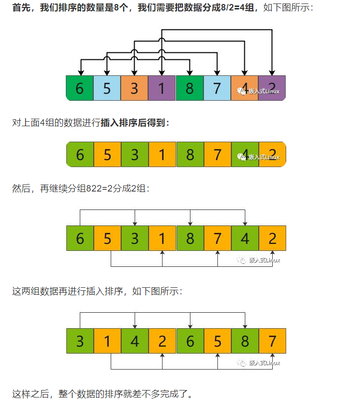

~~~C++
void shell_sort(vi& arr,int n){
    for(int step = n/2; step > 0;step /= 2) {//增量步长
        /*step = 4 2 1*/
        fort(i, step, n) {
            int tmp = arr[i];
            int j = i - step;
            for(;j >= 0 && tmp < arr[j];){
                arr[j + step] = arr[j];
                j -= step;
            }
            arr[j + step] = tmp;

        }
    }
}
~~~

# 杂

## 前缀和、差分

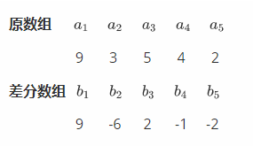

差分的前缀和是原序列，当我们要在某个区间[l,r]的所有值上加上一个数x时，我们只需要在差分数组中进行一加一减即可：bl+x,br+1-x

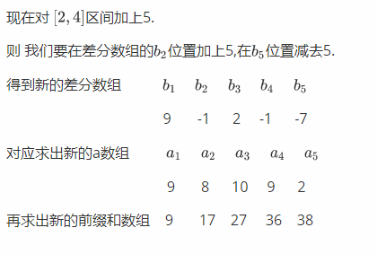

快速求前缀和,sum是前缀和，s为原数组，b为差分数组

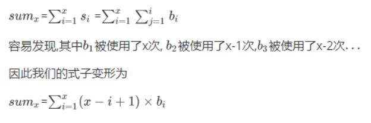

### **二维差分**

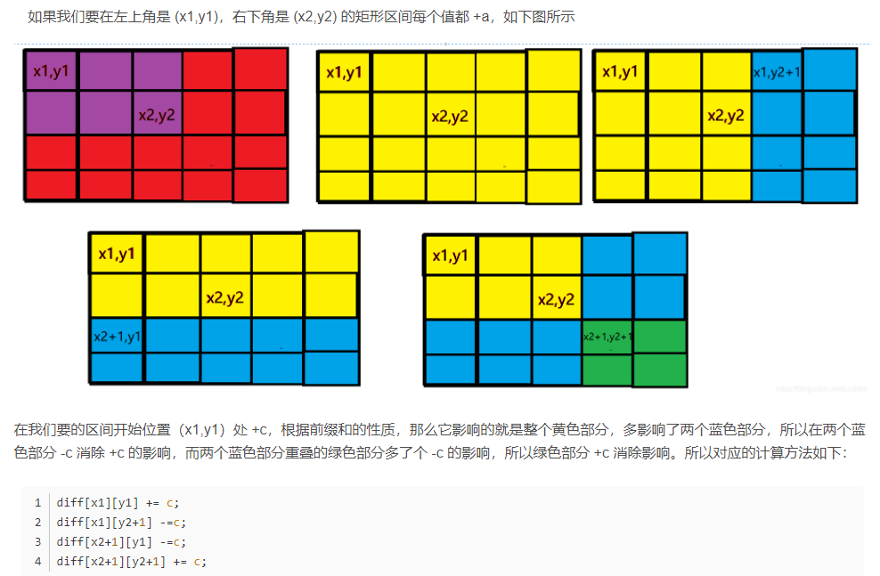

## 逆序对

归并排序 or 树状数组

## 扫描线

主要解决：

1. 矩阵面积问题
2. 矩阵周长问题
3. 多边形面积问题

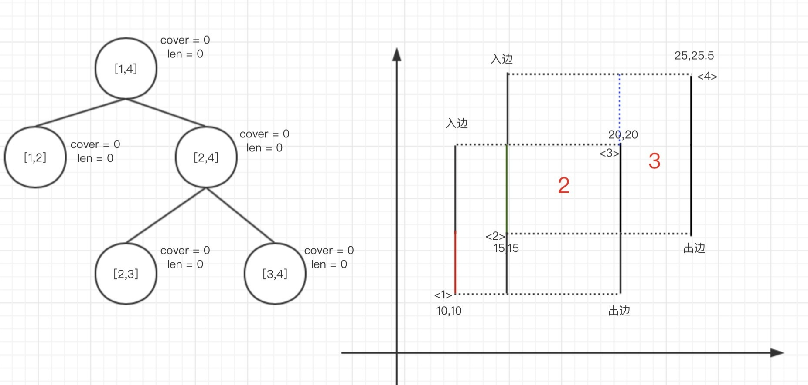

~~~C++
struct ScanLine {
    int x, upy, downy;
    int inout;
    ScanLine() {}
    ScanLine(int x, int y1, int y2, int io) :x(x), downy(y1), upy(y2), inout(io) {}
    bool operator<(ScanLine& j) {
        return x < j.x;
    }
};
vector<int> length, cover, ys;// cover存放i节点对应覆盖情况的值
void pushup(int v, int l, int r) {
    if (cover[v]) length[v] = ys[r] - ys[l];
    else if (l + 1 == r) length[v] = 0;
    else length[v] = length[v << 1] + length[v << 1 | 1];
}
void update(int v, int l, int r, int L, int R, int io) {
    if (L > r || R < l) return;
    if (L <= l && R >= r) {
        cover[v] += io;
        pushup(v, l, r);
        return;
    }
    if (l + 1 == r) return;
    int mid = (l + r) >> 1;
    update(v << 1, l, mid, L, R, io);
    update(v << 1 | 1, mid, r, L, R, io);
    pushup(v, l, r);
}
int rectangleArea(vector<vector<int>>& rectangles) {
    vector<ScanLine> lines;
    ys.clear();
    for (auto& v : rectangles) {
        lines.push_back({ v[0],v[1],v[3],1 });
        lines.push_back({ v[2],v[1],v[3],-1 });
        ys.push_back(v[1]); ys.push_back(v[3]);
    }
    sort(lines.begin(), lines.end());
    sort(ys.begin(), ys.end());
    ys.erase(unique(ys.begin(), ys.end()), ys.end());
    int n = lines.size(), m = ys.size();;
    length = vector<int>(m << 2); cover = vector<int>(m << 2);
    int ans = 0;
    for (int i = 0; i < n; i++) {
        if (i > 0) ans += (lines[i].x - lines[i - 1].x) * length[1];
        int yl = lower_bound(ys.begin(), ys.end(), lines[i].downy) - ys.begin(), yr = lower_bound(ys.begin(), ys.end(), lines[i].upy) - ys.begin(), io = lines[i].inout;
        update(1, 0, m - 1, yl, yr, io);
    }
    return ans;
}
~~~

## 自动状态机

# 几何

## 点积、叉积

~~~C++
//A(a,b),B(c,d)
//A*B=ac+bd;
//AXB=ad-bc;
~~~

## 凸多边形的判断

判断一个四边形（**(x1,y1)->(x4,y4)为逆时针序**，分别为ABCD）是否是凸四边形

~~~C++
bool gimp_transform_polygon_is_convex(double x1, double y1, double x2, double y2, double x3, double y3, double x4, double y4) {
    double z1, z2, z3, z4;
    z1 = ((x2 - x1) * (y3 - y1) - (x3 - x1) * (y2 - y1));//AB X AC
    z2 = ((x3 - x1) * (y4 - y1) - (x4 - x1) * (y3 - y1));//AC X AD
    z3 = ((x3 - x2) * (y4 - y2) - (x4 - x2) * (y3 - y2));//BC X BD
    z4 = ((x4 - x2) * (y1 - y2) - (x1 - x2) * (y4 - y2));//BD X BA
    return (z1 * z2 > 0) && (z3 * z4 > 0);
}
~~~

## 多边形包含

利用叉积判断多边形包含

## 凸包（Graham扫描算法）

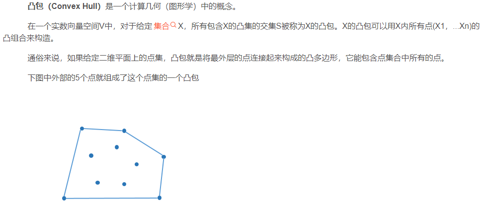

凸包的性质：

1. 它包围了点集中所有的点
2. 它是凸多边形

~~~C++
//计算两个向量叉积
//第一个向量起点a1，终点b1
//第二个向量起点a2，终点b2
double cross(Point a1, Point b1, Point a2, Point b2)
{
    double x1=b1.x-a1.x;
    double x2=b2.x-a2.x;
    double y1=b1.y-a1.y;
    double y2=b2.y-a2.y;
    return x1*y2-x2*y1;
}
vector<Point> convex_hull(vector<Point> p, int n)    //求点集p的凸包，函数返回值为这个凸包的点集
{
    sort(p.begin(), p.end(), cmp);   //按所定的规则给点排序
    int k=0;         //凸包中点的个数
    vector<Point> q(2*n);
    //求下侧链
    for (int i=0; i<n; i++)    //n个点遍历加入凸包并判断凸性
    {
        while (k>1 && cross(q[k-1], q[k-2], p[i], q[k-1])<=0)
            k--;         //如果叉积小于等于0，凸包中最新的点出栈
        q[k++]=p[i];
    }
 
    //求上侧链
    for (i=n-2, t=k; i>=0; i--)
    {
        while (k>t && cross(q[k-1], q[k-2], p[i], q[k-1])<=0)
            k--;
        q[k++]=p[i];
    }
 
    q.resize(k-1);  //重设凸包大小
    return q;
}
~~~

# 数学

## 数论

1. `n * k = lcm(n,k) * gcd(n,k) `//lcm是最小公倍数，gcd是最大公约数

   注意`gcd(0,x)=x`

2. 平方和公式：`1^2+2^2+3^2+...+n^2 = n \* (n+1) \* (2n+1)/6`

3. 立方和公式：`1^3+2^3+3^3+...+n^3 = n^2  * (n+1)^2 / 4`

4. `n(1+1/2+1/3+⋯+1/n) = Θ(nlogn)`

5. 在一场长度为n的数组上[0,n - 1],初始你选择一个位置x，然后跳到(x + d)%n 的位置上，显然这个是有循环的，当且仅当gcd(n,d) = 1 的时候，循环长度为 n

### 计数质数

计算所有小于n的质数数量

#### 埃氏筛

如果x是质数，那么大于x的x的倍数2x,3x,...一定不是质数。证明：这方法显然不会把质数标记为合数；另一方面，当从小到大遍历到数x时，倘若它是合数，则它一定是某个小于x的质数y的整数倍

~~~C++
vector<int> isPrime(n, 1);
int ans = 0;
for (int i = 2; i < n; ++i) {
	if (isPrime[i]) {
 		ans += 1;
        if ((long long)i * i < n) {
         	for (int j = i * i; j < n; j += i) {
 				isPrime[j] = 0;
 			}
 		}
	}
}
~~~

时间复杂度O(n log log n)

#### 线性筛/欧拉筛

相较于埃氏筛，我们多维护一个primes数组表示当前得到的质数集合。
另一点与埃氏筛不同的是，「标记过程」不再仅当 x 为质数时才进行，而是对每个整数 x都进行。对于整数 x，我们不再标记其所有的倍数 x\*x,x\*(x+1),而是只标记质数集合中的数与 x 相乘的数，即x*primes[0],x\*primes[1],....，且在发现x mod primes[i]=0 的时候结束当前标记。
核心点在于：如果 x可以被primes[i]整除，那么对于合数y=x\*primes[i+1]而言，它一定在后面遍历到x/primes[i]\*primes[i+1]这个数的时候会被标记，其他同理，这保证了每个合数只会被其「最小的质因数」筛去，即每个合数被标记一次。

~~~C++
vector<int> primes;
vector<int> isPrime(n, 1);
for (int i = 2; i < n; ++i) {
    if (isPrime[i]) {
        primes.push_back(i);
    }
    for (int j = 0; j < primes.size() && i * primes[j] < n; ++j) {
        isPrime[i * primes[j]] = 0;
        if (i % primes[j] == 0) {
            break;
        }
    }
}
~~~

时间复杂度O(n)

### 扩展欧几里得算法

欧几里得算法是计算两个数的最大公约数（时间复杂度O(log(n)）

~~~C++
int gcd(int a,int b){
    return b == 0 ? a : gcd(b, a % b);
}
~~~

**扩展欧几里得算法的描述是：一定存在整数 x, y 满足等式 a * x + b * y = gcd(a,b)**，求解x, y

### 费马小定理/欧拉定理

**如果a和p互质**，a^(p-1)≡1 (mod p)
如果p/q，我们需要一个E满足E×q≡p(mod(1e9+7))，则E=p*(q^1e9+7-2)

### 线性求逆元

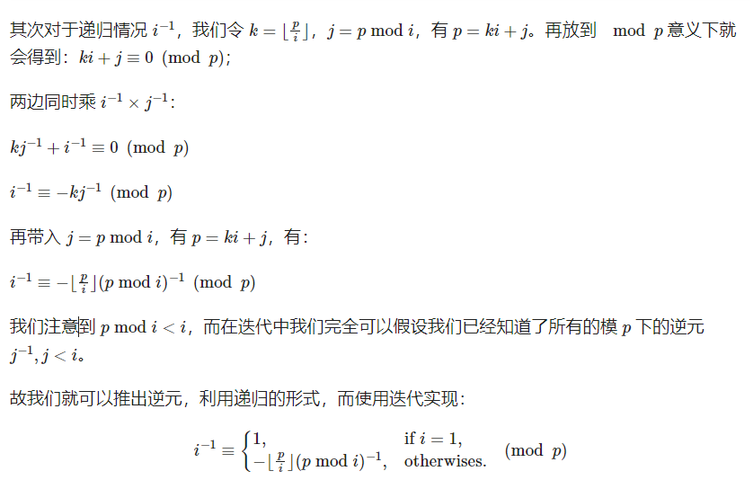

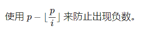

~~~C++
inv[1] = 1;
for (int i = 2; i <= n; ++i) {
  inv[i] = (long long)(p - p / i) * inv[p % i] % p;
}
~~~

### 整数分块

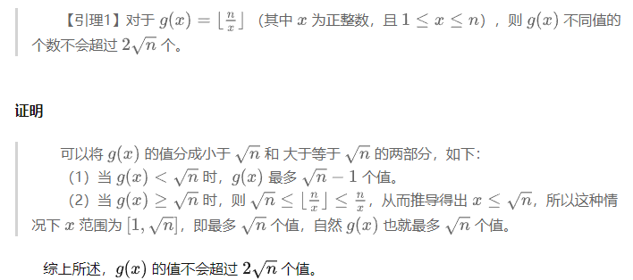

## 线性代数

### 矩阵快速幂

~~~C++
struct Matrix {
    int n, m;
    vvl a;
    Matrix operator *(const Matrix& x)const {
        Matrix res(this->n, x.m);
        forn(i, res.n) {
            forn(j, res.m) {
                forn(k, res.m) res.a[i][j] = (res.a[i][j] + this->a[i][k] * (x.a[k][j])) % mod;
            }
        }
        return res;
    }
    Matrix(int _n = 0, int _m = 0) {
        n = _n; m = _n;
        a = vvl(n, vl(m));
    }
};
Matrix Pow(Matrix x, ll n) {
    Matrix ret(x.n, x.n);
    forn(i, ret.n) ret.a[i][i] = 1;
    while (n) {
        if (n & 1) ret = ret * x;
        n >>= 1; x = x * x;
    }
    return ret;
}
~~~

## 组合数学

### 变下项求和

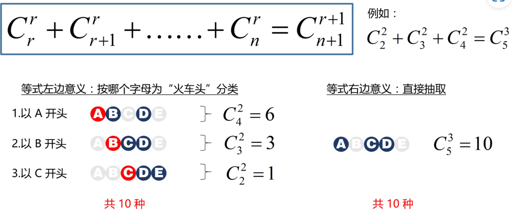

### 组合数+逆元+快速幂

~~~C++
vector<vector<int>> c(n, vector<int>(c));
c[0][0] = c[1][0] = c[1][1] = 1;
for (int i = 2; i < n; ++i) {
    c[i][0] = 1;
    for (int j = 1; j <= n; ++j)
        c[i][j] = (c[i - 1][j] + c[i - 1][j - 1]) % MOD;
}
~~~

时间复杂度O(n^2)

~~~C++
vl F(maxn + 1), I(maxn + 1);
ll pw(ll a, ll b) {
	ll res = 1;
	while (b) {
		if (b & 1) res = res * a % mod;
		a = a * a % mod;
		b >>= 1;
	}
	return res;
}

ll inv(ll x) { return pw(x, mod - 2); }

int init = []() {
	F[0] = 1;
	for (int i = 1; i <= maxn; i++) F[i] = F[i - 1] * i % mod;
	I[maxn] = inv(F[maxn]);
	for (int i = maxn - 1; i >= 0; i--) I[i] = I[i + 1] * (i + 1) % mod;
	return 0;
}();

ll C(int n, int r) {
	if (r > n) return 0;
	return F[n] * I[r] % mod * I[n - r] % mod;
}
ll A(int n, int r) {
	if (r > n) return 0;
	return F[n] * I[r] % mod;
}
~~~

时间复杂度O(n)

函数inv是求x的逆元。ab≡1 (mod c)，则a是b的逆元，b是a的逆元。

### 多重集排列组合

有n个元素，共k种元素，可以区分不同的元素，但是不能区分同一种元素。

#### 多重集排列数

假设多重集一共有N个元素。那么对这N个元素全排列，除掉相同元素的全排列的积即可。

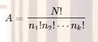

#### 多重集组合数

对于有N种元素的多重集S，选K个元素，注意是个不是种，的可行方案数。可以变成：现在有N个篮子，把K个元素扔进这些篮子里的方案数。注意，这种是特殊情况，也就是说，每种元素无限多个可供挑选。用隔板法答案是

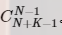

现在有K个元素，分成N堆，也就是要往里插入N−1块板。按理讲应该是

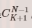

但是因为允许有空集，也就是不插，那么就相当于每块板子插进去之后又产生了新元素，所以是这个答案。

但当每种元素是有限的时候

~~~C++
for(int i=0;i<n;i++)
	for(int j=1;j<=m;j++)
        for(int k=1;k<=a[i];k++)
        	dp[i+1][j]+=dp[i][j-k];
~~~

但是这种写法复杂度较高


分两种情况：

情况1：j<=x[i]  （即j-1<x[i]）

右边展开得到的是dp\[i-1][0] dp\[i-1][1] dp\[i-1][2]....dp\[i-1][j] 、 把最后一项拿出来，剩下的j-1项求和，但是我们写成这样：


且我们能轻易发现，这就是dp\[i][j-1]，也就是 dp[i][j]=dp\[i][j-1]+dp\[i-1][j];

情况 2：  j>x[i]，同理可得dp\[i][j]=dp\[i][j-1]+dp\[i-1][j];

~~~C++
for(int i=0;i<n;i++)//核心代码
	for(int j=1;j<=m;j++)
    	if(j>=a[i]) dp[i+1][j]=dp[i+1][j-1]+dp[i][j]-dp[i][j-1-a[i]];
        else dp[i+1][j]=dp[i+1][j-1]+dp[i][j];
~~~

### 二项式定理

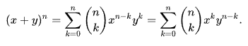

 **C(n，0)+C(n，1)+C(n，2)+...+C(n，n)=(1+1)ⁿ=2ⁿ**

### 容斥原理基础

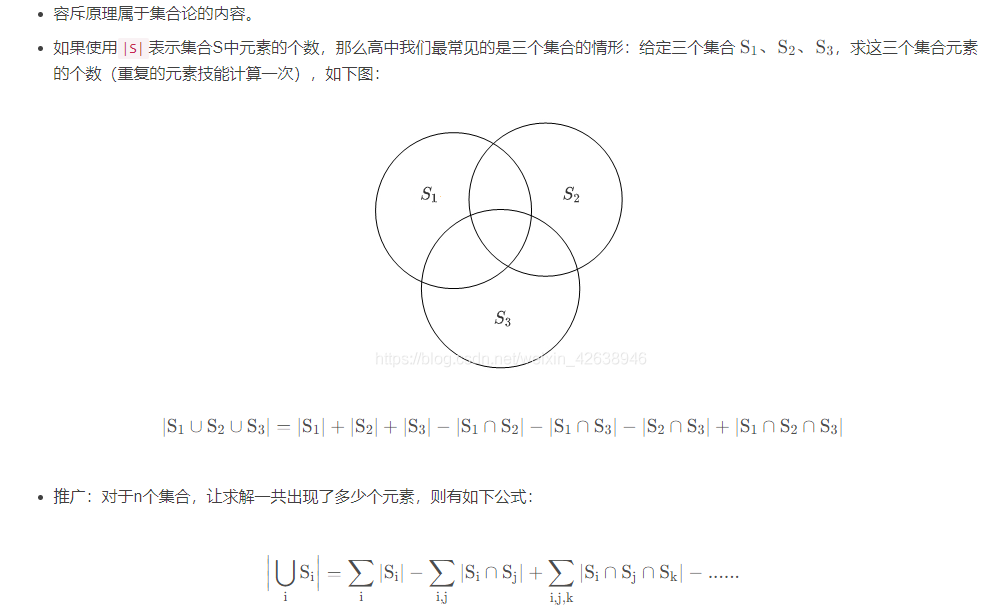

### 常见数列

#### 卡特兰数

以最简单的括号匹配为例，左括号看成+1，右括号看成-1，这样一个合法的序列必须所有前缀和必然大于等于0，并且+1的数量等于-1的数量。
则对于一个非法序列A，找到A的第一个前缀小于0的前缀，将前缀取反得到B，这样B就有n+1个+1以及n-1个-1的序列。由于，A只有一个**“第一个前缀小于0的前缀”**，所以每个A只能产生一个B。而每个B想要还原到A，就需要找到**“第一个前缀和大于0的前缀”**，显然B也只能产生一个A。这样合法的括号序列是

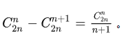

# 字符串

## 字符串哈希

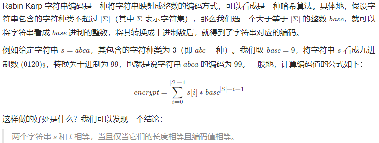

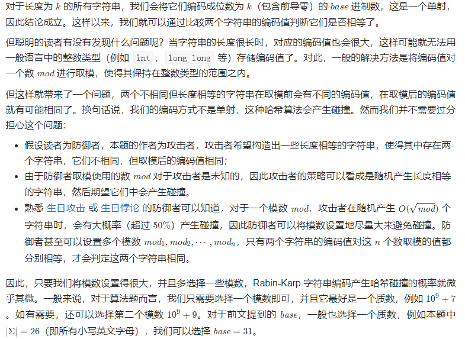

## （0/1）字典树

~~~C++
class Trie {
private:
    unordered_map<int,Trie*> children;
    bool isEnd;
    Trie* searchPrefix(string word){
        Trie* node=this;
        for(char c:word){
            if(!node->children.count(c-'a')){
                return nullptr;
            }
            node=node->children[c-'a'];
        }
        return node;
    }
public:
    Trie() {
        isEnd=false;
    }
    
    void insert(string word) {
        Trie* node=this;
        for(char c:word){
            if(!node->children.count(c-'a')){
                node->children[c-'a']=new Trie();
            }
            node=node->children[c-'a'];
        }
        node->isEnd=true;
    }
    
    bool search(string word) {
        Trie* node=searchPrefix(word);
        return node != nullptr && node->isEnd;
    }
    
    bool startsWith(string prefix) {
        return this->searchPrefix(prefix) != nullptr;
    }
};
~~~

~~~C++
//0-1字典树
class Trie
{
public:
    vector<Trie *> c;
    vector<int> size;
    Trie() : size(2) {}
    void insert(int &x)
    {
        Trie *node = this;
        rfort(i, 29, 0)
        {
            int k = x >> i & 1;
            if (!node->c[k])
                node->c[k] = new Trie();
            node->size[k]++;
            node = node->c[k];
        }
    }
};
~~~

## KMP算法

~~~C++
//在s中找出t出现的第一个位置
int KMP(string s, string t) {
    int m = s.size(), n = t.size();
    if (n == 0) return 0;
    vector<int> next(n, -1);
    for (int i = 1; i < n; i++) {
        int j = next[i - 1];
        while (j != -1 && t[i] != t[j + 1]) {
            j = next[j];
        }
        if (t[i] == t[j + 1]) {
            next[i] = j + 1;
        }
    }
    for (int i = 0, j = -1; i < m; i++) {
        while (j != -1 && s[i] != t[j + 1]) {
            j = next[j];
        }
        if (s[i] == t[j + 1]) {
            j++;
            if (j == n - 1) return i - n + 1;
        }
    }
    return -1;
}
~~~

时间复杂度：O(n+m)    空间复杂度：O(m)

## Manacher算法

~~~C++
//用于寻找最长回文子串，还可以用dp和中心扩展算法
string Manacher(string s) {
    string t = "#";
    for (char c : s) {
        t += c;
        t += '#';
    }

    int n = t.size(), j = 0, rightmax = 0, maxi = 0, maxf = 1;
    vector<int> f(n, 1);
    for (int i = 1; i < n; i++) {
        f[i] = i < rightmax ? min(f[2 * j - i], rightmax - i + 1) : 1;
        while (i + f[i] < n && i - f[i] >= 0 && t[i + f[i]] == t[i - f[i]]) f[i]++;
        if (i + f[i] - 1 >= rightmax) {
            j = i;
            rightmax = i + f[i] - 1;
        }
        if (f[i] >= maxf) {
            maxi = i;
            maxf = f[i];
        }
    }

    string ans;
    for (int i = maxi - maxf + 1; i <= maxi + maxf - 1; i++) {
        if (t[i] != '#') ans += t[i];
    }
    return ans;
}
~~~

时间复杂度：O(n)    空间复杂度：O(n)

## 扩展kmp

# 数据结构

## 哈希映射

### 链地址法

~~~C++
class MyHashMap {
private:
    vector<list<pair<int, int>>> data;
    static const int base = 769;
    static int hash(int key) {
        return key % base;
    }
public:
    MyHashMap(): data(base) {}
    
    void put(int key, int value) {
        int h = hash(key);
        for (auto it = data[h].begin(); it != data[h].end(); it++) {
            if ((*it).first == key) {
                (*it).second = value;
                return;
            }
        }
        data[h].push_back(make_pair(key, value));
    }
    
    int get(int key) {
        int h = hash(key);
        for (auto it = data[h].begin(); it != data[h].end(); it++) {
            if ((*it).first == key) {
                return (*it).second;
            }
        }
        return -1;
    }
    
    void remove(int key) {
        int h = hash(key);
        for (auto it = data[h].begin(); it != data[h].end(); it++) {
            if ((*it).first == key) {
                data[h].erase(it);
                return;
            }
        }
    }
};
~~~

### 开放寻址法

~~~C++
class MyHashMap {
public:
    MyHashMap() {
        hashTable = vector<pair<int, int>>(N, {-1, -1});
    }
    
    int find(int key) {
        int k = key % N;
        while (hashTable[k].first != key && hashTable[k].first != -1) {
            k = (k + 1) % N;//二次探查则是依次尝试k+1^2,k+2^2,k+3^2...
        }
        return k;
    }

    void put(int key, int value) {
        auto k = find(key);
        hashTable[k] = {key, value};
    }
    
    int get(int key) {
        auto k = find(key);
        if (hashTable[k].first == -1) {
            return -1;
        }
        return hashTable[k].second;
    } 
    
    void remove(int key) {
        auto k = find(key);
        if (hashTable[k].first != -1) {
            hashTable[k].first = -2; // Mark as deleted (use a different value with -1)
        }
    }

private:
    const static int N = 20011;
    vector<pair<int, int>> hashTable;
};
~~~

## 单调栈

单调栈的本质是及时弹出对后续无用数据，多用于求区间的最大（小）值

~~~C++
vector<int> a(n), left(n, -1), right(n, n);
stack<int> q;
forn(i, n) {
	cin >> a[i];
	while (!q.empty() && a[q.top()] < a[i]) {
		right[q.top()] = i;
		q.pop();
	}
	if (!q.empty()) left[i] = q.top();
    q.push(i);
}
~~~

## 对顶堆

例如用于解决求中位数问题

## 树

### 树的基础

#### 树的重心

**定义**：计算无根树每个点为根节点时的最大子树大小

**性质**：树中所有点到某个点的**距离和**中，到重心的距离和是最小的；如果有两个重心，那么到它们的距离和一样。反过来，距离和最小的点一定是重心。

#### 树的直径

任意一个点的最远点一定是直径的一个端点

### 时间戳+lca

~~~C++
void init(int& n) {
    dep = vector<int>(n + 1); in = vector<int>(n + 1); out = vector<int>(n + 1);
    g = vector<vector<int>>(n + 1); fa = vector<vector<int>>(n + 1, vector<int>(30, -1));
    t = 0;
}

bool cmp(int a, int b) {
    return dep[a] > dep[b];
}
void dfs(int u, int p) {
    in[u] = ++t;
    dep[u] = dep[p] + 1;
    for (int v : g[u]) {
        if (v != p) {
            fa[v][0] = u;
            int up = 0, pre = u;
            while (fa[pre][up] >= 0) {
                fa[v][up + 1] = fa[pre][up];
                pre = fa[pre][up++];
            }
            dfs(v, u);
        }
    }
    out[u] = t;
}
bool isp(int u, int v) {
    return in[u] <= in[v] && out[v] <= out[u];
}
bool is_link(vector<int>p) {
    sort(p.begin(), p.end(), cmp); reverse(p.begin(), p.end());
    for (int i = 1; i < p.size(); i++) {
        if (!isp(p[i - 1], p[i])) return false;
    }
    return true;
}
int lca(int a, int b) {
    if (dep[a] < dep[b]) swap(a, b);
    int lim = log2(dep[a]) + 1;
    for (int i = lim; i >= 0; --i) {
        if (fa[a][i] != -1 && dep[fa[a][i]] >= dep[b]) a = fa[a][i];
    }
    if (a == b) return a;
    for (int i = lim; i >= 0; --i) {
        //如果fa[a][i]==fa[b][i],说明他们的公共祖先深度可能更深，因此不用更新，向更深的方向查找
        //如果fa[a][i]!=fa[b][i]，说明目前他们的公共祖先比当前的祖先深度更浅，但是要深于上一个i，因此刷新a和b，向更小的范围查找祖先
        if (fa[a][i] != fa[b][i]) {
            a = fa[a][i];
            b = fa[b][i];
        }
    }//最后发现祖先
    if (fa[a][0] == fa[b][0]) return fa[a][0];
    else return -1;

~~~

### 基环树

从 i 向edges[i] 连边，我们可以得到一张有向图。由于每个大小为 k 的连通块都有 k 个点和 k 条边，所以每个连通块必定有且仅有一个环，且由于每个点的出度均为 1，这样的有向图又叫做内向基环树 (pseudo tree)，由基环树组成的森林叫**基环树森林** (pseudo forest)。
每一个内向基环树（连通块）都由一个**基环**和其余指向基环的**树枝**组成
对于内向基环树，每个连通块至多有一个环，我们可以利用时间戳来实现找环的逻辑。
具体来说，初始时间戳clock=1，首次访问一个点 x 时，记录访问这个点的时间time[x]=clock，然后将 clock 加一。
如果首次访问一个点，则记录当前时间 startTime=clock，并尝试从这个点出发，看能否找到环。如果找到了一个之前访问过的点 x，且访问 x 的时间不早于startTime，则说明我们找到了一个新的环，此时的环长就是前后两次访问 x 的时间差，即clock−time[x]。

### 树状数组

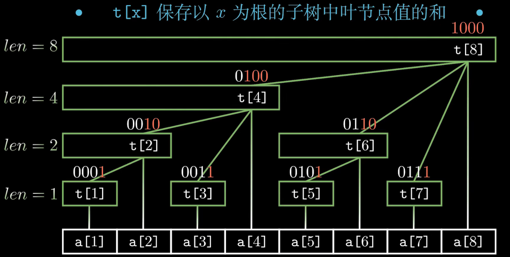

t[x]节点覆盖的长度等于lowbit(x)

```C++
//还可以维护和修改区间最大值
class BIT {
private:
    vector<long long> tree;
public:
    BIT(int n) : tree(n) {}
    void add(int x, int val) {
        while (x < tree.size()) {
            tree[x] += val;
            x += x & -x;
        }
    }
    long long query(int x) {
        long long res = 0;
        while (x > 0) {
            res += tree[x];
            x &= x - 1;
        }
        return res;
    }
};
```

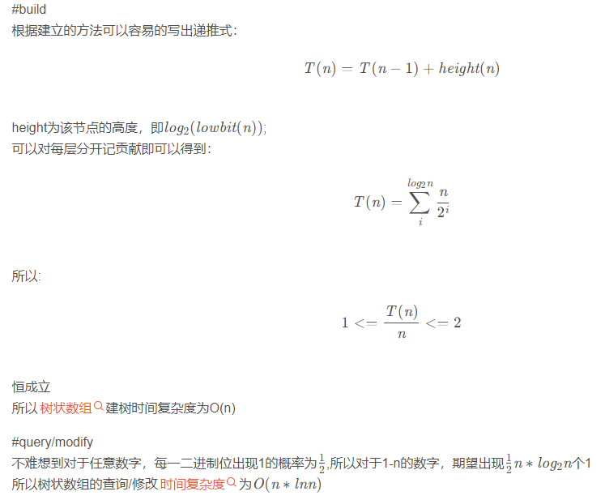

### 线段树

#### 静态线段树

```C++
void build(int v, int l, int r) {
	if (l == r) {
		t[v] = a[l]; return;
	}
	int mid = (l + r) >> 1;
	build(v << 1, l, mid);
	build(v << 1 | 1, mid + 1, r);
	t[v] = t[v << 1] + t[v << 1 | 1];
}
void update(int v, int l, int r, int x, int V) {
	if (l == r) {
		t[v] = V;
		return;
	}
	int mid = (l + r) >> 1;
	if (x <= mid) update(v << 1, l, mid, x, V);
	else update(v << 1 | 1, mid + 1, r, x, V);
	t[v] = t[v << 1] + t[v << 1 | 1];
}
int query(int v, int l, int r, int L, int R) {
	if (l >= L && r <= R) return t[v];
    if (r < L || l > R) return 0;
	int mid = (l + r) >> 1;
    return query(v << 1, l, mid, L, R) + query(v << 1 | 1, mid + 1, r, L, R);
}
```

#### 动态开点的线段树

通常来说，线段树占用空间是总区间长 n 的常数倍，空间复杂度是 O(n) 。然而，有时候 n 很巨大，而我们又不需要使用所有的节点，这时便可以**动态开点**——不再一次性建好树，而是一边修改、查询一边建立。我们不再用`p*2`和`p*2+1`代表左右儿子，而是用`ls`和`rs`记录左右儿子的编号。设总查询次数为 m ，则这样的总空间复杂度为 O(mlog⁡n) 。

比起普通线段树，动态开点线段树有一个优势：**它能够处理零或负数位置。此时，求mid时不能用(l+r)/2，而要用(l+r-1)/2**

~~~C++
#define ls(x) t[x].ls
#define rs(x) t[x].rs
#define val(x) t[x].val
#define mark(x) t[x].mark
const int MAXV = 9e6;
int cnt;
struct node {
    ll val, mark;
    int ls, rs;
} t[MAXV];
void push_down(int p, int len) {
    if (len <= 1) return;
    if (!ls(p)) ls(p) = ++cnt;
    if (!rs(p)) rs(p) = ++cnt;
    val(ls(p)) += mark(p) * (len / 2);
    mark(ls(p)) += mark(p);
    val(rs(p)) += mark(p) * (len - len / 2);
    mark(rs(p)) += mark(p);
    mark(p) = 0;
}
void update(int v, int l, int r, int L, int R, int d) {
    if (R<l || L>r) return;
    if (l >= L && r <= R) {
        val(v) += d * (r - l + 1);
        mark(v) += d;
        return;
    }
    push_down(v, r - l + 1);
    int mid = (l + r - 1) / 2;
    update(ls(v), l, mid, L, R, d);
    update(rs(v), mid + 1, r, L, R, d);
    val(v) = val(ls(v)) + val(rs(v));
}
ll query(int v, int l, int r, int L, int R) {
    if (R<l || L>r) return 0;
    if (l >= L && r <= R) return val(v);
    push_down(v, r - l + 1);
    int mid = (l + r - 1) / 2;
    return query(ls(v), l, mid, L, R) + query(rs(v), mid + 1, r, L, R);
}
~~~

可以看到，除了在`push_down`中进行了新节点的创建，其他基本和普通线段树一致。动态开点线段树不需要`build`，通常用在没有提供初始数据的场合（例如初始全0），这时更能显示出优势。当然，除了动态开点，其实先离散化再建树也常常能达到效果。但动态开点写起来更简单直观，而且在强制在线时只能这样做。

#### 区间更新的优化

~~~C++
void build(int v, int l, int r) {
	if (l == r) {
		t[v].first = a[l];
		return;
	}
	int mid = (l + r) >> 1;
	build(v << 1, l, mid);
	build(v << 1 | 1, mid + 1, r);
	t[v].first = min(t[v << 1].first, t[v << 1 | 1].first);
}
void pushdown(int v) {
	if (t[v].second) {
		t[v << 1].first += t[v].second;
		t[v << 1].second += t[v].second;

		t[v << 1 | 1].first += t[v].second;
		t[v << 1 | 1].second += t[v].second;

		t[v].second = 0;
	}
}
void update(int v, int l, int r, int L, int R, int val) {
	if (R<l || L>r) return;
	if (L <= l && R >= r) {
		t[v].first += val;
		t[v].second += val;
		return;
	}
	pushdown(v);
	int mid = (l + r) >> 1;
	update(v << 1, l, mid, L, R, val);
	update(v << 1 | 1, mid + 1, r, L, R, val);
	t[v].first = min(t[v << 1].first, t[v << 1 | 1].first);
}
int query(int v, int l, int r, int L, int R) {
	if (L <= l && R >= r) return t[v].first;
	if (r < L || l > R) return INT_MAX;
	pushdown(v);
	int mid = (l + r) >> 1;
	return min(query(v << 1, l, mid, L, R), query(v << 1 | 1, mid + 1, r, L, R));
}
~~~

##### 总结

数组不变，区间查询：前缀和
数组单点修改，区间查询：树状数组
数组区间修改，单点查询：差分
数组区间修改，区间查询：线段树

### 并查集

~~~C++
class dsu {
public:
    int n;
    vector<int> p, size;
    dsu(int _n) :n(_n), p(n), size(n, 1) {
        iota(p.begin(), p.end(), 0);
    }
    int get(int x) {
        return x == p[x] ? p[x] : p[x] = get(p[x]);
    }
    bool unite(int x, int y) {
        x = get(x), y = get(y);
        if (x != y) {
            if (size[x] > size[y]) swap(x, y);
            p[x] = y;
            size[y] += size[x];
            return true;
        }
        return false;
    }
};
~~~

## st表

### RMQ(区间最值问题)

我们设二维数组dp\[i][j]表示从第i位开始连续 2^j 个数中的最大(小)值。

~~~C++
void rmq_init()
{
	for (int i = 0; i < n; i++)
		dp[i][0] = arr[i];
	for (int j = 1; (1 << j) <= n; j++)
		for (int i = 0; i + (1 << j) - 1 < n; i++)
			dp[i][j] = min(dp[i][j - 1], dp[i + (1 << j - 1)][j - 1]);
}
~~~

#### RMQ的查询部分

~~~C++
int rmq(int l, int r)
{
	int k = log2(r - l + 1);
	return min(dp[l][k], dp[r - (1 << k) + 1][k]);
}
~~~

# 动态规划

## 背包问题

### 多重背包

#### 朴素做法

~~~C++
for (int i = 1; i <= N; i++) {
	//读入体积,价值,件数
	cin >> v >> w >> s;
	for (int j = V; j >= 0; j--) {
		//注意k*v一定小于j
		for (int k = 1; k <= s && k * v <= j; k++) {
			dp[j] = max(dp[j], dp[j - k * v] + k * w);//01背包一维动态方程,当前体积为j的最优解
		}
	}
}
~~~

时间复杂度：O(nml)

#### 二进制优化做法

~~~C++
for (int i = 1; i <= n; i++)
{
    int a, b, s;//体积,价值,数量
    scanf("%d%d%d", &a, &b, &s);
    //将s件用二进制转换为log2s堆
    for (int k = 1; k <= s; k <<= 1)
    {
        v[++cnt] = k * a;//前++,第1种,第二种.....
        w[cnt] = k * b;
        s -= k;
    }
    if (s)//s有剩余,自立为新品种
    {
        v[++cnt] = s * a;
        w[cnt] = s * b;
    }
}
//01背包做法
for (int i = 1; i <= cnt; i++)
{
    for (int j = m; j >= v[i]; j--)
    {
        dp[j] = max(dp[j], dp[j - v[i]] + w[i]);//动态转移方程和01背包完全相同
    }
}
~~~

时间复杂度 O(V*Σlog n[i])

### 树形背包

给定一棵有n个节点的点权树，要求从中选出m个节点，使得这些选出的节点的点权和最大，一个节点的**父节点**被选之后才可以**选择**。题目一般是一个物品只能依赖一个物品，但一个物品可以被多个物品依赖。

~~~C++
for (int& v:g[u]){
    if (v==p) continue;
    dfs(v, u, V - val[u]);
    for (int j = m; j >= val[u]; --j)
        for (int k = 0; k <= j - val[u]; ++k)
            f[u][j] = max(f[u][j], f[u][j - k - val[u]] + f[v][k] + w[u]);
}
~~~

复杂度为O(n3)
因为遍历整棵树是O(n)的，而选取子节点和i是O(m2)的所以整个程序的复杂度为O(nm2)

## 数位dp

~~~C++
//如果一个正整数每一个数位都是互不相同的，我们称它是特殊整数。返回[1,n]之间的特殊整数的数目。
auto s = to_string(n);
int m = s.length(), dp[m][1 << 10];
memset(dp, -1, sizeof(dp));
//返回从i开始填数字，i前面填的数字是mask，能构造出特殊整数的数目。
//isLimit表示前面填的数字是否是对应位上面的，如果为true，则当前位至多为int(s[i]),否则至多为9
//isNum表示前面是否填了数字，如果为true，则当前位可以从0开始，否则我们可以跳过，或者从1开始
//时间复杂度对于dp来说，等于状态个数*转移个数
function<int(int, int, bool, bool)> f = [&](int i, int mask, bool isLimit, bool isNum) -> int {
    if (i == m) return isNum;
    if (!isLimit && isNum && dp[i][mask] >= 0) return dp[i][mask];
    int res = 0;
    if (!isNum) res = f(i + 1, mask, false, false); // 可以跳过当前数位
    for (int d = 1 - isNum, up = isLimit ? s[i] - '0' : 9; d <= up; ++d) // 枚举要填入的数字 d
        if ((mask >> d & 1) == 0) // d 不在 mask 中
            res += f(i + 1, mask | (1 << d), isLimit && d == up, true);
    if (!isLimit && isNum) dp[i][mask] = res;
    return res;
};
return f(0, 0, true, false);
~~~

## 树形DP+换根

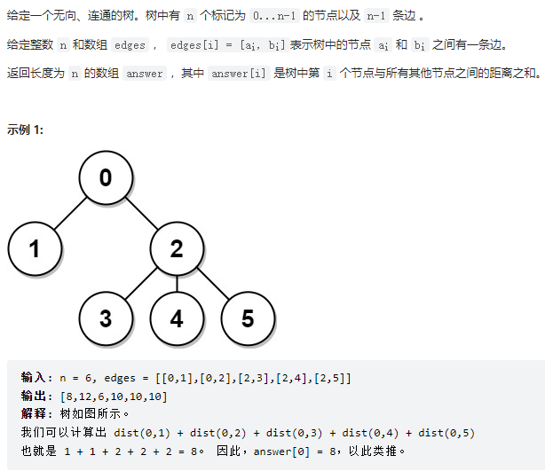

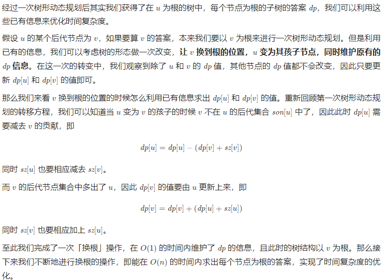

~~~C++
vector<int> ans, sz, dp;//dp[u]表示以u为根的子树，sz[u]表示以u为根的子树的节点数量
vector<vector<int>> graph;
void dfs(int u, int f)
{
    sz[u] = 1;
    dp[u] = 0;
    for (auto &v : graph[u])
    {
        if (v == f)
        {
            continue;
        }
        dfs(v, u);
        dp[u] += dp[v] + sz[v];
        sz[u] += sz[v];
    }
}

void dfs2(int u, int f)
{
    ans[u] = dp[u];
    for (auto &v : graph[u])
    {
        if (v == f)
        {
            continue;
        }
        int pu = dp[u], pv = dp[v];
        int su = sz[u], sv = sz[v];

        dp[u] -= dp[v] + sz[v];
        sz[u] -= sz[v];
        dp[v] += dp[u] + sz[u];
        sz[v] += sz[u];

        dfs2(v, u);

        dp[u] = pu, dp[v] = pv;
        sz[u] = su, sz[v] = sv;
    }
}
~~~

## 计数dp

应用于整数划分

## 概率dp

一般情况下，解决概率问题需要顺序循环，而解决期望问题使用逆序循环

看一系列事情的总的期望，等于第一件事的期望，加第二件事的期望，加......

# 图论

## 最短路（Bellman-Ford）

Bell-Ford算法专用处理**可能存在负环**的**有限路线单源最短路**问题。其实现方式是通过m次迭代求出从源点到终点**不超过m条边构成的最短路的路径**。一般情况下要求途中不存在**负环**。但是在边数有限制的情况下允许存在负环。因此Bellman-Ford算法是可以用来判断负环的。

```cpp
int dist[N],backup[N];//dist距离，backup用来存上一次的结果。
struct edge//用来存边
{
    int a;
    int b;
    int w;
}Edge[M];
int Bellman_Ford()
{
    memset(dist, 0x3f, sizeof dist);
    dist[1] = 0;//初始化
    for(int i = 0 ; i < k ; i++)//遍历k次
    {
        memcpy(backup,dist,sizeof dist);//存上一次答案。
        for(int j = 0 ; j < m ; j++)
        {
            int a = Edge[j].a, b = Edge[j].b, w = Edge[j].w;
            dist[b] = min(dist[b],backup[a] + w);
        }//遍历所有边
    }
    if(dist[n] > 0x3f3f3f3f/2) return -1;
    /*这里不像Dijkstra写等于正无穷是因为可能有负权边甚至是负环的存在，
    使得“正无穷”在迭代过程中受到一点影响。*/
    return dist[n];
}
```

## 最小生成树

### Prim

~~~C++
int prim(vector<vector<int>>& points, int start) {
    int n = points.size();
    if (n == 0) return 0;
    int res = 0;

    // 将points转化成邻接表
    vector<vector<int> > g(n);
    for (int i = 0; i < n; i++) {
        for (int j = 0; j < n; j++) {
            if (i == j) continue;
            g[i].push_back(j);
            g[j].push_back(i);
        }
    }

    // 记录V[i]到Vnew的最近距离
    vector<int> lowcost(n, INT_MAX);
    // 记录V[i]是否加入到了Vnew
    vector<int> v(n);

    // 格式：<距离, 下标>
    priority_queue<pair<int, int>, vector<pair<int, int>>, greater<>> pq;
    pq.push(make_pair(0, start));

    while (!pq.empty()) {
        auto [dist, i] = pq.top();
        pq.pop();
        if (v[i]) continue;
        v[i] = 1;
        res += dist;
		
        for(int& j : g[i]){
            int w = abs(points[i][0] - points[j][0]) + abs(points[i][1] - points[j][1]);
            if (v[j] == -1 && lowcost[j] > w) {
                lowcost[j] = w;
                pq.push(make_pair(w, j));
            }
        }
    }
    return res;

}
int minCostConnectPoints(vector<vector<int>>&points) {
    return prim(points, 0);
}
~~~

### Kruskal

~~~C++
int n = points.size();
dsu d(n);
priority_queue<pair<int, int>, vector<pair<int, int>>, cmp> q;
for (int i = 0; i < n; i++) {
	for (int j = i + 1; j < n; j++) {
		q.push({ abs(points[i][0] - points[j][0]) + abs(points[i][1] - points[j][1]),i * n + j });
	}
}
int cnt = 0, ans = 0;
while (!q.empty()) {
	auto [dist, t] = q.top();
	q.pop();
	int i = t / n, j = t % n;
	if (d.unite(i, j)) {
		cnt++;
		ans += dist;
	}
	if (cnt == n - 1) break;
}
return ans;
~~~

## 二分图网络匹配（匈牙利算法）

**二分图**：设G=(V,E)是一个无向图，如果顶点V可分割为两个互不相交的子集，并且图中每条边所关联的两个顶点分别属于两个不同的顶点集，则称图G是一个二分图

**二分图匹配定义**：

图G的匹配是由一组没有公共端点不是圈的边构成的集合。

在一个二分图内找出一些边，使得任何一个图中的点都被至多一条边连接，这些边的集合叫做一个**二分图匹配**。

如果存在一种二分图匹配方案，使得选出的边的数量最多，那么这就叫做**二分图的最大匹配**。

如果该二分图的最大匹配方案中，所有的顶点均被一条边所连接，那么这个方案就叫做**二分图的一个完美匹配**。
**注意：完美匹配一定是最大匹配，而最大匹配不一定是完美匹配**。

**二分图的最小覆盖**分为最小顶点覆盖和最小路径覆盖：
①最小顶点覆盖是指最少的顶点数使得二分图G中的每条边都至少与其中一个点相关联，二分图的最小顶点覆盖数=二分图的最大匹配数；
②最小路径覆盖也称为最小边覆盖，是指用尽量少的不相交简单路径覆盖二分图中的所有顶点。二分图的最小路径覆盖数=|V|-二分图的最大匹配数；

**增广路**：若P是图G中一条连通两个未匹配顶点的路径，并且属于M的边和不属于M的边(即已匹配和待匹配的边)在P上交替出现，则称P为相对于M的一条增广路径。
通俗一点，增广路就是一个由A − B − A − B − . . . 的顺序选择一些边的过程。

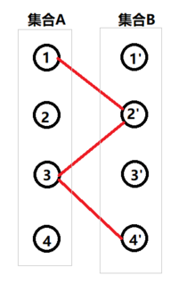

### **匈牙利算法**（**求二分图的最大匹配数和最小点覆盖数**。）

匈牙利算法的核心就是不停的寻找增广路径来扩充匹配集合M。

~~~C++
int m, n;//M, N分别表示左、右侧集合的元素数量
vvi g(m);//左侧元素的连接的右侧元素
vi p(n);//记录当前右侧元素所对应的左侧元素
vi vis(n);//记录右侧元素是否已被访问过
bool dfs(int i)
{
    for (auto& j : g[i]) {
        if (!vis[j]) {
            vis[j] = 1;
            if (p[j] == 0 || dfs(p[j])) {
                p[j] = i;
                return true;
            }
        }
    }
    return false;
}
int Hungarian()
{
    int cnt = 0;
    forn(i, m) {
        vis = vi(n);
        if (dfs(i)) cnt++;
    }
    return cnt;
}
~~~

时间复杂度：O(V*E)

## 欧拉（回）路

**欧拉路**指的是：存在这样一种图，可以从其中一点出发，不重复地走完其所有的边。如果欧拉路的起点与终点相同，则称之为**欧拉回路**。

~~~C++
void dfs(int u) {
	int n = g[u].size();
	rfort(i, n - 1, 0) {
		int v = g[u][i];
		g[u].pop_back();
		dfs(v);
	}
	ans.push_back(u);
}
reverse(all(ans));
~~~

## tarjan算法

~~~C++
vector<int> dfn, low;// 节点的时间戳和追溯值
void tarjan(int u, int fa) {
    dfn[u] = low[u] = ++num;
    for (int v : adj[u]) {
        if (v == fa) continue;
        if (!dfn[v]) {
            tarjan(v, u);
            low[u] = min(low[u], low[v]);
            if (dfn[u] < low[v]) res.push_back({ u, v });
        }
        else {
            low[u] = min(low[u], dfn[v]);
        }
    }
}
for (int u = 0; u < n; u++) {
	if (!dfn[u]) tarjan(u, -1);
}
~~~

