# Lab2: Raft

分布式系统采用多台机器存储同一个数据集，不仅可以增强系统的负载能力，而且在单台机器故障的时候，其他机器可以继续提供数据的读写服务，从而提高系统的可用性。Raft算法用于解决如何在不同机器上数据集保持一致。

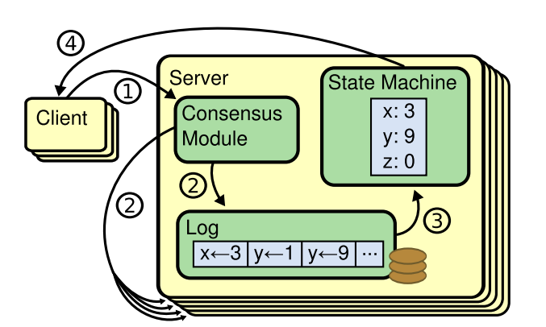

## 1. 简单介绍

在raft算法中，每个机器节点的状态包含三种：leader、follower、candidate。系统在时间上被划分为一系列连续的任期term，每个term的leader可以产生连续的log，如下图所示。每个任期term可以选举出一个leader，该term的leader选举出来后可以产生日志。**异常情况下，一些任期term可能选举leader会失败而直接进入下一个term，或者leader没有产生任何日志就超时从而进入下一个选举周期。**

每个raft节点仅需要保存当前leader任期，给谁投过票（保证一个节点不会向多个节点投票），日志。

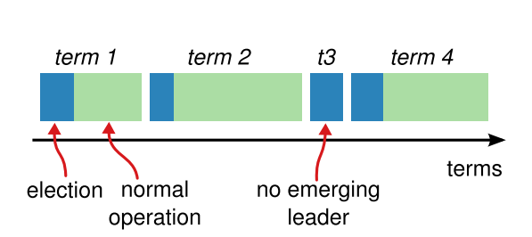

leader节点需要将其产生的log复制给其他节点，当多数派节点收到log则表明该log可提交。**对于集群机器更换或者扩缩容，leader节点生成配置变更日志并且复制给其他节点来达成一致。**

此时，Raft算法需要解决三个问题：

1. **raft如何安全地选举出一个leader？**

2. **leader如何将log安全地复制到其他节点？**

3. **集群如何安全地变更机器节点？**

## 2. 如何安全地选举出一个leader？

### 2.1 选举流程

节点初始化的时候，首先进入到follower状态，一段时间内没有收到leader节点的心跳就会切换到candidate状态去竞选leader。节点进入到candidate状态后，首先将自身任期term加一，然后给自己投票，并且向其他节点广播RequestVote投票请求。candidate竞选leader的结果有三种：

1. 拿到多数派投票，切换为leader。

2. 发现其他节点已经是leader（其任期term不小于自身term），则切换为follower。

3. 选举超时后重来一遍选举流程（**比如多个candidate同时参与竞选leader导致每个candidate都拿不到多数派投票**）。

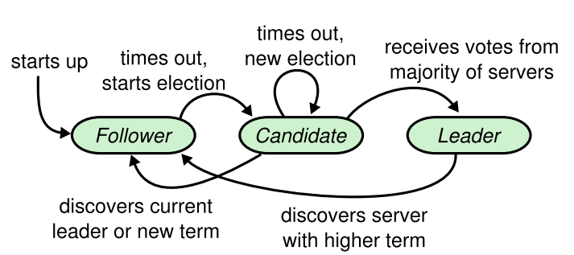

candidate每次选举时都会设置随机的选举超时时间，避免一直有多个candidate同时参与竞选。candidate竞选成为leader后，就不停地向其他节点广播心跳请求，以维持自己的leader状态同时也为了阻止其他节点切换为candidate去竞选leader。

最后，因为日志复制只会从leader复制到其他节点，所以在选举的时候，必须确保新leader包含之前任期所有提交的日志。

### 2.2 如何安全选举？

leader选举过程中，候选者candidate发出的投票请求协议。投票请求会带上候选者自身的任期term、candidateId、最新日志的任期term和index，其他节点收到请求后如果发现候选者的任期 >= 自身任期 并且 候选者的最新日志 >= 自身的最新日志，则回复同意。

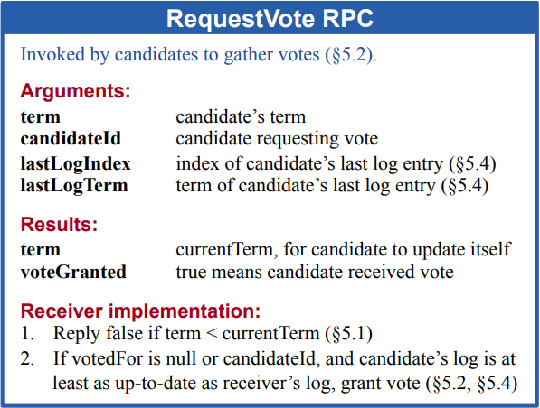

　　每条日志的元数据包括任期term以及一个自增的日志索引。日志大小的比较规则是：先比较日志的任期term，term相同则再比较日志的logIndex。


　　下面用个例子来证明leader选举的安全性。比如有5台机器，多数派机器拥有最新提交的日志，如果此时有1台机器拿到了多数派投票成为leader，因为两个多数派必然存在交集，所以被选出来的leader，其日志必然 >= 最新提交的日志。因此可以得出1个结论：**新leader节点一定包含最新提交的日志。**


**问题1：考虑一个场景，比如某个机器网络故障导致它一直收不到leader的心跳消息，那它就会切换到candidate状态，并且会一直选举超时，那它就会一直增加自身的任期term，当网络恢复正常的时候，原有leader就会收到较高任期term的请求从而被迫切换到follower状态，这样就会影响到整个集群的稳定性。**

这里有两个解决方法：

1. 在工程实现的时候，candidate都会增加一个preVote预投票阶段。在预投票阶段，candidate不增加自身term而只会广播投票请求，只有拿到多数派投票后才进入正式投票阶段，这样就可以避免由于网络分区导致集群的term不断增大进而影响集群的稳定性。
2. 在做Leader选举的时候，任期号大的一方在请求任期号小的一方投票时，会覆盖其任期号，然后比较日志长度。

## 3. raft的日志复制以及日志安全性

### 3.1 日志复制请求

leader处理写请求过程中，向其他节点发出的日志复制请求协议。请求会带上leader自己的任期term、LeaderId、本次待复制的日志列表、上一条日志的prevLogIndex和prevLogTerm、已达到多数派一致而提交的最大日志索引commitIndex。**其他节点收到请求后，如果发现leader的任期 >= 自身任期 并且 日志一致性检查通过，则用请求中待复制的日志列表直接覆盖本地的日志，并且更新本地的commitIndex。日志一致性检查的逻辑是：自身节点已存在的日志列表中如果包含请求中指定prevLogIndex、prevLogTerm的日志，则检查通过。**

**某个follower结点未通过一致性检查则返回失败，Leader通过回退prevLogIndex和prevLogTerm直到找到与该follower相同的槽位，然后对follower结点的日志进行覆盖。**

**问题2：为什么follower日志的某个槽位和leader日志对应的槽位相同能保证follower之前日志的正确性？**

事实上，raft算法能保证这种正确性，因为Leader在给follower追加日志时，会check follower的日志，如果follower日志不正确，那么在不正确的日志片段后面就不可能出现正确的日志。

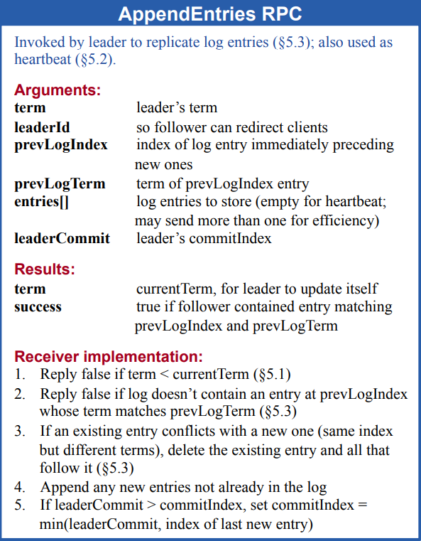

举个例子，机器节点d作为term 7的leader节点，产生两条日志后发生异常，之后其中一台机器在term 8成功竞选成为leader并生成了一条新日志，这条新日志的logTerm为8，logIndex为11。这个新任leader在将这条新日志复制给其他节点的时候，会带上前一条日志的元数据，也就是prevLogTerm为6，prevLogIndex为10。刚开始由于只有节点c和d包含这个前一条日志而复制成功，其他节点则会拒绝复制。leader节点收到复制失败的回包后，需要往前移动待复制的日志列表然后重新发送日志复制请求。例如leader节点能够成功向节点b复制日志的请求，该请求体的内容为：前一条日志的prevLogTerm为4，prevLogIndex为4，而待复制的日志列表则包含从logIndex为5开始的所有日志。

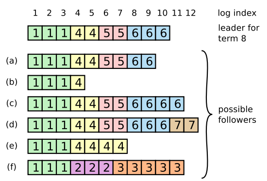

**问题3：leader在运行过程中为什么要维护follower的nextIndex和matchIndex**。

**nextIndex 是对追加位置的一种猜测，是乐观的估计**。因此，当 Leader 上任时，会将 nextIndex 全部初始化为 last log index + 1，即乐观地估计所有 Follower 的 log 已经与自身相同。AppendEntries PRC 中，Leader 会根据 nextIndex 来决定向 Follower 发送哪些 entry。当返回失败时，则会将 nextIndex 减一，猜测仅有一条 entry 不一致，再次乐观地尝试。实际上，使用 nextIndex 是为了提升性能，仅向 Follower 发送不一致的 entry，减小 RPC 传输量。

**matchIndex 则是对同步情况的保守确认，为了保证安全性**。matchIndex 及此前的 entry 一定都成功地同步。matchIndex 的作用是帮助 Leader 更新自身的 commitIndex。

**问题4：客户端向raft集群写数据的具体流程？**

如果客户端想在raft集群中加数据，在AppendEntries中leader会设置prevLogIndex=log[nextIndex-1].index, prevLogTerm=log[nextIndex-1].term，follower会据此判断对应槽位的数据是否和leader相同，如果相同，follower会添加leader日志中[nextIndex,len(log)-1]的数据；不相同则follower向leader返回失败，leader会回退prevLogIndex和prevLogTerm，重新发送AppendEntries。如果在某段时间内leader并未收到超过半数的success，那么他会向客户端返回失败。


### 3.2 raft的日志匹配性质

日志复制到其他节点后，不同节点上的日志会满足一个匹配性质。不同节点上的两个日志条目，如果logTerm 、logIndex都相同，则有：

1. 由于leader节点对于给定的任期term、给定的logIndex至多创建1个日志条目，那么这两条日志必然包含相同的状态机输入。

2. **因为存在日志复制请求的一致性检查，所以这两个节点上，位于这条相同日志之前的所有日志条目必然也会相同。**

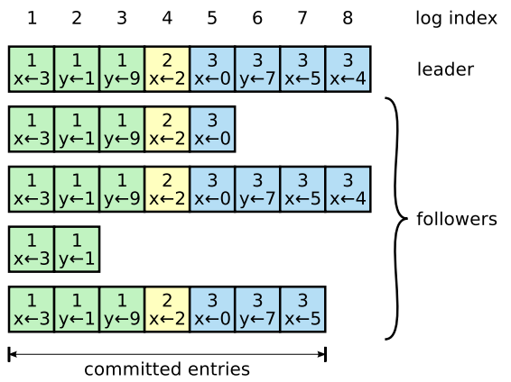

通过这个日志匹配性质，就可以总结出：**所有节点都会拥有一致的状态机输入序列。这样，各个节点就可以通过一致的初始状态 + 一致的状态机输入序列 从而 得到一致的最终状态。**

### 3.3 raft日志的提交安全性

日志成功复制给多数派节点，就可以提交，进而apply到业务状态机。但日志提交的时候存在一个限制：**不能直接提交之前任期term的日志，只能提交当前任期下的日志。**

下面这个图为例子，在集群处于状态c的时候，节点S1在term 4成为leader，并且已经将term 2的日志复制给多数派，此时节点S1将term 2的日志commit后宕机。之后集群进入到状态d，此时节点S5成为leader并且将term 3的日志复制给其他节点，这样就会导致之前已commit的term 2日志被回滚覆盖。因此为了避免这个问题，之前节点S1在任期term 4的时候，不能直接commit之前任期term的日志，只能通过将自己任期term 4的日志复制给多数派从而commit自己任期内的日志，如图中状态e所示。而一旦自己任期term内的日志得到commit，那么由于日志一致性检查的存在，那么之前任期term下的日志必然也达到了多数派一致，因此之前任期term的日志此时也可以安全地commit。

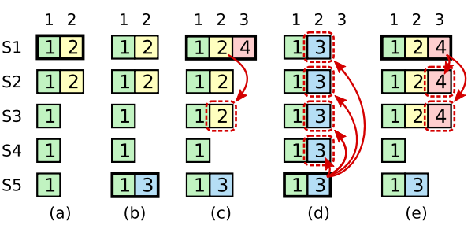

### 3.4 快照

快照中包含状态机的状态，还有少量元数据：快照替换日志中最后一个条目的索引和任期，

论文中描述了两种快照算法。

1. 每个节点独立进行快照，leader偶尔需要给落后或者新服务器的follower发送快照（在heartbeat中进行）
2. 只有leader会创建快照，然后发送给每个follower，然而这有两个缺点，浪费带宽和实现复杂。（lab要求这种实现）

**问题5：何时快照**

- 上层应用发送快照数据给Raft实例。
- 领导者发送快照RPC请求（直接发送快照数据）给追随者。

**注意当有日志未提交或者要求的快照点已快照则raft会拒绝快照。**Leader在广播过程中如果有follower的快照落后则更新其快照。

**问题6：如果Leader的上层应用刚要求Leader做快照，然后发生网络分区，leader被分在了节点少的区会发生什么（也即Leader做快照需要达成共识吗）**

节点少的这个区也只是会做快照，这一块的数据并没有出错，在网络分区恢复后他的快照和日志会被新leader覆盖。

## 4. raft的集群成员变更

### 4.1 集群成员变更的问题

　　集群在扩缩容或者机器节点发生故障的时候，我们需要对集群的成员进行变更。以下图为例，如果我们直接将集群的节点配置切换到新配置，由于无法将所有节点的配置同时切换到新配置，因此存在某一个时刻，server 1和server 2可以形成老配置的多数派（因为以server1和2的认知，他们仍然认为集群中只有三个结点），server 3、server 4和server 5可以形成新配置的多数派，这样在同一个任期term内就可以选举出两个leader，使得集群产生脑裂。

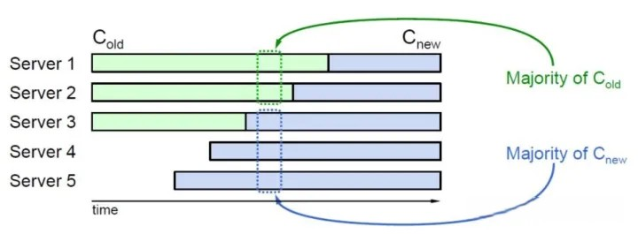

　　那么如何解决这种成员变更的问题呢？有两种方式：1. 联合共识。2. 单成员变更。

### 4.2 联合共识-解决集群成员变更问题

此方法允许一次性向集群中插入多个节点而不会出现脑裂等 问题，并且整个集群在配置转换的过程中依然能够接收用户请求，从而实现配置切换对集群调用方无感知。

如下图所示的联合共识中，集群分为三个阶段。

1. 集群还在采用Cold配置，此时Cold配置中的多数派达成一致就可以做出决议。

2. **向集群写入一个Cold,new的配置后，集群进入联合共识状态，此时需要Cold配置中的多数派与Cnew配置中的多数派同时达成一致才可以做出决议。**

3. 向集群写入一个Cnew的配置，集群进入最终状态，此时Cnew配置中的多数派达成一致就可以做出决议。

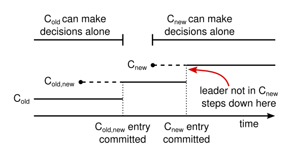

**问题8：为什么这样可行？**

假设我们产生了2，3分区，分别是（1，2），（3，4，5），Cold_old中1是leader

* 如果此时领导者 1 还没有复制任何一条 Cold_new，那么领导者 1 不会应用 Cold_new，(1，2) 分区依然是旧配置，1是领导者；而 (3，4，5) 分区由于 3 会接收心跳超时而发起选举，但是它不会感知到 4，5 的存在，无法获取到大多数节点的投票。因此两个分区只会有一个领导者，符合预期。
* 如果领导者复制了 Cold_new 之后发生了网络分区。如果 Cold_new 没有被大多数节点确认，那么领导者 1 无法应用 Cold_new，(1，2) 依然处于旧配置状态，对外提供服务，此时 (3，4，5) 分区无论谁发起领导者选举，都无法获取到大多数选票(旧配置状态的 3)或者被联合共识 (新配置状态的 4)。
* 如果在 Cnew 阶段产生了分区，由于 raft 算法具有持久性，已经提交的 Cold_new 会永久生效，此时 (A,B) 分区无法获取大多数选票，不会选出新领导者，也就不可能发生脑裂，符合预期。

### 4.3 单成员变更-解决集群成员变更问题

单成员变更的意思就是集群每次只变更一个节点。如下图所示，在单成员变更的方式中，变更前后的两个多数派一定存在交集，也就是变更过程中不可能产生两个leader，因此采用单成员变更的方式，集群不需要引入联合共识的过渡状态。**单节点变更的方式在集群配置变更的过程中是不能对外提供工作的。**

单节点变更的具体流程是：

* 节点 D 向领导者申请加入集群；
* 领导者 A 向新节点 D 同步数据；
* 领导者 A 将新配置 [A、B、C、D] 作为一个日志项，复制到配置中的所有节点，然后应用新的配置项（这里需要注意的是，每个节点接收到新的配置项肯定是有时差的）；
* 如果新的日志项应用成功（被大多数节点复制成功），那么新节点添加成功。

接下来考虑单成员变更是否会发生脑裂：

* 网络分区成 (1，2) 和 (3，4) 两部分，如果节点 1，2此时维护的还是旧的配置，那么 1 依旧是领导者，节点 3 因为分区开始发起领导者选举，此时如果 C 维护的是旧的配置 (1，2，3)，那么此时它不会得到节点 D 的投票，无法成为领导者；节点 3 如果维护的是新的配置，那么分区中节点个数不超过一半，它依然不会变成领导者，符合预期。当分区消失之后，节点 D 由于发现自己还没有完成入集群操作，从而会继续向领导者发起“进入集群申请”，领导者便会继续走一遍上述流程。
* 如果节点1，2此时维护的是新配置，那么 (1，2) 分区由于无法获取到大多数选票而无法选出领导者，(3，4) 分区同情况 1，这样的话两个集群都不会成功选举出新的领导者。此时便可能需要人工进行介入，但是集群中依然不会存在两个领导者。
* 1，2，3在同一个分区，剩余的一个节点4在另外一个分区，此时只有包含三节点的分区能选举出领导者，正常处理请求，符合预期。当分区消失了之后，节点 4会正常接收自己缺失的日日志项，从而更新自己维护的配置信息（在这里我们可用发现，节点4虽然已经在集群中，但是在它自己看来，自己确是被孤立的节点）。同样的当分区消失之后，节点 D 会再次申请“进群”。

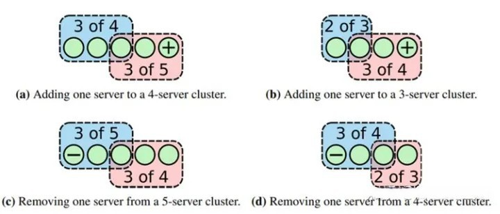

**为什么这样可行？**

这里，

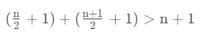

即对于 raft 集群来说，旧配置的大多数与新配置的大多数之和一定大于新配置的节点个数。由于 raft 算法的领导者选举需要获得超过大多数选票，而当我们只新增一个节点的时候，旧配置的大多数和新配置的大多数不可能同时存在（否则必定有至少一个节点同时属于两个分区，这显然是不可能存在的），因此两个分区只有一个分区可能选举出领导者。

注意，0如果raft要应对集群成员变更，则快照中要包含日志中截至最后包含索引的最新配置。

## 5. 性能

## 6. 遇到的问题

1. 之前的代码只是简单的在倒计时结束后发生选举，导致**超时之后，程序执行至rf.lock() ，而此时，节点正在处理 RequestVote RPC，因此 rf.lock() 被阻塞；当节点将选票投给了另一个 Candidate 节点，退出 RPC handler，然后 alerter 协程成功抢占到了锁——悲剧发生了。刚刚投出选票的节点，立马发起了新一轮的选举。**

2. 安装快照的时候应该抛弃之前的日志，但是我之前只是简单的截取切片。**在截取 slice 时，实际上没有创建新的数组，只是改变了引用的范围。但比较坑的是，即使此后仅会使用某个范围内的元素，整个数组也不会被 gc 回收，而是一直保留，最后造成 oom。**

# Lab3: Fault-tolerant Key/Value Service（基于raft层实现容错的键值服务）

## Lab3A

**该部分对应于论文中的section7-8**,下面是总体交互图。

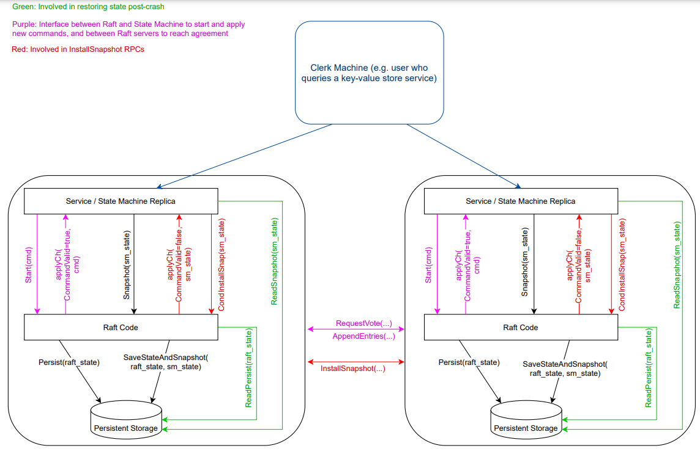

在这里，Raft 层的各种 fault 我们在 lab2 中已经妥善处理了，因此我们主要需要关注的是 Server 层的 fault。

**Server层的fault包括Client和Server之间的RPC丢失、Server直接挂掉（lab3B中的snapshot解决）**

而Client和Server之间RPC丢失最严重的问题是，Client 发送的请求 Server 成功接收，Server 也将请求中的 command 成功在 Raft 层达成共识并应用至状态机，然而在回复 Client 时出现了问题，RPC 回复丢失。这样就有可能**导致一次请求多次重复提交的情况**。

出现这种情况的根本原因是，**Raft 层允许同样的 command commit 多次** (Raft 层并不知道这是不是相同的 command，只要有 command 来，就尝试共识)，但实际上，同样的 command 只能 apply 一次。这就要求客户端为每个命令分配唯一的序列号，为检测重复请求，可在每次请求中加入唯一 id，并随请求自增，再重试时使用同一 id，Server 只需 **对每个 Client 记录最大的请求 id** ，即可排除过期或重复请求。（在应用到状态机前做请求去重）

**这里我最开始的想法是Leader的Server层在接收到重复的客户端请求时就查重，那么bug来了，假设现在Leader的完成共识，但是给客户端的回复丢失了，这个时候Leader崩溃或者网络分区丢失了Leader身份，那么其他节点当选时，那么他接收到重复的记录时无法判断。所以，正确方法应该是Leader即使收到了重复的请求也需要达成共识，然后每个节点会自行判断请求是否重复。**

**问题1：客户端如何实现数据读写？**

一开始，Client 并不知道 Leader Server 是哪台 Server。Client 可向随机一台 Server 发送 RPC 请求（Server需要达成共识）。假如请求的 Server 不是当前的 Leader Server，或者由于网络中断、Server Crash 等原因，无法与 Server 取得联系，则无限地尝试更换 Server 重新发送请求，直到请求成功被处理。**这里有一个小优化，在得知 Leader Server 后，Client 可以保存 Leader 的 id，避免下次发起请求时又需要随机地选择一台 Server 多次尝试。**

如果 Raft 层长时间无法完成共识 (由于网络分区等原因)，不要让 Server 一直阻塞。及时向 Client 返回 Timeout 错误，使其重新选择另一台 Server 重试。

**问题2：为什么Get需要达成共识？**

如果在Get时仅仅是从Leader中读数据，当出现网络分区时，Leader被划分在少数区，他仍然认为自己是Leader，但其数据并不是最新的，所以我们需要让Get达成共识。

**问题3：为什么客户端的id是随机初始化而不是顺序递增的？**

为什么区分不同的客户端，由于客户端之间是无法意识到对方的存在的，所以需要随机初始化。

**问题4：如果有多个 Client 并行地向 Server 发起请求时，就显然不能保证从 applyCh 传回的数据恰好是此前提交的 command 了**

我们需要在 Server 中对特定的 command 进行等待。raft log 中的 index 区分不同的command。Server 需要维护一张 Map，Key 为 index，Value 为 Server 等待此 index 对应 command 的 channel。

## Lab3b: snapshot

前面的工作做好后，加上一个 Snapshot 其实比较简单，在 notifier 中根据 `RaftStateSize()` 和 `MaxStateSize` 的大小关系判断一下是否需要进行一次 Snapshot，并且增加一个分支将 Raft 层传递的 Snapshot 应用至状态机就可以了。

需要注意的是，Snapshot 不仅需要保存 kv database 的信息，还需要保存 maxSeq。因为改变了状态机的状态，就需要状态机相关的 maxSeq 信息来拦截重复请求。在应用 Snapshot 时，状态机状态发生改变，所以也需要将 maxSeq 与 Leader 的 maxSeq 进行同步。

## 遇到的问题

1. 客户端向Leader请求某个操作，Leader需要达成共识，所以Leader的Raft层完成操作后需要向Server层回复是否成功，Server层再向客户端回复，而follower节点时不需要的。而bug来了，**某个节点从follower转为leader时还存在已提交到日志但是没有应用的log，这些日志在应用时按照我之前的代码会向Server回复，这里是利用通道操作所以会造成阻塞。**所以这里需要在代码中做个条件判断，当应用的日志任期和当前Leader任期相等的时候才会向Server转发操作成功的

# Lab4: Sharded Key/Value Service（实现分区的容错数据库）

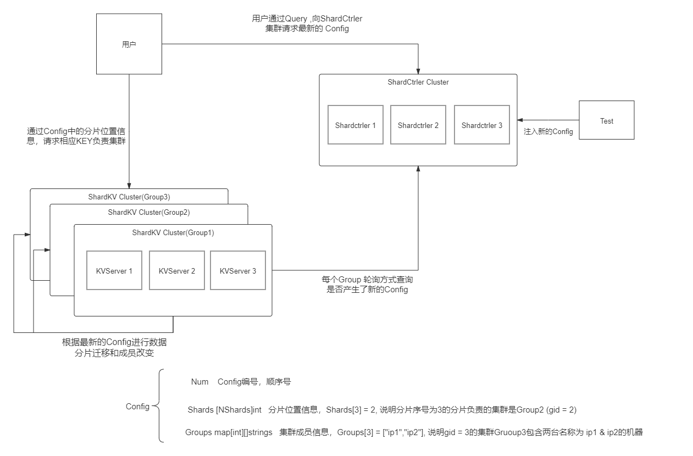

* 在这个实验中，我们要创建一个 “分布式的，拥有分片功能的，能够加入退出成员的，能够根据配置同步迁移数据的，Key-Value数据库服务”。
* 在Lab4A中，我们需要构造 ShardCtrler , 运行时，多个ShardCtrler Servers 组成一个Raft管理的集群，这个集群共同维护了一个切片 []Config。一个Config即代表测试者对整个服务集群的一次“最新配置指令”。Config的具体理解见图中。同时，通过shardctrler/client 提供了一个可以Query这个集群Config信息的接口，因此，用户以及后续的ShardKVCluster都可以通过这个接口来获取集群最新的Config信息。
* Lab4B则要求我们实现 分片的KeyValue服务。系统规定分片数量为NShards = 10.我们将要构建多个ShardKV Cluster(也就是一个用gid来区别的Group)， 每个Group 负责几个分片（至少一个）。
* 每个Group负责的分片会根据Config信息的不同而变化。因此，在有新的Config之后，这些Group需要根据他在彼此间进行互相迁移。迁移过程中相应分片无法对外提供服务。
* 而客户端根据hash函数得到要操作的 KEY 属于的 Shard， 在去查询Config信息，又能得到这个Shard属于哪个Group在负责。然后去相应的Group Raft Leader处请求操作数据即可。

## 几个整体性的问题

* 一个比较重要的是，Lab4，sepecailly B Test, 将会十分消耗CPU资源，而且Go -race模式下Goroutine是有一个8128的限制，因此，我们要尽量减少程序中的RPC通信量，不进行不必要的，冗余的通信。这一点最重要的就是许多事，例如SendDataToOtherGroup，尽量通过Leader去单独做，成功后再把结果同步给大家的方式来实现。

* 整个实验实际上就是Lab3的一个扩展版本。操作由GET,PUT,APPEND,扩展出了JOIN, LEAVE, MOVE, 还有后面你自己定义的Command类型。这些Command的共同处理流程就是：
  * 全员监听，但只在Leader处能够被触发。触发方式可能是收到Client请求，或者由本地过程中的其他函数调用触发。
  * Leader检测触发条件和执行条件，如果满足，将Op交由Raft同步，根据情况可以设置WaitChan等待同步结果。
  * Raft Apply Command , Every Server in Group 都能收到，每个Server单独根据Command进行【Duplicate Detection】 ->【ExeCommandWithArgs】-> 【SnapShotRaftStateIfNeed】->【SendMessageToWaitChanIfNeed】
  * Leader收到自身RaftCommandApplier向WaitChan发送的执行结果信息，返回给客户端或者进行重试处理。

* 后续所需要的无论是NewConfig的拉取，还是数据迁移，本质上都是这样的过程。只不过Lab3给你定义了2个，Lab4让你自己设计两个而已。

* **整个服务的总系统吞吐量（每单位时间的输入和获取）与组数成比例增加。**

## Lab4A (ShardCtrler)

* 这里要我们实现集群的”配置管理服务“的部分。首先我们先理解几个操作的含义：
  * Join : 新加入的Group信息。
  * Leave : 哪些Group要离开。
  * Move : 将Shard分配给GID的Group,无论它原来在哪。
  * Query : 查询最新的Config信息。

* 其实，这里就能看出来，它非常像我们实现过的Lab3. Join, Leave, Move其实就是PutAppend, Query就是Get. 因此，我们只需要在Lab3的代码逻辑上修改就可以了。主要修改的就是：
  * 替换几大操作。
  * 在Join, Leave之后，需要根据分片分布情况进行负载均衡（reBalance).其实就是让每个集群负责的分片数量大致相同，并且进行尽量少的数据迁移。
  * 一些细节。
  * 不需要实现snapshot。

## Lab4B (ShardKV)

额外的challenge：challenge1 要求及时清理不再属于本组的数据，challenge2 不仅要求分片迁移时不影响未迁移分片的读写服务，还要求不同地分片数据能够独立迁移。

**为什么需要challenge2？**

Lab 4 中要求我们实现一个*分片*的分布式键值数据库，其核心是当配置变更（也就是从切片（shard）到组（replica group）的映射关系发生变化）时集群要同步反映这些变更：原先负责这个切片的组应不再负责这个切片，而新被分配这个切片的组应开始服务，并且要在和原组相同的数据上继续。在切片移交（handoff）的过程中不能接受客户端请求。

一个非常显然的实现就是**同步**的实现：我们编写一个新的常驻 goroutine，这个协程定期更新配置并计算变更（diff），如果发现变更，停止**所有的**客户端请求和**整个** applier，移交切片并更新配置，待所有切片都就绪后才恢复客户端请求和 applier 循环。

**这种简单的做法无疑效率低下。所以，要完成 challenge 2，我们需要将配置更新、分片移交和分片恢复服务三个阶段完全异步化。**当检测到配置更新时，仅仅停止需要同步的切片，不能阻塞客户端请求和 applier 循环；此后移交切片，并且在收到对应切片时立即恢复对该切片的服务。

### 客户端

所以客户端需要满足：

- 缓存每个分片的 leader。
- rpc 请求成功且服务端返回 OK 或 ErrNoKey，则可直接返回。
- rpc 请求成功且服务端返回 ErrWrongGroup，则需要重新获取最新 config 并再次发送请求。
- rpc 请求失败一次，需要继续遍历该 raft 组的其他节点。
- rpc 请求失败副本数次，此时需要重新获取最新 config 并再次发送请求。

### 服务器

* Server的工作是Lab3Server工作的一个超集，他需要额外做两件事：
  * 定时Query Shardctrler 的new Config,如果Num 大于自身现有的Config, 就Apply New Config, 不过也是要先通过Raft同步给集群。
  * 如果New Config Shards[]相对于以前有变化，则可能会有关于自身的数据迁移需求。即Last.Config.Shards[x] == kv.me & New.Config.Shards[x] != kv.me ，即数据迁出，或者相反的数据迁入。在独立线程中执行这个迁移任务，迁移后需要经过Raft同步完成迁移。
* 然后在接受Client请求时加几个判定条件，如果Shard 不归我，ErrWrongGroup, 如果不可用(正在迁移)，ErrWrongLeader。

### 日志

这里所有涉及修改集群分片状态的操作都应该通过 raft 日志的方式去提交，这样才可以保证同一 raft 组内的所有分片数据和状态一致。且应该将不同 raft 组所属的分片数据独立起来，分别提交多条 raft 日志来维护状态。

这里定义了五种日志：

- Operation：客户端传来的读写操作日志，有 Put，Get，Append 等请求。
- Configuration：配置更新日志，包含一个配置。
- InsertShards：分片更新日志，包含至少一个分片的数据和配置版本。
- DeleteShards：分片删除日志，包含至少一个分片的 id 和配置版本。
- EmptyEntry：空日志，`Data` 为空，使得状态机达到最新。

~~~go
type Command struct {
	Op   CommandType
	Data interface{}
}

func (command Command) String() string {
	return fmt.Sprintf("{Type:%v,Data:%v}", command.Op, command.Data)
}

func NewOperationCommand(request *CommandRequest) Command {
	return Command{Operation, *request}
}

func NewConfigurationCommand(config *shardctrler.Config) Command {
	return Command{Configuration, *config}
}

func NewInsertShardsCommand(response *ShardOperationResponse) Command {
	return Command{InsertShards, *response}
}

func NewDeleteShardsCommand(request *ShardOperationRequest) Command {
	return Command{DeleteShards, *request}
}

func NewEmptyEntryCommand() Command {
	return Command{EmptyEntry, nil}
}

type CommandType uint8

const (
	Operation CommandType = iota
	Configuration
	InsertShards
	DeleteShards
	EmptyEntry
)
~~~

### 分片

- Serving：分片的默认状态，如果当前 raft 组在当前 config 下负责管理此分片，则该分片可以提供读写服务，否则该分片暂不可以提供读写服务，但不会阻塞配置更新协程拉取新配置。
- Pulling：表示当前 raft 组在当前 config 下负责管理此分片，暂不可以提供读写服务，需要当前 raft 组从上一个配置该分片所属 raft 组拉数据过来之后才可以提供读写服务，系统会有一个分片迁移协程检测所有分片的 Pulling 状态，接着以 raft 组为单位去对应 raft 组拉取数据，接着尝试重放该分片的所有数据到本地并将分片状态置为 Serving，以继续提供服务。之后的分片迁移部分会介绍得更为详细。
- BePulling：表示当前 raft 组在当前 config 下不负责管理此分片，不可以提供读写服务，但当前 raft 组在上一个 config 时复制管理此分片，因此当前 config 下负责管理此分片的 raft 组拉取完数据后会向本 raft 组发送分片清理的 rpc，接着本 raft 组将数据清空并重置为 serving 状态即可。

### 拉取新配置

1. 首先 Leader 会定期拉取配置。当发现配置的 `Num` 比本地配置更大**且所有分片的状态都是正常状态时**，调用 Raft 层 `Start`。
2. 接下来由包括 Leader 在内的每个节点的 applier 循环接收自 Raft 层推送的最新配置，由这个最新配置*更新当前配置*、*计算 diff* 并据此*更新每个分片的状态*，同时*开始分片移交（handoff）*。

### 分片迁移

设计数据迁移主要考虑以下几个问题。

**数据Shard的存储方式**

以前我们存储数据使用一个kv.DB = map[Key]Value, 并需要一个map[ClientId]LastRequestId来帮助记录每个客户端的访问情况以便去重。分片的存储也是一样的，不过由我们要存储多个分片，我们需要一个数组来存储每个分片单独的DB和ClientSeq。定义一个数据结构，类似如下来表示分片数据。不同时间，Server管理的Shard数量是变化的，但由于总数固定，我们不申请变长数组，而申请固定的[10],用数组下标来表示ShardIndex亦可。

~~~go
type ShardComponent struct {
	ShardIndex int
	KVDBOfShard map[string]string
	ClientRequestId map[int64]int
}

// Server memeber
keyValueDB [NShards]ShardComponet
~~~

**如何监听并触发分片迁移？**

当所有分片处于默认状态才会通过轮询获取最新配置。

分片迁移一定会发生在将OldConfig --> NewConfig的过程，我们监听状态为：
是否有数据需要被迁移：ifShardXNeedMigrate = NewConfig.Shards[X] != OldConfig.Shards[X]
if NewConfig.Shards[X] == kv.me 说明X是我新负责的，应该接受；if OldConfig.Shards[X] == kv.me 说明X是我应该发送给别人的；否则与我无关
需要有发送的数据就触发数据迁移

**如何和Group Follower同步迁移结果？**

数据迁移无非就是Leader做两件事： ”发送不再属于我的数组到它的新家，然后我自身删除这个数据，并把删除数据这个状态同步给大家“（push） & ”接受别人给我发的数据，并把它同步给大家“（pull）。 发送和接受分片数据需要我们设计一个MigrateShards RPC，而同步数据则需要我们能通过Raft进行。（我用的是pull，因为考虑到push在很多场景下会出现问题。）**被拉取集群的cfgNum只要比主动拉取集群的cfgNum大即可返回数据。**

**如何保证迁移中拒绝服务，避免脏读和旧数据？**

我们设计一个

~~~go
//Server member
isShardMigrateing [NShards]bool
~~~

它表明ShardX是否在迁移中，前一种就会拒绝服务请求，迁移完成后，该会False即可。相当于一个细粒度的锁。Loop监听这个数组，如果有数据被锁住，就进行数据迁移。

**pullShard情况下，删除不属于本集群分片内容的架构设计方案：**

* 当服务端通过pull更新完数据后，发送一个更新完毕的请求通知相应集群："我已经更新完毕啦，你可以删除了"。当集群删除完毕后，返回删除成功的通知，让该服务端不再重试更新完毕的请求。
* 服务端不会去通知其他集群哪些shard已经更新完毕，而是找到不属于本集群的分片，发送Query请求询问对方是否已经获取到该分片内容，若对方回复已拥有该分片内容，则服务端可直接删除该分片。

使用Query的好处是新增分片的内容，发送pull请求的一方具有主动权，即本集群pull到数据了本集群就能直接更新；删除分片的内容，发送Query请求的一方具有主动权，本集群Query到回复了本集群就能直接删除分片，这样的设计可以把新增分片和删除分片两部分解耦开，方便理解和维护。

## 遇到的问题

1. 考虑这样一个场景，若某台机器重启后成为了主节点，虽然raft日志最新，但是还没有应用到上层。此时别的集群访问这台机器拉取分片数据，会一直得不到数据，造成活锁。所以我们需要有一个goroutine专门用于检查本集群是否已应用了最新的raft日志，我们可以定期（不能tai'duan）利用raft同步一条空日志，促使raft上报日志给上层应用。
2. 我们是否可以在 apply 协程更新配置的时候由 leader 异步启动对应的协程，让其独立的根据 raft 组为粒度拉取数据呢？答案是不可以的，设想这样一个场景：**leader apply 了新配置后便挂了，然后此时 follower 也 apply 了该配置但并不会启动该任务，在该 raft 组的新 leader 选出来后，该任务已经无法被执行了**。因此，我们不能在 apply 配置的时候启动异步任务，而是应该只更新 shard 的状态，由单独的协程去异步的执行分片迁移，分片清理等任务。当然，为了让单独的协程能够得知找谁去要数据或让谁去删数据，ShardKV 不仅需要维护 currentConfig，还要保留 lastConfig，这样其他协程便能够通过 lastConfig，currentConfig 和所有分片的状态来不遗漏的执行任务。
3. 我们还需要保证集群状态操作的幂等性。举个例子，**由于分片迁移协程和 apply 协程是并行的，当 raft 组集体被 kill 并重启时，raft 组首先需要重放所有日志，在重放的过程中，迁移协程可能检测到某个中间状态从而发起数据的迁移，这时如果对数据进行覆盖就会破坏正确性**。基于此，在重启时我们可以让每个分片迁移和清理请求都携带一个配置版本，保证只有版本相等时才可以覆盖，这样即使重启时迁移协程检测到了中间状态做了重复操作，也不会导致分片状态发生改变，从而保证了幂等性。

# 其他

## etcd

### etcd的架构

etcd的架构如下图所示。api接口支持http协议和grpc协议，node主要负责raft算法的实现，storage主要负责raft日志以及snap快照文件的存储，transport主要负责集群节点间的通信。kvstore分为v2和v3两个版本数据库，主要负责业务数据的存储，其中v3版本数据库的实现采用lboltdb和keyIndex，支持mvcc机制。

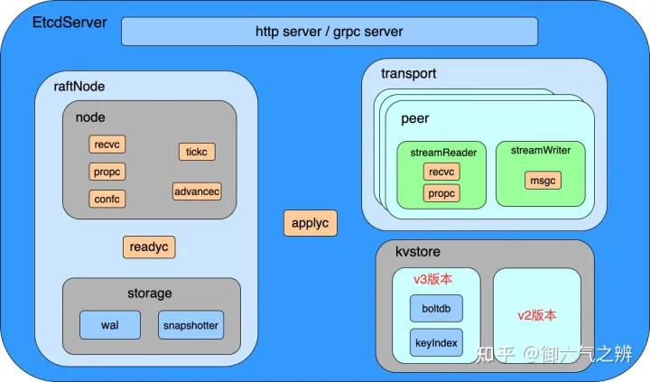

### etcd的raft日志模块

#### etcd的raft日志存储

raft算法中，有两类数据需要刷盘：

1. raft日志：协议交互流程中的一种承诺，一个节点一旦告诉其他节点自己已接收某条日志，则这条日志就不能丢失。

2. 节点的状态：包括当前的任期term、当前的投票目标vote、可提交的最大日志索引commit三个字段。前两个字段是leader选举流程中的承诺，第三个字段是节点在重启恢复时用来控制日志回放到哪一条日志。

**etcd采用wal文件来保存上面两种数据的**，保存的格式如下图所示。第一个wal文件在文件开头首先写入0值的crc32记录，之后每一个raft日志或者节点状态的记录，其crc32值 = calc(pre_crc32， 本记录的二进制值)。而对于第二个及之后的wal文件，文件开头的初始crc32值 = 上一个wal文件最后一条记录的crc32值。可以看到：所有wal文件，其所有记录的crc32值可以形成一个可进行强校验的链表。这样在重启恢复的时候，**etcd就可以对wal文件的内容进行精细化的校验。**

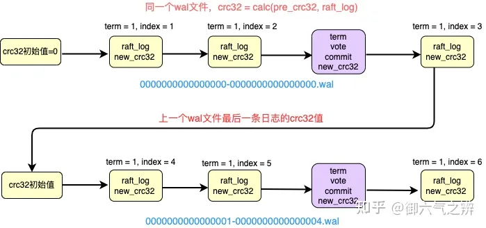

#### etcd的raft日志压缩

如果不对raft日志进行压缩的，那wal文件占用的磁盘空间就会越来越大，所以需要一个日志压缩机制，接下来通过下面这个图来讲述日志压缩机制。在raft日志中，首先定义几个概念：

1. log_index：最新的日志位置索引。

2. commit_index：已达成多数派一致，可提交的最大日志位置索引。

3. apply_index：已应用到业务状态机的最大日志位置索引。

4. compact_index：raft日志清理的临界位置索引，在该索引之前的所有raft日志，都可以清掉。

5. last_snap_index：上一个snap快照文件的日志索引，代表snap快照文件生成时刻的apply_index。

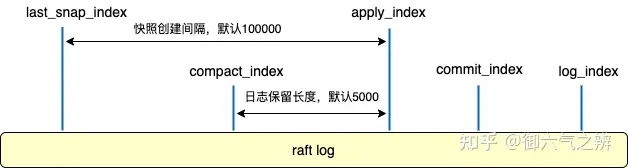

当apply_index - last_snap_index > Cfg.SnapshotCount（默认值为10w）时，会触发snap快照文件的生成，etcd将数据库当前的快照数据写入snap文件的同时，也会在wal文件中追加一个snapshotType的记录（该记录包含此时的任期term和apply_index）。理论上讲此时apply_index之前的所有raft日志都可以清掉了，但是在生产环境中其他follower节点的日志复制进度可能比较落后，还在学习apply_index之前的日志，如果此时apply_index之前的日志都被清掉了，那么leader节点必须发送snap文件 + apply_index之后的raft日志，**而发送snap文件是一个非常耗性能的操作，因此为了避免频繁发生这种snap文件的发送操作，在清理raft日志的时候，一般在apply_index前面保留Cfg.SnapshotCatchUpEntries（默认值为5000）个raft日志。**

#### etcd重启时如何根据raft日志恢复数据

wal文件的命名包含一个递增的seq、本wal文件中的起始日志索引log_index。snap文件的命名包含生成快照时刻的任期term、应用到状态机的apply_index。

恢复流程的具体步骤为：

1. 读取所有wal文件，从wal文件中拿到所有的snap文件名，前面讲过每次日志压缩生成snap文件时都会往wal文件中写一条snapshotType记录（根据该记录可以拿到snap文件名）。

2. **从所有snap文件中选择一个最新且未被损坏的snap文件来恢复存储数据**，在该例子中则会选中0000000000000001-0000000000024000.snap文件。

3. 根据0000000000000001-0000000000024000.snap文件筛选出所需要的wal文件列表，此时只需要读取24000之后的raft日志，所以只需要筛选出0000000000000002-0000000000020000.wal和0000000000000003-0000000000030000.wal两个文件，然后读取这两个wal文件恢复HardState状态，并且在snap文件的基础上做日志回放。

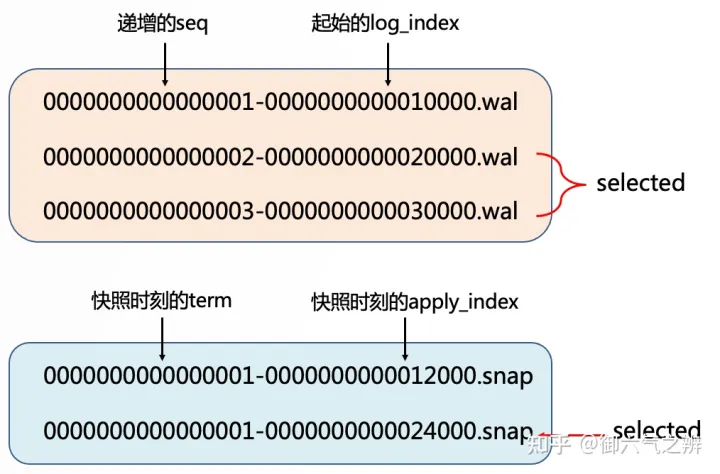

#### etcd如何优化raft日志的读写

外部的每一个写请求都会生成一条raft日志，而raft日志是需要刷盘的。如果每生成一条raft日志就刷盘一次，那etcd的写入性能必然很低，因此etcd采用**异步批量刷盘的方式来优化写入性能**，如下图所示。

1. 外部的写入请求先由goroutine 1写入到propc通道。

2. goroutine 2消费propc通道中的请求，将其转化为unstable_log（保存在内存中，表示尚未达成多数派一致的raft日志），也会在待发送消息的缓冲区中生成日志复制请求。

3. go routine 3会将unstable_log、待发送的日志复制请求打包成一个ready结构，写入道readyc通道。

4. go routine 4消费readyc中的数据，将raft日志刷盘到wal文件以及追加到stable_log（保存在内存中，可理解为wal文件中的raft日志在内存中的副本），同时将日志复制请求发送给follower节点。

5. 对于已达成多数派一致的那些日志，unstable_log缓冲区就可以清理掉了。

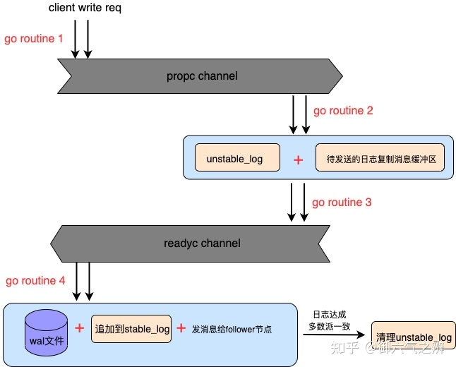

etcd通过这种日志处理方式，不仅将多次写请求合并为一次刷盘优化了写入性能，而且通过在stable_log内存缓冲区中额外维护一份wal文件中raft日志的副本，从而优化了raft日志的读取性能。

### etcd的mvcc机制

#### etcd为什么要引入mvcc

etcd之前的v2版本数据库是一个树型的内存数据库，整个数据库拥有一个大的RWLock，写锁和读锁相互阻塞，影响读写性能。另外，etcd v2数据库不会保存历史版本数据，在v2版本的watch机制中，v2版本基于滑动窗口最多保留最近的 1000 条历史事件，当 etcd server 遇到写请求较多、网络波动等场景时，很容易出现事件丢失问题，进而触发 client 全量拉取数据，产生大量 expensive request，甚至导致 etcd 雪崩。因此etcd 并发性能问题导致 Kubernetes 集群规模受限，而watch 机制可靠性问题又直接影响到 Kubernetes controller 的正常运行。解决并发问题的方法有很多，而mvcc在解决并发问题的同时，还能通过存储多版本数据来解决watch 机制可靠性问题。所以，etcd v3 版本果断选择了基于mvcc来实现多版本并发控制。mvcc能最大化地实现高效地读写并发，尤其是高效地读，非常适合读多写少的场景。

#### etcd如何存储数据以支持mvcc机制

如下图所示，etcd采用B树存储key的历史版本号数据，并且通过keyIndex结构来构建整个B树，这个keyIndex存储了某一个key的历史版本号数据。

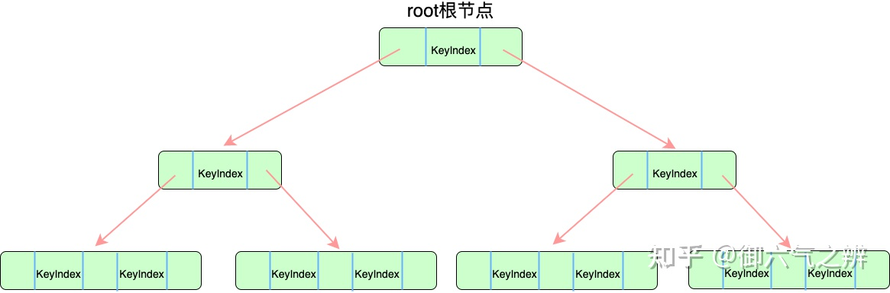

　　keyIndex的结构如下所示，其中的每个generation代表key的一次创建到删除的版本号变更流水。

```go
// generation contains multiple revisions of a key.
type generation struct {
    ver     int64 // 修改次数
    created revision // when the generation is created (put in first revision).
    revs    []revision  // 修改版本号列表
}

type keyIndex struct {
    key         []byte  // key的值
    modified    revision // the main rev of the last modification
    generations []generation  // 生命周期数组，每个generation代表key的一次创建到删除的版本号变更流水
}
```

#### etcd如何维护key的版本号数据

接下来以下图为例讲解keyIndex的变更过程，进而说明etcd是如何维护版本号数据的。版本号由main version和sub version构成，每开启一个写事务则main version加1，而在同一个写事务中，每进行一次写操作则sub version加1。在该例子中，key为12345，第一次写入该key时，版本号为101:0，此时会创建第0代generation。第二次写入时，keyIndex的修改版本号变成102:0，并且会往第0代generation中append一个102:0的版本号。之后删除该key，会往第0代generation中append一个103:0的版本号，并且新创建一个空的第1代generation。最后在main version为106时再次写入该key，则会往第1代generation中append一个106:0的版本号。

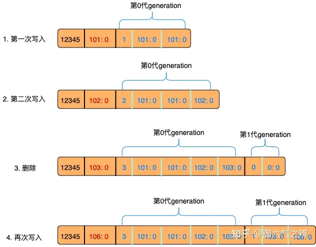

这种keyIndex结构设计的优点是：

1. 通过引入generation结构，存储的时候不用区分修改版本号与删除版本号，这两类版本号在数据结构上是同构的。在判断key是否存在时，我们只需要判断keyIndex是否存在或者其最后一代generation是否为空。

2. 在查找key的指定版本号数据时，可以先查找generation，然后再在generation中查找具体的version，相当于将一个大数组的查找划分为两个小数组的查找，加快了查找速度。

#### etcd如何存储每个版本号的数据

　　etcd底层默认采用boltdb来存储每个版本号对应的value，boltdb是采用B+树来存储数据的，如下图所示。boltdb实现的几个关键点有：

1. 元信息页metaPage中存储了整个db根节点的page_id。

2. 每个key-value键值对必须存储在bucket桶中，每一个bucket桶的数据都由一个独立的B+树来维护。bucket桶类似于命名空间的概念。

3. boltdb支持创建多个bucket桶，并且bucket桶支持嵌套创建子bucket桶。

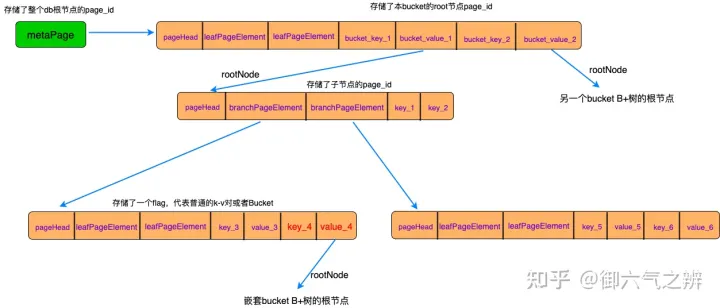

　　boltdb支持多bucket桶的设计，使业务数据可以按功能分类，不同类别的数据互不影响，占较小存储空间的bucket数据，其读写性能不会因为db存在占较大存储空间的bucket而降低。

#### etcd的历史版本号数据压缩清理

　　由于etcd v3版本数据库会保存key的所有版本号数据，如果不进行定期压缩清理的话，那数据库占用的空间将越来越大，因此etcd实现了两种数据压缩方式。

1. 第一种方式：保存过去一段时间内的版本号数据，如下图所示。etcd支持配置一个压缩周期，而采样周期 = 压缩周期 / 10，然后每个采样周期都获取下当前的db版本号，并将这个版本号push到一个队列中，当队列满时pop出一个version然后开启第一次压缩，压缩时该version之前的历史版本号数据就可以清理掉了。之后每间隔一个压缩周期，都执行一次压缩逻辑。

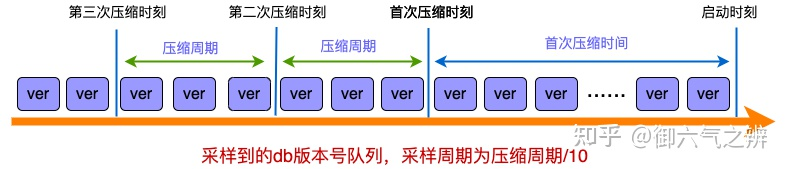

2. 第二种方式：保存指定数量的历史版本号数据，如下图所示。etcd每间隔一个压缩周期就执行一次压缩，压缩时的压缩version = 当前db的version - 配置文件指定的保留版本号数量。


### etcd的watch机制

etcd允许客户端监听某个key或者某段key范围区间的变化。如果监听范围内的某个key，其数据发生变化，则watch的客户端会立刻收到通知。

#### etcd的watch架构

　　etcd的watch架构如下图所示。watch客户端发出watch请求后，server端首先创建一个serverWatchStream，该serverWatchStream会创建一个recv loop协程和send loop协程。recv loop协程负责监听客户端对具体key的watch请求，一旦收到watch请求就创建一个watcher并存储在watchableStore的synced watchers中，如果客户端指定从过去的历史版本号开始监听变化，则watcher会被存储在unsynced watchers中（表示该watcher需要追赶监听进度）。synced watchers和unsynced watchers通过访问拥有mvcc机制的数据层将相关事件通过serverWatchStream的send loop协程发送给客户端。另外，synced watchers和unsynced watchers有两类数据结构存储watcher，map结构负责存储只watch一个key的watcher，interval tree负责存储watch一段key范围区间的watcher。

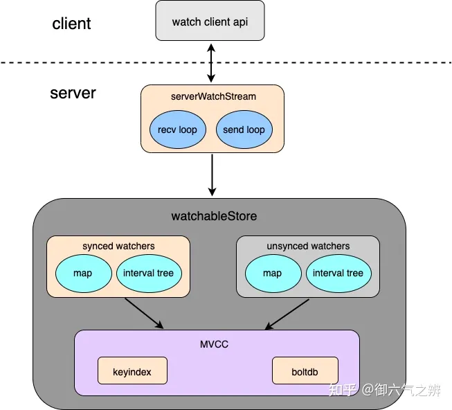

#### etcd中落后的watcher如何追赶进度

　　前面提到unsynced watchers中存储的watcher，其监听版本号是小于当前数据库版本号的，这些watcher需要一个机制去追赶数据库版本进度。etcd在watchableStore初始化的时候，会创建一个syncWatchersLoop协程，这个协程的工作逻辑如下图所示：它会获取unsynced watchers中的最小监听版本号，然后根据这个版本号获取相关的event事件并发送给客户端。如果发送成功且监听版本号已达到数据库当前版本号，则将这些watcher移动到synced watchers中；如果发送失败，则将这些event事件放入victims缓冲区，有一个syncVictimsLoop协程专门对victims中之前发送失败的event事件进行重试。

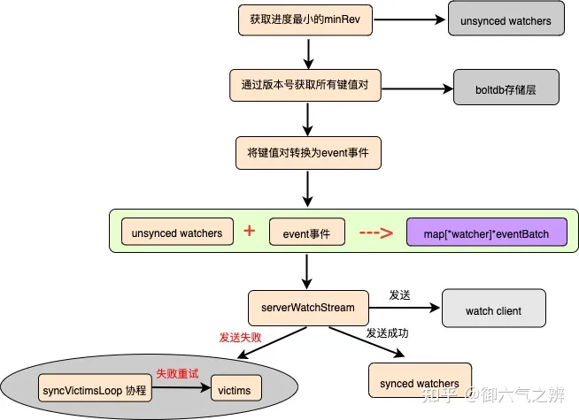

#### etcd中新的变更如何通知给watcher

　　synced watchers中存储的watcher，其监听版本号虽然没有落后于当前数据库版本号，但数据库的最新event事件依然需要通知给这些watcher，具体的工作逻辑如下图所示。其中部分逻辑与syncWatchersLoop协程的逻辑一致，这里不再详细讲解。

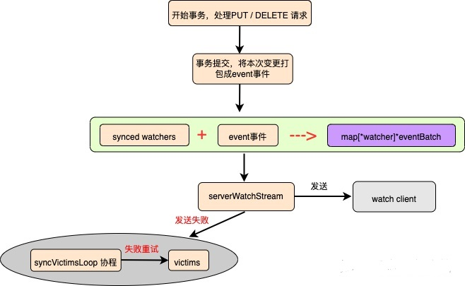

### etcd的租约机制

#### etcd租约的实现架构

　　etcd租约实现的架构如下图所示。lease api层提供租约接口，其中grant/revoke负责处理创建、销毁租约的请求，renew负责续期租约的请求，attatch/detach负责处理将key关联或者取消关联租约的请求。在lessor模块中：leaseExpiredNotifierHeap采用最小堆实现，用来检测租约是否过期，checkpointHeap采用最小堆实现，用来定时刷新每一个租约的剩余TTL，itemMap负责维护每一个key关联的租约信息，leaseMap负责维护每一个租约ID的具体信息。另外，这些涉及租约数据变化的api接口，都会走一轮raft算法，这样各个节点的租约数据才会一致。租约的续期和过期处理稍微特殊一点，这两类操作统一由leader节点触发。对于续期操作，续期成功后，follower节点上租约的剩余TTL依赖租约的checkpoint机制刷新；对于过期处理，leader节点判断租约过期后，会在raft算法层提议一个revoke撤销租约的请求。etcd v3 版本中，如果不同 key的TTL相同，则可以复用同一个租约ID，这样就显著减少了租约数量。最后，租约数据会持久化到boltdb。

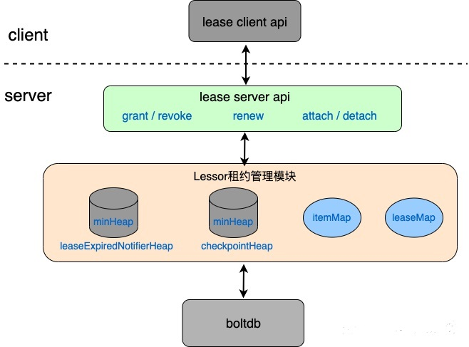

#### 如何理解租约的checkpoint机制

　　此checkpoint机制并不是生成租约数据的快照，而是leader节点为每个租约，每间隔cfg.CheckpointInterval（默认值为5min）时间就设置一个checkpoint时间点，然后leader节点每500ms为那些已到checkpoint时间点的所有租约生成一个pb.LeaseCheckpointRequest请求，该请求会通过raft算法提议，提议通过后在apply到状态机的时候刷新租约的剩余TTL。

　　这个checkpoint机制是为了解决一个问题：leader发生切换的时候，follower节点升为leader后会根据租约过期时间重建leaseExpiredNotifierHeap最小堆，如果follower节点之前一直不刷新剩余TTL的话，那重建的时候就会采用创建租约时的总TTL时间（相当于自动进行了一次续期）。如果 leader 频繁发生切换，切换时间小于租约的TTL，这就会导致租约永远无法删除，导致etcd大量key堆积从而引发db大小超过配额等异常。

#### etcd重启时的租约恢复

grant api接口创建租约的时候，会将租约数据（包括租约ID、租约的总TTL、租约的剩余TTL）持久化到boltdb的leaseBucket桶中，如下所示。

```go
leaseBucketName = []byte("lease")
func (l *Lease) persistTo(b backend.Backend, ci cindex.ConsistentIndexer) {
    key := int64ToBytes(int64(l.ID))
    lpb := leasepb.Lease{ID: int64(l.ID), TTL: l.ttl, RemainingTTL: l.remainingTTL}
    val, err := lpb.Marshal()

    b.BatchTx().Lock()
　　// 租约数据写入boltdb
    b.BatchTx().UnsafePut(leaseBucketName, key, val)
    b.BatchTx().Unlock()
}
```

另外，key-value键值对写入boltdb的keyBucket桶时，value存储的结构如下所示，包含了key关联的租约ID。

```go
keyBucketName  = []byte("key")
kv := mvccpb.KeyValue{
        Key:            key,
        Value:          value,
        CreateRevision: c,
        ModRevision:    rev,
        Version:        ver,
        Lease:          int64(leaseID),  // key关联的租约ID
    }
```

这样etcd重启的时候，通过遍历leaseBucket桶来恢复所有的租约数据，然后再遍历keyBucket桶来恢复数据key与租约ID的映射关系。

### etcd实现的一些关键总结 

1. 为什么 etcd v3版本的KeyIndex使用 B-tree 而不使用哈希表、平衡二叉树？

答：从功能特性上分析， 因 etcd 需要支持范围查询，因此保存索引的数据结构也必须支持范围查询才行。所以哈希表不适合，而 B-tree 支持范围查询。从性能上分析，平横二叉树每个节点只能容纳一个数据、导致树的高度较高，而 B-tree 每个节点可以容纳多个数据，树的高度更低，更扁平，涉及的查找次数更少，具有优越的增、删、改、查性能。

2. etcd v3版本数据是采用boltdb存储的，boltdb对于每一个写事务都会进行一次刷盘，那etcd为了优化写入性能，做了什么样的处理？

答：采用批量提交的，也就是用底层boltdb的单个写事务来处理上层业务api接口的多次写入请求。etcd批量提交的代码实现如下：

```go
// 写入key-value对的时候，并不会开启一个新的写事务，还是沿用之前的t.tx写入数据，然后将t.pending加1.
func (t *batchTx) unsafePut(bucketName []byte, key []byte, value []byte, seq bool) {
    bucket := t.tx.Bucket(bucketName)
　　// 省略若干代码
    bucket.Put(key, value)
    t.pending++
}

// 在业务释放batchTx的锁时，如果t.pending达到一定值时，提交事务
func (t *batchTx) Unlock() {
    if t.pending >= t.backend.batchLimit {
        t.commit(false)
    }
    t.Mutex.Unlock()
}

// 提交上一个boltdb事务，然后再开一个新事务供后续数据写入
func (t *batchTx) commit(stop bool) {
    // commit the last tx
    if t.tx != nil {
        if t.pending == 0 && !stop {
            return
        }
	t.tx.Commit()
        t.pending = 0
    }
    if !stop {
	// 进程没有收到stop信号，则立即开启一个新的boltdb写事务用于接下来的写入请求
        t.tx = t.backend.begin(true)
    }
}

// 每隔b.batchInterval时间，就检查是否有待提交的写入数据，如果有则提交下。
func (b *backend) run() {
    defer close(b.donec)
    t := time.NewTimer(b.batchInterval)
    defer t.Stop()
    for {
        select {
        case <-t.C:
        case <-b.stopc:
            b.batchTx.CommitAndStop()
            return
        }
        if b.batchTx.safePending() != 0 {
            b.batchTx.Commit()
        }
        t.Reset(b.batchInterval)
    }
}
```

3. 采用批量提交，在尚未达到提交条件而系统宕机，会不会导致v3版本的部分数据丢失呢？

答：不会，因为宕机后重启恢复的时候，可以通过回放raft日志来恢复数据，而v3版本的存储数据是支持raft日志可重入回放的，在将raft日志应用到v3版本数据的时候，会更新consistentIndex，而这个consistentIndex在批量提交的时候也会commit到boltdb中。在系统宕机时，consistentIndex的值也没有刷盘，boltdb底层保存的还是旧的consistentIndex，这样宕机后就可以通过重启后的日志回放来恢复数据。

```go
// 保证日志回放幂等性的consistentIndex也保存到底层boltdb
func (ci *consistentIndex) UnsafeSave(tx backend.BatchTx) {
    bs := ci.bytesBuf8
    binary.BigEndian.PutUint64(bs, ci.consistentIndex)
    // put the index into the underlying backend
    // tx has been locked in TxnBegin, so there is no need to lock it again
    tx.UnsafePut(metaBucketName, consistentIndexKeyName, bs)
}

// 将raft日志应用到v3版本数据的，只有日志index大于consistentIndex（这个值代表已应用到v3版本数据的raft日志索引）时，才会apply到v3存储，保证幂等性。
func (s *EtcdServer) applyEntryNormal(e *raftpb.Entry) {
    shouldApplyV3 := false
    index := s.consistIndex.ConsistentIndex()
    if e.Index > index {
        // set the consistent index of current executing entry
        s.consistIndex.SetConsistentIndex(e.Index)
        shouldApplyV3 = true
    }
　　// 省略若干代码
}
```

4. 采用批量提交，在尚未达到提交条件时，boltdb底层的读事务是读不到这些数据的，那etcd是怎么处理的？

答：etcd业务api接口开启写事务写数据时，除写一份到boltdb外，还写一份数据到txWriteBuffer，然后api接口在结束事务时将txWriteBuffer内存合并到txReadBuffer。etcd业务api读接口会优先读取txReadBuffer中的内容，然后再读底层boltdb的数据。整个过程的代码逻辑如下：

```go
// 写入数据前，通过这个函数开启一个写事务
func (s *store) Write(trace *traceutil.Trace) TxnWrite {
    s.mu.RLock()
    tx := s.b.BatchTx()
    tx.Lock()
    tw := &storeTxnWrite{
        storeTxnRead: storeTxnRead{s, tx, 0, 0, trace},
        tx:           tx,
        beginRev:     s.currentRev,
        changes:      make([]mvccpb.KeyValue, 0, 4),
    }
    return newMetricsTxnWrite(tw)
}

// 数据写入boltdb（此时不一定会进行事务提交）后，同时写入txWriteBuffer
func (t *batchTxBuffered) UnsafeSeqPut(bucketName []byte, key []byte, value []byte) {
    t.batchTx.UnsafeSeqPut(bucketName, key, value)
    t.buf.putSeq(bucketName, key, value)
}

func (txw *txWriteBuffer) putSeq(bucket, k, v []byte) {
    b, ok := txw.buckets[string(bucket)]
    if !ok {
        b = newBucketBuffer()
        txw.buckets[string(bucket)] = b
    }
    b.add(k, v)
}

// 上层业务api写请求的接口，写入key-value键值对后，会调用func (tw *metricsTxnWrite) End()函数
func (tw *metricsTxnWrite) End() {
    defer tw.TxnWrite.End()   // 调用func (tw *storeTxnWrite) End()
　　// 省略若干代码
}

func (tw *storeTxnWrite) End() {
    // only update index if the txn modifies the mvcc state.
    if len(tw.changes) != 0 {
        tw.s.saveIndex(tw.tx)
        // hold revMu lock to prevent new read txns from opening until writeback.
        tw.s.revMu.Lock()
        tw.s.currentRev++
    }
    tw.tx.Unlock()  // 调用func (t *batchTxBuffered) Unlock()
    if len(tw.changes) != 0 {
        tw.s.revMu.Unlock()
    }
    tw.s.mu.RUnlock()
}

func (t *batchTxBuffered) Unlock() {
    if t.pending != 0 {
        t.backend.readTx.Lock() // blocks txReadBuffer for writing.
        t.buf.writeback(&t.backend.readTx.buf)  //调用func (txw *txWriteBuffer) writeback(txr *txReadBuffer)函数
        t.backend.readTx.Unlock()
        if t.pending >= t.backend.batchLimit {
            t.commit(false)  // 写请求达到批量提交条件时提交boltdb写事务，这个函数也会等待所有业务api读请求结束后然后将txReadBuffer清掉，最后再开启一个新的boltdb读事务以供api读请求使用。此时，下一个业务api读请求必须要等待该boltdb写事务刷盘结束后才能开始
        }
    }
    t.batchTx.Unlock()
}

// 将本次写入的数据合并到txReadBuffer中，以提供读请求读取
func (txw *txWriteBuffer) writeback(txr *txReadBuffer) {
    for k, wb := range txw.buckets {
        rb, ok := txr.buckets[k]
        if !ok {
            delete(txw.buckets, k)
            txr.buckets[k] = wb
            continue
        }
        if !txw.seq && wb.used > 1 {
            // assume no duplicate keys
            sort.Sort(wb)
        }
        rb.merge(wb)
    }
    txw.reset()
}

// 结合txReadBuffer和底层boltdb，读取数据
func (rt *concurrentReadTx) UnsafeRange(bucketName, key, endKey []byte, limit int64) ([][]byte, [][]byte)
```

5. keyIndex结构中的generation结构为什么要存储创建版本号？

答：对于指定key，创建其第N代生命周期的generation时，该generation的创建版本号与第一个修改版本号必然一样，这样看似乎创建版本号是冗余的。但其实不然，**因为keyIndex有压缩逻辑（清理太久之前的版本号数据），压缩后该generation修改版本号列表中的第一个版本号就不是创建版本号了**。因此，如果要获取key的创建版本号，那generation就必须存储一个创建版本号。

```go
// generation contains multiple revisions of a key.
type generation struct {
    ver     int64 // 修改次数
    created revision // when the generation is created (put in first revision).
    revs    []revision  // 修改版本号列表
}

type keyIndex struct {
    key         []byte  // key的值
    modified    revision // the main rev of the last modification
    generations []generation  // 生命周期数组，每个generation代表key的一次创建到删除的版本号变更流水
}
```

6. etcd为了压缩raft日志，需要定时生成snapshot文件，然后清掉过期的raft日志，那么生成snapshot文件会不会很耗性能？

答：对于v3版本数据，底层boltdb保存了当前apply到数据库的最大raft日志index，因此一般情况下v3版本的数据不需要生成snapshot文件，boltdb自身的数据本身就存储在磁盘文件上（进程通过mmap机制进行读写），在重启恢复的时候，v3版本的数据可以直接加载boltdb的数据库文件，然后通过回放raft日志（v3数据的日志回放有幂等性保证）来恢复数据。但有一种场景leader需要将v3版本的boltdb文件发送给follower，比如：如果follower节点进度太落后，其所需的raft日志已被leader节点压缩清理掉。这种场景，leader将v2版本的snapshot数据 + 当前boltdb的文件 合并成一个MergedSnapshot发送给follower。follower节点收到后依次恢复v2和v3版本的数据，此时v2和v3版本数据的进度存在不一致（v3版本的数据比较新），随后v2版本的数据通过日志回放追赶上，而v3版本的数据通过boltdb中的consistentIndex确保日志回放的幂等性。在发送boltdb文件的时候，首先开启一个boltdb的读事务，然后创建一个pipe管道，读事务每次最多从boltdb文件读取32K写入到pipe的write端，另一个协程则与读事务协程交替着读取、写入pipe，读取pipe内容后，通过http的流式传输发送follower。

```go
// 用boltdb保存当前apply到数据库的最大raft日志index
func (ci *consistentIndex) UnsafeSave(tx backend.BatchTx) {
    bs := ci.bytesBuf8
    binary.BigEndian.PutUint64(bs, ci.consistentIndex)
    // put the index into the underlying backend
    // tx has been locked in TxnBegin, so there is no need to lock it again
    tx.UnsafePut(metaBucketName, consistentIndexKeyName, bs)
}

func (s *EtcdServer) applyEntryNormal(e *raftpb.Entry) {
    shouldApplyV3 := false
    index := s.consistIndex.ConsistentIndex()
    if e.Index > index {
	// 保证幂等性，v3版本数据库支持raft日志的重复回放，对于重复的raft日志会忽略掉
        // set the consistent index of current executing entry
        s.consistIndex.SetConsistentIndex(e.Index)
        shouldApplyV3 = true
    }
　　// 省略若干代码
}
```

7. 集群成员节点变更流程种，从代码上看Cnew配置生效的时间节点与raft论文不一样，怎么理解，不会影响到正确性吗？

答：下面这个图是raft论文中的，论文中Cnew日志产生开始就可以make dicision alone。看etcd的代码，第一阶段是只需要Cold多数派达成一致就进入Cold和Cnew的联合一致状态join consensus，第二阶段是需要Cold和Cnew两个多数派达成一致才实现最终Cnew配置（因为etcd的代码实现，集群节点配置都是日志apply的时候才生效）。这样来看Cnew配置生效的时间节点与raft论文不一样，但不会影响算法的正确性，理由是：raft论文中描述的是 Cold 可以单独做多数派决定的最晚时间点以及 Cnew可以单独做多数派决定的的最早时间点，也就是join consensus的最小生命周期。 而在工程实现中，join consensus生命周期只要包含那个最小生命周期就可以了，实际上只要保证 Cold中的多数派在用Cold配置 以及 Cnew中的多数派在用Cnew配置 这两种情况不会同时发生就可以。

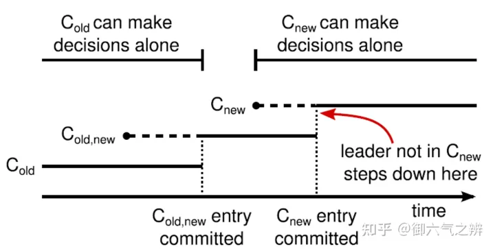

## 分布式事务

分布式事务是指跨越多个计算机和网络的多个操作同时满足ACID（原子性、一致性、隔离性和持久性）属性的事务。在分布式系统中，一个完整的业务操作可能需要跨越多个节点或数据库，而分布式事务的目标就是确保这些操作的原子性和一致性，即要么全部成功，要么全部失败并回滚。常见的分布式事务协议有两阶段提交（2PC）、三阶段提交（3PC）等。

1. 2PC。事务的提交被分为两个阶段。在第一个阶段（投票阶段），所有参与者将准备好提交事务。在第二个阶段（提交阶段），协调者会根据第一个阶段的投票结果通知参与者是否提交或者回滚该事务。如果协调者决定提交该事务，则所有参与者都将提交该事务。否则，所有参与者都将回滚该事务。
2. 2PL用于确保并发事务的正确性和一致性。在2PL中，锁被用来控制对共享资源的访问，以避免并发事务之间的干扰。2PL分为两个阶段，即加锁阶段和解锁阶段。在加锁阶段，事务需要请求并获取所需的锁，并保持锁的状态，以防止其他事务对该资源进行修改。在解锁阶段，事务会释放已经获取的锁，使其他事务可以对该资源进行修改。
3. 3PC。在2PC中，如果协调者（Coordinator）出现故障，可能会导致参与者（Participants）永久地阻塞，因为它们无法知道事务是否提交或中止。
   3PC尝试解决这个问题，将2PC中的“准备”阶段分为两个阶段：CanCommit和PreCommit（第三个阶段未DoCommit），并在CanCommit和PreCommit之间增加了超时机制，即“超时等待”阶段。
   具体来说，当协调者向参与者发送CanCommit请求后，如果参与者同意提交，则发送Yes消息；如果参与者拒绝提交，则发送No消息。如果协调者在超时时间内收到了所有参与者的Yes消息，则会进入PreCommit阶段，向所有参与者发送PreCommit请求。如果参与者同意提交，则发送Ack消息；如果参与者拒绝提交，则发送Abort消息。如果协调者在超时时间内收到了所有参与者的Ack消息，则提交操作；否则，协调者向所有参与者发送Abort请求，撤销操作。
