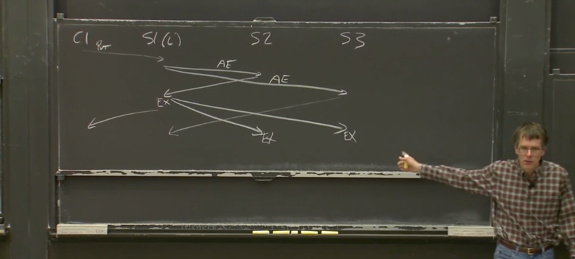

# Raft算法

分布式系统采用多台机器存储同一个数据集，不仅可以增强系统的负载能力，而且在单台机器故障的时候，其他机器可以继续提供数据的读写服务，从而提高系统的可用性。Raft算法用于解决如何在不同机器上数据集保持一致。

## 1. 简单介绍

在raft算法中，每个机器节点的状态包含三种：leader、follower、candidate。系统在时间上被划分为一系列连续的任期term，每个term的leader可以产生连续的log，如下图所示。每个任期term可以选举出一个leader，该term的leader选举出来后可以产生日志。**异常情况下，一些任期term可能选举leader会失败而直接进入下一个term，或者leader没有产生任何日志就超时从而进入下一个选举周期。**

每个raft节点仅需要保存当前leader任期，给谁投过票（保证一个节点不会向多个节点投票），日志。

leader节点需要将其产生的log复制给其他节点，当多数派节点收到log则表明该log可提交。**对于集群机器更换或者扩缩容，leader节点生成配置变更日志并且复制给其他节点来达成一致。**

此时，Raft算法需要解决三个问题：

1. **raft如何安全地选举出一个leader？**

2. **leader如何将log安全地复制到其他节点？**

3. **集群如何安全地变更机器节点？**

## 2. 如何安全地选举出一个leader？

### 2.1 选举流程

节点初始化的时候，首先进入到follower状态，一段时间内没有收到leader节点的心跳就会切换到candidate状态去竞选leader。节点进入到candidate状态后，首先将自身任期term加一，然后给自己投票，并且向其他节点广播RequestVote投票请求。candidate竞选leader的结果有三种：

1. 拿到多数派投票，切换为leader。

2. 发现其他节点已经是leader（其任期term不小于自身term），则切换为follower。

3. 选举超时后重来一遍选举流程（**比如多个candidate同时参与竞选leader导致每个candidate都拿不到多数派投票**）。

candidate每次选举时都会设置随机的选举超时时间，避免一直有多个candidate同时参与竞选。candidate竞选成为leader后，就不停地向其他节点广播心跳请求，以维持自己的leader状态同时也为了阻止其他节点切换为candidate去竞选leader。

另外有一种异常情况，**比如某个机器网络故障导致它一直收不到leader的心跳消息，那它就会切换到candidate状态，并且会一直选举超时，那它就会一直增加自身的任期term，当网络恢复正常的时候，原有leader就会收到较高任期term的请求从而被迫切换到follower状态，这样就会影响到整个集群的稳定性**。因此在工程实现的时候，candidate都会增加一个preVote预投票阶段。在预投票阶段，candidate不增加自身term而只会广播投票请求，只有拿到多数派投票后才进入正式投票阶段，这样就可以避免由于网络分区导致集群的term不断增大进而影响集群的稳定性。

最后，因为日志复制只会从leader复制到其他节点，所以在选举的时候，必须确保新leader包含之前任期所有提交的日志。

### 2.2 如何安全选举？

leader选举过程中，候选者candidate发出的投票请求协议。投票请求会带上候选者自身的任期term、candidateId、最新日志的任期term和index，其他节点收到请求后如果发现候选者的任期 >= 自身任期 并且 候选者的最新日志 >= 自身的最新日志，则回复同意。

　　每条日志的元数据包括任期term以及一个自增的日志索引。日志大小的比较规则是：先比较日志的任期term，term相同则再比较日志的logIndex。

　　下面用个例子来证明leader选举的安全性。比如有5台机器，多数派机器拥有最新提交的日志，如果此时有1台机器拿到了多数派投票成为leader，因为两个多数派必然存在交集，所以被选出来的leader，其日志必然 >= 最新提交的日志。因此可以得出1个结论：**新leader节点一定包含最新提交的日志。**

## 3. raft的日志复制以及日志安全性

### 3.1 日志复制请求

leader处理写请求过程中，向其他节点发出的日志复制请求协议。请求会带上leader自己的任期term、LeaderId、本次待复制的日志列表、上一条日志的prevLogIndex和prevLogTerm、已达到多数派一致而提交的最大日志索引commitIndex。**其他节点收到请求后，如果发现leader的任期 >= 自身任期 并且 日志一致性检查通过，则用请求中待复制的日志列表直接覆盖本地的日志，并且更新本地的commitIndex。日志一致性检查的逻辑是：自身节点已存在的日志列表中如果包含请求中指定prevLogIndex、prevLogTerm的日志，则检查通过。**

**某个follower结点未通过一致性检查则返回失败，Leader通过回退prevLogIndex和prevLogTerm直到找到与该follower相同的槽位，然后对follower结点的日志进行覆盖。**

举个例子，机器节点d作为term 7的leader节点，产生两条日志后发生异常，之后其中一台机器在term 8成功竞选成为leader并生成了一条新日志，这条新日志的logTerm为8，logIndex为11。这个新任leader在将这条新日志复制给其他节点的时候，会带上前一条日志的元数据，也就是prevLogTerm为6，prevLogIndex为10。刚开始由于只有节点c和d包含这个前一条日志而复制成功，其他节点则会拒绝复制。leader节点收到复制失败的回包后，需要往前移动待复制的日志列表然后重新发送日志复制请求。例如leader节点能够成功向节点b复制日志的请求，该请求体的内容为：前一条日志的prevLogTerm为4，prevLogIndex为4，而待复制的日志列表则包含从logIndex为5开始的所有日志。

**问题1：leader在运行过程中为什么要维护follower的nextIndex和matchIndex**。

**nextIndex 是对追加位置的一种猜测，是乐观的估计**。因此，当 Leader 上任时，会将 nextIndex 全部初始化为 last log index + 1，即乐观地估计所有 Follower 的 log 已经与自身相同。AppendEntries PRC 中，Leader 会根据 nextIndex 来决定向 Follower 发送哪些 entry。当返回失败时，则会将 nextIndex 减一，猜测仅有一条 entry 不一致，再次乐观地尝试。实际上，使用 nextIndex 是为了提升性能，仅向 Follower 发送不一致的 entry，减小 RPC 传输量。

**matchIndex 则是对同步情况的保守确认，为了保证安全性**。matchIndex 及此前的 entry 一定都成功地同步。matchIndex 的作用是帮助 Leader 更新自身的 commitIndex。当 Leader 发现一个 N 值，N 大于过半数的 matchIndex，则可将其 commitIndex 更新为 N（需要注意任期号的问题，后文会提到）。matchIndex 在 Leader 上任时被初始化为 0。

**问题2：客户端向raft集群写数据的具体流程？**

如果客户端想在raft集群中加数据，在AppendEntries中leader会设置prevLogIndex=log[nextIndex-1].index, prevLogTerm=log[nextIndex-1].term，follower会据此判断对应槽位的数据是否和leader相同，如果相同，follower会添加leader日志中[nextIndex,len(log)-1]的数据；不相同则follower向leader返回失败，leader会回退prevLogIndex和prevLogTerm，重新发送AppendEntries。如果在某段时间内leader并未收到超过半数的success，那么他会向客户端返回失败。

注意leader节点在通知follower节点添加日志时，所有的节点只是添加到了内存，并未真正提交到日志，当leader节点收到半数的success后，leader会提交将内存的内容提交到日志，同时通知其他节点提交，raft中并没有专门的committed消息，由于集群会接受大量的请求，所以leader只需要将附在AppendEntries中就行了。

**问题3：如果某个follower还未提交的时候就宕机，内存丢失了怎么办？**

事实上raft中leader并不会care你follower是否真正committed了日志，假设follower中内存丢失，下次leader再请求追加数据的时候会检查follower中的日志，正如问题二中的描述，leader会帮助follower恢复节点。

### 3.2 raft的日志匹配性质

日志复制到其他节点后，不同节点上的日志会满足一个匹配性质。不同节点上的两个日志条目，如果logTerm 、logIndex都相同，则有：

1. 由于leader节点对于给定的任期term、给定的logIndex至多创建1个日志条目，那么这两条日志必然包含相同的状态机输入。

2. **因为存在日志复制请求的一致性检查，所以这两个节点上，位于这条相同日志之前的所有日志条目必然也会相同。**

通过这个日志匹配性质，就可以总结出：**所有节点都会拥有一致的状态机输入序列。这样，各个节点就可以通过一致的初始状态 + 一致的状态机输入序列 从而 得到一致的最终状态。**

### 3.3 raft日志的提交安全性

日志成功复制给多数派节点，就可以提交，进而apply到业务状态机。但日志提交的时候存在一个限制：**不能直接提交之前任期term的日志，只能提交当前任期下的日志。**

下面这个图为例子，在集群处于状态c的时候，节点S1在term 4成为leader，并且已经将term 2的日志复制给多数派，此时节点S1将term 2的日志commit后宕机。之后集群进入到状态d，此时节点S5成为leader并且将term 3的日志复制给其他节点，这样就会导致之前已commit的term 2日志被回滚覆盖。因此为了避免这个问题，之前节点S1在任期term 4的时候，不能直接commit之前任期term的日志，只能通过将自己任期term 4的日志复制给多数派从而commit自己任期内的日志，如图中状态e所示。而一旦自己任期term内的日志得到commit，那么由于日志一致性检查的存在，那么之前任期term下的日志必然也达到了多数派一致，因此之前任期term的日志此时也可以安全地commit。

## 4. raft的集群成员变更

### 4.1 集群成员变更的问题

　　集群在扩缩容或者机器节点发生故障的时候，我们需要对集群的成员进行变更。以下图为例，如果我们直接将集群的节点配置切换到新配置，由于无法将所有节点的配置同时切换到新配置，因此存在某一个时刻，server 1和server 2可以形成老配置的多数派（因为以server1和2的认知，他们仍然认为集群中只有三个结点），server 3、server 4和server 5可以形成新配置的多数派，这样在同一个任期term内就可以选举出两个leader，使得集群产生脑裂。

　　那么如何解决这种成员变更的问题呢？有两种方式：1. 联合共识。2. 单成员变更。

### 4.2 联合共识-解决集群成员变更问题

此方法允许一次性向集群中插入多个节点而不会出现脑裂等 问题，并且整个集群在配置转换的过程中依然能够接收用户请求，从而实现配置切换对集群调用方无感知。

如下图所示的联合共识中，集群分为三个阶段。

1. 集群还在采用Cold配置，此时Cold配置中的多数派达成一致就可以做出决议。

2. **向集群写入一个Cold,new的配置后，集群进入联合共识状态，此时需要Cold配置中的多数派与Cnew配置中的多数派同时达成一致才可以做出决议。**

3. 向集群写入一个Cnew的配置，集群进入最终状态，此时Cnew配置中的多数派达成一致就可以做出决议。

**为什么这样可行？**

假设我们产生了2，3分区，分别是（1，2），（3，4，5）

* 如果此时领导者 1 还没有复制任何一条 Cold_new，那么领导者 1 不会应用 Cold_new，(1，2) 分区依然是旧配置，1是领导者；而 (3，4，5) 分区由于 3 会接收心跳超时而发起选举，但是它不会感知到 4，5 的存在，无法获取到大多数节点的投票。因此两个分区只会有一个领导者，符合预期。
* 如果领导者复制了 Cold_new 之后发生了网络分区。如果 Cold_new 没有被大多数节点确认，那么领导者 1 无法应用 Cold_new，(1，2) 依然处于旧配置状态，对外提供服务，此时 (3，4，5) 分区无论谁发起领导者选举，都无法获取到大多数选票(旧配置状态的 3)或者被联合共识 (新配置状态的 4)。
* 如果在 Cnew 阶段产生了分区，由于 raft 算法具有持久性，已经提交的 Cold_new 会永久生效，此时 (A,B) 分区无法获取大多数选票，不会选出新领导者，也就不可能发生脑裂，符合预期。

### 4.3 单成员变更-解决集群成员变更问题

单成员变更的意思就是集群每次只变更一个节点。如下图所示，在单成员变更的方式中，变更前后的两个多数派一定存在交集，也就是变更过程中不可能产生两个leader，因此采用单成员变更的方式，集群不需要引入联合共识的过渡状态。**单节点变更的方式在集群配置变更的过程中是不能对外提供工作的。**

* 网络分区成 (1，2) 和 (3，4) 两部分，如果节点 1，2此时维护的还是旧的配置，那么 1 依旧是领导者，节点 3 因为分区开始发起领导者选举，此时如果 C 维护的是旧的配置 (1，2，3)，那么此时它不会得到节点 D 的投票，无法成为领导者；节点 3 如果维护的是新的配置，那么分区中节点个数不超过一半，它依然不会变成领导者，符合预期。当分区消失之后，节点 D 由于发现自己还没有完成入集群操作，从而会继续向领导者发起“进入集群申请”，领导者便会继续走一遍上述流程。
* 如果节点1，2此时维护的是新配置，那么 (1，2) 分区由于无法获取到大多数选票而无法选出领导者，(3，4) 分区同情况 1，这样的话两个集群都不会成功选举出新的领导者。此时便可能需要人工进行介入，但是集群中依然不会存在两个领导者。
* 1，2，3在同一个分区，剩余的一个节点3在另外一个分区，此时只有包含三节点的分区能选举出领导者，正常处理请求，符合预期。当分区消失了之后，节点 4会正常接收自己缺失的日日志项，从而更新自己维护的配置信息（在这里我们可用发现，节点4虽然已经在集群中，但是在它自己看来，自己确是被孤立的节点）。同样的当分区消失之后，节点 D 会再次申请“进群”。

**为什么这样可行？**

这里，

即对于 raft 集群来说，旧配置的大多数与新配置的大多数之和一定大于新配置的节点个数。由于 raft 算法的领导者选举需要获得超过大多数选票，而当我们只新增一个节点的时候，旧配置的大多数和新配置的大多数不可能同时存在（否则必定有至少一个节点同时属于两个分区，这显然是不可能存在的），因此两个分区只有一个分区可能选举出领导者。

## 5 基于raft层实现容错的键值服务

问题1：客户端如何实现数据读写？

一开始，Client 并不知道 Leader Server 是哪台 Server。Client 可向随机一台 Server 发送 RPC 请求（Server需要达成共识）。假如请求的 Server 不是当前的 Leader Server，或者由于网络中断、Server Crash 等原因，无法与 Server 取得联系，则无限地尝试更换 Server 重新发送请求，直到请求成功被处理。这里有一个小优化，在得知 Leader Server 后，Client 可以保存 Leader 的 id，避免下次发起请求时又需要随机地选择一台 Server 多次尝试。
