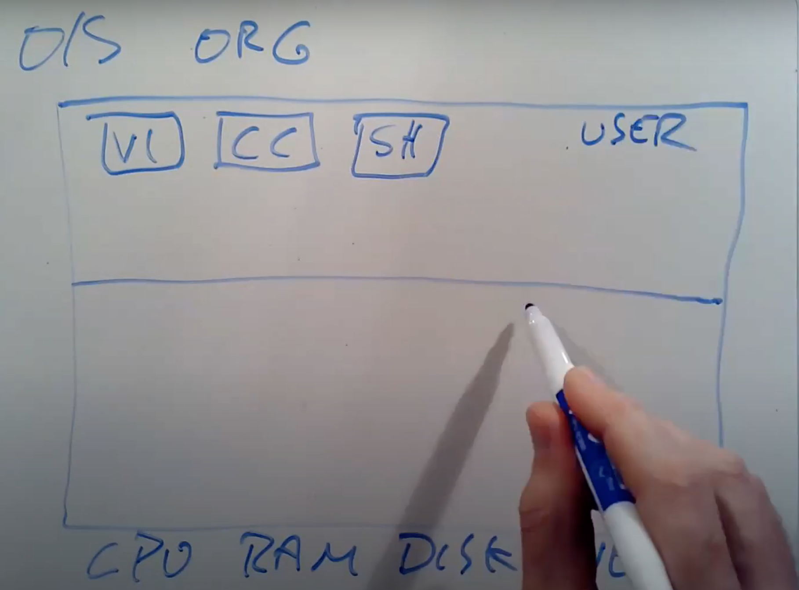
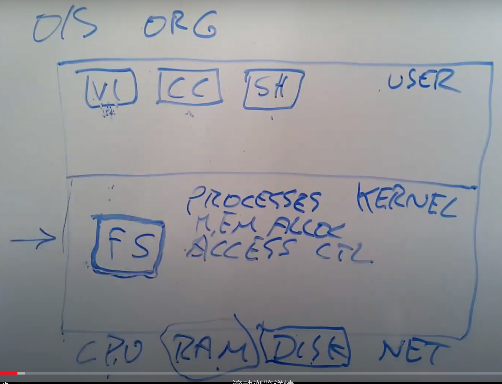

# MIT 6.S081

## Lec01 Introduction and Examples

### 1.1 课程内容简介

**课程目标**

1. 理解操作系统的设计和实现。设计是指整体的结构，实现是指具体的代码。
2. 为了深入了解具体的工作原理，通过一个小的XV6的操作系统，获得实际动手经验。通过研究现有的操作系统，并结合课程配套的实验，可以获得扩展操作系统，修改并提升操作系统的相关经验，并且能够通过操作系统接口，编写系统软件。

**操作系统的目标**

1. **抽象硬件**。通常来说，你会买一个计算机，里面包含了CPU，内存，但是这是一种非常低层级的资源。幸好我们有一些应用程序实现了高层级的接口和抽象，例如进程，文件系统。这些高层级的接口和抽象（Abstraction）方便了应用的开发，也提供了更好的移植性。
2. **在多个应用程序之间共用硬件资源**。你可以在一个操作系统同时运行文本编辑器，程序编译器，多个数据库等等。操作系统能非常神奇的在不相互干扰的前提下，同时运行这些程序。这里通常被称为multiplex。
3. 因为在操作系统中可能同时运行很多程序，即使程序出现了故障，多个程序之间互不干扰就变得非常重要。所以这里需要**隔离性**（Isolation），不同的活动之间不能相互干扰。
4. 另一方面，不同的活动之间有时又想要相互影响，比如说数据交互，协同完成任务等，所以我们需要能在需要的时候实现**共享（Sharing）**。
5. 但是在很多场景下，用户并不想要共享，比如你登录到了一个公共的计算机，例如Athena，你不会想要其他人来读取你的文件。所以在共享的同时，我们也希望在没有必要的时候不共享。这里我们称为**Security或者Permission System或者是Access Control System**。
6. 操作系统需要至少不阻止应用程序获得高性能，甚至需要帮助应用程序获得**高性能（Performance）**。
7. 对于大部分操作系统，**必须要支持大量不同类型的应用程序**。

### 1.2 操作系统结构

矩阵表示计算机，这个计算机有一些硬件资源，我会将它放在矩形的下面，硬件资源包括了CPU，内存，磁盘，网卡。所以硬件资源在最低一层。

#### 用户空间

在这个架构的最上层，我们会运行各种各样的应用程序，或许有一个文本编辑器（VI），或许有一个C编译器（CC），你还可以运行作为CLI存在的Shell，所以这些就是正在运行的所有程序。这里程序都运行在同一个空间中，这个空间通常会被称为**用户空间（Userspace）**。

#### kernel

区别于用户空间程序，有一个特殊的程序总是会在运行，它称为**Kernel**。Kernel是计算机资源的守护者。当你打开计算机时，Kernel总是第一个被启动。**Kernel程序只有一个，它维护数据来管理每一个用户空间进程。Kernel同时还维护了大量的数据结构来帮助它管理各种各样的硬件资源，以供用户空间的程序使用。**Kernel同时还有大量内置的服务，例如，**Kernel通常会有文件系统实现类似文件名，文件内容，目录的东西，并理解如何将文件存储在磁盘中。所以用户空间的程序会与Kernel中的文件系统交互，文件系统再与磁盘交互。**

在这门课程中，我们**主要关注点在Kernel、连接Kernal和用户空间程序的接口、Kernel内软件的架构**。所以，我们会关心Kernel中的服务，其中一个服务是**文件系统**，另一个就是**进程管理系统**。**每一个用户空间程序都被称为一个进程，它们有自己的内存和共享的CPU时间**。同时，**Kernel会管理内存的分配。不同的进程需要不同数量的内存，Kernel会复用内存、划分内存，并为所有的进程分配内存。**

文件系统通常有一些逻辑分区。目前而言，我们可以认为**文件系统的作用是管理文件内容并找出文件具体在磁盘中的哪个位置**。文件系统还维护了一个独立的命名空间，其中每个文件都有文件名，并且命名空间中有一个层级的目录，每个目录包含了一些文件。所有这些都被文件系统所管理。

这里还有一些安全的考虑，我们可以称之为**Access Control。当一个进程想要使用某些资源时，比如读取磁盘中的数据，使用某些内存，Kernel中的Access Control机制会决定是否允许这样的操作**。对于一个分时共享的计算机，例如Athena系统，这里可能会变得很复杂。因为在Athena系统中，每一个进程可能属于不同的用户，因此会有不同Access规则来约定哪些资源可以被访问。

在一个真实的完备的操作系统中，会有很多很多其他的服务，比如在不同进程之间通信的进程间通信服务，比如一大票与网络关联的软件（TCP/IP协议栈），比如支持声卡的软件，比如支持数百种不同磁盘，不同网卡的驱动。所以在一个完备的系统中，Kernel会包含大量的内容，数百万行代码。

#### API-kernel

我们同时也对应用程序是如何与Kernel交互，它们之间的接口长什么样感兴趣。这里通常成为Kernel的API，它决定了应用程序如何访问Kernel。通常来说，这里是通过所谓的**系统调用（System Call）**来完成。系统调用与程序中的函数调用看起来是一样的，但区别是**系统调用会实际运行到系统内核中，并执行内核中对于系统调用的实现**。现在只介绍一些系统调用在应用程序中是长什么样的。

**Q: 系统调用跳到内核与标准的函数调用跳到另一个函数相比，区别是什么？**

A: Kernel的代码总是有特殊的权限。当机器启动Kernel时，Kernel会有特殊的权限能直接访问各种各样的硬件，例如磁盘。而普通的用户程序是没有办法直接访问这些硬件的。所以，当你执行一个普通的函数调用时，你所调用的函数并没有对于硬件的特殊权限。然而，如果你触发系统调用到内核中，内核中的具体实现会具有这些特殊的权限，这样就能修改敏感的和被保护的硬件资源，比如访问硬件磁盘。

第一个例子是，如果应用程序需要打开一个文件，它会调用名为open的系统调用，并且把文件名作为参数传给open。假设现在要打开一个名为“out”的文件，那么会将文件名“out”作为参数传入。同时我们还希望写入数据，那么还会有一个额外的参数，在这里这个参数的值是1，表明我想要写文件。

~~~C
fd=open("out",1);
~~~

open是一个系统调用，它会跳到Kernel，Kernel可以获取到open的参数，执行一些实现了open的Kernel代码，或许会与磁盘有一些交互，最后返回一个**文件描述符对象**。上图中的fd全称就是**file descriptor**。**之后，应用程序可以使用这个文件描述符作为handle，来表示相应打开的文件。**

如果你想要向文件写入数据，相应的系统调用是write。你需要向write传递一个由open返回的文件描述符作为参数。你还需要向write传递一个指向要写入数据的指针（数据通常是char型序列），在C语言中，可以简单传递一个双引号表示的字符串（下图中的\n表示是换行）。第三个参数是你想要写入字符的数量。

~~~C
write(fd,"hello\n",6);
~~~

**第二个参数的指针，实际上是内存中的地址。所以这里实际上告诉内核，将内存中这个地址起始的6个字节数据写入到fd对应的文件中。**

另一个你可能会用到的，更有意思的系统调用是fork。**fork是一个这样的系统调用，它创建了一个与调用进程一模一样的新的进程，并返回新进程的process ID/pid**。这里实际上会复杂的多，我们后面会有更多的介绍。

~~~C
pid=fork();
~~~

### 1.3 Why Hard and Interesting

学习操作系统比较难的一个原因是，**内核的编程环境比较困难**。当你在编写、修改，扩展内核，或者写一个新的操作系统内核时，你实际上在提供一个基础设施让别人来运行他们的程序。当程序员在写普通的应用程序时，应用程序下面都是操作系统。而当我们在构建操作系统时，在操作系统下面就是硬件了，这些硬件通常会更难处理。在这门课程中，我们会使用一个叫做QEMU的硬件模拟器，来模拟CPU和计算机。这会简单一些，但即使这样，编程环境还是比较恶劣。

学习操作系统比较难的另一个原因是，当你在设计一个操作系统时，你**需要满足一些列矛盾的需求**。

1. **你想要你的操作系统既高效又易用。高效通常意味着操作系统需要在离硬件近的low-level进行操作，而易用则要求操作系统为应用程序提供抽象的high-level可移植接口。**所以，提供一个简单可移植，同时又高效的抽象接口需要一定的技巧。
2. **我们想要提供一个非常强大的操作系统服务**，这样操作系统才能分担运行应用程序的负担。但同时，**我们也想要有简单的接口**。我们不想程序员看到数量巨多，复杂且难以理解的的内核接口。因为，如果他们不理解这些接口，他们就会很难使用这些接口。所以，这里要提供一个简单的接口，同时又包含了强大的功能。
3. 最后一个矛盾点是所有的操作系统需要满足的。**你希望给与应用程序尽可能多的灵活性，你不会想要限制应用程序，所以你需要内核具备灵活的接口**。但是另一方面，你想要安全性，就需要在某种程度上限制应用程序。我们希望给程序员完全的自由，但是实际上又不能是真正的完全自由，因为我们不想要程序员能直接访问到硬件，干扰到其他的应用程序，或者干扰操作系统的行为。

另一件使得操作系统的设计难且有趣的点是：**操作系统提供了大量的特性和大量的服务，但是它们趋向于相互交互**。对于open和fork，它们之间也可能有交互。如果一个应用程序通过open系统调用得到了一个文件描述符fd。之后这个应用程序调用了fork系统调用。fork的语义是创建一个当前进程的拷贝进程。而对于一个真正的拷贝进程，父进程中的文件描述符也必须存在且可用。所以在这里，一个通过open获得的文件描述符，与fork以这种有趣的方式进行交互。当然，你需要想明白，子进程是否能够访问到在父进程的文件描述符fd。在我们要研究的操作系统中答案是，Yes，需要能够访问。

另一件有趣的事情，我之前也提到过，**操作系统需要能够满足广泛的使用场景**。相同的操作系统需要既给数据库服务器使用，又给智能手机使用。随着时间的推移，你的计算机所使用的硬件也在变化，或许你有了超级快的SSD存储而不是机械的硬盘。大概15年前，多核CPU计算机还极其稀有，而现在变得极其的流行。最近，我们又看到了网速以指数级增长。所有的这些都需要时不时的重新思考，操作系统是如何被设计的。

### 1.5 read, write, exit系统调用

我们的**操作系统是XV6，它运行在RISC-V微处理器上**，当然不只是RISC-V微处理器，我们假设有一定数量的其他硬件存在，例如内存，磁盘和一个console接口，这样我们才能跟操作系统进行交互。但是实际上，**XV6运行在QEMU模拟器之上。**这样能在没有特定硬件的前提下，运行XV6。

