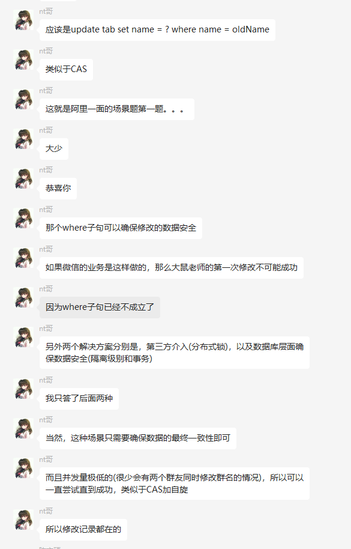

# 腾讯一面

## 操作系统

进程线程区别

**线程会共享进程哪些东西，所有的都会共享吗？**

**多线程对于进程内容的访问，需要注意哪些东西**

**如果只需要读呢？**

go的协程，细说

## 数据库

查询数据库一般做哪些优化

**如何查看用到哪些索引，这个命令可以获取哪些信息**

索引数据结构

B+和B区别，细说

为什么B做范围索引要差一点

还有哪些区别

## 计网

四次挥手，细说，

**第二次挥手之后会一直传输数据吗？**

对TIME_WAIT的理解

他举了一些例子，大概就是看对TIME_WAIT有没有深入理解

HTTPS，细说

四次握手，细节

数字证书原理，细说

握手完后续？

被劫持怎么办，他举例了很多种情况，有点忘了，就看对https的理解了

（标黑是卡壳的地方，时长45min+，无项目，无算法题，给了1min自我介绍）

